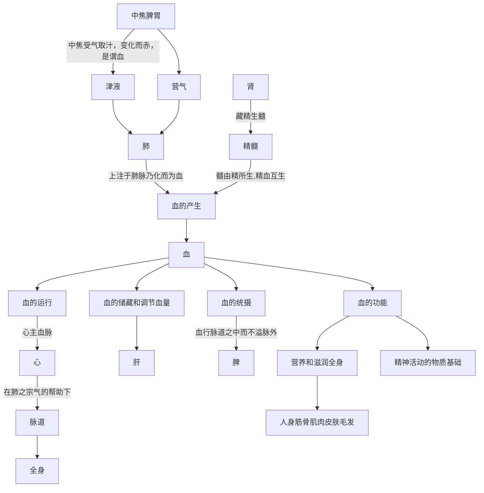

## 3.3、血

血是在心肺的共同作用下，形成的具有濡养全身脏腑组织作用的赤色液态物质。其生成与功能概括为下图：

### 1、生成与变化：

关于血的生成，宏观上来说，是人的脾胃从饮食中吸收的精华物质与津液相合，形成了血。

> 血液主要来源于水谷精微，而水谷精微的化生，有赖于脾胃的运化，所以说脾胃为气血生化之源。《灵枢·决气》说：“**中焦受气取汁，变化而赤，是谓血**”。就是说**中焦脾胃**所化生的精微物质是生成血的基本物质。
>
> 《中医药学概论-藏象-血的生成》

更具体而言，内经提到水谷精微以气态的形式注入肺脉而化生为血。

> 中焦亦并胃中，出上焦之后，此所受气者，泌糟粕，蒸津液，化其精微，上注于肺脉乃化而为血，以奉生身，莫贵于此，故独得行于经隧，命曰营气
>
> 《灵枢·营卫生会》：

> 营气者，泌其津液，注之于脉，化以为血
>
> 《灵枢·邪客》

此外，精血互转，所以精也可以转化为血。

> 此外，**精与血之间存在着相互滋生与转化的关系**。血能生精养精，精能化血生血。精藏于肾，血藏于肝，若肝血充盛，则肾有所藏，精有所资；若肾精充盈，则肝有所养，血有所充。正如张志聪在《侣山堂类辨》中说：“肾为水脏，主藏精而化血”。
>
> 《中医药学概论-藏象-血的生成》

### 2、运行与功能：

血运行于脉道之中，这里的脉相当于现代的血管。

> 脉是血液运行的通道，所以有约束营血，使之行于一定的通道而不致外溢的作用。
>
> 《黄帝内经讲解-精、气、津、液、血、脉的生成和功用》

血的运行以心为基本动力、肺为辅助动力。

> **心**主血脉，心气**推动血的运行**；**肺**朝百脉，循行周身的血都要汇聚于肺，**通过肺气宣降，敷布全身**；
>
> ...若心气虚，血行无力，可见血瘀；肺气虚，可出现气血两虚及血瘀；
>
> 《中医药学概论-藏象-血的生成》

> 中医学认为，血的运行依赖于气的推动。**心气推动，是血运行的基本动力，而心气又有赖于肺气的敷布**。正如《医学真传》所说：“气非血不和，血非气不运”。
>
> 《中医药学概论-藏象-肺、大肠》

> 肺主气，为相傅之官。**肺主宣降，而朝百脉，其宗气贯心脉，具有促进心运行血液的作用**，是血液正常运行的必要条件。
>
> 《黄帝内经讲解-藏象学说- 十二脏的生理功能及其相互关系》

在心肺动力的基础上，肝主血量的调节。睡眠和休息的时候，肌体需要的血液少，血液更多的存储于肝脏。白天和运动时，血液更多分布于肌体。这种分布的调节由肝主导，称为肝藏血。

> 肝脏能贮藏人体大量的血液，并通过肝气的调节，供给各个器官组织的需要，当人**入睡**的时候，血液随道肝气趋于平静**回流**到肝脏，使分布在其他方面的血液相对减少，当人**醒觉和运动**的时候，血液随着肝气的**布散**，运行于经脉之中，使需要的部分得到补充。...
>
> 《黄帝内经讲解-藏象学说- 肝主藏血》

脾气可以约束血在脉道中运行而不溢出脉外，称为脾统血。

> **脾**气统血，**使血行脉道之中而不溢脉外**。...脾失统摄，可出现吐血、衄血、便血等血不归经的证候。
>
> 《中医药学概论-藏象-血的生成》

所以，在心、肺、肝、脾四脏的作用下，血可以顺利的由脏腑传输到形体。

血液到达形体后，即可营养皮、肉、脉、筋、骨等组织器官。因这些组织器官皆由血转化而成，所以皮肉筋骨等形体也属于“血类”。

> “夫血者，**水谷之精微，得命门真火蒸化，以生长肌肉皮毛者**也。凡人身筋骨肌肉皮肤毛发有形者，皆**血类**也。
>
> 《黄帝内经讲解-人与自然- 精、气、津、液、血、脉的生成和功用》

血具体形成哪种组织又与脏气强弱有关，具体见后面五脏之气部分。

血是精神活动的物质基础，血的失衡，包括血虚、血热、血瘀等，可以造成精神失常。

> 此外，**血是人体精神活动**的主要物质基础。《灵枢·本神》说：“心藏脉，脉舍神。肝藏血，血舍魂”。都说明血与精神活动密切相关。故若血虚、血热或血瘀，均可出现不同程度的精神情志失常的病变。轻则失眠多梦，烦躁，重则神志恍忽，惊悸不安，或谵语、狂妄、昏迷不语。
>
> 《中医药学概论-藏象-血的功能》

> 全身脏腑组织赖心血濡养而维持其正常机能，同时又主神明，为精神思维活动的中枢，所以五脏六腑在心的协调下，才能维持正常的生理活动，假如邪气入侵心脏，就会损伤心脏，以至神气耗散，人即死亡。
>
> 《中医药学概论-藏象-心为五脏六腑之大王》

血为气之母，血中也包含能够产生气的物质，能随时补充气。  

> 血为气之母，是说气必须依附于血而存在，气需血的滋养。
>
> 《中医药学概论-气血津液的相互关系》

## 题目：

1. 血的产生：水谷精微注入---脉而化生为血，---血互转也可以产生血。
2. 血的运行以---为基本动力、---为辅助动力。---主血量的调节。---主约束血在脉道中运行而不溢出脉外。

