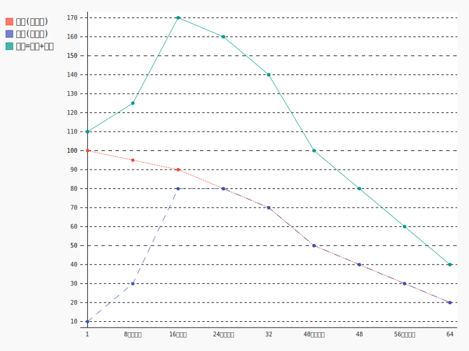

## 3.6精

### 位置：

全身及脏腑都有，以五脏为主。其中肾比较特殊，是精的大仓库。其它脏腑精不足需要肾精补充，精足可以传输到肾藏起来。

> **是故五脏主藏精者也**，不可伤，伤则失守而阴虚；阴虚则无气，无气则死矣。
>
> 《黄帝内经灵枢-本神》

> “肾者，主水，**受五脏六腑之精而藏之**，故五脏盛，乃能泻。”
>
> 《素问•上古天真论》

### 分类：

分为先天之精和后天之精

> 肾所贮藏的生殖之精，来源于父母，亦称先天之精，《灵枢•本神》说：“故生之来谓之精。”即指此而言。
>
> 肾所藏的水谷之精，来自五脏六腑，亦称后天之精，《素问•上古天真论》说：“肾者，主水，受五脏六腑之精而藏之，故五脏盛，乃能泻。”此即水谷之精。
>
> 但先天之精需要后天之精的不断充养，后天之精也需先天之精的不断促进，两者有着不可分割的关系。
>
> 《黄帝内经讲解-藏象学说-五脏功能与形体组织、四时阴阳的关系》

#### 后天之精：

“所谓五脏者，藏精气而不泻也，故满而不能实。六腑者，传化物而不藏，故实而不能满也。”

腑的作用类似炼油厂，主要是对食物（原油）进行消化提炼，吸收其中的水分、营养物质，形成供给人体的津液、营养（化工原料）、精（成品油），剩余的残渣（沥青）成为粪便排出体外。

成品油加入汽车能够直接转化为能量，精在人体里也可以直接转化为能量。

这种由饮食经过脾胃提炼得到的精成为后天之精。

> 王三尊《医权初编》说:“凡饮食先入于胃，俟脾胃运化，其精微上输于肺，肺气传布各所当入之脏，浊气下入大小肠，是**脾胃为分金炉**也。若脾胃有病，或虚或实，一切饮食药饵，皆不运化，安望精微输肺而布各脏耶？是知治病当以脾胃为先。若脾胃他脏兼而有病，舍脾胃而治他脏，无益也。又一切虚症，不问在气在血，在何脏腑，而只专补脾胃，脾胃一强，则饮食自倍，精血日旺，阳生而阴亦长矣。”
>
> 《黄帝内经讲解-五脏六腑皆禀气于胃》

##### 来源：

来源于脾胃运化的水谷之精微，脾胃对食物进行消化吸收后而获得，胃主消化，脾主吸收。

##### 使用：

脾将精传输到五脏六腑，化为脏腑之精气，维持各脏腑功能活动，多余的收藏于肾

##### 判断标准：

饮食是否正常、大便是否正常

##### 不同年龄的变化

16岁以前是因为形体不足，不能吸收大量的食物精微。

32岁以后是因为消化吸收能力下降而不能吸收大量食物精微。

#### 先天之精

##### 来源：

与生俱来,父母给予

##### 作用：

帮助后天之精的产生

与后天之精共同形成肾精(肾精作用见下面)

是人体正常寿命的主要标志，

##### 不同年龄的变化

普通人先天之精只能消耗，极难补充。

#### 肾精：

##### 来源：

先天之精加后天之精

##### 功能：

1、产生元气：

肾精化气供给各个脏腑以及全身使用。肾精不足，转化的元气不够，也可以导致脏腑、全身的阳气不足。

2、濡养各个脏腑：

肾精不足，则可能导致各个脏腑、全身的阴不足。

3、生殖：

肾精足则男子溢精、女子来潮。不足则男女不能生子。

4、人体的生长发育：

人长身体、长头发、长牙齿。肾精减少，头发枯，牙齿落，形体衰。

五脏精不足需要肾精补充，五脏精足可以传输到肾藏起来。

5、肾精滋生骨髓，充养骨骼，所以骨髓的生长、发育、修复都与肾有密切关系。脑为髓海，髓海有余，则肢体活动敏捷有力、耳目聪明、头脑清醒，智力好。

> 由于肾精滋生骨髓，充养骨骼，所以骨髓的生长、发育、修复都与肾有密切关系。例如有因先天禀赋不足，肾气虚衰，不能充养骨髓，致使小儿生长发育障碍，出现五迟（立迟、行迟、齿迟、发迟、语迟）、鸡胸（胸廓向前突出）、龟背(脊骨弯曲隆起）、解颅（头颅骨缝分裂）等症，皆可从肾虚论治。以地黄丸为主，酌加鹿茸、龟板等药。成人有因肾精亏虚，骨髓不充，出现腰脊酸痛，不能屈伸，下肢痠软，行动乏力，或因努力负重致痛，或跌仆损伤筋骨，日久不愈。凡此等等。均宜以补肾为主。
>
> 《黄帝内经讲解-藏象学说-五脏功能与形体组织、四时阴阳的关系》
>

`这里对髓做一点延伸介绍：`

`髓由肾精产生，由津液中的液作为补充。髓存在于以下几个位置：骨腔、脊柱、脑。`

`骨得到骨髓的营养，则骨骼健壮，活动有力。骨髓不足，骨骼脆弱无力。`

`脑为髓之海，是大量髓汇聚之地。充足的脑髓为大脑的活动提供了物质能量基础。脑髓不足，则头晕、目眩、耳鸣、腿酸、视力下降、无力、喜卧。`

`脊髓是髓上通于脑的通道，其它作用中医中没有特别明确说明，只是谈到髓不足的话，可造成肢体筋脉弛缓，痿弱无力，失于自行活动及行走的能力。这和脊髓相关病变的表现是一致的。`

`结合现代医学对神经的研究，我们可以做一些合理的推断：`
`髓对于神经有滋养作用。中医中对神经没有介绍，但是对于精、髓与运动思维能力的关系有比较详细的介绍。`
`所以推断，髓与神经的关系就像前面介绍气与血的关系一样，神经固然重要，但是其主导根源在于髓，如根与叶的关系，所以中医更重视精髓的调理。髓足则神经更健康，人的思维、活动能力更强。其关系如下：`
`肾精->脑髓、脊髓->{脑神经、脊柱神经}->思维能力、行动能力`

`牙齿是观察髓的充盈状态的一个指标，因为齿为骨之余，而骨由髓来营养。所以，牙齿洁白坚固代表骨质好、髓充盈。如果牙齿黄黑、松动，在排除牙龈炎、吸烟等问题后，可以代表髓的不足。`

`肾精的几大作用中，应特别注意生殖功能与生髓功能的关系。在肾精产生的量有限的前提下，如果有人长期纵欲，过度使用精的生殖功能，则会造成肾精数量减少，生髓能力下降。导致骨髓、脑髓的不足，使人的健康水平快速下降。这应该是《素问-上古天真论》中提到的“以欲竭其精，以耗散其真，不知持满...故半百而衰也”的道理。`

> 冬时肾水当令，阳气内敛，肾气闭藏，故五脏真气亦**下藏于肾，化精生髓，充养骨骼**。
>
> 《黄帝内经讲解-气血精神-真气的生成和输布》
>

> 《灵枢●经脉》云：“人始生，先成精，**精成而脑髓生**，骨为干，脉为营，筋为刚，肉为墙，皮肤坚而毛髮长”
>
> 《中医药学概论-绪论-对生命认识的唯物观》
>

> “脑户，督脉穴，在枕骨上，通于脑中，**脑为髓海**，乃元阳精气之所聚，针入脑则真气泄，故立死”。
>
> 《灵枢·海论》说：“*髓海*不足，则脑转耳鸣，胫酸眩冒，目无所见，懈怠安卧”
>
> 《灵枢·口问》也说：“上气不足，脑为之不满，耳为之苦鸣，头为之苦倾，目为之眩”
>
> “脑之为言在也，人精在脑
>
> 《中医药学概论-奇恒之腑-脑》
>

> 肢体筋脉弛缓，痿弱无力，失于自行活动及行走为主证。。	
>
> 久病体虚，或房劳过度，损伤肝肾致精血亏虚，精亏不能**滋髓养骨**，血虚不能荣筋养脉而致痿软无力。...肾主身之骨髓。...肾气热则腰脊不举，**骨枯而髓减发为骨痿**。
>
> 《中医内科学- 痿证》
>

> 髓为肾精所化生，**藏于骨腔及脊柱中，脊髓上通于脑**，为髓汇聚之处，所以《灵枢•海论》称脑为髓之海。如果肾精亏虚，髓海不足，就会出现头旋耳鸣，腿酸眩晕，视物不清，周身懈怠无力、常欲安卧等症。
>
> 《黄帝内经讲解-藏象学说-（二十一）脉、髓、筋、血、气与目、脑、节、心、肺的所属关系》
>

> 是以圣人陈阴阳，筋脉和同，**骨髓坚固**，气血皆从。如是则内外调和，邪不能害，耳目聪明，气立如故。
>
> 《素问•生气通天论》
>

##### 不同年龄的变化

丈夫八岁，肾气实，髮长齿更，

二八，肾气盛，天癸至，精气溢泻，阴阳和，故能有子；

三八，肾气平均，筋骨劲强，故真牙生而长极；

四八，筋骨隆盛，肌肉满壮；

五八，肾气衰，髮堕齿槁；

六八，阳气衰竭于上，面焦，髮鬓颁白；

七八，肝气衰，筋不能动，天癸竭，精少，肾脏衰，形体皆极；

八八、则齿髮去。

##### 判断多少：

男子溢精，女子月经来潮

齿、骨、髮的状态

内经中有通过面部形态初步判断人的先后天精气是否旺盛的方法。内容包括：

1、以额角、鼻头、下颌三处高起不平陷为好

2、以面部肌肉高厚，轮廓方正为好

3、以人中沟深而长为好

> **岐伯曰：使道隧以长，基墙高以方，通凋营卫，三部三里起，骨高肉满，百岁乃得终（2）。**
>
> 《灵枢·天年》....
>
> “三部三里”，指面部的上中下三部，分别以额角、鼻头、下颌为标志。“起”，有高起不平陷之意。....
>
> 《内经》认为，从面部的特征可以判断人的寿夭。骨为肾所主，肾为先天之本；肉为脾所主，脾为后天之本。如果人中沟深而长，面部肌肉高厚，轮廓方正，面部上、中、下三部耸起而不平陷，肌肉丰满，骨骼高起者，则提示先后天精气皆旺盛，所以人能长寿，活百岁而终其天年。
>
> 《黄帝内经讲解-寿夭与先后天的关系》

##### 肾精出入图

下图表示了肾精的出入情况

### 精的重要性

精之所以为精华是有其深刻道理的，精既可以转换为身体的阴也可以转换为身体的阳。身体阴不足的时候，精可以转换为津液、血液，身体阳不足的时候，精可以转换阳气。因此，如果精足的话，人就不虚，因为无论身体各处的阴虚、阳虚，都可以通过精的转化来补充。

反之，如果肾精不足，则脏腑组织在出现阴、阳不足的情况时，难以补充，就表现出阴虚或者阳虚的证。严重的话会影响脏腑组织的功能，出现疾病。另外，因为肾主骨生髓，肾精不足，髓得不到充养，骨髓、脑髓减少，人的运动、思维能力都下降，人就逐渐衰老。

> 肾精对各个脏腑组织所起的滋养、濡润作用称为肾阴，将对各个脏腑起到的温煦、促进作用称为肾阳。并将其称为元阴与元阳，真阴与真阳。肾中阴阳是人体各脏腑阴阳的根本，肾阴乃一身阴液之源，肾阳乃一身阳气之根，二者同居肾中，故有“肾为水火之宅”的说法。
>
> 《中医药学概论-肾、膀胱》

如果想保养身体，延缓衰老，需要尽量保持肾精的充足。达到这个目的需从开源和节流两个角度来实现。

开源即是增加肾精的补充来源，在先天之精难以补充的前提下，主要是补充后天之精。后天之精主要来自脾胃对饮食的消化吸收。

肾精的节流指的是减少肾精的无谓消耗。首先要节欲以减少生殖之精的消耗；另外不要进行过度的脑力或体力活动以免透支肾精；再有就是顺应自然规律，作息有常、饮食有节、注意寒暑变化等等，因为每一次违背自然规律的行为，都需要消耗肾精进行补偿，就增加的肾精的消耗速度。

所以，内经《上古天真论》对真、至、圣、贤的长寿之人会谈到精的问题，真人“呼吸精气”、至人“积精全神”、圣人“精神不散”等等。

### 资料

> 肾藏精，是说肾对人体之精气具有封藏的作用
>
> 《素问·上古天真论》说：“肾……**受五脏六腑之精而藏之**”。
>
> 由于肾精需五脏精气的濡养，方可充盛，若五脏功能失调，日久必累及肾，使肾中精气匮乏，而致肾的阴阳失调，故有“久病伤肾”的说法。
>
> 中医学认为：精气之间是可以而且能够相互转化的，故有“精可化气”、“气可生精”的说法，其中，肾精与肾气之间亦可相互转化，故中医古籍中，“肾气”与“肾精”常可互称。
>
> 肾中所藏之精包括“先天之精”和“后天之精”。其“先天之精”禀受于父母，与生俱来，是构成人体的原始物质。即《灵枢·决气》所说：“两神相搏，合而成形，常先身生，是谓精”。“后天之精”，来源于脾胃运化的水谷之精微，此精微转输五脏六腑，化为脏腑之精气，此精气除维持各脏腑功能活动外，所余部分，藏之于肾。故《素问·上古天真论》说：“肾……受五脏六腑之精而藏之”......
>
> 肾中所藏之精包括“先天之精”和“后天之精”。
>
> 其“先天之精”禀受于父母，与生俱来，是构成人体的原始物质。即《灵枢·决气》所说：“两神相搏，合而成形，常先身生，是谓精”。
>
> “后天之精”，来源于脾胃运化的水谷之精微，此精微转输五脏六腑，化为脏腑之精气，**此精气除维持各脏腑功能活动外，所余部分，藏之于肾**。故《素问·上古天真论》说：**“肾……受五脏六腑之精而藏之**”...
>
> 肾中所藏的“先天”、“后天”之精，二者密切相关。其“先天之精”的补充，有赖于”后天之精”的不断供养；“后天之精”的化生，又依赖于“先天之精”的资助。二者相互依存，相互补充，共同组成肾中之精，以促进人体的生长、发育，进而产生“生殖之精”，以繁衍后代。...
>
> 肾中所藏之精，为人生命之源，对人体的生长发育与生殖，起着极为重要的作用。《素问·上古天真论》说：“女子七岁，肾气盛，齿更髮长；二七而天癸至，任脉通，太冲脉盛，月事以时下，故有子；三七，肾气平均，故真牙生而长极；四七，筋骨坚，髮长极，身体盛壮；五七，阳明脉衰，面始焦，髮始堕；六七，三阳脉衰于上，面皆焦，髮始白；七七，任脉虚，太冲脉衰少，天癸竭，地道不通，故形坏而无子也。丈夫八岁，肾气实，髮长齿更，二八，肾气盛，天癸至，精气溢泻，阴阳和，故能有子；三八，肾气平均，筋骨劲强，故真牙生而长极；四八，筋骨隆盛，肌肉满壮；五八，肾气衰，髮堕齿槁；六八，阳气衰竭于上，面焦，髮鬓颁白；七八，肝气衰，筋不能动，天癸竭，精少，肾脏衰，形体皆极；八八、则齿髮去”。此段论述，指出了人体的生、长、壮、老、已的自然规律，与肾中精气的盛衰密切相关。
>
> 人自幼年开始，肾精逐渐充盛，出现齿更髮长的勃物生机。
>
> 随着“先天之精”与“后天之精”的相互滋养，肾中精气日益充盛，产生出促进生殖机能成熟的物质。中医学称之为“天癸”。于是男子溢精，女子月经来潮，从而具备了生殖能力。
>
> 此后，随着年龄的变化，肾精由充盛而逐渐趋向衰退，天癸的生成也逐渐减少，以至耗竭；生殖能力亦相应而下降，以至消失。其次，论中明确指出人体齿、骨、髮的生长状况，是观查肾中精气盛衰的标志，它亦是判断人体生长发育和衰老的标志**。由于肾中精气的盛衰，直接影响到人体的生殖机能**，所以当肾藏精的生理功能发生病变时，常会导致生殖机能的种种病变，而对于性机能和生殖机能的病变，采用治肾的疗法，多获良效。同时，由于肾中精气的盛衰，直接影响到人体的生长和发育，出现种种病理变化。对于这些病变，常用补肾填精的方法进行治疗，亦每可收到良效。
>
> 肾中之精，对各个脏腑的功能活动起着极其重要的作用。中医学认为：精气之间是可以而且能够相互转化的，故有“精可化气”、“气可生精”的说法，其中，肾精与肾气之间亦可相互转化，故中医古籍中，“肾气”与“肾精”常可互称。此外中医学为了更好地说明肾中精气的生理功能，常将肾中精气的功能活动，概括为肾阴与肾阳两个方面。它把**肾精对各个脏腑组织所起的滋养、濡润作用称为肾阴**，将**对各个脏腑起到的温煦、促进作用称为肾阳**。并将其称为元阴与元阳，真阴与真阳。肾中阴阳是人体各脏腑阴阳的根本，**肾阴乃一身阴液之源**，**肾阳乃一身阳气之根**，二者同居肾中，故有“肾为水火之宅”的说法。在正常情况下，肾阳与肾阴，相互制约，相互为用，维持着肾及各个脏腑的阴阳相对平衡。但当此平衡受到破坏时，常可形成肾阳虚与肾阴虚。其中肾阳虚常可见到形寒肢冷，腰膝无力，小便清长或不利，舌质淡，舌象水滑，以及下肢浮肿等症状。若肾阴不足，常可呈现五心烦热，头晕耳鸣，小便黄赤，舌红少津，面色枯槁等症状。同时，由于肾阴与肾阳的失调影响其它脏腑时，亦可见到其它脏腑的阴阳失调，如心阴失去肾阴的滋养，则可出现心火上炎的证候；如肝阴失去肾阴的濡润，则可呈现肝阳上亢，水不涵木的病证；如若脾阳失去肾阳的温煦，则可出现下利清谷，五更泄泻的脾肾阳虚之证；若心阳失去肾阳的温养，则可出现汗出肢冷，心悸脉迟的心肾阳虚之证。同时，由于**肾精需五脏精气的濡养，方可充盛**，若五脏功能失调，日久必累及肾，使肾中精气匮乏，而致肾的阴阳失调，故有“久病伤肾”的说法。其中亦包括肾阴、肾阳的长久失调而导致的“阴损及阳”与“阳损及阴”的肾阴阳两虚之证。此外，若肾中精气虚损，而其阴阳失调之证尚不明显时，临床上常称为“肾精不足”与“肾气虚”。
>
> 《中医药学概论-藏象-肾、膀胱》

> 《素问·五藏别论》说：“所谓五脏者，藏精气而不泻也，故满而不能实。。。。。这段话是说：五脏的主要功能是藏精气。。。。。
>
> 《中医药学概论-五脏六腑》

> ***夫精者，身之本也。故藏于精者，春不病温。***
>
> 《素问•金匮真言论》

> *然上文既云气归精，是气生精也；而此又曰精化气，是精生气也。二者似乎相反，而不知此正精气互根之妙也。*
>
> 《黄帝内经讲解-味、形、气、精的阴阳互用关系》

> **两神相搏，合而成形，常先身生，是谓精(2)**...
>
> 对新形体而言，精是在形体尚未形成之前就已存在的物质，是繁衍后代，构成形体的基本物质。...
>
> **精者，血之精微所成，生气之所依也**。生气者，卫气之根，即命门真火是也，精竭，则生气绝矣。
>
> 《黄帝内经讲解-气血精神-精、气、津、液、血、脉的生成和功用》

> 马莳注：“面之三里，即三部也，皆已耸起。”《内经》认为，从面部的特征可以判断人的寿夭。骨为肾所主，肾为先天之本；肉为脾所主，脾为后天之本。如果**人中沟深而长，面部肌肉高厚，轮廓方正，面部上、中、下三部耸起而不平陷**，肌肉丰满，骨骼高起者，则提示**先后天精气皆旺盛**，所以人能长寿，活百岁而终其天年。当然，通过望面部特征，测候先后天精气盛衰的方法，判断寿夭有一定的道理，但是不能将面部特征与寿夭的关系绝对化，应结合全身其他方面情况综合考虑。
>
> 《黄帝内经讲解-藏象学说-寿夭与先后天的关系》
>

## 题目

1. 精为人体之宝，既能化阳也能化阴。精足的话，无论身体出现阴虚或者阳虚，精都可以进行补充，则调节能力强，不容易生病，万一生病也容易痊愈。精存在于脏腑之中，以五脏所藏最多。五脏之中，尤其以----脏为大仓库，是藏精之所。
2. 人衰老的根源是肾精的减少。因为肾之华在发，所以头发的状态可以作为肾精的一个指标。又因为肾有主骨生髓的功能，而齿为骨之余，所以牙齿的状态也可以作为肾精的一个指标。头发润泽、牙齿坚固是肾精充足的表现。《素问·上古天真论》谈到人不同年龄，随着肾精的减少，有不同的衰老表现。比如男子在五八四十岁左右的时候，会出现肾气衰，髮堕----槁的现象。