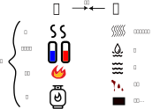

# 第四章 人体运行框架

## 1、运行框架

通过第三章的学习，我们应该建立起一个人体运行的基本框架。 

### 1.1、功能与形体

人体的主要功能是行动、思维、感受、表达及抵御外邪。功能正常需要头、四肢、身躯的皮、肉、脉、筋、骨等形体组织能正常工作，因此形体为功能之本。

### 1.2、形体与气血

形体组织能正常工作需要其处在一个适宜的人体内部环境中。适宜的人体内部环境由气血等要素维持，因此气血为形体之本。

> **形与气相任则寿，不相任则夭。皮与肉相果则寿，不相果则夭。血气经络胜形则寿，不胜形则夭。**...
>
> **气血**等基本物质，经络等脏腑组织的功能，是**人体的根本**，而人体的躯壳好象树木的枝叶。如果气血的强盛胜过形骸，是人体生命力旺盛的表现，就长寿。反之，如果不能胜过形骸，就夭亡。
>
> 《黄帝内经讲解-寿夭与先后天的关系》

形体与气血应匹配。形体大而气血过少，或者形体小而气血过多皆为失衡。

> 形盛脉细，少气不足以息者危。形瘦脉大，胸中多气者死。形气相得者生。
>
> 《素问-三部九候论》

> 正常形体应是“形气相得”，即形与气平衡协调。无论是形盛于气，还是气盛于形，都是不符合“形气相得”的原则，因而都不是健壮的形体。至于“形气相失”，那更是有病难治。
>
> 《中医药学概论-诊法-望形体姿态》

在平衡范围内，如果气血供应量适度超过形体的正常需求，则人精力旺盛、活泼好动。如果气血低于形体的需求，则人气力不足、身体沉重。因此，人一旦出现肢体沉重的现象，就要注意补充气血、疏通经络。否则形体组织就开始弱化，容易先在眼、耳、口、鼻等关键且脆弱的孔窍部位出现病变。

> **四肢才觉重滞，即导引、吐纳、针灸、膏摩，勿令九窍闭塞；**
>
> 《金匮要略讲解-脏腑经络先后病脉证第一》

形体组织的变化一般延后于气血变化。气血失衡持续一段时间后，形体组织上会有可见的病态改变。气血恢复平衡后，需要保持一段时间，病态的形体变化才可能恢复正常。这与温室花园里的环境失衡后，花草会逐渐枯萎；环境恢复平衡后，花草需要一段时间才能长好，是一个道理。

全身各处获得的气血应充足且均匀，同时在均匀的基础上，上、下、内、外有一定差别。这种差别即为气血分配角度的阴阳。这与自然界的水、土、气、阳光等资源应均匀分配，但是又随着方位的差异而有所不同一样。

### 1.3、气血与脏腑经络

气血等要素由脏腑产生，由经络系统主导输送。脏腑功能强健，则可以产生足够气血。脏腑功能虚弱，则气血不足。因此脏腑为气血之本。

气血的产生过程中，五脏的作用最大，比如五脏藏神、心主血脉、脾主消化吸收、肾藏精、肝藏血、肺主气等等，所以五脏功能最为关键。若五脏失衡，对人体要素的产生、体内环境的形成影响最大。病至五脏就非常严重，所以内经说“治五藏者半死半生”。

> 帝曰：人有精气、津液、四肢、九窍、五脏十六部，三百六十五节，乃生百病，百病之生，皆有虚实。今夫子乃言有余有五，不足亦有五，何以生之乎？
>
> 岐伯曰：**皆生于五脏也。夫心藏神，肺藏气，肝藏血，脾藏肉，肾藏志，而此成形**。志意通，内连骨髓而成身形五脏。五脏之道，皆出于经隧，以行血气。血气不和，百病乃变化而生，是故守经隧焉。
>
> 《素问-调经论》

> **邪风之至，疾如风雨，故善治者治皮毛，其次治肌肤，其次治筋脉，其次治六府，其次治五藏，治五藏者，半死半生也。**
>
> 《素问-阴阳应象大论》

五脏之中，心肺为上焦。因心主血脉，肺主呼吸，两者共同产生宗气，推动营卫气血流转于全身。其所需的能量物质大多来自中下焦的肝、脾、肾。所以五脏以此角度细分的话，中下焦的肝脾肾为上焦心肺之本，而上焦心肺为形体气血之本。

> 上部无脉，下部有脉，虽困无能为害。所以然者，人之有尺，譬如树之有根，枝叶虽枯槁，根本将自生。脉有根本，人有元气，故知不死。
>
> 《难经-十四难》

> 曰：五脏俱等，而心肺独在鬲上者，何也？
>
> 然：心者血，肺者气。血为荣，气为卫，相随上下，谓之荣卫。通行经络，营周于外，故令心肺独在鬲上也。
>
> 《难经-三十二难》

脏腑相比较，脏为主，腑为辅。脏在内，主吸收存储后天之精并转化阴阳气血供给全身。腑与外部相通，既是饮食地气入脏的通道，也是脏的代谢废物和邪气的排出通道。

两者从正邪角度看，脏给腑提供正气，腑帮助脏排出邪气。正气方面，脏将精转化为阴阳气血提供给腑，若脏器正气虚，不能传正气于腑，则腑也会跟随虚弱。邪气方面，阴脏在内，难以直接排邪，其产生的废物、邪气应传输到腑，再由腑排出体外。如果腑不通，会导致脏之邪也排不出去，进而引起脏器邪实的病证。

由于脏与腑的这种独特关系，所以脏病虚证较多，因为若其正气不虚而只有邪气实，通常会自动将邪气排出到腑。五脏若出现邪气多的情况，往往有以下几种原因：1、脏气过虚，无力排邪到腑；2、脏产生的邪气太多，超过腑排邪的能力；3、腑器堵塞，无法为脏排邪；

而腑病实证较多，因为如果其正气虚，则脏会为其补充。六腑出现虚证，原因多为：1、脏气不足，不能为腑补充足够正气；2、腑消耗的正气太多，超过了脏为其补充的量。

治法上，五脏常补，六腑常泻。中医概括为“五脏以补为先，六腑以通为用”。对五脏进行补虚泻实的时候，如果六腑通畅，可以直接补泻。如果六腑不通畅，则需兼顾通腑，否则五脏的补泻皆难以奏效。这是脏腑表里关系的重要体现。

> 太阳与少阴为表里，若少阴阳气充实，则太阳阳气不虚，卫外有力，寒邪不能内传
>
> 《伤寒论讲解-283条》

> 由于五脏以藏为主，治疗上常以补为先；六腑以通为用，治疗多以泻为主。
>
> 《中医药学概论-五脏六腑》

> 夫胃、大肠、小肠、三焦、膀胱，此五者天气之所生也，其气象天，故泻而不藏。此**受五藏浊气，名曰传化之府**，此不能久留，输泻者也。
>
> 《素问-五藏别论篇第十一》

经络、血脉、三焦作为要素传递通道，需畅通无阻，使要素能充足、均匀的分配于全身。各通道中，以经络通畅为主导。

### 1.4、脏腑与精

脏腑功能的强健，需要脏腑的阴阳平衡，即能量与物质充足且配合协调。脏腑阴阳来自脏腑所藏之精，精可以补阴阳，精足则脏腑不易失衡。精不足则脏腑功能虚弱。精亡则脏腑失去功能。因此脏腑所藏之精为脏腑之本。

各脏腑精足才能藏精于肾，因此肾精为各脏腑精气的代表。又肾主生殖，生殖能力强则代表肾精充足，进而代表各脏腑精气充足。因此内经以能否有子作为身体健康的重要标志。

> 肾者主水，受五脏六腑之精而藏之，故五脏盛，乃能泻。
>
> 今五脏皆衰，筋骨解堕，天癸尽矣，故发鬓白，身体重，行步不正，而无子耳。
>
> 帝曰：有其年已老，而有子者，何也？
>
> 岐伯曰：此其天寿过度，气脉常通，而肾气有余也。此虽有子，男子不过尽八八，女子不过尽七七，而天地之精气皆竭矣。
>
> 帝曰：夫道者年皆百岁，能有子乎？
>
> 岐伯曰：夫道者能却老而全形，身年虽寿，能生子也。
>
> 《素问-上古天真论》

### 1.5、精与先后天之本

脏腑所藏之精分别来自先天与后天。后天之精主要来自脾胃，人无胃气则亡。先天之精主要存于肾与髓，若耗尽，人亦亡。因此脾胃被称为后天之本，肾被称为先天之本。

> 脾脉者土也，孤藏以灌四傍者也。
>
> 《素问-玉机真藏论》

> 胃者，五藏六腑之海也，水谷皆入于胃，五藏六腑皆禀气于胃。五味各走其所喜，谷味酸，先走肝；谷味苦，先走心；谷味甘，先走脾；谷味辛，先走肺；谷味咸，先走肾。
>
> 《灵枢-五味》

人体的形、气血与脏腑所藏的后天之精皆来自对自然界天气、地气的吸收，所以呼吸与饮食都很重要。

> 天食人以五气，地食人以五味。五气入鼻，藏于心肺，上使五色修明，音声能彰。五味入口，藏于肠胃，味有所藏，以养五气，气和而生，津液相成，神乃自生。
>
> 《素问-六节藏象论》

普通人都知道饮食、呼吸重要，但是难以意识到脾胃吸收能力的区别，所以中医重点提示这一点。

> 地之五味由口摄入，贮藏于肠胃，经过脾胃的消化转输，水谷精微得以充养五脏之气。故在一般情况下，食欲旺的人，五脏精气相应充足；食欲差的人，五脏精气相应衰少。《灵枢•五味》说：“谷不入，半日则气衰，一日则气少”。说明五脏之气的盛衰，与摄取饮食的多少有密切的关系。
>
> 《黄帝内经讲解-人类生存的自然条件》

人一日三餐，饮食留于肠胃。胃空虚的时候，水谷在肠。肠空虚的时候，又有水谷补充到胃。肠与胃交替保存着水谷，保证人一直有地气可以吸收。若肠胃都空虚，人无地气补充，就快要死亡了。由此可见，人体吸收后天之精，补充五脏精、气、津、血，是持续性的，不能中断。

> 肠胃之长，凡五丈八尺四寸，受水谷九斗二升一合合之大半，此肠胃所受水谷之数也。平人则不然，**胃满则肠虚，肠满则胃虚，更虚更满，故气得上下，五脏安定，血脉和利，精神乃居，故神者，水谷之精气也**。故肠胃之中，当留谷二斗，水一斗五升；故平人日再后，后二升半，一日中五升，七日五七三斗五升，而留水谷尽矣；故平人不食饮七日而死者，水谷精气津液皆尽故也。
>
> 《灵枢-平人绝谷第三十二》

肠胃主要功能是消化、存储水谷，而水谷精华的吸收过程是由脾来完成的，在肠胃补充水谷充足的情况下，脾的吸收能力就成为关键因素。现代社会疾病，因脾功能弱，对水谷的吸收不充分，造成五脏精气不足，进而造成的疾病的情况非常普遍。

### 1.6、神与其它

神总管以上全部过程，无论是高级的意识思维还是低级的人体本能，所有平衡过程都由神来控制。若神的控制能力强，则即便精、气、血、形的数量稍少，也能配合的很好。反之，如果神的控制能力弱，则即便其它要素较多，也可能出现分配不合理的情况。

### 1.7、小结

人体以五脏为中心，吸收天地之气，生成并存储精、神、元气、气态物质、液态物质（血、津液）等要素，再以经络系统为主导，将要素传递到全身组织器官，形成适宜的体内环境，完成人体的整体功能活动。这个过程如果换成现代语言描述，就是指用能源、能量、控制信号、物资等要素动态构建一个生态环境。这些构建活动从人出生开始，一直运转不息，直到死亡结束。其间，任何一个环节出问题，都会形成疾病。关键环节出问题，就会死亡。

这个人体生态环境的构建是动态的，其维持过程包含很多因果（标本）关系。上述功能、形体、气血、脏腑经络、精、神是其中比较主要的部分，相互之间皆如树干与树根的关系。根为干之本，树根有问题必然影响树干，而树干的问题则即可能来自树干本身也可能来自树根。 形体组织的损伤可能是其本身受到外力冲击造成，也可能是气血未能对其进行濡养造成。气血的问题可能是其本身问题，比如气受寒、血中毒等原因造成，也可能是脏腑经络失衡未能正常产生和传输气血造成。脏腑的失衡可能是其本身问题也可能是精衰神乱造成。所以在治病时，并非哪里发病就治疗哪里，而要分析根源，以治本为主，除非紧急或特殊情况才以治标为先。**明辨标本，急则治标，缓则治本**。这就是中医的整体观。

> 阴阳者，天地之道也，万物之纲纪，变化之父母，生杀之本始，神明之府也，**治病必求于本**。
>
> 《素问-阴阳应象大论》

> **夫标本之道，要而博，小而大，可以言一而知百病之害**。言标与本，易而勿损，察本与标，气可令调， 明知胜复，为万民式，天之道毕矣。
>
> 《素问-至真要大论》

中医整体观是人体运行的大框架。框架中的每个部分都包含很多知识。在总体框架下学习，中医知识就有条理次序。不掌握整体观，中医知识会显得杂乱无章。

对于中医整体观，不同人群认知的深浅不同。普通人认知最浅，通常只在功能出问题，比如无法行动，昏迷，疼痛，不能视听，出现饮食、呼吸、排便困难等等情况时，才会意识到疾病的发生；而高一级的认知可发现形体组织、津液、血等地气层面的问题；再高级的认知可到天气与能量层面；再高级可到精、神层面，即能源与控制的问题。

## 2、指标失衡-证

### 2.1、证的概念

人体的脏腑经络、皮肉脉筋骨、头项胸腹肩背腰、四肢关节等全身各部位，都需要阴阳气血等要素来维持其环境平衡，也都有可能出现各自的失衡。比如肝可以有精的虚实、神的虚实、元气的虚实、天气的虚实、地气的虚实等等，肺、心、脾、肾也是如此，皮、肉、筋、骨也是如此。**这类要素的失衡就是中医的证。**

教材《概论》的辨证章节，只是列出了一些常见的情况，比如肝只列出了肝气郁结、肝火上炎、肝火上亢、肝风内动、 肝胆湿热、寒滞肝脉等几种情况，这些应只是肝失衡的常见情况，并非全部，其它部位也是类似。

证的基本类型如下表：

|      | 精     | 神       | 元气       | 气                                 | 血                  | 津液   | 形                                   |
| ---- | ------ | -------- | ---------- | ---------------------------------- | ------------------- | ------ | ------------------------------------ |
| 正虚 | 精不足 | 神不足   | 阳虚       | 气虚                               | 血虚                | 津液虚 | 肉槁、骨陷                           |
| 邪实 | 精浊   | 七情太过 | 阳亢、郁热 | 六淫太过、 气郁、气滞、气逆... | 血瘀、血热、血寒... | 痰饮   | 宿食、瘿、瘤、 积、聚（癥瘕）... |

> **血、脉、营、气、精、神，此五藏之所藏**也。
>
> 《灵枢-本神》

> 帝曰：人有精气、津液、四肢、九窍、五脏十六部，三百六十五节，乃生百病，百病之生，**皆有虚实**。
>
> 《素问-调经论》

> 癥瘕之病，即积聚之别名。
>
> 《景岳全书-妇人规》

下图表示人体某部位的常见的正虚邪实关系。

辨证论治就是要分辨出哪些部位分别有哪种失衡？程度如何？即辨别病位、病性和程度，进而进行对证治疗。

> ...六经病证中，每经病皆有表里、寒热、虚实、阴阳之分证...
>
> 《伤寒论讲解-243条》

> 近代医家蒲辅周曾提出过：任何一脏皆有气血阴阳，肝脏也不例外...
>
> 《肝病证治概要（刘渡舟）-十章肝虚证治-五肝阳虚》

### 2.2、证的组合

从指标角度看，几大指标可以单个失衡也可以组合失衡。阳虚就是单指阳气这指标不足的失衡。痰热就是两个指标痰与热过量的失衡。比如伤寒论的小陷胸汤证，是胃脘（又叫心下）部位的痰热互结，属于在一个部位上有两个指标（痰、热）失衡。

从部位角度看，也可以有多个部位同时失衡。比如大青龙汤证，是内热外寒，属于内有热、外有寒两个部位的组合失衡。小青龙汤则是外寒内饮，也是两个部位的失衡，分别是外有寒和内有饮。

> 小结胸病，属**痰热互结**，法当清热开结涤痰，用小陷胸汤治疗。本方由黄连、半夏、栝蒌实组成。黄连苦寒，苦降下，寒胜热，为清泄**心下**热结最得力的药物；半夏辛温滑利，开结气，化痰蠲饮；栝蒌实甘寒滑利，有润便化痰之功，配黄连以清热，协半夏以蠲饮。三药合用，痰热各自分消，则无结滞之患。
>
> 《伤寒论讲解-138条》

> 寒邪闭表而不能入里，阳气内郁而不能外泄，从而形成**表寒内热**之证。此时用麻黄汤则无清里之效，用白虎汤则证未见烦渴引饮，尤其是寒邪在表，则易冰伏其邪。故治用*大青龙汤*，峻汗以解表闭，清里以除烦躁，为表里两解之法。
>
> 《伤寒论讲解-38条》

> 小青龙汤主之：证为外寒内饮，故用小青龙汤外散风寒，内消水饮，以达到表里两治的目的。
>
> 《伤寒论讲解-40条》

人体有很多部位，每个部位又有多种性质的失衡。各种部位、证型进行组合、变化是非常复杂的。

> 然临床上由于瘀血为病伴有其它因素，这就必须在“活血祛瘀法中佐以行气药”的基础上加以兼顾。其有寒者，兼以温经散寒；其有热者，兼以凉血清热；其有湿者，兼以行水利湿；其有燥者，兼以滋血润燥；其有风者，兼以祛风和肝；其有痰者，兼以燥湿化痰；其有气滞者，兼以理气；其有坚结者，兼以软坚；其有痞塞者，兼以泻痞；其有脾虚者，兼以建中；其有气虚者，兼以益气；其有血虚者，兼以养血。还有正气虚弱，不能运血，以致血液瘀滞，而为正虚瘀微者，则治又当专补正气，使正复而瘀自化
>
> 《金匮要略讲解-惊悸吐衄下血胸满瘀血病脉证治第十六-十一》

### 2.3、证与功能的关系

人体每个部位都有其特定的功能。当该部位出现环境失衡后，其功能就会出现异常。比如肌表部位功能包括护卫身体、出汗排邪等。当肌表要素失衡后，就可能出现怕冷，怕热，出汗异常，身体疼痛等问题。再如胃的功能是消化食物，其环境失衡后，可能出现呕吐、吃不下饭、喜冷饮或喜热饮等问题。可见不同部位的失衡会有其特殊表现，在以后的学习中要能仔细捕捉这类表现。比如大青龙汤证内热外寒的特异表现为“不汗出而烦躁”;小陷胸汤证为“心下部位按之痛，脉浮滑”。小青龙汤证则为“遇寒而咳，咳吐白痰、舌苔水滑、脉弦”等等。

> 辨桂枝证重在汗出；辨麻黄证重在无汗；辨大青龙证重在**不汗出而烦躁**，如此则临证方有所本。
>
> 《伤寒论讲解-38条》

> 小结胸病，正在**心下，按之则痛，脉浮滑**者，小陷胸汤主之。
>
> 《伤寒论讲解-138条》

> 小青龙汤……寒饮射肺之咳喘，多在寒冷季节发作，常**咳吐大量白色泡沫样痰**，且落盂成水，或咳嗽吐白色半透明胶粘之**冷痰**，宛似蛋清。寒饮郁遏阳气，若见面色青暗或黧黑，则谓之“水色”：寒饮阻滞营卫气血，若致面部出现块块色斑，则谓之“**水斑**”；水饮上泛，若致使面部庞浮或眼睑轻肿，则谓之“水气”。水气、水斑、水色，以及舌苔水滑、脉弦等，皆为辨寒饮内盛之依据。
>
> 《伤寒论讲解-40条》

### 2.4、阴证与阳证  

不同部位的功能不同，所以重要程度也不同。同样的失衡，发生在重要部位就很严重，发生在不重要部位就影响不大。

人体以五脏最为重要。若五脏功能强健，则人体正气充足，抗邪有力。五脏失衡，则精、神受损，产生气、血、津液的一些关键环节受到破坏，使人体产生正气的能力下降，无力抗邪。

若失衡部位只在形体或六腑，五脏正常，则有足够正气抵抗外邪，大多表现为正邪相争剧烈的整体实证，内经称之为“阳道实”。此时人体机能多呈现为亢奋状态，所以叫**阳证**。

若失衡部位在五脏，则正气不足，虽邪气较多却无力相抗，成为整体虚证，内经称之为“阴道虚”。此时身体机能多呈现为低沉状态，所以叫**阴证**。

阳证与阴证的核心划分标准就是正气的充足程度。阴证为根本受伤导致正气不足，无力抗邪，所以较阳证更严重。

> 岐伯曰：阳者天气也，主外；阴者地气也，主内。故**阳道实，阴道虚**。故犯贼风虚邪者阳受之，食饮不节，起居不时者，阴受之。阳受之则入六腑，阴受之则入五脏。入六腑则身热不时卧，上为喘呼；入五脏则瞋满闭塞，下为飧泄，久为肠澼。
>
> 《素问-太阴阳明论》

以国家为例，通俗的理解阴证、阳证。当发生战争时，阴证就是首都等重要城市受到攻击，非常危险。阳证就是国家边境受到攻击，未波及首都等重要城市。阳证转阴证就是敌人由边境进攻到首都。阴证转阳证就是反击将敌人由首都赶到边境。简单的说，就是阴证近死，阳证近生。

《中医药学概论》的辨证章节，有阴阳、表里、寒热、虚实的八纲辨证之说；内经讲“善诊者，察色按脉，先别阴阳”。这些地方提到的阴阳就是指阴证、阳证。即人体生病时，总体上是处于五脏健康、气血充足、抗邪有力、拒邪于表或腑的状态，还是五脏虚弱、气血不足、抗邪无力、邪气内侵的状态。其次才是一些局部部位的阴阳失衡情况。阴证之人面色晦暗、脉象沉细而微弱无力，阳证之人面有光泽、脉象浮大而有力。阴阳不分，举手便错！

阴证、阳证是人体生病时，宏观上的正邪状态。在微观局部部位，则各处都可以有自身的寒热虚实的失衡情况。可以将局部的正邪相争理解为战术层面，整体的正邪相争理解为战略层面。

比如，一个人的肺部正气不虚，但有痰饮，所以是肺部邪实的情况。肺脏为五脏之一。肺部痰饮影响了肺部的功能，使其呼吸功能变弱，进而不能给全身提供充足的气，使全身都处于虚弱状态。这种情况，从整体角度看，属于整体正气不足的阴证，但是从肺部看，属于肺部正邪相争的局部实证（肺属五脏，脏气不虚的情况下，大多会排邪到腑，但也有排不出的特殊情况）。

再如，一个人的肌表部位气不足，为肌表气虚的证。肌表、形体、六腑都是以五脏为根。如果该人五脏无病，只要加强五脏的气血输出，同时再注意经络通道的通畅，则肌表气虚的情况可以很快解决。所以虽然肌表、形体、六腑都可以有虚证，但是真正的虚证是指五脏虚。只要五脏不虚，其它部位的虚证比较容易解决。

纯阴证和纯阳证是两种极端情况。纯阴证多发于老弱之人，五脏衰弱，正气非常不足。纯阳证多发于身体强壮的年轻人，五脏健康，正气充足。大多数人的状态处在两者之间，各脏腑经络功能有一定下降，但是还不算特别衰弱。所以辨阴阳，多是辨偏阴证、偏阳证，少见绝对的阴证、阳证。一般以病位主要在阳经、腑器、形体为偏阳证，病位主要在阴经、脏器、骨髓为偏阴证。

八纲辨证，首辨阴阳。其目的是确立病人体内正、邪的大格局，以决定治疗的大方向。偏阴证之人，以调理五脏，培养正气为主，祛邪为辅。偏阳证之人，以祛邪为主，养正为辅。阴证之人在治疗好转过程中，随着正气的恢复，通常会驱邪外出，从而经历一个正邪对抗表现激烈的阳证阶段。

光确立治疗大方向，还不足以进行具体的治疗。阴证、阳证各有更细的病位、病性划分，需要进一步明确后才能选择合适的治法，这是以后的内容。

### 2.5、病证的复杂性

人体病证的产生和分布可以是非常复杂的。下面从时间的先后关系和空间的分布关系两个角度来说明其复杂性。

#### 2.5.1、不同证在时间上的先后因果关系

人体不同部位互相协作，产生并传输阴阳气血来动态维持体内环境。当一个环节失衡后，经常会引发连锁反应，所以证之间经常互有因果关系。下面举例说明：

1、有人先有情绪过度的神病，导致神对气的调控失常而产生气郁、气逆的证。而气为血之帅，气的失常进而可以导致痰饮、血瘀等证。

2、也有因外伤或者妇女生产等原因导致先有血瘀。瘀血可以影响气的运行，出现气郁、气滞。瘀血也可能影响神，产生狂躁、抑郁的情况。

3、还有人是先受外感风寒，产生经络的气病，然后影响水、血的传输，形成痰饮、瘀血等等。

4、还可以是先有虚证再引发实证。比如某人脾胃虚弱却饮水多，多余的水就会变为痰饮。痰饮在身体的不同部位，会干扰各个部位的功能而产生继发病症。

5、还有人是因嗜酒、嗜食辛辣，导致肠胃湿热，进而造成大便排邪不畅。代谢废物排出不畅就会积聚于体内，甚至留于脏腑，形成脏腑邪实的病证。

> 例如：外感寒邪可以因寒生热转化为热病，也可以因寒生湿转化为湿病，也可以因寒收引拘急转化为风病，也可以因寒生燥转化为燥病。外感热邪可以因热生寒转化为寒病，也可以因热生湿转化为湿病，也可以热极生风转化为风病，也可以因热生燥转化为燥病等等。
>
> 《温病条辨讲解-第一章-第二节》

这类连锁反应随着病情的进展或者治疗的干预，经常发生变化。治疗需要找到当前影响最大的证和最根源的证进行解决，并随着证的变化调整治法。因气的主导性较强，所以如有气病，原则上应先调理。但有时痰饮、淤血、积食阻碍气的运转，不先去除则气无法调理好，此时又可能先调理痰饮、淤血等。这些没有定论，都是按照“急则治标，缓则治本”的原则相机而动。

这也是为什么《伤寒论》虽然以寒为因，但是全书并不是只治疗寒证，还提出了热、痰饮、淤血、阳虚、阴虚等等很多证型的治法。

#### 2.5.2、多种病证在空间分布的复杂性

一个人的病证在同一时间可以存在多种证型。

以五脏虚证为例。每一脏都可以有阴虚、阳虚、气虚、血虚四种类型。

再以五脏中的心脏为例，就有心阳虚、心气虚、心血虚、心阴虚四种。理论上讲，这几种类型是可以同时出现的。如果两种叠加，则可以有心的阴阳两虚、阴血两虚、气阴两虚、气阳两虚，气血两虚，阳血两虚等六种类型。如果三种叠加，则可以有阴阳气三虚，阴阳血三虚、阳气血三虚、阴气血三虚等四种类型。如果四种叠加，则有阴阳气血四虚一种类型。以上类型相加，共有四加六加四加一，共十五种类型。

上面是单纯考虑心的虚证。如果同时考虑肝、心、脾、肺、肾五脏的虚证。因每脏有四种单类，则五脏共有二十种单类。这二十种单类，如果进行任意组合，则有大约一百万种组合。

这是只考虑五脏虚类，如果再加入实类病证。因五脏各有气态、液态、固态邪气，所以需要加入风、热、暑、湿、燥、寒气态六种，痰、饮、淤血液态三种，固态暂定为一种，合计十种邪气。每脏为四虚十实，五脏共为七十个单类。计算后可以发现，五脏的虚实组合可以达到10的20次方的数量级。

这只是五脏的虚实组合。如果再同时考虑五体皮、肉、脉、筋、骨的虚实情况，那就更无法计算了。

中医经典方剂有几百首。对于这些复杂的病证组合，如果只是机械的套方，则区区几百个方剂是无法应对这么复杂的病证组合，所以还需要加减和合方，也就是用药物方剂的组合来应对病证的组合。对于简单的病证，可以直接选用适合方剂的原方；再复杂一点，可以在此方剂基础上适当加减药物。如果病证复杂度较高，一个方剂难以处理的时候，可以将多个方剂合并使用。病证再复杂的时候，就无法一次性解决全部问题，需要根据病证的轻重缓急确定治疗次序，分步解决。

#### 2.5.3、小结

这里之所以重点强调病证的复杂性，是因为这是中医最大的一个难点。因为病证复杂，所以其对应的方剂也很复杂。对病证组合及因果关系的理解本就很困难，再加上需要掌握准确的辨别方法，并且能选好合适的方剂，所以“辨证论治”是极端困难的。这四个字虽然简单，却是很多中医学习者一辈子也突破不了的难关。

传统上的中医教育都要求背诵诊断、方剂口诀。这是前辈们摸索出的提升诊治能力的有效方法。但是这种背诵也只是入门基本功。后期必须在实际临床中反复验证，才能深刻的理解并熟练的掌握。

## 3、自我调节能力与病证的关系

当内环境出现各类失衡的时候，人体会进行自我调节。这种调节能力是在神的主导下，由各种要素共同配合而形成的。越健康的人，调节能力越强。如果对人的健康水平进行打分的话，精、神、阴、阳、气、血皆充足的人为标准健康人，其调节平衡的能力定义为满分100分。老弱之人的平衡能力则为50分或更低。

前述人体有三大病机：阴阳失衡、升降出入失常、正邪相争。因满分之人调节能力强。遇到阴阳失衡则自我调节阴阳，遇到升降出入失常则自我调节升降出入，遇到正邪相争则自主强正祛邪。所以，其很少生病，或者说大部分病已经被其自己治愈了。

正气是形成这种调节能力的要素的合称。正气足则调节能力强。正气虚则调节能力弱。正气足并不是指某单个要素充足， 而是指精、神、能量、天气、地气等要素都充足，且配合协调。因各要素都有其独特功能，都是不可缺的，所以任何一个要素不足，都会造成正气虚。

如果有邪气干扰，要视干扰的力度大小。

如果干扰力度超过100分，比如严寒、火灾、剧毒、古代的刀兵、现代的枪弹等因素。这种破坏的力度太大，所有人遇到都会生病或者死亡。

如果干扰力度为50-100之间，则平衡能力100分的人不会生病，而50分的人就会发病。解决这种疾病，最根本的做法当然是提升正气，只要正气的力量大于邪气，人体自己就可以治愈疾病，不再需要做其它事情。但是对于老弱之人，短时间将其正气提高到满分是不现实的，就需要双管齐下，一方面帮助其适度提高正气水平，另一方帮助其减轻邪气的干扰力量，即扶正祛邪。最终实现正胜邪，而治愈疾病。

有些所谓的难治疾病，中医有时健一下脾胃就好了，或者调理一下肝肾就好了。看起来这种调节似乎与疾病无关。其实这是中医准确找到了该人产生正气诸多环节中的薄弱之处，进行加强后，人体的正气就快速提升了。正气提升，自我调节能力加强到可以战胜邪气的程度，疾病就自然好了。这种情况，并不是中医直接治愈了某种疾病，而是帮助提升了人体的自愈力，间接治愈了疾病。

以糖尿病为例，一般说长期血糖高就是糖尿病，而血糖高这个现象并不能代表中医理解的正邪状态。同样是糖尿病人，有人正虚邪实程度较轻，就容易治愈，程度较重，就难以治愈。严谨的中医即便治好过一些糖尿病人，也不会说一定能治愈全部糖尿病人，因为每个病人情况不同，任何病人到了正虚邪实非常严重的阶段都很难治疗。内经讲，病至五脏，半死半生。伤寒论中也有很多难治证或者死证，大多与三阴五脏有关。所以中医并不是包治百病，五脏藏精藏神，如果受损严重，恢复就很困难。

精是各类正气要素的基础，所以五脏藏精是否充足是健康水平的重要标志。五脏藏精充足时，人会觉得精力旺盛，有很多愿望想要实现，此时神容易放纵，做耗散精气的事情。比如大量饮酒，喝酒像喝饮料一样，这叫“以酒为浆”；晚上不睡觉，白天不起床，阴阳颠倒成为常态，这类事情叫“以妄为常”；喝醉之后肆行房事，这叫“醉以入房”；这类行为快速消耗了五脏之精，这叫“以欲竭其精，以耗散其真”。

人保养精，应该像端着装满水的水杯一样，小心翼翼，不要洒落。年轻人的五脏精气充满，应该保持这种充盈的状态，不要随意消耗，这叫“持满”。而不知持满，花费心思追求各种刺激，让自己开心，这叫“不时御神，务快其心”。最终，因不注重养精与神，贪图一时的快乐，违反正常的生活规律，而使精、髓快速消耗，不到五十岁，人就衰老了。

> 今时之人不然也，以酒为浆，以妄为常，醉以入房，以欲竭其精，以耗散其真，不知持满，**不时御神，务快其心**，逆于生乐，起居无节，故半百而衰也。
>
> 《素问-上古天真论》

精充足、神端正，人才可能有强大的正气。生病的本质就是人体某些方面的失衡已经超出了自身正气调节能力，难以自我恢复，所以需要医药的帮助。内经《移精变气论》说，古人治病只需要用祝由的方式帮助精转化为气，使正气提升就可以治好了，后来治病为什么必须内服汤药调理脏腑、外用针砭疏通经络，甚至即使如此也不一定能治好呢？这是因为古人作息符合自然规律、心神的欲望少，所以脏腑正气充足，病邪不能深入，稍加调理既可以治愈。后人反之，则正气虚弱，病邪很容易进入五脏、骨髓等重要部位，所以小病变重、重病则死。

> 黄帝问曰：余闻古之治病，惟其**移精变气**，可祝由而己。今世治病，毒药治其内，针石治其外，或愈或不愈，何也？
>
> 岐伯对曰：往古人居禽兽之间，动作以避寒，阴居以避暑，内无眷慕之累，外无伸宦之形，此恬淡之世，**邪不能深入也**。故毒药不能治其内，针石不能治其外，故可移精祝由而已。
>
> 当今之世不然，忧患缘其内，苦形伤其外，又失四时之从，逆寒暑之宜。贼风数至，虚邪朝夕，**内至五脏骨髓，外伤空窍肌肤**，所以**小病必甚，大病必死**。故祝由不能已也。
>
> 《素问-移精变气论篇》

医药的作用是帮助精、神调节身体的失衡，有其能力限度。相对精、神而言，其作用是局部、临时、辅助性的，而精、神是持续、全面的管理人的健康平衡。如果精已极少或者神的管理能力极弱，单靠医药是不行的。所以养精、养神显得极其重要。所谓“精神不进...病不可愈"、“得神者生，失神者死”。

> “**精神不进，志意不治，故病不可愈**。今精坏神去，营卫不可复收。“
>
> “**病为本，工为标**，标本不得，邪气不服”（《素问•汤液醪醴论》)。《明医杂著》也指出：“必须病人受命，坚心定志，绝房室，息妄想，戒恼怒，节饮食，以自培其根，否则虽服良药，亦无他用。”治疗不但要准确辨证，选用适当的治疗手段，而且要健全志意，控制情绪和行为，自我调节精神活动，才能有利于疾病的痊愈。
>
> 《黄帝内经讲解-血气精神的重要作用》

> 是故用针者，察观病人之态，以知精、神、魂、魄之存亡，得失之意，**五者以伤，针不可以治**之也。
>
> 《灵枢-本神》

总结，本节内容主要想说明任何病证都要从正、邪两个角度考虑。邪的角度是考虑造成失衡的邪气有哪些？正的角度是考虑正气为何未能自我调节？扶正与祛邪贯彻了中医治疗的始终。其中，正气角度比较复杂。因产生正气涉及的环节较多，要从功能开始分析，一路沿着形体、气血、经络、六腑、五脏的路径，直到精神为止。这个过程比较繁琐。不同的病人出问题的位置不同，需要个性化调节。很多医疗从业者不具备这种知识储备，容易形成见病治病的思维。某些病在正气不虚的时候，是可以有定式成法可以遵循的。比如，气郁用疏导法；湿气用祛湿法；痰饮用祛痰法；淤血用化瘀法等等。如果兼有正气虚，若还是套用成法，祛邪而进一步伤正，会虚上加虚、加重病情。这就是犯了“只见病，不见人”、”只见邪实，不见正虚“的错误。

> 吴又可虽然注意到了正气和邪气的关系，但是他在一定程度上过份地强调邪气，因而在某些议论中也就不自觉地违反中医学辨证论治的原则。...这种只见病不见人的论点与中医学辨证论治理论体系毫无共同之处，应该说是错误的。
>
> 《温病条辨讲解-总论-第一章-第一节》

> 但病至五脏俱伤，脾肾元气将亡境地，绝**不可见病治病**。若先认定“结核”二字，妄投清骨散、秦艽鳖甲之类，必致重伤脾阳，速其致亡。
>
> 《李可老中医急危重症疑难病经验专辑-肺结核临证得失录》

