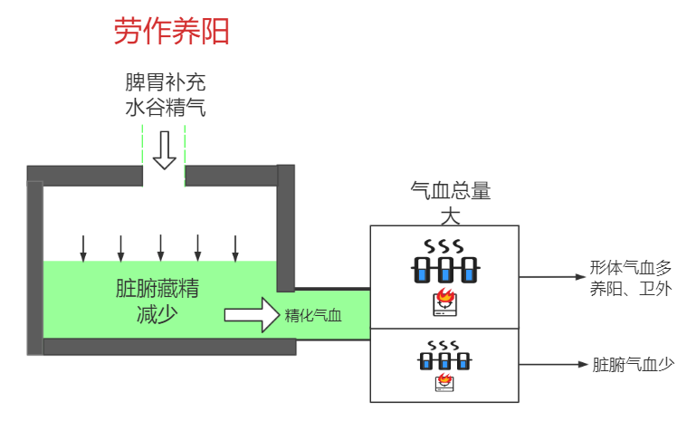
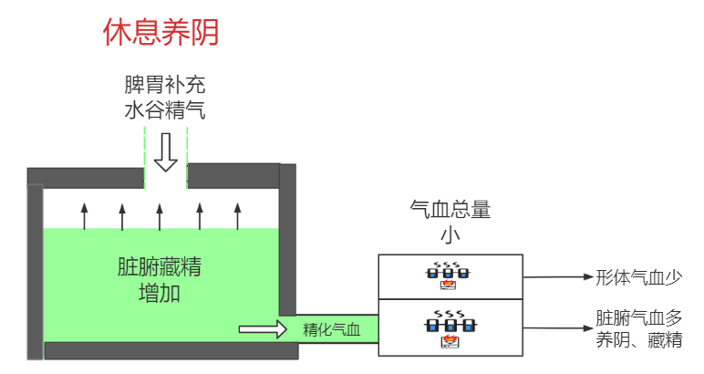
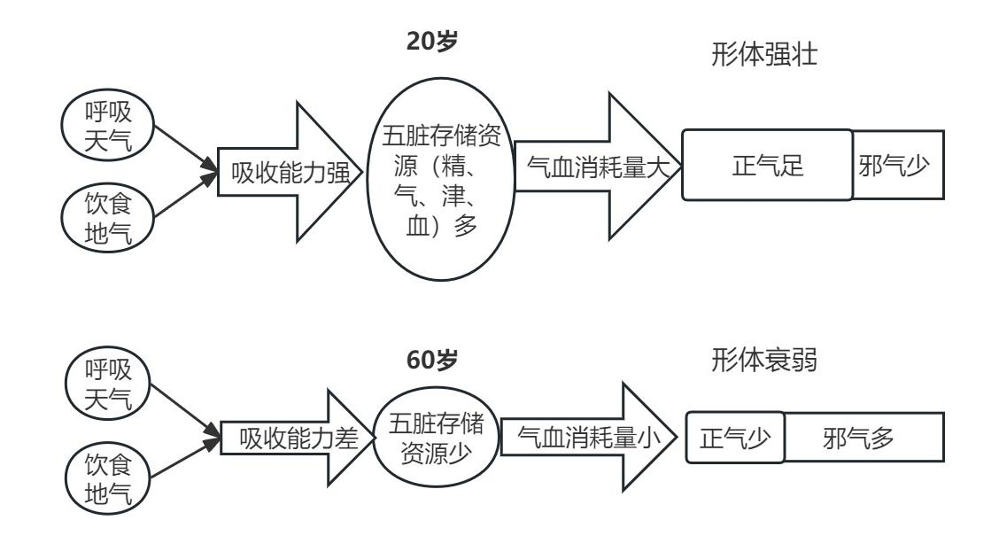

# 第六章 人体各类平衡波动

前面说过，中医的阴阳指的是某件事物中，其维持平衡所需的各类指标要素在时间上的波动和空间上的差异。本章谈一谈波动的问题。

自然界，一年阳光的变化形成四季，这是能量的波动。河流有汛期和枯水期，海水有涨潮落潮，这是液态物质的波动。各种波动在平衡范围之内，就是正常的。超过范围，就是失常。阳光的波动失常可造成酷热或者严寒，河流的波动失常可造成水灾或者干旱。同样，人体中也包含类似的道理。

## 1、人体内部的主要波动关系

人体要素产生与传递、使用的各个环节都可以有波动变化。比如人饱食之后气血增加，饥饿之时气血减少，这就是一种波动。运动的时候，四肢肌表气血增加，休息时减少，这也是一种波动变化。

人体某个部位可以有各类要素整体增加或减少的波动，也可以有单个要素增减的波动。在不同部位，可以有此增彼减、此减彼增的波动。这里谈两点人体内部主要的波动关系。

### 1.1、局部环境平衡波动

人体内部各处皆有能量与物质固、液、气三态形成的环境平衡。其中，元气、津血、气都容易有数量上的波动，只要不超出平衡范围，皆为正常。

如前所述暖气的例子，暖气完成供暖功能，需要火、水皆在平衡范围内。火可以有大小的波动，水也可以有多少的波动。

在平衡范围内：水火偏多，则气偏多，工作能力强；水火偏少则气偏少，工作能力稍弱。两者皆为正常。

超出平衡范围：

过多：火过多，则阳实而热；水过多则阴实而寒；

过少：水火有一个过少，都会气虚。若只是火过少，则阳虚而寒兼气虚，为气阳两虚；只是水过少，则阴虚而热兼气虚，为气阴两虚。水火皆不足，气更不足，即为阴阳两虚兼气虚。阴阳两虚情况下，水火还可有偏，火偏多则热，水偏多则寒。此时调节能力差，稍补水则变寒，稍补火则变热。

水火相对而言，火为阳，有主动性；水为阴，有被动性。所以火易调而水难调。在水量适度情况下，通常以调火来控制气的多少。调节暖气的输出功率时，只要调节火的大小，水温和蒸汽量即随之增减。火大则水、气皆热，火小则水、气皆寒，这就是**阳主而阴从**。

> 《内经》强调阴阳关系的协调平衡，并不排斥阳气的主导作用，因为阴和阳两个方面，并非完全处于同等的地位，而是有主有从...
>
> 《黄帝内经讲解-阴阳互根互用的关系》

阳气虽然重要，但不要走入极端，只强调阳气是错误的。阳气主导的平衡波动是在阴液适量的前提下进行的。如果暖气中的水量很少，小于平衡范围，也需要补水，否则火稍大一点，就容易烧干。自然界也是如此，四季的形成是由阳光的多少变化而主导，但前提是大地有足够的水土。如果在水土贫瘠的沙漠，光靠阳光的增减是无法形成茂密森林的。

因此，阳主阴从、阳气为主导的含义是水火在平衡波动的过程中，火起主导作用，而非不考虑水的多少，一味的增加火量。

> 在临床上治疗一些气虚，阳虚患者，需大量或长期用温燥药物，致使胃津不足者，常常间断使用益胃汤或合入益胃汤，以防止温燥药物耗伤胃阴。
>
> 《温病条辨讲解-中焦篇-风温-十二》

人体也一样，中医往往通过阳气的波动来代表整个气血的波动，但不意味着不考虑阴液的因素。人的津血正常的情况下，阳气适当增加，则人体的气足，反之则气稍弱。但若在津、液、血虚的情况下，单纯增加阳气会更加消耗津液。

> 荣气微者，加烧针则血留不行，更发热而躁烦也。...
>
> 如医不知筋脉拘急为营血之虚，反认为寒邪所伤而误用烧针，火热益阳而损阴，则致营阴更虚而生内热，故可出现血留不行，更发热而躁烦不安等坏证。
>
> 《伤寒论讲解-辨脉法》

人体单纯阳虚则补阳；单纯阴虚则补阴；阴阳两虚则用侧重补阳的甘温之剂，虽侧重补阳，但也兼顾补阴。

有的中医有“贵阳贱阴”的说法。这个提法容易让不懂原理者走偏。理解了阴阳平衡的道理，应该明白阴阳各有其用途，谈不上谁贵谁贱。物以稀为贵，在阴阳平衡过程中，阴少则阴贵，阳少则阳贵。如果说不清平衡原理就妄谈贵贱，必然走偏而害人害己。

有一种观点说人死亡的时候躯体还在，而躯体是物质，物质为阴，所以阴永远都是足够的，只是缺阳，从而得出死亡都是阳不足的错误结论。其实躯体只代表人体固、液、气物质中的固态物质。固态物质存在，并不代表躯体中的参与形成内环境的液态、气态物质是充足的，所以不能说人的死亡全都是阳不足。从历代中医的实践看，阴液不足造成的病危案例屡见不鲜。实际上，正阴不足、正阳不足、阴阳俱不足都可以造成病危。

> 肯定阳气的主导作用。这不意味着“贵阳贱阴”，而是在以“阴为基础”的前提下来认识阳气的重要作用。与只重视阳气者自有区别。就临床来看，阳虚者固当扶阳，阴虚者亦当滋阴，这在调整阴阳的治疗过程中是无可非议的。但如果证属阴阳两虚，一般都侧重阳虚而用甘温分剂，《灵枢•终始》说：“阴阳俱不足，补阳则阴竭，泻阴则阳脱，如是者可将以甘药，不可饮以至剂。”
>
> 《黄帝内经讲解-阴阳互根互用的关系》

> 前述伤寒为病，多伤阳气，临证治疗，首在扶阳，补阳则可摄阴，阳生方能阴长。但若阴阳两伤，而阴伤亦甚之时，阴阳双补，滋阴和阳之法则不可忽视。
>
> 《伤寒论讲解-69条》

一般来讲，阳易补而阴难复。阳为能量，通过干姜、附子等药物刺激，通常可以快速促使精转化元气，达到补阳目的。阴为物质，其产生与传送较为困难，所以补阴显效慢，且其传送环节有一环出问题就会送不到该去的位置，容易停留于某处形成湿气、痰饮等邪气。这些湿气、痰饮、瘀血类的邪气，在脏腑，会影响脏腑化物、藏精、藏神、产生气血等功能；在三焦、气脉、血脉等通道，会使能量及气液物质的传递发生障碍。这样就不但没有达到补阴的目的，反而增加了新的病证。

西医发明的输血、输液等手段，可以大量快速的补充津血。这种手段属于外来补充，而非人体自身产生，比较粗犷。人短时间大量失血、流失津液的时候，津血的整体缺失过多是主要矛盾，用这种手段比较好。非此类情况，则要考虑输入的阴液能否准确到达需要的地方？过量的阴液是否会让体内环境变寒？多余的水液是否会变为湿气、痰饮？从中医角度看，过量输液容易导致湿寒体质，而湿寒体质如果过量输液，会加重病情。

### 1.2、整体气血资源波动

人整体的资源运转为脏腑产生气血，通过经络传输，供给形体使用。这个过程中，气血的总量与分布不是一成不变的，而是在一个范围内波动。

人的主要功能是行动、思维、感受、表达等。这类功能的使用强度决定了气血的消耗量。多动、多思、多言等偏阳性的行为会消耗较多的气血；反之，少动、少思、少言等偏阴性的行为消耗较少的气血。

形体获得较多气血的时候，有利于形体组织健康，使人的皮肤致密、肌肉结实、各种通道通畅，能够更好的保护身体不受外界侵袭，即为**养阳**，这里的阳是指**形体**。此时脏腑的工作量较大。

形体获得较少气血的时候，脏腑可以获得休息，有利于脏腑化物、藏精等后勤保障工作，让脏腑健康，藏精更多，即为**养阴**，这里的阴指**脏腑**。

> 阴者，**藏精**而起亟也；阳者，**卫外**而为固也。
>
> 《素问-生气通天论》

以开车进行比喻，养阳就是踩油门，速度快，力量大，但耗油量大；养阴就是收油门，省油。这里提到的养阴与养阳是人体非常重要的波动关系，涉及到很多处的变化，为表达清晰，分类逐条讲解：

1、脏腑所消耗气血：养阳时，需要脏腑产生更多气血供给形体，此时脏腑工作量加大，其自身也要消耗较多气血。反之，脏腑气血消耗较少。

2、气血总量与整体抗邪能力：气血总量为形体气血和脏腑气血之和。养阳时，形体气血偏高，脏腑气血也偏高，所以气血总量高，即为正气足，整体抗邪能力强。反之，气血总量低，抗邪能力弱。

3、精的消耗量：因气血来自精的转化，所以气血总量高时，精的消耗量大；反之，精的消耗量小。

4、脏腑藏精量：脏腑所藏之精分为先天之精和后天之精。

后天之精：胃、肠、脾以一定的速度持续吸收着水谷精微。精的消耗量小的时候，可以有多余的后天之精存入脏腑，脏腑藏精量增加。精的消耗量大的时候，则需要从脏腑中调出精，脏腑藏精量减少。

先天之精：先天之精难以补充。气血总量高的时候，先天之精消耗的快。反之，消耗的慢。

5、肌表的腠理与汗：养阳时，肌表的阴阳气血皆充足，腠理容易打开，容易出汗。此时因津血在肌表多而脏腑相对少，所以小便偏少。反之，肌表的阴阳气血减少，腠理闭合，不容易出汗而小便偏多。

6、肌表的护卫抗邪能力：养阳时，肌表的气血多，抗邪能力强。反之，肌表的抗邪力弱；

7、气血的分布：

气血为流动之物，其在全身内外上下的分布应尽量均匀，各处可有一定差别，但不应过大。

形体应天，波动幅度较大；脏腑应地，波动幅度较小。养阳时，形体气血增加较多，脏腑气血增加较少，两者相比，形体气血量大于脏腑。养阴时，形体气血减少较多，脏腑气血减少较少，两者相比，形体气血量小于脏腑。

这里内外的气血量差异是指正常范围内的差异。如果两者差别过大，说明气血之出入有问题，是病证。

> **阴不胜其阳**，则脉流薄疾，并乃狂。**阳不胜其阴**，则五脏气争，九窍不通。是以圣人**陈阴阳**，筋脉和同，骨髓坚固，**气血皆从**。如是则**内外调和**，邪不能害，耳目聪明，气立如故。
>
> 《素问-生气通天论》

8、五脏之间的差异：五脏之间比较，养阳的时候，心、肝的工作量相对更多；养阴的时候，肺、肾的工作量相对多。这是因为养阳的时候，气血总量增加，需要心调集更多肝所藏之血，输出到全身。而养阴的时候，气血总量减少，需要肺收隐气血于内，肾负责藏精。

> 一身之血，均在脉中运行，这依赖心阳的温煦与心气的推动，方可周流不息，濡养全身。
>
> 《中医药学概论-心、小肠》

9、肝的藏血量：肝主藏血。养阳时，气血传输量大，需要调集肝所藏之血，输布于形体，所以肝的藏血量减少。反之，肝的藏血量增加。

> 人体内的血液分布，常随着各种不同的生理状况而改变，这种血量的改变，主要取决于肝的贮藏与调节。当人处于休息或睡眠时，人体的活动量减少，血液的需要量亦相对减少，部分血液便藏于肝。**当人处于活动状态时，肝脏就把所贮存的血液输布于人体**，以供人体的需要。
>
> 《中医药学概论-肝、胆》

10、气血通道的扩张：养阳时，气血通道扩张，气血流动快、量大。养阴时相反，气血通道收缩，气血流动慢、量小。

有很多因素可以影响气血的整体波动，最常见的即为劳作与休息。劳作运动时，形体需要消耗大量气血，就可以形成养阳的格局。休息睡眠时，形体消耗气血少，就可以形成养阴的格局。此外，邪气干扰、中药方剂、情志变化、气温变化、日月变化也可以对养阴养阳产生影响，但各有细节不同。这里暂时以劳作与休息举例。

劳作养阳与休息养阴的关系如下图。

因劳作健壮了形体，形体才能在休息时卫护于外，保证脏腑不被外界邪气侵袭。因休息时脏腑积累了精气，才能在劳作时提供足够的精来转化气血。休息与劳作一阴一阳，互为因果。两者都有合适的度，需要劳作以养阳，又不能过度劳累；需要休息以养阴，又不能过度休息。人的一生就是在这种养阴、养阳的波动中消耗肾精，逐渐衰老，直到先天之精耗尽，度天年而去。

人要想健康长寿，既需要通过休息内养五脏以藏足精气，又需要通过劳作外健形体以抵御邪气侵袭，再加思想恬淡以养神，就如内经开篇《素问-上古天真论》所说：圣人**形体不敝，精神不散**，可以活到百岁。

> 其次有**圣人**者，处天地之和，从八风之理，适嗜欲于世俗之间，无恚嗔之心，行不欲离于世，被服章，举不欲观于俗，外不劳形于事，内无思想之患，以恬愉为务，以自得为功，**形体不敝，精神不散**，亦可以百数。
>
> 《素问-上古天真论》

**按**：“阴者，**藏精**而起亟也；阳者，**卫外**而为固也”，传统上，此处理解阴为阴精，阳为阳气，因解释不通顺，是中医的一个难点。此处的阴应理解为内在脏腑，可藏精，阳理解为外在形体，可护卫人体不受外界邪气的侵袭，对应内经的“内为阴，外为阳”，“阴藏精，阳卫外”。同样，“春夏养阳，秋冬养阴”，这里的阳也不是指阳气，而是指形体；阴不是指精血，而是指脏腑。春夏适合养形体，秋冬适合养脏腑。

> 阴精是阳气的物质基础，阳气要发挥应有的作用，需要阴精的支持，所以阴精要不断地输送精气于全身，以供给阳气的需要，这叫“阴者，藏精而起亟”。阳气对阴精有固摄作用，阴精要藏守于内，需要阳气固密于外，所以阳气要不断敷布于体表，以抗御外邪，固密阴精，这叫“阳者，卫外而为固也”。
>
> 《黄帝内经讲解-阴精与阳气的主要功能和关系》

### 1.3、小结

本结提到的两部分内容分别指的是局部阴阳平衡与内外整体波动。局部平衡是指任何部位都有阴阳气血的平衡，以及阴阳气血之偏。其所偏之程度在平衡范围之内为正常，超过平衡范围为失常。整体波动是指整体上，人的阴阳气血总量可以有偏阳性和偏阴性的变化。偏阳性的时候为养阳，整体机能强，气血外多里少，精的消耗加快；偏阴性的时候为养阴，整体机能弱，气血外少里多，精的消耗减慢。

## 2、天体波动的影响

天体日、月、星以及地球自传，对自然界和人体要素都有各自的影响。

> 夫**变化**之用，天垂象，地成形，**七曜纬虚，五行丽地**；地者，所以载生成之形类也。虚者，所以列**应天之精气**也。形精之动，犹根本之与枝叶也，仰观其象，虽远可知也。
>
> 《黄帝内经-五运行大论》

以太阳为例，一年四季，自然界阳气波动。自然界的生命顺应这种变化进行生、长、收、藏的活动。农民要按照节气在春天播种，夏天灌溉，秋天收获，冬天储备。遵循这个规律，就收获丰富，违反这个规律，就生活困难。说天道无私，就是自然界的阴阳变化按照规律运转，并不因人的行为而受影响。但是人的行为却要遵循天地的阴阳变化规律，违反则自己受损，与天地无关。所以两者之间，人要顺从天地。

> 故阴阳四时者，万物之终始也；死生之本也；**逆之则灾害生，从之则苛疾不起**，是谓得道。
>
> **从阴阳则生，逆之则死；从之则治，逆之则乱**。
>
> 《素问-四气调神大论》

这里对几种天体的主要影响做一下介绍。

### 2.1、太阳四季波动变化

#### 2.1.1、正常人顺应四季变化的规律

一年阳气波动对人体影响的规律是：春夏时，人整体阳气增加，且阳气由内出外；秋冬时，人整体阳气减少且阳气由外入内。这是类似大海潮汐的一种波动。

> 五月之时，阳气在表，...阳气内微...十一月之时，阳气在里...。
>
> 《伤寒论-辨脉法》

> 是故**冬至四十五日，阳气微上，阴气微下；夏至四十五日，阴气微上，阳气微下**。
>
> 《素问-脉要精微论》

> 人体阳气的活动，**白天多倾向于体表，夜间多倾向于体内**，随着昼夜阴阳的消长而产生相应的变化
>
> 《黄帝内经讲解-阴阳对立统一规律》

> 认为人体阳气的活动能对天气的变化，随时作出应答反应……**天热则腠理开，阳气外泄，故汗出而小便少；天寒则腠理闭，阳气内敛，故汗少而小便多**，这正是通过阳气的适应性反应实现的。
>
> 《黄帝内经讲解-人与自然变化的关系》

这种波动是自然界施加给人的干预力量，无法避免，只能顺应。

人体为了保持体内的阴阳平衡，必须顺应这种变化，这就需要神恰到好处的调控精、气、津血等要素以配合。

春夏，受自然界阳气变化影响，人体的阳气增加，经脉扩张。此时，人要通过自身的调节，增强脏腑的工作，让津血也增加，并逐渐向肌表汇集。这与春夏之时，自然界会增加降雨、农民种地要浇水是一个道理，也即内经所说的“阳生阴长”。此时，自然界热量、水分增加，植物可以发芽、成长。人的阳气和津血都增加，就可以让血脉通畅、形体健壮，也就是实现了前述养阳的目的。

秋冬，人体的阳气减少，津血也减少，脏腑可以休息藏精，即内经的“阳杀阴藏”，自然就实现了养阴的效果。

“阳生阴长，阳杀阴藏”是指四季是以偏阳的太阳能量波动为主导，偏阴的水土波动进行跟随，逐步营造春温、夏热、秋凉、冬寒的动态平衡的自然环境。自然界的生命随着这种波动进行年复一年的生、长、收、藏的生命活动。人的体内也是这种变化。春夏的时候气血充盈以养形体，秋冬时气血缩减以养脏藏精，所以内经说人虽以天地之气生，但是却以四时之法成。

上述人体顺应自然四季变化的过程，包含了本章第一小节谈到的两类波动关系，即局部部位的阴阳平衡以及气血资源的整体波动。人体顺应自然四季的变化需要其具备较强的阴阳调节能力。如果调节能力弱，在四季变化时无法适应，就会发生病证，具体见下面“病人不能适应四季变化的情况”小节。

通常四季的寒热转化是平滑的，并非突然变热或者变冷。自然生物与人体都会对这种变化进行跟随适应。但如果在某个时间点打破了规律，就会带来连锁变化。比如春天热的过早，自然界就会产生偏热的失衡，从而影响其中的生命。对于人体来讲，春热过早，人体热量突然增加却来不及增加津血与之匹配，就容易产生偏温热的失衡，即温病。

> 少阳主火，冬末春初，气候本应由寒而渐转温，如果出现过于温暖气候，属于“未至而至”的反常情况，所以，容易发生温病。
>
> 《温病条辨讲解-原病篇》

一年四季，气血的波动环环相扣。春天生发的气血，到了夏天壮大，供形体成长之用。夏天壮大的气血，供秋天收养之用。秋天收养之气血，通过精血互转，供冬天藏精之用。冬天所藏之精，再供春天生发气血所用。每一个环节如果出现问题，则既伤害本环节的脏器，又影响下一环节的功能。

> 故曰：冬伤于寒，春必温病；春伤于风，夏生飧泄；夏伤于暑，秋必痎疟；秋伤于湿，冬生咳嗽。
>
> 《素问-阴阳应象大论》

> 但天地动静，阴阳鼓击者，各正一气耳。是以彼春之暖，为夏之暑；彼秋之忿，为冬之怒。...
>
> 《伤寒论-伤寒例》

> 春三月，此谓发陈。天地倶生，万物以荣；夜卧早起，广步于庭，被发缓形，以使志生；生而勿杀，予而勿夺，赏而勿罚，此春气之应，养生之道也。逆之则伤肝，夏为寒变，**奉长者少**。
>
> 夏三月，此谓蕃秀。天地气交，万物华实；夜卧早起，无厌于日；使志无怒，使华英成秀，使气得泄，若所爱在外，此夏气之应，养长之道也。逆之则伤心，秋为康疟，**奉收者少**，冬至重病。
>
> 秋三月，此谓容平。天气以急，地气以明，早卧早起，与鸡俱兴；使志安宁，以缓秋刑；收敛神气，使秋气平；无外其志，使肺气清，此秋气之应，养收之道也。逆之则伤肺，冬为飧泄，**奉藏者少**。
>
> 冬三月，此谓闭藏。水冰地坼，无扰乎阳；早卧晚起，必待日光，使志若伏若匿，若有私意，若已有得；去寒就温，无泄皮肤，使气亟夺，此冬气之应，养藏之道也。逆之则伤肾，春为痿厥，**奉生者少**。
>
> 《素问-四气调神大论》

春天，人的形体如大地解冻一般，经脉通道扩张，更多的气血充实于经脉。到夏天经脉中的气血已经充满，进入络脉、皮肤。到了长夏，经脉、络脉中的气血都已充满，开始向内充实到肌肉。春夏之时，肌表阴阳气血皆充足，很容易出汗。汗可以排出邪气。所以如果形体有邪气，春夏是很好的出汗排邪时机。

秋天，表皮气血减少。冬天，气血多藏于内部的骨髓与五脏。秋冬时，形体如大地冰封，经脉通道收缩，从内部获得的气血减少。但是因为前面春夏时送来很多精华储备，所以虽内部传来的气血减少，但是肌表自身也可产生一定气血。这个道理与人们秋天收获、冬天存储的道理是一样的。

> 岐伯曰：**春**者天气始开，地气始泄，冻解冰释，水行经通，故**人气在脉**。**夏**者经满气溢，入**孙络受血**，**皮肤充实**。**长夏**者，**经络皆盛**，内**溢肌**中。**秋**者天气始收，**腠理闭塞，皮肤引急**。**冬**者，盖藏**血气在中**。内着**骨髓**，通于**五脏**。是故邪气者，常**随四时之气血而入客**也。至其变化，不可为度，然必从其经气，辟除其邪，除其邪则乱气不生。
>
> 《素问-四时刺逆从论篇》

四季的五脏特性：春天精化气血由肝主导；夏天气血充养形体，由心主导；秋天气血收隐，由肺主导。冬天精气潜藏，由肾主导。

> **帝曰：藏象何如？**
> **岐伯曰：心者，生之本，神之变也；……通于夏气。**
>
> **肺者，气之本，魄之处也；……通于秋气。**
>
> **肾者，主蛰，封藏之本，精之处也；……通于冬气。**
>
> **肝者，罢极之本，魂之居也；……通于春气。**...
>
> 肝主疏泄而调畅气机，同时又主升发阳气，促进全身气血的流畅，这本身就具有生养人体之气的作用。
>
> 《黄帝内经讲解-五脏功能与形体组织、四时阴阳的关系》

> **五藏者，所以参天地，副阴阳，而连四时，化五节者也。**
>
> 《灵枢-本藏》

人应该调节自己的作息与情志，以更好的适应这种养阳、养阴的变化。春夏应晚睡早起，多接触太阳阳气，保持心情舒畅、乐观积极。秋天的时候，应早睡早起。冬天的时候，应早睡晚起。秋冬宜意志安宁，平静内敛。

#### 2.1.2、正常人不顺应四时规律的后果

内经推荐正常人按照四时的规律进行养生。如果违反，可能会有不好的后果产生。

> 故阴阳四时者，万物之终始也；死生之本也；**逆之则灾害生**，从之则苛疾不起，是谓得道。
>
> 《素问-四气调神大论》

正常人春夏应适度劳作。如果春夏过于休息，则形体未能得到足够的气血，而形体不健壮，护卫能力差，遇到自然界外感邪气，易被侵入皮肉筋骨而形成血痹、风湿等病，甚至进一步内侵发展为五脏疾病。

正常人秋冬应该休养为主。因秋冬经脉收缩，阳气潜藏于内，而过度劳作需要产生大量的阴阳气血走向形体。这就如逆水行舟，需要消耗更多的精来转化阳气与气血。如此一来，一方面会导致脏腑藏精不够，不利于来年春夏养阳使用。另一方面也需要消耗更多的先天肾精，会缩短人的寿命。再有就是，冬天劳作出汗，皮肤腠理打开，寒气容易经皮肤而入，可能直接发为伤寒病，或者潜伏于体内，到春夏发为其它病。

> **冬时严寒，万类深藏，君子固密，则不伤于寒，触冒之者，乃名伤寒**耳。其伤于四时之气，皆能为病，以伤寒为毒者，以其最成杀厉之气也。中而即病者，名曰伤寒。不即病者，**寒毒藏于肌肤，至春变为温病，至夏变为暑病**。暑病者，热极重于温也。是以**辛苦之人，春夏多温热病者，皆由冬时触寒所致**，非时行之气也。...
>
> **从霜降以后，至春分以前，凡有触冒霜露，体中寒即病者，谓之伤寒也。**
>
> 《伤寒论讲解-伤寒例》

前面“天地平衡”章节谈到过自然界一年四季温度动态平衡。人体小自然也存在这种四季动态平衡。无论春夏秋冬哪个时间点，都有当时的温度平衡点。温度向上超过平衡范围为热病，也称温病；向下超过平衡范围为寒病。

以温病为例。春天的时候，人体的阳气受大自然的影响而增加。如果人体的津血阴气未能随之匹配增加，就会形成阳多阴少而失衡的格局。导致这种情况的原因有多种。前面提到一种情况是春天热的过早，津血来不及跟随。还有一种情况，就是冬天五脏藏精不足，到春天的时候，即便气候的转变是平滑的，也可能因精不足而无法转化更多津血以匹配阳气的正常增加，就产生了温病。如内经所说“藏于精者，春不病温”。

> 夫精者，身之本也。故藏于精者，春不病温。
>
> 《素问-金匮真言论》

> 如果冬季过于寒冷或人体不能顺时调养而使阳气泄，损耗了人体的阴精，那么到了春天，由于阴精不足，不能抵御温邪，就易患温病。
>
> 《温病条辨讲解-原病篇》

自然界四时阳气波动，人体阳气也随之内外波动。人应顺应这种波动来调节自身以进行养阳、养阴，就是“与万物沉浮于生长之门”。逆此波动，就如人逆着波浪的起伏而游泳，非常费力，肾精消耗速度快，人易病、早衰、短寿。

> 夫四时阴阳，万物之根本也，所以圣人**春夏养阳，秋冬养阴，以从其根，故与万物沉浮于生长之门。逆其根，则伐其本。坏其真矣。**故阴阳四时者，万物之终始也，死生之本也，逆之则灾害生，从之则荷疾不起。
>
> 《素问-四气调神大论》

#### 2.1.3、病人不能适应四季变化的情况

前述健康人应顺应四时变化来养生。如果是原本不健康的人，其本身就有某些虚实失衡，此时在四时阴阳变化的影响下，就会出现病症。有病应先治病，病愈再谈养生。所以当病证出现时，应结合天时与身体失衡情况，扶正祛邪恢复平衡，而不是不考虑人体状态，教条的认为某季节必然用某些调理方法。

《伤寒论》辨脉法章节中，谈到如果让病人过量出汗，则伤人体阳气，过度泄下，则伤人体阴气。人体阴阳两伤，则调节平衡的能力不足。在阴历五月份夏至前后，阳气的分布为表多里少。调节能力弱的人，里部阳气不足而无法自我补充，就会里寒。这样虽然天气很热，但是病人却要求多穿衣服且喜热饮，此时应补里部之阳。阴历十一月冬至前后，阳气表少里多。里部阳气多则需要增加里部阴气以达到平衡，里部阴气不足而无法自我补充，就会里热，这样虽然天气很冷，但病人却要求少穿衣服甚至饮冰水，此时应补里部之阴。

> **大发其汗，又数大下**之，其人亡血，病当恶寒，后乃发热，无休止时。**夏月盛热，欲著复衣，冬月盛寒，欲裸其身。**所以然者，阳微则恶寒，阴弱则发热，此医发其汗，使阳气微，又大下之，令阴气弱。**五月之时，阳气在表，胃中虚冷，以阳气内微，不能胜冷，故欲著复衣**。**十一月之时，阳气在里，胃中烦热，以阴气内弱，不能胜热，故欲裸其身**。
>
> 《伤寒论-辨脉法》

> 病人**身大热**，反**欲得衣**者，**热在皮肤**，**寒在骨髓**也。**身大寒**，反**不欲近衣者**，**寒在皮肤**，**热在骨髓**也。
>
> 《伤寒论-11条》

以上说的是伤寒误治，使人阴阳两伤，不能顺应季节变化而出现的状况。推而广之，可知当人的调节能力过弱之时，就会随着四季变化而表现出特定的寒热现象。

> 春温夏热，元气外泄，阴精不足，药宜养阴；秋凉冬寒，阳气潜藏，勿轻开通，药宜养阳。
>
> 《神农本草经疏》

如春夏形体未养好，护卫能力弱，到秋冬的时候，肌表阳气过少，则畏寒怕冷，不能完成保护脏腑的功能。严重者，形体有风寒、瘀血、痰饮等邪气，春夏时未能借助天时排出，处于爆发疾病的边缘，到秋冬之时，气血内藏，形体正气减少，更容易爆发疾病，则此时也可以临时鼓动气血以缓解问题。秋冬本宜休息藏精，不宜驱动气血走向形体，但因形体问题紧急，只好行权宜之法，不得已而为之。

秋冬应该加强脏腑藏精。如过于开泄，精未能藏足，到来年春夏的时候，气血生发就没有来源。如果教条的认为春夏应该补阳气、多劳作以健形体，强行调动本不多的精转化气血，则犯虚虚之戒。此时应该视情况休息以养脏腑之精。春夏本不宜休息养精，但因秋冬藏精不足，也是不得已而为之。

如人表里皆有问题，里部五脏藏精不足，肌表护卫能力又弱，则“阳（形体）不能卫外，阴（脏腑）不能藏精”，就很危险了。此时应该按照“急则治标、缓则治本”的原则，酌情处理。

必须认识到，形体也好，脏腑也好，阳气能量与固、液、气态物质的平衡关系是最基本的。无论何时这种平衡关系出现失衡，都是必须要调节的。此时即便是违背了春夏养阳、秋冬养阴的规律，也不得不先处理这种失衡，否则可能没等到天年，人就先夭折了。

#### 2.1.4、小结

本节内容首先探讨了为什么春夏适宜养阳，秋冬适宜养阴，以及违背这个规律的后果。其次探讨了人体若不能顺应四季变化，可能产生的病证以及治疗原则。

养阳时，人之气血增加，充实于形体，有助于形体的健康。但是重点要认识到，气血流动之物从内部脏腑运动到外在形体的过程并不简单，需要消耗大量能量。如能在春夏时，借助自然界阳气的力量完成这个过程，就能节省自身能量的消耗。这是春夏养阳的意义所在。

另外，还要注意适度劳作与剧烈运动的区别。从内经与伤寒等经典的论述看，中医不提倡出大汗的剧烈运动，而提倡在养阳的时候适度劳作，可出微汗。劳作的目的是让气血波动到形体，以健壮五体。当出微汗的时候，说明气血已经行至肌表，腠理已经打开，持续一段时间即可达到养阳的目的。过度出汗的剧烈运动，消耗的气血过多，虽然形体可以得到很多的营养，但消耗的精过多，不利于养生。所以内经谈到春夏养阳的时候，说可以“广步于庭”，即多走路；《伤寒论》谈到汗的时候，说春夏宜汗，又说凡是出汗，以全身包括手足小汗潮润为标准，不提倡“如水流离”的大汗。

> **大法，春夏宜发汗。**...
>
> 凡发汗，欲令**手足俱周，时出似漐漐然，一时间许益佳**。**不可令如水流离**。若病不解，当重发汗。汗多者必亡阳，阳虚不得重发汗也。
>
> 《伤寒论讲解-辨可发汗病脉证并治第十六》

### 2.2、一昼夜的波动变化

一昼夜的阳气波动，原理与一年的阳气波动原理差不多，所以人应白天工作，晚上休息。昼夜阳气波动幅度不如四季大，所以中医常用四季变化来举例。

> 以一日分为四时，朝则为春，日中为夏，日入为秋，夜半为冬。朝则人气始生，病气衰，故旦慧。日中人气长，长则胜邪，故安。夕则人气始衰，邪气始生，故加。夜半人气入蔵，邪气独居于身，故甚也。...
>
> 尽管昼夜阴阳变化的幅度不如四时，但同样具有类似的运动规律。张介宾说：“人身之阴阳，亦与一日四时之气同。故子后则气升，午后则气降，子后则阳盛，午后则阳衰。”
>
> 《黄帝内经讲解-正邪消长的昼夜节律》

> **阳气者，一日而主外，平旦人气生，日中而阳气隆，日西而阳气已虚，气门乃闭。**
>
> 《素问-生气通天论》

### 2.3、月周期的波动变化

前述年周期，自然界阳气变化会引动人体的阳气变化。在内经中还谈到，一月周期，月圆月缺的变化会引动人体阴血的变化。

自然界海水受月亮的影响出现潮汐现象，人体内的津血等液态物质也有对应的潮汐现象。内经说，月满之时，自然界海水西盛，人体的气血波动于形体肌表，使肌肉充实，皮肤致密，毛发坚韧，腠理闭合，易生脂垢；月缺之时，自然界海水东盛，肌表血气不足，卫气消沉，肌肉消减，皮肤弛缓，腠理开泄，毛发摧残，肌肤纹理疏薄，脂垢剥落。

因此，月圆之时，肌表的气血充足，护卫能力强，邪气难以进入。反之，月缺之时，肌表气血不足，护卫能力弱，此时如有外邪侵袭，容易深入而爆发急病。

> 人与天地相参也，与日月相应也。故月满则海水西盛，人血气积，肌肉充，皮肤致，毛发坚，腠理郄，烟垢著，当是之时，虽遇贼风，其入浅不深；至其月郭空，则海水东盛，人气血虚，其卫气去，形独居，肌肉减，皮肤纵，腠理开，毛发残，腠理薄，烟垢落，当是之时，遇贼风，则其入深，其病人也**卒暴**。
>
> 《灵枢-岁露》

天气温暖的时候，肌表气血的流动顺畅，适宜针刺调理气血。环境寒冷的时候，肌表气血的流动慢，不适宜针刺。这是“天寒无刺，天温无疑”。

月满的时候，肌表气血充足，针刺时无需用补法。月初生的时候，肌表气血少，针刺时不宜用泻法。月无光时，肌表气血过少，连针刺治法都不宜使用。

可以推论，环境寒冷的时候，即便月满也不适宜针刺，因为气血流动慢；月无光的时候，即使环境温暖也不适宜针刺，因为肌表气血过少。

> 是故天温日明，则人血淖液而卫气浮，故血易泻，气易行；天寒日阴，故人血凝泣而卫气沉。月始生，则血气始精，卫气始行；月郭满，则血气实，肌肉坚；月郭空，则肌肉减，经络虚，卫气去，形独居。是以因天时而调血气也。是以天寒无刺，天温无疑。月生无泻，月满无补，月郭空无治，是谓得时而调之
>
> 《素问-八正神明论》

以上是内经提到的针刺法与日月的关系。从中应能体会出阴阳的特点。阳足，为热量足，气血流动快；阴足为津血的量大。就像前述烧水的例子，水火具足才能产生足够的气，火不足或水不足皆不能正常工作。

### 2.4、其它周期的波动变化

除了上述波动变化外，中医还有六十年周期的五运六气变化。太阳系五大行星，每年地球与五大行星的距离发生变化，各个行星对地球天气、地气也有一定程度的扰动。这种扰动可以对自然界的气候产生一定影响，也可影响地球生物的健康状态。好在其力度不算太大，如果是非常健康的人，其保持平衡能力强，受影响较小。而对于不健康的人，如果是虚证，其维持平衡的能力差，轻微的扰动即可以让其失衡发病；如果是实证，已经处于某方面失衡的临界点，在同类型扰动的加强下，也可能发病。如果疾病过重，这种扰动甚至可以成为压倒骆驼的最后一根稻草。

> 岐伯曰：**岁木太过**，风气流行，脾土受邪。民病飧泄，食减体重，烦冤、肠呜、腹支满，**上应岁星**。甚则忽忽善怒，眩冒巅疾，化气不政，生气独治，**云物飞动，草木不宁，甚而摇落**，反胁痛而吐甚，冲阳绝者，死不治，上应**太白星**。...
>
> 气相胜者和，不相胜者病；重感于邪则甚也。
>
> 《素问-气交变大论》

星体随年份变化影响天气、地气的情况是比较复杂的，内经中已经进行了规律总结，大约就是以六十年为周期，不同的年份对六气和五运各有不同的作用，或加强或减弱。光明教材[《黄帝内经讲解-运气学说》](https://www.gmzyjc.com/read/hdnjs/hdnj11.md)是专门讲述这方面的知识，有兴趣的人可以自行参考。

此外传统文化中，还有风水中的三元九运一百八十年周期，《皇极经世经》的元、会、运、世十二万年周期，而佛学中的成、住、坏、空周期更长。这些波动变化周期已经超出普通人的寿命，不属于常规中医的内容范畴，也不在此处探讨。

### 2.5、小节

本节谈到了天体相关的各种波动变化，看似复杂，但是核心原理还是一个，就是能量与物质固、液、气这四大要素的平衡。天体的波动力量大多为一种干预因素，对一种或者多种要素有干预力量。

如果有利因素叠加在一起，对人就有很好的帮助作用。不利因素叠加的时候，就有很大的危害作用。内经《岁露》谈到，年、月、四季三个周期叠加，若某时三个因素皆对人有利，称为三实，此时人抵御外邪的能力非常强。若某时三个因素皆对人不利，称为三虚，此时外邪就非常容易侵入人体。三虚之时，即便没有其它致病因素，也可能出现暴病暴死。

> 有寒温和适，腠理不开，然有卒病者，其故何也？...
>
> 黄帝曰：其有卒然暴死暴病者，何也？少师答曰：三虚者，其死暴疾也；得三实者邪不能伤人也。黄帝曰：愿闻三虚。少师曰：乘年之衰，逢月之空，失时之和，因为贼风所伤，是谓三虚。故论不知三虚，工反为粗。帝曰：愿闻三实。少师曰：逢年之盛，遇月之满，得时之和，虽有贼风邪气，不能危之也。
>
> 《素问-岁露》

对于这些波动中的一些不良干扰，如果人自身的正气强大、平衡控制力强，就可以抵御，反之若正气弱，则稍有干扰就会发病，甚至死亡，所以最终还是要回归“积精全神，修身养德，正气存内，邪不可干”。

## 3、年龄增长的相关波动变化

### 3.1、气血与形体的关系变化

从人的一生角度看，气血与形体都有波动性。

与成人相比，孩童形体幼小，气血也少，容易感受外界邪气而发病。其气血与形体相比，气血超过形体基本需求，所以生命力强，喜动。因气血相对较多，所以当形体遇到损伤的时候，其自我修复力强。

青壮年，形体长成，气血也充沛，两者配合比较合适。

老年气血衰减，形体也随之衰弱，两者相比，气血少于形体需求，所以喜静。

> 岐伯曰：人生十岁，五脏始定，血气已通，其气在下，故好走；二十岁，血气始盛肌肉方长，故好趋；三十岁，五脏大定，肌肉坚固，血脉盛满，故好步；四十岁，五脏六腑十二经脉，皆大盛以平定，腠理始疏，荥货颓落，发颇斑白，平盛不摇，故好坐；五十岁，肝气始衰，肝叶始薄，胆汁始减，目始不明；六十岁，心气始衰，若忧悲，血气懈惰，故好卧；七十岁，脾气虚，皮肤枯；八十岁，肺气衰，魄离，故言善误；九十岁，肾气焦，四脏经脉空虚；百岁，五脏皆虚，神气皆去，形骸独居而终矣。
>
> 《灵枢-天年》

### 3.2、精神与气血的关系变化

随年龄的增长，气血衰减的根本原因是先天之精越来越少，以肾精为代表的脏腑藏精也逐渐减少，则脏腑产生气血的能力越来越弱，其供给给全身的气血能量越来越不足，也就是正气在逐渐减弱。正气减弱，则排除邪气的能力也下降，于是身体中积累的痰饮、瘀血等邪气越来越多。正气减少，邪气增多，人就逐渐衰老，疾病增多、变重。

> 年四十，而阴气自半也，起居衰矣。年五十，体重，耳目不聪明矣。年六十，阴痿，气大衰，九窍不利，下虚上实，涕泣俱出矣。
>
> 《素问-阴阳应象大论》

五脏所藏之神也需要正气的滋养，随着精、气、血、津液的减少，神获得的滋养也减少。同时再加上邪气增加的干扰，神也就开始变弱。神变弱对外表现为感知、记忆、思辨、执行、志向等智力行为都下降；对内则是对气、血、津液的调控管理能力下降。这样我们就理解了为什么年轻时意气风发的人，到了老年容易变得糊涂、悲观、胆小、恐惧等等。

> 血、脉、营、气、精、神，此五藏之所藏也。至其淫泆离脏则精失，**魂魄飞扬，志意恍乱，智虑去身**。
>
> 《灵枢•本神》

孩童天真无邪，神思不乱，所以神足；孩童肾精中的先天之精充足，精可补充一身的阴阳。

老人则相反，精、神都衰弱，脏腑功能下降，产生的气血不足以供养形体，所以行动迟缓，齿枯发落。虽然可以靠药物对脏腑虚实进行一定的调节，但是因其自身精神的调节能力已经很差了，所以效果也是有限。

总体来说，人的精神气血，在前半生可用“有余”二字概括，即精神气血超过形体基本需求；后半生可用“不足”二字概括，即精神气血不能满足基本需求，人出现衰老之像。前半生尚可适当消耗多余的气血追求身外之物。后半生应保养精神气血以养护形体健康。这就是人一生的气血、精神波动趋势。

### 3.3、得病性质

从得病的病证性质来说，一般青少年因五脏较健康，气血较足，所以病证大多偏阳证。而中老年因五脏开始衰弱，气血不足，所以病证多偏阴证。但现在由于社会习惯的影响，比如喜食冷饮、熬夜、滥用抗生素等等，使年轻人也容易五脏受邪发病，所以年轻人得阴证的情况也越来越多。

小儿因思想简单，所以很少出现七情伤五脏的情况。但其形体较弱，容易外感风寒等六淫邪气，再有贪食无度，容易伤脾胃。外感邪气侵入肌表后，大多进入足太阳经，也可传至手太阴肺。饮食无度多影响脾、胃、肠。所以中医总结其得病特点多为太阳病或者太阴病（脾、肺），即二太。

> 小儿病，多伤寒，稚阳体，邪易干。
>
> 凡发热，太阳观，热末已，变多端，太阳外，仔细看，遵法治，危而安。
>
> 若吐泻，求太阴；若吐甚，变风淫；慢脾说，即此寻。
>
> **阴阳证，二太擒**，千古秘，理蕴深，即疸疹，此传心，谁同志，度金针。
>
> 《口诀-医学三字经-小儿》

以上是根据年龄特点对得病性质的概况，但不要拘泥于这些结论。小儿或者年轻人可有阴证，老年人也可有阳证，都需要仔细辨别才可做结论。

### 3.4、年龄与医药的关系

精是最好的药物，神是最好的医生。无论脏腑形体何处有虚实失衡，精、神皆可进行调节。精神充足，则正气充足，普通病邪难以深入，人一般无大病，有病也容易治愈。若精、神不足，一旦得病，小病易变大病、大病容易死亡，需要有高明的医生做精细的对证调节，才能治好。如果遇到鲁莽的大夫，胡乱攻补，小则伤身，重则送命。

> 黄帝问曰：余闻古之治病，惟其移精变气……岐伯对曰：……此恬淡之世，邪不能深入也。...
>
> 当今之世不然，忧患缘其内，苦形伤其外……内至五脏骨髓，外伤空窍肌肤，所以小病必甚，大病必死。...
>
> 上古……理色脉而通神明，……所以远死而近生……。中古之治病……标本已得，邪气乃服。……暮世之病也……治不本四时，不知日月，不审逆从……粗工凶凶，以为可攻，故病未已，新病复起。
>
> 《素问-移精变气篇》

青少年的身体就像刚出厂的新车，出的问题通常比较单一。老年人的身体就像行驶多年的的老车，各种毛病都有，修理的时候，要注意修此处不要加重彼处的问题。

青少年疾病通常可以直接处理，既虚则补，实则泻。而老年人出现疾病的时候，因为通常其正虚邪实，往往需要补泻兼顾。比如体内有淤血，青年人往往可以直接祛淤血。而老年人，在祛淤血的时候，要考虑气是否充足？是否会因为活血耗气而产生气虚？气虚需补气，但是其体内是否瘀滞过多？补气、补阳时是否会因瘀滞而产生郁热？如此等等。所以老年人的疾病要考虑的方面比较多，往往需要补泻兼施、寒热并用、表里同治，并且仔细权衡各方面的比例。

青少年的时候，精、神充足，需要医药的情况相对少；中老年，精、神衰弱，需要更多医药来辅助补充调节；到晚年，精神衰竭，单凭医药就无能为力了。精神是控制人体平衡的主体，医药是辅助精神来调节人体，所以积精全神是健康长寿的根本。

> 养生方法虽然以保养精气神为核心，但是以节欲保精为第一要义。因为精气神是不分割的统一体，存则俱存，亡则俱亡。精能化气，气能生神，精、气、神存在着相互依存、相互转化的关系，而精是神气的本源，所以《内经》有“积精全神”之说。
>
> 《黄帝内经讲解-养生学说》

## 4、小结

本章探讨了人体几大要素的波动情况。总体来讲，人的一生周期是以精的变化为主；年、日周期是以阳气变化为主；月周期是以阴气变化为主；这些要素波动，会导致人体的平衡发生各种变化。为了维持平衡，人体需要在神的主导下针对这些变化进行对应的调节。如果能够调节成功，则可以保持健康。反之，若不能调节，则生病。

至此，中医理论中人体运转的相关概念和原理基本探讨完毕。大家掌握了这些基础知识，我们才能基于这些知识做一些总结性的说明。

### 4.1、养生与治病的关系

#### 养生：

养生是研究身体无病的时候，如何避免生病并且延长寿命的学问，主要包括积精全神、培养正气、躲避邪气的内容。养生需要做到以下几点：

1、神最重要。神以心情安静为平衡点，适度七情为正常。不要七情过度，不要失神。

2、精为其次。五脏藏精以精满为最好。积精应注意开源与节流。开源以强健脾胃为主。节流以节制房事，不过度劳累，心情平和，顺应自然规律为主。精充髓满，可养神，可化生阴阳气血，自然正气充足，寿命长久。

3、形体不衰。形体的主要功能保护内在脏腑不被外界寒暑之气所伤，需要适度的气血保养。因此健壮形体与与五脏藏精为一对矛盾，所以需要养阳与养阴依次循环，不可偏废。

4、环境平衡。人体各处都有适度的能量与物质维持内环境平衡，即阴阳平衡。

做到以上几点，即神全、精足、形体正常、体内环境平衡，就是一个非常健康的人，可达到内经要求的养生标准。这是根本。

> 若人能养慎，...更能无犯王法禽兽灾伤，**房室勿令竭乏**，服食节其冷热苦酸辛甘，**不遗形体有衰**，病则无由入其腠理
>
> 《金匮要略-脏腑经络先后病脉证第一》

#### 治病：

治病是研究，在人体精生阴阳气血，以及阴阳气血传输、分布于全身内外，形成适宜内环境的过程中，出现阴阳失衡、正邪相争、升降失常等各类型病证后，如何调治的学问。

治病首先要恢复环境平衡。体内重要部位出现阴、阳、气、血中任何一个要素严重失衡的时候，必须将其调节回平衡范围。

其次为了增强排邪能力，促进组织器官恢复，治病时通常要将身体调节到正常波动范围内的偏养阳状态，类似自然界的春夏状态，所以治病常被称为“回春”。这种状态下，人体的各种机能都偏活跃，可以有更强的抗邪能力和自我修复能力。要注意，这种状态是在阴阳气血皆平衡的范围内，适度增加阳气，使身体内环境呈现偏阳性的波动。营造这种养阳状态，既不能无限制的加热，也不能不考虑阴液的数量。如果无限制的加热，就相当于向自然界过度增加太阳的热量，即使有水也会被晒干；如果不考虑阴液的数量，就相当于期望给沙漠加热就获得春天的森林。两者都是错误的。因这些关系比较微妙，很多优秀中医虽会应用，但用理论解释却很难。

当身体处于这种养阳状态的时候，人体正气较足，可以自主排出一些邪气。如果再结合一些直接去除风寒暑湿、痰饮、瘀血、积食、积聚的祛邪手段，一般的疾病都会很快治愈。病愈之后就可以进入调养阶段，让身体进入平衡范围内的养阴状态，以恢复养阳时消耗的精津血。

养阳的目的有二：一是体弱时，健壮形体以卫外；二是有病邪时，增强正气以排邪。其它时候，应注意养阴藏精。若总是维持养阳状态，虽看起来一时的状态好，但五脏之精消耗较快，有短命之虑。《伤寒论》为治病之书。当病证发生时，常需用阳药激发元气、消耗脏精以抗邪。有人只学伤寒，不学内经，不明人体小自然阴阳平衡之道，每每用阳药后，短时觉得身体状态好，就容易形成依赖阳药的习惯。这种行为会加快肾精的消耗速度，属内经所说的“若春无秋”、“阳强不能密，阴气乃绝”。有的中医治病虽好，但寿命不长，部分原因在此，大家引以为戒！

> 凡阴阳之要，阳密乃固，两者不和，**若春无秋**，若冬无夏，因而和之，是谓圣度。故**阳强不能密，阴气乃绝**，阴平阳秘，精神乃治，阴阳离决，精气乃绝。
>
> 《素问-生气通天论》

治病过程比较消耗精与神，所以最好是能够养生，做到不生病且寿命长久才好。治病是靠外力调节人一时的、局部的失衡。养生是人自身维护长久的、整体的平衡。治病相对养生，是不得已而为之的下策。

每个人都应该理解人体小自然的概念，最好还能学会这个小自然失衡时的判断方法和调节方法，这样可以把健康把握在自己手中。但是因中医诊治技术比较复杂，并非所有人都能掌握，所以生病时求医在所难免。这就需要了解求医时的一些相关事项。

### 4.2、关于求医

中医的治疗实际上是医生帮助病人管理身体的健康，帮助病人打赢其体内正邪相争的战争。这个过程中，除了医药力量外，病人本身的思想、作息也是非常强大的干预力量。这个力量不受控制，就不能保证治疗结果。所以需要医者与病者相互密切配合。医者应透彻的掌握诊治原则与方法，即医道与医术，做一个合格的中医。病者应该积精全神以配合，做一个合格的病人。两者缺一不可。

然而遗憾的是，合格的医者和合格的病人都有较高的门槛。

从培养医生的角度看，中医的传统教育内容繁杂，重于术而轻于道，需要学生有极高的悟性才能融会贯通医道。同时还要有大量的实践来掌握医术。较高的门槛导致成材率不高，高明的中医比较少见。

从病人角度看，现在社会，各种力量为吸引人们的关注，以“声色名利”动人心神为能事，造成很多人的神是乱的。其生病不知调神养精，只想靠医药治疗，甚至想靠医药来维持其错误的生活习惯。这边医生刚刚调理好平衡，那边神又耗精乱气，病情反反复复。还有一些人，例如古代的皇族，以权力压制、利益诱惑等手段控制医生，要求其按照自己的认知进行治疗。这种做法颠倒了医患之间的主次关系，使医生在治疗过程中束手束脚。

> 服药不如方法，纵意违师，不须治之。
>
> 《伤寒论-伤寒例》

这些状况造成中医诊疗活动中经常有不合格中医或者不合格病人，所以时灵时不灵、碰运气、看缘分的的情况非常常见。

合格中医看病，都要先观察一下病人的精、神状态。这两个要素，调节起来难度较大。精中的后天之精还可以通过健脾胃、调饮食、益精髓药物来补充，若先天之精耗尽，天年已到，医药没什么办法。而神主要与道德修养、内环境状态和外在刺激有关。如果神的失常是由内环境失衡引起的，可以通过医药对内环境进行调节而治愈。如果神的失常是与外界事物的纠葛引起的，医药只能起到辅助作用。精、神是人体的基石。基石不牢，大楼一碰就倒。若精衰、神乱，会导致各处脏腑经络的各类虚实失衡纷纷出现，顾此失彼，很难治疗。如果精、神尚可，对于一般的正邪失衡，合格的中医还是有很多办法的。

病人应该学习中医基本知识，提高认知水平，才能与合格的中医配合好，获得较好的效果。不懂道理的病人，当治疗中出现阴证转阳证之类的波折时，是难以理解并且配合治疗的。在生死大病面前，如果认知不同，即便亲密如父母子女也是难以沟通的。
