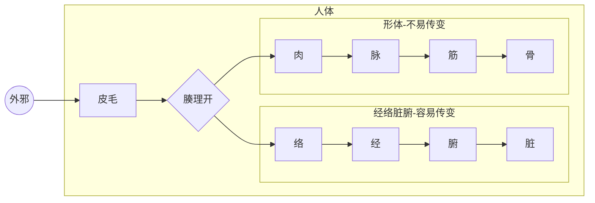

# 第六章 人体部位的划分及病证的轻重传变

## 1、部位划分

关于部位的划分，在前面的章节中已经部分提及，但因这个内容比较重要，这里再做一个总结梳理，使大家能有更清晰的印象。

从不同的角度看，人体的部位有很多种分法。就像一个国家的划分可以根据不同的标准，比如按照省来划分，或者按照方位划分，按照边境与内地的标准划分，按照城市等级划分等等。每个部位可以视为一个单元，有自身的要素平衡与失衡。

人体的部位划分主要有以下几种：

#### 1.1、脏腑与形体 

这种划分方法是按照资源的产生与使用来划分的。

形体是资源的使用者，从质地上分皮、脉、肉、筋、骨，位置包括头、颈项、胸、腹、背、腰、四肢手足、关节。

脏腑即是气血的产生者又是使用者，包括五脏六腑，五脏为肝、心、脾、肺、肾，六腑为胆、小肠、胃、大肠、膀胱、三焦。

脏腑按照上下方位可以分为三焦：上焦主要包括心肺，中焦主要包括脾胃，下焦包括肾、膀胱、大小肠等。

#### 1.2、三阴三阳

按照元气与物质阴阳比例，可划分为三阴三阳区域。比如太阳区域包括足太阳膀胱腑、膀胱经、手太阳小肠腑、小肠经，其它五个区域类同。

依据三阴三阳进行疾病的区分，简称为六经辨证。这种划分方法是《伤寒论》采用的方法，对中医至关重要。

#### 1.3、外邪侵入过程划分：

从外邪的侵入角度划分，可以分为皮、脉、肉、筋、骨、经、络、脏、腑。

如上图所示，外邪先侵袭皮毛，然后或入络经腑脏，或入肉脉筋骨，依次发展。至于走哪条通路，最终到达哪个部位，主要取决于该部位的正邪力量对比。邪气能通过的部位，必然是该位置的正气不足，所谓“邪之所凑，其气必虚”。而正气充足的部位，邪气必然难以通过，即为“正气存内，邪不可干”。

注意这里的经络也是一种部位，有寒热虚实的失衡。因经络是气的通道，所以变化很快。又因为经络外连皮肉筋骨、内通脏腑，所以涉及范围很广。再因为不同经络互相连接，所以可以互相传递。

> 百病之始生也，必先于**皮毛**，邪中之则腠理开，开则入客于**络脉**，留而不去，传入于**经**，留而不去，传入于府，廪于**肠胃**（1）。邪之**始入于皮**也，沂然起毫毛，开腠理；其**入于络**也，则络脉盛色变（2）；其入**客于经**也，则感虚乃陷下（3）；其留于**筋骨**之间，寒多则筋挛骨痛，热多则筋弛骨消，肉烁腘破，毛直而败（4）。
>
> 《素问•皮部论》...
>
> 如《医学源流论》说：“故邪之伤人，或在皮肉，或在筋骨，或在脏腑，或在经络，有相传者，有不相传者，有久而终不传者，其大端则中于经络者易传；其初不在经络，或病甚而流于经络者，亦易传；经络之病，深入脏腑，则以生克相传；惟皮肉筋骨之病，不归经络者，则不传，所谓躯壳之病也。故识病之人，当直指其病在**何脏何腑，何筋何骨，何经何络**，或传或不传，其传以何经始，以何经终，其言则历历可验，则医之明者矣。……至治之难易，则在经络者易治；在脏腑者难治，且多死；在皮肉筋骨者易治，亦不易死，其大端如此。至于躯壳之属于某经络，以审其针灸用药之法，则《内经》明言之，深求自得也。”
>
> 《黄帝内经讲解-外邪的传变与病理》

> 如果**邪气中於络**，则络脉不和，营卫不运，肌肤不养，所以麻木不仁；若**邪气中於经**，则经脉不利，气血不通，周身不贯，所以肢体重滞不举；**若邪气入於腑**，阻遏神识，则昏不识人；**若邪气入於脏**，脏气受邪，气机将息，所以出现舌蹇难言，口吐淤涎等证。这就是邪气中络、中经、入腑、入脏所产生的不同证状。
>
> 《金匮要略讲解-中风历节》

《伤寒论》是论述风寒之邪外袭皮毛、经络之后的各种表现治法。根据其人本身的健康状态差异，邪气或传或不传，或一日一传，或多日一传，或先作用于太阳经络后传于阳明经、少阳经，再传于三阴经络，或未经阳经直接作用于三阴经，或由经传入脏腑，等等情况，不一而足。邪气作用于不同部位，则有对应表现与治法。

> 所谓传变，则主要是对这一变化的描述，邪气由此经进入彼经，则谓之传。随着邪气的转移，临床证候也必然相应地发生变化,有传必有变，故称传变，也即传经。传与不传与邪气的盛衰，正气的强弱，治疗与护理之是否得当有关，尤以正气的抗邪能力大小为关键。若正气虚衰，邪气则可由表传里，由浅入深，使病证渐趋沉重；若正气恢复，抗邪有力,邪气又可由里达表，由阴出阳，使病向愈。辨传与不传，传至何经,当以脉证变与不变为据。
>
> 《伤寒论讲解-绪论》

#### 1.4、表里划分

从人体与外界的关系角度，有表、里的划分方法。表指的是皮肤、肌肉及涉及到皮肤、肌肉的经络，里指的是除了表之外的部位，包括脏腑、筋骨等。

> 表指经络、肌表部位，里指脏腑、筋骨、气血等。
>
> 《中医药学概论- 八纲辨证》

之所以把表提出来做一个单独的部位重点提示，是因为表这个部位是人体与外界的边界，外部的邪气通过这里进入体内，体内的邪气也可能通过这里排出到体外。一些脏腑疾病在治愈好转过程中，通常会有邪气出表的过程。因此表这个部位出现失衡的时候，有哪些表现，如何治疗，学习中医的人应该掌握。表部位失衡包括我们常说的感冒或者一些皮肤病。感冒对于健康人是小病，因其正气足，常能自愈。但是对于有脏腑疾病的人，感冒治疗正确与否，决定了其脏腑疾病的减轻或者加重。内经说“善治者治皮毛”，也有中医说“不会治疗感冒就不会治疗癌症”，即为此意。

表是一个概括词，包含人体表层的皮毛、肉、经、络。

失衡部位在皮毛，可能有发热、恶寒及汗功能异常等症状；

失衡部位在肌肉的话，可能有身痛的症状；

失衡部位在经的话，通常会在经络分布区域中的一些脆弱部位表现出典型症状。以寒邪侵袭经络为例：

在太阳经有头、项、腰、脊僵硬疼痛的症状。

> 太阳经脉行于项背，太阳之气行于体表，邪伤太阳，有**病偏于表**者，中风、伤寒是也，有**病偏于经**者、太阳经输不利证是也。但二者又不可截然分开，表证中可见头项强痛之经输不利，经输不利证中又可见汗出（或无汗）恶风寒等表证。太阳表证，治用汗法解表；经输不利证，重用葛根解经中之邪并配合解表，证与方药丝丝入扣。
>
> 《伤寒论讲解-14条》

在阳明经，有身热、目痛、鼻干、不得卧的症状；

在少阳经，有胸胁痛、耳聋等症状

在太阴经，有腹满、咽干的症状

在少阴经，有口燥、舌干而渴的症状。

在厥阴经，有烦闷，囊缩（男子阴囊上缩，女子外阴内缩）等症状。

> **尺寸俱浮者，太阳受病也，当一二日发（1）。以其脉上连风府，故头项痛，腰脊强（2）。**
>
> **尺寸俱长者，阳明受病也，当二三日发。以其脉夹鼻络于目，故身热、目疼、鼻干、不得卧。**
>
> **尺寸俱弦者，少阳受病也，当三四日发。以其脉循胁络于耳，故胸胁痛而耳聋。此三经皆受病，未入于府者，可汗而已（3）。**
>
> **尺寸俱沉细者，太阴受病也，当四五日发。以其脉布胃中络于嗌（4），故腹满而嗌干。**
>
> **尺寸俱沉者，少阴受病也，当五六日发。以其脉贯肾络于肺，系舌本，故口燥，舌干而渴。**
>
> **尺寸俱微缓者，厥阴受病也，当六七日发。以其脉循阴器络于肝，故烦满而囊缩。此三经皆受病，已入于府，可下而已（5）。**
>
> 《伤寒论-伤寒例》

以上是失衡在表，如果失衡在里，比如筋、骨、髓、血脉、脏、腑，则各有不同的表现。

#### 1.5、卫气营血

卫气营血也可以理解为一种部位划分方法，在**温热邪气**侵袭人体的情况下，这种划分方法比较有利于区分病情的轻重。

卫分指的是肺与皮毛。气分指胸膈、肺、胃、大、小肠、肝、胆等部位。营分指血中的营气或者心包；血分指的是心、肝、肾等部位。卫气营血的病位定义稍显模糊，主要是根据所影响的功能和舌脉等特征判断。

#### 1.6、小结

人体部位的划分非常重要，各个部位都可以视为一个单元，都可以有各自的寒热虚实病变，进而影响到相关功能。按照哪种方法划分要视情况而定，通常来说，三阴三阳六经辨证是一种主要的部位划分方法，但也视情况会使用到其它部位划分方法，比如三焦划分、脏腑形体划分等等。

《概论》辩证章节要学习的各种辩证方法，比如八纲辩证、六经辩证、脏腑辩证、气血津液辩证等等，就是从不同角度进行部位划分后产生的，各有特点，适用于不同的情况。

## 2、病证的轻重传变

中医的病证是指人体内环境失衡，这种失衡可以从一个部位传导到另一个部位，称为病证的传变。

病证从部位分布角度看，越向外越轻，越向里越重，所以病在皮毛为最轻，在经络、肉脉筋骨稍重，在腑则更重，在脏为最重。

病证的轻重对于某一个具体部位而言，主要观察该部位正邪力量的对比，即正虚与邪实的程度。正虚邪实的程度越轻，疾病越轻，反之越重。

以上两者结合，疾病最轻的情况是只在皮毛部位有轻微的正虚邪实，其它部位无病。健康人的一些小感冒即为此种情况，大多数情况下能自愈。最重的情况是五脏部位有严重的正虚邪实，往往预后不良。

疾病的轻重转化规律就是：部位上由外入里，程度上正气减少、邪气增加为疾病加重；反之部位上由里向外，程度上正气增加、邪气减少为疾病减轻。

> 时气不和，便当早言，**寻其邪由，及在腠理**（2），以时治之，罕有不愈者。患人忍之，数日乃说，**邪气入脏，则难可制**。
>
> 《伤寒论讲解-伤寒例》 

疾病能够向某部位转化，必然是因为该部位的正气不足，否则不会受邪，即使受邪也会迅速排出。以后我们学习伤寒金匮的时候，无论是伤寒外感六经的传变还是内伤脏腑五行的传变，都是符合此原则的。比如金匮中说“**见肝之病，知肝传脾，当先实脾，四季脾旺不受邪，即勿补之**”，说明虽然肝病倾向于向脾传变，但若脾的正气足，是可以抵御这个过程的。伤寒论中说太阳病可以依次传阳明、少阳、太阴、少阴、厥阴，也经常有不依此次序的情况，即是因为不同人正气程度不同所致。

> 传与不传与邪气的盛衰，正气的强弱，治疗与护理之是否得当有关，尤以正气的抗邪能力大小为关键。若正气虚衰，邪气则可由表传里，由浅入深，使病证渐趋沉重；若正气恢复，抗邪有力,邪气又可由里达表，由阴出阳，使病向愈。
>
> 《伤寒论讲解-绪论》

> **伤寒三日，三阳为尽，三阴当受邪⑴。其人反能食而不呕，此为三阴不受邪也⑵**...
>
> 太阴病应见腹满而吐，食不下等证，今则反能食而不呕，表明脾胃之气调和而无病。太阴气旺，能为三阴之屏障，则少阴、厥阴也不会受邪，故曰"三阴不受邪”，可见仲景辨传与不传，并不以日数计，而仅依脉证断。
>
> 《伤寒论讲解-270条》

中医治病的核心原则就是：对五脏疾病存在严重的正虚邪实的情况，以扶正祛邪的方法，恢复正气，减少邪气，使其向腑病转化，由吐或下的方式排出；或由里病向表病转化，以汗的形式排出。部位由里到外，程度由重向轻，即是常说的“阴证转阳证”，直至治愈。

> 凡由阴证转化为阳证，或由阳证转化为阴证的，即是疾病性质的根本转变。这种转变，常常取决于邪正双方力量的对比。凡正气充足的，大多由阴转阳，疾病向轻浅转化，正气虚衰的，大多由阳转阴，疾病向重深发展。例如：《伤寒论》太阳篇：“病发热头痛，脉反沉，若不差，身体疼痛，当救其里，宜四逆汤。”(92条)《伤寒论》阳明篇：“脉浮而迟，表热里寒，下利清谷者，四逆汤主之。”(225条)这是阳气衰微，正气不足，或治疗失当，重伤其阳，致使阳经之病，从阴化、寒化，转为阴证的证候。
>
> 《黄帝内经讲解-阴阳互根互用的关系》 

一般来讲，阴证往往表现在饮食差、睡眠差、体力差等方面，阳证往往饮食、睡眠、体力尚可，有时会表现出发高热或机能亢奋等情况。所以民间以能吃、能睡、能干活作为身体健康的简单标准。

要注意的是，阴证的外在表现有时不如阳证的表现剧烈。比如发热这个症状，中医认为发热多为正邪对抗。脏病之人正气不足，驱邪无力，往往发热不明显，而腑病反而会有高热的现象。所以当脏病向腑病转化或者里证向表证转化的时候，虽为阴证转阳证的好事，但有时病人自我感觉可能会更不舒服。这种情况即考验医生的技术水平，也考验病人的信任程度，如果不懂原理，处理不当，会重新由阳证返回阴证，功亏一篑。

判断疾病的势头会向哪里转变，即为判断病势。这需要全面了解病人各部位的正气与邪气的分布情况，根据正邪力量对比及可能传变的道路，预估疾病的变化。通过各种治疗手段，提前截断疾病转重的通道，引导疾病向轻、浅发展，并随着变化调整方药治法，这个过程与打仗时根据战场势态随时调整兵力部署很相似，所以说“用药如用兵”。

在病情复杂情况下，如不了解病位、病性、病势，只靠病名即开出方药，可能偶尔有效，但更多的是无效甚至产生其它不好的变化。

因不同部位各有其功能，各种部位失衡导致的相关功能异常会有独特的外在表现，所以需要通过外在表现来判断疾病的部位及程度，并指导治疗的方向，这就是中医诊断的内容，见下一章。

> “观其脉证，知犯何逆，随证治之”，意为诊察病人现有的脉象和证候，了解以往在治疗上发生过什么错误，然后根椐具体情况进行论治。这不仅是治疗坏病的原则，也是辨证论治精神的具体体现。
>
> 《伤寒论讲解-辨太阳病脉证并治上第五》

#### 附：中西医标准的一些差异

西医疗法往往要求量化、可重复，即所谓的科学方法。而中医的神、元气、气态物质等指标难以量化，所以难以纳入现代医疗体系。

人体是一个非常复杂的系统，西医在对某一局部位置、局部指标进行精确干预的时候，往往无法判断这种干预对系统其它部位功能的影响是好还是坏，所获得的好处与副作用难以比较大小，不知道是“得大于失”还是“得不偿失”。而中医在中医理论的指导下，对人体疾病的轻浅与深重有独特的判断方法，所以虽然模糊，但是却能总体把握疾病的走向。钱学森先生作为“中国航天之父”，就是认识到人体属于复杂巨系统，应充分考虑人体不同系统之间的相互影响，使用系统论的方法进行研究。因为中医的理论包含了很多系统论的思想，所以钱先生认为中医才是医学的发展方向。

比如西医多使用验血的方法了解疾病的轻重。血液指标确实可以在一定程度上代表疾病的轻重。但是在某种情况下又并非如此。比如肝肾疾病，中医调理的初期可能有某些血液指标升高的情况。这是因为血液作为一种载体，承担着运载肝肾废物排出的功能。肝肾功能好转过程中，会排出更多废物到血液中。此时化验血液，就会出现指标升高的现象。这种情况要等到肝肾功能完全好转，废物全部排出，血液指标才会恢复到正常值。

那么如果出现血液指标升高，如何判断疾病是减轻还是加重呢？中医是通过人的面色、舌像、脉像、饮食、睡眠、精神、体力等方面来判断，也即是常说的望闻问切四诊。常有病人同时选择中西医治疗，当遇到两者指标冲突的时候，若不理解中医的道理，可能就放弃了中医的治疗。

西医的很多治疗方法是调节血液指标，缺钾补钾，缺钠补钠，尽量满足血液指标的平衡。中医则通过四诊的方法，按照中医疾病轻重进退的理论，评估西医治疗的优劣。西医治疗后，若从四诊上看有好转，中医可能会认同，若四诊判断没有好转，甚至加重，中医则反对。实际上很多中医反对西医的原因，并非是反对某一具体疗法，而是发现很多病人经过西医的治疗，原本是正气足、抗邪有力的情况，治疗后转变成正气虚、无力抗邪的情况，也即从阳证转为阴证，从疾病轻浅变为深重。

由此可见，学习中医，一是要理解中医疾病轻重进退的道理，二是要对中医的四诊非常熟悉，如此才能对疾病的病位深浅、虚实性质、程度轻重、变化进退有理有据。至于治疗之法，反而多种多样，针砭灸药看情况选择即可

总体来说，从中医角度看待西医疗法，大多属于治标之法。“急则治其标，缓则治其本”，遇到紧急情况，在没有更好办法的时候选择西医方法救急是可以的。因为此时若不缓解症状，可能有生命危险，所以即便疗法有副作用，也无暇顾及。但最好是熟悉中医诊疗理论，一方面提前发现问题，尽量不要让身体出现紧急情况。另一方面，万一出现紧急问题，能用中医方法解决。李可老中医被称为“中医ICU”，说明中医在急救方面也有独到方法。或者即便紧急情况用到西医急救，待情况缓解后，也应以中医治本方法调理。中医学的好就会明白，方法手段只是工具而已，中医理论才是根本，在中医理论指导下，西医的疗法未必不可以成为中医的工具，只看能否将其用在合适的时机。

  

## 题目

1. 三阴三阳部位划分方法中，太阳区域包括足太阳膀胱腑、-----、手太阳小肠腑、小肠经
2. 表里部位划分方法中，表这个部位是人体与外界的----。一些脏腑疾病在治愈好转过程中，通常会有----的过程。

