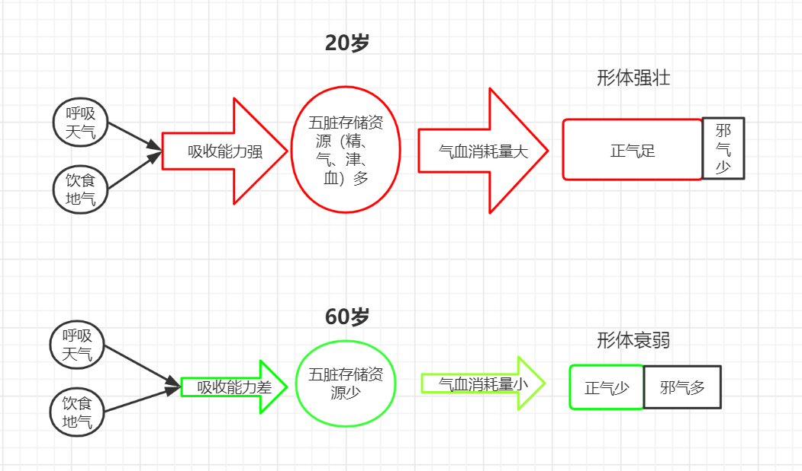

# 第六章 人体各类平衡波动

[TOC]

前面说过，中医的阴阳平衡指的是各类指标要素在时间上的正常波动和空间上的合理差异，因此人体中包含很多这种时间上的波动变化。这是以前教材中没有明确说明的内容，所以这里重点说明一下。

## 1、形体与气血之间的平衡

形体以气血为根本，气血可以为形体组织建立适宜的内在环境、输送营养和排除垃圾。正常情况下，气血的量是随着时间节律，在一个适宜范围内波动的。量偏高的时候，有利于形体组织的生长与修复，量偏低的时候各种生命活动低沉。若气血量长期过低，则皮肉筋骨等形体组织开始出现问题。

对应前面房间与暖气的例子，形体指的是房间，气血指的是暖气。房间大小应与暖气功率相匹配，形体大小应与气血的多少相匹配。

> **形气有余，脉气不足死；脉气有余，形气不足生。**
>
> 《素问•方盛衰论》...
>
> 形体如常，脉衰微不甚应指，预后多不良。这是因为脉之微甚，反映脏气的盛衰，脉微欲绝，说明脏气已败，故主死。形体衰弱，脉尚未衰微欲绝，与形体相比，相对有余的，预后多良好。这是因为脉尚有余，脏气未衰，故主生。
>
> 《黄帝内经讲解-(十三）脉证逆从》

## 2、阳气波动与气血之间的关系

阳气作用于阴液而生气血，各要素皆有平衡。其中阳气虽然重要，但不要走入极端，只强调阳气是错误的。

如前所述暖气的例子，暖气完成供暖功能，需要火、水皆在平衡范围内。水火相对而言，火为阳，有主动性；水为阴，有被动性。调节暖气的输出功率时，只要调节火的大小，水温和蒸汽量即随之增减。火大则水、气皆热，火小则水、气皆寒，这就是阳主而阴从。

> 人与外在自然环境的统一，依靠什么进行适应性调节活动的呢？主要依靠自身的阳气。所以《内经》有“生气通天”之说。“生气”，这是指人体的阳气。姚止庵说：“生气者何？生生之气，阳气也。”又云：“惟人阳气上与天通。”所谓“通”，即相互关连的意思。认为人体阳气的活动能对天气的变化，随时作出应答反应……天热则腠理开，阳气外泄，故汗出而小便少；天寒则腠理闭，阳气内敛，故汗少而小便多，这正是通过阳气的适应性反应实现的。
>
> 《黄帝内经讲解-人与自然变化的关系》

这里要重点提示，阳气主导的平衡波动是在阴液适量的前提下进行的。如果暖气中的水量很少，小于平衡范围，则火稍大一点，就容易烧干，谈不上行使暖气的功能。自然界也是如此，四季的形成是由阳光的多少变化而主导，但前提是大地有足够的水土。如果在水土贫瘠的沙漠，光靠阳光的增减是无法形成茂密森林的。

因此，阳主阴从、阳气为主导的含义是水火在平衡波动的前提下，火起主导作用，而非不考虑水的多少，一味的增加火量。

人体也一样，中医往往通过阳气的波动来代表整个气血的波动，但不意味着不考虑阴液的因素。人的津液正常的情况下，阳气适当增加，则人体的气足，反之则气稍弱。但若在津液虚的情况下，单纯增加阳气会更加消耗津液。

人体单纯阳虚则补阳；单纯阴虚则补阴；阴阳两虚则用侧重补阳的甘温之剂，虽侧重补阳，但也兼顾补阴。

> 《内经》强调阴阳关系的协调平衡，并不排斥阳气的主导作用，因为阴和阳两个方面，并非完全处于同等的地位，而是有主有从……
>
> 肯定阳气的主导作用。这不意味着“贵阳贱阴”，而是在以“阴为基础”的前提下来认识阳气的重要作用。与只重视阳气者自有区别。就临床来看，阳虚者固当扶阳，阴虚者亦当滋阴，这在调整阴阳的治疗过程中是无可非议的。但如果证属阴阳两虚，一般都侧重阳虚而用甘温分剂，《灵枢•终始》说：“阴阳俱不足，补阳则阴竭，泻阴则阳脱，如是者可将以甘药，不可饮以至剂。”
>
> 《黄帝内经讲解-阴阳互根互用的关系》

## 3、精与气血总量及分布的波动变化

精为气血之本。脾胃吸收的水谷精微有两个去处，一个是转化为全身的气血消耗使用，另一个是存入脏腑，成为脏腑所藏的精。因此在各脏腑功能正常、脾胃吸收水谷精微的速度一定的前提下，气血总量与脏腑藏精量成反比。气血总量高的时候，脏腑藏精量降低。气血总量低的时候，脏腑藏精量高。

气血的分布可分为内外两大区域。内为脏腑，外为形体。气血在整体均衡分布的基础上稍有波动。形体获得气血多的时候，脏腑获得的少，反之亦然。

劳作时，消耗的气血总量变大，而相应脏腑的藏精量减少。气血的分布为形体气血偏多而脏腑偏少，有利于形体组织健康，使人的皮肤致密、肌肉结实、血脉通畅，能够更好的保护身体不受外界侵袭，即为养阳，这里的阳是指形体。

休息时，消耗的气血总量小，而脏腑藏精量增加。气血的分布为形体气血偏少而脏腑偏多，有利于脏腑化物、藏精等后勤保障工作，让脏腑健康，藏精更多，即为养阴，这里的阴指脏腑。

因劳作健壮了形体，形体才能在休息时卫护于外，保证脏腑不被外界邪气侵袭。因休息时积累了精气，才能在劳作时提供足够的精来转化气血。休息与劳作一阴一阳，互为因果。两者都有合适的度，需要劳作以养阳，又不能过度劳累；需要休息以养阴，又不能过度休息。所谓一阴一阳谓之道。人的一生就是在这种养阴、养阳的波动中逐渐消耗肾精，直到先天之精耗尽，度天年而去。

> **阴者，藏精而起亟也；阳者，卫外而为固也。**阴不胜其阳，则脉流薄疾，并乃狂。阳不胜其阴，则五脏气争，九窍不通。
>
> 是以圣人陈阴阳，**筋脉和同，骨髓坚固**，气血皆从。如是则**内外调和**，邪不能害，耳目聪明，气立如故。
>
> 《素问•生气通天论》

人要想健康长寿，需要通过休息内养五脏以藏足精气，通过劳作外健形体以抵御邪气侵袭，再加思想恬淡以养神，就如内经开篇《素问-上古天真论》所说：圣人**形体不敝，精神不散**，可以活到百岁。

> 其次有**圣人**者，处天地之和，从八风之理，适嗜欲于世俗之间，无恚嗔之心，行不欲离于世，被服章，举不欲观于俗，外不劳形于事，内无思想之患，以恬愉为务，以自得为功，**形体不敝，精神不散**，亦可以百数。
>
> 《素问-上古天真论》

<注>：“阴者，藏精而起亟也；阳者，卫外而为固也”，传统上，此处理解阴为阴精，阳为阳气，因解释不通顺，是中医的一个难点。此处的阴应理解为内在脏腑，可藏精，阳理解为外在形体，可保卫脏腑，对应内经的“内为阴，外为阳”比较好。同样，“春夏养阳，秋冬养阴”，这里的阳也不是指阳气，而是指形体；阴不是指精血，而是指脏腑。

> 阴精是阳气的物质基础，阳气要发挥应有的作用，需要阴精的支持，所以阴精要不断地输送精气于全身，以供给阳气的需要，这叫“阴者，藏精而起亟”。阳气对阴精有固摄作用，阴精要藏守于内，需要阳气固密于外，所以阳气要不断敷布于体表，以抗御外邪，固密阴精，这叫“阳者，卫外而为固也”。
>
> 《黄帝内经讲解-阴精与阳气的主要功能和关系》

### 3.1、一年四季的变化

一年四季，自然界阳气波动。自然界的生命顺应这种变化进行生、长、收、藏的活动。农民要按照节气在春天播种，夏天浇水，秋天收获，冬天储备。遵循这个规律，就收获丰富，违反这个规律，就生活困难。说天道无私，就是自然界的阴阳变化按照规律运转，并不因人的行为而受影响。但是人的行为却要遵循天地规律，违反则自己受损，与天地无关。所以两者之间，人要顺从天地。

> 故阴阳四时者，万物之终始也；死生之本也；逆之则灾害生，从之则苛疾不起，是谓得道。
>
> 道者，圣人行之，愚者佩之。从阴阳则生，逆之则死；从之则治，逆之则乱。反顺为逆，是谓内格。
>
> 《素问-四气调神大论》

#### 3.1.1、正常人顺应四季变化的规律

正常人具有较强的自我调节能力，对于普通的干扰可以自主调节平衡。四季阳气的波动变化就是一种普通的干扰，正常人是可以应对的。四季阳气波动对人体小自然的影响是：春夏时，让人体阳气由内出外；秋冬时，让人体阳气由外入内。这是类似大海潮汐的一种波动。这种波动是自然界施加给人的干预力量，无法避免，只能顺应。

> 是故**冬至四十五日，阳气微上，阴气微下；夏至四十五日，阴气微上，阳气微下**。
>
> 《素问•脉要精微论》

那么人体如何顺应这种变化呢？春夏，肌表阳气增加易变热，所以肌表的津血也要随之增加，才能维持平衡；脏腑阳气减少易变寒，脏腑要产生一定的阳气来补充这种损失，才能维持脏腑不变寒。秋冬则相反，此时脏腑阳气增加易变热，需要增加脏腑津血；肌表阳气减少易变寒，肌表要减少津血以维持平衡。这种调节是由神负责控制，精负责转化，再加脏腑经络共同配合而完成的。

春夏之时，阳气向肌表波动，人体也随之调动气血趋向肌表，打开皮肤腠理。此时适度增加劳作，可促进气血向肌表的运动，消耗很少的精就可以达到血脉通畅、形体健壮的效果，即为养形体这个阳。春天，气血充实于经脉。到夏天经脉中的气血已经充满，进入络脉、皮肤。到了长夏，经脉、络脉中的气血都已充满，开始向内充实到肌肉。

秋冬之时，阳气向脏腑波动， 气血也随之趋向脏腑，人的腠理开始闭合。人应随之减少劳作，让气血多留于脏腑，降低气血的总量消耗，会剩余更多的后天之精存入脏腑，脏腑精气充满，完成养脏腑这个阴的过程。秋天，表皮气血减少。冬天，气血多藏于内部的骨髓与五脏。

> 岐伯曰：**春**者天气始开，地气始泄，冻解冰释，水行经通，故**人气在脉**。**夏**者经满气溢，入**孙络受血**，**皮肤充实**。**长夏**者，**经络皆盛**，内**溢肌**中。**秋**者天气始收，**腠理闭塞，皮肤引急**。**冬**者，盖藏**血气在中**。内着**骨髓**，通于**五脏**。是故邪气者，常**随四时之气血而入客**也。至其变化，不可为度，然必从其经气，辟除其邪，除其邪则乱气不生。
>
> 《素问•四时刺逆从论篇》

如果冬天过度劳作，因此时阳气潜藏于内，过度的驱使气血走向机体，就如逆水行舟，需要消耗更多的精来转化阳气与气血。这个道理就如我们希望花草在冬天的时候开放，就需要扣大棚，并单独提供热量。虽能达到目的，但是消耗的资源必然更多。

如此一来，一方面会导致脏腑藏精不够，不利于来年春夏养阳使用。另一方面也需要消耗更多的先天肾精，会缩短人的寿命。再有就是，冬天劳作出汗，寒气容易经皮肤腠理而入，可能直接发为伤寒病，或者潜伏于体内，到春夏发为其它病。

> **冬时严寒，万类深藏，君子固密，则不伤于寒，触冒之者，乃名伤寒**耳。其伤于四时之气，皆能为病，以伤寒为毒者，以其最成杀厉之气也。中而即病者，名曰伤寒。不即病者，**寒毒藏于肌肤，至春变为温病，至夏变为暑病**。暑病者，热极重于温也。是以**辛苦之人，春夏多温热病者，皆由冬时触寒所致**，非时行之气也。...
>
> **从霜降以后，至春分以前，凡有触冒霜露，体中寒即病者，谓之伤寒也。**
>
> 《伤寒论讲解-伤寒例》

春天精化气血由肝主导；夏天气血充养形体，由心主导；秋天气血收隐，由肺主导。冬天精气潜藏，由肾主导。

> **帝曰：藏象何如？**
> **岐伯曰：心者，生之本，神之变也；……通于夏气。**
>
> **肺者，气之本，魄之处也；……通于秋气。**
>
> **肾者，主蛰，封藏之本，精之处也；……通于冬气。**
>
> **肝者，罢极之本，魂之居也；……通于春气。**...
>
> 肝主疏泄而调畅气机，同时又主升发阳气，促进全身气血的流畅，这本身就具有生养人体之气的作用。
>
> 《黄帝内经讲解-五脏功能与形体组织、四时阴阳的关系》

> **五藏者，所以参天地，副阴阳，而连四时，化五节者也。**
>
> 《灵枢•本藏》

养生从人的起居看，春夏应晚睡早起，更多的接触太阳阳气，适度增加劳作，让形体组织象自然界的植物生命一样生长、壮大。秋天的时候，应早睡早起，养秋收之气。冬天的时候，应早睡晚起，减少劳作，降低气血消耗，使精藏于脏腑。

从人的思想方面看，因人之气血随思想而动，所以春夏宜心情舒畅、乐观积极；秋冬则宜意志安宁，平静内敛。

一年四季，气血的波动环环相扣。春天生发的气血，到了夏天壮大，供形体成长之用。夏天壮大的气血，供秋天收养之用。秋天收养之气血，供冬天藏精之用。冬天所藏之精，再供春天生发气血所用。每一个环节如果出现问题，则既伤害本环节的脏器，又影响下一环节的功能。

> **但天地动静，阴阳鼓击者，各正一气耳。是以彼春之暖，为夏之暑；彼秋之忿，为冬之怒。**...
>
> 《伤寒论-伤寒例》

> **春三月，此谓发陈。天地倶生，万物以荣；夜卧早起，广步于庭，被发缓形，以使志生；生而勿杀，予而勿夺，赏而勿罚，此春气之应，养生之道也。逆之则伤肝，夏为寒变，奉长者少。**
>
> **夏三月，此谓蕃秀。天地气交，万物华实；夜卧早起，无厌于日；使志无怒，使华英成秀，使气得泄，若所爱在外，此夏气之应，养长之道也。逆之则伤心，秋为康疟，奉收者少，冬至重病。**
>
> **秋三月，此谓容平。天气以急，地气以明，早卧早起，与鸡俱兴；使志安宁，以缓秋刑；收敛神气，使秋气平；无外其志，使肺气清，此秋气之应，养收之道也。逆之则伤肺，冬为飧泄，奉藏者少。**
>
> **冬三月，此谓闭藏。水冰地坼，无扰乎阳；早卧晚起，必待日光，使志若伏若匿，若有私意，若已有得；去寒就温，无泄皮肤，使气亟夺，此冬气之应，养藏之道也。逆之则伤肾，春为痿厥，奉生者少。**
>
> 《素问•四气调神大论》

四季阴阳的变化，春夏可以理解为一次周期比较长的劳作，秋冬可以理解为一次周期较长的休息。为什么通常要在春夏劳作、秋冬休息呢？这是因为大自然春夏的时候给人施加了一种影响，让人的阳气走向肌表。人顺应这种力量推动气血走表，则完成同样的养形体的过程，消耗的肾精较少。不借助这种力量，比如有人喜欢在秋冬的时候运动，也可以让气血走表，虽然也可以健壮形体，但是消耗的肾精更多，从寿命的角度看，是不合算的。

自然界四时阳气波动，人体阳气也随之内外波动。人应顺应这种波动来养阳、养阴，就是“与万物沉浮于生长之门”。逆此波动，则形体之阳、脏腑之阴都养不好，肾精消耗速度快，人易病、早衰、短寿。

> 夫四时阴阳，万物之根本也，所以圣人**春夏养阳，秋冬养阴，以从其根，故与万物沉浮于生长之门。逆其根，则伐其本。坏其真矣。**故阴阳四时者，万物之终始也，死生之本也，逆之则灾害生，从之则荷疾不起。
>
> 《素问•四气调神大论》

> 凡**阴阳之要，阳密乃固，两者不和，若春无秋，若冬无夏，因而和之，是谓圣度。**故阳强不能密，阴气乃绝，阴平阳秘，精神乃治，阴阳离决，精气乃绝。
>
> 《素问•生气通天论》

#### 3.1.2、病人不能顺应四季变化的情况

上一小节是从健康人养生角度来理解四时变化。如果是原本不健康的人，不能跟随四时阴阳变化来自我调整身体，则会出现病症。此时不要教条，要根据失衡情况，以调节平衡为先。

《伤寒论》辨脉法章节中，谈到如果让病人过量出汗，则伤人体阳气，过度泄下，则伤人体阴气。人体阴阳两伤，则调节平衡的能力不足。在阴历五月份夏至前后的时候，阳气表多里少，里部阳气不足而未能及时补充，就会里寒，这样虽然天气很热，但是人却要多穿衣服，此时应补里部之阳。阴历十一月冬至前后之时，阳气表少里多，里部阳气多则需要补充里部阴气以达到平衡，阴气不足而未能及时补充，就会里热，这样虽然天气很冷，但人却喜欢少穿衣服，此时应补里部之阴。

> **大发其汗，又数大下**之，其人亡血，病当恶寒，后乃发热，无休止时。**夏月盛热，欲著复衣，冬月盛寒，欲裸其身。**所以然者，阳微则恶寒，阴弱则发热，此医发其汗，使阳气微，又大下之，令阴气弱。**五月之时，阳气在表，胃中虚冷，以阳气内微，不能胜冷，故欲著复衣**。**十一月之时，阳气在里，胃中烦热，以阴气内弱，不能胜热，故欲裸其身**。
>
> 《伤寒论-辨脉法》

> 病人**身大热**，反**欲得衣**者，**热在皮肤**，**寒在骨髓**也。**身大寒**，反**不欲近衣者**，**寒在皮肤**，**热在骨髓**也。
>
> 《伤寒论-11条》

以上说的是伤寒误治，使人阴阳两伤，不能顺应季节变化而出现的状况。推而广之，可知当人的调节能力过弱之时，就会随着四季阳气变化而表现出特定的寒热现象。

春夏阳气波动于形体肌表，肌表阴液不足而不能补充的人，则会出现形体阴虚而热的病证，必须补足阴液。这就像自然界春夏之时，干旱的大地如想长出庄稼，必须浇水，是一个道理。而春夏时，人内在脏腑的阳气外出，脏腑功能是下降的，所以还要考虑加强脾胃功能，才能将补入的阴液充分吸收。

> 春温夏热，元气外泄，阴精不足，药宜养阴；秋凉冬寒，阳气潜藏，勿轻开通，药宜养阳。
>
> 《神农本草经疏》

如春夏形体未养好，护卫能力弱，到秋冬的时候，肌表阳气减少，则畏寒怕冷，不能完成保护脏腑的功能。严重者，形体有淤血、痰饮，春夏时未能治愈，处于爆发疾病的边缘，到秋冬之时，气血内藏，形体正气减少，更容易爆发疾病，则此时也可以临时鼓动气血以缓解问题。秋冬本宜休息藏精，不宜驱动气血走向形体，但因形体问题紧急，只好行权宜之法，不得已而为之。

秋冬应该加强脏腑藏精。如过于开泻，精未能藏足，到春夏的时候，气血生发就没有来源。如果教条的认为春夏应该补阳气、多劳作以健形体，强行调动本不多的精转化气血，则犯虚虚之戒。此时应该视情况休息以养脏腑之精。春夏本不宜休息养精，但因秋冬藏精不足，也是不得已而为之。

如人表里皆有问题，里部五脏藏精不足，肌表护卫能力又弱，则“阳（形体）不能卫外，阴（脏腑）不能藏精”，就很危险了。此时应该按照“急则治标、缓则治本”的原则，酌情处理。

必须要认识到，形体也好，脏腑也好，阳气能量与固、液、气态物质的平衡关系是最基本的。此处参考前面人体基本原理章节中家庭暖气的例子。无论何时这种平衡关系出现失衡，都是必须要调节的。此时即便是违背了春夏养阳、秋冬养阴的规律，也不得不先处理这种失衡，否则可能没等到天年，人就先夭折了。

### 3.2、一昼夜的波动变化

一昼夜的阳气波动，原理与一年的阳气波动原理差不多，所以人应白天工作，晚上休息。昼夜波动幅度不如四季波动大，所以中医常用四季变化来举例。

> 以一日分为四时，朝则为春，日中为夏，日入为秋，夜半为冬。朝则人气始生，病气衰，故旦慧。日中人气长，长则胜邪，故安。夕则人气始衰，邪气始生，故加。夜半人气入蔵，邪气独居于身，故甚也。...
>
> 尽管昼夜阴阳变化的幅度不如四时，但同样具有类似的运动规律。张介宾说：“人身之阴阳，亦与一日四时之气同。故子后则气升，午后则气降，子后则阳盛，午后则阳衰。”
>
> 《黄帝内经讲解-正邪消长的昼夜节律》

> **阳气者，一日而主外，平旦人气生，日中而阳气隆，日西而阳气已虚，气门乃闭。**
>
> 《素问•生气通天论》

### 3.3、脉象与气血的关系

脉的本质是血液在脉管中的波动情况。血液运行的初始动力是心气，过程又需要宗气的辅助。因此脉象能够体现人体气血的分配以及气血之间的平衡情况。正常的脉象三部九侯都有脉，代表全身内外都有气血在起作用。各处脉的波动情况基本一致，代表气血在全身内外的分配比较均匀。

> 正常脉象，又称平脉、常脉。平脉的至数是一息（一呼一吸）脉来四至，脉象和缓有力均匀，**寸、关、尺三部和浮、中、沉九候均有脉**。
>
> 《中医药学概论-诊法》

> **问曰：脉病欲知愈未愈者，何以别之？答曰：寸口、关上、尺中三处、大小、浮沉，迟数同等，虽有寒热不解者，此脉阴阳为和平，虽剧当愈。**
>
> 《伤寒论讲解-辨脉法》

当各部位气血有波动的时候，在脉象上有对应的变化。比如夏天的时候，气血分布于机体表层多一些，则脉象偏浮一点，轻按的时候脉比较明显，重按稍弱；冬天气血在脏腑多一点，则脉象偏沉一点，轻取稍弱，重按明显。

> 万物之外，六合之内，天地之变，阴阳之应，彼春之暖，为夏之暑，彼秋之忿，为冬之怒。四变之动，**脉与之上下，以春应中规，夏应中矩，秋应中衡，冬应中权。**是故冬至四十五日，阳气微上，阴气微下；夏至四十五日，阴气微上，阳气微下。**阴阳有时，与脉为期，期而相失，知脉所分**，分之有期，故知死时。
>
> 《素问•脉要精微论》

诊脉的时间，一般选择在清晨日出，未进饮食之时，此时气血在全身的分配最平均。夜晚气血偏于里，白天气血偏于表，饮食后气血偏于脾胃，不同情况下气血各有所偏。所以若在其它时间诊脉，当脉象有些异常的时候，需要判断是正常的气血变化还是异常的气血变化。

> **诊法常以平旦，阴气未动，阳气未散，饮食未进，经脉未盛，络脉调匀，气血未乱，故乃可诊有过之脉。**
>
> 《素问•脉要精微论》

人在白天、夏天、运动劳作、外感邪气的时候，气血消耗总量大，偏聚集于外在形体，脉偏浮；夜晚、冬天、休息、五脏患病的时候，气血消耗总量小，偏聚集于内在脏腑，脉偏沉。 

### 3.4、小结

本节内容首先探讨了何为养阴与养阳，以及养阴、养阳的意义。其次探讨了为什么春夏适宜养阳，秋冬适宜养阴，以及违背这个规律的后果。再次探讨了人体若不能顺应四季变化，可能产生的病证以及治疗原则。

养阴与养阳的过程中，人体的波动涉及到多个方面，是比较复杂的，总结如下：

1、气血总量与五脏藏精量：养阳的时候，人体的气血总量增减，五脏藏精量减少；养阴的时候，气血总量减少，五脏藏精量增加。

2、气血在内外的分配：养阳的时候，脏腑与形体所消耗的气血都高。但在内外分配方面上，形体比脏腑消耗的气血多，所以此时脉浮；养阴的时候，脏腑与形体所消耗的气血都低。但脏腑比形体获得的气血多，所以此时脉沉。

3、形体五体与骨髓的差异：养阳的时候，五体皮、肉、脉、筋、骨获得气血皆多，而骨髓气血少；养阴的时候，五体气血减少，而骨髓气血增加。这是因为骨髓由精产生，精足则髓足。

> **冬**者，盖藏**血气在中**。内着**骨髓**，通于**五脏**。

4、五脏之间的差异：五脏之间比较，养阳的时候，心、肝的气血相对更多；养阴的时候，肺、肾的气血相对多。这是因为养阳的时候，气血总量增加，需要心调集更多肝所藏之血，输出到全身。而养阴的时候，气血总量减少，需要肺收隐气血于内，肾负责藏精。

> 一身之血，均在脉中运行，这依赖心阳的温煦与心气的推动，方可周流不息，濡养全身。
>
> 《中医药学概论-心、小肠》

> 人体内的血液分布，常随着各种不同的生理状况而改变，这种血量的改变，主要取决于肝的贮藏与调节。当人处于休息或睡眠时，人体的活动量减少，血液的需要量亦相对减少，部分血液便藏于肝。**当人处于活动状态时，肝脏就把所贮存的血液输布于人体**，以供人体的需要。
>
> 《中医药学概论-肝、胆》

肝工作量偏大的时候，在脉象表现为偏弦。心工作量偏大的时候，在脉象表现为偏洪。肺脉偏浮，肾脉偏沉，也是同理。明白这些，后面学习脉象的时候，就可以理解为什么四季该有的正常脉象为春脉稍弦、夏脉稍洪、秋脉稍浮、冬脉稍沉，即四季常脉的原理。

> 正常人的脉象还可因季节气候的影响发生变化。如，春季脉稍弦，夏季脉稍洪，秋季脉稍浮，冬季脉稍沉。
>
> 《中医药学概论-脉诊》

以上即为养阴、养阳波动所涉及方面的总结。

另外，还要注意适度劳作与剧烈运动的区别。从内经与伤寒等经典的论述看，中医不提倡出大汗的剧烈运动，而提倡在养阳的时候适度劳作，可出微汗。劳作的目的是让气血波动到形体，以健壮五体。当出微汗的时候，说明气血已经行至肌表，腠理已经打开，持续一段时间即可达到目的。过度出汗的剧烈运动，消耗的气血过多，虽然形体可以得到很多的营养，但消耗的精过多，不利于养生。所以内经谈到春夏养阳的时候，说可以“广步于庭”，即多走路；《伤寒论》谈到汗的时候，说春夏宜汗，又说凡是出汗，以全身包括手足小汗潮润为标准，不提倡“如水流离”的大汗。

> **大法，春夏宜发汗。**...
>
> 凡发汗，欲令**手足俱周，时出似漐漐然，一时间许益佳**。**不可令如水流离**。若病不解，当重发汗。汗多者必亡阳，阳虚不得重发汗也。
>
> 《伤寒论讲解-辨可发汗病脉证并治第十六》

## 4、年龄增长的相关波动变化

从人的一生角度看，气血与形体都有波动性。孩童形体幼小，气血也少，但两者相比，气血多于形体，所以活力旺盛、喜动。青壮年，形体长成，气血也充沛，两者配合比较合适。老年气血衰减，形体也随之衰弱，两者相比，气血少于形体需求，所以喜静。这就是人一生的形体、气血波动趋势。

随年龄的增长，气血衰减的主要原因是先天之精越来越少，以肾精为代表的脏腑精气也逐渐减少，供给给形体的气血能量越来越不足，排除邪气的能力就减弱，于是身体中积累的痰饮、淤血等邪气越来越多。正愈虚而邪愈实，人就逐渐衰老，疾病增多、变重。

前面说脏病重于腑病，腑病重于筋脉皮肉病。但是如果把精与神考虑在内的话，精与神的层次还要高于脏。人在孩童时期，天真无邪，神思不乱，所以神足。加上肾精中的先天之精充足，精可补充一身的阴阳。孩童的形体虽未长成，但精、神充足，对身体阴阳失衡的调节能力很强，产生的气血数量超过形体基本需求，所以其生命力很强，活泼好动。

老人则相反，精、神都衰弱，导致脏腑功能下降，产生的气血不足以供养形体，所以行动迟缓，齿枯发落。虽然可以靠药物对脏腑虚实进行一定的调节，但是因其自身精神的调节能力已经很差了，所以效果也是有限。

也可以说，精是最好的药物，神是最好的医生。无论脏腑形体何处有虚实失衡，精、神皆可进行调节。精神充足，普通病邪难以深入，人一般无大病，有病也容易治疗。若精、神不足，一旦得病，小病易变大病、大病容易死亡，需要有高明的医生做精细的对证调节，才能治好。如果遇到鲁莽的大夫，胡乱攻补，小则伤身，重则送命。

> 黄帝问曰：余闻古之治病，惟其移精变气……岐伯对曰：……此恬淡之世，邪不能深入也。...
>
> 当今之世不然，忧患缘其内，苦形伤其外……内至五脏骨髓，外伤空窍肌肤，所以小病必甚，大病必死。...
>
> 上古……理色脉而通神明，……所以远死而近生……。中古之治病……标本已得，邪气乃服。……暮世之病也……治不本四时，不知日月，不审逆从……粗工凶凶，以为可攻，故病未已，新病复起。
>
> 《素问•移精变气篇》

青少年的时候，精、神充足，需要医药的情况相对少；中老年，精、神衰弱，需要更多医药来辅助补充调节；到晚年，精神衰竭，单凭医药就无能为力了。由此可见，积精全神才是健康长寿的根本。

> 养生方法虽然以保养精气神为核心，但是以节欲保精为第一要义。因为精气神是不分割的统一体，存则俱存，亡则俱亡。精能化气，气能生神，精、气、神存在着相互依存、相互转化的关系，而精是神气的本源，所以《内经》有“积精全神”之说。
>
> 《黄帝内经讲解-养生学说》

上一节谈到了四季阳气变化影响人体的阳气分配。对于青少年来说，因精神足，调节能力强，可以很自然的顺应这种变化，身体并无明显不适，甚至即便违背“春夏养阳、秋冬养阴”的规律也不觉有何异常。而中老年人调节能力变弱，对四季变化常有明显感觉。到晚年，调节能力极弱，有时一个节气的变化就可能产生严重问题。

## 5、月周期的波动变化

前述年周期，自然界阳气变化会引动人体的阳气变化。在内经中还谈到，一月周期，月圆月缺的变化会引动人体阴血的变化。

自然界海水受月亮的影响出现潮汐现象，人体内的津血等液态物质也有对应的潮汐现象。内经说，月满之时，自然界海水西盛，人体的气血波动于形体肌表，使肌肉充实，皮肤致密，毛发坚韧，腠理闭合，易生脂垢；月缺之时，自然界海水东盛，肌表血气不足，卫气消沉，肌肉消减，皮肤弛缓，腠理开泄，毛发摧残，肌肤纹理疏薄，脂垢剥落。

因此，月圆之时，肌表的气血充足，护卫能力强，邪气难以进入。反之，月缺之时，肌表气血不足，护卫能力弱，此时如有外邪侵袭，容易深入而爆发急病。

> 人与天地相参也，与日月相应也。故月满则海水西盛，人血气积，肌肉充，皮肤致，毛发坚，腠理郄，烟垢著，当是之时，虽遇贼风，其入浅不深；至其月郭空，则海水东盛，人气血虚，其卫气去，形独居，肌肉减，皮肤纵，腠理开，毛发残，腠理薄，烟垢落，当是之时，遇贼风，则其入深，其病人也**卒暴**。
>
> 《灵枢•岁露》

天气温暖的时候，肌表气血的流动顺畅，适宜针刺调理气血。环境寒冷的时候，肌表气血的流动慢，不适宜针刺。这是”天寒无刺，天温无疑“。

月满的时候，肌表气血充足，针刺时无需用补法。月初生的时候，肌表气血少，针刺时不宜用泻法。月无光时，肌表气血过少，连针刺治法都不宜使用。

可以推论，环境寒冷的时候，即便月满也不适宜针刺，因为气血流动慢；月无光的时候，即使环境温暖也不适宜针刺，因为肌表气血过少。

> 是故天温日明，则人血淖液而卫气浮，故血易泻，气易行；天寒日阴，故人血凝泣而卫气沉。月始生，则血气始精，卫气始行；月郭满，则血气实，肌肉坚；月郭空，则肌肉减，经络虚，卫气去，形独居。是以因天时而调血气也。是以天寒无刺，天温无疑。月生无泻，月满无补，月郭空无治，是谓得时而调之
>
> 《素问•八正神明论》

以上是内经提到的针刺法与日月的关系。从中应能体会出阴阳的特点。阳足，为热量足，气血流动快；阴足为津血的量大。就像前述烧水的例子，水火具足才能产生足够的气，火不足或水不足皆不能正常工作。

## 6、其它周期的波动变化

除了上述波动变化外，中医还有六十年周期的五运六气变化。主要是研究星体对自然界和人体的五运六气的影响，每年这个因素对人体也有很重要的影响。但是这方面的内容较多，而且有些原理也不完全清晰，就不在此处探讨。

此外传统文化中，还有风水中的三元九运一百八十年周期，《皇极经世经》的元、会、运、世十二万年周期，而佛学中的成、住、坏、空周期更长。这些波动变化周期已经超出普通人的寿命，不属于常规中医的内容范畴，也不在此处探讨。

虽然各种波动很复杂，但是核心原理还是一个，就是能量与物质固、液、气三态的平衡。这里谈到的各种波动力量都是一种干预因素，如果有利因素叠加在一起，对人的平衡就有很好的帮助作用。反之不利因素叠加的时候，就有很大的危害作用。但各种波动也只是一种干预因素而已，如果人自身的正气强大、平衡控制力强，就可以抵御各种不良干扰，反之若正气弱，则稍有干扰就会发病，甚至死亡，所以最终还是要回归“积精全神，修身养德”。