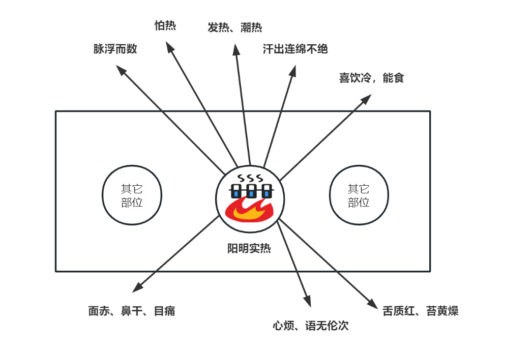
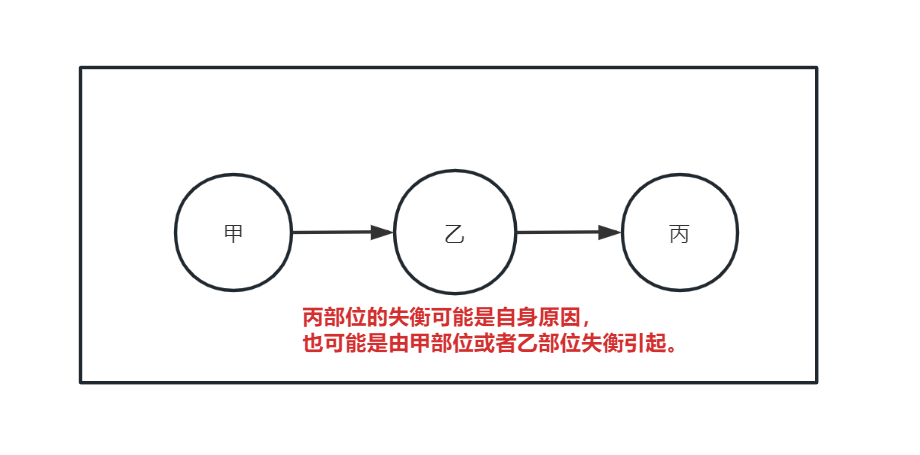

# 第七章 判断人体失衡情况

## 1、诊断基本原理 

前面介绍了人体的要素包括精、神、元气、气、血、津液、形等，这类要素的失衡就称之为证。判断要素失衡状态的过程称为辨证。中医辨证的原理主要包括以下两方面： 

1）有形与无形的关系

人体几种要素中，精、神、元气能量、气态物质属于肉眼不可见的要素，称为无形之物。血、津液、形体属于肉眼可见的有形之物。无形之物难以观察测量，有形之物易于观察测量。有形与无形的物质相互作用，可以通过有形之物的状态反推无形之物的状态。这个原理就像风吹旗子，风为无形的空气流动，其风力大小无法直接观察，但是我们可以根据旗子被风吹后的表现，来判断风力的大小。  

2）内与外的关系

人体内外有别，有形的物质虽然容易观察，但若隐藏在人体内部，则观察也是有难度的。但人是一个整体，内在的失衡必有外在的表现。如果掌握了内在失衡和外在表现的关系，就可以通过外在表现判断内在状态，这就是中医“有诸内，必形诸外”、“司外而揣内”的道理。

基于以上两点，搜集人体外在、有形的表现，来判断人体内在、无形的状态，判断精、神、元气、气态物质、血、津液等要素的平衡或者失衡，这就是中医诊断的道理。人体外在、有形的表现称为“**症**”，内在各要素的失衡称为“**证**”。在中医中，这两字同音但内涵不同。

> **证**，是机体在疾病发展过程中的某一阶段的病变部位、原因、性质，以及邪正关系的概括。因此，证是反映疾病发展过程中，某一阶段的**病变的本质**，所以它比**症状**对疾病的揭示更全面、更深刻、更正确。
>
> 《中医药学概论-辨证论治》

无论中医、西医，诊断的原则都是要把内在、无形而难以观察的要素状态，通过某种方法转化为可以方便观察的状态。科技界发明了很多检测工具，比如CT、核磁等。这些工具扩展了人的观测能力，可以在一定程度上更清晰的显示某些内在状态。从观察角度看，这是值得肯定的事情。中医也希望有某些设备，能够更准确、直接的显示神、元气、气态物质等要素的状态。但是因科技发展的局限，能达到中医要求的这类工具还没有实用化。现在医疗设备的检测结果对中医有一定参考价值，但对具体的辨证、用药指导性并不强。所以中医还只能使用“司外揣内”的方法，通过外在表现，来间接的判断其关注的要素状态。

## 2、诊断基本常识

中医收集人体外在表现有一套成熟的体系，即大家熟知的“望闻问切”四诊。这四诊概括了人体各方面的正常与异常表现。这些外在表现与内在要素的基本关系，就是中医诊断的基本常识。

这方面的内容比较多，这里只能介绍一些初步方法，从判断精、神、气、血的角度讲起。更详细的内容需要学习《概论》的四诊章节、《口诀》的四诊、《内经》的诊法、《伤寒论》的脉法等等。

### 2.1、判断神的状态

神藏于心，外候在目。

判断神的状态主要看双目。目光明亮、眼神灵活、目中润泽，目睛清莹，了了分明，此为神气充足。若是两目呆滞、目光晦暗、蒙混不清，是神气不足的表现。瞳仁散大，为肾精不足或将竭；瞳仁固定，为精绝神亡。

其次看神志是否清楚、反应是否灵活、说话是否有条理、发音是否清亮等等。

另外，注意是否是假神的情况。假神是指久病而重危的病人，突然精神转佳，言语不休，索饮索食，呼吸平匀，如同常人，这种假象，称为假神。假神往往是回光返照，很可能短时间即告死亡。

### 2.2、判断精的状态

精有先、后天之分。先天之精在肾，后天之精在脾。

肾的功能主生殖、主骨。

从生殖角度，当男子溢精和女子月经来潮的功能出现问题的时候，标志肾精不足。

从主骨角度看，齿为骨之余，肾主骨，精生髓。所以精开始不足的时候，先从牙齿上体现出来，松动掉落。进一步不足的时候，从骨骼上体现出来，老年人弯腰驼背、容易骨折。到比较严重的时候出现肩垂，项倾，腰折，膝败，脊骨突起的现象，称为大骨枯槁，表明肾精已经衰弱到相当严重，预后不良。

脾主消化吸收，主肌肉。

从消化吸收角度看，当人的饮食能力下降，标志脾精开始不足。

从肌肉角度看，当出现肌肉不结实、人中沟变浅缩短的情况，代表脾的能力下降。严重的出现臂、腿、臀等部位的肌肉失养、瘦削，称为大肉陷下，则代表脾精衰败。

> 骨为肾所主，肾为先天之本；肉为脾所主，脾为后天之本。如果人中沟深而长，面部肌肉高厚，轮廓方正，面部上、中、下三部耸起而不平陷，肌肉丰满，骨骼高起者，则提示先后天精气皆旺盛，所以人能长寿，活百岁而终其天年。
> 
> 《黄帝内经讲解-寿夭与先后天的关系》

### 2.3、判断气血的状态

中医判断气血的内容最多。这里简单介绍：面色、脉象、舌诊等几种方法的大概原则，算是索引，具体要参考教材诊断的内容。

#### 2.3.1、面色

面色包括面部的颜色和光泽。一般来说面色光泽明亮，为身体气血充足的表现，即使得病，问题也不大。

> 张三钖说：“五脏六腑之精华，上彰于明堂，……但当求其有神，虽困无害，神者色中光泽明亮是也，脉有胃气，同一理也。”
>
> 《黄帝内经讲解-色脉互参》

为什么面部的色泽能反应人体气血的状态呢？因为人体脏腑与经络相联，全身的经络都与面部相联。只有脏腑正气充足，功能强健，邪气很少，才能在面部体现出光泽明亮的状态。

> 十二经脉，三百六十五络，其血气皆上注于面而走空窍。
> 
> 《灵枢-邪气脏腑病形》

具体面部不同的部位与脏腑的关系，内容也比较多。《概论-诊法》不太详细，应该参看国医大师孙光荣主编的《口诀浅释》的望诊部分。

> 两眉之间，名为印堂，又称阙中，在面部中间的最高之处，是相关肺病的部位；印堂的上面，名为阙上，阙上到头发边缘，名为天庭，天庭处在整个面部最高最上的地方，是相关头面疾病的部位；阙上处在天庭和印堂之中，所以是相关头面及咽喉疾病的部位，印堂略向下，在两眼之间，名为山根，又称下极，是相关心病的部位......
> 
> [《口诀浅释》](https://www.gmzyjc.com/read/qs/qs01.md#_2)

#### 2.3.2、脉象

脉的基础知识请参考《中医药学概论》的诊法部分，这里只谈一些补充内容。

诊脉是要判断气血这种流动之物在身体的升降出入状态，其形式是通过感受一些部位的动脉跳动形态来判断。

血液运行的动力方面，初始动力是心气，辅助动力为经络之气。经络之气含宗气、营卫、脏腑之气。

无形的气态物质推动有形的血脉跳动，因此脉象能够体现人体整体气血分配、局部气血平衡及邪气干扰情况。

> 脉乃气血先见，气血有盛衰，脏腑有偏胜。
>
> 《桂本伤寒论-平脉法第一》

正常的脉象三部九侯都有脉，代表全身内外都有气血在起作用。各处脉的波动情况基本一致，代表气血在全身内外的分配比较均匀。各处脉在基本一致的基础上又稍有差异，代表各脏腑有一定的偏性。

> 九候之相应也，**上下若一，不得相失**。一候后则病，二候后则病甚，三候后则病危。所谓后者，应不俱也。 
>
> 《素问-三部九候论》

##### 2.3.2.1、脉的指标维度含义

脉的波动，其频率、力度、长度、高度等等指标皆有特定意义。

> 所谓脉象，实际上是脉搏搏动的部位、速度、形态、强度、节律等因素的综合分析。
>
> 《口诀浅释-切诊》

力度：力度代表气的状态。脉搏的力度应适中，若力度过小，称为虚脉，代表气不足；若力度过大，称为实脉，代表邪气过多而正气不虚，正邪对抗有力。

> 气独胜者，则脉强；...气偏衰者，则脉微；
>
> 《桂本伤寒论-平脉法第一》

宽度：宽度代表脉管中血的数量。脉的宽度应该适中，若宽度过于窄小，甚至像线一样，称为细脉或小脉，代表血管中的血不足；若宽度过大，称为大脉，代表血管中的血偏多。

长度：长度代表肝胆之气，肝胆之气调节气的运行。脉搏每个波动与按脉手指接触的长度应适中，若长度较长，像琴弦一样，称为弦脉，代表肝胆气瘀滞，气不通则痛，所以常有痛症。若长度较短，像豆子一样，称为动脉，代表气血不通或者气血逆乱。

> 伤寒，**脉弦细**，头痛，发热者，属**少阳**。
> 
> 《伤寒论讲解-265条》

这里弦脉是一个容易误解的脉，因其解释为像琴弦，容易被误解为有力。其实弦脉就是长度较长，与力度无关。

> 春脉弦……其脉之来，**濡弱而长**，故曰弦。
> 
> 《难经-十五难》
> 
> 紧脉是言其有力，弦脉是言其**挺直的形象**。
> 
> 《口诀浅释-切诊》
> 
> 弦脉与紧脉似同而实异。**弦以象言**，紧则以力言。弦脉如弓弦，按之不移；紧脉则如转动的绳索，来往有力而不固定。
> 
> 《伤寒论讲解-辨脉法》

起伏流利程度：脉的起伏若过于流利，感觉圆滑，称为滑脉，代表气血涌动过快；若起伏艰涩、迟滞，如轻刀刮竹，称为涩脉，代表气血不足。  在伤寒论平脉法中谈到，气血都盛，则脉盛。如果气正常，只是血盛，则脉滑；只是血衰，则脉涩。

> 血独盛者，则脉滑；血偏衰者，则脉涩；
>
> 《桂本伤寒论-平脉法第一》

这里涩脉和前面的小脉都是说血不足。但是前面的小脉代表的是血管中的血多少。这里涩脉似乎是脉起伏过程中，相关的组织对这种起伏的阻力较大，组织中的血少，则阻力大而使起伏艰涩，姑且这么理解。

> 涩者阳气有余也，滑者阴气有余也；阳气有余为身热无汗，阴气有余为多汗身寒，阴阳有余则无汗而寒。
>
> 《素问-脉要精微论》

频率：频率代表温度。脉搏正常频率应该是一呼一吸跳动四次，多于五次称之为数脉，代表有热，多于七次为疾脉，代表过热，危险；少于四次称为迟脉，代表有寒。在伤寒论平脉法说，阳气过多会偏热，脉数；阴液过多会偏寒，脉迟。

> 阳迫气血，则脉数；阴阻气血，则脉迟；
>
> 《桂本伤寒论-平脉法第一》

高度：高度代表气血的内外分配。脉的高低是指轻按为高，又叫浮取，离皮肤近；重按为低，又叫沉取，离骨近；不轻不重在两者之间为中取；正常情况下，无论浮、中、沉，脉搏的感觉应相差不大，代表气血分配较均匀。如果轻按的脉搏比重按的时候明显，称为浮脉，代表气血聚于表层。若重按的脉搏更明显，称为沉脉，代表气血聚集于里层。

> 脉浮是气浮于表而血虚于里，故云浮则无血。脉大是阳弛于外而阴乘于里，故云大则为寒。
>
> 《伤寒论讲解-辨脉法-单元3》

> 气血俱盛，脉阴阳俱盛；气血俱衰，脉阴阳俱衰。气独胜者，则脉强；血独盛者，则脉滑；气偏衰者，则脉微；血偏衰者，则脉涩；气血和者，则脉缓；气血平者，则脉平；气血乱者，则脉乱；气血脱者，则脉绝；阳迫气血，则脉数；阴阻气血，则脉迟；若感于邪，气血扰动，脉随变化，变化无穷，气血使之；病变百端，本原别之；欲知病源，当凭脉变；欲知病变，先揣其本，本之不齐，在人体躬，相体以诊，病无遁情。
>
> 《桂本伤寒论-平脉法第一》

以上力度、频率、高度、宽度、长度、起伏代表了脉搏的几大维度指标，每个指标都有其正常范围，超过正常范围则为失衡，向上失衡为阳，向下失衡为阴。所以《桂本伤寒论-平脉法第二》说“**凡脉大、浮、数、动、滑，此名阳也；凡脉沉、涩、迟、弦、微，此名阴也**”，其中浮、沉是从高度辨阴阳，滑、涩从起伏辨阴阳，数、迟从频率辨阴阳，动、弦从长度辨阴阳，大、微从宽度辨阴阳。

> **问曰：脉有阴阳，何谓也？**
> **答曰：凡脉大浮数动滑，此名阳也；脉沉涩弱弦微，此名阴也。凡阴病见阳脉者生，阳病见阴脉者死。**
>
> 《伤寒论-辨脉法》

这些指标排列组合可以形成非常多的组合脉象，有丰富的含义。比如脉数代表热，脉无力代表气虚，若两者兼有，数而无力，则代表气虚而热；若是数而有力则代表实热。其它各类组合，如浮大数、浮数、沉涩、细数等等各有其含义。组合脉象的数量远远超出后世所说的二十八脉。二十八脉只是常见病脉的总结，其中有些为组合脉，比如濡脉为浮、细、虚的组合，主有湿邪；芤脉为浮、大、虚的组合，主津血伤；革脉为芤脉浮、大、虚的基础上加弦的组合，主精血亏；。

> 此言者，非有六脉俱动也，谓浮、沉、长、短、滑、涩也。浮者阳也，滑者阳也，长者阳也；沉者阴也，短者阴也，涩者阴也。所谓一阴一阳者，谓脉来沉而滑也，一阴二阳者，谓脉来沉滑而长也，一阴三阳者，谓脉来浮滑而长，时一沉也；所谓一阳一阴者，谓脉来浮而涩也；一阳二阴者，谓脉来长而沉涩也；一阳三阴者，谓脉来沉涩而短，时一浮也。各以其经所在，名病顺逆也。
> 
> 《难经-四难》

总之脉象越接近正常波形，人越健康；远离正常波形，则不健康，严重的则代表死亡。中医中的各种绝脉，比如真脏脉、死脉、怪脉都是远离正常波形的脉象。理解脉的逻辑含义，能认识到脉象是按照不同维度的阴阳进行组合的道理，学习脉诊并不难。

##### 2.3.2.1、脉之常变

人体之气血随着生活节奏正常变化，脉象上就有对应的变化。比如夏天的时候，气血分布于机体表层多一些，则脉象偏浮一点，轻按的时候脉比较明显，重按稍弱；冬天气血在脏腑多一点，则脉象偏沉一点，轻取稍弱，重按明显。

> 万物之外，六合之内，天地之变，阴阳之应，彼春之暖，为夏之暑，彼秋之忿，为冬之怒。四变之动，**脉与之上下，以春应中规，夏应中矩，秋应中衡，冬应中权。**是故冬至四十五日，阳气微上，阴气微下；夏至四十五日，阴气微上，阳气微下。**阴阳有时，与脉为期，期而相失，知脉所分**，分之有期，故知死时。
>
> 《素问-脉要精微论》

诊脉的时间，一般选择在清晨日出，未进饮食之时，此时气血在全身的分配最平均。夜晚气血偏于里，白天气血偏于表，饮食后气血偏于脾胃，不同情况下气血各有所偏。所以若在其它时间诊脉，当脉象有些异常的时候，需要判断是正常的气血变化还是异常的气血变化。

> 诊法常以平旦，阴气未动，阳气未散，饮食未进，经脉未盛，络脉调匀，气血未乱，故乃可诊有过之脉。
>
> 《素问-脉要精微论》

人在白天、夏天、运动劳作、外感邪气的时候，气血消耗总量大，偏聚集于外在形体，脉偏浮；夜晚、冬天、休息、五脏患病的时候，气血消耗总量小，偏聚集于内在脏腑，脉偏沉。 

肝工作量偏大的时候，在脉象表现为偏弦。心工作量偏大的时候，在脉象表现为偏洪。肺脉偏浮，肾脉偏沉。所以春脉稍弦、夏脉稍洪、秋脉稍浮、冬脉稍沉，这是四季常脉的原理。

> 正常人的脉象还可因季节气候的影响发生变化。如，春季脉稍弦，夏季脉稍洪，秋季脉稍浮，冬季脉稍沉。
>
> 《中医药学概论-脉诊》

理解了脉的指标含义，又知道脉的正常变化，以后遇到异常变化就有所判断。各种脉象所代表的更多含义，参考教材的[《概论-切诊》](https://www.gmzyjc.com/read/gl/gl05-0.4.0.0.0.md)、[《口诀浅释-切诊》](https://www.gmzyjc.com/read/qs/qs01.md#_6)、[《伤寒论讲解-辨脉法》](https://www.gmzyjc.com/read/shl/shl01.01-1.2.0.0.0.md)大家应认真学习。

#### 2.3.3、舌象

舌象也是一种重要的诊断方法。舌象主要包括舌体与舌苔两部分，舌体就是舌的肉质部分，舌苔是舌头上的那一层苔。舌象可以反应人体的气血状态，舌体代表固液态的地气，舌苔代表天气。

体内的精、元气、血、津液等要素正常时，体现在舌象为：舌体颜色粉红、质地润泽、柔软灵活、无裂纹、厚薄适中、边缘光滑；舌苔颜色淡白、干湿适中、薄薄一层、全面覆盖舌体。

反之各要素有失衡时，在舌象上有对应变化，比如气热则舌苔黄、血热则舌体红、津血亏则有裂纹等等。

详见《[中医药学概论-望舌](https://www.gmzyjc.com/read/gl/gl05-0.1.4.0.0.md)》、《[口诀-舌诊新法](https://www.gmzyjc.com/read/kj/fjkj01.html#_3)》、《[口诀浅释-吴坤安察舌辨证歌](https://www.gmzyjc.com/read/qs/qs01_01.md#2)》

舌诊是一种简便的诊断方法，每个人都应该掌握。

#### 2.3.4、脉诊与色诊的区别

脉诊与色诊有一个区别在于脉象更能体现当前的身体能量状态，而面色更能体现较长时间的身体状态。年轻健康的人初得病的时候，一般不易发生面色的变化，而脉象上往往有体现。而老年久病之人，面色不好，经过调理后，可能脉象很快能见到好转，但是面色的好转要经过一个相对长的时间。

> 面部色泽变化是五脏精气盛衰的具体表现，一般情况下新病不易引起色泽的变化。所以如果面色失于荣润，都是病久伤及五脏精气的表现，所以为久病。所谓“脉不夺”，是相对“色夺”而言的，意谓久病面部色泽的异常变化较脉象的异常变化更为明显，所以不能理解为久病没有脉象的异常变化。
> 
> 《黄帝内经讲解-色脉互参》

### 2.4、小节

诊断总的原则是，无论望色、切脉、舌诊还是其它方面，我们都需要先知道正常人的情况是如何的，比如*正常的面色是怎样的*？*正常的脉象是怎样的*？*正常的舌象是怎样的*？然后才能知常达变，通过病人面色、脉象和舌象与正常情况的区别，来分析人体气血失衡的虚实，并施以补泻的调理方案。然后再根据调理后面色、脉象、舌象的变化，来确定调理方向是否正确。如此反复，最终将脉象、舌象调理到正常为止。

除了上述色、脉、舌的诊断外，其它的诊断多与部位的**功能**有关。比如肌表有护卫身体的功能，该部位失衡就有对外界寒热感受的异常。脾胃有消化饮食的功能，失衡则有多食或者不能食的异常。肺有呼吸的功能，失衡则有咳喘的异常。如此等等，具体可参看《概论》的辨证章节。

中医关注的外在表现很多，大方面包括舌、脉、目、面、发、齿、唇、鼻、耳、皮、肉、筋、骨、渴、饮、食、便、寒、热、睡、汗、精神、体力、头、颈、项、背、胸、腹、肩、腰、手、足等等，每个大方面下面还有各种小指标。这些指标各有意义，可以从不同角度反应内在状态，属于诊断基本功。算下来至少几百个指标需要学习并能熟练应用，这不是一个简单的事情。

诊断知识需要系统学习，全面掌握。诊断知识不全，临证就容易发生漏诊。明明**病人已经有某个明确外在表现表明内部的失衡情况，医者不知，必然不能正确辨证**，也就谈不上正确治疗。所以诊断基本功是否扎实，是专业人士和业余人士的关键区别。中医专业人士经过系统学习后，对人体的外在表现非常敏感，比如面色变化、寒热变化、声音变化、形体变化等等，会立刻联想到人体内部的气血精神问题，以及相应的方剂治法。而业余人士则没有这个能力，经常纠结于一些细枝末节症状，对关键表现却视而不见，自然无法进行系统的辨证分析，也无法给出解决办法。

## 3、关于病

中医的证用现代语言描述，就是能源、控制、能量、固液气态物质等要素在保持内环境平衡时出现的问题。这些问题会让人体产生很多变化。其中一部分变化显露于外，比如舌、脉等，能够被观察，就成为诊断的依据。还有一些变化会影响人的重要功能，给人造成痛苦，就成为大众普遍认知的疾病。

比如肝经产生湿热的失衡。当这种失衡很轻微时，人只是稍有不适，难以被重视。当程度加重时，则肝经巡行的多个相关部位会出现病态表现，上可有口苦、目赤、耳聋耳肿、牙痛，中可有胁肋胀满疼痛，下可有小便淋浊、阴痒阴肿等。其中某些病态表现特别突出，就会被认为是必须治疗的病。这些病态表现在现代定义中会被区分为不同的病种，比如牙痛、耳聋、淋病等等，而在中医看来，此时是一个原因，即为肝经湿热。该证被治好，则其引起的一系列病态表现都会减轻或消失。

中医主要是治证。同一种病，比如耳鸣，多种病证皆可以导致此病。肝胆火旺可以导致耳鸣，肾气虚也可以导致耳鸣。病证不同则治法不同。这称为同病异治。同一类病证，比如肝经湿热，因肝经巡行多个部位，每个相关部位都可能因此而表现出疾病。此时病虽不同，但病证相同，所以治法就相同。这称为异病同治。综合两者，就是证与病是**多对多**的关系，两者不在一个维度上。

> 辨证论治...既可看到**一种病可以包括几种不同的证，又看到几种不同的病在其发展过程中可以出现同一种证。**因此，在临床治疗时，还可以在辨证论治的原则指导下，采取“同病异治”和“异病同治”的方法来处理。
>
> 《中医药学概论-辨证论治》

## 4、从多个角度判断一个证

中医的“司外揣内”是根据人的外在表现判断内部状态，简便易行。但是这种判断毕竟是外在间接判断，而不是直接看到到内在状态，因此，难免有一定误差。这就像我们通过汽车的故障灯判断发动机的故障，大多时候是正确的。但如果灯本身出了故障，发动机坏了而灯不亮，或者发动机没坏反而灯亮，这样就会出现误判。因此，尽量从多个角度进行判断。如果多个角度的外在表现都指向了某个部位的某种失衡，那么误判的可能性就要小多了。所以中医一直强调要尽量多的收集四诊信息，只凭脉，或者只凭舌象都是不够严谨的。

> 一脉所主非一病，一病所现非一脉，若不察外证，而凭脉用药，未有不误人性命者。因此，临证之时，仅凭脉诊，不及其余三诊的作法，是不利于临证的辨证论治的。
>
> 《中医内科学-中医内科学的学习方法》

比如对阳明部位实热的判断。阳明部位包含胃经、大肠经及相关胃腑和大肠腑，其功能是负责饮食的消化，所以阳气很足。实热的含义是该部位正气不虚，多出了无形的热邪。

判断这种情况的几个角度，从脉象看要有浮大而数；因里热外达，对外界寒热的感受应该是怕热，体温角度可能有发热或潮热，且发热不随汗出而减轻；汗的角度可能有大汗，汗出连绵不断，《伤寒论》称之为“汗出濈（jǐ）濈然”；因胃热，所以渴饮方面应该是口渴且喜欢喝冷饮，饮食方面应该是能食；从舌象看有舌质红而舌苔黄燥；因阳明经络通于面部而有面赤、鼻干、目痛；热邪过盛影响到心可导致心烦，严重可出现语无伦次、神识昏糊、狂躁不安（讝语）；体力方面应为有力；热邪严重，蒸发肠胃津液可能造成便秘。

如果一个人同时具有上面这些表现，就说明多个角度都指向是阳明热实的情况，辨为阳明实热证就比较有把握。如果只有一、两个表现，则要谨慎，再分析分析是否有其它可能。

人体的目、面、舌、脉搏及各种生理功能就像汽车的故障指示灯，能够表示出内在指标的各种问题。为了防止单一的指示灯故障，我们要收集尽量多的指示灯信息，进行综合判断。如果多个指示灯都指明是同一故障，才能比较准确的确定故障位置和性质。

有时还会出现不同的指示灯表达了相反的故障信息，这时要根据经验判断哪个指示灯表示的问题更准确，需要进行取舍，并在后继的调理过程中进行观察，判断取舍是否正确。这就是“舍脉从证”或者“舍证从脉”。

## 5、功能之间的逻辑关系判断主证

外在表现正常需要一系列内部器官协同工作，这些器官的功能构成了一种串联的逻辑关系。若出现某种病症，则需要排查相关各个内部环节，寻找哪个环节出现了哪方面的问题，排查过程需要更多信息。比如家里的灯不亮，如果其它电器正常，就是灯本身的问题。如果其它电器也没电，那么就可能是家里的电路问题。如果邻居家也没电，那就可能小区变压器问题。如果通过这类排查确定了是小区变压器问题，这就是确定了病位。下一步还需要查看变压器是失火、受潮还是短路，这就是确定病性。确定了病位、病性才能给出解决办法。只有灯不亮这一个信息，是无法确定病位、病性的，必须结合其它信息。

人体的饮食、呼吸、睡眠、大小便、护卫肌表、精神、体力等功能都是如此，这些功能若正常，代表体内一系列器官工作协调。如果异常，我们并不能立刻定位哪个相关部位的问题，需要通过更多的症状来进行细化分析。下面举几个例子说明：

### 1、怕冷：

卫气负责护卫肌表，如果散布于皮肤表面的卫气不足，就会出现异常的怕冷。但是此时我们还无法判断原因在哪里。因为卫气产生于脏腑，传输于经络，通过肌表腠理散布于皮肤表面。其产生、传递、散布的过程中，任何一个环节有问题都可以导致表面卫气不足。这就需要更多的信息来帮助定位。

如果怕冷还兼有发热，因发热往往表明肌表的正气比较充足，说明这个怕冷不是因为内部产生的卫气不够，而是肌表的问题。反之，如果怕冷不兼发热，则很有可能是内部产生或传输到肌表的卫气不够。这就是《伤寒论》第7条“病有发热恶寒者，发于阳也；无热恶寒者，发于阴也”的含义。这里的“发于阳”指的是根本问题在肌表，“发于阴”指的是根本问题在内在的脏腑经络。

> 病有发热恶寒者，发于阳也；无热恶寒者，发于阴也⑴。发于阳，七日愈；发于阴，六日愈，以阳数七阴数六故也⑵。[7]...
>
> 注家对“发于阳”主要有三种说法，一是指太阳中风，中风初起即有发热恶风寒。二是指发于太阳，太阳病多是发热与恶寒并见。三是指发于阳经、发于三阳，是阳证，**凡以发热为主要特征的，都是阳气抗邪有力的反映，所以都属阳证**，是三阳经病。注家对“发于阴”也有三种说法。一是指太阳伤寒，太阳伤寒初起常以恶寒为著，而不见发热。二是指发于少阴、少阴病，阳气虚衰，故以无热畏寒为主要特征。三是指发于阴经，发于三阴，是阴证，**凡以恶寒为主而不发热的，多是阳气虚衰，抗邪无力的反映，所以都属阴证**，是三阴经病。此三说皆对临证有指导意义。
>
> 《伤寒论讲解-7条》

人出现怕冷有很多原因，这里以受风寒侵袭为例进行分析。人体感受风寒后正常表现应为气血向肌表波动，正邪相争使身体发热，正气战胜邪气，通过自主出汗将邪气排出体外。汗后，身体恢复正常，各种异常症状消失。如果未能按此进程发展，则为病态，需要医药帮助。

受风寒之后，出现怕冷、发热的症状，说明是“发于阳”，即问题在肌表。此时要再看有汗、无汗。

如果怕冷有热而无汗：此时无汗是皮肤汗孔腠理被寒邪闭合，卫气无法通过汗孔散布到皮肤表面，就会导致怕冷。卫气无法散布于外而郁集于皮下，所以可能发热比较重。严重的话，皮肤腠理闭合，影响肺气向肌表的宣发功能，可能会出现喘的现象。由此，恶寒、发热、无汗而喘这一组症状，就成为“寒邪闭表”的典型表现（此时脉象应为脉浮紧）。这里的病位为肌表，病性为寒邪实证，治法用麻黄汤。此时寒邪阻碍经络气的运行，可能会造成身痛、腰痛等各种痛症，这种痛症是辅助症状，不作为用药的主要依据。

> 太阳病，头痛、**发热**、身疼、腰痛、骨节疼痛、恶风，无汗而喘⑴者，麻黄汤主之⑵。[35]...
>
> 这八个症状，可归纳为发热，恶风寒，诸痛，和无汗而喘三组，“恶风”是“恶寒”的互词，这是寒邪伤阳，温煦失司所致。**发热**是寒邪闭表，**阳气被郁而不得发泄**所致。“头痛”是头项强痛的省文，“身疼”为全身肌肉疼痛，“骨节疼痛。为全身关节疼，“ 腰痛，即腰脊痛，由于寒主收引，寒主痛，寒邪袭表，使营血涩滞，筋脉拘紧，故见诸痛。其中头项、腰脊为太阳经脉所过，更能反映太阳经脉被寒邪所伤的特征，正如《灵枢·经脉》所说：“膀胱足太阳之脉……是动则病冲头痛，目似脱，项如拔，脊痛腰似折。” “无汗”乃因**寒邪闭敛毛窍所致**，是伤寒表实证最具特征性的表现。肺合皮毛，今表气闭郁，肺气不宣，故喘。“无汗而喘”既是两个并列的症状，也揭示了。无汗”和“喘”的因果关系，**无汗为表闭，表闭则肺气不宣，肺不宣乃生喘**。若与第〔3〕条合参，当脉阴阳俱紧，方属寒邪束表，卫闭营郁之证。
>
> 《伤寒论讲解-35条》

如果怕冷有热且有汗：汗出而身体未恢复，不适症状仍在，这是不正常的，表明这个汗没有排邪，是病汗。有汗代表汗孔腠理没有被闭合，有热代表肌表阳气并不衰弱。卫气并不缺少，且可以通过汗孔到达皮肤表层，所以怕冷不会那么厉害。营卫相协而行，营行脉中，卫行脉外。营血与卫气互相配合才能正常完成功能。如果两者配合不协调，可导致异常出汗，即营卫不合的病汗。如果这种营卫不合是肌表受风邪影响而产生的，就有怕冷、怕风、发热、汗出的表现，用桂枝汤发微汗，调和营卫治疗。

> 太阳中风，阳浮而阴弱，阳浮者，**热自发**；阴弱者，**汗自出**⑴，啬啬**恶寒**，淅淅**恶风**，翕翕**发热**⑵，鼻鸣干呕⑶者，桂枝汤主之⑷。[12]...
>
> 太阳中风是**风邪袭表，营卫不和**，卫强营弱之证，治当解肌祛风，调和营卫，唯桂枝汤是至当之方，所以说“桂枝汤主之”。
>
> 《伤寒论讲解-12条》

> 病常自汗出者，此为荣气和，荣气和者，外不谐，以**卫气不共荣气谐和**故尔⑴。以荣行脉中，卫行脉外，复发其汗，荣卫和则愈，宜桂枝汤⑵。[53]...
>
> 但卫阳行脉外而固护营阴，营阴行脉中而滋助、制约卫阳，营与卫，内与外相合而不相离。今营行脉中，卫行脉外，相离而不相合，卫不固营，**营阴失护而外泄**，故用桂枝汤发汗以和营卫，使二者相合则自汗可止。
>
> 《伤寒论讲解-53条》

如果只怕冷，不发热，说明是“发于阴”，问题应在内在脏腑经络，再去寻找相关功能失常的表现协助判断。

以上是对相对健康的人感受风寒原理的粗略分析，主要是想说明中医根据功能逻辑关系判断病位的思路，即单纯一个怕冷的症状不足以判断病位病性，需要一组症状相互印证才能定位。对于原本就不太健康的人，比如原来就有阳虚、阴虚、湿气、内热等问题，则还有更多考虑，需要根据特定的表现进行辨证和治疗。像《伤寒论》346条的死证，发热、汗出不止伴随有下利（拉肚子）。有下利，说明里部阳不足，里部阳不足而表部有发热，说明表部这个热不是正气充足，而是阴盛格阳、孤阳外越。此时汗出不止，这个汗就不是正常的排邪外出，也不是营卫不和，而是营卫不足加虚阳外越，不能正常控制汗孔和营血。这种情况的关键问题在里部阴阳离绝，脏腑已经不能正常工作，是非常危险的。

> 伤寒六七日，不利，便**发热而利**，其人**汗出不止**者，**死**。有阴无阳故也。[346]...
>
> 今下利，发热同时并见，可知“发热”非为阳气来复，而是阴盛格阳，孤阳外越的假象。如果此时又见汗出不止，则是阳气外亡而营卫不固之象，终致有阴无阳，阴阳离绝，多难救治，故曰“死”。
>
> 《伤寒论讲解-346条》

### 2、便秘：

大便是由大肠部位的食物糟粕和适度的水混合而成。如果出现干燥的情况，有多种可能，比如肠胃的热过多或者水不够等等。如果此症状同时伴有“口渴喜饮冷水”、“怕热”等表现，就比较符合阳明肠胃部位热实的证型。若没有这些表现，反而有“不太能吃饭”、“小便不顺畅”，且大便只是开始的时候干燥，后面又稀溏，那就比较符合阳明部位阳虚寒实的证型。此时是脾胃寒不能正确的消化吸收饮食（水谷不别），所以产生大便先干后溏的现象。这种胃寒的便秘和前面胃热的便秘，原因截然不同，治法正好相反。如果不仔细判断，就犯虚虚之戒。其它还有气虚、血虚等原因形成的便秘，都是需要综合判断，具体可参考《中医内科学》的“便秘”章节。

> 问曰：脉有阳结阴结者，何以别之？答曰：其脉**浮而数**，**能食，不大便**者，此为实，名曰阳结也，期十七日剧。其脉**沉而迟**，**不能食，身体重，大便反鞕**，音硬，下同。名曰阴结也，期十四日当剧。
>
> 《伤寒论-辨脉法》

> 阳明病，若中寒者，不能食，小便不利，手足濈然汗出，此欲作固瘕，必大便初鞕后溏；所以然者，以**胃中冷**，**水谷不别**故也。[191]
>
> 《伤寒论-191条》

### 3、阴虚：

笔者曾治疗一个哮喘儿童。该儿童不发作时与常人无异，在春秋两季、劳累或饮食不节时易发作。发作时具体表现为：从下午开始，咳喘逐渐严重，呼吸有哮音，自觉有热，有痰却咳不出，夜晚呼吸困难，咳喘不停，无法入睡，到第二天上午好转，再到下午又重复。该儿童未发作时，舌苔正常，发作时，舌红无苔，自觉有热。曾用麦冬、沙参类滋阴方剂，效果不明显。用麻杏甘石汤清肺热可遏制症状，但当天好转后，第二天还犯。笔者参考教材《金匮要略讲解》肺痿肺痈章节和《中医内科学》哮证章节，视寒热情况交替使用射干麻黄汤和定喘汤治愈。

这个例子也是想说明功能之间的逻辑关系。肺部宿痰引发哮喘，肺宣降水液的功能失常，导致身体津液不足而出现阴虚表现。此时虽然可以根据夜间发热和舌红无苔的表现辩出阴虚而热的证型，但是阴虚并不是根本病因。肺的功能失常才是根本，解决了这个问题，疾病才能去根。阴虚需补阴，但补阴不一定用补阴药。当阴虚的原因是人体吸收、传输阴液的功能失常的时候，恢复这种功能就可以自行补阴，用补阴药反而补不进去。这就像家里水龙头不出水，可能是楼顶的水箱缺水，也可能是水管堵塞。如果是水管堵塞，向水箱补水是没有用的，必须疏通水管。

中医的温病是指各类温热邪气过度消耗人体津血，造成阴虚的情况，此时应祛除邪热、补充津液。而如果脾、肺、肾等水液代谢器官因虚实失衡而导致功能障碍，也会造成某些部位不能获得足够的水液而形成阴虚。此时应调理这类功能障碍，恢复水液代谢功能。两种情况虽同为阴虚，但病因不同，则治法不同。因未明此理，后世很多人一见阴虚，就用寒凉滋阴法。此法对功能障碍导致的阴虚无效甚至加重，以至有医者对温病有多种误解，特此澄清。

> 不少人在临床上一见口渴，便谓阴虚内热，多用养阴生津之剂，有如吴氏原注中所谓：“今人见渴投凉，轻则用花粉、冬、地，重则用石膏、知母，全然不识病情。”用药无效。我们在临床治疗中，只要在辨证上确属因寒生湿，由湿困脾。而在临床上表现为口渴的患者，恒遵吴氏“饮家反渴，必重用辛”的治疗原则，效果甚好。例如我们在西医诊断为“干燥综合征”及糖尿病患者时，有的用丁叩桂附理中汤，有的用加味理中汤，有的用金匮肾气丸，效果都较好。
>
> 《温病条辨讲解-下焦-寒湿-五十》

以上怕冷、便秘、阴虚三个例子，都说明出现某个问题，原因有多种。其它像血虚原因可能是外伤失血，也可能是内部造血不足；瘀血原因可能是外部跌打，也可能是内部气未能推动血正常运转；湿气原因可能是外部环境潮湿，也可能是内部水气运输问题；生痰的原因可能是肺的宣降水气功能障碍，也可能是脾的运化功能障碍。各类病证都可能有更深层次的问题，要通过功能逻辑寻找疾病的根源才能彻底解决问题，不要只治标而不治本。所以咳嗽不一定用止咳药、呕吐不一定用止呕药、失眠不一定用安眠药、疼痛不一定用止疼药、痰饮不一定用祛痰药。人体自身就有维护平衡的能力，研究病证的第一件事情是要思考这种能力为何没有正常工作？理解这些需要对**人体的运转原理**非常熟悉，并有**扎实的诊断基本功**，才能做到。

> 先哲曰：“见痰休治痰，见血休治血，无汗不发汗，有热莫攻热，喘生毋耗气，精遗勿涩泄，明得个中趣，方是医中杰”。
>
> 《中医内科学-治病求本，对证施治》

按：中医先贤常说不可见病治病、见证治证，其意为不要被表象迷惑，应探求本质。很多学习者一辈子也理解不了这句话。究其根源，是对人体的运行原理不清晰，对其中涉及的各种因果标本关系理解不透彻。造成这种现象与中医对理论的讲解过于模糊有主要关系。此点，中医界确应反思！

## 6、总结

本章主要主要包含三个部分内容，如果把人体比喻成一座大楼的话：

第一部分：因为我们不能进入大楼去观察其水、电等要素的运转情况，所以我们只能通过大楼物资进出情况以及各种外在表现来间接判断，也就是“司外揣内”。这是中医诊断的基本原理。

第二部分：为了能全面判断大楼的情况，我们需要系统掌握大楼各种内部要素状态与外部表现的基本关系。这就是中医诊断的基本常识。

第三部分：在掌握诊断基本常识的基础上，需要从外在多个角度才能比较准确的判定一个内在的问题（证）。

第四部分：还要根据大楼的内部运转机制进行逻辑分析，寻找多个内在问题中的最根本问题，即定位主证。

诊断的内容散落于内经、伤寒等经典以及后世医家的书籍之中，需要反复研读、记忆、实践。熟悉中医诊断的内容，可达到看透人体的效果，让人的健康状态无所遁形。

我们要求中医学习者在了解寒热虚实、精神气血等基本概念后，必须**系统掌握**诊断的内容。如此，才能及早觉察精、神、阴、阳、气、血层面的变化，提前预知疾病的发生，不必像普通人那样，要等到疾病发展至形质变化阶段，重要功能失常，感受到痛苦，才能重视并调理。这也是中医“治未病”的原理。

当组织器官外形发生病态变化时，往往体内环境要素失衡已经比较严重。变化初期，如果病人洗心革面，戒掉不良习惯，调整思想、饮食、作息，积精全神，再配合正确的中医疗法，扶正祛邪，恢复气血平衡，尚有自我修复的可能。如果形质变化严重，通过调理身体环境恢复正常所花费的时间是比较长的。此时，若形质变化已经成为失衡的主要矛盾，直接处理形质失衡之处也是一种选择。

初学者因掌握的知识不全，经验不足，容易在重要方面发生漏诊。比如病人本有里部五脏虚弱，又复有外感，如果只看到外感，未能发现里虚，只用了治疗外感的方药。治疗外感的方药往往要调动里部气血走向表部，这样会造成里部虚上加虚，就犯了虚虚之戒，形成严重的里部失衡，有可能给病人造成严重伤害。像桂枝汤为补充气血且驱动气血走表的方剂，适合于里部无病，表部气血虚的情况。但是如果里虚严重之人，服后气血过于走表，则里部虚上加虚，可能会有咽干、手脚凉、脚抽筋甚至烦躁、吐逆等表现。这种情况，需要先解决里部之虚证，然后再解决表部的问题。这就是中医“虚人外感先建其中”的原则。

> 伤寒，脉浮，自汗出，小便数，心烦，微恶寒，脚挛急，反与**桂枝欲攻其表**，**此误也**。得之便厥，咽中干，烦躁、吐逆者，作甘草干姜汤与之，以复其阳。......
>
> 《伤寒论-29条》

> 此足证虚人伤寒当先扶正而不可发汗的原则，对临床的指导意义很大。后人对虚人外感的治法，也有许多发展，如助阳解表，益气解表，滋阴解表，养血解表等等，但对于虚人，即使是使用这些扶正祛邪的方剂，也应以谨慎为是。
>
> 《伤寒论讲解-50条》

系统学习中医的意义就是能够全面的看待人体，避免出现因医误病的情况。全面看待人体需要收集足够多的外在表现，也就是“四诊合参”。否则，如果漏掉了一些关键症状，必然导致辨证结论的片面，进而导致治疗的失败。

> 前人云：有是症则有是病。对病人所反映出来的**症状要不厌其多，资料越多越有利于辨证**。因此，可以说诊察是辨证论治的起点。
>
> 《中医临证程序与临床辨证思维方法-诊察》

> 观今之医，不念思求经旨，以演其所知，各承家技，始终顺旧，省疾问病，务在口给，**相对斯须，便处方药，按寸不及尺，握手不及足，人迎趺阳，三部不参，动数发息，不满五十，短期未知决诊，九候曾无仿佛，明堂阙庭，尽不见察，所谓窥管而已**。夫欲视死别生，实为难矣
>
> 《伤寒论-序》

光明教材中的《概论》、《内经》侧重于基础理论的论述。《本草》、《方剂》是以证为起点，介绍一证或者多证共存时，相关的表现和典型方药，属于战术知识。《伤寒》、《金匮》不但诊治方面非常经典，而且对病证的轻重进退介绍的非常详细，属于战略知识。内、外、妇、儿等专业课是以病为起点，讲解该病可能为何证引发，以及相关的辨别与治疗经验。《口诀》课程是以上内容的浓缩，尽量简洁以方便学习者背诵与记忆。实际临床中，各种证型组合颇多，变化多端，应该活用教材内容。

中医提倡积精全神、培养正气，不生病，或者将疾病消灭于萌芽状态。不提倡平时不注重养生，等五脏虚实重症已成再进行治疗。但真遇到重症病人，中医也不应束手无策。治疗此类病人，推荐参考《李可老中医危急重症疑难病经验专辑》一书。重症病人的病证，其病位深、程度重、病性复杂、变化快，新手很难处理。作者李可老中医被称为中医ICU，具有丰富的重症治疗经验。他从实践的角度，验证了依据中医基本理论治疗重症的有效性，所依理论内容包括依证不依病、治局部考虑整体、扶正祛邪、病证轻重转化、精神为本等等方面。李老对中医诊治方法的应用已达极高水准，此方面可以为师！因该书侧重重症实战，其所用名词及内在思路，皆需在掌握中医基础知识后才能真正读懂，所以应定位为学完教材后的实战辅导书。重症用药偏性较大、剂量也大，如果没有系统学过教材，没有经验，可能用错而引发事故，切忌！！
