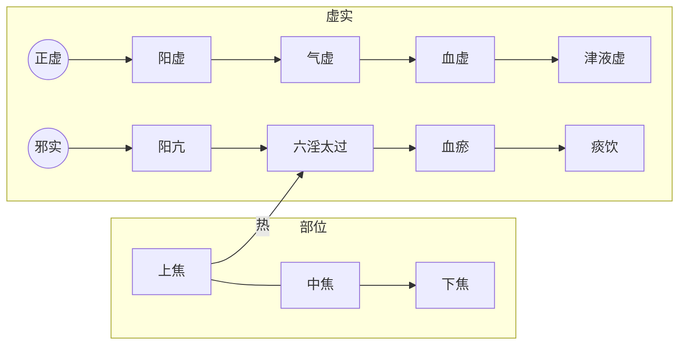

# 伤寒论太阳病

## 基本概念

### 受邪、发病、传经、自愈、坏病：

### 皮毛受邪

外感风寒之邪侵袭人体，首先在皮毛。受风邪，称为中风；受寒邪，称为伤寒。

其表现为“泝然起毫毛”，就是寒栗、毫毛竖起的样子。

皮毛受邪，有人正气强，可能自己排出邪气就好了。如果未能排出邪气，则邪气可能入侵经络而发病。

> 是故百病之始生也，必先于皮毛。邪中之，则腠理开，开则入客于络脉，留而不去，传入于经，留而不去，传入于腑，廪于肠胃。
>
> 邪之始入于皮也，**泝然起毫毛，开腠理**，其入于络也，则络脉盛色变；其入客于经也，则感虚，乃陷下，其留于筋骨之间。寒多则筋挛骨痛；热多则筋弛骨消，肉烁（月囷）破,毛直而败。
>
> 《素问-皮部》

> 伤寒则是皮毛受邪，营卫失和，其病从外而内。
>
> 《伤寒论讲解-384条》

### 发病

#### 时间

伤寒论认为皮毛受邪后，并非立刻进入经络，而是需要过一段时间才会侵入经络而发病。这个受邪时间与发病时间的间隔，三阴三阳六个区域各有不同，

太阳区域受邪，一两日发病。阳明区域受邪二三日发病，少阳、太阴、少阴、厥阴区域依次增加一日。

> 但从受邪至发病的时间六经各有不同，太阳为第一日，阳明为第二日，少阳为第三日，太阴为第四日，少阴为第五日，厥阴为第六日，**因此从受邪至病退，六经的日数则分别为七、八、九、十、十一、十二日**。本段亦出《素问热论》中。“大气皆去,病人精神爽慧”，指大邪已衰退，病人精神爽快，神志清晰。

**伤寒六七日**

不同区域发病的典型表现不一样：

太阳区域为头、项疼痛，腰脊僵硬；

阳明区域为身热、汗出、目疼、鼻干、不得卧；

少阳区域为胸胁痛、耳聋；

太阴区域为腹满、嗌干；

少阴区域为口燥舌干而渴;

厥阴区域为烦满而囊缩；

这些都是该区域经络受邪发病的典型现象，若邪气进入脏腑，则还有很多其他症状，在后面详述。

> 尺寸俱浮者，**太阳受病也，当一二日发**。以其脉上连风府，故头项痛，腰脊强。
>
> 尺寸俱长者，**阳明受病也，当二三日发**。以其脉侠鼻、络于目，故身热、汗出、目疼、鼻干、不得卧。
>
> 尺寸俱弦者，**少阳受病也，当三四日发**。以其脉循胁络于耳，故胸胁痛而耳聋。
>
> 此三经受病，未入于腑者，皆可汗而已。
>
> 尺寸俱沉濡者，**太阴受病也，当四五日发**。以其脉布胃中，络于嗌，故腹满而嗌干。
>
> 尺寸俱沉细者，**少阴受病也，当五六日发**。以其脉贯肾，络于肺，系舌本，故口燥舌干而渴。
>
> 尺寸俱弦微者，**厥阴受病也，当六七日发**。以其脉循阴器、络于肝，故烦满而囊缩。
>
> 此三经受病，己入于腑者，皆可下而已。
>
> 《伤寒论-伤寒例》

三阴三阳六个区域都可以发病，可以是一个区域受邪也可以是多个区域同时发病。

正常情况一般是三阳先发病，三阳之中一般以太阳先发病。

> 岐伯对曰：巨阳者，诸阳之属也。**其脉连于风府，故为诸阳主气**也。...
>
> 岐伯曰：伤寒一日，巨阳受之，故头项痛，腰脊强。
>
> 《素问-热论》

> 岐伯曰：**巨阳主气，故先受邪**，少阴与其为表里也，得热则上从之，从之则厥也。
>
> 《素问-评热病》

三阴内连五脏加心包，因五脏最重要，所受保护较多，所以三阴一般不直接发病。若身体虚弱或特殊情况则可有三阴直接受邪，称为“直中”。“直中”一般比较严重。

> 外邪不经过三阳，发病即见三阴证候，后人谓之“*直中*”，直中多因素体阳虚，致使邪气得以长驱直入，故病多沉重。

如果互为表里的两个区域同时发病，称为“两感”。表明三阴区域也被寒邪侵入，比较严重。

> **凡伤于寒则为病热，热虽甚不死。若两感于寒而病者。必死。**...
>
> 若相表里的阴阳两经，如太阳与少阴，阳明与太阴，少阳与厥阴，同时受邪发病，则称"两感于寒而病”。两感则多因素体阳虚，正气抗邪无力，致使邪气得以深入所致，故其预后每多不良。

> 若两感于寒者，一日太阳受之，即与少阴俱病，则头痛、口干、烦满而渴（1）；
>
> 二日阳明受之，即与太阴俱病，则腹满、身热、不欲食、讝语；
>
> 三日少阳受之，即与厥阴俱病，则耳聋、囊缩而厥，水浆不入，不知人者，六日死（2）。
>
> 若三阴三阳，五脏六腑皆受病，则荣卫不行，脏腑不通，则死矣。

#### 合病：

两个以上的区域同时受邪发病，称为合病。

> 两经以上同时发病谓之“合病”，本论明言合病者有太阳阳明合病，太阳少阳合病，少阳阳明合病，三阳合病四种...凡合病，多邪盛而病剧；凡并病，则邪气较轻而易治。至于三阴经病不见合病、并病之说，似有详于前而略于后之义。

### 传经

一个区域受邪发病后，可能传到其它区域，此为传经。每个区域可以和任意一个其它区域互传。比如由太阳区域传到阳明或少阳区域，甚至传到三阴区域，也可有其它区域传到太阳区域。

> 由于正气有强弱，邪气有盛衰，正邪相争，阴阳进退，就使六经病证经常处于一个不断变化的状态。所谓传变，则主要是对这一变化的描述，邪气由此经进入彼经，则谓之传。随着邪气的转移，临床证候也必然相应地发生变化,有传必有变，故称传变，也即传经。传与不传与邪气的盛衰，正气的强弱，治疗与护理之是否得当有关，尤以正气的抗邪能力大小为关键。若正气虚衰，邪气则可由表传里，由浅入深，使病证渐趋沉重；若正气恢复，抗邪有力,邪气又可由里达表，由阴出阳，使病向愈。辨传与不传，传至何经,当以脉证变与不变为据。预知传与不传，对掌握治疗与预防的主动权有非常积极的意义。

按照太阳、阳明、少阳、太阴、少阴、厥阴的顺序，前向后传为病邪深入，反之则为病邪浅出。

从时间角度看，传经有两个时间特点：

1、如果病邪较重，病邪可能一日一传。比如太阳区域受寒，一日后发太阳病，二日即转为阳明病，三日转为少阳病，甚则进一步转为太阴、少阴、厥阴病。

> 伤寒二三日，阳明少阳证不见者，为不传也。[5]

2、如果一个七日自愈周期内，没有自愈的话，则七日后容易发生传经。自愈的内容见下一节。

如何判断病邪要从一个区域传到另一个区域呢？以太阳区域受寒邪传经为例：

太阳伤寒第一日就有发热、无汗、恶寒等太阳伤寒症状，此时可通过其他症状，可判断是否传经。

如果脉象浮紧，符合太阳伤寒的脉象，则为不传。如果脉数急，急数为热，则有传到其它区域的征兆。

> **伤寒一日，太阳受之，脉若静者，为不传**；颇欲吐，若躁烦，**脉数急者，为传也**。[4]

因呕吐是少阳区域的主要症状，如果有要呕吐的感觉，则可能要传往少阳区域。

> “喜呕”则为少阳病主证之一。本论每以呕吐之有无来说明少阳病之有无。 如“呕而发热者，柴胡汤证具”、“本太阳病不解，转入少阳者……干呕不能食”等，是以呕吐标志少阳病已成

因内热是阳明区域的主要情况，内热会引起烦躁，如果有烦躁的感觉，则可能要传往阳明区域。

> “躁”是肢体躁扰不宁；“烦”是心中烦闷不舒。烦多因热扰心神而致，躁常因心烦而致，故常烦躁并称。“躁烦”，即或见烦躁，这是邪气入里化热，阳明有热的标志

这里举太阳病的例子，是表明传经的特点。传经的时候往往有个过渡过程，此时本区域和目标区域的一些症状往往同时出现。其它区域的传经应也有类似现象。

#### 并病：

在传变过程中，在还未完成全部传变的时候，两个区域的病症同时都有，此时为并病。

> 一经证候未罢，又出现了另一经的证候，传而未尽者，谓之“并病”，本论明言并病者有太阳阳明并病，太阳少阳并病两种。

### 自愈：

伤寒论认为，外感病正邪僵持，从发病时算起，六、七日之内可能会自愈。其原理应为气血七日一个波动周期，七日之内会有气血峰值出现，此时正气的力量会胜过邪气，能够驱邪外出，实现自愈。

> 病有发热恶寒者，发于阳也；无热恶寒者，发于阴也(1)。**发于阳，七日愈；发于阴，六日愈，以阳数七阴数六故也(2)**。[7]

> 《易经》有七日来复的论点，外感病的发展变化也具有这种七日来复的节律，一般来讲**六经病的或愈或传亦多在六七日或七八日之间**，因此每经病从发病到病退也多在七日之间。

> **太阳病，头痛至七日以上自愈者，以行其经尽故也**（1），...
>
> 故人体的生理活动和病理变化也有七日节律。太阳病七日以上，正是本经阳气来复的时候，故是正胜邪却而病自愈的良好时机。因此，七日亦可看作太阳病的自然病程，仲景则称“行其经尽”。

> 凡**得时气病**，至五六日，而渴欲饮水，饮不能多...**至七八日**大渴欲饮水者，犹当依证而与之，与之常令不足，勿极意也（2）。言能饮一斗，与五升。... 忽然大汗出，是为**自愈也**（4）。

七日自愈是从发病开始算起，如果从受邪开始算的话，则要加上受邪到发病的日期。比如阳明区域，阳明受寒邪后，应在二、三日后发病，加上六、七日自愈周期，所以应在八、九日后痊愈。其它区域类似。

> 《易经》有七日来复的论点，外感病的发展变化也具有这种七日来复的节律，一般来讲六经病的或愈或传亦多在六七日或七八日之间，因此每经病从发病到病退也多在七日之间。但从受邪至发病的时间六经各有不同，太阳为第一日，阳明为第二日，少阳为第三日，太阴为第四日，少阴为第五日，厥阴为第六日，因此从受邪至病退，六经的日数则分别为七、八、九、十、十一、十二日。

> **七日太阳病衰....八日阳明病衰，身热少歇也。**

如果过期不愈，说明病人自身气血波动到峰值依然无法超过邪气的力量，代表邪气力量过大，正气力量过小，很危险。

> **若过十三日以上不间，寸尺陷者，大危（5）。若更感异气变为他病者，当依后坏病证而治之（6）**...
>
> 过十三日以上不间，……大危：...”若过十三日以上病仍不愈，为邪气盛而不衰。“尺寸陷”指寸关尺三部脉沉伏不出，为正气大衰。邪盛而正衰，故主大危。此举厥阴病过期不愈之危证，说明六经为病，凡过期不愈者，皆主病势沉重。

这种自愈规律要求满足三个条件：

1、非表里两经同时受邪

2、没有发生传经情况

3、期间没有重复感受其它邪气。

> **其不两感于寒，更不传经，不加异气（3）者，至七日太阳病衰，头痛少愈也。**
>
> 。。。
>
> 本段论述不是两感，又未传经，也没有另外感受他种病邪，而是单纯经脉受邪的自然病程及邪气衰退时的临床现象。《易经》有七日来复的论点，外感病的发展变化也具有这种七日来复的节律，一般来讲**六经病的或愈或传亦多在六七日或七八日之间**，因此每经病从发病到病退也多在七日之间。但从受邪至发病的时间六经各有不同，太阳为第一日，阳明为第二日，少阳为第三日，太阴为第四日，少阴为第五日，厥阴为第六日，**因此从受邪至病退，六经的日数则分别为七、八、九、十、十一、十二日**。本段亦出《素问热论》中。“大气皆去,病人精神爽慧”，指大邪已衰退，病人精神爽快，神志清晰。

如果七日不自愈，则又可能传到其它更深的区域。此时如能补充正气，可阻止其传经。

> **太阳病，头痛至七日以上自愈者，以行其经尽故也（1），若欲作再经(2)者，针足阳明，使经不传则愈(3)。[8]**...
>
> 太阳病七日如不愈，则反映邪气较盛，虽有阳气来复，但不足以祛邪外解，就有内传他经的可能。...
>
> 针刺足阳明的穴位。注家有人主张刺足三里穴，有人主张刺趺阳脉穴，但总以足阳明经脉上的穴位为是。阳明为水谷之海，三阳之屏障，通过针刺，使其经气流通，抗邪之力增强，故有预防传变的作用。

身体虚弱之人，感受外邪生病，在邪气排出、外感症状消失后，依然身体不适，这是正气还没有恢复，期待下一个周期正气充足后可以好转。

> **风家，表解而不了了者，十二日愈。[10]**...
>
> 风家，泛指易患太阳表病之人。这类人大多素体较弱，故与一般太阳病患者不同，而称为“风家”。“不了了”即精神和身体还不爽快，这是大邪已去，正气未复的表现，所以说“表解而不了了”。这就需要调养一段时间，预测至十二日正气恢复，病即可痊愈。此言“十二日”是约略之辞，不必拘泥。

若自愈期过后还不愈，说明人体的正气不足，难以排出邪气，比较严重，应认真治疗。

> **若过十三日以上不间，寸尺陷者，大危（5）**...
>
> 若过十三日以上病仍不愈，为邪气盛而不衰。“尺寸陷”指寸关尺三部脉沉伏不出，为正气大衰。邪盛而正衰，故主大危。此举厥阴病过期不愈之危证，说明六经为病，凡过期不愈者，皆主病势沉重

#### 关于欲解时

伤寒论中六经各有欲解时，一般把这个欲解时理解为一日之内的不同时辰（此处还有待考证）。

自愈的本质是正邪相争，正气胜出。又因为人体正气随时间波动，所以在正气强的时间，则自愈的可能性大。前面说的是人体正气的七日波动周期产生的自愈规律。但是在一日之内，不同的区域的正气强大时间不同，所以欲解时不同。

不同区域伤寒病的欲解时如下：

太阳病，从巳至未，9点到15点

阳明病，从申至戌，15点到21点

少阳病，从寅至辰，3点到9点

太阴病，从亥至丑，21点到3点

少阴病，从子至寅，23点到5点

厥阴病，从丑至卯，1点到7点

## 1、原则：

### 1、脏腑不虚原则

概念入门中，在病证轻重传变章节，谈到中医治病的核心原则就是：对五脏疾病存在严重正虚邪实的情况，以扶正祛邪的方法，恢复正气，减少邪气，使其向腑病转化，由吐或下的方式排出；或由里病向表病转化，以汗的形式排出。部位由里到外，程度由重向轻，即是常说的“阴证转阳证”，直至治愈。

这个原则的意思是五脏对人体最重要，当对外感病进行治疗的时候，要注意五脏病和肌表病的关系，时刻保证五脏不虚为原则。

这个原则在伤寒论中主要指两个方面：

一是五脏无病之人，其治法应遵循规矩，不要因为治法的错误伤了五脏。

二是脏腑有病之人得了外感病。如果脏腑之病为五脏正虚证，应优先治疗。如果五脏不虚，有脏腑邪实证和表证，则哪里紧急治哪里，但通常先解表后泄下。这是因为祛邪会伤正，如果里实不急的话，先祛里邪容易伤里部正气，导致表部邪气传入里部，产生更严重的变证。

> 伤寒，医下之，续得下利，**清谷不止**，身疼痛者，急当救里，后身疼痛，清便自调者，急当救表。救里宜四逆汤，救表宜桂枝汤。[91]

> **本发汗，而复下之，此为逆也。若先发汗，治不为逆⑴。本先下之，而反汗之，为逆。若先下之，治不为逆⑵。[90]**
>
> 表证兼里实，当先表后里，先汗后下，这是一般原则。后人归纳这一原则为“实人伤寒发其汗”。
>
> 但在表证轻而里实证重且急的特殊情况下，则当急者先治，先里后表，先下后汗。治法适宜，汗下有序，则邪去病愈；先后误施，汗下失序，则会导致变证丛生。
>
> 后世逐渐发展起来的一些解表攻里，表里双解的方法，在一定程度上对《伤寒论》有关这方面的治则作了补充，临证亦可酌情施用。
>
> 《伤寒论讲解-90条》

### 2、气血均衡原则

人体气血流转全身，均衡全身在资源。因脉是气血的表现，所以通过脉可以了解气血状态。

全身气血充足且通畅，在脉象表现为寸关尺三部波动均匀、柔和、有力，不快不慢，不大不小，不滑不涩，不弦不动。

> 问曰：脉病欲知愈未愈者，何以别之？答曰：**寸口、关上、尺中三处、大小、浮沉，迟数同等，虽有寒热不解者，此脉阴阳为和平**，虽剧当愈。

> 九候之相应也，**上下若一，不得相失**。一候后则病，二候后则病甚，三候后则病危。所谓后者，应不俱也。
>
> 《素问-三部九候论》

全身气血的分布总体上可分为内外和上下。气血的内外分布通过脉的沉浮来辨别。上下分布通过寸脉和尺脉来辨别。寸脉代表上焦的心肺，在伤寒中称为阳脉；尺脉代表下焦的肾，为阴脉。

寸口脉代表肺气，因百脉朝会于肺，所以可以诊全身气血。因先后天之本脾肾非常重要，所以在伤寒论中，还要用趺阳脉诊脾胃，少阴脉诊肾气。

#### 人体上下部气血的差异

入门中讲了人体各个部位的划分，以及每个部位都可以有虚实病证。

这里以三阴三阳划分的太阳部位发病为例，谈谈辩证及治疗的方法。主要依据《伤寒论》的太阳三篇。

《伤寒论》的太阳篇，共178条，接近总数的一半。如果能读懂太阳篇，基本上就读懂了伤寒论的主要内容。

太阳篇以常人风寒外感侵袭肌表，为起始。到内伤五脏，以心阴、心阳俱伤为结束。论述了一段典型的疾病由外传内，由轻转重的变化过程。

治法方面：以桂枝汤治疗常人肌表受邪为开始，以炙甘草汤治疗心之阴阳两虚为结束。此过程中，随着病位深浅、病性虚实、程度轻重的变化，其表现各异，治法亦随之而变。

入太阳区域，脉浮缓、头项僵硬疼痛、恶寒、恶风、发热、有汗，桂枝汤治疗。

> 太阳病三篇，以风寒外袭太阳起病，到少阴心阴阳两虚之证收尾，也揭示了外感病由表及里，由阳入阴的发展趋势，从而提示了早期治疗的重要性。
>
> 《伤寒论讲解-177条》

正常人感受正常的风寒之邪，出现正常的表现，采用正常的治法，并进行正常的护理。

#### 1、脉的平衡

脉是人体的平衡，人体上下内外的气血应该以均衡为主。类似我们现在所说的气压或者水压。当各处的气血相对均衡的时候，各处的脉象是比较一致的。这叫阴阳和平之脉。

> 问曰：脉病欲知愈未愈者，何以别之？答曰：**寸口、关上、尺中三处、大小、浮沉，迟数同等，虽有寒热不解者，此脉阴阳为和平**，虽剧当愈。

此时即便有偏大，偏小，偏数等等，也是整体有偏，而非某处偏大，某处偏小。整体一致说明气血的流转没有阻碍，还算是一个好事。伤寒中，如果未谈某处的脉像，一般是指脉的整体。

> 寸口脉浮大，而医反下之，此为大逆(1)。浮则无血，大则为寒，寒气相搏，则为肠鸣。医乃不知而反饮冷水，令汗大出，水得寒气，冷必相搏，其人则䭇(2)。

> 问曰：脉有三部，阴阳相乘，荣卫血气，在人体躬，呼吸出入，上下于中，因息遊布(1)，津液流通。随时动作，效象形容(2)，春弦秋浮，冬沉夏洪，察色观脉，大小不同，一时之间，变无经常，尺寸参差(3)，或短或长，上下乖错，或存或亡，病辄改易，进昂退低(4)，心迷意惑，动失纪纲，(5)愿为具陈，令得分明。师曰：子之所问，道之根源，脉有三部，尺寸及关，荣卫流行，不失衡铨(6)，肾沉心洪，肺浮肝弦，此自经常，不失铢分，出入升降，漏刻(7)周旋，水下百刻，一周循环，当复寸口，虚实见焉。变化相乘，阴阳相干，风则浮虚，寒则牢坚，沉潜水滀，支饮急弦，动则为痛，数则热烦，设有不应，知变所缘，三部不同，病各异端，大过可怪，不及亦然，邪不空见，终必有奸，审察表里，三焦别焉，知其所舍，消息诊看，料度腑脏，独见若神，为子条记，传与贤人。

> 寸口诸微亡阳，诸濡亡血，诸弱发热，诸紧为寒。诸乘寒者，则为厥，郁冒不仁(1)，以胃无谷气，脾涩不通，口急不能言，战而慄也。

#### 关格脉是不均衡的一种

> **寸口脉浮而大，浮为虚，大为实，在尺为关，在寸为格，关则不得小便，格则吐逆。**

> **趺阳脉伏而涩，伏则吐逆，水谷不化，涩则食不得入，名曰关格。**

#### 极度不均衡

> 师曰：寸脉下不至关，为阳绝(1)，尺脉上不至关，为阴绝，此皆不治，决(2)死也。若计其余命生死之期，期以月节克之(3)也。

#### 上下气血

##### 阴脉阳脉不均衡

当上下部压力不平衡的时候，上部压力小，则下部气上冲。

> 问曰：病有洒淅恶寒，而复发热者何？答曰：阴脉不足，阳往从之，阳脉不足，阴往乘之。
>
> 曰：何谓阳不足？答曰：假令寸口脉微，名曰阳不足，阴气上入阳中，则洒淅恶寒也。
>
> 曰：何谓阴不足？答曰：尺脉弱，名曰阴不足，阳气下陷入阴中，则发热也。

这里的阴脉指的是中下部的肝肾，阳脉指的是上部的心肺。

上部的阳气不足，则人有心悸，胸部喜按的症状。用桂枝甘草汤。由此可知桂枝补上部之阳气。

> **发汗过多，其人叉手自冒心，心下悸，欲得按⑴者，桂枝甘草汤⑵主之。[64]**

上部阳气不足，则下部阴气上冲，或者欲上冲。以桂枝甘草汤为基础加减。

> 发汗后，其人**脐下悸者，欲作奔豚**⑴，茯苓桂枝甘草大枣汤⑵主之。[65]

> 伤寒，若吐若下后，心下逆满，**气上冲胸**，起则头眩，脉沉紧⑴，发汗则动经，身为振振摇⑵者，茯苓桂枝白术甘草汤⑶主之。[67]

内外压力不平衡的时候，内部压力小，则外部气血内陷。如果外部有邪气，则随气血内如。肌表正邪相争发热的时候，如果用下法，使内部的正气减弱，则邪热随气血内陷。可

> 若不宜下而便攻之，**内虚热入**，协热遂利，烦躁诸变，不可胜数，轻者困笃，重者必死矣⑸。

##### 阴脉弱代表血虚

中下部的肝肾不足，则代表的血虚，进而造成抽筋的外部表现。

> 阳脉浮，一作微。**阴脉弱者，则血虚，血虚则筋急也。**其**脉沉者，荣气(1)微**也；其脉浮，而汗出如流珠者，卫气(2)衰也。荣气微者，加烧针(3)则血留不行，更发热而躁烦也。

> 脉浮数者，法当汗出而愈⑴。若下之、身重、心悸者，不可发汗，当自汗出乃解⑵。所以然者，**尺中脉微，此里虚。**须表里实，津液自和，便自汗出愈⑶。[49]

> **阴脉迟涩，故知亡血也。**

> 脉浮紧者，法当身疼痛，宜以汗解之。假令**尺中迟者，不可发汗**。何以知然？以**荣气不足，血少故**也。[50]...

此时，可用甘草芍药汤治疗，可见甘草芍药汤是补中下部的阴气。

> 伤寒，脉浮，自汗出，小便数，心烦，微恶寒，**脚挛急**，反与桂枝欲攻其表，此误也⑴。得之便厥，咽中干，烦躁、吐逆者，作甘草干姜汤与之，以复其阳⑵。若厥愈足温者，更作**芍药甘草汤与之，其脚即伸**⑶。若胃气不和，谵语者，少与调胃承气汤⑷。若重发汗，复加烧针者，四逆汤主之⑸。[29]

> 少阴脉不至，**肾气微，少精血**，奔气促迫，上入胸膈，宗气反聚，血结心下，**阳气退下，热归阴股**，与阴相动，令身不仁，此为尸厥(1)，当刺期门(2)巨阙(3)

###### 下焦阳虚、虚

> **太阳病，发汗，汗出不解，其人仍发热，心下悸，头眩，身𥆧动，振振欲擗**一作僻**地⑴者，真武汤⑵主之。[82]**

#### 里外气血

> 师曰：呼吸者，脉之头也。初持脉，来⑴疾去(2)迟，此出疾入迟，名曰内虚外实也。初持脉，来迟去疾，此出(3)迟入(4)疾，名曰内实外虚也。

##### 外邪内陷

脉浮紧是表有寒，只谈脉紧，说明寒已入里。入里又分上下

上焦偏气态，所以为清邪。下焦偏液态，所以为浊邪。

上焦中清邪，表现为发热头痛，项强颈挛，腰痛胫酸。

下焦中浊邪，表现为足膝逆冷，便溺妄出

> 寸口脉阴阳俱紧者，法当清邪(1)中于上焦，浊邪(2)中于下焦。清邪中上，名曰洁也；浊邪中下，名曰浑也。
>
> 阴中于邪，必内慄(3)也。表气微虚，里气不守，故使邪中于阴也。
>
> 阳中于邪，必发热头痛，项强颈挛，腰痛胫酸，所为阳中雾露之气。
>
> 故曰清邪中上，浊邪中下。
>
> 阴气为慄，足膝逆冷，便溺妄出。
>
> 表气微虚，里气微急，三焦相溷(4)，内外不通。
>
> 上焦怫音佛，下同郁，脏气相熏，口烂食龂(5)也。
>
> 中焦不治，胃气上冲，脾气不转，胃中为浊，荣卫不通，血凝不流。若胃气前通者，小便赤黄，与热相搏，因热作使，游于经络，出入脏府，热气所过，则为痈脓。若阴气前通者，阳气厥微，阴无所使，客气内入，嚏而出之，声嗢(6)乙骨切咽塞。寒厥相追，为热所拥，血凝自下，状如豚肝。阴阳俱厥，脾气孤弱，五液注下。
>
> 下焦不盍，清便下重(7)，令便数难，齐筑湫痛(8)，命将难全。

> 脉阴阳俱紧者，口中气出，唇干口燥，踡卧(1)足冷，鼻中涕出，舌上胎滑(2)，勿妄治也。
>
> 到七日以来，其人微发热，手足温者，此为欲解；
>
> 或到八日以上，反大发热者，此为难治。
>
> 设使恶寒者，必欲呕也；腹内痛者，必欲利也。

> 脉阴阳俱紧，至于吐利，其脉独不解；紧去入安，此为欲解。
>
> 若脉迟至六七日不欲食，此为晚发(1)，水故也，为未解；食自可者为欲解。
>
> 病六七日，手足三部脉(2)皆至，大烦而口噤(3)不能言，其人躁扰者，必欲解也。
>
> 若脉和，其人大烦，目重(4)，脸内际黄者，此欲解也(5)。

> **问曰：病有结胸，有脏结，其状何如？答曰：按之痛，寸脉浮。关脉沉，名曰结胸也。[128]**

前有有热恶寒，发于阳。无热恶寒，发于阴。

> 病发于阳，而反下之，热入因作结胸⑴，
>
> **病发于阴，而反下之。**因作痞也⑵。**
>
> **所以成结胸者，以下之太早故也⑶。结胸者，项亦强，如柔痓状⑷，下之则和，宜大陷胸丸⑸。[131]**

##### 三焦之虚

> **寸口脉微涩，微者卫气不行，涩者荣气不逮(1)，荣卫不能相将(2)，三焦无所仰(3)，身体痹不仁(4)。荣气不足，则烦疼口难言；卫气虚者，则恶寒数欠。**
>
> **三焦不归其部，上焦不归者，噫而酢吞(5)；中焦不归者，不能消谷引食；下焦不归者，则遗溲。**

## 2. 标准人、标准病、标准治法

### 正常病因

### 1.1 正常表现

太阳病：脉浮、头项强痛、恶寒

> **太阳之为病，脉浮，头项强痛而恶寒。[1]**

此时只说是太阳经表部位有问题，未说是何种问题。其共性表现为脉浮、头项僵硬疼痛、怕冷。

### 1.2 病因风

#### 风邪问题

> **太阳病，发热，汗出，恶风，脉缓者，名为中风。[2]**

> **脉浮而数，浮为风，数为虚，风为热，虚为寒，风虚相搏，则洒淅恶寒也。**

### 治法原理

驱动气血走肌表。

### 1.3 正常方药

太阳病风寒，无论中风还是伤寒，有汗出，用桂枝汤

> 太阳病，头痛，发热，汗出，恶风，桂枝汤主之。[13]

> **太阳中风，阳浮而阴弱，阳浮者，热自发；阴弱者，汗自出⑴，啬啬恶寒，淅淅恶风，翕翕发热⑵，鼻鸣干呕⑶者，桂枝汤主之⑷。[12]**

> **太阳病，外证未解，脉浮弱者，当以汗解，宜桂枝汤。[42]**

> 太阳病，外证未解；不可下也，下之为逆。欲解外者，宜桂枝汤。[44]

> 太阳病，先发汗不解，而复下之，脉浮者不愈。浮为在外，而反下之，故令不愈。今脉浮，故在外，当须解外则愈，宜桂枝汤。[45]
>

药解：

大枣补气、补津液、助十二经。

桂枝补心阳，芍药补肝阴。

生姜补阳气，走全身。

### 1.5 正常用法：

桂枝汤本为解肌，解肌即为将气血送至肌的层面，想要到表需要配热粥、温覆，方可出汗。

发汗以全身微汗为度，保持状态2小时左右。微汗是身体薄薄一层汗，如果过汗，汗像水流一样，属于过量。过汗伤阳，也伤阴，病可能也不会好。

> 服已须臾，歠热稀粥一升余，以助药力⑹。温覆令一时许，遍身絷絷微似有汗者益佳，不可令如水流离，病必不除⑺。若一服汗出病差，停后服，不必尽剂⑻；若不汗，更服依前法；又不汗，后服小促其间⑼，半日许令三服尽；若病重者，一日一夜服，周时⑽观之，服一剂尽，病证犹在者，更作服；若不汗出，乃服至二、三剂。禁生冷、粘滑、肉面、五辛、酒酪、臭恶等物⑾。

喝一碗能出汗，就不用再喝了。不出汗则再喝。虽然说一天喝三次，如果病情严重，半天喝完三碗也是可以的。

出汗后，如果病好了，就不必再喝。

如果当时好了，过了半天又犯。检查脉还是浮，这是没好撤店，可以再发一次汗。

> **伤寒发汗已解，半日许复烦，脉浮数者，可更发汗，宜桂枝汤。[57]**

吃完一剂药不出汗，则再来一剂，甚至三剂。如果确定是正常人外感风邪的话，三剂药应该会出汗。不出汗，一定是有其它原因，一直出不了汗，则为死病。

> 凡发汗，温暖汤药，其方虽言日三服，若病剧不解，当促其间，可半日中尽三服。若与病相阻，即便有所觉，病重者，一日一夜当晬时⑴观之。如服一剂，病证犹在，故当复作本汤服之。至有不肯汗出，服三剂乃解。若汗不出者，死病也⑵。...
>
> 若连用三剂发汗药而汗不出者，或是真阴涸竭，无液作汗；或是元阳衰微，不能蒸化；或是正气大衰，不能运药；或是邪气太甚，药不胜病，皆为预后不良的表现，所以说“死病也”。

### 正常结果

好转

### 总结

开始肌表受到风寒，此时里部未伤。正常发汗都是可以治好的。

> 凡伤寒之病，多从风寒得之，始表中风寒，入里则不消⑴矣。未有温复而当不消散者。
>
> 不在证治⑵，拟欲攻之，犹当先解表，乃可下之。若表已解而内不消，非大满，犹生寒热，则病不除⑶。若表已解而内不消，大满大实，坚有燥屎，自可除下之⑷，虽四五日，不能为祸也。
>
> 若不宜下而便攻之，内虚热入，协热遂利，烦躁诸变，不可胜数，轻者困笃，重者必死矣⑸。

### 注意事项：

#### 饮水

饮水与胃的热量相关。胃的热量不足，不能消化过多水，则不能过多饮水。

有大夫建议感冒病人多喝水，若是胃热不足之人，饮水过多未能消化吸收，会留于脾胃成为痰饮。

病人快好的时候，会想喝水，而不是多喝水病人就会好。这两者的因果关系要搞清楚。此时如果病人自己说能喝10份水，只给他5份。因病人身体刚好，胃的热量没有恢复，多喝水就可能出问题。

伤寒论说病人有点小小的渴，就要求其多喝水，造成更严重问题的情况非常多。

> 凡得时气病，至五六日，而渴欲饮水，饮不能多，不当与也。何者？以腹中热尚少，不能消之，便更与人作病也⑴。至七八日大渴欲饮水者，犹当依证而与之，与之常令不足，勿极意也⑵。言能饮一斗，与五升。若饮而腹满，小便不利，若喘、若哕，不可与之也⑶。忽然大汗出，是为自愈也⑷。

> **凡得病，反能饮水，此为欲愈之病。其不晓病者，但闻病饮水自愈，小渴者乃强与饮之，因成其祸，不可复数也。**

#### 身痒

伤寒中的身痒一般是该出汗而未能出。处于半出不出的状态。

> 脉浮而迟，面热赤而战惕(1)者，六七日当汗出而解，反发热者差迟(2)。**迟为无阳，不能作汗，其身必痒也**。

#### 战汗：

> **问曰：病有战而汗出，因得解者，何也？答曰：脉浮而紧，按之反芤，此为本虚，故当战而汗出也。其人本虚，是以发战，以脉浮，故当汗出而解也。若脉浮而数，按之不芤，此人本不虚，若欲自解，但汗出耳，不发战也。**
>
> 〔**讲解**〕本条论述战汗作解的脉法。自此以下数条，皆论病解之脉法，当注意鉴别比较。
>
> “此为本虚”，为自注句，指出芤脉主正气本虚。
>
> 脉浮而紧，乃是伤寒表实之脉，如果按之中空而芤，则主邪实而本虚。然其人脉浮，反映邪有外出之机，经过扶正驱邪等合理治疗，或由于时日推移，而使邪衰正复，则可突然出现“战汗”作解的情况。如果脉浮而数，按之不芤的，则为正气不虚，虽然也是汗出而解，但不会出现战慄耸动之象。

> **太阳病未解，脉阴阳俱停，**一作微。**必先振慄汗出而解⑴。但阳脉微者，先汗出而解，但阴脉微**一作尺脉实。**者，下之而解。若欲下之，宜调胃承气汤⑵。**一云用大柴胡汤。**[94]**...
>
> 在正气未胜邪气时，则必先战慄不止，一旦正胜邪却，正气得伸，则见发热，随之汗出而解。这种经过战慄、发热、汗出三个阶段而使邪气作解则叫“战汗作解”。因此，“脉阴阳俱停”，应是战汗发生前的一时性反映，也可以说是战汗的前兆，见此脉证，则可知战汗将要发生，战汗之后，脉即复常。

#### 鼻衄

> **太阳病，脉浮紧，无汗，发热，身疼痛，八九日不解，表证仍在，此当发其汗。服药已微除，其人发烦目瞑，剧者必衄，衄乃解。所以然者，阳气重故也。麻黄汤主之。[46]**
>
> 凡药后出现鼻衄，且衄血畅快者，大多很快即热退身凉，脉静而病愈。这叫“以衄代汗”之法。但若衄血不止，而身热不退，甚至出现舌绛苔燥，脉数等证，则多属表寒化热，内入营血之变证，治当另作别论，不可待其自愈，以免延误病情，更不可再投辛温之药。
>
> 《伤寒论讲解-46条》

### 结果不正常

### 1、发汗后，身痛，脉沉迟。

> **发汗后，身疼痛，脉沉迟⑴者，桂枝加芍药生姜各一两人参三两新加汤⑵主之。[62]**

## 未治

### 七日自愈

太阳病不治，若人身体素质较好，则八、九日之内可能自愈。不呕，非少阳；大便正常，非阳明。

> **太阳病，得之八九日，如疟状，发热，恶寒，热多寒少。其人不呕，清便欲自可，一日二三度发⑴。脉微缓者，为欲愈也⑵。**

若人身体素质差，内部虚，可能转入少阴。则不能在用汗、吐、下的方法，因这些方法会伤正。

> **脉微而恶寒者，此阴阳俱虚，不可更发汗、更下、更吐也⑶。**

发热，面色潮红，身痒，这是未能出汗，邪气欲出未出，用麻黄桂枝各半汤。

> **面色反有热色者，未欲解也，以其不能得小汗出，身必痒⑷。宜桂枝麻黄各半汤⑸。[23]**

### 转阳明

> **太阳与阳明合病，喘而胸满者，不可下，宜麻黄汤。[36]**

### 转少阳

> **本太阳病不解，转入少阳者，胁下鞕满，干呕不能食，往来寒热，尚未吐下，脉沉紧者，与小柴胡汤。[266]**

> **太阳病，十日已去，脉浮细而嗜卧者，外已解也⑴。**
>
> **设胸满胁痛者，与小柴胡汤⑵。**
>
> **脉但浮者，与麻黄汤⑶。[37]**

到5、6日

> **伤寒五六日中风，往来寒热，胸胁苦满，嘿嘿不欲饮食，心烦喜呕⑴。或胸中烦而不呕，或渴，或腹中痛，或胁下痞鞕，或心下悸、小便不利，或不渴、身有微热，或欬⑵者，小柴胡汤⑶主之。[96]**

太阳少阳并病

> **太阳与少阳并病，头项强痛，或眩冒，时如结胸，心下痞鞕⑴者，当刺大椎第一间、肺俞、肝俞，慎不可发汗⑵。发汗则讝语，脉弦，五日谵语不止，当刺期门⑶。[142]**

### 入膀胱腑血热互结

> **太阳病不解，热结膀胱，其人如狂，血自下，下者愈⑴。其外不解者，尚未可攻，当先解其外；外解已，但少腹急结者，乃可攻之⑵，宜桃核承气汤⑶。后云，解外宜桂枝汤。[106]**

> **太阳病，六七日表证仍在，脉微而沉，反不结胸，其人发狂者，以热在下焦，少腹当鞕满，小便自利者，下血乃愈。所以然者，以太阳随经，瘀热在里故也⑴，抵当汤主之⑵。[124]**

> **太阳病，身黄、脉沉结、少腹鞕⑴、小便不利者，为无血也；小便自利，其人如狂者，血证谛也⑵，抵当汤主之。[125]**

## 偏离标准

### 常人常病误治

里有热，表未解。常规应该先解表再下。

> **太阳病，下之微喘者，表未解故也⑴，桂枝加厚朴杏子汤主之⑵。[43]**

> **太阳病，外证未解；不可下也，下之为逆。欲解外者，宜桂枝汤。[44]**

#### 本该汗而用下：

> **太阳病，外证未解；不可下也，下之为逆。欲解外者，宜桂枝汤。[44]**

不应下而下，则造成内虚，肌表之热会随之入里，而造成各种变化。

> 凡伤寒之病，多从风寒得之，始表中风寒，入里则不消⑴矣。未有温复而当不消散者。不在证治⑵，拟欲攻之，犹当先解表，乃可下之。若表已解而内不消，非大满，犹生寒热，则病不除⑶。若表已解而内不消，大满大实，坚有燥屎，自可除下之⑷，虽四五日，不能为祸也。**若不宜下而便攻之，内虚热入，协热遂利，烦躁诸变，不可胜数，轻者困笃，重者必死矣⑸。

##### 协热利

> **太阳病，桂枝证，医反下之，利遂不止。脉促者，表未解也，喘而汗出者⑴，葛根黄芩黄连汤主之⑵。**促，一作纵。**[34]**

##### 轻症

> 太阳病，**下之**微喘者，表未解故也⑴，桂枝加厚朴杏子汤主之⑵。[43]

> **太阳病，下之后，其气上冲者，可与桂枝汤，方用前法。若不上冲者，不得与之。[15]**

> **太阳病，下之后，脉促、胸满⑴者，桂枝去芍药汤主之⑵。促，一作纵。[21]** 。**若微寒⑴者，桂枝去芍药加附子汤主之⑵。[22]**

##### 伤胃气

> 寸口脉浮大，而医反下之，此为大逆(1)。浮则无血，大则为寒，寒气相搏，则为肠鸣。医乃不知而反饮冷水，令汗大出，水得寒气，冷必相搏，其人则䭇(2)。

可导致胃虚而不能敷布水津，水饮结于中焦，浊气不降，因而作哕。

> **趺阳脉浮，浮则为虚，浮虚相搏，故令气䭇，言胃气虚竭也。脉滑则为哕(1)，此为医咎，责虚取实(2)，守空迫血(3)。脉浮鼻中燥者，必衄也。**

里有热，表未解。常规应该先解表再下。

##### 邪热入上焦

> 发汗后，水药不得入口为逆。**若更发汗，必吐下不止⑴。发汗吐下后**，虚烦不得眠，若剧者，必反复颠倒。心中懊憹，栀子豉汤主之⑵。若少气者，栀子甘草豉汤主之⑶。若呕者，栀子生姜豉汤主之⑷。[76]

> 发汗，若下之，而烦热胸中窒者，栀子豉汤主之。[77]

> 伤寒五、六日，大下之后，身热不去，心中结痛者，未欲解也，栀子豉汤主之。[78]

> 伤寒，下后，心烦，腹满，卧起不安⑴者，栀子厚朴汤⑵主之。[79]。

> **伤寒，**医以丸药**⑴大下之，身热不去，微烦者，栀子干姜汤主之⑵。[80]**

> 凡无形之邪热蕴郁心胸，热扰心神而见虚烦不得眠，反复颠倒，心中懊憹，或兼见胸中窒，心中结痛者，皆用栀子豉汤清热泄烦。兼少气者，用栀子甘草豉汤；兼呕者，用栀子生姜豉汤；兼腹满者，用栀子厚朴汤；兼下利者，用栀子干姜汤。然栀子汤类，毕竟是寒凉之剂，凡脾肾虚寒者，皆当禁用。

##### 结胸、脏结

> **病发于阳，而反下之，热入因作结胸⑴，病发于阴，而反下之，**一作汗出。**因作痞也⑵。所以成结胸者，以下之太早故也⑶。结胸者，项亦强，如柔痓状⑷，下之则和，宜大陷胸丸⑸。[131]**

#### 大汗违反微汗原则

> **服桂枝汤，大汗出，脉洪大者，与桂枝汤如前法⑴。**
>
> **若形似疟，一日再发者，汗出必解，宜桂枝二麻黄一汤⑵。[25]**

> **服桂枝汤，大汗出后，大烦渴不解，脉洪大者，白虎加人参汤主之。[26]**

大汗重伤卫阳

> **太阳病，发汗，遂漏不止⑴，其人恶风，小便难，四肢微急，难以屈伸⑵者，桂枝加附子汤主之⑶。[20]**

大汗伤里阳

> **太阳病，发汗后，大汗出，胃中干，烦躁不得眠，欲得饮水者，少少与饮之，令胃气和则愈⑴；若脉浮，小便不利，微热，消渴⑵者，五苓散⑶主之。[71]**

#### 汗出不彻底

治后，因汗出不彻底而发展到阳明病

> 二阳并病，太阳初得病时，发其汗，汗先出不彻，因转属阳明，续自微汗出，不恶寒⑴。若太阳病证不罢者，不可下，下之为逆，如此可小发汗，设面色缘缘正赤者，阳气怫郁在表，当解之熏之⑵。若发汗不彻，不足言，阳气怫郁不得越，当汗不汗，其人躁烦，不知痛处，乍在腹中，乍在四肢，按之不可得，其人短气，但坐以汗出不彻故也，更发汗则愈。何以知汗出不彻？以脉涩故知也⑶。[48]

#### 用热法逼迫出汗

110到119条，皆为用热法逼迫汗出，有各种变证。

> **太阳病，二日反躁，凡熨其背而大汗出，大热入胃，一作二日内烧瓦熨背大汗出，火气入胃。胃中水竭，躁烦必发讝语⑴。十余日振慄自下利者，此为欲解也⑵。故其汗从腰以下不得汗，欲小便不得，反呕，欲失溲，足下恶风，大便鞕，小便当数，而反不数及不多。大便已头卓然而痛，其人足心必热，谷气下流故也⑶。[110]**

> **太阳病，中风，以火劫发汗⑴。邪风被火热，血气流溢。失其常度⑵。两阳相熏灼，其身发黄。阳盛则欲衄，阴虚小便难，阴阳俱虚竭，身体则枯燥，但头汗出，剂颈而还。腹满，微喘，口干，咽烂，或不大便，久则讝语，甚者至哕，手足躁扰，捻衣摸床⑶。小便利者，其人可治(4)。[111]**

> **伤寒脉浮，医以火迫劫之，亡阳，必惊狂，卧起不安⑴者，桂枝去芍药加蜀漆牡蛎龙骨救逆汤主之⑵。[112]**

#### 本该汗而用吐法

伤寒120-123条。

> **太阳病，当恶寒、发热，今自汗出，反不恶寒、发热，关上脉细数者，以医吐之过也⑴。一二日吐之者，腹中饥，口不能食⑵；三四日吐之者，不喜糜粥，欲食冷食，朝食暮吐⑶，以医吐之所致也，此为小逆⑷。[120]**

### 常人非常病

#### 寒邪问题

> **太阳病，或已发热，或未发热，必恶寒，体痛，呕逆，脉阴阳俱紧者，名为伤寒。[3]**

伤寒如果有汗而不愈，依然是桂枝汤。

无汗麻黄汤

> **太阳病，头痛、发热、身疼、腰痛、骨节疼痛、恶风，无汗而喘⑴者，麻黄汤主之⑵。[35]**

> 伤寒，脉浮紧，不发汗，因致衄者，麻黄汤主之。[55]

> 太阳病，脉浮紧，无汗，发热，身疼痛，八九日不解，表证仍在，此当发其汗。服药已微除，其人发烦目瞑，剧者必衄，衄乃解。所以然者，阳气重故也。麻黄汤主之。[46]

无汗能够流鼻血，或者用刺血疗法，也可以起到去除寒邪的作用。

> **太阳病，脉浮紧，发热，身无汗，自衄者愈。[47]**

#### 湿气

> **问曰：风湿相搏，一身尽疼，病法当汗出而解⑴。值天阴雨不止，医云此可发汗，汗之病不愈者，何也？答曰：发其汗，汗大出者，但风气去，湿气在，是故不愈也⑵。若治风湿者，发其汗，但微微似欲出汗者，风湿俱去也⑶。**

### 非常人

#### 表气郁

> **太阳病，发热恶寒，热多寒少。脉微弱者，此无阳也，不可发汗⑴。宜桂枝二越婢一汤⑵。[27]**

#### 误用桂枝法

这里的非常人，指的是人本身原来就有失衡情况，此时要视失衡情况决定是否使用标准治法。

首先，里虚之人不可用桂枝法。伤寒论第29条谈到人有小便频数、心烦、小腿肌肉痉挛

> **伤寒，脉浮，自汗出，小便数，心烦，微恶寒，脚挛急，反与桂枝欲攻其表，此误也⑴。得之便厥，咽中干，烦躁、吐逆者，作甘草干姜汤与之，以复其阳⑵。若厥愈足温者，更作芍药甘草汤与之，其脚即伸⑶。若胃气不和，谵语者，少与调胃承气汤⑷。若重发汗，复加烧针者，四逆汤主之⑸。[29]**

### 

素有喘证

> **喘家⑴，作桂枝汤，加厚朴、杏子佳⑵。[18]**

#### 里有实：

内有热毒

> **凡服桂枝汤吐者，其后必吐脓血也。[19]**

内有湿热

> **若酒客病，不可与桂枝汤⑴，得之则呕，以酒客不喜甘故也⑵。[17]**

内有热

> **伤寒脉浮缓，身不疼但重，乍有轻时，无少阴证者，大青龙汤发之。[39]**

素有水饮之邪在于心下

> **伤寒表不解，心下有水气，干呕，发热而欬⑴。 或渴，或利，或噎，或小便不利、少腹满，或喘者⑵，小青龙汤主之⑶。[40]**

#### 里有虚

##### 肾虚

尺脉迟，肾失衡。五脏失衡，则气血不足。

脉浮紧，麻黄汤。**这里暗含着其它部位脉象无问题**，也就是常人，正常人，只有肌表有寒邪，只有脉浮与紧两个异常，其它没有异常。此时才能用麻黄汤。因为麻黄汤类的发汗药，就会调动里部气血走表。如果里部有虚的失衡，无论血虚、阳虚、阴虚、气虚等等，皆不可调动气血走表，否则就会造成里部虚上加虚，犯虚虚之戒。

伤寒论50条说，假设尺脉迟，不可发汗。这只是一个假设，并非只有尺脉迟不不可发汗。其它虚的失衡也不可发汗。比如49条，说尺脉微弱，也是不可发汗。尺为肾脉，肾的功能虚弱，无论气虚还是阳虚，都是不可用汗法的。脉迟为寒，为什么说血少呢？这是因为五脏产生气血，其功能衰弱，产生气血就会不足。不是指肾的血不足。

许叔微是真懂伤寒！许叔微说如果不懂表里关系，虚人发汗，可能也能治好病，但是使五脏亏损，导致寿命减少，有什么可夸耀的呢？

> 脉浮数者，法当汗出而愈⑴。若下之、身重、心悸者，不可发汗，当自汗出乃解⑵。所以然者，**尺中脉微，此里虚。**须表里实，津液自和，便自汗出愈⑶。[49]

> 脉浮紧者，法当身疼痛，宜以汗解之。假令**尺中迟者，不可发汗**。何以知然？以**荣气不足，血少故**也。[50]...
>
> 许叔微《普济本事方》载一医案：“昔有乡人丘生者病伤寒，予为诊视，发热，头疼，烦渴，脉虽浮数而无力，尺以下迟弱。予曰，虽属麻黄证，而尺迟弱，仲景云，尺中迟者，营气不足，血气微少，未可发汗。予与建中汤加当归、黄芪令饮。翌日脉尚尔，其家煎迫，日夜督发汗药，言几不逊矣。予忍之，但只用建中调营而已。至五日，尺部方应，遂投麻黄汤，啜第二服，发狂，须臾稍定，略睡，已得汗矣。信知此事是难是难。仲景虽云不避晨夜，即宜便治，医者亦须顾其表里虚实，待其时日。**若不循次第，暂时得安，亏损五脏，以促寿限，何足贵也**！”

##### 脾虚有水：

**服桂枝汤，或下之，仍头项强痛，翕翕发热，无汗，心下满微痛，小便不利者⑴，桂枝去桂加茯苓白术汤主之⑵。[28]**

##### 胃虚

> **伤寒二三日，心中悸而烦⑴者，小建中汤主之⑵。[102]**

> 趺阳脉浮，浮则为虚，浮虚相搏，故令气䭇，言胃气虚竭也。脉滑则为哕(1)，此为医咎，责虚取实(2)，守空迫血(3)。脉浮鼻中燥者，必衄也。...
>
> “责虚取实”之误；又不晓浮是中空无血之理而认为表有邪反汗之，汗为血之液，发汗使营血枯竭，这实属“守空迫血”。

### 