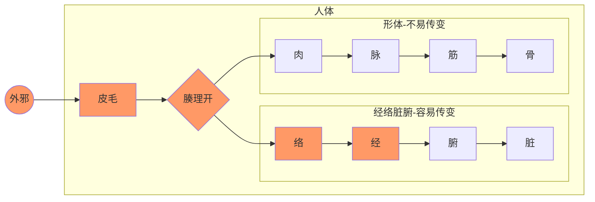
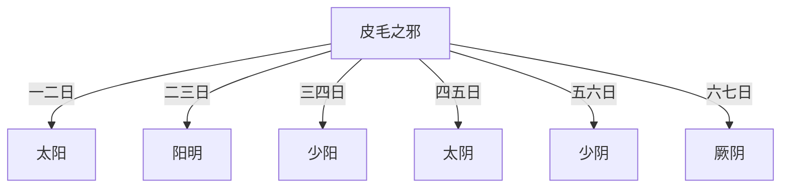
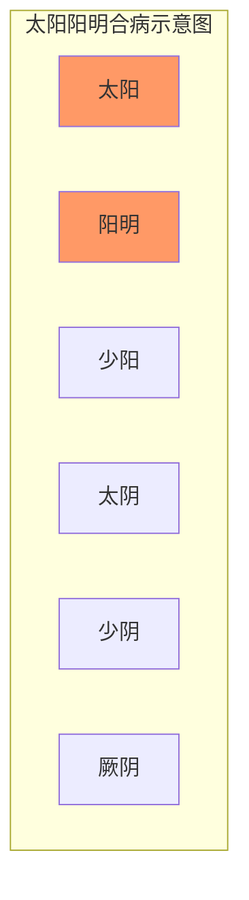
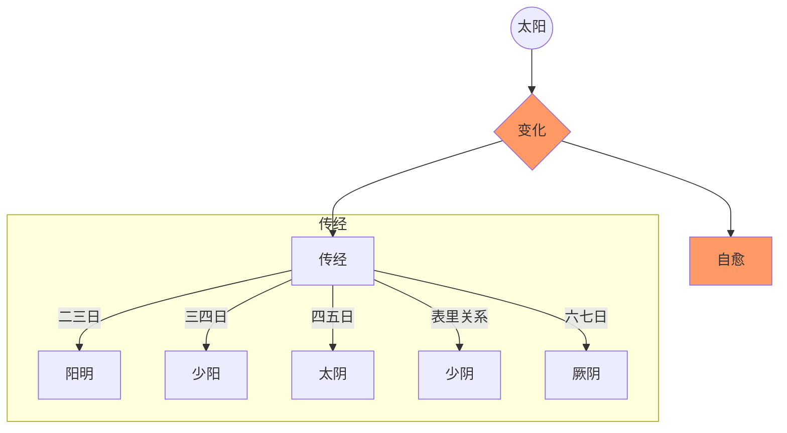
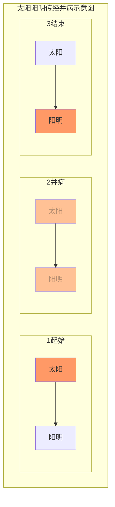
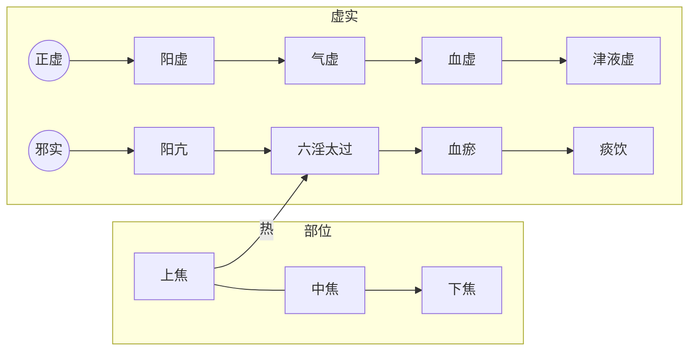

# 伤寒论基础概念

## 传入过程

《入门》中谈到了外邪侵入体内的部位划分方法，如下图。

风、热、暑、湿、燥、寒六气正常不为邪气，若过度则侵入身体发病，即外感六淫。伤寒论主要谈的六气中的风、寒二气。

### 皮毛受邪

外感风寒之邪侵袭人体，首先在皮毛。受风邪，称为中风；受寒邪，称为伤寒。皮毛感受风寒的表现为“泝然起毫毛”，就是寒栗、毫毛竖起的样子。

皮毛受邪，有人正气足，可自己排出邪气而自愈，无需治疗。如果正气不足，未能排出邪气，则邪气可能入侵经络而发病。

> 是故百病之始生也，必先于皮毛。邪中之，则腠理开，开则入客于络脉，留而不去，传入于经，留而不去，传入于腑，廪于肠胃。
>
> 邪之始入于皮也，**泝然起毫毛，开腠理**，其入于络也，则络脉盛色变；其入客于经也，则感虚，乃陷下，其留于筋骨之间。寒多则筋挛骨痛；热多则筋弛骨消，肉烁（月囷）破,毛直而败。
>
> 《素问-皮部》

> 伤寒则是皮毛受邪，营卫失和，其病从外而内。
>
> 《伤寒论讲解-384条》

### 皮毛之邪入经

#### 入一经

皮毛受邪后，邪气并非立刻进入经络，而是需要过一段时间才会侵入经络而发病。皮毛受邪时间与邪气侵入经络时间的间隔，三阴三阳六个区域各有不同。侵入太阳区域，需一两日。侵入阳明区域，需二三日。少阳、太阴、少阴、厥阴区域依次增加一日。

> 尺寸俱浮者，**太阳受病也，当一二日发**。...尺寸俱长者，**阳明受病也，当二三日发**。...尺寸俱弦者，**少阳受病也，当三四日发**。...尺寸俱沉濡者，**太阴受病也，当四五日发**。...尺寸俱沉细者，**少阴受病也，当五六日发**。...尺寸俱弦微者，**厥阴受病也，当六七日发**。
>
> 《伤寒论-伤寒例》

> 岐伯曰：伤寒一日，巨阳受之...二日阳明受之...三日少阳受之...四日太阴受之...五日少阴受之...六日厥阴受之。
>
> 《素问-热论》

> **伤寒三日，三阳为尽，三阴当受邪⑴。其人反能食而不呕，此为三阴不受邪也⑵。[270]**
>
> **伤寒三日，少阳脉小者，欲已也。[271]**
>
> 《伤寒论-270、271条》

《入门》中提到了皮毛外感邪气通常入三阳经，且以足太阳经为最易入侵，一般不直接入三阴经。除非五脏衰弱，阴经气不足，才有可能直入三阴，此时称为“直中”。阴经一般不受邪，但一旦受邪，就比较严重。

> 外邪不经过三阳，发病即见三阴证候，后人谓之“*直中*”，直中多因素体阳虚，致使邪气得以长驱直入，故病多沉重。
>
> 《伤寒论讲解-绪论》

> **厥阴病的成因**，有邪气传经而来者，如三阳病失治或误治，或太阴、少阴病不愈，均有可能传至厥阴；**也有外邪直中，而使本经自病者**。根据临床观察，前一种情况似为多见。
>
> 《伤寒论讲解-辨厥阴病脉证并治-概说》

皮毛受风邪，传入各经，称为某经中风。受寒邪，传入各经，称为某经伤寒。比如有太阳中风、太阳伤寒，阳明中风、阳明伤寒等等。

> 阳明病来路有二，一为他经之邪传来，一为本经直接受邪。传经之邪一般多从阳化热，**直接受邪则有中风、中寒之不同。今以能食与否来辨中风、中寒，从中可以会到辨证方法**。
>
> 《伤寒论讲解-190条》

#### 入多经

两个以上的区域同时发病，称为合病。比如皮毛受邪后，第一日，太阳发病，第二日，阳明发病，此时即为太阳阳明合病。如果第三日，少阳也发病，则为三阳合病。也可以第一日太阳不发病，二日阳明、三日少阳发病，为少阳阳明合病。

理论上讲，六个区域都可以同时发病。但在伤寒论中，明确提出的合病都在三个阳经，阴经没提合病。教材认为是详于前而略于后。

> 两经以上同时发病谓之“合病”，本论明言合病者有太阳阳明合病，太阳少阳合病，少阳阳明合病，三阳合病四种...凡合病，多邪盛而病剧；凡并病，则邪气较轻而易治。至于三阴经病不见合病、并病之说，**似有详于前而略于后之义**。

> **太阳与阳明合病**者，必自下利，葛根汤主之⑴。[32]
>
> **太阳与阳明合病**，不下利但呕者，葛根加半夏汤主之⑵。[33]
>
> **三阳合病⑴，脉浮大，上关上⑵，但欲眠睡，目合则汗⑶。[268]**

如果互为表里的两个区域同时发病，称为“两感”。表明三阴区域也被寒邪侵入，比较严重。

> **凡伤于寒则为病热，热虽甚不死。若两感于寒而病者。必死。**...
>
> 若相表里的阴阳两经，如太阳与少阴，阳明与太阴，少阳与厥阴，同时受邪发病，则称"两感于寒而病”。两感则多因素体阳虚，正气抗邪无力，致使邪气得以深入所致，故其预后每多不良。

> 若两感于寒者，一日太阳受之，即与少阴俱病，则头痛、口干、烦满而渴（1）；
>
> 二日阳明受之，即与太阴俱病，则腹满、身热、不欲食、讝语；
>
> 三日少阳受之，即与厥阴俱病，则耳聋、囊缩而厥，水浆不入，不知人者，六日死（2）。
>
> 若三阴三阳，五脏六腑皆受病，则荣卫不行，脏腑不通，则死矣。

那么如何判断各经是否发病呢？自然是根据各经发病的独特表现，见下面。

### 风寒入经的后继发展

三阴三阳划分人体六个区域。每个区域都是以经络为中心，外连肌表，内联脏腑。因此，每个区域都可以经表，经，脏腑三个部分。经络连接肌表的部分病证称为经表证，经本身为经证，经所连之脏腑为脏腑证。

> 热证、实证、里证是阳明病的主要内容，但阳明也有表证，如第〔234〕条之用桂枝汤，第〔235〕条之用麻黄汤即是：阳明也有里虚寒证，如本条之用吴茱萸汤即是。由此看来，**六经病证中，每经病皆有表里、寒热、虚实、阴阳之分证**，可见六经辨证实以六经为纲，以八纲为用的综合性辨证方法。
>
> 《伤寒论讲解-234条》

邪气入某经后，其后继发展遵循正邪关系。如果本经正气足，则可自愈。如果它经正气虚，则可以传变。如果脏腑正气虚，则可以入脏腑。

#### 自愈：

邪气入某经而发病，正邪对峙。从发病时算起，六、七日之内可能会自愈。其原理应为气血七日一个波动周期，此周期内会有气血峰值出现，

此时正气的力量会胜过邪气，能够驱邪外出，实现自愈。

> 病有发热恶寒者，发于阳也；无热恶寒者，发于阴也(1)。**发于阳，七日愈；发于阴，六日愈，以阳数七阴数六故也(2)**。[7]

> 《易经》有七日来复的论点，外感病的发展变化也具有这种七日来复的节律，一般来讲**六经病的或愈或传亦多在六七日或七八日之间**，因此每经病从发病到病退也多在七日之间。

> **太阳病，头痛至七日以上自愈者，以行其经尽故也**（1），...
>
> 故人体的生理活动和病理变化也有七日节律。太阳病七日以上，正是本经阳气来复的时候，故是正胜邪却而病自愈的良好时机。因此，七日亦可看作太阳病的自然病程，仲景则称“行其经尽”。

> 凡**得时气病**，至五六日，而渴欲饮水，饮不能多...**至七八日**大渴欲饮水者，犹当依证而与之，与之常令不足，勿极意也（2）。言能饮一斗，与五升。... 忽然大汗出，是为**自愈也**（4）。

七日自愈是从经络发病开始算起，如果从皮毛受邪开始算的话，则要加上皮毛受邪到发病的日期。比如阳明区域，皮毛受邪到阳明发病，应有二、三日，加上六、七日自愈周期，所以应在八、九日后痊愈。其它区域类似。

> 至七日太阳病衰，头痛少愈也；八日阳明病衰，身热少歇也；九日少阳病衰，耳聋微闻也；十日太阴病衰，腹减如故，则思饮食；十一日少阴病衰，渴止舌干，已而嚏；十二日厥阴病衰，囊纵，少腹微下，大气皆去，病人精神爽慧也。...
>
> 《易经》有七日来复的论点，外感病的发展变化也具有这种七日来复的节律，一般来讲六经病的或愈或传亦多在六七日或七八日之间，因此每经病从发病到病退也多在七日之间。但从受邪至发病的时间六经各有不同，太阳为第一日，阳明为第二日，少阳为第三日，太阴为第四日，少阴为第五日，厥阴为第六日，**因此从受邪至病退，六经的日数则分别为七、八、九、十、十一、十二日**。本段亦出《素问热论》中。“大气皆去,病人精神爽慧”，指大邪已衰退，病人精神爽快，神志清晰。
>
> 《伤寒论讲解-伤寒例》

如果自愈周期过后还不愈，说明病人自身正气波动到峰值依然无法超过邪气的力量，代表邪气力量过大，正气力量过小，比较严重，应认真治疗。

> **若过十三日以上不间，寸尺陷者，大危（5）。若更感异气变为他病者，当依后坏病证而治之（6）**...
>
> 过十三日以上不间，……大危：...”若过十三日以上病仍不愈，为邪气盛而不衰。“尺寸陷”指寸关尺三部脉沉伏不出，为正气大衰。邪盛而正衰，故主大危。此举厥阴病过期不愈之危证，说明六经为病，凡过期不愈者，皆主病势沉重。
>
> 《伤寒论讲解-伤寒例》

这种自愈规律指的是正常情况，要求满足三个条件：

1、非表里两经同时受邪，即两感

2、没有发生传经情况

3、期间没有重复感受其它邪气。

> **其不两感于寒，更不传经，不加异气（3）者，至七日太阳病衰，头痛少愈也。**
>
> 。。。
>
> 本段论述不是两感，又未传经，也没有另外感受他种病邪，而是单纯经脉受邪的自然病程及邪气衰退时的临床现象。《易经》有七日来复的论点，外感病的发展变化也具有这种七日来复的节律，一般来讲**六经病的或愈或传亦多在六七日或七八日之间**，因此每经病从发病到病退也多在七日之间。但从受邪至发病的时间六经各有不同，太阳为第一日，阳明为第二日，少阳为第三日，太阴为第四日，少阴为第五日，厥阴为第六日，**因此从受邪至病退，六经的日数则分别为七、八、九、十、十一、十二日**。本段亦出《素问热论》中。“大气皆去,病人精神爽慧”，指大邪已衰退，病人精神爽快，神志清晰。

身体虚弱之人，感受外邪生病，在邪气排出、外感症状消失后，依然身体不适，这是正气还没有恢复，期待下一个周期正气充足后可以好转。

> **风家，表解而不了了者，十二日愈。[10]**...
>
> 风家，泛指易患太阳表病之人。这类人大多素体较弱，故与一般太阳病患者不同，而称为“风家”。“不了了”即精神和身体还不爽快，这是大邪已去，正气未复的表现，所以说“表解而不了了”。这就需要调养一段时间，预测至十二日正气恢复，病即可痊愈。此言“十二日”是约略之辞，不必拘泥。

> 

##### 欲解时

伤寒论中六经各有欲解时，一般把这个欲解时理解为一日之内的不同时辰（此处还有待考证）。

自愈的本质是正邪相争，正气胜出。又因为人体正气随时间波动，所以在正气强的时间，则自愈的可能性大。前面说的是人体正气的七日波动周期产生的自愈规律。但是在一日之内，不同的区域的正气强大时间不同，所以欲解时不同。

不同区域伤寒病的欲解时如下：

太阳病，从巳至未，9点到15点

阳明病，从申至戌，15点到21点

少阳病，从寅至辰，3点到9点

太阴病，从亥至丑，21点到3点

少阴病，从子至寅，23点到5点

厥阴病，从丑至卯，1点到7点

#### 传经

一个区域受邪发病后，可能传到其它区域，此为传经。每个区域可以和任意一个其它区域互传。比如由太阳区域传到阳明或少阳区域，甚至传到三阴区域，也可有其它区域传到太阳区域。

> 由于正气有强弱，邪气有盛衰，正邪相争，阴阳进退，就使六经病证经常处于一个不断变化的状态。所谓传变，则主要是对这一变化的描述，邪气由此经进入彼经，则谓之传。随着邪气的转移，临床证候也必然相应地发生变化,有传必有变，故称传变，也即传经。传与不传与邪气的盛衰，正气的强弱，治疗与护理之是否得当有关，尤以正气的抗邪能力大小为关键。若正气虚衰，邪气则可由表传里，由浅入深，使病证渐趋沉重；若正气恢复，抗邪有力,邪气又可由里达表，由阴出阳，使病向愈。辨传与不传，传至何经,当以脉证变与不变为据。预知传与不传，对掌握治疗与预防的主动权有非常积极的意义。

按照太阳、阳明、少阳、太阴、少阴、厥阴的顺序，前向后传为病邪深入，反之则为病邪浅出。

从时间角度看，传经有两个时间特点：

1、如果病邪较重，病邪可能一日一传。比如太阳区域受寒，一日后发太阳病，二日即转为阳明病，三日转为少阳病，甚则进一步转为太阴、少阴、厥阴病。

> 伤寒二三日，阳明少阳证不见者，为不传也。[5]

2、如果一个七日自愈周期内，没有自愈的话，则七日后容易发生传经。自愈的内容见下一节。

如何判断病邪要从一个区域传到另一个区域呢？以太阳区域受寒邪传经为例：

太阳伤寒第一日就有发热、无汗、恶寒等太阳伤寒症状，此时可通过其他症状，可判断是否传经。

如果脉象浮紧，符合太阳伤寒的脉象，则为不传。如果脉数急，急数为热，则有传到其它区域的征兆。

> **伤寒一日，太阳受之，脉若静者，为不传**；颇欲吐，若躁烦，**脉数急者，为传也**。[4]

因呕吐是少阳区域的主要症状，如果有要呕吐的感觉，则可能要传往少阳区域。

> “喜呕”则为少阳病主证之一。本论每以呕吐之有无来说明少阳病之有无。 如“呕而发热者，柴胡汤证具”、“本太阳病不解，转入少阳者……干呕不能食”等，是以呕吐标志少阳病已成

因内热是阳明区域的主要情况，内热会引起烦躁，如果有烦躁的感觉，则可能要传往阳明区域。

> “躁”是肢体躁扰不宁；“烦”是心中烦闷不舒。烦多因热扰心神而致，躁常因心烦而致，故常烦躁并称。“躁烦”，即或见烦躁，这是邪气入里化热，阳明有热的标志

这里举太阳病的例子，是表明传经的特点。传经的时候往往有个过渡过程，此时本区域和目标区域的一些症状往往同时出现。其它区域的传经应也有类似现象。

如果七日不自愈，则又可能传到其它更深的区域。此时如能补充正气，可阻止其传经。

> **太阳病，头痛至七日以上自愈者，以行其经尽故也（1），若欲作再经(2)者，针足阳明，使经不传则愈(3)。[8]**...
>
> 太阳病七日如不愈，则反映邪气较盛，虽有阳气来复，但不足以祛邪外解，就有内传他经的可能。...
>
> 针刺足阳明的穴位。注家有人主张刺足三里穴，有人主张刺趺阳脉穴，但总以足阳明经脉上的穴位为是。阳明为水谷之海，三阳之屏障，通过针刺，使其经气流通，抗邪之力增强，故有预防传变的作用。

##### 并病：

在传变过程中，在还未完成全部传变的时候，两个区域的病症同时都有，此时为并病。

> 一经证候未罢，又出现了另一经的证候，传而未尽者，谓之“并病”，本论明言并病者有太阳阳明并病，太阳少阳并病两种。

> 两经以上同时发病谓之“合病”，本论明言合病者有太阳阳明合病，太阳少阳合病，少阳阳明合病，三阳合病四种。一经证候未罢，又出现了另一经的证候，传而未尽者，谓之“并病”，本论明言并病者有太阳阳明并病，太阳少阳并病两种。凡合病，多邪盛而病剧；凡并病，则邪气较轻而易治。
>
> 至于三阴经病不见合病、并病之说，似有详于前而略于后之义。
>
> 表里两经同时发病谓之“两感”。两感语出《素问·热论》，本论《伤寒例》、《太阳病篇》、《少阴病篇》皆有论及。
>
> 外邪不经过三阳，发病即见三阴证候，后人谓之“直中”，直中多因素体阳虚，致使邪气得以长驱直入，故病多沉重。
>
> 《伤寒论讲解-绪论》

#### 入脏腑

## 各经受邪的表现

各经受邪后的表现很多，这里初步谈一些主要症状，具体需要研读条文，全面掌握。

首先各经经络通道附近的异常都可以该经之病。

### 六经经症

伤寒论在伤寒例中还提到了各经通道经过之处的病症。因这些病症在伤寒例中提到了，所以在正文中略掉，并非不需要掌握。比如少阳的胸胁痛、耳聋症状，在少阳主症中并未提及，但是在96条、264条等处都有提及。

> 这里提出六经为病的证候与《素问•热论》相同，一可看出《伤寒论》对《内经》的继承性；二可**补本论六经辨证中所涉及的经络病证之所略**。

太阳区域为头、项疼痛，腰脊僵硬；

阳明区域为身热、汗出、目疼、鼻干、不得卧；

少阳区域为胸胁痛、耳聋；

太阴区域为腹满、嗌干；

少阴区域为口燥舌干而渴;

厥阴区域为烦满而囊缩；

> 尺寸俱浮者，太阳受病也，当一二日发。以其脉上连风府，故头项痛，腰脊强。
>
> 尺寸俱长者，阳明受病也，当二三日发。以其脉侠鼻、络于目，故身热、汗出、目疼、鼻干、不得卧。
>
> 尺寸俱弦者，少阳受病也，当三四日发。以其脉循胁络于耳，故胸胁痛而耳聋。
>
> 此三经受病，未入于腑者，皆可汗而已。
>
> 尺寸俱沉濡者，太阴受病也，当四五日发。以其脉布胃中，络于嗌，故腹满而嗌干。
>
> 尺寸俱沉细者，少阴受病也，当五六日发。以其脉贯肾，络于肺，系舌本，故口燥舌干而渴。
>
> 尺寸俱弦微者，厥阴受病也，当六七日发。以其脉循阴器、络于肝，故烦满而囊缩。
>
> 此三经受病，己入于腑者，皆可下而已。
>
> 《伤寒论-伤寒例》

### 经证与脏腑证

因六经中的每一个经络都内联脏腑，外连肌表，所以每一个区域都分经证和腑（脏）证。

其中对于经证，有时还把经络接近肌表的部分称为经表证。

#### 太阳

##### 经证：

脉浮，头痛项强，恶寒发热

##### 腑证

太阳蓄水：小便不利与消渴

太阳蓄血：少腹急结或硬满，其人如狂或发狂

> 太阳病为阳证之轻浅者，病变主要在太阳膀胱经腑及其所主之肌表。若风寒之邪外袭，营卫失和，经气不利，阳气抗邪于表，证见脉浮，头痛项强，恶寒发热，则属太阳经表之证。若邪气循经入腑，或邪与水结，膀胱气化不利，证见小便不利与消渴，而为太阳蓄水；或邪与血结，血热瘀阻下焦，证见少腹急结或硬满，其人如狂或发狂，而为太阳蓄血，皆为太阳膀胱腑证。

#### 少阳

##### 经证

耳聋、目赤、胸中满而烦

##### 腑证

口苦、咽干、目眩

> 胆热、气郁之证。耳聋、目赤、胸中满而烦等，为少阳经气不利之证，可看作是少阳经证，口苦、咽干、目眩为少阳胆火上炎之证，可看作是少阳腑证
>
> 《伤寒论讲解-辨少阳病脉证并治第九-概说》

### 六经各有提纲症：

**太阳之为病，脉浮，头项强痛而恶寒**

**阳明之为病，胃家实是也**

**少阳之为病，口苦、咽干、目眩也。[263]**

**太阴之为病，腹满而吐，食不下，自利益甚，时腹自痛⑴。若下之，必胸下结鞕⑵。[273]**

**少阴之为病，脉微细⑴，但欲寐也⑵。[281]**

**厥阴之为病，消渴，气上撞心，心中疼热⑴，饥而不欲食，食则吐蚘，下之利不止⑵。[326]**

主症非常重要，但是过于简略，光靠主症是不够定位的。其它判断方法见下面。

> 

### 六经中风伤寒的区别

**太阳病，发热，汗出，恶风，脉缓者，名为中风。[2]**

**太阳病，或已发热，或未发热，必恶寒，体痛，呕逆，脉阴阳俱紧者，名为伤寒。[3]**

**阳明中风⑴，口苦，咽干，腹满微喘，发热恶寒，脉浮而紧⑵，若下之，则腹满，小便难也⑶。[189]**

**阳明中风，脉弦浮大⑴而短气，腹都满⑵，胁下及心痛，久按之气不通⑶，鼻干，不得汗⑷，嗜卧，一身及目悉黄，小便难⑸，有潮热，时时哕，耳前后肿⑹。刺之小差，外不解⑺，病过十日，脉续浮者。与小柴胡汤(8)。[231]**

**阳明病，若中寒者，不能食，小便不利，手足濈然汗出，此欲作固瘕，必大便初鞕后溏⑴；所以然者，以胃中冷，水谷不别故也⑵。[191]**

**阳明病，若能食名中风；不能食，名中寒。[190]**

**少阳中风，两耳无所闻，目赤，胸中满而烦⑴者，不可吐下，吐下则悸而惊⑵。[264]**

**伤寒，脉弦细，头痛，发热者，属少阳⑴。少阳不可发汗，发汗则谵语，此属胃，胃和则愈，胃不和，烦而悸⑵。**一云躁。**[265]**

**太阴中风，四肢烦疼，阳微阴涩而长者，为欲愈。[274]**

**少阴中风，脉阳微阴浮者，为欲愈。 [290]**

**厥阴中风，脉微浮，为欲愈；不浮，为未愈。[327]**

## 学习伤寒的几大疑问

### 为什么伤寒传足不传手？

伤寒论中提到的症状，大部分是与足经相关，与手经关系不大。比如太阳病的头项僵硬疼痛，这是足太阳经的路线。为什么不谈手太阳小肠经的部位？太阴病的腹痛是脾的问题，为什么不谈手太阴肺的问题？反倒是在太阳病中提到了喘，与肺有关，用药上也有大小青龙汤治疗肺部疾病。

这是因为人体的疾病的变化，经络相传只是其中之一。中医理论中，各个部位之间的关系有多种。外感病虽然以经络为线索，但是经常也涉及其它关系。像皮毛受邪，影响肺的功能，这是因为肺的宣发功能与皮毛相关。这个传递不是从经络传递的。

传足不传手，是因为手经经气旺盛，外感病很难从手经侵入。

### 脉浮、恶寒、发热是全身表现，为什么做为太阳经证？

首先怕冷恶寒不是太阳病的独特表现，阳明病初起就有恶寒，阴证也有恶寒。

说恶寒是太阳经的独特特征，是与下面几个表现结合而谈的。

1、恶寒与发热同时存在

2、恶寒与发热持续存在

> **问曰：病有得之一日，不发热而恶寒者，何也⑴？答曰：虽得之一日，恶寒将自罢，即自汗出而恶热也⑵。[183]**
>
> **问曰：恶寒何故自罢？答曰：阳明居中，主土也，万物所归，无所复传⑴，始虽恶寒，二日自止，此为阳明病也⑵。[184]**

## 诊治原则：

### 1、脏腑不虚原则

概念入门中，在病证轻重传变章节，谈到中医治病的核心原则就是：对五脏疾病存在严重正虚邪实的情况，以扶正祛邪的方法，恢复正气，减少邪气，使其向腑病转化，由吐或下的方式排出；或由里病向表病转化，以汗的形式排出。部位由里到外，程度由重向轻，即是常说的“阴证转阳证”，直至治愈。

这个原则的意思是五脏对人体最重要，当对外感病进行治疗的时候，要注意五脏病和肌表病的关系，时刻保证五脏不虚为原则。

这个原则在伤寒论中主要指两个方面：

一是五脏无病而有外感之人，其治法应遵循规矩，不要因为治法的错误伤了五脏。

二是脏腑有病之人得了外感病。如果脏腑之病为五脏正虚证，应优先治疗。如果五脏不虚，有脏腑邪实证和表证，则哪里紧急治哪里，但通常先解表后泄下。这是因为祛邪会伤正，如果里实不急的话，先祛里邪容易伤里部正气，导致表部邪气传入里部，产生更严重的变证。

> 伤寒，医下之，续得下利，**清谷不止**，身疼痛者，急当救里，后身疼痛，清便自调者，急当救表。救里宜四逆汤，救表宜桂枝汤。[91]

> **本发汗，而复下之，此为逆也。若先发汗，治不为逆⑴。本先下之，而反汗之，为逆。若先下之，治不为逆⑵。[90]**
>
> 表证兼里实，当先表后里，先汗后下，这是一般原则。后人归纳这一原则为“实人伤寒发其汗”。
>
> 但在表证轻而里实证重且急的特殊情况下，则当急者先治，先里后表，先下后汗。治法适宜，汗下有序，则邪去病愈；先后误施，汗下失序，则会导致变证丛生。
>
> 后世逐渐发展起来的一些解表攻里，表里双解的方法，在一定程度上对《伤寒论》有关这方面的治则作了补充，临证亦可酌情施用。
>
> 《伤寒论讲解-90条》

### 2、气血均衡原则

人体气血流转全身，均衡全身的资源。因脉是气血的表现，所以通过脉可以了解气血状态。

气血充足且流转通畅，则全身气血均衡，在脉象表现为寸关尺三部波动均匀、柔和、有力，不快不慢，不大不小，不滑不涩，不弦不动。

> 问曰：脉病欲知愈未愈者，何以别之？答曰：**寸口、关上、尺中三处、大小、浮沉，迟数同等，虽有寒热不解者，此脉阴阳为和平**，虽剧当愈。

> 九候之相应也，**上下若一，不得相失**。一候后则病，二候后则病甚，三候后则病危。所谓后者，应不俱也。
>
> 《素问-三部九候论》

全身气血的分布总体上可分为内外和上下。气血的内外分布通过脉的沉浮来辨别。上下分布通过寸脉和尺脉来辨别。寸脉代表上焦的心肺，在伤寒中称为阳脉；尺脉代表下焦的肾，为阴脉。

寸口脉代表肺气，因百脉朝会于肺，所以可以诊全身气血。因先后天之本脾肾非常重要，所以在伤寒论中，还要用趺阳脉诊脾胃，少阴脉诊肾气。

入门中讲了人体各个部位的划分，以及每个部位都可以有虚实病证。

这里以三阴三阳划分的太阳部位发病为例，谈谈辩证及治疗的方法。主要依据《伤寒论》的太阳三篇。

《伤寒论》的太阳篇，共178条，接近总数的一半。如果能读懂太阳篇，基本上就读懂了伤寒论的主要逻辑。

太阳篇以常人风寒外感侵袭肌表，为起始。到内伤五脏，以心阴、心阳俱伤为结束。论述了一段典型的疾病由外传内，由轻转重的变化过程。

治法方面：以桂枝汤治疗常人肌表受邪为开始，以炙甘草汤治疗心之阴阳两虚为结束。此过程中，随着病位深浅、病性虚实、程度轻重的变化，其表现各异，治法亦随之而变。

入太阳区域，脉浮缓、头项僵硬疼痛、恶寒、恶风、发热、有汗，桂枝汤治疗。

> 太阳病三篇，以风寒外袭太阳起病，到少阴心阴阳两虚之证收尾，也揭示了外感病由表及里，由阳入阴的发展趋势，从而提示了早期治疗的重要性。
>
> 《伤寒论讲解-177条》

正常人感受正常的风寒之邪，出现正常的表现，采用正常的治法，并进行正常的护理。

#### 1、脉的平衡

脉是人体的平衡，人体上下内外的气血应该以均衡为主。类似我们现在所说的气压或者水压。当各处的气血相对均衡的时候，各处的脉象是比较一致的。这叫阴阳和平之脉。

> 问曰：脉病欲知愈未愈者，何以别之？答曰：**寸口、关上、尺中三处、大小、浮沉，迟数同等，虽有寒热不解者，此脉阴阳为和平**，虽剧当愈。

此时即便有偏大，偏小，偏数等等，也是整体有偏，而非某处偏大，某处偏小。整体一致说明气血的流转没有阻碍，还算是一个好事。伤寒中，如果未谈某处的脉像，一般是指脉的整体。

> 寸口脉浮大，而医反下之，此为大逆(1)。浮则无血，大则为寒，寒气相搏，则为肠鸣。医乃不知而反饮冷水，令汗大出，水得寒气，冷必相搏，其人则䭇(2)。

> 问曰：脉有三部，阴阳相乘，荣卫血气，在人体躬，呼吸出入，上下于中，因息遊布(1)，津液流通。随时动作，效象形容(2)，春弦秋浮，冬沉夏洪，察色观脉，大小不同，一时之间，变无经常，尺寸参差(3)，或短或长，上下乖错，或存或亡，病辄改易，进昂退低(4)，心迷意惑，动失纪纲，(5)愿为具陈，令得分明。师曰：子之所问，道之根源，脉有三部，尺寸及关，荣卫流行，不失衡铨(6)，肾沉心洪，肺浮肝弦，此自经常，不失铢分，出入升降，漏刻(7)周旋，水下百刻，一周循环，当复寸口，虚实见焉。变化相乘，阴阳相干，风则浮虚，寒则牢坚，沉潜水滀，支饮急弦，动则为痛，数则热烦，设有不应，知变所缘，三部不同，病各异端，大过可怪，不及亦然，邪不空见，终必有奸，审察表里，三焦别焉，知其所舍，消息诊看，料度腑脏，独见若神，为子条记，传与贤人。

> 寸口诸微亡阳，诸濡亡血，诸弱发热，诸紧为寒。诸乘寒者，则为厥，郁冒不仁(1)，以胃无谷气，脾涩不通，口急不能言，战而慄也。

#### 关格脉是不均衡的一种

> **寸口脉浮而大，浮为虚，大为实，在尺为关，在寸为格，关则不得小便，格则吐逆。**

> **趺阳脉伏而涩，伏则吐逆，水谷不化，涩则食不得入，名曰关格。**

#### 极度不均衡

> 师曰：寸脉下不至关，为阳绝(1)，尺脉上不至关，为阴绝，此皆不治，决(2)死也。若计其余命生死之期，期以月节克之(3)也。

#### 上下气血

##### 阴脉阳脉不均衡

当上下部压力不平衡的时候，上部压力小，则下部气上冲。

> 问曰：病有洒淅恶寒，而复发热者何？答曰：阴脉不足，阳往从之，阳脉不足，阴往乘之。
>
> 曰：何谓阳不足？答曰：假令寸口脉微，名曰阳不足，阴气上入阳中，则洒淅恶寒也。
>
> 曰：何谓阴不足？答曰：尺脉弱，名曰阴不足，阳气下陷入阴中，则发热也。

这里的阴脉指的是中下部的肝肾，阳脉指的是上部的心肺。

上部的阳气不足，则人有心悸，胸部喜按的症状。用桂枝甘草汤。由此可知桂枝补上部之阳气。

> **发汗过多，其人叉手自冒心，心下悸，欲得按⑴者，桂枝甘草汤⑵主之。[64]**

上部阳气不足，则下部阴气上冲，或者欲上冲。以桂枝甘草汤为基础加减。

> 发汗后，其人**脐下悸者，欲作奔豚**⑴，茯苓桂枝甘草大枣汤⑵主之。[65]

> 伤寒，若吐若下后，心下逆满，**气上冲胸**，起则头眩，脉沉紧⑴，发汗则动经，身为振振摇⑵者，茯苓桂枝白术甘草汤⑶主之。[67]

内外压力不平衡的时候，内部压力小，则外部气血内陷。如果外部有邪气，则随气血内如。肌表正邪相争发热的时候，如果用下法，使内部的正气减弱，则邪热随气血内陷。可

> 若不宜下而便攻之，**内虚热入**，协热遂利，烦躁诸变，不可胜数，轻者困笃，重者必死矣⑸。

##### 阴脉弱代表血虚

中下部的肝肾不足，则代表的血虚，进而造成抽筋的外部表现。

> 阳脉浮，一作微。**阴脉弱者，则血虚，血虚则筋急也。**其**脉沉者，荣气(1)微**也；其脉浮，而汗出如流珠者，卫气(2)衰也。荣气微者，加烧针(3)则血留不行，更发热而躁烦也。

> 脉浮数者，法当汗出而愈⑴。若下之、身重、心悸者，不可发汗，当自汗出乃解⑵。所以然者，**尺中脉微，此里虚。**须表里实，津液自和，便自汗出愈⑶。[49]

> **阴脉迟涩，故知亡血也。**

> 脉浮紧者，法当身疼痛，宜以汗解之。假令**尺中迟者，不可发汗**。何以知然？以**荣气不足，血少故**也。[50]...

此时，可用甘草芍药汤治疗，可见甘草芍药汤是补中下部的阴气。

> 伤寒，脉浮，自汗出，小便数，心烦，微恶寒，**脚挛急**，反与桂枝欲攻其表，此误也⑴。得之便厥，咽中干，烦躁、吐逆者，作甘草干姜汤与之，以复其阳⑵。若厥愈足温者，更作**芍药甘草汤与之，其脚即伸**⑶。若胃气不和，谵语者，少与调胃承气汤⑷。若重发汗，复加烧针者，四逆汤主之⑸。[29]

> 少阴脉不至，**肾气微，少精血**，奔气促迫，上入胸膈，宗气反聚，血结心下，**阳气退下，热归阴股**，与阴相动，令身不仁，此为尸厥(1)，当刺期门(2)巨阙(3)

###### 下焦阳虚、虚

> **太阳病，发汗，汗出不解，其人仍发热，心下悸，头眩，身𥆧动，振振欲擗**一作僻**地⑴者，真武汤⑵主之。[82]**

#### 里外气血

> 师曰：呼吸者，脉之头也。初持脉，来⑴疾去(2)迟，此出疾入迟，名曰内虚外实也。初持脉，来迟去疾，此出(3)迟入(4)疾，名曰内实外虚也。

##### 外邪内陷

脉浮紧是表有寒，只谈脉紧，说明寒已入里。入里又分上下

上焦偏气态，所以为清邪。下焦偏液态，所以为浊邪。

上焦中清邪，表现为发热头痛，项强颈挛，腰痛胫酸。

下焦中浊邪，表现为足膝逆冷，便溺妄出

> 寸口脉阴阳俱紧者，法当清邪(1)中于上焦，浊邪(2)中于下焦。清邪中上，名曰洁也；浊邪中下，名曰浑也。
>
> 阴中于邪，必内慄(3)也。表气微虚，里气不守，故使邪中于阴也。
>
> 阳中于邪，必发热头痛，项强颈挛，腰痛胫酸，所为阳中雾露之气。
>
> 故曰清邪中上，浊邪中下。
>
> 阴气为慄，足膝逆冷，便溺妄出。
>
> 表气微虚，里气微急，三焦相溷(4)，内外不通。
>
> 上焦怫音佛，下同郁，脏气相熏，口烂食龂(5)也。
>
> 中焦不治，胃气上冲，脾气不转，胃中为浊，荣卫不通，血凝不流。若胃气前通者，小便赤黄，与热相搏，因热作使，游于经络，出入脏府，热气所过，则为痈脓。若阴气前通者，阳气厥微，阴无所使，客气内入，嚏而出之，声嗢(6)乙骨切咽塞。寒厥相追，为热所拥，血凝自下，状如豚肝。阴阳俱厥，脾气孤弱，五液注下。
>
> 下焦不盍，清便下重(7)，令便数难，齐筑湫痛(8)，命将难全。

> 脉阴阳俱紧者，口中气出，唇干口燥，踡卧(1)足冷，鼻中涕出，舌上胎滑(2)，勿妄治也。
>
> 到七日以来，其人微发热，手足温者，此为欲解；
>
> 或到八日以上，反大发热者，此为难治。
>
> 设使恶寒者，必欲呕也；腹内痛者，必欲利也。

> 脉阴阳俱紧，至于吐利，其脉独不解；紧去入安，此为欲解。
>
> 若脉迟至六七日不欲食，此为晚发(1)，水故也，为未解；食自可者为欲解。
>
> 病六七日，手足三部脉(2)皆至，大烦而口噤(3)不能言，其人躁扰者，必欲解也。
>
> 若脉和，其人大烦，目重(4)，脸内际黄者，此欲解也(5)。

> **问曰：病有结胸，有脏结，其状何如？答曰：按之痛，寸脉浮。关脉沉，名曰结胸也。[128]**

前有有热恶寒，发于阳。无热恶寒，发于阴。

> 病发于阳，而反下之，热入因作结胸⑴，
>
> **病发于阴，而反下之。**因作痞也⑵。**
>
> **所以成结胸者，以下之太早故也⑶。结胸者，项亦强，如柔痓状⑷，下之则和，宜大陷胸丸⑸。[131]**

##### 三焦之虚

> **寸口脉微涩，微者卫气不行，涩者荣气不逮(1)，荣卫不能相将(2)，三焦无所仰(3)，身体痹不仁(4)。荣气不足，则烦疼口难言；卫气虚者，则恶寒数欠。**
>
> **三焦不归其部，上焦不归者，噫而酢吞(5)；中焦不归者，不能消谷引食；下焦不归者，则遗溲。**

## 