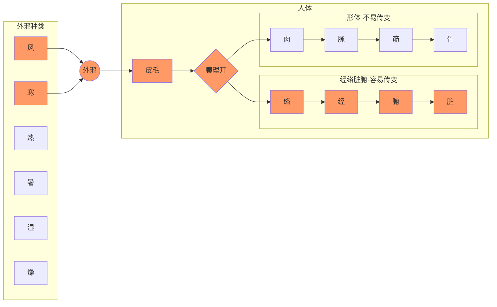
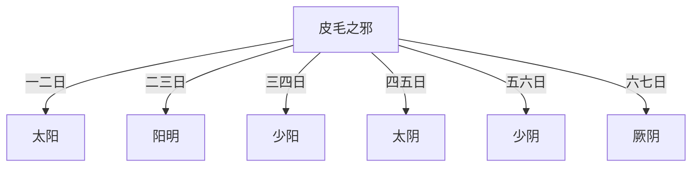
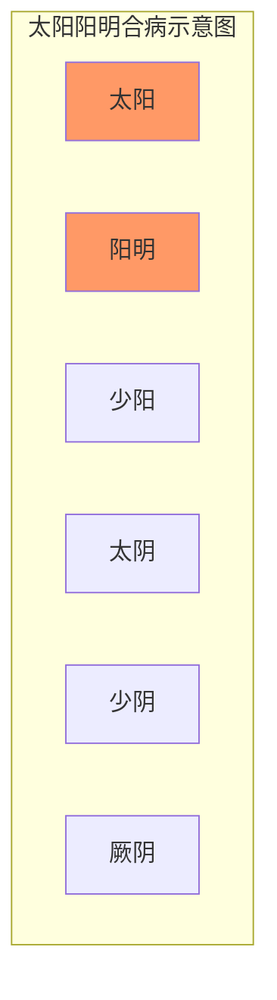
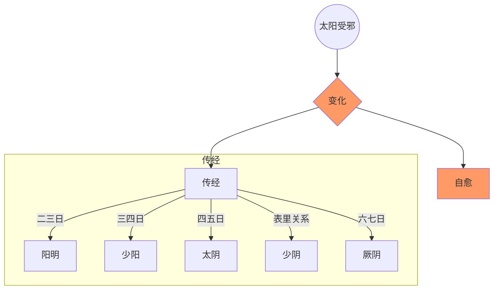
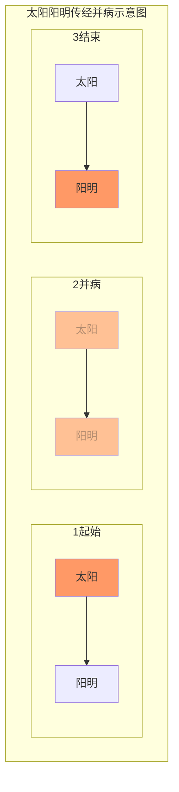

# 伤寒论基础概念

## 1、传入过程

《入门》中谈到了外邪侵入体内的部位划分方法，如下图。风、热、暑、湿、燥、寒六气正常不为邪气，若过度则侵入身体发病，即外感六淫。在伤寒论中，主要谈的是风寒之气过度，入侵人体的过程。

即下图中的红色部分。

### 皮毛受邪

外感风寒之邪侵袭人体，首先在皮毛。受风邪，称为中风；受寒邪，称为伤寒。皮毛感受风寒的表现为“泝然起毫毛”，就是寒栗、毫毛竖起的样子。

> 邪之始入于皮也，**泝然起毫毛，开腠理**，其入于络也，则络脉盛色变；其入客于经也，则感虚，乃陷下，其留于筋骨之间。寒多则筋挛骨痛；热多则筋弛骨消，肉烁（月囷）破,毛直而败。
>
> 《素问-皮部》

> 伤寒则是皮毛受邪，营卫失和，其病从外而内。
>
> 《伤寒论讲解-384条》

风寒之邪侵入皮毛肌表，人体气血涌动到肌表抗邪，所以表现为脉浮；如开始正邪相争，则表现为发热；肌表的卫气受邪气干扰不能散布于体表，就会恶寒（恶寒即怕冷）。所以发热、怕冷、脉浮被称为**表证**。

此外，如邪气阻碍肌表部位的经气运行，可能导致身体和四肢疼痛的症状。在中医中，各种疼痛都是经气运行不通畅引起的，所谓不通则痛。

如果受的是风邪，则可能怕风，还可能有汗。如果是寒邪，因寒邪能闭塞汗孔，所以可能无汗。

邪气影响肺的宣发功能，所以可能有鼻塞。

> 表指经络、肌表部位，里指脏腑、筋骨、气血等。
>
> 表证多见于外感病初期，病变在皮毛、肌腠，部位表浅。
>
> 临床表现：发热、恶寒、或恶风、头痛、身痛、肢痛、无汗、或有汗、鼻塞、舌苔薄白、脉浮等。

皮毛受邪，有人正气足，可自己排出邪气而自愈，无需治疗。如果正气不足，未能排出邪气，则邪气可能入侵经络。

> 是故百病之始生也，必先于皮毛。邪中之，则腠理开，开则入客于络脉，留而不去，传入于经，留而不去，传入于腑，廪于肠胃。
>
> 《素问-皮部》

### 皮毛之邪入经

#### 入一经

皮毛受邪后，邪气并非立刻进入经络，而是需要过一段时间才会侵入经络。皮毛受邪时间与邪气侵入经络时间的间隔，三阴三阳六个区域各有不同。侵入太阳区域，需一两日。侵入阳明区域，需二三日。少阳、太阴、少阴、厥阴区域依次增加一日。

> 尺寸俱浮者，**太阳受病也，当一二日发**。...尺寸俱长者，**阳明受病也，当二三日发**。...尺寸俱弦者，**少阳受病也，当三四日发**。...尺寸俱沉濡者，**太阴受病也，当四五日发**。...尺寸俱沉细者，**少阴受病也，当五六日发**。...尺寸俱弦微者，**厥阴受病也，当六七日发**。
>
> 《伤寒论-伤寒例》

> 岐伯曰：伤寒一日，巨阳受之...二日阳明受之...三日少阳受之...四日太阴受之...五日少阴受之...六日厥阴受之。
>
> 《素问-热论》

> **伤寒三日，三阳为尽，三阴当受邪⑴。其人反能食而不呕，此为三阴不受邪也⑵。[270]**
>
> **伤寒三日，少阳脉小者，欲已也。[271]**
>
> 《伤寒论-270、271条》

##### 直中

《入门》中提到了皮毛外感邪气通常入三阳经，且以足太阳经为最易入侵。邪气一般不直接入三阴经。除非五脏衰弱，阴经气不足，才有可能直入三阴，此时称为“直中”。阴经一般不直接受邪，但一旦受邪，就比较严重。

> 外邪不经过三阳，发病即见三阴证候，后人谓之“*直中*”，直中多因素体阳虚，致使邪气得以长驱直入，故病多沉重。
>
> 《伤寒论讲解-绪论》

> **厥阴病的成因**，有邪气传经而来者，如三阳病失治或误治，或太阴、少阴病不愈，均有可能传至厥阴；**也有外邪直中，而使本经自病者**。根据临床观察，前一种情况似为多见。
>
> 《伤寒论讲解-辨厥阴病脉证并治-概说》

##### 命名

皮毛受风邪，传入各经，称为某经中风。受寒邪，传入各经，称为某经伤寒。比如有太阳中风、太阳伤寒，阳明中风、阳明伤寒等等。

> 阳明病来路有二，一为他经之邪传来，一为本经直接受邪。传经之邪一般多从阳化热，**直接受邪则有中风、中寒之不同。今以能食与否来辨中风、中寒，从中可以会到辨证方法**。
>
> 《伤寒论讲解-190条》

#### 入多经（合病）

两个以上的区域同时发病，称为合病。比如皮毛受邪后，第一日，太阳发病，至第二日，阳明也发病，此时即为太阳阳明合病。如果第三日，少阳也发病，则为三阳合病。也可以第一日太阳不发病，二日阳明、三日少阳发病，为少阳阳明合病。

理论上讲，六个区域都可以同时发病。但在伤寒论中，明确提出的合病都在三个阳经，阴经没提合病。教材认为是详于前而略于后。

> 两经以上同时发病谓之“合病”，本论明言合病者有太阳阳明合病，太阳少阳合病，少阳阳明合病，三阳合病四种...凡合病，多邪盛而病剧；凡并病，则邪气较轻而易治。至于三阴经病不见合病、并病之说，**似有详于前而略于后之义**。

> **太阳与阳明合病**者，必自下利，葛根汤主之⑴。[32]
>
> **太阳与阳明合病**，不下利但呕者，葛根加半夏汤主之⑵。[33]
>
> **三阳合病⑴，脉浮大，上关上⑵，但欲眠睡，目合则汗⑶。[268]**

##### 两感

如果互为表里的两个区域同时发病，称为“两感”。比如伤寒后第一天，邪气不但入侵了太阳，还同时入侵了少阴，即为太阳少阴两感。这种情况多是五脏虚弱，比较严重。

> **凡伤于寒则为病热，热虽甚不死。若两感于寒而病者。必死。**...
>
> 若相表里的阴阳两经，如太阳与少阴，阳明与太阴，少阳与厥阴，同时受邪发病，则称"两感于寒而病”。两感则多因素体阳虚，正气抗邪无力，致使邪气得以深入所致，故其预后每多不良。

> 若两感于寒者，一日太阳受之，即与少阴俱病，则头痛、口干、烦满而渴（1）；
>
> 二日阳明受之，即与太阴俱病，则腹满、身热、不欲食、讝语；
>
> 三日少阳受之，即与厥阴俱病，则耳聋、囊缩而厥，水浆不入，不知人者，六日死（2）。
>
> 若三阴三阳，五脏六腑皆受病，则荣卫不行，脏腑不通，则死矣。

### 风寒入经的后继发展

三阴三阳划分人体六个区域。每个区域都是以经络为中心，外连肌表，内联脏腑。因此，每个区域都可以经证和脏腑证两个部分。

> 热证、实证、里证是阳明病的主要内容，但阳明也有表证，如第〔234〕条之用桂枝汤，第〔235〕条之用麻黄汤即是：阳明也有里虚寒证，如本条之用吴茱萸汤即是。由此看来，**六经病证中，每经病皆有表里、寒热、虚实、阴阳之分证**，可见六经辨证实以六经为纲，以八纲为用的综合性辨证方法。
>
> 《伤寒论讲解-234条》

经证有时还可以分为经偏表证和偏经证。

> 太阳经脉行于项背，太阳之气行于体表，邪伤太阳，**有病偏于表者**，中风、伤寒是也，**有病偏于经者、太阳经输不利证是也**。但二者又不可截然分开，表证中可见头项强痛之经输不利，经输不利证中又可见汗出(或无汗)恶风寒等表证。太阳表证，治用汗法解表；经输不利证，重用葛根解经中之邪并配合解表，证与方药丝丝入扣。

邪气入某经后，其后继发展也遵循正邪关系。如果本经正气足，则可自愈。如果它经正气虚，则可以传变。如果脏腑正气虚，则可以入脏腑。

#### 自愈：

邪气入某经而发病，正邪对峙。从发病时算起，六、七日之内可能会自愈。其原理应为气血七日一个波动周期，此周期内会有气血峰值出现，

此时正气的力量会胜过邪气，能够驱邪外出，实现自愈。

> 病有发热恶寒者，发于阳也；无热恶寒者，发于阴也(1)。**发于阳，七日愈；发于阴，六日愈，以阳数七阴数六故也(2)**。[7]

> 《易经》有七日来复的论点，外感病的发展变化也具有这种七日来复的节律，一般来讲**六经病的或愈或传亦多在六七日或七八日之间**，因此每经病从发病到病退也多在七日之间。

> **太阳病，头痛至七日以上自愈者，以行其经尽故也**（1），...
>
> 故人体的生理活动和病理变化也有七日节律。太阳病七日以上，正是本经阳气来复的时候，故是正胜邪却而病自愈的良好时机。因此，七日亦可看作太阳病的自然病程，仲景则称“行其经尽”。

> 凡**得时气病**，至五六日，而渴欲饮水，饮不能多...**至七八日**大渴欲饮水者，犹当依证而与之，与之常令不足，勿极意也（2）。言能饮一斗，与五升。... 忽然大汗出，是为**自愈也**（4）。

七日自愈是从经络发病开始算起，如果从皮毛受邪开始算的话，则要加上皮毛受邪到发病的日期。比如阳明区域，皮毛受邪到阳明发病，应有二、三日，加上六、七日自愈周期，所以应在八、九日后痊愈。其它区域类似。

> 至七日太阳病衰，头痛少愈也；八日阳明病衰，身热少歇也；九日少阳病衰，耳聋微闻也；十日太阴病衰，腹减如故，则思饮食；十一日少阴病衰，渴止舌干，已而嚏；十二日厥阴病衰，囊纵，少腹微下，大气皆去，病人精神爽慧也。...
>
> 《易经》有七日来复的论点，外感病的发展变化也具有这种七日来复的节律，一般来讲六经病的或愈或传亦多在六七日或七八日之间，因此每经病从发病到病退也多在七日之间。但从受邪至发病的时间六经各有不同，太阳为第一日，阳明为第二日，少阳为第三日，太阴为第四日，少阴为第五日，厥阴为第六日，**因此从受邪至病退，六经的日数则分别为七、八、九、十、十一、十二日**。本段亦出《素问热论》中。“大气皆去,病人精神爽慧”，指大邪已衰退，病人精神爽快，神志清晰。
>
> 《伤寒论讲解-伤寒例》

如果自愈周期过后还不愈，说明病人自身正气波动到峰值依然无法超过邪气的力量，代表邪气力量过大，正气力量过小，比较严重，应认真治疗。

> **若过十三日以上不间，寸尺陷者，大危（5）。若更感异气变为他病者，当依后坏病证而治之（6）**...
>
> 过十三日以上不间，……大危：...”若过十三日以上病仍不愈，为邪气盛而不衰。“尺寸陷”指寸关尺三部脉沉伏不出，为正气大衰。邪盛而正衰，故主大危。此举厥阴病过期不愈之危证，说明六经为病，凡过期不愈者，皆主病势沉重。
>
> 《伤寒论讲解-伤寒例》

这种自愈规律指的是正常情况，要求满足三个条件：

1、非表里两经同时受邪，即两感

2、没有发生传经情况

3、期间没有重复感受其它邪气。

> **其不两感于寒，更不传经，不加异气（3）者，至七日太阳病衰，头痛少愈也。**
>
> 。。。
>
> 本段论述不是两感，又未传经，也没有另外感受他种病邪，而是单纯经脉受邪的自然病程及邪气衰退时的临床现象。《易经》有七日来复的论点，外感病的发展变化也具有这种七日来复的节律，一般来讲**六经病的或愈或传亦多在六七日或七八日之间**，因此每经病从发病到病退也多在七日之间。但从受邪至发病的时间六经各有不同，太阳为第一日，阳明为第二日，少阳为第三日，太阴为第四日，少阴为第五日，厥阴为第六日，**因此从受邪至病退，六经的日数则分别为七、八、九、十、十一、十二日**。本段亦出《素问热论》中。“大气皆去,病人精神爽慧”，指大邪已衰退，病人精神爽快，神志清晰。

身体有特殊情况之人，感受外邪生病，在邪气排出、外感症状初步消失后，依然身体不适，这是正气还没有恢复，期待下一个周期正气充足后可以好转。

> **风家，表解而不了了者，十二日愈。[10]**...
>
> 风家，泛指易患太阳表病之人。这类人大多素体较弱，故与一般太阳病患者不同，而称为“风家”。“不了了”即精神和身体还不爽快，这是大邪已去，正气未复的表现，所以说“表解而不了了”。这就需要调养一段时间，预测至十二日正气恢复，病即可痊愈。此言“十二日”是约略之辞，不必拘泥。

##### 欲解时

伤寒论中六经各有欲解时，一般把这个欲解时理解为一日之内的不同时辰（此处还有待考证）。

自愈的本质是正邪相争，正气胜出。又因为人体正气随时间波动，所以在正气强的时间，则自愈的可能性大。前面说的是人体正气的七日波动周期产生的自愈规律。但是在一日之内，不同的区域的正气强大时间不同，所以欲解时不同。

不同区域伤寒病的欲解时如下：

太阳病，从巳至未，9点到15点

阳明病，从申至戌，15点到21点

少阳病，从寅至辰，3点到9点

太阴病，从亥至丑，21点到3点

少阴病，从子至寅，23点到5点

厥阴病，从丑至卯，1点到7点

#### 传经

一个区域受邪发病后，可能传到其它区域，此为传经。理论上讲，因十二经络相连，每个区域可以和任意一个其它区域互传。但常见的是相邻或者相表里的经络互传，比如由阳明与太阳或少阳的互传，或者阳明与太阴的表里互传等等。

> 由于正气有强弱，邪气有盛衰，正邪相争，阴阳进退，就使六经病证经常处于一个不断变化的状态。所谓传变，则主要是对这一变化的描述，邪气由此经进入彼经，则谓之传。随着邪气的转移，临床证候也必然相应地发生变化,有传必有变，故称传变，也即传经。
>
> 传与不传与邪气的盛衰，正气的强弱，治疗与护理之是否得当有关，尤以正气的抗邪能力大小为关键。若正气虚衰，邪气则可由表传里，由浅入深，使病证渐趋沉重；若正气恢复，抗邪有力,邪气又可由里达表，由阴出阳，使病向愈。辨传与不传，传至何经,当以脉证变与不变为据。预知传与不传，对掌握治疗与预防的主动权有非常积极的意义。

按照太阳、阳明、少阳、太阴、少阴、厥阴的顺序，前向后传为病邪深入，反之则为病邪浅出。

从时间角度看，传经有两个时间特点：

1、如果病邪较重，病邪可能一日一传。比如太阳区域受寒，一日后发太阳病，二日即转为阳明病，三日转为少阳病，甚则进一步转为太阴、少阴、厥阴病。

> 伤寒二三日，阳明少阳证不见者，为不传也。[5]

2、如果一个七日自愈周期内，没有自愈的话，则七日后容易发生传经。

如何判断病邪要从一个区域传到另一个区域呢？以太阳区域受寒邪传经为例：

太阳伤寒第一日就有发热、无汗、恶寒等太阳伤寒症状，此时可通过其他症状，可判断是否传经。

如果脉象浮紧，符合太阳伤寒的脉象，则为不传。如果脉数急，急数为热，则有传到其它区域的征兆。

> **伤寒一日，太阳受之，脉若静者，为不传**；颇欲吐，若躁烦，**脉数急者，为传也**。[4]

因呕吐是少阳区域的主要症状，如果有要呕吐的感觉，则可能要传往少阳区域。

> “喜呕”则为少阳病主证之一。本论每以呕吐之有无来说明少阳病之有无。 如“呕而发热者，柴胡汤证具”、“本太阳病不解，转入少阳者……干呕不能食”等，是以呕吐标志少阳病已成

因内热是阳明区域的主要情况，内热会引起烦躁，如果有烦躁的感觉，则可能要传往阳明区域。

> “躁”是肢体躁扰不宁；“烦”是心中烦闷不舒。烦多因热扰心神而致，躁常因心烦而致，故常烦躁并称。“躁烦”，即或见烦躁，这是邪气入里化热，阳明有热的标志

这里举太阳病的例子，是表明传经的特点。

如果七日不自愈，则又可能传到其它更深的区域。此时如能补充正气，可阻止其传经。

> **太阳病，头痛至七日以上自愈者，以行其经尽故也（1），若欲作再经(2)者，针足阳明，使经不传则愈(3)。[8]**...
>
> 太阳病七日如不愈，则反映邪气较盛，虽有阳气来复，但不足以祛邪外解，就有内传他经的可能。...
>
> 针刺足阳明的穴位。注家有人主张刺足三里穴，有人主张刺趺阳脉穴，但总以足阳明经脉上的穴位为是。阳明为水谷之海，三阳之屏障，通过针刺，使其经气流通，抗邪之力增强，故有预防传变的作用。

##### 并病：

传经的时候往往有个过渡过程，此时本区域和目标区域的一些症状往往同时出现，此时称为并病。

> 一经证候未罢，又出现了另一经的证候，传而未尽者，谓之“并病”，本论明言并病者有太阳阳明并病，太阳少阳并病两种。

> 两经以上同时发病谓之“合病”，本论明言合病者有太阳阳明合病，太阳少阳合病，少阳阳明合病，三阳合病四种。一经证候未罢，又出现了另一经的证候，传而未尽者，谓之“并病”，本论明言并病者有太阳阳明并病，太阳少阳并病两种。凡合病，多邪盛而病剧；凡并病，则邪气较轻而易治。
>
> 至于三阴经病不见合病、并病之说，似有详于前而略于后之义。
>
> 表里两经同时发病谓之“两感”。两感语出《素问·热论》，本论《伤寒例》、《太阳病篇》、《少阴病篇》皆有论及。
>
> 外邪不经过三阳，发病即见三阴证候，后人谓之“直中”，直中多因素体阳虚，致使邪气得以长驱直入，故病多沉重。
>
> 《伤寒论讲解-绪论》

#### 入脏腑

风寒入经后，如果未治好，可能入对应脏腑。

> 太阳经邪不解，又经大汗伤正，表邪极易由经入腑而影响膀胱气化功能，膀胱气化不利，水邪内蓄，则小便不利；津液不能输布上承，则见口渴，口渴思饮，而饮又不解渴，便名以“消渴”，这是与上述胃热津伤轻证之少少与饮之即可使口渴缓解的不同之处。本证之消渴，又以小便不利为主，故与饮多溲多之消渴病也不相同。可见本证乃是外有表邪，内有蓄水，是太阳经腑同病之证。
>
> 《伤寒论讲解-71条》

那么如何判断病在表、在某经或某脏腑呢？自然是根据发病的独特表现来判断，见下面。

## 2、各经受邪的表现

因三阴三阳是部位的概念，属于病位。每个部位都可以有寒热虚实的失衡，是为病性。

各经受邪后的表现很多，这里初步谈一些主要症状，具体需要研读条文，全面掌握。

首先各经经络通道附近的异常都可以该经之病。

### 六经经症

经证有偏表，偏经之区分。

> 太阳经脉行于项背，太阳之气行于体表，邪伤太阳，有病偏于表者，中风、伤寒是也，有病偏于经者、太阳经输不利证是也。

伤寒论在伤寒例中还提到了各经通道经过之处的病症。因这些病症在伤寒例中提到了，所以在正文中略掉，并非不需要掌握。比如少阳的胸胁痛、耳聋症状，在少阳主症中并未提及，但是在96条、264条等处都有提及。

> 这里提出六经为病的证候与《素问•热论》相同，一可看出《伤寒论》对《内经》的继承性；二可**补本论六经辨证中所涉及的经络病证之所略**。

太阳区域为头、项疼痛，腰脊僵硬；

阳明区域为身热、汗出、目疼、鼻干、不得卧；

少阳区域为胸胁痛、耳聋；

太阴区域为腹满、嗌干；

少阴区域为口燥舌干而渴;

厥阴区域为烦满而囊缩；

> 尺寸俱浮者，太阳受病也，当一二日发。以其脉上连风府，故头项痛，腰脊强。
>
> 尺寸俱长者，阳明受病也，当二三日发。以其脉侠鼻、络于目，故身热、汗出、目疼、鼻干、不得卧。
>
> 尺寸俱弦者，少阳受病也，当三四日发。以其脉循胁络于耳，故胸胁痛而耳聋。
>
> 此三经受病，未入于腑者，皆可汗而已。
>
> 尺寸俱沉濡者，太阴受病也，当四五日发。以其脉布胃中，络于嗌，故腹满而嗌干。
>
> 尺寸俱沉细者，少阴受病也，当五六日发。以其脉贯肾，络于肺，系舌本，故口燥舌干而渴。
>
> 尺寸俱弦微者，厥阴受病也，当六七日发。以其脉循阴器、络于肝，故烦满而囊缩。
>
> 此三经受病，己入于腑者，皆可下而已。
>
> 《伤寒论-伤寒例》

### 经证与脏腑证

#### 太阳

##### 经证：

脉浮，头痛项强，恶寒发热

##### 腑证

太阳蓄水：小便不利与消渴

太阳蓄血：少腹急结或硬满，其人如狂或发狂

> 太阳病为阳证之轻浅者，病变主要在太阳膀胱经腑及其所主之肌表。若风寒之邪外袭，营卫失和，经气不利，阳气抗邪于表，证见脉浮，头痛项强，恶寒发热，则属太阳经表之证。若邪气循经入腑，或邪与水结，膀胱气化不利，证见小便不利与消渴，而为太阳蓄水；或邪与血结，血热瘀阻下焦，证见少腹急结或硬满，其人如狂或发狂，而为太阳蓄血，皆为太阳膀胱腑证。

#### 少阳

##### 经证

耳聋、目赤、胸中满而烦

##### 腑证

口苦、咽干、目眩

> 胆热、气郁之证。耳聋、目赤、胸中满而烦等，为少阳经气不利之证，可看作是少阳经证，口苦、咽干、目眩为少阳胆火上炎之证，可看作是少阳腑证
>
> 《伤寒论讲解-辨少阳病脉证并治第九-概说》

### 六经各有提纲症：

**太阳之为病，脉浮，头项强痛而恶寒**

**阳明之为病，胃家实是也**

**少阳之为病，口苦、咽干、目眩也。[263]**

**太阴之为病，腹满而吐，食不下，自利益甚，时腹自痛⑴。若下之，必胸下结鞕⑵。[273]**

**少阴之为病，脉微细⑴，但欲寐也⑵。[281]**

**厥阴之为病，消渴，气上撞心，心中疼热⑴，饥而不欲食，食则吐蚘，下之利不止⑵。[326]**

主症非常重要，但是过于简略，光靠主症是不够定位的。其它判断方法见下面。

### 六经中风伤寒的区别

**太阳病，发热，汗出，恶风，脉缓者，名为中风。[2]**

**太阳病，或已发热，或未发热，必恶寒，体痛，呕逆，脉阴阳俱紧者，名为伤寒。[3]**

**阳明中风⑴，口苦，咽干，腹满微喘，发热恶寒，脉浮而紧⑵，若下之，则腹满，小便难也⑶。[189]**

**阳明中风，脉弦浮大⑴而短气，腹都满⑵，胁下及心痛，久按之气不通⑶，鼻干，不得汗⑷，嗜卧，一身及目悉黄，小便难⑸，有潮热，时时哕，耳前后肿⑹。刺之小差，外不解⑺，病过十日，脉续浮者。与小柴胡汤(8)。[231]**

**阳明病，若中寒者，不能食，小便不利，手足濈然汗出，此欲作固瘕，必大便初鞕后溏⑴；所以然者，以胃中冷，水谷不别故也⑵。[191]**

**阳明病，若能食名中风；不能食，名中寒。[190]**

**少阳中风，两耳无所闻，目赤，胸中满而烦⑴者，不可吐下，吐下则悸而惊⑵。[264]**

**伤寒，脉弦细，头痛，发热者，属少阳⑴。少阳不可发汗，发汗则谵语，此属胃，胃和则愈，胃不和，烦而悸⑵。**一云躁。**[265]**

**太阴中风，四肢烦疼，阳微阴涩而长者，为欲愈。[274]**

**少阴中风，脉阳微阴浮者，为欲愈。 [290]**

**厥阴中风，脉微浮，为欲愈；不浮，为未愈。[327]**

### 疑问：

#### 为什么伤寒传足不传手？

伤寒论中提到的症状，大部分是与足经相关，与手经关系不大。比如太阳病的头项僵硬疼痛，这是足太阳经的路线。为什么不谈手太阳小肠经的部位？太阴病的腹痛是脾的问题，为什么不谈手太阴肺的问题？反倒是在太阳病中提到了喘，与肺有关，用药上也有大小青龙汤治疗肺部疾病。

这是因为人体的疾病的变化，经络相传只是其中之一。中医理论中，各个部位之间的关系有多种。外感病虽然以经络为线索，但是经常也涉及其它关系。像皮毛受邪，影响肺的功能，这是因为肺的宣发功能与皮毛相关。这个传变不是从经络传变的。

传足不传手，是因为手经经气旺盛，外感病很难从手经侵入。

#### 脉浮、恶寒、发热是肌表症状，为什么做为太阳提纲证？

前面提到脉浮、恶寒、发热都是表证，是全身的症候。为什么在六经受邪表现中，脉浮、恶寒作为太阳病的提纲证？太阳部位是人体的一个区域，为什么与全身表证的症候相应？

这里首先要理解人体抗邪机制，人体内部无病，才能产生足够气血抗邪于肌表。实际上，脉浮、发热这种标准的表证，是人体抗邪功能正常的一种表现。如果内部有病，是难以产生这种标准抗邪表现的。足太阳经作为人体最大的经络，是这种正常正邪对抗除肌表外的第一战场。正邪相斗于此经，人体的产生、传输气血的功能并未遭到大的破坏，所以能够维持脉浮、发热的拒邪于表的的状态。此时表证与足太阳经症同时出现，并持续存在于太阳病的全部病程。

一旦战场转移到其它区域，则人体产生、传输气血功能受到较大影响，那么这种表证的拒邪于表的状态就会受到破坏而产生变化。比如转移到少阳区域，则以脉弦为主。此时不提脉浮还是脉沉，那么应该理解为脉没有明确的偏浮或者偏沉，即为不浮也不沉，说明气血既不是抗邪于表状态，也不是明显抗邪于里，而是内外均衡。

至于阴经，因为阴经连五脏，所以到达阴经的时候，产生气血功能受影响非常大，大多情况是气血聚集于里部而脉沉，气血量小而脉微细，此时肌表气血不足，所以不能发热，特别是不能发高热。

六经证中只有太阳经证能够与表证同步，继续维持气血抗邪与表的状态。其它经因功能各有不同，所以都难以维持标准的肌表抗邪状态。

所以标准的太阳证也是最容易治疗的，视其有汗、无汗，以及是否有项背僵硬疼痛的症状，选择桂枝汤、麻黄汤或者桂枝加葛根汤以及葛根汤，发微汗即可。

但若非标准太阳证，而是夹杂了其它经腑证，则不这么简单了。比如三阳合病、太阳少阴两感病等等。

太阳病提纲证为伤寒论第2条：脉浮、头项强痛、怕冷。结合第2、3条，还应有发热。

单纯太阳病中，脉浮、怕冷、发热加头项强痛这几个症状是同时出现的，且在其病程中持续存在，这是太阳病的特点。

没有脉浮，说明病邪侵入肌表，但是正气却未聚集于肌表抗邪，说明其人内部有其它问题。像伤寒论301条，说少阴病开始的时候，有发热，但是脉沉，用麻黄附子细辛汤。

没有怕冷，不为太阳病，因太阳经为三阳主气，主管卫气在肌表的散布。

有怕冷而没有发热，不为太阳病，因为无热恶寒发于阴，不发热的怕冷都是阴证，不会是太阳证。

没有头项僵硬疼痛，也不为太阳病。只有脉浮、怕冷、发热的症状，没有其它的经证和脏腑证。说明病邪被拒于肌表，未能入经。

非此情况，则需要进一步分析。

在阳明病篇183条，提到阳明病也可以怕冷，但是不发热，无头项强痛，且持续时间很短，一天后就转为怕热。所以恶寒不是阳明病的提纲证。

> **问曰：病有得之一日，不发热而恶寒者，何也⑴？答曰：虽得之一日，恶寒将自罢，即自汗出而恶热也⑵。[183]**
>
> **问曰：恶寒何故自罢？答曰：阳明居中，主土也，万物所归，无所复传⑴，始虽恶寒，二日自止，此为阳明病也⑵。[184]**

> **阳明病，脉迟，汗出多，微恶寒者，表未解也，可发汗，宜桂枝汤。[234]**...
>
> 桂枝汤不独为太阳中风表虚证而设，亦为诸经表虚证之总方，亦如柯韻伯所说：“阳明病脉迟汗出多者宜之，太阳病脉浮者亦宜之，则知诸经外症之虚者”，咸得用之。

在276条，提到太阴病也可以脉浮，但是一样属于偶发现象。阴证应该脉沉，所以这种脉浮只是太阴病起始的时候短暂现象。

> **太阴病，脉浮者，可发汗，宜桂枝汤。[276]**

三阴病都可以有怕冷，但是不会发热。

少阳病是寒热往来，怕冷与发热交替出现。

所以只有太阳病，是脉浮、发热、怕冷、头项强痛同时出现，且一直持续在其病程之中。因此这几个症状作为太阳病的提纲证。

> 六经病皆有恶寒，又各有特点，太阳病是风寒外束，卫阳失于温煦，故而恶寒，且与发热并见，经过适当的治疗，恶寒一罢，则太阳病随之而愈。故前人有“有一分恶寒，便有一分表证”之说。阳明病之恶寒，是由于阳郁不伸，卫阳一时失于温煦所致，很快邪归于胃，从燥而化，热象迅速出现，故云“二日自止”，这与太阳病因失治迁延八九日乃至十余日恶寒仍在，自是不能同日而语。少阳病恶寒，是正邪相争，互有胜负，正胜则热，邪胜则寒，表现为寒热往来，若不予治疗，则迁延时日。至于三阴病恶寒，是阳气虚衰，不能温煦，故但恶寒而不发热，这些恶寒与阳明病恶寒对比则绝然不同。

> 

