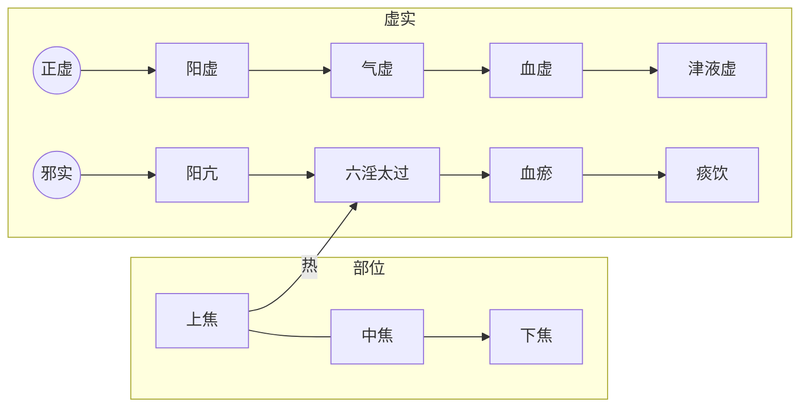

# 气血均衡

## 1、气血均衡原则

自然界不同地区形成适宜环境所需的能量及气、液、固态物质应是差不多的。人体小自然不同部位的阴、阳、气、血资源也应是相对均衡的。各部位获得的资源可以有一定的差异，也可以随时间变化有一定波动，但都应在平衡范围内。

检查脉象是诊查人体气血等资源状态的一个主要手段。关于脉象的几个维度指标在《概念入门》中已经做了介绍。

这里再对气血在全身的分布做个重点介绍。

全身气血的分布首先按照内外划分，脏腑为内，形体为外。其次按照上中下划分，即上焦、中焦、下焦。

气血为流动之物，可在内外部位以及上下部位之间波动。气血之中，气的流动更为敏感。当某个部位气过虚的时候，其它部位的气会流向该部位。这个道理类似一个房间有阴面和阳面，当阴面的气被吸走的时候，阳面的气就会流动到阴面，反之亦然。

> 脉有三部，阴阳相乘，**荣卫血气，在人体躬，呼吸出入，上下于中，因息遊布(1)，津液流通**。随时动作，效象形容(2)，

比如内部的气虚的时候，外部的气就会内陷。

> 趺阳脉迟而缓，胃气如经也。趺阳脉浮而数，浮则伤胃，数则动脾，此非本病，**医特下之所为**也。
>
> **荣卫内陷**，其数先微，脉反但浮，其人必大便鞕，气噫而除(1)。何以言之？本以数脉动脾，其数先微，故知脾气不治，大便鞕，气噫而除。今脉反浮，其数改微。邪气独留，心中则饥，邪热不杀谷(2)，潮热发渴，数脉当迟缓，脉因前后度数如法，病者则饥，数脉不时，则生恶疮也。
>
> 《伤寒论讲解-辨脉法-单元3》

在伤寒论中，这种情况往往是因为在不恰当的时机使用了下法。肠胃实热造成大便干燥的情况往往需要使用下法，即使用承气汤类方剂。泻邪容易伤正，所以这种下法容易伤里部气血。如果该人本来有发热表证，里气被伤之后，邪热可能随之内陷而形成里部失衡。

> 若不宜下而便攻之，**内虚热入**，协热遂利，烦躁诸变，不可胜数，轻者困笃，重者必死矣⑸。
>
> 《伤寒论-伤寒例》

> **病发于阳，而反下之，热入因作结胸**⑴
>
> 《伤寒论讲解-131条》

同理，上下焦的气血也是一对阴阳。若寸脉微，则代表上焦气血虚，此时下焦气可能进入上焦。因下焦偏寒，所以人会恶寒。反之，尺脉弱代表下焦气血虚，此时上焦气可能进入下焦，因上焦偏热，所以可能会发热。

> 问曰：病有洒淅恶寒，而复发热者何？答曰：阴脉不足，阳往从之，阳脉不足，阴往乘之。
>
> 曰：何谓阳不足？答曰：假令**寸口脉微，名曰阳不足，阴气上入阳中，则洒淅恶寒也**。
>
> 曰：何谓阴不足？答曰：**尺脉弱，名曰阴不足，阳气下陷入阴中，则发热也。**
>
> 《伤寒论讲解-辨脉法-单元1》

注意此处提到的发热、恶寒，和人肌表受风寒之邪，人体气血波动于肌表抗邪，产生的发热、恶寒症状的原因是不同的。彼情况的脉象为脉浮，具体见后面的说明。

理解了这个道理，就可以理解伤寒中里气外出，表气内陷，以及阳气下陷和阴气上冲的原理。

### 气血分布的平衡点

若全身气血分布均衡，在脉象表现为寸关尺三部脉象接近一致，其波动均匀、柔和、有力，不快不慢，不大不小，不滑不涩，不弦不动。此为阴阳和平之脉。

> 问曰：脉病欲知愈未愈者，何以别之？答曰：**寸口、关上、尺中三处、大小、浮沉，迟数同等，虽有寒热不解者，此脉阴阳为和平**，虽剧当愈。
>
> 《伤寒论讲解-辨脉法-单元2》

> **阳脉浮大而濡，阴脉浮大而濡，阴脉与阳脉同等者，名曰缓也。**
>
> 〔**讲解**〕本条辨阴阳和平之脉法。 “缓”，指脉来和缓舒徐，不数不迟，不结不促而无阴阳偏颇之象。
>
> 《伤寒论讲解-辨脉法-单元1》

> 九候之相应也，**上下若一，不得相失**。一候后则病，二候后则病甚，三候后则病危。所谓后者，应不俱也。
>
> 《素问-三部九候论》

### 平衡范围内的波动与差异

根据平衡的原理，各种指标都是围绕着平衡点有空间差异和时间波动。对于气血的均衡来讲，也有这种特性。

#### 气血空间分布指标

全身气血的空间分布首先按照内外划分，其次按照上中下划分。气血的内外分布通过脉的沉浮来辨别。

> 浮部分经，以候皮肤经络之气；沉部分经，以候五脏之气；中部分经，以候六腑之气。
>
> 《桂本伤寒论-平脉法第一》

上中下分布通过寸、关、尺脉来辨别。寸脉代表上焦含心肺，在伤寒中称为阳脉；关脉代表中焦含脾胃；尺脉代表中下焦含肾，为阴脉。（肝有时归在中焦，有时归在下焦，说法不一）

> 脉分寸关尺，寸脉分经以候阳，阳者气之统也；尺脉分经以候阴，阴者血之注也；故曰阴阳。关上阴阳交界，应气血升降，分经以候中州之气。
>
> 《桂本伤寒论-平脉法第一》

上下内外的气血可以在平衡范围内有正常的差异，随时间变化有正常的波动。空间差异方面，在任何时间点，各处的脉象可以表现出一定的差异，比如阳脉偏浮一点，阴脉偏沉一点。为正常。

> 关之前者，阳之动也，脉当见九分而浮。过者，法曰太过；减者，法曰不及。遂上鱼为溢，为外关内格，此阴乘之脉也。
>
> 关之后者，阴之动也，脉当见一寸而沉。过者，法曰太过；减者，法曰不及。
>
> 《难经-三难》

在时间波动方面，在任意空间点，都可以有昼夜、四季的变化，也为正常。这些内容在《入门》中已经提及。

> 师曰：立夏(1)得洪一作浮。大脉，是其本位，其人病身体苦疼重者，须发其汗。若明日身不疼不重者，不须发汗。若汗濈濈(2)自出者，明日便解矣。何以言之？立夏脉洪大，是其时脉，故使然也。四时仿此。
>
> 《伤寒论讲解-辨脉法-单元2》、

寸口脉代表肺气，因百脉朝会于肺，所以可以诊全身气血。因先后天之本脾肾非常重要，所以在伤寒论中，还要用足阳明胃经的冲阳穴诊脾胃气，称为趺阳脉或者阳明脉；足少阴肾经的太溪穴诊肾气，称为太溪脉或少阴脉。

### 对脉的变化的理解

#### 可能失衡也可能不失衡的脉象

脉的大浮数动滑和沉涩弱弦微是相对于标准脉的差异。当这种差异不大的时候，我们很难直接判断到底是正常差异还是病态失衡。也就是说出现这种情况，有可能是失衡也有可能是平衡。比如人在运动过后，必然脉象偏洪大数，这是正常的表现。休息的时候，脉偏沉弱，也是正常的。再比如偏阳性的浮大脉出现在春夏就是正常的，出现在秋冬就不太正常。

> 二月得毛浮脉，何以处言至秋当死。

> 脉逆四时，为不可治（5）。必察四难，而明告之（6）。所谓逆四时者，春得肺脉，夏得肾脉，秋得心脉，冬得脾脉（7），其至皆悬绝沉涩者，命曰逆四时（8)；未有藏形，于春夏而脉沉涩，秋冬而脉浮大，名曰逆四时也。
>
> 《素问-玉机真脏论》

这点如不理解，可以再看看《概念入门》的前两章，其中关于阴阳平衡、动态平衡以及失衡的内容。

所以中医是根据脉象判断气血的偏性，再结合病症表现，甚至还要结合时间、空间等其它因素，才能综合判断平衡与失衡。

比如健康人外感风寒，其气血应该是去肌表抗邪，在脉表现为偏阳性是正常的。如果此时脉象表现为阴性，偏沉细微弱，说明身体内部有问题，气血无力抗邪。邪在肌表为阳病，脉象偏沉细微弱为阴脉，所以伤寒论辨脉法第一条说阳病见阴脉者死。

反之，如果病在五脏，脉象应该表现为偏阴性，如果此时脉出现偏浮的阳脉，则说明经过治疗或其它原因，气血恢复，有能力抗邪外出。所以说阴病见阳脉者生。比如伤寒论327条“厥阴中风，脉微浮，为欲愈；不浮，为未愈。”。其中厥阴为阴病，脉微浮为阳脉。

> **问曰：脉有阴阳，何谓也？答曰：凡脉大浮数动滑，此名阳也；脉沉涩弱弦微，此名阴也。**
>
> **凡阴病见阳脉者生，阳病见阴脉者死。**
>
> 《伤寒论-辨脉法-单元1》

再如平脉法谈到，病人家人来请医生，说病人发热、身体痛，医生到了后，发现病人安静的躺卧，并无烦热之像，此时切脉发现为沉迟，就知道其病将痊愈了。本来发热体痛为阳病，脉沉迟为阴脉，前面说阳病见阴脉则死，为什么这里阳病见了阴脉反而为痊愈呢？这是因为通过望诊发现其人自卧，并无烦躁之像，说明正邪相争已过，正气胜出。此时的阴脉并非是无力抗邪，而是病人表邪已解，气血回归正常的表现。

假如病人说腹内突然疼痛，本应辗转不安，口呼疼痛，如非此情况，反而是能安坐，切脉又见浮大脉，说明正已胜邪，已经要痊愈了。

> 问曰：上工(1)望而知之，中工(2)问而知之，下工(3)脉而知之，愿闻其说。师曰：病家人请云，病人苦发热，身体疼，**病人自卧**，师到诊其脉，沉而迟者，知其差也。何以知之？若表有病者，脉当浮大，今脉反沉迟，故知愈也。假令病人云腹内卒痛，**病人自坐**，师到脉之，浮而大者，知其差也。何以知之？若里有病者，脉当沉而细，今脉浮大，故知愈也。

由此可见，病人的脉象与疾病之间的关系是非常微妙的，脉象体现的气血状态要与病人的病情以及发展趋势等信息结合起来，才能准确判断。

#### 绝对失衡的脉象

##### 阳绝阴绝脉

> 师曰：寸脉下不至关，为阳绝(1)，尺脉上不至关，为阴绝，此皆不治，决(2)死也。若计其余命生死之期，期以月节克之(3)也。

##### 结脉代脉

> **脉来缓，时一止复来者，名曰结；脉来数，时一止复来者，名曰促。**一作纵。**脉阳盛则促，阴盛则结，此皆病脉。**
>
> 《伤寒论讲解-辨脉法-单元1》

##### 散脉

> 伤寒欬逆上气(1)，其脉散(2)者死，谓其形损故也。...
>
> 脉散：指脉去来无定，散漫无根，按之即无。
>
> 《伤寒论讲解-辨脉法-单元3》

##### 真脏脉

> 问曰：东方肝脉，其形何似？师曰：肝者，木也，名厥阴，其脉微弦濡弱而长，是肝脉也。肝脉自得濡弱者愈也，**假令得纯弦脉者死**，何以知之？以其**脉如弦直**，此是肝脏伤，故知死也。

### 失衡的情况

#### 单个部位的失衡

##### 紧脉

紧脉在伤寒中主要指的是受寒。比如肌表受寒邪，表现为脉浮而紧。其它像肺寒、胃寒都可以有紧脉。

> 脉浮而紧者，名曰弦也。弦者，状如弓弦，按之不移也。**脉紧者，如转索无常**(1)也。
>
> 《伤寒论讲解-辨脉法-单元2》

> **问曰：曾为人所难，紧脉从何而来？师曰：假令亡汗(1)，若吐，以肺里寒，故令脉紧也。假令欬者，坐(2)饮冷水，故令脉紧也。假令下利，以胃虚冷，故令脉紧也。**
>
> 《伤寒论-平脉法-单元5》

脉浮紧是表有寒，只谈脉紧，说明寒已入里。入里又分上下

上焦偏气态，所以为清邪。下焦偏液态，所以为浊邪。

上焦中清邪，表现为发热头痛，项强颈挛，腰痛胫酸。

下焦中浊邪，表现为足膝逆冷，便溺妄出。

> **寸口脉阴阳俱紧者**，法当清邪(1)中于上焦，浊邪(2)中于下焦。清邪中上，名曰洁也；浊邪中下，名曰浑也。
>
> 阴中于邪，必内慄(3)也。表气微虚，里气不守，故使邪中于阴也。
>
> 阳中于邪，必发热头痛，项强颈挛，腰痛胫酸，所为阳中雾露之气。
>
> 故曰清邪中上，浊邪中下。
>
> 阴气为慄，足膝逆冷，便溺妄出。
>
> 表气微虚，里气微急，三焦相溷(4)，内外不通。
>
> 上焦怫音佛，下同郁，脏气相熏，口烂食龂(5)也。
>
> 中焦不治，胃气上冲，脾气不转，胃中为浊，荣卫不通，血凝不流。若胃气前通者，小便赤黄，与热相搏，因热作使，游于经络，出入脏府，热气所过，则为痈脓。若阴气前通者，阳气厥微，阴无所使，客气内入，嚏而出之，声嗢(6)乙骨切咽塞。寒厥相追，为热所拥，血凝自下，状如豚肝。阴阳俱厥，脾气孤弱，五液注下。
>
> 下焦不盍，清便下重(7)，令便数难，齐筑湫痛(8)，命将难全。
>
> 《伤寒论讲解-辨脉法-单元3》

> **脉阴阳俱紧者**，口中气出，唇干口燥，踡卧(1)足冷，鼻中涕出，舌上胎滑(2)，勿妄治也。
>
> 到七日以来，其人微发热，手足温者，此为欲解；
>
> 或到八日以上，反大发热者，此为难治。
>
> 设使恶寒者，必欲呕也；腹内痛者，必欲利也。

> **脉阴阳俱紧**，至于吐利，其脉独不解；紧去入安，此为欲解。
>
> 若脉迟至六七日不欲食，此为晚发(1)，水故也，为未解；食自可者为欲解。
>
> 病六七日，手足三部脉(2)皆至，大烦而口噤(3)不能言，其人躁扰者，必欲解也。
>
> 若脉和，其人大烦，目重(4)，脸内际黄者，此欲解也(5)。

##### 芤脉

> 脉弦而大，弦则为减，大则为芤，减则为寒，芤则为虚，虚寒相搏，此名为革，妇人则半产漏下，男子则亡血失精。
>
> 问曰：病有战而汗出，因得解者，何也？答曰：脉浮而紧，按之反芤，此为本虚，故当战而汗出也。其人本虚，是以发战，以脉浮，故当汗出而解也。若脉浮而数，按之不芤，此人本不虚，若欲自解，但汗出耳，不发战也。
>
> 《伤寒论讲解-辨脉法-单元2》

伤寒借助芤脉部分，讲解了战汗而解，不战而汗解，不战不汗而解的情况。意思为肌表有邪气，需要出汗排邪。

如果里部气虚，排邪无力，需要积累力量，才能排出邪气，此时正胜邪比较勉强，所以以战慄耸动的样子出汗排出邪气，是为战汗而解。

如果里部气足，则无需战慄，直接汗出而解。

有时不需要汗而解，那是因为前期已经发过汗，或者用了吐下等方法，大部分邪气已经排出，但是因为伤了津血而表现出病症还在的样子，此时的脉是微弱的，这种情况等身体慢慢恢复就好了，不需要再有出汗的过程。

> **问曰：病有不战而汗出解者，何也？答曰：脉大而浮数，故知不战汗出而解也。**
>
> **问曰：病有不战不汗出而解者，何也？答曰：其脉自微，此以曾发汗，若吐，若下，若亡血，以内无津液，此阴阳自和，必自愈，故不战不汗出而解也。**
>
> 《伤寒论讲解-辨脉法-单元2》

#### 分布角度的失衡

##### 整体失衡

整体失衡即为虽然脉有偏大，偏小，偏数，偏迟等失衡，但是这种失衡是整体性的，而非某处偏大，某处偏小。整体一致说明气血的流转没有阻碍，即便整体有偏，也还算是一个好事。如果明确发现不同部位的脉象有较大差异，则说明气血的升降出入出了问题。如果只说脉浮、脉弦等等，是指脉的整体。如果不同部位的脉象有明显区别，则会明确指出，比如说阳脉浮、阴脉涩等等。

> 寸口脉浮而紧，浮则为风，紧则为寒，风则伤卫，寒则伤荣，荣卫俱病，骨节烦疼，当发其汗也。
>
> 《伤寒论讲解-辨脉法-单元3》

整体失衡

> **脉蔼蔼如车盖者，名曰阳结也。**

> **脉累累如循长竿者，名曰阴结也。**

> **脉瞥瞥如羹上肥者，阳气微也。**

> **脉萦萦如蜘蛛丝者，阳气衰也。**

> **脉绵绵如泻漆之绝者，亡其血也。**
>
> 《伤寒论讲解-辨脉法-单元1》

> 寸口脉浮大，而医反下之，此为大逆(1)。浮则无血，大则为寒，寒气相搏，则为肠鸣。医乃不知而反饮冷水，令汗大出，水得寒气，冷必相搏，其人则䭇(2)。

> 问曰：脉有三部，阴阳相乘，荣卫血气，在人体躬，呼吸出入，上下于中，因息遊布(1)，津液流通。随时动作，效象形容(2)，春弦秋浮，冬沉夏洪，察色观脉，大小不同，一时之间，变无经常，尺寸参差(3)，或短或长，上下乖错，或存或亡，病辄改易，进昂退低(4)，心迷意惑，动失纪纲，(5)愿为具陈，令得分明。师曰：子之所问，道之根源，脉有三部，尺寸及关，荣卫流行，不失衡铨(6)，肾沉心洪，肺浮肝弦，此自经常，不失铢分，出入升降，漏刻(7)周旋，水下百刻，一周循环，当复寸口，虚实见焉。变化相乘，阴阳相干，风则浮虚，寒则牢坚，沉潜水滀，支饮急弦，动则为痛，数则热烦，设有不应，知变所缘，三部不同，病各异端，大过可怪，不及亦然，邪不空见，终必有奸，审察表里，三焦别焉，知其所舍，消息诊看，料度腑脏，独见若神，为子条记，传与贤人。

> 寸口诸微亡阳，诸濡亡血，诸弱发热，诸紧为寒。诸乘寒者，则为厥，郁冒不仁(1)，以胃无谷气，脾涩不通，口急不能言，战而慄也。

##### 差异失衡

###### 里外气血

> 师曰：呼吸者，脉之头也。初持脉，来⑴疾去(2)迟，此出疾入迟，名曰内虚外实也。初持脉，来迟去疾，此出(3)迟入(4)疾，名曰内实外虚也。

###### 外邪内陷

> 趺阳脉迟而缓，胃气如经也。趺阳脉浮而数，浮则伤胃，数则动脾，此非本病，医特下之所为也。
>
> **荣卫内陷**，其数先微，脉反但浮，其人必大便鞕，气噫而除(1)。何以言之？本以数脉动脾，其数先微，故知脾气不治，大便鞕，气噫而除。今脉反浮，其数改微。邪气独留，心中则饥，邪热不杀谷(2)，潮热发渴，数脉当迟缓，脉因前后度数如法，病者则饥，数脉不时，则生恶疮也。
>
> 《伤寒论讲解-辨脉法-单元3》

> 寸口脉浮大，而**医反下之**，此为**大逆**(1)。浮则无血，大则为寒，寒气相搏，则为肠鸣。医乃不知而反饮冷水，令汗大出，水得寒气，冷必相搏，其人则䭇(2)
>
> 《伤寒论讲解-辨脉法-单元3》

> **问曰：病有结胸，有脏结，其状何如？答曰：按之痛，寸脉浮。关脉沉，名曰结胸也。[128]**

前有有热恶寒，发于阳。无热恶寒，发于阴。

> 病发于阳，而反下之，热入因作结胸⑴，
>
> **病发于阴，而反下之。**因作痞也⑵。**
>
> **所以成结胸者，以下之太早故也⑶。结胸者，项亦强，如柔痓状⑷，下之则和，宜大陷胸丸⑸。[131]**

###### 三焦之虚

> **寸口脉微涩，微者卫气不行，涩者荣气不逮(1)，荣卫不能相将(2)，三焦无所仰(3)，身体痹不仁(4)。荣气不足，则烦疼口难言；卫气虚者，则恶寒数欠。**
>
> **三焦不归其部，上焦不归者，噫而酢吞(5)；中焦不归者，不能消谷引食；下焦不归者，则遗溲。**

##### 上下气血

###### 阴脉阳脉不均衡

当上下部压力不平衡的时候，上部压力小，则下部气上冲。

> 问曰：病有洒淅恶寒，而复发热者何？答曰：阴脉不足，阳往从之，阳脉不足，阴往乘之。
>
> 曰：何谓阳不足？答曰：假令寸口脉微，名曰阳不足，阴气上入阳中，则洒淅恶寒也。
>
> 曰：何谓阴不足？答曰：尺脉弱，名曰阴不足，阳气下陷入阴中，则发热也。
>
> 《伤寒论讲解-辨脉法-单元1》

这里的阴脉指的是中下部的肝肾，阳脉指的是上部的心肺。

上部的阳气不足，则人有心悸，胸部喜按的症状。用桂枝甘草汤。由此可知桂枝补上部之阳气。

> **发汗过多，其人叉手自冒心，心下悸，欲得按⑴者，桂枝甘草汤⑵主之。[64]**

上部阳气不足，则下部阴气上冲，或者欲上冲。以桂枝甘草汤为基础加减。

> 发汗后，其人**脐下悸者，欲作奔豚**⑴，茯苓桂枝甘草大枣汤⑵主之。[65]

> 伤寒，若吐若下后，心下逆满，**气上冲胸**，起则头眩，脉沉紧⑴，发汗则动经，身为振振摇⑵者，茯苓桂枝白术甘草汤⑶主之。[67]

内外压力不平衡的时候，内部压力小，则外部气血内陷。如果外部有邪气，则随气血内入。肌表正邪相争发热的时候，如果用下法，使内部的正气减弱，则邪热随气血内陷。可

> 若不宜下而便攻之，**内虚热入**，协热遂利，烦躁诸变，不可胜数，轻者困笃，重者必死矣⑸。

###### 阴脉弱代表血虚

下部的脉弱，则代表的血虚，进而造成抽筋的外部表现。

> 假令尺脉弱，名曰阴不足，阳气下陷入阴中，则发热也。**阴脉弱者，则血虚。血虚则筋急也**。其脉涩者，荣气微也。其脉浮而汗出如流珠者，卫气衰也。荣气微者，加烧针，则血留不行，更发热而躁烦也。
>
> 《桂本伤寒论-平脉法第一》1

> 阳脉浮，一作微。**阴脉弱者，则血虚，血虚则筋急也。**其**脉沉者，荣气(1)微**也；其脉浮，而汗出如流珠者，卫气(2)衰也。荣气微者，加烧针(3)则血留不行，更发热而躁烦也。
>
> 《伤寒论讲解-辨脉法-单元1》

> 脉浮数者，法当汗出而愈⑴。若下之、身重、心悸者，不可发汗，当自汗出乃解⑵。所以然者，**尺中脉微，此里虚。**须表里实，津液自和，便自汗出愈⑶。[49]
>
> 《伤寒论-40条》

> **阴脉迟涩，故知亡血也。**
>
> 《伤寒论讲解-辨脉法-单元3》

> 脉浮紧者，法当身疼痛，宜以汗解之。假令**尺中迟者，不可发汗**。何以知然？以**荣气不足，血少故**也。[50]...
>
> 《伤寒论-50条》

此时，可用甘草芍药汤治疗，可见甘草芍药汤是补中下部的阴气。

> 伤寒，脉浮，自汗出，小便数，心烦，微恶寒，**脚挛急**，反与桂枝欲攻其表，此误也⑴。得之便厥，咽中干，烦躁、吐逆者，作甘草干姜汤与之，以复其阳⑵。若厥愈足温者，更作**芍药甘草汤与之，其脚即伸**⑶。若胃气不和，谵语者，少与调胃承气汤⑷。若重发汗，复加烧针者，四逆汤主之⑸。[29]

> 少阴脉不至，**肾气微，少精血**，奔气促迫，上入胸膈，宗气反聚，血结心下，**阳气退下，热归阴股**，与阴相动，令身不仁，此为尸厥(1)，当刺期门(2)巨阙(3)

##### 上下气相互搏动

> **阴阳相搏，名曰动。阳动(1)则汗出，阴动(2)则发热。形冷恶寒者，此三焦伤也。若数脉见于关上，上下无头尾，如豆大，厥厥动摇(3)者，名曰动也。**

##### 其它差异失衡

###### 关格脉是不均衡的一种脉象。

关格有阻塞之意，阻塞导致人体气血的升降失调，出现上不入，下不出的情况。其中“关”指下，即大便或小便不出；“格”指上，即饮食不入，入则吐。

> 邪在六腑，则阳脉不和，阳脉不和，则气留之；气留之，则阳脉盛矣。
>
> 邪在五腑，则阴脉不和，阴脉不和，则血留之；血留之，则阴脉盛矣。
>
> 阴气太盛，则阳气不得相营也，故曰格。
>
> 阳气太盛，则阴气不得相营也，故曰关，
>
> 阴阳俱盛，不得相营也，故曰关格。关格者，不得尽其命而死矣。
>
> 《难经-三十七难》

> 关有隔塞之意，指二便俱闭，下不得出；格为隔绝拒阻，指水谷入胃即吐，上不得入。关格指升降失调，隔塞拒阻引起以小便不通、恶心呕吐、水浆不入为主证的病证。
>
> 《中医内科学-关格》

出现“关格”病证有多种情况，伤寒论提到了一部分。

寸口有浮大脉，浮可能为正虚，大可能为邪实。浮大脉出现在尺部，即下焦正虚邪实，可出现不得小便的情况，为关。出现在寸部，为上焦，可能出现吐逆的情况，为格。

> **寸口脉浮而大，浮为虚，大为实，在尺为关，在寸为格，关则不得小便，格则吐逆。**

> **趺阳脉伏而涩，伏则吐逆，水谷不化，涩则食不得入，名曰关格。**

###### 动脉独见：

> **阴阳相搏，名曰动。阳动(1)则汗出，阴动(2)则发热。形冷恶寒者，此三焦伤也。若数脉见于关上，上下无头尾，如豆大，厥厥动摇(3)者，名曰动也。**...
>
> 动脉是阴阳之气相互搏击而产生的脉象。
>
> 动脉见于寸部者，为阳动而搏阴，阴被阳扰，不得内守，则见汗出；
>
> 动脉见于尺部者，为阴动而搏阳，阳气被阴邪所郁，则见发热。
>
> 若阳动而无汗，阴动而无热，仅见身冷恶寒者，则是三焦阳气被伤，不能外出温煦肌肤所致。
>
> 动脉既数且滑，但数脉、滑脉三部皆见，动脉则是滑数之象仅见于一部。如见于关上，则上无头、下无尾，仅是关部滑数，厥厥动摇如豆大，有根不移。寸、尺二部所见动脉以此类推。

### 对大便干燥的理解

大便干燥的原因可能为阳也可能为阴。当同时出现脉偏浮数，且能食，则为阳热类的大便干燥。如果脉偏沉迟，且不能食，则为阴寒类的大便干燥。

> **问曰：脉有阳结阴结者，何以别之？答曰：其脉浮而数(1)，能食，不大便者，此为实，名曰阳结也，期十七日剧。其脉沉而迟(2)，不能食，身体重，大便反鞕，**音硬，下同。**名曰阴结也，期十四日当剧。**

### 浮脉与芤脉的区别

有很多初学者对浮脉和芤脉还是区分不清的。两者都是浮取明显，主要区别在沉取。浮脉是沉取有脉，只是相对浮取弱一些。而芤脉是沉取非常无力，像按葱管一样。浮脉在很多时候都是正常的，代表气血表里波动中，表的气血相对多一些。而芤脉是里部气血相当虚，是有问题的。

> **问曰：病有战而汗出，因得解者，何也？**
>
> **答曰：脉浮而紧，按之反芤，此为本虚，故当战而汗出也。其人本虚，是以发战，以脉浮，故当汗出而解也。**
>
> **若脉浮而数，按之不芤，此人本不虚，若欲自解，但汗出耳，不发战也。**

### 对营卫之气的理解

营卫皆为气态，但是两者有区别。营气与血互生，两者相随，关系紧密。所以可以通过营气来了解血，精血互转，所以可以进而了解精。卫气为气中之阳，与元气关系紧密，所以可以通过卫气来了解元气。

平脉法说“荣气和”，在寸口脉表现为迟，这种迟应该是偏迟，属于正常范围，而不是病态的过迟。偏迟代表阴气足，血足，甚至精足。

说“卫气和”，在寸口脉表现为缓。脉和缓代表元气充足，人的颜色鲜美，容颜光洁，声音清亮，毛发长。

寸口脉的寸关尺、浮中沉皆平缓而偏迟，为阴阳协调，身体健康的表现。

> 卫气和，名曰缓(7)；荣气和，名曰迟(8)。缓迟相搏，名曰沉(9)。...
>
> 寸口脉缓而迟，缓则阳气长，其色鲜，其颜光，其声商(1)，毛发长；
>
> 迟则阴气盛，骨髓生，血满，肌肉紧薄鲜鞭。
>
> 阴阳相抱，荣卫俱行，刚柔相得，名曰强也。
>
> 《伤寒论-平脉法-单元6》

## 2、脏腑不虚原则

概念入门中，在病证轻重传变章节，谈到中医治病的核心原则就是：对五脏疾病存在严重正虚邪实的情况，以扶正祛邪的方法，恢复正气，减少邪气，使其向腑病转化，由吐或下的方式排出；或由里病向表病转化，以汗的形式排出。部位由里到外，程度由重向轻，即是常说的“阴证转阳证”，直至治愈。

这个原则的意思是五脏对人体最重要，当对外感病进行治疗的时候，要注意五脏病和肌表病的关系，时刻保证五脏不虚为原则。

这个原则在伤寒论中主要指两个方面：

一是五脏无病而有外感之人，其治法应遵循规矩，不要因为治法的错误伤了五脏。

二是脏腑有病之人得了外感病。如果脏腑之病为五脏正虚证，应优先治疗。如果五脏不虚，有脏腑邪实证和表证，则哪里紧急治哪里，但通常先解表后泄下。这是因为祛邪会伤正，如果里实不急的话，先祛里邪容易伤里部正气，进而导致表部邪气传入里部，产生更严重的变证。

如91条的太阳证加里阳虚证，应该先治疗里虚在治疗太阳

> 伤寒，医下之，续得下利，**清谷不止**，身疼痛者，急当救里，后身疼痛，清便自调者，急当救表。救里宜四逆汤，救表宜桂枝汤。[91]

> **本发汗，而复下之，此为逆也。若先发汗，治不为逆⑴。本先下之，而反汗之，为逆。若先下之，治不为逆⑵。[90]**
>
> 表证兼里实，当先表后里，先汗后下，这是一般原则。后人归纳这一原则为“实人伤寒发其汗”。
>
> 但在表证轻而里实证重且急的特殊情况下，则当急者先治，先里后表，先下后汗。治法适宜，汗下有序，则邪去病愈；先后误施，汗下失序，则会导致变证丛生。
>
> 后世逐渐发展起来的一些解表攻里，表里双解的方法，在一定程度上对《伤寒论》有关这方面的治则作了补充，临证亦可酌情施用。
>
> 《伤寒论讲解-90条》

如98、99、100条的少阳加里虚证，需要先治疗里虚然后再治疗少阳。

> 得病六七日，脉迟浮弱，恶风寒，手足温⑴。医二三下之，**不能食**而胁下满痛，面目及身黄，颈项强，小便难者，与柴胡汤，后必下重⑵。本渴**饮水而呕者**，柴胡汤不中与也，食谷者哕⑶。[98]
>
> **伤寒四五日，身热，恶风，颈项强，**胁下满**，手足温而渴者，小柴胡汤主之。[99]**
>
> 伤寒，阳脉涩，阴脉弦，法当腹中急痛⑴。先与小建中汤，不差者，小柴胡汤主之⑵。[100]

心下痞证，同时有表证。先解表，再攻痞。

> **伤寒大下后，复发汗，心下痞，恶寒者，表未解也。不可攻痞，当先解表，表解乃可攻痞。解表宜桂枝汤，攻痞宜大黄黄连泻心汤。[164]**

少阳兼里实

大柴胡汤：

> **太阳病，过经⑴十余日，反二三下之，后四五日，柴胡证仍在者，先与小柴胡。呕不止，心下急，**一云呕止小安。**郁郁微烦⑵者，为未解也，与大柴胡汤下之则愈⑶。[103]**

#### 某处气血关系

上述为气血在空间内外上下的整体分布。落实到某一个具体部位，则脉象力度、宽度、长度、起伏等几个方面的维度指标。各种指标以平衡点为中心，可分阴阳。稍稍偏离平衡点为正常，过度偏离平衡点为异常。

当脉象偏离常规平衡点的时候。

有时是正常的，因阴阳平衡为动态平衡，在不同的条件下平衡点会发生变化。

有时是异常，

有可能是正气失常的问题，也可能是邪气干扰的问题。

##### 大小

##### 滑涩

> 血独盛者，则脉滑；血偏衰者，则脉涩；
>
> 《桂本伤寒论-平脉法第一》

> 问曰：翕奄沉(1)，名曰滑，何谓也？师曰：沉为纯阴，翕为正阳，阴阳和合，故令脉滑，关尺自平。阳明脉微沉，食饮自可；少阴脉微滑，滑者，紧之浮名也，此为阴实，其人必股内汗出，阴下湿也。...
>
> 脉来浮而又忽然沉，如珠替替柔软而流利...
>
> 脉来浮动，又忽然沉，浮沉交替，即为滑脉。翕浮是阳明正阳之象，奄沉是少阴纯阴之候，阴阳和合故脉翕奄沉而流利，则为滑象，
>
> 《伤寒论讲解-平脉法-单元5》

##### 数迟

数迟为脉搏跳动的频率，数为快，代表热，可能阳多而热或阴虚而热；迟为慢，代表寒，可能阳虚而寒或阴多而寒。

> 阳迫气血，则脉数；阴阻气血，则脉迟；
>
> 《桂本伤寒论-平脉法第一》

辨脉法提到“脉浮而迟”，浮代表气血偏表，而迟代表阳不足。表证本该通过汗解，而出汗需要肌表阳气与津血俱足，只有气血而阳不足，则无法出汗，表现为身痒。

> 脉浮而迟，面热赤而战惕(1)者，六七日当汗出而解，反发热者差迟(2)。迟为无阳，不能作汗，其身必痒也。
>
> 《伤寒论讲解-辨脉法-单元3》

##### 强微

> 气独胜者，则脉强；...气偏衰者，则脉微；
>
> 《桂本伤寒论-平脉法第一》

##### 动弦