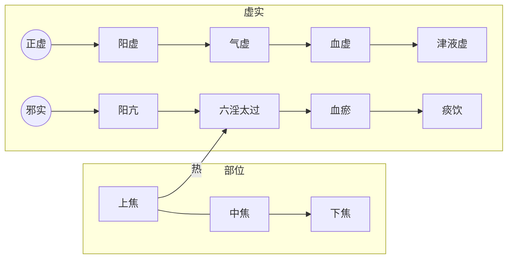

# 气血均衡

## 1、气血均衡原则

人体各个部位的内在环境都由气血建立。人体各部位形体组织获得气血量不应相差太大。气血由脏腑产生，通过气脉、血脉流转全身。全身气血以各处均衡为平衡点，可有正常的差异与波动。

因脉是气血的表现，所以通过脉可以了解气血状态。以下我们谈脉的时候，大家应该知道谈的就是气血的状态。

### 气血均衡的平衡点

若全身气血均衡，在脉象表现为寸关尺三部脉象接近一致，其波动均匀、柔和、有力，不快不慢，不大不小，不滑不涩，不弦不动。此为阴阳和平之脉。

> 问曰：脉病欲知愈未愈者，何以别之？答曰：**寸口、关上、尺中三处、大小、浮沉，迟数同等，虽有寒热不解者，此脉阴阳为和平**，虽剧当愈。

> **阳脉浮大而濡，阴脉浮大而濡，阴脉与阳脉同等者，名曰缓也。**
>
> 〔**讲解**〕本条辨阴阳和平之脉法。 “缓”，指脉来和缓舒徐，不数不迟，不结不促而无阴阳偏颇之象。
>
> 《伤寒论讲解-辨脉法-单元1》

> 九候之相应也，**上下若一，不得相失**。一候后则病，二候后则病甚，三候后则病危。所谓后者，应不俱也。
>
> 《素问-三部九候论》

### 平衡范围内的波动与差异

全身气血的分布首先按照内外划分，其次按照上下划分。气血的内外分布通过脉的沉浮来辨别。上下分布通过寸脉和尺脉来辨别。寸脉代表上焦的心肺，在伤寒中称为阳脉；关尺脉代表中下焦的肝脾肾，为阴脉。

上下内外的气血可以在平衡范围内有正常的差异，随时间变化有正常的波动。空间差异上，在任何时间点，脉象表现为阳脉偏浮一点，阴脉偏沉一点，为正常。时间波动上，在任意空间点，都可以有昼夜、四季的变化，也为正常。这些内容在《入门》中已经提及。

寸口脉代表肺气，因百脉朝会于肺，所以可以诊全身气血。因先后天之本脾肾非常重要，所以在伤寒论中，还要用趺阳脉诊脾胃，少阴脉诊肾气。

### 失衡的情况

#### 整体失衡

此时即便有偏大，偏小，偏数，偏迟等等情况，也是整体有偏，而非某处偏大，某处偏小。整体一致说明气血的流转没有阻碍，即便整体有偏，也还算是一个好事。如果明确发现不同部位的脉象有较大差异，则说明气血的升降出入出了问题。伤寒中，如果只说脉浮、脉弦等等，一般是指脉的整体。如果不同部位的脉象有明显区别，则会明确之处，比如说阳脉浮、阴脉涩等等。

> 寸口脉浮大，而医反下之，此为大逆(1)。浮则无血，大则为寒，寒气相搏，则为肠鸣。医乃不知而反饮冷水，令汗大出，水得寒气，冷必相搏，其人则䭇(2)。

> 问曰：脉有三部，阴阳相乘，荣卫血气，在人体躬，呼吸出入，上下于中，因息遊布(1)，津液流通。随时动作，效象形容(2)，春弦秋浮，冬沉夏洪，察色观脉，大小不同，一时之间，变无经常，尺寸参差(3)，或短或长，上下乖错，或存或亡，病辄改易，进昂退低(4)，心迷意惑，动失纪纲，(5)愿为具陈，令得分明。师曰：子之所问，道之根源，脉有三部，尺寸及关，荣卫流行，不失衡铨(6)，肾沉心洪，肺浮肝弦，此自经常，不失铢分，出入升降，漏刻(7)周旋，水下百刻，一周循环，当复寸口，虚实见焉。变化相乘，阴阳相干，风则浮虚，寒则牢坚，沉潜水滀，支饮急弦，动则为痛，数则热烦，设有不应，知变所缘，三部不同，病各异端，大过可怪，不及亦然，邪不空见，终必有奸，审察表里，三焦别焉，知其所舍，消息诊看，料度腑脏，独见若神，为子条记，传与贤人。

> 寸口诸微亡阳，诸濡亡血，诸弱发热，诸紧为寒。诸乘寒者，则为厥，郁冒不仁(1)，以胃无谷气，脾涩不通，口急不能言，战而慄也。

#### 差异失衡

##### 上下气血

###### 阴脉阳脉不均衡

当上下部压力不平衡的时候，上部压力小，则下部气上冲。

> 问曰：病有洒淅恶寒，而复发热者何？答曰：阴脉不足，阳往从之，阳脉不足，阴往乘之。
>
> 曰：何谓阳不足？答曰：假令寸口脉微，名曰阳不足，阴气上入阳中，则洒淅恶寒也。
>
> 曰：何谓阴不足？答曰：尺脉弱，名曰阴不足，阳气下陷入阴中，则发热也。

这里的阴脉指的是中下部的肝肾，阳脉指的是上部的心肺。

上部的阳气不足，则人有心悸，胸部喜按的症状。用桂枝甘草汤。由此可知桂枝补上部之阳气。

> **发汗过多，其人叉手自冒心，心下悸，欲得按⑴者，桂枝甘草汤⑵主之。[64]**

上部阳气不足，则下部阴气上冲，或者欲上冲。以桂枝甘草汤为基础加减。

> 发汗后，其人**脐下悸者，欲作奔豚**⑴，茯苓桂枝甘草大枣汤⑵主之。[65]

> 伤寒，若吐若下后，心下逆满，**气上冲胸**，起则头眩，脉沉紧⑴，发汗则动经，身为振振摇⑵者，茯苓桂枝白术甘草汤⑶主之。[67]

内外压力不平衡的时候，内部压力小，则外部气血内陷。如果外部有邪气，则随气血内入。肌表正邪相争发热的时候，如果用下法，使内部的正气减弱，则邪热随气血内陷。可

> 若不宜下而便攻之，**内虚热入**，协热遂利，烦躁诸变，不可胜数，轻者困笃，重者必死矣⑸。

###### 阴脉弱代表血虚

中下部的肝肾不足，则代表的血虚，进而造成抽筋的外部表现。

> 阳脉浮，一作微。**阴脉弱者，则血虚，血虚则筋急也。**其**脉沉者，荣气(1)微**也；其脉浮，而汗出如流珠者，卫气(2)衰也。荣气微者，加烧针(3)则血留不行，更发热而躁烦也。

> 脉浮数者，法当汗出而愈⑴。若下之、身重、心悸者，不可发汗，当自汗出乃解⑵。所以然者，**尺中脉微，此里虚。**须表里实，津液自和，便自汗出愈⑶。[49]

> **阴脉迟涩，故知亡血也。**

> 脉浮紧者，法当身疼痛，宜以汗解之。假令**尺中迟者，不可发汗**。何以知然？以**荣气不足，血少故**也。[50]...

此时，可用甘草芍药汤治疗，可见甘草芍药汤是补中下部的阴气。

> 伤寒，脉浮，自汗出，小便数，心烦，微恶寒，**脚挛急**，反与桂枝欲攻其表，此误也⑴。得之便厥，咽中干，烦躁、吐逆者，作甘草干姜汤与之，以复其阳⑵。若厥愈足温者，更作**芍药甘草汤与之，其脚即伸**⑶。若胃气不和，谵语者，少与调胃承气汤⑷。若重发汗，复加烧针者，四逆汤主之⑸。[29]

> 少阴脉不至，**肾气微，少精血**，奔气促迫，上入胸膈，宗气反聚，血结心下，**阳气退下，热归阴股**，与阴相动，令身不仁，此为尸厥(1)，当刺期门(2)巨阙(3)

###### 下焦阳虚、虚

> **太阳病，发汗，汗出不解，其人仍发热，心下悸，头眩，身𥆧动，振振欲擗**一作僻**地⑴者，真武汤⑵主之。[82]**

##### 里外气血

> 师曰：呼吸者，脉之头也。初持脉，来⑴疾去(2)迟，此出疾入迟，名曰内虚外实也。初持脉，来迟去疾，此出(3)迟入(4)疾，名曰内实外虚也。

###### 外邪内陷

脉浮紧是表有寒，只谈脉紧，说明寒已入里。入里又分上下

上焦偏气态，所以为清邪。下焦偏液态，所以为浊邪。

上焦中清邪，表现为发热头痛，项强颈挛，腰痛胫酸。

下焦中浊邪，表现为足膝逆冷，便溺妄出

> 寸口脉阴阳俱紧者，法当清邪(1)中于上焦，浊邪(2)中于下焦。清邪中上，名曰洁也；浊邪中下，名曰浑也。
>
> 阴中于邪，必内慄(3)也。表气微虚，里气不守，故使邪中于阴也。
>
> 阳中于邪，必发热头痛，项强颈挛，腰痛胫酸，所为阳中雾露之气。
>
> 故曰清邪中上，浊邪中下。
>
> 阴气为慄，足膝逆冷，便溺妄出。
>
> 表气微虚，里气微急，三焦相溷(4)，内外不通。
>
> 上焦怫音佛，下同郁，脏气相熏，口烂食龂(5)也。
>
> 中焦不治，胃气上冲，脾气不转，胃中为浊，荣卫不通，血凝不流。若胃气前通者，小便赤黄，与热相搏，因热作使，游于经络，出入脏府，热气所过，则为痈脓。若阴气前通者，阳气厥微，阴无所使，客气内入，嚏而出之，声嗢(6)乙骨切咽塞。寒厥相追，为热所拥，血凝自下，状如豚肝。阴阳俱厥，脾气孤弱，五液注下。
>
> 下焦不盍，清便下重(7)，令便数难，齐筑湫痛(8)，命将难全。

> 脉阴阳俱紧者，口中气出，唇干口燥，踡卧(1)足冷，鼻中涕出，舌上胎滑(2)，勿妄治也。
>
> 到七日以来，其人微发热，手足温者，此为欲解；
>
> 或到八日以上，反大发热者，此为难治。
>
> 设使恶寒者，必欲呕也；腹内痛者，必欲利也。

> 脉阴阳俱紧，至于吐利，其脉独不解；紧去入安，此为欲解。
>
> 若脉迟至六七日不欲食，此为晚发(1)，水故也，为未解；食自可者为欲解。
>
> 病六七日，手足三部脉(2)皆至，大烦而口噤(3)不能言，其人躁扰者，必欲解也。
>
> 若脉和，其人大烦，目重(4)，脸内际黄者，此欲解也(5)。

> **问曰：病有结胸，有脏结，其状何如？答曰：按之痛，寸脉浮。关脉沉，名曰结胸也。[128]**

前有有热恶寒，发于阳。无热恶寒，发于阴。

> 病发于阳，而反下之，热入因作结胸⑴，
>
> **病发于阴，而反下之。**因作痞也⑵。**
>
> **所以成结胸者，以下之太早故也⑶。结胸者，项亦强，如柔痓状⑷，下之则和，宜大陷胸丸⑸。[131]**

###### 三焦之虚

> **寸口脉微涩，微者卫气不行，涩者荣气不逮(1)，荣卫不能相将(2)，三焦无所仰(3)，身体痹不仁(4)。荣气不足，则烦疼口难言；卫气虚者，则恶寒数欠。**
>
> **三焦不归其部，上焦不归者，噫而酢吞(5)；中焦不归者，不能消谷引食；下焦不归者，则遗溲。**

##### 其它差异失衡

###### 关格脉是不均衡的一种

> **寸口脉浮而大，浮为虚，大为实，在尺为关，在寸为格，关则不得小便，格则吐逆。**

> **趺阳脉伏而涩，伏则吐逆，水谷不化，涩则食不得入，名曰关格。**

###### 动脉独见：

> **阴阳相搏，名曰动。阳动(1)则汗出，阴动(2)则发热。形冷恶寒者，此三焦伤也。若数脉见于关上，上下无头尾，如豆大，厥厥动摇(3)者，名曰动也。**...
>
> 动脉是阴阳之气相互搏击而产生的脉象。
>
> 动脉见于寸部者，为阳动而搏阴，阴被阳扰，不得内守，则见汗出；
>
> 动脉见于尺部者，为阴动而搏阳，阳气被阴邪所郁，则见发热。
>
> 若阳动而无汗，阴动而无热，仅见身冷恶寒者，则是三焦阳气被伤，不能外出温煦肌肤所致。
>
> 动脉既数且滑，但数脉、滑脉三部皆见，动脉则是滑数之象仅见于一部。如见于关上，则上无头、下无尾，仅是关部滑数，厥厥动摇如豆大，有根不移。寸、尺二部所见动脉以此类推。

###### 极度不均衡

> 师曰：寸脉下不至关，为阳绝(1)，尺脉上不至关，为阴绝，此皆不治，决(2)死也。若计其余命生死之期，期以月节克之(3)也。

## 2、脏腑不虚原则

概念入门中，在病证轻重传变章节，谈到中医治病的核心原则就是：对五脏疾病存在严重正虚邪实的情况，以扶正祛邪的方法，恢复正气，减少邪气，使其向腑病转化，由吐或下的方式排出；或由里病向表病转化，以汗的形式排出。部位由里到外，程度由重向轻，即是常说的“阴证转阳证”，直至治愈。

这个原则的意思是五脏对人体最重要，当对外感病进行治疗的时候，要注意五脏病和肌表病的关系，时刻保证五脏不虚为原则。

这个原则在伤寒论中主要指两个方面：

一是五脏无病而有外感之人，其治法应遵循规矩，不要因为治法的错误伤了五脏。

二是脏腑有病之人得了外感病。如果脏腑之病为五脏正虚证，应优先治疗。如果五脏不虚，有脏腑邪实证和表证，则哪里紧急治哪里，但通常先解表后泄下。这是因为祛邪会伤正，如果里实不急的话，先祛里邪容易伤里部正气，进而导致表部邪气传入里部，产生更严重的变证。

如91条的太阳证加里阳虚证，应该先治疗里虚在治疗太阳

> 伤寒，医下之，续得下利，**清谷不止**，身疼痛者，急当救里，后身疼痛，清便自调者，急当救表。救里宜四逆汤，救表宜桂枝汤。[91]

> **本发汗，而复下之，此为逆也。若先发汗，治不为逆⑴。本先下之，而反汗之，为逆。若先下之，治不为逆⑵。[90]**
>
> 表证兼里实，当先表后里，先汗后下，这是一般原则。后人归纳这一原则为“实人伤寒发其汗”。
>
> 但在表证轻而里实证重且急的特殊情况下，则当急者先治，先里后表，先下后汗。治法适宜，汗下有序，则邪去病愈；先后误施，汗下失序，则会导致变证丛生。
>
> 后世逐渐发展起来的一些解表攻里，表里双解的方法，在一定程度上对《伤寒论》有关这方面的治则作了补充，临证亦可酌情施用。
>
> 《伤寒论讲解-90条》

如98、99、100条的少阳加里虚证，需要先治疗里虚然后再治疗少阳。

> 得病六七日，脉迟浮弱，恶风寒，手足温⑴。医二三下之，**不能食**而胁下满痛，面目及身黄，颈项强，小便难者，与柴胡汤，后必下重⑵。本渴**饮水而呕者**，柴胡汤不中与也，食谷者哕⑶。[98]
>
> **伤寒四五日，身热，恶风，颈项强，**胁下满**，手足温而渴者，小柴胡汤主之。[99]**
>
> 伤寒，阳脉涩，阴脉弦，法当腹中急痛⑴。先与小建中汤，不差者，小柴胡汤主之⑵。[100]

心下痞证，同时有表证。先解表，再攻痞。

> **伤寒大下后，复发汗，心下痞，恶寒者，表未解也。不可攻痞，当先解表，表解乃可攻痞。解表宜桂枝汤，攻痞宜大黄黄连泻心汤。[164]**

少阳兼里实

大柴胡汤：

> **太阳病，过经⑴十余日，反二三下之，后四五日，柴胡证仍在者，先与小柴胡。呕不止，心下急，**一云呕止小安。**郁郁微烦⑵者，为未解也，与大柴胡汤下之则愈⑶。[103]**

