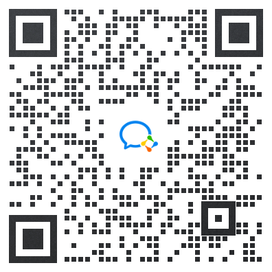

# 后记

我从2008年开始学习中医，花费10年时间学习各种中医书籍，期间一直似懂非懂，直到学习光明中医教材。学习教材期间虽然也有很多疑问，但是能明显感觉到教材编者们在努力培养学生的辨证论治思维。

2020年上半年，我系统学完了光明教材的四大经典。之后，恰逢母亲犯头晕病，一侧视力模糊。经医院CT检查，诊断为脑梗压迫视神经。我在为母诊断、治疗的过程中，反复查阅光明中医教材，最后用醒脑开窍、扶阳化湿的思路治好了母亲的疾病，视力基本恢复。在这个过程中，我比较透彻的理解了中医寒热虚实的道理，悟出了光明前辈的本意。

回首自己的学习过程，一方面感慨中医学习之艰难，另一方面也觉得中医理论的传统讲解方式过于晦涩难懂，耗费了中医学习者太多时间。学习中医，要过很多关卡，有基本原理关、诊断关、识药用药关等等。要说哪一关最难，还是基本原理关，也就是入门最难。此关不过，学的知识越多，可能迷惑越多，越觉得中医杂乱无章。此关一过，思路清晰，诊治只是经验的积累而已，虽也艰辛，但有路可循。很多中医，一生行医浑浑噩噩，至死也未能真正入门。

为了让后来的中医学习者能够比较顺畅入门中医，少走弯路，我写下了这本中医基础概念入门书。本书的定位是教材的补充，所以不求大而全，而是要把中医基本逻辑，以及原理中比较难懂的部分讲解清楚，方便大家学习教材，对于教材中已经讲解很完善的部分则没有必要重新再写一遍。

本书的写作标准是所有人都能看懂。如果以后有一天，我的孩子也想学中医，我希望他们也可以通过这本书入门中医。为了达到这个标准，本书对于各种观点的表达力求浅显易懂，对于可能产生误解的地方，哪怕稍显啰嗦，也要多说几句。

本书没有过多的讲诊断与治疗，因这方面的内容太多，如果全讲，篇幅过大。教材这方面讲的很好，内容也很丰富。诊断与治疗是中医原理的延伸，大家只要理解了概念和原理，认真学习教材就可以学的很好了。

俗语说“师傅领进门，修行在个人”。对于中医的学习而言，入门之后，还要不断的学习、实践。付出多少努力，就有多少收获，这方面其它人只能起到一点辅助作用，主要还要看自己。

中医学博大精深，各种书籍资料汗牛充栋，内容良莠不齐。中医各门各派多为盲人摸象，互有偏见，更有甚者喜欢逞自己的长处，贬低其它学派，以此来获取名声。新手不具备辨别能力，如果盲目选择老师，就容易学偏，所以还是依据光明中医教材比较稳妥，毕竟教材所引内容是老前辈们集体筛选过的，可以保证权威性。

光明中医教材的内容是老一代中医毕生经验的无私总结，除了本书引用的部分内容外，具体病种方面，《内》、《外》、《妇》、《儿》、《骨》、《眼》、《喉》对各病种的辨证经验非常有价值。用药方面，《本草》、《方剂》、《伤寒》、《金匮》、《温病》都需熟读。  

我本人还在不断的学习与实践中，以后会继续与光明中医的学员们一同研究、体悟前辈们的思想，争取把更多深奥难懂的中医理论用浅显的语言表达出来，让更多的人能够比较容易的学会中医。

如果读者对于本书有意见、建议或者想报名成为光明中医的学员，可以扫描下面的微信二维码加入读者群。

李文强

2022年12月29日 

