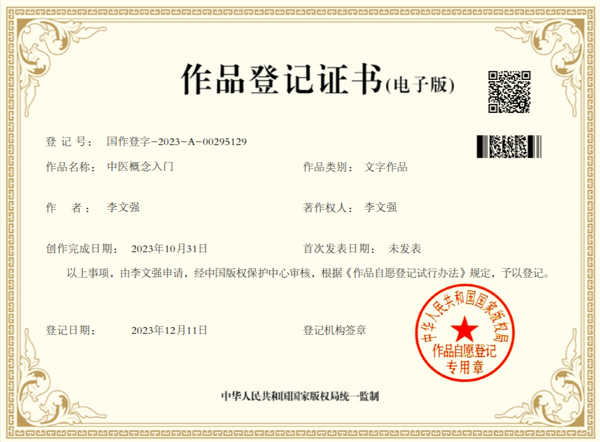

# 后记

## 1、写作说明

我从2008年开始学习中医，至今已有15年。期间学习各种中医书籍，一直似懂非懂，直到学习光明中医教材。学习教材期间虽然也有很多疑问，但是能明显感觉到教材编者们在努力培养学生的辨证论治思维。

在系统学完了光明教材的四大经典之后，恰逢母亲犯头晕病，一侧视力模糊。经医院CT检查，诊断为脑梗压迫视神经。我在为母诊断、治疗的过程中，反复查阅光明中医教材，最后用醒脑开窍、扶阳化湿的思路治好了母亲的疾病，视力基本恢复。在这个过程中，我比较透彻的理解了中医寒热虚实的道理，悟出了光明前辈的本意。

回首自己的学习过程，一方面感慨中医学习之艰难，另一方面也觉得中医理论的传统讲解方式过于晦涩难懂，耗费了中医学习者太多时间。学习中医，要过很多关卡，有基本原理关、诊断关、识药用药关等等。要说哪一关最难，还是基本原理关。任何人如不透彻理解中医原理，都很难对中医产生真正的信任。原理关一过，思路清晰，诊治只是经验的积累而已，虽也艰难，但有路可循。很多中医，一生行医浑浑噩噩，至死也未能真正通过原理关。

庄子说，“以道驭术，术必成，离道之术，术必衰”。中医原理就是道，中医诊治之法就是术。中医之衰落就是因为原理讲的不清楚，诊治方法却复杂而多变，导致疗效不稳定，也就变成了“离道之术”。写这本中医基础概念入门书，就是为了让后来的中医学习者能够打好医道的基础，少走弯路。

本书的定位是教材的补充，所以不求大而全，而是要把中医基本逻辑，以及原理中比较难懂的部分讲解清楚，方便大家学习教材，对于教材中已经讲解很完善的部分则没有必要重新再写一遍。所以本书没有过多的讲诊断与治疗，因这方面的内容太多，如果全讲，篇幅过大。教材这方面讲的很好，内容丰富，而且都是经验丰富老中医的实战经验，后人很难超越。诊断与治疗是中医原理的延伸，大家只要理解了概念和原理，认真学习教材就可以学的很好了。

本书的写作标准是所有人都能看懂。如果以后有一天，我的孩子也想学中医，我希望他们也能通过这本书轻松的入门中医。为了达到这个标准，本书对于各种观点的表达力求浅显易懂，对于可能产生误解的地方，哪怕稍显啰嗦，也要多说几句。

俗语说“师傅领进门，修行在个人”。对于中医的学习而言，入门之后，还要不断的学习、实践。付出多少努力，就有多少收获，这方面其它人只能起到一点辅助作用，主要还要看自己。

因中医基础理论晦涩难懂，让人难以清晰理解阴阳平衡的道理，所以学习中医之人非常容易走偏。有人胆大，敢用猛药，可能治好一些重症沉疴，也容易造成事故。有人胆小，谨小慎微，该用重剂而不敢用，错失良机。有人偏阳，有人偏阴，有人偏脾胃，有人偏肝肾，造成中医流派纷呈。著名流派有伤寒派、温病派、火神派、寒凉派、脾胃派、滋阴派、温补派和柴胡派等等。学完本书，就应该明白，这些流派都是侧重于人体平衡的某个方面。门派创始人多为大家，可能为了纠正当时风气之偏或补前人之不足，而强调某一方面。后学者不懂，执着于门派之争，就变成盲人摸象。更有甚者喜欢逞自己的长处，贬低其它学派，以此来获取名声。这种人遇到适合自己门派的疾病，确实效果不错，遇到不适合的疾病，无论是治人还是治己，直到治死可能都不明白死因。

中医学博大精深，各种书籍资料汗牛充栋，内容良莠不齐。有人为了吸引眼球，语不惊人死不休。新手不具备辨别能力，如果盲目选择，就容易学偏。所以还是依据光明中医教材比较稳妥，毕竟教材所引内容是老前辈们集体筛选过的，比较中正平和，可以保证权威性。光明中医教材的内容是老一代中医毕生经验的无私总结，除了本书引用的部分内容外，具体病种方面，《内》、《外》、《妇》、《儿》、《骨》、《眼》、《喉》对各病种的辨证经验非常有价值。用药方面，《本草》、《方剂》、《伤寒》、《金匮》、《温病》都需熟读。  

本书的内容到此为止！至于更高级的诊治部分，我会与光明中医的学员们一同研究，把深奥难懂的教材内容用浅显的语言表达出来。如果内容达到一定的量，以后可以再汇集为一本新书。

后继相关信息将发布于下面这个链接：[https://gmzyjx.com/qa/question/7012/](https://gmzyjx.com/qa/question/7012/) 。 

李文强

2023年1月1日 

## 2：关于版权

经常有读者关心本书的版权问题，并询问能否将本书的内容转发到个人网站等等。这里统一回复一下：

本书定位为公益书籍，所以大家可以自由转发，不必担心版权问题。

但请注意以下几点：

1、转发不要断章取义。本书内容前后逻辑贯通，如需转发最好转发全部内容。如果只截取一部分，容易让人误解。如果条件所限只能转发部分内容，请一定注明书名、作者，以便读者能够查找来源。

2、不要将本书用于商业目的。本书内容免费向大众开放，所以不要用本书获取商业利益。如有商业方面的计划，请联系作者本人。

3、关于出版。本书已在国家版权局登记版权，但并未出版纸质书。原因是我不太有兴趣应付出版相关的琐碎事务，如果读者中有熟悉流程的朋友愿意协助出版，我亦欢迎。

