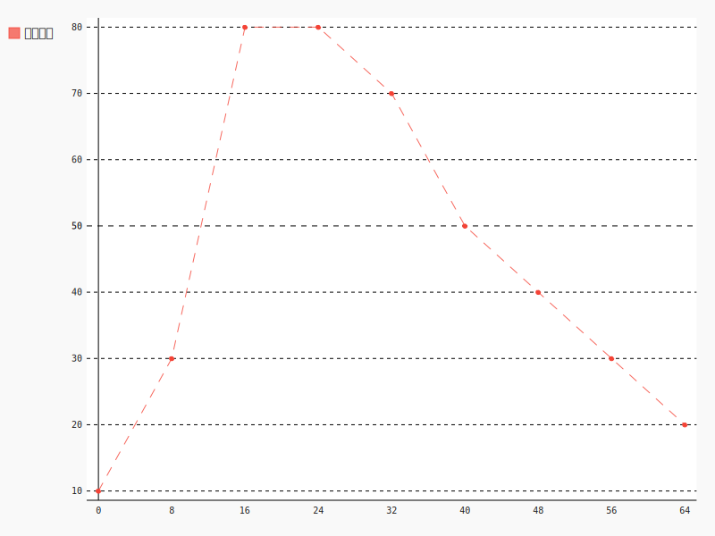
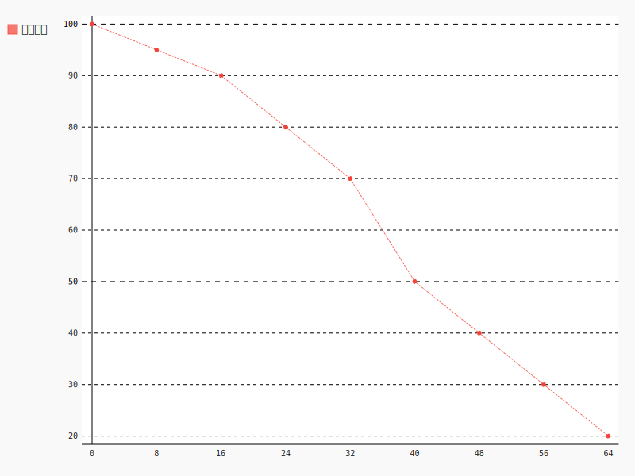

## 3.5、精

### 1、位置

精分布于全身，在形体及脏腑都有。在形体有骨之精、筋之精、血之精、肌肉之精；在脏腑则有肝精、心精、肺精、脾精、肾精。

> 《灵枢·大惑论》说：“五脏六腑之精气，皆上注于目而为之精。精之窠为眼，骨之精为瞳子，筋之精为黑眼，血之精为络，其窠气之精为白眼，肌肉之精为约束”。此说明五脏之精气上达于目，其中，瞳子为肾精所注，黑眼为肝精所注，眼络为心精所注，白眼为肺精所注，眼睑为脾经所注。故眼部的变化亦可反映出五脏的盛衰。
>
> 《中医药学概论-肝胆》

五脏是藏精的主要部位。五脏精气充满，则人健康水平高。反之，若五脏精气不足，则健康水平下降。

> 《素问•五藏别论》说：“所谓五脏者，藏精气而不泻也，故满而不能实……这段话是说：五脏的主要功能是藏精气。
>
> 《中医药学概论-五脏六腑》

> 东方青色，...藏精于肝。...南方赤色，入通于心...。中央黄色，...藏精于脾。...西方白色，入通于肺，开窍于鼻，藏精于肺。...北方黑色，入通于肾，...藏精于肾...。
>
> 《素问-金匮真言论篇》

> **是故五脏主藏精者也**，不可伤，伤则失守而阴虚；阴虚则无气，无气则死矣。
>
> 《黄帝内经-灵枢-本神》

其中肾比较特殊，是精的大仓库。其它脏腑精不足需要肾精补充，精足可以传输到肾藏起来。所以讨论精的时候多指肾精，但也要知道其它脏腑、形体皆有精的存在。

> 肾者，主水，**受五脏六腑之精而藏之**，故五脏盛，乃能泻。 
>
> 《素问-上古天真论》

### 2、分类

精分为先天之精和后天之精。通常情况下，我们说精的时候，指的是两者皆包括。如需特殊说明，需要明确指出是先天之精还是后天之精。

> 肾所贮藏的生殖之精，来源于父母，亦称先天之精，《灵枢•本神》说：“故生之来谓之精。”即指此而言。
>
> 肾所藏的水谷之精，来自五脏六腑，亦称后天之精，《素问•上古天真论》说：“肾者，主水，受五脏六腑之精而藏之，故五脏盛，乃能泻。”此即水谷之精。
>
> 但先天之精需要后天之精的不断充养，后天之精也需先天之精的不断促进，两者有着不可分割的关系。
>
> 《黄帝内经讲解-藏象学说-五脏功能与形体组织、四时阴阳的关系》

#### 2.1、后天之精

饮食经过脾胃提炼得到的精称为后天之精。

腑的作用类似炼油厂，主要是对食物（原油）进行消化提炼，吸收其中的水分、营养物质，形成供给人体的津液、营养（化工原料）、精（成品油），剩余的残渣（沥青）成为粪便排出体外。

成品油加入汽车能够直接转化为能量，精在人体里也可以直接转化为能量。

> 王三尊《医权初编》说：“凡饮食先入于胃，俟脾胃运化，其精微上输于肺，肺气传布各所当入之脏，浊气下入大小肠，是**脾胃为分金炉**也。若脾胃有病，或虚或实，一切饮食药饵，皆不运化，安望精微输肺而布各脏耶？是知治病当以脾胃为先。若脾胃他脏兼而有病，舍脾胃而治他脏，无益也。又一切虚症，不问在气在血，在何脏腑，而只专补脾胃，脾胃一强，则饮食自倍，精血日旺，阳生而阴亦长矣。”
>
> 《黄帝内经讲解-五脏六腑皆禀气于胃》

##### 2.1.1、来源

后天之精来源于脾胃运化的水谷之精微，脾胃对食物进行消化吸收后而获得，胃主消化，脾主吸收。

##### 2.1.2、使用

脾将精传输到五脏六腑，化为脏腑之精，维持各脏腑功能活动，多余的收藏于肾

##### 2.1.3、判断标准

脾胃吸收后天之精的能力可以通过饮食是否正常、大便是否正常等现象来判断。

##### 2.1.4、不同年龄的变化

16岁以前是因为形体不足，不能吸收大量的食物精微。

32岁以后是因为消化吸收能力下降而不能吸收大量食物精微。

#### 2.2、先天之精

##### 2.2.1、来源

先天之精为与生俱来，父母给予。

##### 2.2.2、作用

先天之精可帮助后天之精的产生。

先天之精与后天之精共同形成肾精(肾精作用见下面)，是人体正常寿命的主要标志。

##### 2.2.3、不同年龄的变化

普通人先天之精只能消耗，极难补充。

#### 2.3、肾精

##### 2.3.1、来源

先天之精加后天之精

##### 2.3.2、功能

1、产生元气

肾精可转化为元气，供给各个脏腑以及全身使用。肾精不足，转化的元气不够，也可以导致脏腑、全身的阳气不足。

2、濡养各个脏腑

肾精可转化为阴液与阴血，濡养其它脏腑。肾精不足，则可能导致各个脏腑、全身的阴不足。

3、生殖

肾精足则男子溢精、女子来潮。不足则男女不能生子。

> 由于**肾中精气的盛衰，直接影响到人体的生殖机能**，所以当肾藏精的生理功能发生病变时，常会导致生殖机能的种种病变，...
>
> **肾精对各个脏腑组织所起的滋养、濡润作用称为肾阴**，将**对各个脏腑起到的温煦、促进作用称为肾阳**。并将其称为元阴与元阳，真阴与真阳。肾中阴阳是人体各脏腑阴阳的根本，**肾阴乃一身阴液之源**，**肾阳乃一身阳气之根**，二者同居肾中，故有“肾为水火之宅”的说法。...。
>
> 《中医药学概论-藏象-肾、膀胱》

4、人体的生长发育

精主导人的生长发育，包括长身体、长头发、长牙齿。精不足则小儿发育迟缓，青少年青春期发育不良。老年人肾精减少，头发枯，牙齿落，形体衰。

> **两神相搏，合而成形，常先身生，是谓精**……
>
> 对新形体而言，精是在形体尚未形成之前就已存在的物质，是繁衍后代，构成形体的基本物质。……
>
> **精者，血之精微所成，生气之所依也**。生气者，卫气之根，即命门真火是也，精竭，则生气绝矣。
>
> 《黄帝内经讲解-气血精神-精、气、津、液、血、脉的生成和功用》

5、肾精滋生骨髓，充养骨骼，所以骨髓的生长、发育、修复都与肾有密切关系。脑为髓海，髓海有余，则肢体活动敏捷有力、耳目聪明、头脑清醒，智力好。

> 由于肾精滋生骨髓，充养骨骼，所以骨髓的生长、发育、修复都与肾有密切关系。例如有因先天禀赋不足，肾气虚衰，不能充养骨髓，致使小儿生长发育障碍，出现五迟（立迟、行迟、齿迟、发迟、语迟）、鸡胸（胸廓向前突出）、龟背(脊骨弯曲隆起）、解颅（头颅骨缝分裂）等症，皆可从肾虚论治。以地黄丸为主，酌加鹿茸、龟板等药。成人有因肾精亏虚，骨髓不充，出现腰脊酸痛，不能屈伸，下肢痠软，行动乏力，或因努力负重致痛，或跌仆损伤筋骨，日久不愈。凡此等等。均宜以补肾为主。
>
> 《黄帝内经讲解-藏象学说-五脏功能与形体组织、四时阴阳的关系》
>

##### 2.3.3、不同年龄的变化

通常情况下，人随年龄增长肾精的存量是有规律的，以男子为例：

丈夫八岁，肾气实，髮长齿更，

二八，肾气盛，天癸至，精气溢泻，阴阳和，故能有子；

三八，肾气平均，筋骨劲强，故真牙生而长极；

四八，筋骨隆盛，肌肉满壮；

五八，肾气衰，髮堕齿槁；

六八，阳气衰竭于上，面焦，髮鬓颁白；

七八，肝气衰，筋不能动，天癸竭，精少，肾脏衰，形体皆极；

八八、则齿髮去。

这是普通人的规律，如果人善于保养或者过度消耗，则时间有延后或者提前。

因肾精为五脏之精的代表，肾精的多少也即代表了五脏藏精的多少。所以这种肾精随年龄变化的规律其实也就是五脏藏精量的变化规律。

##### 2.3.4、判断多少

通过一些人体现象可以判断精的状态，比如男子溢精、女子月经来潮代表肾精充足；人体的齿、骨、髮的状态也与肾精的状态相应。

内经中还有通过面部形态初步判断人的先后天精气是否旺盛的方法。内容包括：

1、以额角、鼻头、下颌三处高起不平陷为好

2、以面部肌肉高厚，轮廓方正为好

3、以人中沟深而长为好

> 马莳注：“面之三里，即三部也，皆已耸起。”《内经》认为，从面部的特征可以判断人的寿夭。骨为肾所主，肾为先天之本；肉为脾所主，脾为后天之本。如果**人中沟深而长，面部肌肉高厚，轮廓方正，面部上、中、下三部耸起而不平陷**，肌肉丰满，骨骼高起者，则提示**先后天精气皆旺盛**，所以人能长寿，活百岁而终其天年。当然，通过望面部特征，测候先后天精气盛衰的方法，判断寿夭有一定的道理，但是不能将面部特征与寿夭的关系绝对化，应结合全身其他方面情况综合考虑。
>
> 《黄帝内经讲解-藏象学说-寿夭与先后天的关系》

### 3、精的重要性

精之所以为精华是有其深刻道理的，精既可以转换为身体的阴也可以转换为身体的阳。身体阳不足的时候，精可以转化为阳气；阴不足的时候，精可以转化为津液、血液，而五体由又都由血转化而成。由此可见，整个人体，无论阴阳都是由精转化而来的。

精足的话，人就不容易虚，因为无论身体各处的阴虚、阳虚，都可以通过精的转化来补充。如果精不足，则脏腑组织在出现阴、阳不足的情况时，就不能及时补充，从而表现出阴虚或者阳虚的证。严重的话会影响脏腑组织的功能，出现疾病。

> 然上文既云气归精，是气生精也；而此又曰精化气，是精生气也。二者似乎相反，而不知此正**精气互根**之妙也。
>
> 《黄帝内经讲解-味、形、气、精的阴阳互用关系》

> 肾精对各个脏腑组织所起的滋养、濡润作用称为肾阴，将对各个脏腑起到的温煦、促进作用称为肾阳。并将其称为元阴与元阳，真阴与真阳。肾中阴阳是人体各脏腑阴阳的根本，肾阴乃一身阴液之源，肾阳乃一身阳气之根，二者同居肾中，故有“肾为水火之宅”的说法。
>
> 《中医药学概论-肾、膀胱》

精大量藏于肾，所以精充足与否主要看肾精是否充足。若肾精充足，则可以补人一身的元气和阴血，使各个脏腑的阴阳都不虚，人就不容易生病。又因为肾主骨生髓，肾精充足，髓就可以得到足够的充养。骨髓、脑髓充满，人的运动、思维能力都很强，人就年轻不衰老。因此《内经》以肾精的充足与否作为年轻与衰老的标志。

> 肾中所藏之精，为人生命之源，对人体的生长发育与生殖，起着极为重要的作用。
>
> 《素问•上古天真论》说：“女子七岁，**肾气盛**，齿更髮长；二七而天癸至，任脉通，太冲脉盛，月事以时下，故有子；三七，**肾气平均**，故真牙生而长极；四七，筋骨坚，髮长极，身体盛壮；五七，阳明脉衰，面始焦，髮始堕；六七，三阳脉衰于上，面皆焦，髮始白；七七，任脉虚，太冲脉衰少，天癸竭，地道不通，故形坏而无子也。丈夫八岁，**肾气实**，髮长齿更，二八，**肾气盛**，天癸至，精气溢泻，阴阳和，故能有子；三八，**肾气平均**，筋骨劲强，故真牙生而长极；四八，筋骨隆盛，肌肉满壮；五八，**肾气衰**，髮堕齿槁；六八，阳气衰竭于上，面焦，髮鬓颁白；七八，肝气衰，筋不能动，天癸竭，**精少**，肾脏衰，形体皆极；八八、则齿髮去”。
>
> 此段论述，指出了人体的生、长、壮、老、已的自然规律，与**肾中精气的盛衰**密切相关。
>
> 《中医药学概论-肾、膀胱》

如果想保养身体，延缓衰老，需要尽量保持肾精的充足。达到这个目的需从开源和节流两个角度来实现。

开源即是增加肾精的补充来源，在先天之精难以补充的前提下，主要是补充后天之精。后天之精主要来自脾胃对饮食的消化吸收。

节流指的是减少肾精的无谓消耗。首先要节欲以减少生殖之精的消耗；另外不要进行过度的脑力或体力活动以免透支肾精；再有就是顺应自然规律，作息有常、饮食有节、注意寒暑变化等等，因为每一次违背自然规律的行为，都需要消耗肾精进行补偿，会加快肾精的消耗速度。

所以，内经《上古天真论》对真、至、圣、贤的长寿之人会谈到精的问题，真人“呼吸精气”、至人“积精全神”、圣人“精神不散”等等。

### 4、精与髓的关系

髓存在于以下几个位置：骨腔、脊柱、脑，分别称为骨髓、脊髓、脑髓。

髓由精产生，由津液中的液作为补充。

中医认为，精与髓是高度相关的，五脏藏精足，则髓足；五脏藏精不足，则髓空虚。“精髓”一词通常用来描述事物的根本精华，确实人体的根本就在精与髓。

> 五谷之津液，和合而为膏者，内渗入于骨空，补益脑髓，而下流于阴股。
>
> 阴阳不和，则使液溢而下流于阴，髓液皆减而下，下过度则虚，虚，故腰背痛而胫酸。
>
> 《灵枢-五癃津液别》

> 冬时肾水当令，阳气内敛，肾气闭藏，故五脏真气亦**下藏于肾，化精生髓，充养骨骼**。
>
> 《黄帝内经讲解-气血精神-真气的生成和输布》

骨得到骨髓的营养，则骨骼健壮，活动有力。骨髓不足，骨骼脆弱无力。

> 肢体筋脉弛缓，痿弱无力，失于自行活动及行走为主证。
>
> 久病体虚，或房劳过度，损伤肝肾致精血亏虚，精亏不能**滋髓养骨**，血虚不能荣筋养脉而致痿软无力。……肾主身之骨髓。……肾气热则腰脊不举，**骨枯而髓减发为骨痿**。
>
> 《中医内科学-痿证》

脑为髓之海，是大量髓汇聚之地。充足的脑髓为大脑的活动提供了物质能量基础。脑髓不足，则头晕、目眩、耳鸣、腿酸、视力下降、无力、喜卧。

> “脑户，督脉穴，在枕骨上，通于脑中，**脑为髓海**，乃元阳精气之所聚，针入脑则真气泄，故立死”。...
>
> 《灵枢●海论》说：“*髓海*不足，则脑转耳鸣，胫酸眩冒，目无所见，懈怠安卧”。...
>
> 《灵枢●口问》也说：“上气不足，脑为之不满，耳为之苦鸣，头为之苦倾，目为之眩”。...
>
> 脑之为言在也，人精在脑。
>
> 《中医药学概论-奇恒之腑-脑》

> 《灵枢●经脉》云：“人始生，先成精，**精成而脑髓生**，骨为干，脉为营，筋为刚，肉为墙，皮肤坚而毛髮长”
>
> 《中医药学概论-绪论-对生命认识的唯物观》

脊柱是肾精上通于脑的通道，是脊髓所在之处。脊髓的作用中医中没有特别明确说明。中医只谈到髓不足的话，可造成肢体筋脉弛缓，痿弱无力，失于自行活动及行走的能力。这和脊髓相关病变的表现是一致的。

> 髓为肾精所化生，**藏于骨腔及脊柱中，脊髓上通于脑**，为髓汇聚之处，所以《灵枢•海论》称脑为髓之海。如果肾精亏虚，髓海不足，就会出现头旋耳鸣，腿酸眩晕，视物不清，周身懈怠无力、常欲安卧等症。
>
> 《黄帝内经讲解-藏象学说-（二十一）脉、髓、筋、血、气与目、脑、节、心、肺的所属关系》

结合现代医学对神经的研究，我们可以做一些合理的推断：

髓对于神经有滋养作用。中医中对神经没有介绍，但是对于精、髓与运动思维能力的关系有比较详细的介绍。

所以推断，髓与神经的关系就像前面介绍气与血的关系一样，神经固然重要，但是其主导根源在于髓，由髓来滋养。两者如根与叶的关系，所以中医更重视精髓的调理。髓足则神经更健康，人的思维、活动能力更强。其关系如下：

肾精->脑髓、脊髓->{脑神经、脊柱神经}->思维能力、行动能力

牙齿是观察髓的充盈状态的一个指标，因为齿为骨之余，而骨由髓来营养。所以，牙齿洁白坚固代表骨质好、髓充盈。如果牙齿黄黑、松动，在排除牙龈炎、吸烟等问题后，可以代表髓的不足。

肾精的几大作用中，应特别注意生殖功能与生髓功能的关系。如果长期纵欲，过度使用精的生殖功能，就会打破肾精的补充与消耗之间的平衡，造成肾精数量减少，生髓能力下降，导致骨髓、脊髓、脑髓的不足，使人的健康水平快速下降，变得衰老。这就是《素问•上古天真论》中提到的“以欲竭其精，以耗散其真，不知持满……故半百而衰也”的道理。

> 是以圣人陈阴阳，筋脉和同，**骨髓坚固**，气血皆从。如是则内外调和，邪不能害，耳目聪明，气立如故。
>
> 《素问-生气通天论》

### 5、肾精出入图

下图表示了肾精的出入情况，用来做本章的总结。

