# 第五章 人体部位的划分及病证的轻重传变

## 1、部位划分

关于部位的划分，在前面的章节中已经部分提及，但因这个内容比较重要，这里再做一个总结梳理，使大家能有更清晰的印象。

从不同的角度看，人体的部位有很多种分法。就像一个国家的划分可以根据不同的标准，比如按照省来划分，或者按照方位划分，按照边境与内地的标准划分，按照城市等级划分等等。每个部位可以视为一个单元，有自身的要素平衡与失衡。 

人体的部位划分主要有以下几种：

### 1.1、脏腑与形体

这种划分方法是按照资源的产生与使用来划分的。

形体是资源的使用者，从质地上分皮、脉、肉、筋、骨，位置包括头、颈项、胸、腹、背、腰、四肢手足、关节。

脏腑即是气血的产生者又是使用者，包括五脏六腑，五脏为肝、心、脾、肺、肾，六腑为胆、小肠、胃、大肠、膀胱、三焦。

脏腑按照上下方位可以分为三焦：上焦主要包括心肺，中焦主要包括脾胃，下焦包括肾、膀胱、大小肠等。

### 1.2、三阴三阳

按照元气与物质阴阳比例，可划分为三阴三阳区域。比如太阳区域包括足太阳膀胱腑、膀胱经、手太阳小肠腑、小肠经，其它五个区域类同。

依据三阴三阳进行疾病的区分，简称为六经辨证。这种划分方法适用于外感风寒邪气，由经络入侵人体的情况，是《伤寒论》采用的方法，对中医至关重要。后世医家拓展六经辨证，用于治疗一些内伤杂病，效果也很好。

### 1.3、外邪侵入过程划分

从外邪的侵入角度划分，可以分为皮、脉、肉、筋、骨、经、络、脏、腑。

如上图所示，外邪先侵袭皮毛。若皮肤的汗窍腠理打开，则邪气容易入侵，或入络经腑脏，或入肉脉筋骨，依次发展。至于走哪条通路，最终到达哪个部位，主要取决于该部位的正邪力量对比。邪气能通过的部位，必然是该位置的正气不足，所谓“邪之所凑，其气必虚”。而正气充足的部位，邪气必然难以通过，即为“正气存内，邪不可干”。

注意这里的经络也是一种部位，有寒热虚实的失衡。因经络是气的通道，所以变化很快。又因为经络外连皮肉筋骨、内通脏腑，所以涉及范围很广。再因为不同经络互相连接，所以其病证很容易互相传变。

而肉脉筋骨为固态，所以其相互传变并不快。

> 百病之始生也，必先于**皮毛**，邪中之则腠理开，开则入客于**络脉**，留而不去，传入于**经**，留而不去，传入于府，廪于**肠胃**。邪之**始入于皮**也，沂然起毫毛，开腠理；其**入于络**也，则络脉盛色变；其入**客于经**也，则感虚乃陷下；其留于**筋骨**之间，寒多则筋挛骨痛，热多则筋弛骨消，肉烁腘破，毛直而败。
>
> 《素问-皮部论》
>
> 如《医学源流论》说：“故邪之伤人，或在皮肉，或在筋骨，或在脏腑，或在经络，有相传者，有不相传者，有久而终不传者，其大端则中于经络者易传；其初不在经络，或病甚而流于经络者，亦易传；经络之病，深入脏腑，则以生克相传；惟皮肉筋骨之病，不归经络者，则不传，所谓躯壳之病也。故识病之人，当直指其病在**何脏何腑，何筋何骨，何经何络**，或传或不传，其传以何经始，以何经终，其言则历历可验，则医之明者矣。……至治之难易，则在经络者易治；在脏腑者难治，且多死；在皮肉筋骨者易治，亦不易死，其大端如此。至于躯壳之属于某经络，以审其针灸用药之法，则《内经》明言之，深求自得也。”
>
> 《黄帝内经讲解-外邪的传变与病理》

> 如果**邪气中於络**，则络脉不和，营卫不运，肌肤不养，所以麻木不仁；
> **若邪气中於经**，则经脉不利，气血不通，周身不贯，所以肢体重滞不举；
> **若邪气入於腑**，阻遏神识，则昏不识人；
> **若邪气入於脏**，脏气受邪，气机将息，所以出现舌蹇难言，口吐淤涎等证。
> 这就是邪气中络、中经、入腑、入脏所产生的不同证状。
>
> 《金匮要略讲解-中风历节》

### 1.4、表里划分

从人体与外界的关系角度，有表、里的划分方法。表指的是皮肤、肌肉及涉及到皮肤、肌肉的经络。里指的是除了表之外的部位，包括脏腑、筋骨等。

> 表指经络、肌表部位，里指脏腑、筋骨、气血等。
>
> 《中医药学概论-八纲辨证》

之所以把表提出来做一个单独的部位重点提示，是因为表这个部位是人体与外界的边界，外部的邪气通过这里进入体内，体内的邪气也可能通过这里排出到体外。

人生活在自然界中，自然界的气温比人的肌表温度低。肌表时刻都在散发着卫气，护卫身体，防范外界寒气的侵入。如果肌表卫气不足，就会出现异常的怕冷，此时外界寒气就容易入侵肌表，甚至进入更深的内部。这是邪气由外入内。而一些内部脏腑疾病在治愈好转过程中，随着正气的增加，通常会有正气驱逐邪气出表的过程。这是邪气由内出外。

因此表这个部位出现失衡的时候，有哪些表现，如何治疗，学习中医的人应该掌握。表部位失衡包括我们常说的感冒或者一些皮肤病。感冒对于健康人是小病，因其五脏正气足，常能自愈。但是对于有脏腑疾病的人，感冒治疗正确与否，决定了其脏腑疾病的减轻或者加重。内经说“善治者治皮毛”，也有中医说“不会治疗感冒就不会治疗癌症”，即为此意。

表是一个概括词，包含人体表层的皮毛、肉、经、络。

失衡部位在皮毛，可能有发热、恶寒及汗功能异常等症状；

失衡部位在肌肉的话，可能有身痛的症状；

失衡部位在经的话，通常会在经络分布区域中的一些脆弱部位表现出典型症状。以寒邪侵袭经络为例：

邪在太阳经则有头、项、腰、脊僵硬疼痛的症状；

> 太阳经脉行于项背，太阳之气行于体表，邪伤太阳，有**病偏于表**者，中风、伤寒是也，有**病偏于经**者、太阳经输不利证是也。但二者又不可截然分开，表证中可见头项强痛之经输不利，经输不利证中又可见汗出（或无汗）恶风寒等表证。太阳表证，治用汗法解表；经输不利证，重用葛根解经中之邪并配合解表，证与方药丝丝入扣。
>
> 《伤寒论讲解-14条》

在阳明经，有身热、目痛、鼻干、不得卧的症状；

在少阳经，有胸胁痛、耳聋等症状；

在太阴经，有腹满、咽干的症状；

在少阴经，有口燥、舌干而渴的症状。

在厥阴经，有烦闷，囊缩（男子阴囊上缩，女子外阴内缩）等症状。

> 尺寸俱浮者，太阳受病也，当一二日发。以其脉上连风府，故头项痛，腰脊强。
>
> 尺寸俱长者，阳明受病也，当二三日发。以其脉夹鼻络于目，故身热、目疼、鼻干、不得卧。
>
> 尺寸俱弦者，少阳受病也，当三四日发。以其脉循胁络于耳，故胸胁痛而耳聋。此三经皆受病，未入于府者，可汗而已。
>
> 尺寸俱沉细者，太阴受病也，当四五日发。以其脉布胃中络于嗌，故腹满而嗌干。
>
> 尺寸俱沉者，少阴受病也，当五六日发。以其脉贯肾络于肺，系舌本，故口燥，舌干而渴。
>
> 尺寸俱微缓者，厥阴受病也，当六七日发。以其脉循阴器络于肝，故烦满而囊缩。此三经皆受病，已入于府，可下而已。
>
> 《伤寒论-伤寒例》

以上是失衡在表，如果失衡在里，比如筋、骨、髓、血脉、脏、腑，则各有不同的表现。

### 1.5、卫气营血

卫气营血也可以理解为一种部位划分方法，在**温热邪气**侵袭人体的情况下，这种划分方法比较有利于区分病情的轻重。

卫分指的是肺与皮毛。气分指胸膈、肺、胃、大肠、小肠、肝、胆等部位。营分指血中的营气或者心包；血分指的是心、肝、肾等部位。卫气营血的病位定义稍显模糊，主要是根据所影响的功能和舌脉等特征判断。

### 1.6、小结

人体部位的划分非常重要，各个部位都可以视为一个单元。每个单元都有阴阳气血的平衡，以及自我调节平衡的能力。如果出现寒热虚实的失衡，就会影响到该单元的相关功能，进而出现特定的表现。按照哪种方法划分要视情况而定。《概论》辨证章节要学习的各种辨证方法，比如八纲辨证、六经辨证、脏腑辨证、气血津液辨证等等，就是从不同角度进行部位划分后产生的，各有特点，适用于不同的情况。

## 2、病证的轻重传变

在了解了人体部位的划分后，我们可以对病证的变化做更详细的说明。

中医的病证是指人体内环境失衡。这种失衡可以从一个部位传导到另一个部位，称为病证的传变。

> 邪气由此经进入彼经，则谓之传。随着邪气的转移，临床证候也必然相应地发生变化，有传必有变，故称传变，也即传经。
>
> 《伤寒论讲解-绪论》

病证从部位分布角度看，越向外越轻，越向里越重，所以病在皮毛为最轻，在肌肤为次轻，在脉筋稍重，在腑及阳经则更重，在脏及阴经为最重。

> 邪风之至，疾如风雨，故善治者治皮毛，其次治肌肤，其次治筋脉，其次治六府，其次治五藏，治五藏者，半死半生也。
>
> 《素问-阴阳应象大论》

病证的轻重对于某一个具体部位而言，主要观察该部位正邪力量的对比，即正虚与邪实的程度。正虚邪实的程度越轻，病证越轻，反之越重。再有，从正邪失衡的性质看，一般按照气、液、固由轻到重。即失衡在气为轻，到津血痰饮瘀血为重，到固态组织为更重。

以上两者结合，病证最轻的情况是只在皮毛部位有轻微的正虚邪实，其它部位无病。健康人的一些小感冒即为此种情况，大多数情况下能自愈。最重的情况是五脏部位有严重的正虚邪实，往往预后不良。

病证的轻重转化规律就是：部位上由外入里，程度上正气减少、邪气增加为病证加重；反之部位上由里向外，程度上正气增加、邪气减少为病证减轻。

> 时气不和，便当早言，**寻其邪由，及在腠理**，以时治之，罕有不愈者。患人忍之，数日乃说，**邪气入脏，则难可制**。
>
> 《伤寒论讲解-伤寒例》 

病证能够向某部位转化，必然是因为该部位的正气不足，否则不会受邪，即使受邪也会迅速排出。以后我们学习伤寒金匮的时候，无论是伤寒外感六经的传变还是内伤脏腑五行的传变，都是符合此原则的。比如金匮中说“**见肝之病，知肝传脾，当先实脾，四季脾旺不受邪，即勿补之**”，说明虽然肝实之病倾向于向脾传变，但若脾的正气足，是可以抵御这个过程的。伤寒论中说太阳病可以依次传阳明、少阳、太阴、少阴、厥阴，也经常有不依此次序的情况，即是因为不同人正气程度不同所致。

> 传与不传与邪气的盛衰，正气的强弱，治疗与护理之是否得当有关，尤以正气的抗邪能力大小为关键。若正气虚衰，邪气则可由表传里，由浅入深，使病证渐趋沉重；若正气恢复，抗邪有力,邪气又可由里达表，由阴出阳，使病向愈。
>
> 《伤寒论讲解-绪论》

> 伤寒三日，三阳为尽，三阴当受邪。其人反能食而不呕，此为三阴不受邪也。
>
> 太阴病应见腹满而吐，食不下等证，今则反能食而不呕，表明脾胃之气调和而无病。太阴气旺，能为三阴之屏障，则少阴、厥阴也不会受邪，故曰"三阴不受邪”，可见仲景辨传与不传，并不以日数计，而仅依脉证断。
>
> 《伤寒论讲解-270条》

中医治病的核心原则就是：对五脏疾病存在严重正虚邪实的情况，以扶正祛邪的方法，恢复正气，减少邪气，使其向腑病转化，由吐或下的方式排出邪气；或由里病向表病转化，以汗的形式排出邪气。病位由里到外，程度由重向轻，即是“阴证转阳证”，直至治愈。

> 凡由阴证转化为阳证，或由阳证转化为阴证的，即是疾病性质的根本转变。这种转变，常常取决于邪正双方力量的对比。凡正气充足的，大多由阴转阳，疾病向**轻浅**转化，正气虚衰的，大多由阳转阴，疾病向**重深**发展。例如：《伤寒论》太阳篇：“病发热头痛，脉反沉，若不差，身体疼痛，当救其里，宜四逆汤。”(92条)《伤寒论》阳明篇：“脉浮而迟，表热里寒，下利清谷者，四逆汤主之。”(225条)这是阳气衰微，正气不足，或治疗失当，重伤其阳，致使阳经之病，从阴化、寒化，转为阴证的证候。
>
> 《黄帝内经讲解-阴阳互根互用的关系》 

原则清楚后，治法也随之而出。中医将治法总结为八法：汗、吐、下、和、温、清、消、补。其中温、补法可以补各部位的阴阳气血，为扶正；清、消法可以祛除各部位的邪热、痰饮、瘀血以及各种积滞邪气，为祛邪。病属气机不调和的可用和法。应用这些方法后，正进邪退，病邪可被传送到人体与外界的边界（肌表或腑）处。如到达边界而未能排出，则表现出阳证。此时若邪在肌表可用汗法，若邪在腑可用吐、下法。最终，病邪通过边界排出体外，就完成了一次治疗。重病之人，可能会多次重复这个过程。

一般来讲，阴证往往表现在饮食差、睡眠差、体力差、手脚凉等方面。阳证往往饮食、睡眠、体力尚可，可能会表现出发热、怕热、大便干燥等情况。所以民间以能吃、能睡、能干活作为身体健康的简单标准。

要注意的是，阴证的外在表现有时不如阳证的表现剧烈。比如发热这个症状，中医认为发热多为正邪对抗。脏病之人正气不足，驱邪无力，往往发热不明显，而腑病或表病反而会有高热的现象。所以当脏病向腑病转化或者里证向表证转化的时候，虽为阴证转阳证的好事，但有时病人自我感觉可能会更不舒服。

实践中，常见阴证病人经治疗转阳证后，出现感冒发热或者大便干燥不通的阳证情况。病人会以为治疗错误而停止治疗。这种情况即考验医生的技术水平，也考验病人的信任程度。正确对待方法应该是依据阳证治法继续治疗。如果不懂原理，处理不当，会重新由阳证返回阴证，功亏一篑。

> 病有**发热**恶寒者，**发于阳**也；**无热**恶寒者，**发于阴**也。发于阳，七日愈；发于阴，六日愈，以阳数七阴数六故也。[7]
>
> 《伤寒论讲解-第7条》

> 凡伤于寒则为病热，**热虽甚不死**。若两感于寒而病者，必死。...
>
> 《伤寒论讲解-伤寒例》

疾病的势头会向哪里转变，即为**病势**。判断病势需要全面了解病人各部位的正气与邪气的分布情况，根据正邪力量对比及可能传变的道路，预估疾病的变化。通过各种治疗手段，提前截断疾病转重的通道，引导疾病向轻、浅发展。因不同病人身体各部位的正邪情况不一，同样初始病证，同样的治法，不同病人的病证传变道路可能都不一样，所以需要医生随着变化调整方药治法，这个过程与打仗时根据战场势态随时调整兵力部署很相似，所以说“用药如用兵”。

> 要根据其疾病传变的规律，治其已病之脏腑，安其未病而又可能生病之脏腑。...
>
> 问曰：脉脱**入脏即死，入腑即愈**，何谓也？师曰：**非为一病，百病皆然**。譬如浸淫疮，从口起流向四肢者可治，从四肢流来入口者不可治；病在外者可治，入里者即死
>
> 《金匮要略讲解-脏腑经络先后病脉证第一》

理解了这个道理，就知道中医治病并无定法。同样的战场态势，不同的将帅可以选择不同的打法。有人先守再攻，有人先攻再守，有人选择此处进攻，有人选择彼处突破。兵无定势，水无常形，只要能用最小的代价取得胜利，都是好将军。同样一个病人，有的中医先攻后补，也有先补后攻或者攻补同用，有人先去热，有人先去湿，并无一定的规范，只要能治好病且对病人的伤害最小，都是好大夫。

即使不同的中医对同一病人的初始判断不一样，只要能在治疗过程中，根据反馈逐渐调整，使病人总体趋势向好，就是正确的。在病情复杂情况下，如不了解病位、病性、病势，只靠病名即开出方药，可能偶尔有效，但更多的是无效甚至产生其它不好的变化，这是典型的刻舟求剑！

实际上，此处谈到的**疾病轻重传变原则，是中医唯一不变的原则**，也就是治疗手段可变，但治疗原则不能变。手段可以选择中医的汤药、针灸、按摩，也可用心理疗法、音乐疗法以及西医疗法等等，但是医者心中应有这种疾病轻重的整体观念，不但要有解决病人当前病证的基本功，还要有驱使病情由重向轻转变的全局观。

因此，判断一个中医是否合格，并非以方法而论，而是以原则为准。表面上能开方子、扎针灸的人不一定是合格中医，开口闭口谈经方的人也不一定真懂伤寒论，也就是“不谋全局者，不足以谋一隅”。

### 附：中西医标准的一些差异

西医疗法往往要求量化、可重复，即科学方法。这种科学方法的研究特点是：当对一个事物的全部主要变量都可控的时候，就能非常稳定的重现这个事物。比如制作某一型号的枪械，只要控制好流程，就可以实现大批量重复生产，且质量稳定。但是，如果一个事物非常复杂，无法控制主要变量的时候，该事物就难以重复。就像我们无法重现历史上的某一场战争，因为当时战争发生时，相关的人物、气候、地理、器械都发生了变化。这些要素无法量化重复，这场战争就无法重现。学科有很多种，不懂枪械的工作原理并不影响指挥打仗。中医的理论，特别是“用药如用兵”的思路类似战争学、管理学、系统学、园艺学等，而非物理学、化学或者机械学。

西医的研究特点决定了其在能够量化重复的方面表现很好，在难以量化的方面则相对较弱。人体几大要素中，固、液要素较容易量化，能源、能量、气态物质、控制等要素（精气神）较难量化。所以西医疗法在固液层面的应用偏多。一个问题如果其根本原因在固液层面，用西医疗法就较好，如果根本原因在其它要素，固液层面只是表象，那么对固液的治疗就只能治标。治标之法只要不伤本，也是可以选择的。但若只在标的层面控制症状，则本的层面虽有一定的比例会自愈，也有一定的比例会加重。

人体是一个非常复杂的系统，不同部位、不同要素之间存在着非常复杂的关系。西医在对某一局部位置、局部指标进行精确干预的时候，很难判断这种干预对其它部位的影响是好还是坏，即难以比较总体上所获得的好处与副作用孰大孰小，不知是“得大于失”还是“得不偿失”。为了弥补副作用评价的不足，西医引入统计学，用大样本调查的方式跟踪副作用，有一定作用。但因复杂系统涉及变量过多，所以短期、明显的副作用容易被发现，而长期、隐藏的副作用则难以发现。从中医理论看，如果阳证经干预变成阴证，虽然阳证症状消失，但是病情是加重的。这种情况，因阴证的判断需要较专业的中医知识，所以普通人是难以发现问题的，甚至还会认为非常有效。中医在中医理论的指导下，对人体疾病的轻浅与深重有独特的判断方法，虽然只是模糊的阴阳定性，但却能总体把握疾病的走向。

钱学森先生作为“中国航天之父”，认为人体属于复杂巨系统，适合使用系统论的方法进行研究，并且认为中医包含了很多系统论的思想，是未来医学的发展方向。不是现代科学无法研究中医，而是应该采用合适的研究方法才能研究中医这种正邪动态变化的学问。

因方法论的不同，中西医指标有一致的时候，也常有矛盾之处。

有时中医认为病情减轻，西医却认为是加重。西医多使用验血的方法了解疾病的轻重。肝肾疾病，中医调理的初期可能有某些血液指标升高的情况。这是因为血液作为一种载体，会将肝肾废物运载到腑或肌表，以大小便或汗的形式排出。肝肾功能好转过程中，会排出更多废物到血液中。此时化验血液，就会出现指标升高的现象。据此西医会认为病情加重，而中医通过病人面色、脉象、体力、饮食、睡眠等角度判断病情在减轻，至于血液指标，要等到肝肾功能完全好转，废物全部排出，才会恢复正常。若病人同时选择中西医治疗，因不理解中医的道理，可能就放弃了中医的治疗。

也有时西医认为病情减轻，中医却认为加重。中医看待西医是通过四诊的方法，依照中医疾病轻重进退的理论，评价其治疗的优劣。西医治疗后，可能某些指标好转，若从中医四诊上看也有好转，中医就会认同，若四诊判断没有好转，甚至加重，中医就会反对。实际上很多中医反对西医的原因，并非是反对某一具体疗法，而是发现很多病人经过西医的治疗，原本是正气足、抗邪有力的情况，治疗后转变成正气虚、无力抗邪的情况，也即从阳证转为阴证，从轻浅变为深重。其背后的本质含义是西医在调解某些指标平衡时，可能会伤害中医认为更重要的精、气、神等指标。

急症方面，因为“急则治其标，缓则治其本”，在紧急情况下，治标之法常是首选。紧急情况若不快速缓解症状，可能会非常痛苦，甚至有生命危险，所以即便西医疗法有副作用，也无暇顾及。但最好是熟悉中医诊疗方法，一方面提前发现问题，尽量不要让身体出现紧急情况。另一方面，万一出现紧急问题，能用中医方法解决。李可老中医被称为“中医ICU”，说明中医在急救方面也有独到之处。即便紧急情况用到西医急救，待情况缓解后，也应以中医治本方法调理。学好中医就会明白，方法手段只是工具而已，中医理论才是根本。在中医理论指导下，西医发明的好方法，也大可成为中医的工具，只要能将其用在合适的时机即可。

##   3、外感与内伤

生病的病因主要有外感和内伤。外感病是外界寒暑之气侵袭形体肌表，使其失衡并由外向内发展。内伤病是因饮食不节制、起居不遵循天时或过度的情志变化造成脏腑先失衡，并由内向外发展。此即内经所说“故犯贼风虚邪者阳受之，食饮不节，起居不时者，阴受之。”

外感病，先伤皮毛。初期五脏未伤，以整体正邪相争的阳证为多，此时气血涌动到肌表抗邪，所以发热、脉浮。若经络正气不足，邪气就会由皮毛入络，再由络入经，甚至由经入脏腑，发生病证的传变。参考前面提到的部位划分方法中的“外邪入侵过程的部位划分”。

从阴经、阳经角度看：因阴经连脏，正常情况下，若五脏未伤，则注入阴经之气会强于阳经之气，所以阴经不容易受外感之邪，或者即便阴经受邪，邪气也不能停留，很快会被转移到腑器。内经说“邪入于阴经，则其藏气实，邪气入而不能客，故还之于腑”。而阳经因其经气弱于阴经，所以常常先受外邪。

> 黄帝曰：此故伤其藏乎？岐伯答曰：身之中于风也，不必动藏。故**邪入于阴经，则其藏气实，邪气入而不能客，故还之于腑。故中阳则溜于经，中阴则溜于府**。
>
> 《灵枢-邪气藏府病形》

> 所以**邪入于阴经而脏气实，则邪气不能循经入脏，而外出于脏之表——腑**。如伤寒少阴三急下证，少阴病得之二、三日，出现阳明腑实之象，或少阴病六、七日，腹胀不大便者，即是邪中少阴，传之于阳明，成为阳明腑实证的典型例子。治当大承气汤急下之，腑实去而脏阴存，则病可愈。
>
> 《黄帝内经讲解-病因与病位的差异》

从长度看：每条经脉都有一个对应的脏腑之气注入。假如注入之气相等的话，因十二经脉的长度各自不同，所以其经气密度有所区别。经脉越长，经气密度越小，运行速度越慢，则防御能力越弱。手经长度短，所以经气密度大；足经长度长，所以经气密度小，肌表邪气多从足经侵入。足三阳经中，足太阳经长度最长，防御面积最大，防御能力最弱，所以皮毛之邪最容易从足太阳经入侵。

> 黄帝曰：夫**经水之应经脉也，其远近浅深，水血之多少，各不同**...**手之阴阳，其受气之道近，其气之来疾**。
>
> 《灵枢-经水》

> 岐伯曰：**巨阳主气，故先受邪**，少阴与其为表里也，得热则上从之，从之则厥也。
>
> 《素问-评热病论》

足太阳经与后脑的督脉风府穴相连，而风府穴最容易受风邪。所以邪气从皮毛入侵太阳经时，往往先从该处侵入。此处被邪气入侵后，经气流转不畅，相关部位会有僵硬、疼痛的表现，表现为后脑、后颈（项）、后背僵硬疼痛。日久则形成现在的颈椎病。所以伤寒论太阳病的一个典型表现是头项僵痛。

> 尺寸俱浮者，太阳受病也，当一二日发。以其脉**上连风府，故头项痛，腰脊强**。
>
> 《伤寒论-伤寒例》

前面卫气部分谈到太阳经主管一身卫气在肌表的敷布。太阳经功能受损，人就有怕冷的表现。所以伤寒论太阳病的另一个典型表现是恶寒。

> 太阳之为病，脉浮，**头项强痛**而**恶寒**。
>
> 《伤寒论-1条》

皮毛既与经络相关，也与肺的宣发功能相关。皮毛受邪，若影响肺向肌表宣发水气的功能，则可以有咳喘的表现。如果未能治好，邪气可以直接入肺，并通过肺脏传入其它脏器，变为阴证。皮毛至肺脏的病证转化过程不是沿经络转化，而是通过影响肺的宣发功能而转变的。

> 肺合皮毛，今表气闭郁，肺气不宣，故喘。
>
> 《伤寒论讲解-35条》

> **今风寒客于人，使人毫毛毕直，皮肤闭而为热**。当是之时，可汗而发也。盛痹不仁肿病，当是之时，可汤熨及火灸刺而去之。**弗治，病入舍于肺，名曰肺痹，发咳上气弗治**，肺即传而行之肝...
>
> 《素问-玉机真藏论》

> **皮毛先受邪气，邪气以从其合也**。其寒饮食入胃，从肺脉上至于肺则肺寒，肺寒则外内合邪，因而客之，则为肺咳。
>
> 《素问-咳论》

视人体正气情况，邪气或传或不传，或一日一传，或多日一传，或先作用于太阳经络后传于阳明经、少阳经，再传于三阴经络，或未经阳经而直接作用于三阴经，或由经传入脏腑，等等情况，不一而足。邪气作用于不同部位，则有对应表现与治法。

> 所谓传变，...邪气由此经进入彼经，则谓之传。随着邪气的转移，临床证候也必然相应地发生变化,有传必有变，故称传变，也即传经。传与不传与邪气的盛衰，正气的强弱，治疗与护理之是否得当有关，尤以正气的抗邪能力大小为关键。若正气虚衰，邪气则可由表传里，由浅入深，使病证渐趋沉重；若正气恢复，抗邪有力,邪气又可由里达表，由阴出阳，使病向愈。辨传与不传，传至何经,当以脉证变与不变为据。
>
> 《伤寒论讲解-绪论》

比如邪气先入侵三阳经，如果未入腑，则可以考虑用发汗的方法治疗。如果邪气先入侵了三阴经，但三阴经经气充足，则会将邪气转至六腑。入腑之后，可以用下法治疗。

> 此三（阳）经皆受病，未入于府者，可汗而已。...此三（阴）经皆受病，已入于府，可下而已。
>
> 《伤寒论-伤寒例》

内伤病先伤五脏，起步就是阴证。假设某脏先失衡，其传变有多个方向。若其它脏器正气也不足，可按照五行乘侮传变，造成多脏器同时失衡，这是病情向重发展；

> 今风寒客于人...弗治，病入舍于肺...肺即传而行之肝...弗治，肝传之脾...弗治，脾传之肾...弗治，肾传之心...弗治，满十日，法当死。肾因传之心，心即复反传而行之肺...此病之次也。
>
> 《素问-玉机真藏论》

若其它脏器正气充足，本脏正气经过调理也恢复，则病证可向其表里关系之腑器传变，也可能通过本脏经络向表里之腑经或肌表传变，这是病情向轻发展。注意，这种减轻是指脏病减轻的前提下出现腑病。如果脏病未轻，同时增加了腑病，并不是减轻，而是加重。

> 五藏之久咳，乃移于六府。...
>
> 这种从脏移腑的传变方式与一般疾病的从脏传腑的情况不同，它不是疾病向愈的表现，而是疾病的发展。
>
> 《黄帝内经讲解-咳嗽类》

以上是单论内伤或者外感，如果人先有内伤五脏疾病，整体正气已不足，此时若再有外感侵袭，则极易由外而入里，形成严重问题。若伤及五脏，则内外夹击，会有性命之忧。所以历代疫情，都是原本脏腑健康者易活，原本有脏腑疾病者易死。因此，人在平时就要积精全神、保养脏腑、培养正气，以备特殊情况下能有足够的力量抵御各种异常侵袭。

> 黄帝曰：邪之中人脏奈何？岐伯曰：愁忧恐惧则伤心。形寒寒饮则伤肺，以其**两寒相感**，中外皆伤，故气逆而上行。
>
> 《灵枢-邪气藏府病形》

> 三阴三阳，五脏六腑皆受病，荣卫不行，五脏不通，则死矣。
>
> 《素问-热论》

> 凡伤于寒则为病热，热虽甚不死。若**两感于寒而病**者，必死。...
>
> 若相表里的阴阳两经，如太阳与少阴，阳明与太阴，少阳与厥阴，**同时受邪发病**，则称"两感于寒而病”。两感则多因素体阳虚，正气抗邪无力，致使邪气得以深入所致，故其预后每多不良
>
> 《伤寒论讲解-伤寒例》

> 岐伯曰：皮毛者肺之合也。皮毛先受邪气，邪气以从其合也。其**寒饮食入胃，从肺脉上至于肺，则肺寒**，肺寒则**外内合**，邪因而客之，则为肺咳。
>
> 《素问-咳论》

在后面要学习的四大经典中，《伤寒论》论外感伤寒，所以以六经为纲，以三阳经开头。《金匮要略》论内伤杂病，以五脏为主，用“见肝之病，知肝传脾，当先实脾”的五行生克制化理论开篇。

《伤寒论》既论述了健康人外感风、寒之邪而形成表病的表现和治法，也论述了外感风寒被误治、或其原本就有内伤，形成里病后的一些表现和治法。因此，《伤寒论》既能治疗外感也能治疗内伤，又因其内容论述精准、配方合理，用之于临床常见奇效，所以是中医必学的经典。 

此外，《伤寒论》主要论述寒邪伤人阳气，形成阳虚寒实格局的处理方法，虽也涉及部分阴虚热实的情况，但还不够详细。后世医家为补其不足，做温病学说，重点论述阴虚热实的辨别与处理方法，其中以吴鞠通所著的《温病条辨》为代表。

由此，《伤寒论》、《金匮要略》、《温病条辨》构成了比较完善的处理各类外感、内伤杂病的中医辨证治疗体系，再结合《黄帝内经》对人体运转机制的讲解，形成了以四大经典为主的中医理论教育体系。  

