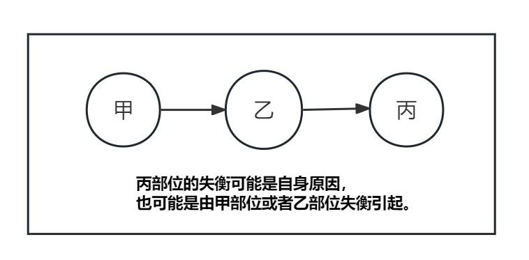

# 第七章 判断人体失衡情况

前面介绍的是中医理论下人体运转的基本原理。基本原理清晰后，我们就可以进入诊断、治疗的环节。诊治内容较多，本章初步对诊治的道理进行说明。

## 1、诊断基本原理 

前面介绍了人体的要素包括精、神、元气、气、血、津液、形等，这类要素的失衡就称之为证。判断要素失衡状态的过程称为辨证。中医辨证的原理主要包括以下两方面： 

1）有形与无形的关系

人体几种要素中，精、神、元气能量、气态物质属于肉眼不可见的要素，称为无形之物。血、津液、形体属于肉眼可见的有形之物。无形之物难以观察测量，有形之物易于观察测量。有形与无形的物质相互作用，可以通过有形之物的状态反推无形之物的状态。这个原理就像风吹旗子，风为无形的空气流动，其风力大小无法直接观察，但是我们可以根据旗子被风吹后的表现，来判断风力的大小。  

2）内与外的关系

人体内外有别，有形的物质虽然容易观察，但若隐藏在人体内部，则观察也是有难度的。但人是一个整体，内在的失衡必有外在的表现。如果掌握了内在失衡和外在表现的关系，就可以通过外在表现判断内在状态，这就是中医“有诸内，必形诸外”、“司外而揣内”的道理。

> 以我知彼，以表知里，以观过与不及之理，见微得过，用之不殆。善诊者，察色按脉，先别阴阳，审清浊而知部分；视喘息，听音声，而知所苦；观权衡规矩，而知病所主；按尺寸，观浮沉滑涩，而知病所生。以治无过，以诊则不失矣。
>
> 《素问-阴阳应象大论》

基于以上两点，把无形转化为有形，把内在转化为外在。搜集人体外在、有形的表现，来判断人体内在、无形的状态，判断精、神、元气、气态物质、血、津液等要素的平衡或者失衡，这就是中医诊断的道理。比如五脏之气本无形，但其外溢于全身，作用于腹背、五体、面部、经络、五官等处，就可以通过诊查这些部位了解脏气状态。再如五脏之液虽有形，但藏于内部不易观察，就可以通过泪、涎、唾、涕、汗、尿等外在表现进行间接判断。

人体外在、有形的病态表现称为“**症**”，内在各要素的失衡称为“**证**”。在中医中，这两字同音但内涵不同。

> **证**，是机体在疾病发展过程中的某一阶段的病变部位、原因、性质，以及邪正关系的概括。因此，证是反映疾病发展过程中，某一阶段的**病变的本质**，所以它比**症状**对疾病的揭示更全面、更深刻、更正确。
>
> 《中医药学概论-辨证论治》

无论中医、西医，诊断的原则都是要把内在、无形而难以观察的要素状态，通过某种方法转化为可以方便观察的状态。科技界发明了很多检测工具，比如CT、核磁等。这些工具扩展了人的观测能力，可以在一定程度上更清晰的显示某些内在要素状态。从观察角度看，这是值得肯定的事情。

因中医的“司外揣内”法属于间接判断，学习的难度很高，不易掌握，所以中医也希望有某些设备，能够更准确、直接的显示构建人体内环所需的精、神、能量、固液气态物质等要素的状态。但是因科技发展的局限，现在这类工具还达不到中医的要求，其检测结果对中医有一定参考价值，但对具体的辨证、用药指导性并不强，所以目前中医主要还是使用传统方法，通过外在表现来间接的判断内在状态。以后，如果科技设备可以清晰的诊查精、神、能量、气血等要素状态，中医会非常欢迎。

## 2、诊断基本常识

中医收集人体外在表现有一套成熟的体系，即大家熟知的“望闻问切”四诊。这四诊概括了人体各方面的正常与异常表现。这些外在表现与内在要素的基本关系，就是中医诊断的基本常识。

这方面的内容比较多，这里只能介绍一些初步内容，从判断精、神、气、血的角度讲起。更详细的内容需要学习《概论》的四诊章节、《口诀》的四诊、《内经》的诊法、《伤寒论》的脉法等等。

### 2.1、判断神的状态

神藏于心，外候在目。

判断神的状态主要看双目。目光明亮、眼神灵活、目中润泽，目睛清莹，了了分明，此为神气充足。若是两目呆滞、目光晦暗、蒙混不清，是神气不足的表现。瞳仁散大，为肾精不足或将竭；瞳仁固定，为精绝神亡。

其次看神志是否清楚、反应是否灵活、说话是否有条理、发音是否清亮等等。

另外，注意是否是假神的情况。假神是指久病而重危的病人，突然精神转佳，言语不休，索饮索食，呼吸平匀，如同常人，这种假象，称为假神。假神往往是回光返照，很可能短时间即告死亡。

### 2.2、判断精的状态

精有先、后天之分。先天之精在肾，后天之精在脾。

肾的功能主生殖、主骨。

从生殖角度，当男子溢精和女子月经来潮的功能出现问题的时候，标志肾精不足。

从主骨角度看，齿为骨之余，肾主骨，精生髓。所以精开始不足的时候，先从牙齿上体现出来，松动掉落。进一步不足的时候，从骨骼上体现出来，老年人弯腰驼背、容易骨折。到比较严重的时候出现肩垂，项倾，腰折，膝败，脊骨突起的现象，称为大骨枯槁，表明肾精已经衰弱到相当严重，预后不良。

脾主消化吸收，主肌肉。

从消化吸收角度看，当人的饮食能力下降，标志脾精开始不足。

从肌肉角度看，当出现肌肉不结实、人中沟变浅缩短的情况，代表脾的能力下降。严重的出现臂、腿、臀等部位的肌肉失养、瘦削，称为大肉陷下，则代表脾精衰败。

> 骨为肾所主，肾为先天之本；肉为脾所主，脾为后天之本。如果人中沟深而长，面部肌肉高厚，轮廓方正，面部上、中、下三部耸起而不平陷，肌肉丰满，骨骼高起者，则提示先后天精气皆旺盛，所以人能长寿，活百岁而终其天年。
> 
> 《黄帝内经讲解-寿夭与先后天的关系》

### 2.3、判断气血的状态

中医判断气血的内容最多。这里简单介绍：面色、脉象、舌诊等几种方法的大概原则，算是索引，具体要参考教材诊断的内容。

#### 2.3.1、面色

面色包括面部的颜色和光泽。一般来说面色光泽明亮，为身体气血充足的表现，即使得病，问题也不大。

> 张三钖说：“五脏六腑之精华，上彰于明堂，……但当求其有神，虽困无害，神者色中光泽明亮是也，脉有胃气，同一理也。”
>
> 《黄帝内经讲解-色脉互参》

为什么面部的色泽能反应人体气血的状态呢？因为人体脏腑与经络相联，全身的经络都与面部相联。只有脏腑正气充足，功能强健，邪气很少，才能在面部体现出光泽明亮的状态。

> 天有五气，食人入鼻，藏于五脏，上华面颐，
>
> 肝青心赤，脾脏色黄，肺白肾黑，五脏之常。
>
> 《中医诊法 中药 方剂口诀-望诊》

> 十二经脉，三百六十五络，其血气皆上注于面而走空窍。
> 
> 《灵枢-邪气脏腑病形》

具体面部不同的部位与脏腑的关系，内容也比较多。《概论-诊法》不太详细，应该参看国医大师孙光荣主编的《口诀浅释》的望诊部分。

> 两眉之间，名为印堂，又称阙中，在面部中间的最高之处，是相关肺病的部位；印堂的上面，名为阙上，阙上到头发边缘，名为天庭，天庭处在整个面部最高最上的地方，是相关头面疾病的部位；阙上处在天庭和印堂之中，所以是相关头面及咽喉疾病的部位，印堂略向下，在两眼之间，名为山根，又称下极，是相关心病的部位......
> 
> [《口诀浅释》](https://www.gmzyjc.com/read/qs/qs01.md#_2)

#### 2.3.2、脉象

诊脉是非常重要的一种诊断方法。人体的气血流转全身，与邪气相对抗，其状态会反应于某些动脉跳动之处。通过感受这种动脉跳动，可以了解体内的正邪状态。

脉诊的知识比较多，传统的讲解方法不够简单明了，导致大多数人都觉的很难。我将在以后的诊治部分中系统整理脉诊内容。

#### 2.3.3、舌象

舌象也是一种重要的诊断方法，属于望诊的一种。舌象主要包括舌体与舌苔两部分。舌体就是舌的肉质部分。舌苔是舌头上的那一层苔。两者合称舌象。舌象可以反应人体的气血状态。舌体代表固液态的地气，舌苔代表天气。

体内的精、元气、血、津液等要素正常时，体现在舌象为：

舌体颜色粉红、质地润泽、柔软灵活、无裂纹、厚薄适中、边缘光滑、形状标准；

舌苔颜色淡白、干湿适中、薄薄一层、全面覆盖舌体。

反之各要素有失衡时，在舌象上有对应变化，比如气热则舌苔黄、血热则舌体红、气血不足则舌体颜色淡白、津血亏则有裂纹等等。

详见《[中医药学概论-望舌](https://www.gmzyjc.com/read/gl/gl05-0.1.4.0.0.md)》、《[口诀浅释-吴坤安察舌辨证歌](https://www.gmzyjc.com/read/qs/qs01_01.md#2)》

舌诊是一种简便的诊断方法，每个人都应该掌握。

### 2.4、小节

诊断总的原则是，无论望色、切脉、舌诊还是其它方面，我们都需要先知道正常人的情况是如何的，比如*正常的面色是怎样的*？*正常的脉象是怎样的*？*正常的舌象是怎样的*？然后才能知常达变，通过病人面色、脉象和舌象与正常情况的区别，来分析人体内部虚实失衡的部位、性质与程度，并施以补泻的调理方案。然后再根据调理后面色、脉象、舌象的变化，来确定调理方向是否正确。如此反复，最终调理到正常为止。

除了上述色、脉、舌的诊断外，其它的诊断多与部位的**功能**有关。比如肌表有护卫身体的功能，该部位失衡就有对外界寒热感受的异常。脾胃有消化饮食的功能，失衡则有多食或者不能食的异常。肺有呼吸的功能，失衡则有咳喘的异常。如此等等，具体可参看《概论》的辨证章节。

中医关注的外在表现很多，大方面包括舌、脉、目、面、发、齿、唇、鼻、耳、皮、肉、筋、骨、渴、饮、食、便、寒、热、睡、汗、精神、体力、头、颈、项、背、胸、腹、肩、腰、手、足等等，每个大方面下面还有各种小指标。这些指标各有意义，可与内在各个部位的环境、功能相对应，从而反应内在平衡或者失衡状态，属于诊断基本功。算下来至少几百个指标需要学习并能熟练应用，这不是一个简单的事情。

> ...既要抓住重点，又要了解一般。不抓住重点，就抓不住疾病的辨证关键，会造成辨证时无所适从；不了解一般，又会遗漏病情。
>
> 《中医药学概论-问诊》

诊断知识需要系统学习，全面掌握。诊断知识掌握不全，临证就容易发生漏诊。明明**病人已经有某个明确外在表现表明内部的失衡情况，医者不知，必然不能正确辨证**，也就谈不上正确治疗。所以诊断基本功是否扎实，是专业人士和业余人士的关键区别。中医专业人士对人体的外在表现非常敏感，比如面色变化、舌象变化、脉象变化、寒热变化、声音变化、形体变化等等，会立刻联想到人体内部的阴阳气血精神问题。而业余人士则没有这个能力，经常纠结于一些粗浅的表面症状，对关键表现却视而不见，自然无法进行系统的辨证分析，也无法给出正确解决方案。

合格的专业中医师都应该具备证、诊、治三位一体的能力。所谓证、诊、治三位一体，是指医生能够根据三项之一推断出另外两项。比如根据外在表现推断出证型与治法，或者根据证型推断表现与治法，或者根据方药推断出证型与表现。三者之间通达无碍。要想获得这种能力，学习者需要进行系统学习和大量实践。三者中，尤以由诊到证的环节最为复杂，也就是辩证最难。好在现在光明中医网校提供了ai人工智能辅助辩证的功能，可以大大降低了辩证的难度。

## 3、从多个角度判断一个证

中医的“司外揣内”是根据人的外在表现判断内部状态，因其属于外在间接判断，而不是直接看到到内在状态，因此，难免有一定误差。这就像我们通过汽车的故障灯判断发动机的故障，大多时候是正确的。但如果灯本身出了故障，发动机坏了而灯不亮，或者发动机没坏反而灯亮，这样就会出现误判。因此，尽量从多个角度进行判断。如果多个角度的外在表现都指向了某个部位的某种失衡，那么误判的可能性就要小多了。所以中医一直强调要尽量多的收集四诊信息，只凭脉，或者只凭舌象都是不够严谨的。

比如对阳明部位实热的判断。阳明部位包含胃经、大肠经及相关胃腑和大肠腑，其功能是负责饮食的消化和废物的排出，所以阳气很足。实热的含义是该部位正气不虚，多出了无形的热邪。

判断这种情况的几个角度，从脉象看应浮大而数且有力；因里热外传，对外界寒热的感受应该是怕热，体温角度可能有发热或潮热，且发热不随汗出而减轻；汗的角度可能有大汗，汗出连绵不断，《伤寒论》称之为“汗出濈（jǐ）濈然”；因胃热，所以渴饮方面应该是口渴、喜欢喝冷饮且能够大量饮入，饮食方面应该是能食；从舌象看有舌质红而舌苔黄燥；因阳明经络通于面部而有面赤、鼻干、目痛；热邪过盛影响到心可导致心烦，严重可出现语无伦次、神识昏糊、狂躁不安（讝语）；体力方面应为有力；热邪严重，蒸发肠胃津液可能造成便秘。

如果一个人同时具有上面这些表现，就说明多个角度都指向是阳明热实的情况，辨为阳明实热证就比较有把握。如果只有一、两个表现，则要谨慎，再分析分析是否有其它可能。

人体的目、面、舌、脉搏及各种生理功能就像汽车的故障指示灯，能够表示出内在指标的各种问题。但是因为指示灯本身也可能失灵，为了防止不被单一的指示灯误导，我们要收集尽量多的指示灯信息，进行综合判断。如果多个指示灯都指明是同一内部故障，才能比较准确的确定故障位置和性质。

有时还会出现不同的指示灯表达了相反的故障信息，这时要根据经验判断哪个指示灯表示的问题更准确，需要进行取舍，并在后继的调理过程中进行观察，判断取舍是否正确。这就是“舍脉从证”或者“舍证从脉”。

## 4、功能之间的逻辑关系判断主证

外在表现正常需要一系列内部器官协同工作，这些器官的功能构成了一种串联的逻辑关系。若出现某种病症，则需要排查相关各个内部环节，寻找哪个环节出现了哪方面的问题。排查过程需要更多信息。比如家里的灯不亮，如果其它电器正常，就是灯本身的问题。如果其它电器也没电，那么就可能是家里的电路问题。如果邻居家也没电，那就可能小区变压器问题。如果通过这类排查确定了是小区变压器问题，这就是确定了病位。下一步还需要查看变压器是失火、受潮还是短路，这就是确定病性。确定了病位、病性才能给出解决办法。只有灯不亮这一个信息，是无法确定病位、病性的，必须结合其它信息。

人体的饮食、呼吸、睡眠、大小便、护卫肌表、精神、体力等功能都是如此。这些功能若正常，代表体内相关一系列器官工作协调。人体每个器官都与其他器官有多种关系。比如肺脏。肺与其他四脏有能量方面的五行生克乘侮胜复关系；肺与脾在物资的传递上有接受脾上升的营气的关系；肺与肾、膀胱在水气循环方面有接受下焦蒸腾上升的水气的关系；肺与大肠有废物排出的表里关系；肺与皮毛有宣发水气营养皮毛的关系；肺与肺经有肺气入经的关系等等。 因为有这些关系，如果相关部位先出现失衡而功能失常，那么肺也会跟随出现失衡。也就是如果某个器官出现失衡，就会引起相关的器官也出现失衡，并且继续延伸引发连锁反应。因此，如果某外在功能异常，比如呕吐、哮喘、失眠、便秘等等，我们并不能立刻定位根本问题在哪个部位，需要通过更多的症状来缩小范围，寻找根本原因。下面举几个例子说明：

> 病证的性质，往往由几个相关的症状共同揭示。临证中任何一个症状，均需其他症状而限定。因此，一个症状只有放在症状之间去考察，方具备其揭示病证本质的功能，方赋予临床意义。
>
> 《中医临证程序与辩证思维方法-诊察》

### 1、怕冷：

卫气负责护卫肌表，如果散布于皮肤表面的卫气不足，就会出现异常的怕冷。但是此时我们还无法判断原因在哪里。因为卫气产生于脏腑，传输于经络，通过肌表腠理散布于皮肤表面。其产生、传递、散布的过程中，任何一个环节有问题都可以导致表面卫气不足。这就需要更多的信息来帮助定位。

如果怕冷还兼有发热，因发热往往表明肌表的正气比较充足，说明这个怕冷不是因为内部产生的卫气不够，而是肌表的问题。反之，如果怕冷不兼发热，则很有可能是内部产生或传输到肌表的卫气不够。这就是《伤寒论》第7条“病有发热恶寒者，发于阳也；无热恶寒者，发于阴也”的含义。这里的“发于阳”指的是根本问题在肌表，“发于阴”指的是根本问题在内在的脏腑经络。

> 病有发热恶寒者，发于阳也；无热恶寒者，发于阴也。发于阳，七日愈；发于阴，六日愈，以阳数七阴数六故也。[7]...
>
> 注家对“发于阳”主要有三种说法，一是指太阳中风，中风初起即有发热恶风寒。二是指发于太阳，太阳病多是发热与恶寒并见。三是指发于阳经、发于三阳，是阳证，**凡以发热为主要特征的，都是阳气抗邪有力的反映，所以都属阳证**，是三阳经病。注家对“发于阴”也有三种说法。一是指太阳伤寒，太阳伤寒初起常以恶寒为著，而不见发热。二是指发于少阴、少阴病，阳气虚衰，故以无热畏寒为主要特征。三是指发于阴经，发于三阴，是阴证，**凡以恶寒为主而不发热的，多是阳气虚衰，抗邪无力的反映，所以都属阴证**，是三阴经病。此三说皆对临证有指导意义。
>
> 《伤寒论讲解-7条》

人出现怕冷有很多原因，这里以受风寒侵袭为例进行分析。人体在肌表感受风寒后的正常表现应为气血向肌表波动，正邪相争于肌表而使身体发热，正气战胜邪气，通过自主出汗将邪气排出体外。汗后，邪气排出，发热等异常症状消失，身体恢复正常。如果未能按此进程发展，则为病态，需要医药帮助。

受风寒之后，出现怕冷兼发热的症状，说明是“发于阳”，即根本问题在肌表。此时要再看有汗、无汗。

如果怕冷兼发热而无汗：此时无汗是皮肤汗孔腠理被寒邪闭合，卫气无法通过汗孔散布到皮肤表面，就会导致怕冷。卫气无法散布于外而郁集于皮下，所以可能发热比较重。严重的话，皮肤腠理闭合，影响肺气向肌表的宣发功能，可能会出现喘的现象。由此，恶寒、发热、无汗而喘这一组症状，就成为“寒邪闭表”的典型表现（此时脉象应为脉浮紧）。这里的病位为肌表，病性为寒邪实证，治法用麻黄汤。此时寒邪阻碍经络气的运行，可能会造成身痛、腰痛等各种痛症，这种痛症是辅助症状，不作为用药的主要依据。

> 风寒客于人，使人毫毛毕直，皮肤闭而为热，当是之时，可汗而发也。
>
> 《素问-玉机真藏论》

> 太阳病，头痛、**发热**、身疼、腰痛、骨节疼痛、恶风，无汗而喘者，麻黄汤主之。[35]...
>
> 这八个症状，可归纳为发热，恶风寒，诸痛，和无汗而喘三组，“恶风”是“恶寒”的互词，这是寒邪伤阳，温煦失司所致。**发热**是寒邪闭表，**阳气被郁而不得发泄**所致。...寒主收引，寒主痛，寒邪袭表，使营血涩滞，筋脉拘紧，故见诸痛。...” “无汗”乃因**寒邪闭敛毛窍所致**，是伤寒表实证最具特征性的表现。...**无汗为表闭，表闭则肺气不宣，肺不宣乃生喘**。
>
> 《伤寒论讲解-35条》

如果怕冷兼发热且有汗：汗出而身体未恢复，不适症状仍在，这是不正常的，表明这个汗没有排邪，是病汗。有汗代表汗孔腠理没有被闭合，有热代表肌表阳气并不衰弱。卫气并不缺少，且可以通过汗孔到达皮肤表层，所以怕冷不会那么厉害。营卫相协而行，营行脉中，卫行脉外。营血与卫气互相配合才能正常完成功能。如果两者配合不协调，可导致异常出汗，即营卫不合的病汗。如果这种营卫不合是肌表受风邪影响而产生的，就有怕冷、怕风、发热、汗出的表现，用桂枝汤发微汗，调和营卫治疗。

> 太阳中风，阳浮而阴弱，阳浮者，**热自发**；阴弱者，**汗自出**，啬啬**恶寒**，淅淅**恶风**，翕翕**发热**，鼻鸣干呕者，桂枝汤主之。[12]...
>
> 太阳中风是**风邪袭表，营卫不和**，卫强营弱之证，治当解肌祛风，调和营卫，唯桂枝汤是至当之方，所以说“桂枝汤主之”。
>
> 《伤寒论讲解-12条》

> 病常自汗出者，此为荣气和，荣气和者，外不谐，以**卫气不共荣气谐和**故尔。以荣行脉中，卫行脉外，复发其汗，荣卫和则愈，宜桂枝汤。[53]...
>
> 但卫阳行脉外而固护营阴，营阴行脉中而滋助、制约卫阳，营与卫，内与外相合而不相离。今营行脉中，卫行脉外，相离而不相合，卫不固营，**营阴失护而外泄**，故用桂枝汤发汗以和营卫，使二者相合则自汗可止。
>
> 《伤寒论讲解-53条》

> 所谓“调和营卫”，即调和人体气血以增强人体生理调节、代偿及抵抗能力；所谓“解肌”，即解除人体肌表因致病因素作用而产生的障碍，以增强人体肌表调节体温的能力
>
> 《温病条辨讲解-上焦-风温-四》

如果只怕冷，不发热，说明是“发于阴”，问题应在内在脏腑经络，再去寻找相关功能失常的表现协助判断。

以上是对相对健康的人感受风寒原理的粗略分析，主要是想说明中医根据功能逻辑关系判断病位的思路，即单纯一个怕冷的症状不足以判断病位病性，需要一组症状相互印证才能定位。对于原本就不太健康的人，比如原来就有阳虚、阴虚、湿气、内热等问题，则还有更多考虑，需要根据特定的表现进行辨证和治疗。像《伤寒论》346条的死证，发热、汗出不止伴随有下利（拉肚子）。有下利，说明里部阳不足，里部阳不足而表部有发热，说明表部这个热不是正气充足，而是阴盛格阳、孤阳外越。此时汗出不止，这个汗就不是正常的排邪外出，也不是营卫不和，而是营卫不足加虚阳外越，不能正常控制汗孔和营血。这种情况的关键问题在里部阴阳离绝，脏腑已经不能正常工作，是非常危险的。

> 伤寒六七日，不利，便**发热而利**，其人**汗出不止**者，**死**。有阴无阳故也。[346]...
>
> 今下利，发热同时并见，可知“发热”非为阳气来复，而是阴盛格阳，孤阳外越的假象。如果此时又见汗出不止，则是阳气外亡而营卫不固之象，终致有阴无阳，阴阳离绝，多难救治，故曰“死”。
>
> 《伤寒论讲解-346条》

### 2、便秘：

大便是由大肠部位的食物糟粕和适度的水混合而成。如果出现干燥的情况，有多种可能，比如肠胃的热过多或者水不够等等。如果此症状同时伴有“口渴喜饮冷水”、“怕热”等表现，就有可能是阳明肠胃热量过多，蒸发水液而造成的，也就是阳明热实的证型。若没有这些表现，反而有“不太能吃饭”、“小便不顺畅”，且大便只是开始的时候干燥，后面又稀溏，那就比较符合阳明部位阳虚寒实的证型。此时是脾胃寒不能正确的消化吸收饮食（水谷不别），所以产生大便先干后溏的现象。这种胃寒的便秘和前面胃热的便秘，原因截然不同，治法正好相反。如果不仔细判断，就犯虚虚之戒。其它还有气虚、血虚等原因形成的便秘，都是需要综合判断，具体可参考《中医内科学》的“便秘”章节。

> 问曰：脉有阳结阴结者，何以别之？答曰：其脉**浮而数**，**能食，不大便**者，此为实，名曰阳结也，期十七日剧。其脉**沉而迟**，**不能食，身体重，大便反鞕**，音硬，下同。名曰阴结也，期十四日当剧。
>
> 《伤寒论-辨脉法》

> 阳明病，若中寒者，不能食，小便不利，手足濈然汗出，此欲作固瘕，必大便初鞕后溏；所以然者，以**胃中冷**，**水谷不别**故也。[191]
>
> 《伤寒论-191条》

> 如“便结”一症，只有放在口渴欲冷饮，烦躁，溺短赤，脉数诸症状中方提示该便结属热。若单独讲便结，则无法确定其属性。因此，便结一症便失去了临床意义了。
>
> 《中医临证程序与辩证思维方法-诊察》

### 3、阴虚口干：

当人体津液不足，也就是阴虚的时候，往往有口干燥，严重会口渴的情况。这种情况，大家直觉上会认为需要滋阴补水。但是实际上，阴虚的原因有多种，不可一概而论。

首先，当人受到外界温热邪气的影响，或者自身的元气过度时，会在体内形成热盛伤阴的格局，导致津液消耗而口干渴。以暖气的例子来理解就是因为火过大而烧干了水。这就是温病的产生机理。此时的根本原因在温热邪气，应祛除邪热、补充津液，需根据情况决定祛热和补津的比例，具体参考温病的治法。

其次，当人出大汗或者泻下过度的时候，体内津液会大量流失，导致出现阴虚的情况。此时的主因是津液的流失，所以治法主要就是补充津液。

> 肺痿之病，从何得之？师曰：或从汗出，或从呕吐，或从消渴，小便利数，或从便难，又被快药下利，**重亡津液**，故得之。
>
> 《金匮要略-肺痿肺痈咳嗽上气病脉证治第七》

再次，一些阴虚是因为胃、肠、脾、肺、肾、三焦、膀胱等水液代谢器官因虚实失衡而减弱运输水液的能力，就会造成其下游部位不能获得足够的水液而形成局部阴虚。这类情况，直接补阴是无效的。就像家里水龙头不出水，可能是水源真的不足（缺阴），也可能是加压的水泵坏掉（缺阳），也可能是水管堵塞（邪气）。如果是水管堵塞，补水是没有用的，必须疏通水管。此时应调理这类功能障碍，恢复水液代谢功能。恢复相关器官的运水功能，人体就可以自行补阴，直接用补阴药反而补不进去。

这些水液代谢器官的失衡性质虚实都有。

虚类，比如脾阳虚或者肾阳虚的时候，就会因阳虚不能蒸化水液，造成水气流转障碍而出现口干渴的现象。此时可用补阳的方法恢复器官阴阳平衡，然后其运水功能恢复，缺少的水液得到补充，口干渴现象消失。这种治法，后世称为“扶阳阴自回”。

> 如临床上的阳虚水饮证候，反而出现口干，口渴，但**渴不欲多饮**，或喜热饮等表现，是因为阳虚不能化水为津，津液不足，故出现口干等现象。
>
> 《中医药概论-阴阳学说在中医学的的应用》

> 不少人在临床上一见口渴，便谓阴虚内热，多用养阴生津之剂，有如吴氏原注中所谓：“今人见渴投凉，轻则用花粉、冬、地，重则用石膏、知母，全然不识病情。”用药无效。我们在临床治疗中，只要在辨证上确属因寒生湿，由湿困脾。而在临床上表现为口渴的患者，恒遵吴氏“饮家反渴，必重用辛”的治疗原则，效果甚好。例如我们在西医诊断为“干燥综合征”及糖尿病患者时，有的用丁叩桂附理中汤，有的用加味理中汤，有的用金匮肾气丸，效果都较好。
>
> 《温病条辨讲解-下焦-寒湿-五十》

> 一妇女教师 62 岁，患“干燥综合症”8 年，先用激素疗法无效。口干无津，饮水愈多，干渴愈甚，...舌光红如去膜猪腰子，唇干裂，口舌疮频发。曾服...养阴增液之类...不效。...以大剂参附汤直温命火，...10 剂后...舌上生出薄白苔，津液满口。...
>
> **除温热伤阴**之外，则在杂病中阳虚气化不及，津液不能蒸腾上达，便是病根。
>
> 《李可老中医急危重症疑难病经验专辑-重症结核性腹膜炎合并胆囊炎》

实类，有时器官失衡性质为邪气堵塞，比如痰饮之气堵塞肠道、三焦等部位，使水气的升降传输失常，也会导致需要的地方得不到水而产生阴虚。此时需要用祛邪的方法恢复平衡。

> 三焦水道不通，升降机能窒塞，则水饮停滞而腹部胀满，水不化气而**口舌干燥**。
>
> 《金匮要略讲解-痰饮-二十九条》

> 先渴后呕，为水停心下，此属饮家，小半夏加茯苓汤主之...
>
> 因**停饮致渴**，终因渴饮更益其饮而致呕，故当**治饮邪而不必治其渴**，以饮去则呕止；津通则渴自已。
>
> 《金匮要略讲解-痰饮咳嗽病脉证并治第十二》

以上几种情况虽同为缺水，但病因不同，则治法不同，不可混淆。因未明此理，有人一见口渴，就用治疗温病的寒凉滋阴法。此法对功能障碍导致的阴虚无效甚至加重。其中一些人未反思自己辨证不明，却说温病治法无用。也有人走向另一个极端，一见口干渴，不加分析就认为是阳虚不化水而进行补阳。这些人遇到确为实热造成阴虚的情况，就属于误用阳药，必然进一步伤阴，严重可导致阴虚血热、吐血、暴亡，或者患上西医急性白血病类重病。总之，若不理清人体运转的道理，只根据寥寥几个症状就妄谈寒热补泻，非常容易走偏。

### 4、小结

以上怕冷、便秘、阴虚三个例子，都说明出现某个问题，原因有多种。这就需要结合其它表现来进一步进行筛查，找出真正原因。其它像血虚原因可能是外伤失血，也可能是内部造血不足；瘀血原因可能是外部跌打，也可能是内部气未能推动血正常运转；湿气原因可能是外部环境湿气入侵，也可能是内部水气运输问题；生痰的原因可能是肺的宣降水气功能障碍，也可能是脾的运化功能障碍。

各种显而易见的外在病症表现都可能有更深层次的本质原因，所以咳嗽不一定用止咳药、呕吐不一定用止呕药、失眠不一定用安眠药、疼痛不一定用止疼药、痰饮不一定用祛痰药。正虚不一定直接补正，有时是需要解决自身产生、传输正气相关环节的问题。邪实不一定直接泻邪，有时是需要解决排邪能力和排邪通道相关环节的问题。

人体自身就有维护平衡的能力，研究病证的第一件事情是要分析这种能力为何没有正常工作？理解这些需要对**人体的运转原理、各器官的功能、器官之间的相互关系**非常熟悉，并有**扎实的诊断基本功**。

> 自然气候潮湿可以影响人体正常生理功能而产生病理产物成为“湿证”；人体正常生理功能低下也可以产生病理产物成为“湿证”。
>
> 《温病条辨讲解-中焦篇-湿温 寒湿》

> 先哲曰：“见痰休治痰，见血休治血，无汗不发汗，有热莫攻热，喘生毋耗气，精遗勿涩泄，明得个中趣，方是医中杰”。
>
> 《中医内科学-治病求本，对证施治》

按：中医先贤常说不可见病治病、见证治证，其意为不要被表象迷惑，应探求本质。很多学习者一辈子也理解不了这句话。究其根源，是对人体的运行原理不清晰，对其中涉及的各种因果关系理解不透彻。造成这种现象与中医对理论的讲解过于模糊有主要关系。此点，中医界确应反思！

## 5、总结

本章主要主要包含四个部分内容，如果把人体比喻成一座大楼的话：

第一部分：因为我们不能进入大楼去观察其水、电等要素的运转情况，所以我们只能通过大楼物资进出情况以及各种外在表现来间接判断，也就是“司外揣内”。这是中医诊断的基本原理。

第二部分：为了能全面判断大楼的情况，我们需要系统掌握大楼各种内部要素状态与外部表现的基本关系。这就是中医诊断的基本常识。

第三部分：为了辩证准确，在掌握诊断基本常识的基础上，需要从多个角度互相参照才能比较准确的判定内在的问题。

第四部分：在掌握辩证基本能力后，还要根据大楼的内部运转机制进行逻辑分析，寻找多个内在问题中的最根本问题，即定位主证。

诊断的内容散落于内经、伤寒等经典以及后世医家的书籍之中，需要反复研读、记忆、实践。熟悉中医诊断的内容，可达到看透人体的效果，让人的健康状态无所遁形。

我们要求中医学习者在了解寒热虚实、精神气血等基本概念后，必须**系统掌握**诊断的内容。如此，才能及早觉察精、神、阴、阳、气、血层面的失衡变化，在失衡比较轻微的时候就可以提前预知疾病的发生，不必像普通人那样，要等到疾病发展至形质变化阶段，重要功能失常，感受到痛苦，才能重视并治疗。这也是中医“治未病”的原理。

当组织器官实体形状发生病态变化时，往往体内环境要素失衡已经比较严重。变化初期，如果病人洗心革面，戒掉不良习惯，调整思想、饮食、作息，积精全神，再配合正确的中医疗法，扶正祛邪，恢复气血平衡，尚有自我修复的可能。如果形质变化严重，通过调理身体环境的方法来让形质恢复正常所花费的时间是比较长的。此时，若形质变化已经成为失衡的主要矛盾，直接处理形质失衡之处也是一种选择。

中医治病有“一剂知，两剂已”的说法，意思是用药对证的话，常可一剂药即感受到变化，两剂药就可治愈疾病。这种情况是指对内环境的调节可以非常快速迅捷，而形质的变化显然不是一两天能够转化回来的。

初学者因掌握的知识不全，经验不足，非常容易在重要方面发生漏诊。比如病人本有里部五脏虚弱，又复有外感，如果只看到外感，未能发现里虚，只用了治疗外感的方药。治疗外感的方药往往要调动里部气血走向表部，这样会造成里部虚上加虚，就犯了虚虚之戒，形成严重的里部失衡，有可能给病人造成严重伤害。像桂枝汤为补充气血且驱动更多气血走向肌表的方剂，适合于里部无病，表部气血虚的情况。但是如果里虚较重之人，服后则气血过于走表，导致里部虚上加虚，可能会出现咽干、烦躁、呕吐、手脚凉、脚抽筋等表现。这种情况，应该先解决里部之虚证，然后再解决表部的问题。这就是中医“虚人外感先建其中”的原则。

> 伤寒，脉浮，自汗出，小便数，心烦，微恶寒，脚挛急，反与**桂枝欲攻其表**，**此误也**。得之便厥，咽中干，烦躁、吐逆者，作甘草干姜汤与之，以复其阳。......
>
> 《伤寒论-29条》

> 此足证虚人伤寒当先扶正而不可发汗的原则，对临床的指导意义很大。后人对虚人外感的治法，也有许多发展，如助阳解表，益气解表，滋阴解表，养血解表等等，但对于虚人，即使是使用这些扶正祛邪的方剂，也应以谨慎为是。
>
> 《伤寒论讲解-50条》

系统学习中医的意义就是能够全面的看待人体，避免出现因医误病的情况。全面看待人体需要收集足够多的外在表现，也就是“四诊合参”。否则，如果漏掉一些关键症状，必然导致辨证结论的片面，进而导致治疗的失败。中医不应轻率给出方药。因为方药一出，就代表开始对人体的状态进行调整。如果前期辩证不明，就容易错误的选择方药，给病人带来伤害。《伤寒论》中说“观今之医，不念思求经旨...相对斯须，便处方药”，说的就是这种情况。

> 前人云：有是症则有是病。对病人所反映出来的**症状要不厌其多，资料越多越有利于辨证**。因此，可以说诊察是辨证论治的起点。
>
> 《中医临证程序与临床辨证思维方法-诊察》

> 观今之医，不念思求经旨，以演其所知，各承家技，始终顺旧，省疾问病，务在口给，**相对斯须，便处方药，按寸不及尺，握手不及足，人迎趺阳，三部不参，动数发息，不满五十，短期未知决诊，九候曾无仿佛，明堂阙庭，尽不见察，所谓窥管而已**。夫欲视死别生，实为难矣
>
> 《伤寒论-序》

光明教材中的《概论》、《内经》侧重于基础理论的论述。《本草》、《方剂》是以证为起点，介绍一证或者多证共存时，相关的表现和典型方药，属于战术知识。《伤寒》、《金匮》不但在局部诊治方面非常经典，而且对病证的轻重进退和治疗次序介绍的比较详细，所以对理解中医治疗战略帮助极大。《温病条辨》则是在热、湿、阴虚等方面对伤寒、金匮进行补充。内、外、妇、儿等专业课是以病种为索引，讲解某病可能为哪些证引发，以及相关的辨别与治疗经验。《口诀》课程是以上内容的浓缩，尽量简洁以方便学习者背诵记忆。《口诀》内容大家应能背诵，最起码也要熟读、熟听。实际临床中，各种证型组合颇多，且随着治疗进程随时变化，应该活用教材内容，随证治之。

中医提倡积精全神、培养正气，不生病，或者将疾病消灭于萌芽状态。不提倡平时不注重养生，等五脏虚实重症已成再进行治疗。但真遇到重症病人，中医也不应束手无策。治疗此类病人，推荐参考《李可老中医危急重症疑难病经验专辑》一书。重症病人的病证，其病位深、程度重、病性复杂、变化快，新手很难处理。作者李可老中医被称为中医ICU，具有丰富的重症治疗经验。他从实践的角度，验证了依据中医基本理论治疗重症的有效性，所依理论内容包括依证不依病、治局部考虑整体、扶正祛邪、病证轻重转化、精神为本等等方面。李老对中医诊治方法的应用已达极高水准，此方面可以为师！因该书侧重重症实战，其所用名词及内在思路，皆需在掌握中医基础知识后才能真正读懂，所以应定位为学完教材后的实战辅导书。重症用药偏性较大、剂量也大，如果没有系统学过教材，没经过实践，很难驾驭这类猛药，一旦用错就会引发事故，切忌！！

  
