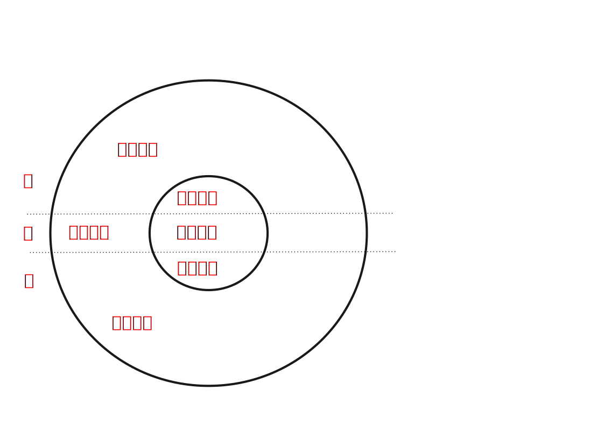
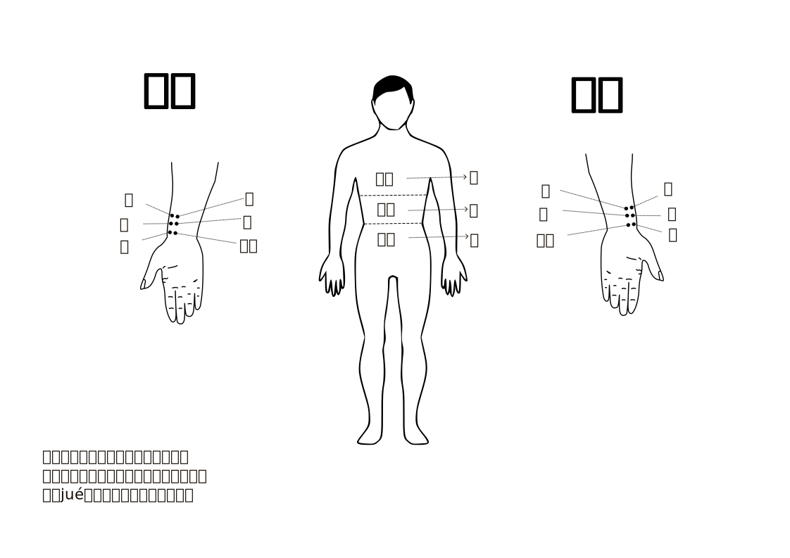
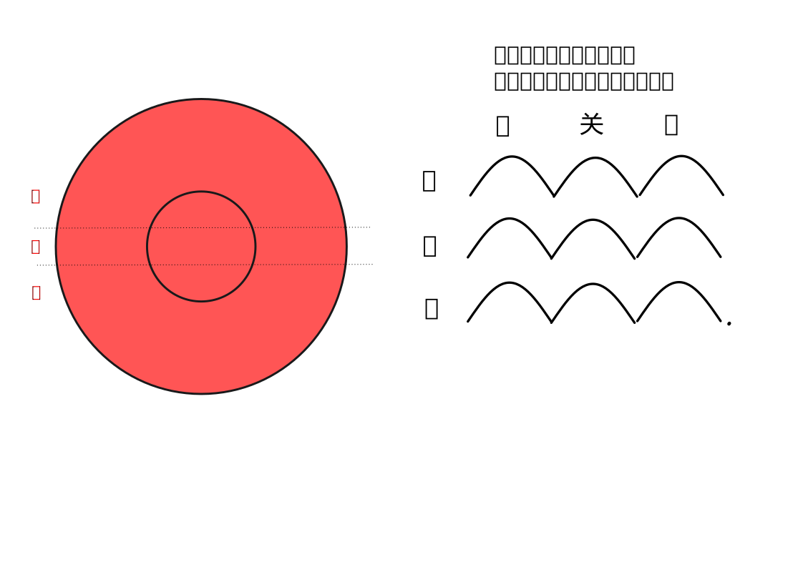
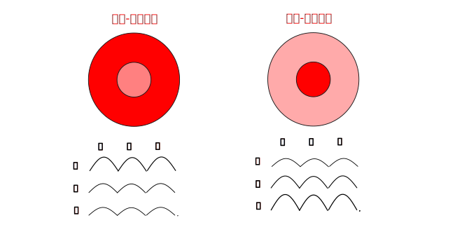
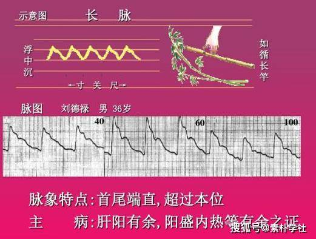
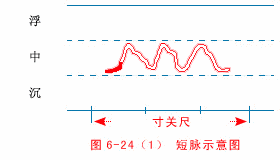
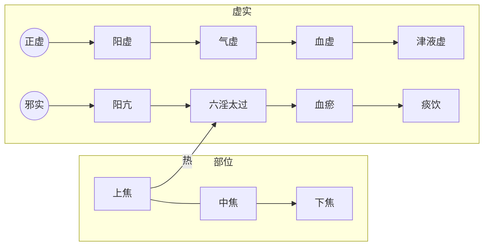

# 脉

前面《中医概念入门》讲了人体各要素配合形成适宜体内环境。了解全身的气血状态需要通过观察外在表现。

望闻问切四诊是中医了解人体内部气血状态的方法。相对于其它诊法，脉法能够比较系统的反映人体气血状态，是中医的重要诊查方法。不懂脉法，就难以准确把握人体的气血状态。

《伤寒论》大量利用脉像结合症状判断病位、病性，所以其前两章皆为脉法。这是学习《伤寒论》的基础知识。

## 1、脉的定义

诊脉，是医者用手指指腹触按病人某些部位的动脉，根据跳动情况，来判断患者身体各个部位的气血状态的方法。

其原理是人体的血液虽由心之搏动作为起始动力，但是其在全身的流转，需要经络之气的辅助。经络之气作用于动脉，则对动脉的跳动有影响。可以通过观察这种跳动的状态来了解气血的状态。

## 2、诊脉位置

理论上，十二经脉都有部位可以诊断该经气血状态。这里以伤寒论所用脉法为主，重点介绍寸口脉，兼顾趺阳脉与少阴脉。

### 2.1、寸口脉

寸口是指掌后高骨侧，触之有脉跳动处。如图：

寸口脉为肺脉，能够反应肺的气血状态。有因为肺朝百脉，即全身的气血状态皆在肺经有反应，所以此处可以诊查全身的气血。其原理如《难经》所说"寸口者，五脏六腑之所终始，故法取于寸口也"。

> 寸口脉：本泛指腕部桡动脉搏动处

> 寸口者，脉之大会，手太阴之脉动也。人一呼脉行三寸，一吸脉行三寸，呼吸定息，脉行六寸。人一日一夜，凡一万三千五百息，脉行五十度，周于身。漏水下百刻，营卫行阳二十五度，行阴亦二十五度，为一周也，故五十度复会于手太阴。寸口者，五脏六腑之所终始，故法取于寸口也。
>
> 《难经-一难》

寸口脉分寸、关、尺三个部位，以高骨处为关，关前为寸，关后为尺。左右两手共六个部位。《伤寒论》有时用“尺寸”泛指寸、关、尺三部。

> 尺寸者，脉之大要会也。从关至尺是尺内，阴之所治也；从关至鱼际是寸内，阳之所治也。故分寸为尺，分尺为寸。故阴得尺内一寸，阳得寸内九分。尺寸终始，一寸九分，故曰尺寸也。
>
> 《难经-二难》

> “**尺寸**"泛指寸关尺三部脉

> 师曰：子之所问，道之根源，脉有三部，尺寸及关，荣卫流行，不失衡铨(6)，

#### 诊脉的力度

诊脉的力度分轻、中、重三种。轻按皮肤为浮取，中等力度按至肌肉为中取，重按至筋骨为重取。可对应由表到里的部位。

寸口脉有寸关尺三部，每一部都有浮、中、沉三候，所以称为三部九候。

人体气血分布部位从大的方面来说，要分上、下和内、外。这些部位在气血状态需要根据特定部位的脉象来判断。人体部位与脉的部位对应关系为：

人体上部寸口脉的寸部，下部对应寸口脉的尺部。

人体内部对应寸口脉的沉取，外部对应寸口脉的浮取。

整体来讲，寸部代表身体上焦、肌表，关部代表中焦，尺部代表下焦。

> 寸主射上焦，出头及皮毛竟手。关主射中焦，腹及腰。尺主射下焦，少腹至足。
>
> 《脉经-分别三关境界脉候所主》

> 【师曰】平脉大法，脉分三部。**浮部分经，以候皮肤经络之气；沉部分经，以候五脏之气；中部分经，以候六腑之气**。
>
> 脉分寸关尺，寸脉分经以候阳，阳者气之统也；尺脉分经以候阴，阴者血之注也；故曰阴阳。关上阴阳交界，应气血升降，分经以候中州之气。
>
> 《桂本伤寒论-平脉法第一》

> 近世通行的分配方法是：左手寸、关、尺分候心（心包）、肝（胆）、肾（膀胱、小肠）；右手寸、关、尺分候肺（胸中）、脾（胃）、肾（命门、大肠）。这种分配方法体现了“上（寸）以候上（上焦），中（关）以候中（中焦），下（尺）以候下（下焦）”的原则。
>
> 《中医药学概论-脉诊》

### 2.2、趺阳脉

趺阳脉：指足背前、足二趾后之动脉，此处属于足阳明胃经冲阳穴，可以了解中焦脾胃之气的盛衰和病证。

此脉浮取体现腑即胃的气血状态，沉取体现脏即脾的气血状态。

> 趺阳脉迟而缓，胃气如经也。...
>
> 今趺阳脉浮而数，**浮以候腑病**，浮而无力，则为伤胃。**沉以候脏病**，数而按之无力，则为脾伤。
>
> 《伤寒论讲解-辨脉法-单元3》

> 趺阳部位，以候脾胃，脉滑而紧，主脾胃邪气有余；脉伏而涩，主脾胃之气涩滞不利，吐逆不食，为中焦关格；脉大而紧，主脾胃气虚而邪气盛实，可为下利，多属难治；脉紧而浮，浮为气，紧为寒，邪在中州则腹满绞痛，肠鸣而转；邪溜于下，而迫及少阴，则使少阴脉不出，其阴肿大而虚；脉沉而数，主脾胃热实，消谷善饥，如反见弦紧之肝脉，为木来克土，其病难治；脉浮而芤，主中气虚衰，荣卫失禀，则使人形体消瘦、肌肤甲错；脉微而紧，主中虚且寒，则气自短；趺阳之脉不出，主脾胃气虚，升降失常，而见身冷肤硬。
>
> 《伤寒论讲解-平脉法-单元6》

### 2.3、少阴脉

少阴脉指足内踝后、根骨上的动脉，该处为足少阴肾经的太溪穴，可以诊查肾气的情况。**

少阴脉：也叫太溪脉，指足内踝后、根骨上的动脉，此处属足少阴肾经的太溪穴，可以了解下焦肾气的盛衰和病证

> 少阴脉亦称太溪脉，指足内踝后、根骨上的动脉，为足少阴肾经所过，以候下焦肾气的盛衰和病证

> 少阴部位，以候肾气。脉来弱而涩，主肾精阳气不足，当见心微烦与手足厥逆；肾脉不至，主肾气衰微，精血不足，而使奔气促迫、上入胸膈、致气血凝聚，全身不仁，发为“尸厥”。
>
> 《伤寒论讲解-平脉法-单元6》

如图：

### 2.4、为什么选这三个部位？

寸口脉虽然可以遍查全身气血，但是因为气血来源于先天之精和后天之精，所以对这两者要重点侦查。先天之精来自脾胃，所以辅以脚部的趺阳脉诊查脾胃气血；后天之精来自肾，辅以脚踝处的太溪脉诊查肾部气血。

寸口脉指手腕挠动脉处的脉搏跳动，分寸关尺三部，可以体现全身内外的气血状态。

> 本文以脉会太渊，故取寸口以候心肺；脾胃为后天之本，故取趺阳以候脾胃。肾为先天而主宰阴阳，故取少阴以候肾与命门。
>
> 先论寸口，后论趺阳，而后又论少阴层次清晰，脉理昭彰，既示手足之脉各有所主，又寓三部脉象自应合参等意，堪可玩味。
>
> 《伤寒论讲解-平脉法-单元6》

## 2、寸口脉的寸关尺代表的部位

在伤寒论中，没有提到寸关尺三个取脉部位具体代表身体的那些脏腑器官。在中医医书中，这个内容也不完全一致。这部分内容，教材是依据内经的《素问•脉要精微论》相关论述，表达如下图。

> （1）“尺内”，尺部也。关部前为寸部，关部后为尺部，称以称尺部为尺内。“两旁”指左右手之尺部。“季胁”，指两胁的下部。左右尺部为诊察季胁的部位。两手尺部外侧（桡侧）以候肾，两手尺部的内侧以候腹部。
>
> （2）“中附上”，指在上依附尺部的关部，关部位居寸口脉的中段。左手关部外侧诊候肝，内侧诊候鬲；右手外侧诊候胃，内侧诊候脾。
>
> （3）“上附上”，指寸部。张景岳注：“上附上，言上而又上，则寸脉也。”尺部之上为关部，在上依附关部的是寸部。右手寸部外侧诊候肺，内侧诊候胸中；左手外侧诊候心，内侧诊候膻中。...
>
> 《内经》不但阐述了诊脉独取寸口的原理，而且提出了具体的寸关尺脏腑分部。后世寸关尺脏腑分部，均以《内经》为依据而略加变更。如《难经》以左寸内侧候小肠，右寸外侧候大肠，左关内侧候胆，左尺外侧候膀胱，右尺外侧候命门。《脉经》以右尺外侧候三焦，其它均同《内经》。目前，寸关尺分候脏腑，根据《素问•脉要精微论》所提出的上竟上，下竟下，即寸脉以候身之上部，尺脉以候身之下部的原则，除认为左关内侧可候肝胆外，多因袭《素问•脉要精微论》所提出的寸关尺脏腑分部。
>
> 《黄帝内经讲解-诊脉部位》

关于

## 3、脉之平衡点

### 2.1、单个部位气血均衡的标准脉象

每个部位的脉搏状态，代表该部位的阴阳气血状态。当该部位气血平衡时，对应脉象应来去从容，节律均匀，力度和缓有力，频率不快不慢，宽度不大不小，不滑不涩，不弦不动。此为脉的平衡点。

<object id="rentisvg" width="800" height="100" data="./img/2脉/脉.svg" type="image/svg+xml">脉搏跳动动画</object>

随着各种情况的变化，气血会随之变化，体现在脉象也会有相应的变化，不超出平衡范围的话，皆为正常。比如出现适度的偏大偏小、偏数偏迟、偏滑偏涩、偏弦偏动等等，如与其身体状态相匹配，皆是正常的。

> 年龄越小，脉律越快。青壮年体强而脉搏有力；老年人体弱而脉搏较弱；成年女性较成年男性脉搏濡弱而略快。身材高大的人，脉的显现部位较长；矮小的人，脉的显现部位较短。瘦人脉象多稍浮；胖人脉象多偏沉。另外，重体力劳动、剧烈运动，长途步行、饮酒、饱餐、情绪激动时，脉搏多快而有力；饥饿时脉搏较弱。正常人的脉象还可因季节气候的影响发生变化。如，春季脉稍弦，夏季脉稍洪，秋季脉稍浮，冬季脉稍沉。这些脉象的变化，均属“平脉”，应注意与病脉鉴别。

但过度偏离正常状态，比如结代脉、阳绝阴绝脉、散脉、真脏脉等则必然是病脉。

三部九候中，每一候都代表身体的一个部位。该部位的气血正常，则该候上出现正常的脉象。

正常的脉象包括以下几个维度：

#### 1、频率

一次呼吸，脉跳动四次为频率正常，不应过快或者过慢，也不应忽快忽慢。过快或过慢都为异常，需查明原因。

小儿脉快一些是正常的。

> “凡孩子三岁以下，呼为纯阳，元气未散。若有脉候，即需一寸取之，不得如大人分尺寸，其脉候之来，呼之脉来三至，吸之脉来三至，呼吸定息六至，此为无疾也
>
> 《中医儿科学-切诊》 

#### 2、力度

脉搏应有一定力度。因脉搏由气推动血而形成，所以有力代表气足。过于无力或过于有力皆属异常。 

#### 3、和缓

正常脉象是有力而兼柔和，非是紧绷、甚至割手的不柔和形态。这是因为脏腑皆禀气于胃。脏腑之气本身形成的脉各有特点，皆不柔和。脏腑之气只有与胃气混合后才能形成和缓的脉，所以一旦脉象失去柔和之感，露出脏腑脉的本性，表明该脏腑没有胃气辅助。而人无胃气则亡，所以一旦出现不柔和的真脏脉，表明人已非常危险。

> **人以水谷为本，故人绝水谷则死，脉无胃气亦死（1）。所谓无胃气者，但得真藏脉，不得胃气也。所谓脉不得胃气者，肝不弦肾不石也(2)。**
>
> 《素问•平人气象论》

> 冷，故吐也。[122]
>
> 《伤寒论讲解-122条》

### 2.2、整体气血均衡与平脉

《概念入门》谈到了人体气血应上下内外均衡，可有空间的正常差异和时间的波动。其在脉象表现为寸关尺三部，轻、中、沉九候脉象接近一致，其波动均匀、柔和、有力，不快不慢，不大不小，不滑不涩，不弦不动。此为阴阳和平之脉，简称平脉，代表气血全身分布均匀，各个部位都能形成适宜体内环境，是健康的表现。

> 九候之相应也，**上下若一，不得相失**。一候后则病，二候后则病甚，三候后则病危。所谓后者，应不俱也。
>
> 《素问-三部九候论》

> 问曰：脉病欲知愈未愈者，何以别之？答曰：**寸口、关上、尺中三处、大小、浮沉，迟数同等，虽有寒热不解者，此脉阴阳为和平**，虽剧当愈。
>
> 《伤寒论讲解-辨脉法-单元2》

## 4、脉的变化

### 每个位置脉象的基本变化

脉象的变化需要从脉的几个维度来看。

脉的频率变化方面，可有快慢之分。一次呼吸，脉跳动四次为频率正常。一次呼吸，脉来有6次以上，为偏快，名为数脉。一次呼吸，脉来有3次以下，为偏慢，名为迟脉。

> 一息脉来六至以上为数脉
>
> 一息脉来三至为迟脉

脉的形态方面，可有长度、宽度的区分。

长度方面：长度较长，长而端直是弦脉。长度较短，短而摇动是动脉。

宽度方面：宽度较宽，为大脉。宽度较窄，为小脉。

脉的势态方面，可有力度、起伏流利程度的区分。

力度方面：力度较大，为实脉。力度较小，为虚脉。

起伏流利程度方面：起伏流利为滑脉，起伏艰涩为涩脉。

> 第一，要注意脉位、脉数、脉形、脉势。周学海说：“须将位、数、形、势四字讲得真切，便于百脉无所不赅，不必立二十八脉之名也。”一般先定位，以分浮、沉；次数息，以别迟、数；再辨形，以定大、小、长、短；最后审势，以辨虚、实、滑、涩等。关于审势，须识上下来去至止，凝神于指下起、伏、去、来、头、末之势，借以判断病证的升、降、敛、散。
>
> ...
>
> 第三，对于脉的形象，常先要掌握八纲脉，以此为主，其他脉象也就比较容易辨别了。周学海说：“凡三十脉，总以浮、沉、迟、数、虚、实、长、短八者为之提纲，得其纲则中有主宰，乃可应于无穷。”以浮为纲，芤脉是浮而中空；革脉是浮而坚急。以沉为纲，牢脉是沉而坚硬；伏脉是沉至推筋著骨而木见。以迟为纲，结脉是迟中一止。以数为纲，促脉为数中一止；疾脉为数之甚。以虚为纲，虚而浮是濡脉；虚而沉是弱脉；细脉、微脉也属虚而无力。以实为纲，实而大是洪脉，实而流利是滑脉；以长为纲，长而端直是弦脉。以短为纲，短而摇动是动脉；短而滞涩是涩脉。
>
> 《临证程序-不重视脉诊》

> 岐伯说：调其脉之缓、急、小、大、滑、涩，而病变定矣。
>
> 黄帝曰：调之奈何？岐伯答曰：脉急者，尺之皮肤亦急；脉缓者，尺之肤亦缓；脉小者，尺之皮肤亦减而少气；脉大者，尺之皮肤亦贲而起；脉滑者，尺之皮肤亦滑；脉涩者，尺之皮肤亦涩。凡此变者，有微有甚。故善调尺者，不待于寸，善调脉者，不待于色。
>
> 《黄帝内经-邪气藏府病形》

### 不同位置的脉象变化

沉取、浮取代表内、外气血。

谈脉象都是在平脉的基础上谈，比如单纯说脉浮，就是说只有脉浮，其它方面宽度、力度、长度等指标是正常的。

> 浮脉：脉象：轻取即得，重按稍弱。特点是脉搏显现部位表浅。...
>
> 沉脉：脉象：轻取不显，重按始得。特点是脉象显现部位深。
>
> 《中医药学概论-切脉》

> **寸口脉，浮为在表，沉为在里，数为在腑，迟为在脏；假令脉迟，此为在脏也。**

> 浮部分经，以候皮肤经络之气；沉部分经，以候五脏之气；中部分经，以候六腑之气。
>
> 《桂本伤寒论-平脉法第一》

> 尺寸俱浮者，太阳受病

> 尺寸俱沉者，少阴受病也

## 5、脉的变化不一定是病态

脉是气血状态的外在表现。人之气血会发生各种变化。与之对应，脉象在平脉基础上，也会有各种变化。这种气血变化有时是正常状态下的各种波动，有时是身体对邪气的应对反应。所以脉象发生变化并不一定是病态，需要结合其它情况具体分析。

异常脉象涉及的情况非常多，这里先以数脉迟脉为例，对脉发生变化可能的情况做一分析。

### 数脉迟脉

数脉是脉搏的频率快，通常代表热。

正常情况：平时人在运动、气温热、情绪激动的时候，脉搏频率会加快，可能会出现数脉。

病态情况：正常人外感风寒时，体内气血会波动于肌表抗邪，脉搏可能会加快。人体整体热邪偏多或者阴液偏少的时候，此时体内环境偏热，可能会出现数脉。人体某个部位偏热的时候，可能会出现局部的数脉。

> 寸口脉，浮为在表，沉为在里，**数为在腑，迟为在脏；**假令脉迟，此为在脏也。

> 阳迫气血，则脉数；阴阻气血，则脉迟；
>
> 《桂本伤寒论-平脉法》

迟脉时脉搏的频率慢，通常代表寒。

正常情况：休息、气温凉爽、心情安静的时候，脉搏会减慢，可能会出现迟脉。

病态情况：人外感风寒时，脉搏本应加快，如果反而出现迟脉，可能是病在五脏，无力抗邪。人体整体寒邪偏多或者阴液偏多的时候，此时体内环境偏寒，可能会出现迟脉。人体某个部位偏寒的时候，可能会出现局部的迟脉。

#### 脉形变化

##### 弦动脉

###### 弦脉

> **肝脉自得濡弱者愈也，假令得纯弦脉者死，何以知之？以其脉如弦直，此是肝脏伤，故知死也。**

> **尺寸俱弦者，少阳受病也，**

###### 动脉

> 以长为纲，长而端直是弦脉。以短为纲，短而摇动是动脉；短而滞涩是涩脉。

##### 大小脉

大小脉指的是脉的宽度，主要与血管中血的充盈程度有关。血管中血少的时候，脉细小；血多的时候，脉形大。

###### 大脉

多与气有关

> 大脉：脉行大于常脉，但无汹涌之势。若大而有力，为实热证。大而无力，为阳气虚浮不能内守之象。辨邪正的盛衰，区别在于大脉的有力、无力。
>
> 《中医药学概论-脉诊》

###### 小脉

又叫细脉，代表血不足。因血为气之母，有细脉的时候通常气也不足。

脉细如果未提具体部位，代表整体血虚。

脉微细，微为气虚，细为血虚，微细为气虚皆虚。未提部位，则为全身内外气血皆虚。

> 下之后，复发汗，必振寒、**脉微细**。所以然者，以**内外俱虚故**也。
>
> 《伤寒论讲解-60条》

> **太阳病，发热、脉沉而细者，名曰痓。**
>
> ...脉细阴血不足

###### 脉如循丝

> **问曰:人恐怖⑴者，其脉何状？师曰：脉形如循丝累累（2）然，其面白，脱色也。**...
>
> 凡血气不足，则神气衰弱，易生惊恐之变。其脉来如手循丝，细小疲惫，其色则面白脱色，夭然不泽，皆血气不足之象，故亦为惊怖之脉色。

### 脉势变化

#### 虚实脉

> 凡诊得浮大之脉，须知按之有力者为实，按之无力者则为虚。若误认充力为实，治用下法，则变证百出。然亦有沉细之脉，似乎为虚，如果按之有力，则往往为邪阻气机而为里实之候。因此，脉不以象论，而在于其有力和无力。

##### 微脉

微脉是气不足，无力之脉，如果发生在沉取，表明里部脏腑气虚。如果发生在尺部沉取，表示肾气不足，属于需要优先处理的情况。

> **寸口诸微亡阳，诸濡亡血，诸弱发热，诸紧为寒。诸乘寒者，则为厥，郁冒不仁⑴，以胃无谷气，脾涩不** **通，口急不能言，战而慄也。**

> **脉沉微，身无大热（2）者，干姜附子汤（3）主之**

#### 来去疾迟脉

> **师曰：呼吸者，脉之头也。初持脉，来⑴疾去(2)迟，此出疾入迟，名曰内虚外实也。初持脉，来迟去** **疾，此出(3)迟入⑷疾，名曰内实外虚也。**

#### 滑涩脉

> 岐伯说：调其脉之缓、急、小、大、滑、涩，而病变定矣。
>
> 黄帝曰：调之奈何？岐伯答曰：脉急者，尺之皮肤亦急；脉缓者，尺之肤亦缓；脉小者，尺之皮肤亦减而少气；脉大者，尺之皮肤亦贲而起；脉滑者，尺之皮肤亦滑；脉涩者，尺之皮肤亦涩。凡此变者，有微有甚。故善调尺者，不待于寸，善调脉者，不待于色。能参合而行之者，可以为上工，上工十全九。行二者，为中工，中工十全七。行一者，为下工，下工十全六。

> 滑脉，为痰为饮；**涩脉**，为血少气凝；
>
> 《临证程序》

##### 滑脉

> **问曰：翕奄沉⑴，名曰滑，何谓也？师曰：沉为纯阴，翕为正阳，阴阳和合，故令脉滑，关尺自平。阳明脉微沉，食饮自可；少阴脉微滑，滑者，紧之浮名也，此为阴实，其人必股内汗出，阴下湿也。**

滑主痰涎

> 小结胸病，正在心下，按之则痛(1)，**脉浮滑(2)者**，小陷胸汤主之(3)。[138]
>
> 脉浮滑：**浮主阳热之邪所结部位较浅**，**滑主痰涎**，故浮滑乃热与痰胶结的反映，这和大结胸因*水热*结实，部位深广从而脉象沉紧者绝然不同。
>
> 《伤寒论讲解-138条》

##### 涩脉

涩脉为阴血、营气不足

> 血虚则脉涩，阴虚者忌之。此六脉名为残贼，皆属病脉。
>
> 中暑则脉滑，中湿则脉涩”，其说亦有参考意义。

> **问曰：人不饮⑴，其脉何类？师曰：脉自涩（2），唇口干燥也。**

> 除上述证侯外，还可从“脉涩”知是汗出不彻。“脉涩”是邪气凝滞，营卫郁遏之征，故知是汗出不彻。
>
> 《伤寒论讲解-48条》

### 滑涩脉

> 问曰：人不饮(1)，其脉何类？师曰：脉自涩(2)，唇口干燥也。...
>
> 今脉来自涩，而由于饮食之不继，则知津液内亏，而不荣于口唇，故唇口为之干燥。
>
> 《伤寒论讲解-平脉法-单元2》

### 4.1、阴脉阳脉

#### 阴脉阳脉的基本道理

《入门》在天地自然章节谈到动态平衡的问题，原文说“假设春天以气温10度为平衡点，夏天以30度，秋天以10度，冬天以-10度为平衡点，可以看出平衡点是随着时间动态变化的。”

人体的气血也是在平脉的基础上动态变化的，四季常脉春弦、夏洪、秋浮、冬沉，都是正常的。

人体养阳之时，精转化更多气血，气血更多的流向形体肌表，此时脉象表现为整体偏阳性，即偏浮、偏大、偏数、偏滑、偏动。反之，养阴的时候，脉象偏阴性，即偏沉、偏小、偏迟、偏涩、偏弦。这些都是该有的表现。

如果人体有病，比如肌表受邪，气血应该波动于肌表抗邪。这也是正常。反此为不正常。

举个例子帮助大家理解。一个城市，其道路就如人体的气脉、血脉、三焦等通道。平时，道路上的车流量应比较均衡。如果城市受到外界攻击，城市必然进行抵抗，需要调集大量的资源送到城市边界。此时，道路就会非常繁忙。

这个时候道路繁忙就是正常的。反之，如果道路不忙，要么是抵抗不力，要么是已经胜利。此时要结合其它方面的信息判断结果。

上面道路的状态就是人体的脉像。人体肌表受邪的时候，正邪相争的时候，应该表现为脉的偏阳性。当肌表正邪相争结束，脉可以表现为偏阴性。此时有两种结果，一为正胜邪而痊愈，此时所有不适症状应该消失，包括发热变为身凉，恶寒恶风消失，头痛消失，脉浮紧数变为脉沉迟。二为邪胜正而加重，转为阴证，开始出现阴证的症状。

以伤寒第98条为例。“得病六七日，脉迟浮弱，恶风寒，手足温⑴。医二三下之，不能食而胁下满痛，面目及身黄，颈项强，小便难者，与柴胡汤，后必下重⑵。本渴饮水而呕者，柴胡汤不中与也，食谷者哕⑶。[98]”

得病六七日，处于七日阳病自愈的周期结束，此时是否自愈了呢？脉见迟浮弱，其中迟弱为阴脉，迟为热少，弱为气虚。阳病见阴脉还不能判断是痊愈还是加重，需要再看症状。发现症状依然有恶风寒，说明此阴脉非为痊愈之阴脉，而是转为阴病。无热恶寒发于阴也，说明已经转入阴病。那么是三阴中的哪一阴呢？手足自温，为太阴。少阴厥阴为手足厥冷。如此，可大体判断病入太阴。

#### 伤寒的阴脉阳脉

气血状态要与人的身体状态匹配。常人无病之时，气血以均衡为好，表现于脉象为平脉。而当人生病之时，则气血应变化以应对，则脉象就应该产生变化。

常人外感风寒之时，人之正常反应应为多产生阴阳气血，并使之波动到肌表抗邪，此时的脉象就应该产生偏阳性的变化，即肌表气多而偏浮，整体血多而偏大，阳多而偏数，起伏流利而偏滑，阴阳搏击而偏动。产生这种变化是正常的。若受病之时还是保持平脉，反而不太正常。甚至肌表受邪的时候，脉还是偏阴性的，就非常不正常。

伤寒论开篇即为“脉大浮数动滑，此名阳也；脉沉涩弱弦微，此名阴也”，意思是脉“大浮数动滑”为阳脉，“沉涩弱弦微”为阴脉，皆是相对于平脉的差异。

后又说**“凡阴病见阳脉者生，阳病见阴脉者死”**，其意义应这样理解：

阴病指三阴五脏病，五脏重要，所以脏病严重则近死。五脏生气血，脏病则气血弱，所以该见阴脉。若见阳脉，代表五脏正气增强而气血增加，有望转为阳病，甚至痊愈。所以说“阴病见阳脉者生”。

阳病指三阳六腑病，腑病相对于脏病为轻，近生。此时五脏未伤，气血较足，该见阳脉。若见阴脉，代表五脏正气减少，气血减弱，有可能转为阴病，甚至死亡。所以说“阳病见阴脉者死”。

实际上，伤寒开篇这一句话概括了整本伤寒论的思路。

三阳篇，特别太阳、阳明篇，说的是健康人外感风寒，为阳病，单纯脉浮为阳性脉。其发展方向两个：一为正确治疗，微汗而愈，这个内容很简单；二为不正确治疗，伤其里气，出现阴性脉，病情加重，甚至转为阴病，就有死亡的危险。

而三阴篇，特别是少阴、厥阴篇，说的是五脏三阴病为阴病，脉沉细微涩为对应的阴性脉。若阴病较重，就有死亡的危险。其发展方向也有两个：一为正确治疗或正气自复，脉转阳性，阴病随之转阳病，病情减轻或痊愈，为阴病见阳脉者生；二为错误治疗或正不胜邪，阴病加重而死。

因此在太阳、阳明篇，见阳脉为正常，若见沉涩弱弦微之类的阴性脉，多为加重之意。

如61条，太阳病被下后，出现脉沉微，即为阳病见阴脉。如131条，病发于阳，反被下，成为结胸，而结胸的脉象为寸脉浮而关脉沉。这里关脉沉即为阴脉。太阳篇大量条文都是此类情况，即阳病被误下或者过汗，导致里气被伤，脉象转为阴性的情况。

反之，如果为五脏阴病，本应无力抗邪于表，脉象应为阴性，如281条说：“少阴病，脉微细”。若此时脉象却表现为偏阳性，则说明经过治疗或其它原因，气血恢复，有能力抗邪外出，疾病会向轻发展，所以说阴病见阳脉者生。比如伤寒论327条“厥阴中风，脉微浮，为欲愈；不浮，为未愈。”，其中厥阴为阴病，脉微浮为阳脉。在如290条“少阴中风，脉阳微阴浮者，为欲愈 ”，少阴病见尺脉微浮为欲愈。

> **太阴病，脉浮**者，可发汗，宜桂枝汤。[276]
>
> 《伤寒论-276条》

> **阳明病**，讝语发潮热，脉滑而疾者，小承气汤主之⑴。因与承气汤一升，腹中转气者，更服一升；若不转气者。勿更与之⑵。明日又不大便，**脉反微涩者，里虚也，为难治**，不可更与承气汤也⑶。[214]

在三阴篇，见阴性脉为正常，若见大浮数动滑的阳脉，多为减轻。

> **问曰：脉有阴阳，何谓也？答曰：凡脉大浮数动滑，此名阳也；脉沉涩弱弦微，此名阴也。**
>
> **凡阴病见阳脉者生，阳病见阴脉者死。**

少阳的功能比较特殊，不能算是绝对的阴病或者阳病，所以少阳病不用治疗阳病的汗下吐法，也不用治疗阴病的补法，只能使用柴胡类的和法。

上面说的是病程的发展期，如果是病程结束期又有区别。

如平脉法谈到，病人家人来请医生，说病人发热、身体痛，医生到了后，发现病人安静的躺卧，并无烦热之像，此时切脉发现为沉迟，就知道其病将痊愈了。本来发热体痛为阳病，脉沉迟为阴脉，前面说阳病见阴脉则死，为什么这里阳病见了阴脉反而为痊愈呢？这是因为通过望诊发现其人自卧，并无烦躁之像，说明正邪相争已过，正气胜出。此时的阴性脉并非是无力抗邪，而是病人表邪已解，气血回归正常的表现。

假如家人说病人腹内突然疼痛，医生到后，发现病人安坐，不见其辗转不安，口呼疼痛，反而是能安坐，切脉又见浮大脉，说明正已胜邪，已经要痊愈了。

> 问曰：上工(1)望而知之，中工(2)问而知之，下工(3)脉而知之，愿闻其说。师曰：病家人请云，病人苦发热，身体疼，**病人自卧**，师到诊其脉，**沉而迟**者，知其差也。何以知之？若表有病者，脉当浮大，今脉反沉迟，故知愈也。假令病人云腹内卒痛，**病人自坐**，师到脉之，**浮而大**者，知其差也。何以知之？若里有病者，脉当沉而细，今脉浮大，故知愈也。

由此可见，病人的脉象与疾病之间的关系是非常微妙的，脉象体现的气血状态要与病人的病情以及发展趋势等信息结合起来，才能准确判断。

### 阴脉阳脉

人体部位如果以上下划分，则上为阳，下为阴，对应寸口脉的寸脉为阳，尺脉为阴。

如果以里外划分，则外为阳，里为阴，对应寸口脉的浮取为阳，沉取为阴。

伤寒中多处用到阴脉阳脉的词语，需要具体分析指上下还是内外。

阴为阳之根，人体下部肝肾为上部心肺提供资源，内部脏腑为外部形体提供资源，所以如果阴脉有衰弱的迹象，则阳脉也应该衰弱。如果阴脉衰弱而阳脉亢奋，则为非常不好的现象。

### 数脉

数脉一般代表热，但是也要结合症状。真的有实热，人应该能吃，即消谷。如果不能消谷，甚至呕吐。可能是外邪之热，而非胃热，所以不能消谷。

> 病人脉数，数为热，当消谷引食，而反吐者，此以发汗，令阳气微，膈气虚，脉乃数也。数为客热，不能消谷，以胃中虚

### 迟脉

> 寸口脉缓而迟，缓则阳气长，其色鲜，其颜光，其声商，毛发长；迟则阴气盛，骨髓生，血满，肌肉紧薄鲜鞕。阴阳相抱，荣卫俱行，刚柔相得，名曰强也。

迟脉代表营气寒，营气代表血，所以代表血寒。这里说血寒则发热，教材解释说“荣虚之后，阳必凑之，故血寒而反发热”，类似阴虚而热。

> **寸口脉**弱而**迟**，弱者卫气微，**迟者荣中寒**。荣为血，**血寒则发热**；卫为气，气微者心内饥，饥而虚满不能食也。
>
> 《伤寒论讲解-平脉法》

> 又阴**脉迟**涩，故知血亡也。
>
> 《桂本伤寒论》

> 正水其脉沉迟...黄汗其脉沉迟...
>
> 师曰，寸口**脉迟**而涩，迟则为寒，涩为血不足...
>
> **寸口脉沉而迟**，沉则为水，**迟则为寒**，寒水相搏。
>
> 《金匮要略-水气病脉证并治第十四》

> **脉浮而迟**，表热里寒，下利清谷者，四逆汤主之。[225]...
>
> **脉迟**主阳气虚衰，脉浮主虚阳外浮，其脉必按之无力。
>
> 《伤寒论讲解-225条》

## 5、脉的异常变化

###### 紧脉

紧脉在伤寒中说“如转索无常”，对应前面弦脉的按之不移。因此紧脉的感觉类似转动的绳索，与弦脉的按之不移主要区别在按之能动。

紧脉为寒，浮紧为外寒，沉紧为内寒。

> 或外感寒邪，或内饮冷水，或中寒化阴，皆可使脉紧。如果同浮合见，若无汗则为伤寒表实；若同沉合见，腹满而不大便者，则为中寒邪实；若腹痛下利者，则为中寒之虚邪。
>
> 《伤寒论讲解-平脉法二》

> 脉紧如转索无常者：“脉紧如转索”下，当有“左右”二字。
>
> 《金匮要略-十》

> **脉浮而紧者，名曰弦也。弦者，状如弓弦，按之不移也。脉紧者，如转索无常⑴也**

> **问曰：曾为人所难，紧脉从何而来？师曰：假令亡汗（1），若吐，以肺里寒，故令脉紧也。假令咳者，坐（2）饮冷水，故令脉紧也。假令下利，以胃虚冷，故令脉紧也。**
>
> 

> 伤寒六七日，结胸热实，**脉沉而紧**，心下痛，按之石鞕者，大陷胸汤主之。[135]...
>
> “脉沉而紧”，沉脉候里，且主水饮；**紧脉为实**，又主疼痛，俱是结胸当见之脉。
>
> 《伤寒论讲解-135条》

探讨：中医前辈一般把紧脉认为是按之有力的一种脉象。但是伤寒中有脉微而紧的说法，微为无力，紧如果为有力，两者不应该同时出现。教材解释说此处不是指脉象，就是指虚寒。虚寒是没问题的，但是紧脉是否一定是代表有力则存疑。

> 趺阳脉微而紧，紧则为寒，微则为虚。微紧相搏，则为短气。...
>
> 微与紧二脉并不能同时出现，故“微紧相搏"一语，并非言具体脉象，只是提示脾胃虚而有寒。脾胃虚寒既成，则下利短气之证自见。

###### 损脉

> 损脉：指平人一息，病人脉仅一至。

> **脉四损，三日死。平人四息，病人脉一至，名曰四损。**
>
> **脉五损，一日死。平人五息，病人脉一至，名白五损。**
>
> **脉六损，一时死。平人六息，病人脉一至，名曰六损。**...
>
> 今平人四息，病人脉一至，足见脉来已十分缓慢，多为气血衰损，脉气迟滞所致，故称损脉。所谓“四损”及“五损”“六损”，是从脉搏缓慢的程度来区分的。脉越慢气血越亏损，故越接近死亡，因此预后也就有“三日死”及“一日死”、“一时死”的差别。
>
> 《伤寒论讲解-伤寒例》

### 病脉

#### 频率过快

###### 疾脉

跳动特别快

###### 促脉

跳动快，时而停一下，继续跳。

#### 真脏脉：

真脏脉的特点见《黄帝内经讲解-胃气为本》章节https://www.gmzyjc.com/read/hdnjs/hdnj08-0.2.12.0.0.md

真脏脉是指五脏自身脉象的本来面目。五脏脉象的本来面目并非是柔和均匀的，而是各有特点。其之所以在肺脉上表现出柔和均匀的状态，是因为有胃气的调和。胃气与五脏气共同到达肺脉，所以表现出正常脉象。

如果生病，胃气不能与五脏气同时到达肺脉，则在肺脉上体现出五脏的真脏脉，为死证。

> 岐伯曰：五脏者，皆禀气于胃，胃者五脏之本也；脏气者，不能自致于手太阴，必因于胃气，乃至于手太阴也。故五脏各以其时，自为而至于手太阴也。故邪气胜者，精气衰也。故病甚者，胃气不能与之俱至于手太阴，故真脏之气独见，独见者，病胜脏也，故曰死。
>
> 《素问•玉机真脏论》

### 真脏肺脉：

肺脉的本象为浮而无根基，如按葱叶。

> **三、肺死脏（1），浮之虚，按之弱如葱叶，下无根者，死（2）。**
>
> 《金匮要略-五脏风寒积聚病脉证并治第十一》

> **真肝脉至，中外急，如循刀刃责责然，如按琴瑟弦，色青白不泽，毛折乃死（1）；**
>
> **真心脉至，坚而搏，如循薏苡子累累然，色赤黑不泽，毛折乃死（2）；**
>
> **真肺脉至，大而虚，如以毛羽中人肤，色白赤不泽，毛折乃死（3）；**
>
> **真肾脉至，搏而绝，如指弹石辟辟然，色黑黄不泽，毛折乃死（4）；**
>
> **真脾脉至，弱而乍数乍疏，色黄青不泽，毛折乃死（5）。**
>
> 《素问•玉机真脏论》

## 多候脉象基本关系

双手十八候的脉搏跳动，其频率、力度及和缓之象都应该正常，且接近一致，这表明全身气血充足且分配均匀，是健康的表现。

如果气血分配不均，体现在脉象为十八候的脉象差异，也即脉位的差异。

此时以尺部沉取是否柔和有力为重要，因为尺部沉取代表肾脏。肾脏为先天之本，为其它脏腑之根。肾气正常，则可以给其它脏腑提供能量物质，不算太危险。若肾气不足，则称为无根之脉，可能有危险。

### 长脉

首尾端直，超过本位，如循长竿。即指下感觉脉来超过寸、关、尺三部。

> **尺寸俱长者，阳明受病也**

### 短脉

首尾俱短，不及本位

## 脉的时空正常变化

#### 脉的正常四季变化

> 脉随时变：有春弦、夏洪、秋浮、冬沉之分；

春

夏

> **师曰：立夏（1）得洪—作浮。大脉，是其本位，其人病身体苦疼重者，须发其汗。若明日身不疼不重者， 不须发汗。若汗濈濈(2)自出者，明日便解矣。何以言之？立夏脉洪大，是其时脉，故使然也。四时仿此。**

秋

冬

##### 反四时的病脉

> 时脉（正脉）指春弦，夏洪、秋浮、冬沉为无病之脉。病脉，指脉有相乘而言。如夏日不见洪脉，而反见沉脉，则属水行乘火，乘其所胜，名为纵。冬日应见沉脉，而反见洪脉，则属火行乘水，反乘其不胜，名为横。春日应见弦脉，若反见洪脉，为火行乘木，以下犯上，名曰逆。夏日应见洪脉，如反见弦脉的，则叫木行乘火，以尊临卑，名曰顺。

> **问曰：二月得毛浮脉，何以处言至秋当死？师曰：二月之时，脉当濡弱，反得毛浮者，故知至秋死。二月肝用事（1），肝属木，脉应濡弱，反得毛浮脉者，是肺脉也，肺属金，金来克木，故知至秋死。他皆倣此。**

#### 脉的正常部位差异

> **肾沉心洪，肺浮肝弦，此自经常，**

> **问曰：东方肝脉，其形何似？师曰：肝者，木也，名厥阴，其脉微弦濡弱而长，是肝脉也。肝脉自得濡弱者愈也，假令得纯弦脉者死，何以知之？以其脉如弦直，此是肝脏伤，故知死也。**

> **南方心脉，其形何似？师曰：心者，火也，名少阴，其脉洪大而长，是心脉也。心病自得洪大者，愈也。假令脉来微去大，故名反，病在里也；脉来头小本大(1），故名复，病在表也；上微头小(2）者，则汗出；下微本大(3)者，则为关格不通，不得尿，头无汗者可治，有汗者死。**

> **西方肺脉，其形何似？师曰：肺者，金也，名太阴，其脉毛浮(1）也。肺病自得此脉，若得缓迟(2）者皆愈；若得数(3）者则剧。何以知之？数者，南方火，火克西方金。法当痈肿，为难治也。**

> 北方肾脉其形何似？
>
> 【师曰】肾者水也，其脉沉而石，肾病自得此脉者，愈；若得实大者，则剧；何以知之？实大者，长夏土王，土克北方水，水脏立涸也。
>
> 《桂本伤寒论-平脉法第一》

## 各类组合病脉

### 微弱脉

微弱脉，有咽喉疼痛以及腹泻病，考虑肾阳不足。

> 例如伏气发病，脉得微弱，证见咽伤与下利的，则知邪客少阴而成伏气之病。何以知伏气在少阴？因脉来微弱知肾阳不足。少阴经脉循喉咙，寒气客之，则必发咽痛，肾司开闔，寒邪内甚，则开閤不治，下焦不约，而病下利，故知伏气在少阴。

### 弱缓脉

> **寸口脉弱而缓，弱者阳气不足，缓者胃气有余，噫而吞酸，食卒不下，气填于膈上也**。一作下。

### 浮大脉

浮为正虚，大为邪实，为正虚邪实之脉，视此脉发生部位而有不同表现。

> **寸口脉浮而大，浮为虚，大为实，在尺为关，在寸为格，关则不得小便，格则吐逆。**

> **脉浮而大，心下反鞭，有热属脏⑴者，攻之(2)不令 发汗，属腑⑶者，不令溲数，溲数则大便鞭。汗多则热愈，汗少则便难，脉迟尚未可攻。**

> **寸口脉浮大，而医反下之，此为大逆⑴。浮则无血，大则为寒，寒气相搏，则为肠鸣。医乃不知而反饮冷水，令汗大出，水得寒气，冷必相搏，其人则？(2)。**<small>音噎，下同。</small>

浮大脉可以由正虚而邪风外袭所致，此时身体痒。时间长可以发展为“**痂癞**”，眉少发稀，身有干疮而腥臭。

> **脉浮而大，浮为风虚，大为气强，风气相搏，必成隐疹，身体为痒。痒者，名泄风(1)，久久为痂癞**

#### 寸脉浮大

格：吐，逆

#### 尺脉浮大

关：不得小便

> 

### 浮洪脉

> **脉浮而洪，身汗如油(1)，喘而不休，水浆不下，形 体不仁（2），乍静乍乱（3），此为命绝也。又未知何脏先受其灾，若汗出发润（4），喘不休者，此为肺先绝也。阳反独 留（5），形体如烟熏，直视（6）摇头者，此为心先绝也。唇 吻反青，四肢絷习者⑺，此为肝绝也。环口黧黑⑻，柔汗(9)发黄者，此为脾绝也。溲便遗失，狂言，目反（10）直视 者，此为肾绝也。又未知何脏阴阳前绝，若阳气前绝， 阴气后竭者，其人死，身色必青；阴气前绝，阳气后竭 者，其人死，身色必赤，腋下温，心下热也。**

### 浮滑脉

> **脉浮而滑，浮为阳，滑为实，阳实相搏，其脉数 疾，卫气失度。浮滑之脉数疾，发热汗出者，此为不治。**

### 弱迟脉

弱为虚，迟为寒，弱迟为虚寒。饥而虚满不能食

> **寸口脉弱而迟，弱者卫气微，迟者荣中寒。荣为血，血寒则发热；卫为气，气微者心内饥，饥而虚满不能食也。**

### 微涩脉

微为卫气不行，涩为营气弱。营卫不能养护三焦，三焦阳气通道不能正常行驶功能，身体麻痹不仁。

单独营气不足，身体烦疼口难言。单独卫气不足，怕冷，频繁打哈欠。

两者同时不足， 在上噫气吞酸，在中不能消化水谷，在下小便失禁。

> **寸口脉微涩，微者卫气不行，涩者荣气不逮(1)，荣卫不能相将(2)，三焦无所仰⑶，身体痹不仁(4)。荣气不足，则烦疼口难言；卫气虚者，则恶寒数欠。三焦不归其部，上焦不归者，噫而酢吞(5）;中焦不归者，不能消谷引食；下焦不归者，则遗溲。**

面色青黄，咳、唾腥吐涎沫

> **寸口脉微而涩，微者卫气衰，涩者荣气不足。卫气衰，面色黄，荣气不足，面色青。荣为根，卫为叶，荣卫俱微，则根叶枯槁而寒慄(1)欬逆，唾腥吐涎沫也。**

### 微缓脉

微为卫气不足，缓为胃气足够。胃气够能消化水谷而产生血，卫气不足不能护卫血。可以成血崩证。

> **寸口脉微而缓，微者卫气疎(1)，疎则其肤空；缓者胃气实，实则谷消而水化也。谷入于胃，脉道乃行，水入于经，其血乃成。荣盛则其肤必疎,三焦绝经(2)。名曰血崩（3）。**

### 阴阳结脉

#### 阳结脉

> “脉蔼蔼如车盖”，形容阳结之脉浮大而盛于上，如同车盖之状。

#### 阴结脉

> “脉累累如循长竿”，形容阴结之脉沉而挺硬连连不断，如同以手抚摸长竿之状。“累累”，连连而不断的样子。

阳结与阴结是实证，故脉以车盖，长竿之状喻之；

### 

### 阳气微脉

> **脉瞥瞥如羹上肥者，阳气微也。**

### 阳气衰脉

> **脉萦萦如蜘蛛丝者，阳气衰也**。

### 亡血脉

> 脉绵绵如泻漆之绝"，形容亡血之脉如泻漆将尽时的漆流，细小柔软而连绵不断之状，是阴血被伤，脉道不充所致。“亡"，失也。“亡血”即失血。

### 阴阳绝脉

寸脉为阳脉，尺脉为阴脉，两脉都应该与关脉向交。寸脉不交关，为阳绝；尺脉不交关，为阴绝。

> 寸脉为阳，尺脉为阴，关脉则为阴阳之中，在上之阳脉经关部而下交于阴；在下之阴脉亦经关部而上交于阳。阴阳上下互相交合则为顺，主无病。若寸脉不能下至于关，则为阳绝于上；尺脉不能上至于关，则为阴绝于下。阴阳上下不相交接，则有阳无阴或有阴无阳，是为决死之脉象。如阳绝则死于春夏，阴绝则死于秋冬。

### 结脉促脉

> **脉来缓，时一止复来者，名曰结；脉来数，时一止复来者，名曰促。一作纵。脉阳盛则促，阴盛则结，此皆病脉。**

### 动脉

> **阴阳相搏，名曰动。阳动(1)则汗出，阴动(2)则发热。形冷恶寒者，此三焦伤也。若数脉见于关上，上下无头尾，如豆大，厥厥动摇(3)者，名曰动也。**

### 革脉

弦大而芤，主阳衰阴虚、半产漏下、亡血失精

> **脉弦而大，弦则为减，大则为芤，减则为寒，芤则为虚，虚寒相搏，此名为革，妇人则半产漏下，男子则亡血失精。**

### 浮紧脉

> **寸口脉浮而紧，浮则为风，紧则为寒，风则伤卫， 寒则伤荣，荣卫俱病，骨节烦疼，当发其汗也。**

### 浮数脉

> **诸脉浮数，当发热而洒淅恶寒。若有痛处，饮食如常者，蓄积有脓也**。

### 浮迟脉

**脉浮而迟，面热赤而战惕（1）者，六七日当汗出而解，反发热者差迟（2）。迟为无阳，不能作汗，其身必痒也。**

### 散脉

> **伤寒欬逆上气(1)，其脉散（2）者死，谓其形损故也。

### 寸脉微而尺脉紧

> **寸口脉微，尺脉紧，其人虚损多汗，知阴常在，绝不见阳也。**

# 脉与形体的关系

> **师曰，脉病人不病，名曰行尸⑴，以无王气⑵，卒眩仆不识人者，短命则死。人病脉不病，名曰内虚，以无谷神(3）,虽困无苦。**

# 趺阳脉

### 正常脉

迟而缓为趺阳脉的正常情况

> **趺阳脉迟而缓，胃气如经也**

此处轻取为腑代表胃，沉取为脏代表脾。

> 今趺阳脉浮而数，**浮以候腑病**，浮而无力，则为伤**胃**。**沉以候脏病**，数而按之 无力，则为**脾**伤。

#### 微而紧

> **趺阳脉微而紧，紧则为寒，微则为虚。微紧相搏，则为短气。**

#### 浮而涩

此时，若少阴脉正常（弦而浮），当有下利。

> 趺阳脉(1)浮而涩，少阴脉如经(2)者，其病在脾，法当下利。何以知之？若脉浮大者，气实血虚也。今趺阳脉浮而涩，故知脾气不足，胃气虚也；

#### 浮而大

是脾气足而血虚。

#### 浮而芤

> **趺阳脉浮而芤，浮者卫气虚，芤者荣气伤，其身体瘦，肌肉甲错⑴，浮芤相搏，宗气⑵衰微，四属(3)断绝。** 四属者，谓皮肉脂髓俱竭宗气则衰矣。

#### 浮而数

浮为胃阳气盛，数为脾胃有热邪。可生恶疮

> **趺阳脉浮而数，浮则伤胃，数则动脾，此非本病，医特下之所为也。荣卫内陷，其数先微，脉反但浮，其人必大便鞭，气噫而除(1)。 何以言之？本以数脉动脾，其数先微，故知脾气不治，大便鞕，气噫而除。今脉反浮，其数改微。邪气独留， 心中则饥，邪热不杀谷（2），潮热发渴，数脉当迟缓，脉因前后度数如法，病者则饥，数脉不时，则生恶疮也。**

#### 浮而虚

**趺阳脉浮，浮则为虚，浮虚相搏，故令气？，言胃气虚竭也。脉滑则为哕（1），此为医咎，责虚取实⑵，守空迫血（3）。脉浮鼻中燥者，必衄也。**

#### 滑而紧

> **趺阳脉滑而紧，滑者胃气实，紧者脾气强。持实击强，痛还自伤，以手把刃，坐作⑴疮也。**

#### 沉而涩

> **趺阳脉伏而涩，伏则吐逆，水谷不化，涩则食不得入，名曰关格。**

#### 大而紧

> **趺阳脉大而紧者，当即下利，为难治**。

#### 紧而浮

> **趺阳脉紧而浮，浮为气，紧为寒，浮为腹满，紧为绞痛、浮紧相搏，肠鸣而转，转即气动，膈气乃下。少阴脉不出，其阴肿大而虚也。**

#### 沉而数

> **趺阳脉沉而数，沉为实，数消谷，紧者病难治。**

#### 脉不出

> **趺阳脉不出，脾不上下，身冷肤鞭。**

# 少阴脉

#### 滑而数

为下焦邪热，有便脓血多可能。

> 以少阴脉弦而浮一作沉。才见，此为调脉(3)，故称如经也。若反滑而数者，故知当屎脓也。《玉函》作溺。

#### 弱而涩

> **少阴脉弱而涩，弱者微烦，涩者厥逆。**

#### 脉不至

> **少阴脉不至，肾气微，少精血，奔气促迫，上入胸膈，宗气反聚，血结心下，阳气退下，热归阴股，与阴相动，令身不仁，此为尸厥(1)，当刺期门⑵巨阙(3)**。宗气者，三焦归气也，有名无形，气之神使也，下荣玉茎，故宗筋聚缩之也。

### 气血分布的平衡点

若全身气血分布均衡，在脉象表现为寸关尺三部脉象接近一致，其波动均匀、柔和、有力，不快不慢，不大不小，不滑不涩，不弦不动。此为阴阳和平之脉。

> 问曰：脉病欲知愈未愈者，何以别之？答曰：**寸口、关上、尺中三处、大小、浮沉，迟数同等，虽有寒热不解者，此脉阴阳为和平**，虽剧当愈。
>
> 《伤寒论讲解-辨脉法-单元2》

> **阳脉浮大而濡，阴脉浮大而濡，阴脉与阳脉同等者，名曰缓也。**
>
> 〔**讲解**〕本条辨阴阳和平之脉法。 “缓”，指脉来和缓舒徐，不数不迟，不结不促而无阴阳偏颇之象。
>
> 《伤寒论讲解-辨脉法-单元1》

> 九候之相应也，**上下若一，不得相失**。一候后则病，二候后则病甚，三候后则病危。所谓后者，应不俱也。
>
> 《素问-三部九候论》

### 平衡范围内的波动与差异

根据平衡的原理，各种指标都是围绕着平衡点有空间差异和时间波动。对于气血的均衡来讲，也有这种特性。

#### 气血空间分布指标

全身气血的空间分布首先按照内外划分，其次按照上中下划分。气血的内外分布通过脉的沉浮来辨别。

> 浮部分经，以候皮肤经络之气；沉部分经，以候五脏之气；中部分经，以候六腑之气。
>
> 《桂本伤寒论-平脉法第一》

上中下分布通过寸、关、尺脉来辨别。寸脉代表上焦含心肺，在伤寒中称为阳脉；关脉代表中焦含脾胃；尺脉代表中下焦含肾，为阴脉。（肝有时归在中焦，有时归在下焦，说法不一）

> 脉分寸关尺，寸脉分经以候阳，阳者气之统也；尺脉分经以候阴，阴者血之注也；故曰阴阳。关上阴阳交界，应气血升降，分经以候中州之气。
>
> 《桂本伤寒论-平脉法第一》

上下内外的气血可以在平衡范围内有正常的差异，随时间变化有正常的波动。空间差异方面，在任何时间点，各处的脉象可以表现出一定的差异，比如阳脉偏浮一点，阴脉偏沉一点。为正常。

> 关之前者，阳之动也，脉当见九分而浮。过者，法曰太过；减者，法曰不及。遂上鱼为溢，为外关内格，此阴乘之脉也。
>
> 关之后者，阴之动也，脉当见一寸而沉。过者，法曰太过；减者，法曰不及。
>
> 《难经-三难》

在时间波动方面，在任意空间点，都可以有昼夜、四季的变化，也为正常。这些内容在《入门》中已经提及。

> 师曰：立夏(1)得洪一作浮。大脉，是其本位，其人病身体苦疼重者，须发其汗。若明日身不疼不重者，不须发汗。若汗濈濈(2)自出者，明日便解矣。何以言之？立夏脉洪大，是其时脉，故使然也。四时仿此。
>
> 《伤寒论讲解-辨脉法-单元2》、

寸口脉代表肺气，因百脉朝会于肺，所以可以诊全身气血。因先后天之本脾肾非常重要，所以在伤寒论中，还要用足阳明胃经的冲阳穴诊脾胃气，称为趺阳脉或者阳明脉；足少阴肾经的太溪穴诊肾气，称为太溪脉或少阴脉。

### 失衡的情况

#### 单个部位的失衡

##### 紧脉

紧脉在伤寒中主要指的是受寒。比如肌表受寒邪，表现为脉浮而紧。其它像肺寒、胃寒都可以有紧脉。

> 脉浮而紧者，名曰弦也。弦者，状如弓弦，按之不移也。**脉紧者，如转索无常**(1)也。
>
> 《伤寒论讲解-辨脉法-单元2》

> **问曰：曾为人所难，紧脉从何而来？师曰：假令亡汗(1)，若吐，以肺里寒，故令脉紧也。假令欬者，坐(2)饮冷水，故令脉紧也。假令下利，以胃虚冷，故令脉紧也。**
>
> 《伤寒论-平脉法-单元5》

脉浮紧是表有寒，只谈脉紧，说明寒已入里。入里又分上下

上焦偏气态，所以为清邪。下焦偏液态，所以为浊邪。

上焦中清邪，表现为发热头痛，项强颈挛，腰痛胫酸。

下焦中浊邪，表现为足膝逆冷，便溺妄出。

> **寸口脉阴阳俱紧者**，法当清邪(1)中于上焦，浊邪(2)中于下焦。清邪中上，名曰洁也；浊邪中下，名曰浑也。
>
> 阴中于邪，必内慄(3)也。表气微虚，里气不守，故使邪中于阴也。
>
> 阳中于邪，必发热头痛，项强颈挛，腰痛胫酸，所为阳中雾露之气。
>
> 故曰清邪中上，浊邪中下。
>
> 阴气为慄，足膝逆冷，便溺妄出。
>
> 表气微虚，里气微急，三焦相溷(4)，内外不通。
>
> 上焦怫音佛，下同郁，脏气相熏，口烂食龂(5)也。
>
> 中焦不治，胃气上冲，脾气不转，胃中为浊，荣卫不通，血凝不流。若胃气前通者，小便赤黄，与热相搏，因热作使，游于经络，出入脏府，热气所过，则为痈脓。若阴气前通者，阳气厥微，阴无所使，客气内入，嚏而出之，声嗢(6)乙骨切咽塞。寒厥相追，为热所拥，血凝自下，状如豚肝。阴阳俱厥，脾气孤弱，五液注下。
>
> 下焦不盍，清便下重(7)，令便数难，齐筑湫痛(8)，命将难全。
>
> 《伤寒论讲解-辨脉法-单元3》

> **脉阴阳俱紧者**，口中气出，唇干口燥，踡卧(1)足冷，鼻中涕出，舌上胎滑(2)，勿妄治也。
>
> 到七日以来，其人微发热，手足温者，此为欲解；
>
> 或到八日以上，反大发热者，此为难治。
>
> 设使恶寒者，必欲呕也；腹内痛者，必欲利也。

> **脉阴阳俱紧**，至于吐利，其脉独不解；紧去入安，此为欲解。
>
> 若脉迟至六七日不欲食，此为晚发(1)，水故也，为未解；食自可者为欲解。
>
> 病六七日，手足三部脉(2)皆至，大烦而口噤(3)不能言，其人躁扰者，必欲解也。
>
> 若脉和，其人大烦，目重(4)，脸内际黄者，此欲解也(5)。

##### 芤脉

> 脉弦而大，弦则为减，大则为芤，减则为寒，芤则为虚，虚寒相搏，此名为革，妇人则半产漏下，男子则亡血失精。
>
> 问曰：病有战而汗出，因得解者，何也？答曰：脉浮而紧，按之反芤，此为本虚，故当战而汗出也。其人本虚，是以发战，以脉浮，故当汗出而解也。若脉浮而数，按之不芤，此人本不虚，若欲自解，但汗出耳，不发战也。
>
> 《伤寒论讲解-辨脉法-单元2》

伤寒借助芤脉部分，讲解了战汗而解，不战而汗解，不战不汗而解的情况。意思为肌表有邪气，需要出汗排邪。

如果里部气虚，排邪无力，需要积累力量，才能排出邪气，此时正胜邪比较勉强，所以以战慄耸动的样子出汗排出邪气，是为战汗而解。

如果里部气足，则无需战慄，直接汗出而解。

有时不需要汗而解，那是因为前期已经发过汗，或者用了吐下等方法，大部分邪气已经排出，但是因为伤了津血而表现出病症还在的样子，此时的脉是微弱的，这种情况等身体慢慢恢复就好了，不需要再有出汗的过程。

> **问曰：病有不战而汗出解者，何也？答曰：脉大而浮数，故知不战汗出而解也。**
>
> **问曰：病有不战不汗出而解者，何也？答曰：其脉自微，此以曾发汗，若吐，若下，若亡血，以内无津液，此阴阳自和，必自愈，故不战不汗出而解也。**
>
> 《伤寒论讲解-辨脉法-单元2》

#### 分布角度的失衡

##### 整体失衡

整体失衡即为虽然脉有偏大，偏小，偏数，偏迟等失衡，但是这种失衡是整体性的，而非某处偏大，某处偏小。整体一致说明气血的流转没有阻碍，即便整体有偏，也还算是一个好事。如果明确发现不同部位的脉象有较大差异，则说明气血的升降出入出了问题。如果只说脉浮、脉弦等等，是指脉的整体。如果不同部位的脉象有明显区别，则会明确指出，比如说阳脉浮、阴脉涩等等。

> 寸口脉浮而紧，浮则为风，紧则为寒，风则伤卫，寒则伤荣，荣卫俱病，骨节烦疼，当发其汗也。
>
> 《伤寒论讲解-辨脉法-单元3》

整体失衡

> **脉蔼蔼如车盖者，名曰阳结也。**

> **脉累累如循长竿者，名曰阴结也。**

> **脉瞥瞥如羹上肥者，阳气微也。**

> **脉萦萦如蜘蛛丝者，阳气衰也。**

> **脉绵绵如泻漆之绝者，亡其血也。**
>
> 《伤寒论讲解-辨脉法-单元1》

> 寸口脉浮大，而医反下之，此为大逆(1)。浮则无血，大则为寒，寒气相搏，则为肠鸣。医乃不知而反饮冷水，令汗大出，水得寒气，冷必相搏，其人则䭇(2)。

> 问曰：脉有三部，阴阳相乘，荣卫血气，在人体躬，呼吸出入，上下于中，因息遊布(1)，津液流通。随时动作，效象形容(2)，春弦秋浮，冬沉夏洪，察色观脉，大小不同，一时之间，变无经常，尺寸参差(3)，或短或长，上下乖错，或存或亡，病辄改易，进昂退低(4)，心迷意惑，动失纪纲，(5)愿为具陈，令得分明。师曰：子之所问，道之根源，脉有三部，尺寸及关，荣卫流行，不失衡铨(6)，肾沉心洪，肺浮肝弦，此自经常，不失铢分，出入升降，漏刻(7)周旋，水下百刻，一周循环，当复寸口，虚实见焉。变化相乘，阴阳相干，风则浮虚，寒则牢坚，沉潜水滀，支饮急弦，动则为痛，数则热烦，设有不应，知变所缘，三部不同，病各异端，大过可怪，不及亦然，邪不空见，终必有奸，审察表里，三焦别焉，知其所舍，消息诊看，料度腑脏，独见若神，为子条记，传与贤人。

> 寸口诸微亡阳，诸濡亡血，诸弱发热，诸紧为寒。诸乘寒者，则为厥，郁冒不仁(1)，以胃无谷气，脾涩不通，口急不能言，战而慄也。

##### 差异失衡

###### 里外气血

> 师曰：呼吸者，脉之头也。初持脉，来⑴疾去(2)迟，此出疾入迟，名曰内虚外实也。初持脉，来迟去疾，此出(3)迟入(4)疾，名曰内实外虚也。

###### 外邪内陷

> 趺阳脉迟而缓，胃气如经也。趺阳脉浮而数，浮则伤胃，数则动脾，此非本病，医特下之所为也。
>
> **荣卫内陷**，其数先微，脉反但浮，其人必大便鞕，气噫而除(1)。何以言之？本以数脉动脾，其数先微，故知脾气不治，大便鞕，气噫而除。今脉反浮，其数改微。邪气独留，心中则饥，邪热不杀谷(2)，潮热发渴，数脉当迟缓，脉因前后度数如法，病者则饥，数脉不时，则生恶疮也。
>
> 《伤寒论讲解-辨脉法-单元3》

> 寸口脉浮大，而**医反下之**，此为**大逆**(1)。浮则无血，大则为寒，寒气相搏，则为肠鸣。医乃不知而反饮冷水，令汗大出，水得寒气，冷必相搏，其人则䭇(2)
>
> 《伤寒论讲解-辨脉法-单元3》

> **问曰：病有结胸，有脏结，其状何如？答曰：按之痛，寸脉浮。关脉沉，名曰结胸也。[128]**

前有有热恶寒，发于阳。无热恶寒，发于阴。

> 病发于阳，而反下之，热入因作结胸⑴，
>
> **病发于阴，而反下之。**因作痞也⑵。**
>
> **所以成结胸者，以下之太早故也⑶。结胸者，项亦强，如柔痓状⑷，下之则和，宜大陷胸丸⑸。[131]**

###### 三焦之虚

> **寸口脉微涩，微者卫气不行，涩者荣气不逮(1)，荣卫不能相将(2)，三焦无所仰(3)，身体痹不仁(4)。荣气不足，则烦疼口难言；卫气虚者，则恶寒数欠。**
>
> **三焦不归其部，上焦不归者，噫而酢吞(5)；中焦不归者，不能消谷引食；下焦不归者，则遗溲。**

##### 上下气血

###### 阴脉阳脉不均衡

当上下部压力不平衡的时候，上部压力小，则下部气上冲。

> 问曰：病有洒淅恶寒，而复发热者何？答曰：阴脉不足，阳往从之，阳脉不足，阴往乘之。
>
> 曰：何谓阳不足？答曰：假令寸口脉微，名曰阳不足，阴气上入阳中，则洒淅恶寒也。
>
> 曰：何谓阴不足？答曰：尺脉弱，名曰阴不足，阳气下陷入阴中，则发热也。
>
> 《伤寒论讲解-辨脉法-单元1》

这里的阴脉指的是中下部的肝肾，阳脉指的是上部的心肺。

上部的阳气不足，则人有心悸，胸部喜按的症状。用桂枝甘草汤。由此可知桂枝补上部之阳气。

> **发汗过多，其人叉手自冒心，心下悸，欲得按⑴者，桂枝甘草汤⑵主之。[64]**

上部阳气不足，则下部阴气上冲，或者欲上冲。以桂枝甘草汤为基础加减。

> 发汗后，其人**脐下悸者，欲作奔豚**⑴，茯苓桂枝甘草大枣汤⑵主之。[65]

> 伤寒，若吐若下后，心下逆满，**气上冲胸**，起则头眩，脉沉紧⑴，发汗则动经，身为振振摇⑵者，茯苓桂枝白术甘草汤⑶主之。[67]

内外压力不平衡的时候，内部压力小，则外部气血内陷。如果外部有邪气，则随气血内入。肌表正邪相争发热的时候，如果用下法，使内部的正气减弱，则邪热随气血内陷。可

> 若不宜下而便攻之，**内虚热入**，协热遂利，烦躁诸变，不可胜数，轻者困笃，重者必死矣⑸。

###### 阴脉弱代表血虚

下部的脉弱，则代表的血虚，进而造成抽筋的外部表现。

> 假令尺脉弱，名曰阴不足，阳气下陷入阴中，则发热也。**阴脉弱者，则血虚。血虚则筋急也**。其脉涩者，荣气微也。其脉浮而汗出如流珠者，卫气衰也。荣气微者，加烧针，则血留不行，更发热而躁烦也。
>
> 《桂本伤寒论-平脉法第一》1

> 阳脉浮，一作微。**阴脉弱者，则血虚，血虚则筋急也。**其**脉沉者，荣气(1)微**也；其脉浮，而汗出如流珠者，卫气(2)衰也。荣气微者，加烧针(3)则血留不行，更发热而躁烦也。
>
> 《伤寒论讲解-辨脉法-单元1》

> 脉浮数者，法当汗出而愈⑴。若下之、身重、心悸者，不可发汗，当自汗出乃解⑵。所以然者，**尺中脉微，此里虚。**须表里实，津液自和，便自汗出愈⑶。[49]
>
> 《伤寒论-40条》

> **阴脉迟涩，故知亡血也。**
>
> 《伤寒论讲解-辨脉法-单元3》

> 脉浮紧者，法当身疼痛，宜以汗解之。假令**尺中迟者，不可发汗**。何以知然？以**荣气不足，血少故**也。[50]...
>
> 《伤寒论-50条》

此时，可用甘草芍药汤治疗，可见甘草芍药汤是补中下部的阴气。

> 伤寒，脉浮，自汗出，小便数，心烦，微恶寒，**脚挛急**，反与桂枝欲攻其表，此误也⑴。得之便厥，咽中干，烦躁、吐逆者，作甘草干姜汤与之，以复其阳⑵。若厥愈足温者，更作**芍药甘草汤与之，其脚即伸**⑶。若胃气不和，谵语者，少与调胃承气汤⑷。若重发汗，复加烧针者，四逆汤主之⑸。[29]

> 少阴脉不至，**肾气微，少精血**，奔气促迫，上入胸膈，宗气反聚，血结心下，**阳气退下，热归阴股**，与阴相动，令身不仁，此为尸厥(1)，当刺期门(2)巨阙(3)

##### 上下气相互搏动

> **阴阳相搏，名曰动。阳动(1)则汗出，阴动(2)则发热。形冷恶寒者，此三焦伤也。若数脉见于关上，上下无头尾，如豆大，厥厥动摇(3)者，名曰动也。**

##### 其它差异失衡

###### 关格脉是不均衡的一种脉象。

关格有阻塞之意，阻塞导致人体气血的升降失调，出现上不入，下不出的情况。其中“关”指下，即大便或小便不出；“格”指上，即饮食不入，入则吐。

> 邪在六腑，则阳脉不和，阳脉不和，则气留之；气留之，则阳脉盛矣。
>
> 邪在五腑，则阴脉不和，阴脉不和，则血留之；血留之，则阴脉盛矣。
>
> 阴气太盛，则阳气不得相营也，故曰格。
>
> 阳气太盛，则阴气不得相营也，故曰关，
>
> 阴阳俱盛，不得相营也，故曰关格。关格者，不得尽其命而死矣。
>
> 《难经-三十七难》

> 关有隔塞之意，指二便俱闭，下不得出；格为隔绝拒阻，指水谷入胃即吐，上不得入。关格指升降失调，隔塞拒阻引起以小便不通、恶心呕吐、水浆不入为主证的病证。
>
> 《中医内科学-关格》

出现“关格”病证有多种情况，伤寒论提到了一部分。

寸口有浮大脉，浮可能为正虚，大可能为邪实。浮大脉出现在尺部，即下焦正虚邪实，可出现不得小便的情况，为关。出现在寸部，为上焦，可能出现吐逆的情况，为格。

> **寸口脉浮而大，浮为虚，大为实，在尺为关，在寸为格，关则不得小便，格则吐逆。**

> **趺阳脉伏而涩，伏则吐逆，水谷不化，涩则食不得入，名曰关格。**

###### 动脉独见：

> **阴阳相搏，名曰动。阳动(1)则汗出，阴动(2)则发热。形冷恶寒者，此三焦伤也。若数脉见于关上，上下无头尾，如豆大，厥厥动摇(3)者，名曰动也。**...
>
> 动脉是阴阳之气相互搏击而产生的脉象。
>
> 动脉见于寸部者，为阳动而搏阴，阴被阳扰，不得内守，则见汗出；
>
> 动脉见于尺部者，为阴动而搏阳，阳气被阴邪所郁，则见发热。
>
> 若阳动而无汗，阴动而无热，仅见身冷恶寒者，则是三焦阳气被伤，不能外出温煦肌肤所致。
>
> 动脉既数且滑，但数脉、滑脉三部皆见，动脉则是滑数之象仅见于一部。如见于关上，则上无头、下无尾，仅是关部滑数，厥厥动摇如豆大，有根不移。寸、尺二部所见动脉以此类推。

### 对大便干燥的理解

大便干燥的原因可能为阳也可能为阴。当同时出现脉偏浮数，且能食，则为阳热类的大便干燥。如果脉偏沉迟，且不能食，则为阴寒类的大便干燥。

> **问曰：脉有阳结阴结者，何以别之？答曰：其脉浮而数(1)，能食，不大便者，此为实，名曰阳结也，期十七日剧。其脉沉而迟(2)，不能食，身体重，大便反鞕，**音硬，下同。**名曰阴结也，期十四日当剧。**

### 浮脉与芤脉的区别

有很多初学者对浮脉和芤脉还是区分不清的。两者都是浮取明显，主要区别在沉取。浮脉是沉取有脉，只是相对浮取弱一些。而芤脉是沉取非常无力，像按葱管一样。浮脉在很多时候都是正常的，代表气血表里波动中，表的气血相对多一些。而芤脉是里部气血相当虚，是有问题的。

> **问曰：病有战而汗出，因得解者，何也？**
>
> **答曰：脉浮而紧，按之反芤，此为本虚，故当战而汗出也。其人本虚，是以发战，以脉浮，故当汗出而解也。**
>
> **若脉浮而数，按之不芤，此人本不虚，若欲自解，但汗出耳，不发战也。**

### 对营卫之气的理解

营卫皆为气态，但是两者有区别。营气与血互生，两者相随，关系紧密。所以可以通过营气来了解血，精血互转，所以可以进而了解精。卫气为气中之阳，与元气关系紧密，所以可以通过卫气来了解元气。

平脉法说“荣气和”，在寸口脉表现为迟，这种迟应该是偏迟，属于正常范围，而不是病态的过迟。偏迟代表阴气足，血足，甚至精足。

说“卫气和”，在寸口脉表现为缓。脉和缓代表元气充足，人的颜色鲜美，容颜光洁，声音清亮，毛发长。

寸口脉的寸关尺、浮中沉皆平缓而偏迟，为阴阳协调，身体健康的表现。

> 卫气和，名曰缓(7)；荣气和，名曰迟(8)。缓迟相搏，名曰沉(9)。...
>
> 寸口脉缓而迟，缓则阳气长，其色鲜，其颜光，其声商(1)，毛发长；
>
> 迟则阴气盛，骨髓生，血满，肌肉紧薄鲜鞭。
>
> 阴阳相抱，荣卫俱行，刚柔相得，名曰强也。
>
> 《伤寒论-平脉法-单元6》

> 

少阳兼里实

大柴胡汤：

> **太阳病，过经⑴十余日，反二三下之，后四五日，柴胡证仍在者，先与小柴胡。呕不止，心下急，**一云呕止小安。**郁郁微烦⑵者，为未解也，与大柴胡汤下之则愈⑶。[103]**

#### 某处气血关系

上述为气血在空间内外上下的整体分布。落实到某一个具体部位，则脉象力度、宽度、长度、起伏等几个方面的维度指标。各种指标以平衡点为中心，可分阴阳。稍稍偏离平衡点为正常，过度偏离平衡点为异常。

当脉象偏离常规平衡点的时候。

有时是正常的，因阴阳平衡为动态平衡，在不同的条件下平衡点会发生变化。

有时是异常，

有可能是正气失常的问题，也可能是邪气干扰的问题。

##### 大小

##### 滑涩

> 血独盛者，则脉滑；血偏衰者，则脉涩；
>
> 《桂本伤寒论-平脉法第一》

> 问曰：翕奄沉(1)，名曰滑，何谓也？师曰：沉为纯阴，翕为正阳，阴阳和合，故令脉滑，关尺自平。阳明脉微沉，食饮自可；少阴脉微滑，滑者，紧之浮名也，此为阴实，其人必股内汗出，阴下湿也。...
>
> 脉来浮而又忽然沉，如珠替替柔软而流利...
>
> 脉来浮动，又忽然沉，浮沉交替，即为滑脉。翕浮是阳明正阳之象，奄沉是少阴纯阴之候，阴阳和合故脉翕奄沉而流利，则为滑象，
>
> 《伤寒论讲解-平脉法-单元5》

##### 数迟

数迟为脉搏跳动的频率，数为快，代表热，可能阳多而热或阴虚而热；迟为慢，代表寒，可能阳虚而寒或阴多而寒。

> 阳迫气血，则脉数；阴阻气血，则脉迟；
>
> 《桂本伤寒论-平脉法第一》

辨脉法提到“脉浮而迟”，浮代表气血偏表，而迟代表阳不足。表证本该通过汗解，而出汗需要肌表阳气与津血俱足，只有气血而阳不足，则无法出汗，表现为身痒。

> 脉浮而迟，面热赤而战惕(1)者，六七日当汗出而解，反发热者差迟(2)。迟为无阳，不能作汗，其身必痒也。
>
> 《伤寒论讲解-辨脉法-单元3》

##### 强微

> 气独胜者，则脉强；...气偏衰者，则脉微；
>
> 《桂本伤寒论-平脉法第一》

##### 动弦
