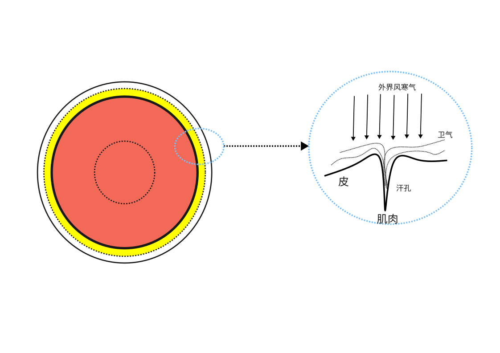

# 肌表功能的常态与异态

肌表部位为人体与外界的边界，承担着防御外邪进入，以及将内部邪气排出体外的功能。

## 肌表的常态

肌表功能的常态有以下几个方面：体温正常，对外界的寒热感受正常，能根据情况正常的控制出汗。

### 1、体温正常：

人的体温正常需要肌表部位获得适度的阴阳气血，如下图。

而该功能正常的前提是人体内部产生阴阳气血足够，并且传输阴阳气血的通道畅通。

人体的体温在内部气血不足的时候，可能会下降，出现皮肤发冷的情况。

> 伤寒，脉微而厥，至七八日，肤冷，其人躁无暂安时者，此为脏厥...
>
> 脏厥则是厥而肤冷，躁无暂安时

人体的体温在遇到外界邪气侵袭的时候，正气应对抗并驱逐邪气，在正邪对抗的时候，皮肤的温度会升高发热。这种升温是人体遇到外邪入侵的正常反应，属正常情况。

若人剧烈运动，体内产生大量热量，热量通过体表发散，肌表温度升高，这也是正常情况。

无论是正邪对抗发热，还是内热传至肌表发热，都是身体的临时应急机制，都是正常的。这些情况下，如果不发热，反而不正常。

### 2、对外界的感受

正常人对环境的感受应是正常的。中医说的恶寒、恶风、恶热等症状，指的是病人对正常的环境变化也感觉不适。比如室温环境下，正常人觉得很凉爽舒适，但是病人却觉得很冷，这就是恶寒。稍稍温暖的环境下，正常人不觉得热或者只觉得稍热一点，但病人却觉得很热，这就是恶热。恶风则是对正常的空气流动也感觉非常不适。这些都是人体对外界环境的适应能力失衡的表现。

人的卫气通过毛孔散布于肌表，可以保卫肌肤表面，抵御风寒之气的侵袭。若肌表的卫气不足，则人会有异常的恶风、恶寒的表现。

如果肌表的热量偏多，则人有恶热的表现。

### 3、汗

正常包括：

1、天气炎热或剧烈运动后，应该出汗。

2、常温天气且无剧烈运动则不应出汗。

3、人的肌表受到外邪侵袭的时候，正邪相争，正能盛邪，以微汗的形式将外邪排出体外而愈。

> 人在炎暑之际，皮腠疏松，同时由于阳热亢盛外发；或劳作，阳气受到扰动而外发，均能迫津外泄而汗出；人在寒凉之时，皮腠固闭，阳气内藏，因而无汗，或少汗，均属正常生理状态。

出汗功能的正常需要肌表部位的津液、血、营气、卫气都处于平衡状态时，且神的控制作用正常。任何一个要素失衡都可能造成出汗异常。

#### 原理常态：

汗的正常功能主要还是泻热与排毒。

当运动或者外界气温较高的时候，肌表的气血充足且偏热，热作用于津血，逼迫其出于汗孔，达到适度出汗以泻热目的。

当肌表有邪气的时候，人体自动调集气血来到表部，出汗以排出邪气。此时脉浮。

汗的机理是：需要出汗时，卫气打开汗孔，阳气推动血中津液出汗孔，化为汗而出。不需要出汗时，卫气关闭汗孔，则不会出汗。

健康的情况下，人体能对不同情况产生正确的出汗反应。比如天气炎热或剧烈运动后，会出汗；天气寒冷则不出汗。

> 人在炎暑之际，皮腠疏松，同时由于阳热亢盛外发；或劳作，阳气受到扰动而外发，均能迫津外泄而汗出；人在寒凉之时，皮腠固闭，阳气内藏，因而无汗，或少汗，均属正常生理状态。

出汗功能的正常需要肌表部位的津液、血、营气、卫气都处于平衡状态时，且神的控制作用正常。任何一个要素失衡都可能造成出汗异常。

中医治病对出汗的要求就是周身包括手足都出小汗，潮湿即可。因出汗需要消耗气与津血，所以不提倡大汗淋漓，大汗会消耗大量的阳气和津血，经常得不偿失。

> 凡发汗，欲令手足俱周，时出似漐漐然，一时间许益佳。不可令如水流离。若病不解，当重发汗。**汗多者必亡阳**，阳虚不得重发汗也。...
>
> “一时间许”则言发汗当持续一个时辰左右。
>
> 《伤寒论讲解-辨可发汗病脉证并治第十六》

## 肌表异常情况：

肌表出现异常的原因非常多，很难全面说明。这里把经典中谈到的一些情况适度整理，可以让人有所参考。

肌表的异常经常会有上述三类表现单独或者同时出现。下面具体说明

## 关于体温：

人的体温应该在一个正常范围内波动，如果遇到外邪的侵袭，正气在与之对抗的时候，体温会升高。正气获胜则体温恢复正常。这些都是正常现象。异常情况包括：

发热异常：

该热不热与不该热而热都属于发热异常。

比如有邪气入侵，但正气过于虚弱，不能对抗，则不发热，此为该热不热。

如果有邪气入侵，身体虽能正邪对抗而发热，但发热一直持续，体温没有恢复，为正邪胶着，势均力敌，此时应该用药帮助扶正祛邪，帮助身体正气打败邪气。

虽没有邪气入侵，但自身维持温度平衡的阴阳失衡，阳盛或者阴虚，都可以出现发热的现象，此为不该热而热。

发冷：

发冷为体温偏低，为阴盛或者阳虚，阳虚比较常见。

### 肌表温度异常

前已述，人之体温平时应正常，遇到特殊情况的时候应该发生变化。如未按照正常情况发展的皆为异常情况，需要采取措施进行调节。

#### 温度该升不升：

肌表受邪气侵袭时，应调动正气抵御，正邪相争应该温度提升。但是有邪气侵袭，温度却没有提升，说明正气不足，无法抗邪，邪气留于肌肤，甚至向内发展。

在《伤寒论》中，这种情况都是三阴病的表现。比如人有怕冷的表现，说明肌表卫气不足，寒气已经侵入。但是肌表却不发热，说明或为五脏衰弱，无力抗邪；或为通道受阻，气血不能输送到体表。

> 凡以恶寒为主而**不发热**的，多是**阳气虚衰，抗邪无力**的反映，所以都属阴证,是三阴经病。
>
> 《伤寒论讲解》

#### 温度该降不降：

若肌表有邪，则正邪对抗，温度升高而发热，但发热若一直持续较高而不降，说明正邪僵持，势均力敌，正气未能排除邪气，应使用药物扶正祛邪，帮助正气排除邪气。

> 太阳病，**发热**，汗出，恶风，脉缓者，名为中风。[2]...
>
> **发热**是风阳之邪伤及卫阳，卫阳起而抗邪，**正邪相争**的结果。

#### 温度不该升而升：

这种情况指肌表的温度升高，但并非人体正常功能正常的反应，而是身体某些部位功能失常的外在表现。

##### 肌表本身问题

平衡功能受损，比如该部位的阳盛或者阴虚或两者兼有，都可能造成皮肤温度的升高。

若内热外传，肌表温度提升，一直持续不降，为异常，需要进一步分析。

一般里热外传的原因是里部阳气过盛，阳气外越于肌表，体温升高。但也有里阴虚不能敛阳或者里阴盛格阳，导致肌表阳气过多的情况。

> 七十年代初，编者曾在山西稷山县治一患者，**高热**已十余天，午后体温达40℃，汗出，烦渴，恶热，脉大而数，西医用多种抗感染药物治疗无效。中医谓里热炽盛，用大剂白虎汤...患者素体脾胃虚寒，时便溏腹泻，服补中益气汤或附子理中丸始能好转。现病人虽**高热**，汗出，烦渴，喜冰，脉大数，一派阳症，但**大便仍溏软**，舌胖嫩，**苔转白不黄**，于是豁然开朗：此**阴盛格阳**，真寒假热证也。...改予参附汤...服用一剂后体温即下降至38℃，烦渴明显减轻。
>
> 《温病条辩讲解》

无论里部是阴虚、阴盛、阳虚、阳盛失衡，只要失衡都可能造成功能的下降，里部有敛藏阳气的功能，此功能异常即可造成阳气外越的表热实证。

此情况，关键问题在解决里证失衡，里位恢复平衡，表证自解。

###### 阳实：

肌表部位的阳气的量超过平衡标准为阳实，原因可以有三种：

1为外部温热邪气进入造成阳实

2为肌表卫气未能正常出腠理散布体表，郁积于皮下造成阳实发热。

###### 阴虚：

阴虚也是发热的主要原因，有人素体阴虚，外界温热邪气稍多即发热。也有因汗出过多造成阴虚发热的情况。

> 温属阳热之邪，最易伤阴。他说：“盖热病未有不耗阴者，其耗之未尽则生，尽则阳无留恋，必脱而死也”。“病温之人、精血虚甚，则无阴以胜温热，故死”。
>
> 《温病条辩》

##### 里部问题

为身体内部的阳气由里出表过多造成阳实

> 人体在致病因素作用下出现的发热，其发病机转主要有两个方面：
>
> 其一，由于体表的发散能力出现障碍，致使体内阳气得不到应有的散发，阳气郁遏，所以出现发热，这一类发热，中医学叫做表证发热，意即此类发热主要是人体肌表的发散作用障碍；
>
> 其二，由于体内阳热炽盛，此时人体肌表虽然尽量散热，但由于生大于散，所以仍不能使人体内外平衡协调，因而仍然出现发热，这一类发热，中医学叫做里证发热。
>
> 表证发热，由于发热机转在表，其临床指征为发热无汗或汗出不彻，所以在治疗上应予解表发汗。
>
> 里证发热，由于其发热机转在里，其临床指征主要为发热汗出而渴，所以在治疗上应予清里泻热。

#### 温度不该降而降：

肌表的阳气不足或者阴气过盛再或两者兼有，则肌表温度下降超过正常范围。

> 病人不但手足厥冷不回，而且**周身皮肤发凉**，并伴有肢体躁扰而无一刻安宁的证候，这是阴寒过盛，内脏阳气极衰，既不能温煦肢体，也不能充养精神所致，此即“脏厥”，而不是"蛔厥”，二者不得混淆。
>
> 《伤寒论讲解-337条》

> 无论伤寒、温病，大汗出之后，见**身凉**，手足凉，脉微细欲绝者，为阳气竭绝，病情危笃之象，多属不救。
>
> 《中医药学概论-问寒热》

### 感受之异常

#### 恶风：

人的肌表腠理汗孔打开的时候，体内天地之气与体外的天地之气的沟通会非常通畅。此时，若人肌表的阳气充足，可以抵御外界邪气的侵袭。但若肌表阳气不足，则人有明显的怕风的感觉。这种情况下，风气会从腠理进入体内成为邪气，同时其他寒、湿邪气也会跟随风气进入体表，成为病因。

同时风邪性开泻，体表受风后，容易造成腠理开而不闭，津液流出为汗。所以伤寒论开篇，太阳中风的典型症状是汗出、恶风。

#### 恶寒：

体表的卫气不足就会怕冷恶寒。这种不足产生的原因可有两种：发于阳或者发于阴。

> 病有发热恶寒者，发于阳也；无热恶寒者，发于阴也(1)。发于阳，七日愈；...，**凡以发热为主要特征的，都是阳气抗邪有力的反映**，所以都属阳证，是三阳经病。....**凡以恶寒为主而不发热的，多是阳气虚衰，抗邪无力的反映，所以都属阴证**,是三阴经病。

1、发于阳

外部的寒邪伤害了体表的卫气，使腠理关闭，卫气不能护卫肌表产生恶寒现象。一般这种情况，会有卫气与寒邪的对抗，正邪相争产生发热的现象。

> 岐伯曰：上焦不通利，则皮肤致密，腠理闭塞，玄府不通，卫气不得泄越，故外热。
>
> 《素问-调经论》

2、发于阴

人体卫气根源于下焦，资生于中焦，宣发于上焦，其中任何一个环节出现问题，都可能导致没有足够的卫气敷布于体表，进而产生恶寒的感觉。一般这种情况没有发热。

比如：肾阳不足，产生的卫气不够，就会有恶寒无热的情况。

> 六经病皆有恶寒，又各有特点，
>
> 太阳病是风寒外束，卫阳失于温煦，故而恶寒，且与发热并见，经过适当的治疗，恶寒一罢，则太阳病随之而愈。故前人有“有一分恶寒，便有一分表证"之说。
>
> 阳明病之恶寒，是由于阳郁不伸，卫阳一时失于温煦所致，很快邪归于胃，从燥而化，热象迅速出现，故云“二日自止”，这与太阳病因失治迁延八九日乃至十余日恶寒仍在，自是不能同日而语。
>
> 少阳病恶寒，是正邪相争，互有胜负，正胜则热，邪胜则寒，表现为寒热往来，若不予治疗，则迁延时日。
>
> 至于三阴病恶寒，是阳气虚衰，不能温煦，故但恶寒而不发热，这些恶寒与阳明病恶寒对比则绝然不同。
>
> 《伤寒论讲解-184条》

也可以有肾阳不虚，但在卫气传输到体表的过程中，受到阻碍而产生的体表卫气不足，产生恶寒。

> 可知阳气郁结往往可见类似阴寒的见证，即所谓"阳证似阴"。如第〔350〕条脉滑而厥的[白虎汤](https://www.gmzyjc.com/read/fjx/fjx04-0.1.0.0.0.md)证，第318条阳郁不伸的四逆散证，均必须综观全局，权衡六经，脉证合参，详审病机，才能探得疾病本质，不被假象所迷惑。例如本条阳微结，若误诊为纯阴结的少阴证，妄投姜、附温补，犹如负薪救火，必致僨事。
>
> 《伤寒论讲解-148条》

> 帝曰：阴盛生内寒奈何？
>
> 岐伯曰：厥气上逆，寒气积于胸中而不泻，不泻则温气去寒独留，则血凝泣，凝则脉不通，其脉盛大以涩，故中寒。

> 腹痛，脉弦而紧（1），弦则卫气不行，即**恶寒**（2）
>
> 《金匮要略-腹满寒疝宿食病脉证治第十》

卫气起到护卫体表的作用，此功能受损，则人有异常的怕冷的感觉，称为恶寒。

卫气根源于下焦，补充于中焦，宣发于上焦，通过三焦、经络输送到体表。此过程中任一环节出现问题，都可以造成体表卫气不足，而产生恶寒怕冷的现象。

比较常见的是普通人受到风寒侵袭，超出了其自身抵抗力，寒邪破坏了体表卫气工作机制，使其丧失护卫体表的功能,从而产生恶寒。

此种恶寒一般有发热的情况，

> "发热*恶寒*"为太阳伤寒证；
>
> 《伤寒论讲解-189条》

> 风寒之邪外伤太阳之气，使卫气不能温煦体表，故见恶寒。
>
> 《伤寒论讲解-第一条》

此时若寒邪同时破坏了卫气开合汗孔的功能，则无汗。

一般单纯中风邪，不会影响卫气开合汗孔的功能，所以单纯风邪，都有汗。

因此，在有恶寒、发热的情况，**有汗与无汗**是辨别中风与伤寒的主要标志。

> 中风与伤寒，以汗之有无，脉之缓紧为辨证眼目。至于中风之发热，身热而肌肤潮润；伤寒之发热，身热而皮肤干燥。中风之恶风寒轻，伤寒之恶风寒重，也都有辨证鉴别的意义。
>
> 《伤寒论讲解-3条》

对应治法，中风用桂枝汤，伤寒用麻黄汤。

> 太阳中风是风邪袭表，营卫不和，卫强营弱之证，治当解肌祛风，调和营卫，唯桂枝汤是至当之方，所以说“桂枝汤主之”。...
>
> "其人脉浮紧，发热汗不出”显系太阳伤寒表实证，其证属寒邪束表,卫闭营郁，当用辛温纯剂[麻黄汤](https://www.gmzyjc.com/read/fjx/fjx01-0.2.0.0.0.md)发汗启闭。

下焦阳气不足的恶寒，往往有手足凉，四肢末端温度低， 脉沉，没有身热的症状。

> **手足寒，为阳虚寒盛**，四末失温所致。脉沉，则主病在里，以与寒邪束表之身疼痛、骨节疼相鉴别。证属少阴阳衰，寒湿不化，故用附子汤温肾阳、化寒湿、止身痛为治。...
>
> 身痛一证，在太阳篇及少阴篇均有论述。但太阳病身痛因风寒之邪闭塞肌表所致，证当伴有头痛发热等，用麻、桂发汗解表，身痛自除。而少阴病身疼，因阳虚寒盛、寒湿凝滞所致，证当伴有**无热恶寒**，脉沉等，用[附子](https://www.gmzyjc.com/read/bc/bc07-0.1.0.0.0.md)汤扶阳抑阴，温化寒湿，身疼可解。
>
> 《伤寒论讲解-305条》

> 少阴病虚寒下利，当见*恶寒*踡卧，四肢厥逆，反映了阴寒极盛，阳气极衰。如果此时下利自止，手足逐渐由厥转温，纵有*恶寒*踡卧，亦不足为惧。

手足寒可以是下焦阳气不足，也可以是阳气在向四肢传递的过程中受到阻碍。比较而言，若是传输过程受阻，虽然四肢冷，但可有心腹热、心烦、喜饮冷水，小便赤的一些症状供鉴别。

> 证属少阴枢机不利，阳气被郁，故治用*四逆散*疏阳气，调气血。
>
> ...
>
> 此例患儿虽四肢逆冷，但胸腹灼热，心烦饮冷，小溲短赤，大便黑黄色而有窘迫感，舌深绛。系属利后，气失条达，阳气内郁而厥。故以*四逆散*解郁疏肝清热，药到病除。

伤寒多处提到，病人正常情况下，肌表受风寒的时候，应该怕冷欲得衣。但如果有内热，则可能不欲近衣。

> 太阳病吐之，但太阳病当恶寒，今反不恶寒，不欲近衣，此为吐之内烦也。[121]...
>
> “内烦”，即里热。太阳病误用吐法，致使胃中津伤，邪从燥化，而成“内烦”之证。里有热，故不恶寒，不欲近衣。

#### 恶热：

体表的阳气过多就会恶热。

比较典型的是伤寒阳明证的表里俱热，体表阳气过多。

> **问曰：阳明病，外证云何？答曰：身热，汗自出，不恶寒，反恶热也。[182]**...
>
> 阳明病热结在里，里热外达，表里俱热，无表邪故不恶寒，里热盛则反恶热。
>
> 《伤寒论讲解-182条》

也有里寒而表热，此情况为内部收藏阳气的功能失调，阳气不能内守，散于肌表。

> 盖风火暑三者为阳邪，与秽浊异气相参，则为温疠；湿燥寒三者为阴邪，与秽浊异气相参，则为寒疠。现在见证，多有肢麻转筋，手足厥逆，吐泻腹痛，胁肋疼痛，甚至反**恶热**而**大渴思凉**者。...
>
> 其周身**恶热喜凉**者，**阴邪盘踞于内，阳气无附欲散**也。阴病反见阳证，所谓水极似火，其受阴邪尤重也。诸阳证毕现，然必当脐痛甚拒按者，方为阳中见纯阴，乃为真阴之证，此处断不可误。
>
> 《温病条辨-补秋燥胜气论》

### 汗之异常

所谓出汗异常指的是该出不出或者不该出而出。比如盗汗、自汗、发热无汗、发热有汗等等。下面分别说明：

##### 汗该出而不出：

汗出的过程是神控制卫气打开腠理汗孔，阳气推动津液外出微汗。相关的要素有一个失衡都可能造成汗该出不出。

比如伤寒论提到的太阳伤寒，表有寒邪，应出汗而排出邪气，但寒气伤害了卫气开启汗孔的功能，使汗孔不开，则肌表无汗。

> **寒性凝敛，表闭无汗**，卫阳必郁，待阳气郁到一定程度才可见到发热，故伤寒之发热在后，中风之发热在先。
>
> 《伤寒论讲解》

> "汗不出者”身热而汗不出，有因表有寒邪，束于肌表，而汗不得外泄者。
>
> 《温病条辨-上焦-风温》

也有虽有内热应该出汗，但肌表津液不足，导致阴虚无汗。例如《温病条辨》中谈到，肌表有热但阴液不足而有热，汗无法排出，导致皮肤上出现斑疹。

> **发汗而汗不出者**，必发斑疹...若误用辛温发汗，反助其热，更伤阴液，**液耗则汗不能出**，热邪不透，使热郁肌表血分，而在皮肤上出现斑疹，使病情逆转。

> 有因**温病津液大亏，津伤无汗**，治当养阴以生津。
>
> 《温病条辨讲解-上焦-风温》

> 因此我们在临床上对于温病无汗，必须从病史和临床表现上以鉴别其发热性质，究属于**伤寒发热无汗**，或属于**温病误汗而致汗不出**；汗出过多系属于气虚自汗，或属于发汗汗出过多。这些在温病的临床辨证论治中都是关键之处。
>
> 《温病条辩讲解》

##### 汗不该出而出：

肌表如果没有邪气，也无热盛等特殊情况，不应出汗。

若出汗，多为肌表卫气太虚，不能控制好汗孔的开合，使汗孔常开，津液外流为汗。

> 中风因汗出营伤，后世称其为太阳病表虚证。伤寒因表闭无汗，后世称其为太阳病表实证。但这里，虚与实也是相对而言的，所谓表虚证，自然与**表气虚、表气不固，而见自汗出**，易感外邪的玉屏风散证不能相提并论，中风是因卫强而荣弱，邪盛而致虚，而玉屏风散证则纯属卫气不足。

如有里证，比如阳明热实，里部阳气过盛，阳气外越于肌表，导致表汗出。这种情况从肌表的角度说，有热而汗出泄热是正常的，但从整体角度看，里热实是一种失衡。

也有里阴虚不能敛阳或者里阴盛格阳，导致肌表阳气过多而肌表出汗的情况。

> 或阴虚不能敛阳，或阴盛格阳，阳气外越，津随阳去为汗。

> 七十年代初，编者曾在山西稷山县治一患者，高热已十余天，午后体温达40℃，**汗出**，烦渴，恶热，脉大而数，西医用多种抗感染药物治疗无效。中医谓里热炽盛，用大剂白虎汤...患者素体脾胃虚寒，时便溏腹泻，服补中益气汤或附子理中丸始能好转。现病人虽**高热，汗出**，烦渴，喜冰，脉大数，一派阳症，但**大便仍溏软**，舌胖嫩，**苔转白不黄**，于是豁然开朗：此**阴盛格阳**，真寒假热证也。...改予参附汤...服用一剂后体温即下降至38℃，烦渴明显减轻。
>
> 《温病条辩讲解》

无论里位的阳实、阴虚、阴实，都可能造成里位敛藏阳气的功能失常，造成阳气外越肌表而汗出的情况。

如果里阳虚，可以造成肌表卫气不足，不能正常关闭汗孔而出汗，这种汗一般是冷汗。

> 例如，阳虚冷汗，是由于阳虚导致卫外之气不能固表，使阴津不能安守于内而外泄；

##### 应微汗而大汗：

体表有邪，一般应该出微汗，排除邪气而愈。如果用药或护理不当，导致大汗淋漓，则可能产生肌表津液过虚的变证。

> **遍絷絷身微似有汗者益佳，不可令如水流离，病必不除**...但若汗不如法，而使大汗淋沥，则正气先伤，无力祛邪，不仅表邪难解，还易使变证丛生，故凡发汗，一定要遵守法度。
>
> 《伤寒论讲解》

> **太阳病，发汗太多（1），因致痉（2）。**...太阳病，病在表，以法当汗解，但不可以太过。因为人身之汗是以津液为基础，发汗太多，伤津耗液是其必然。...津液受伤，不能濡养筋脉，筋脉失去濡润，就会发生筋脉挛急的痉病。发汗太过，伤津耗液是因，致痉是果
>
> 《金匮要略讲解》

##### 汗应止而不止：

体表有邪，应出微汗而愈。若汗出病未愈，且汗出不止，此为异常。

此情况可能有风邪袭表，造成汗孔开而不闭，津液流出的病汗。

也有温热邪气袭表，热则腠理开，津液流出的病汗。

#### 总结：

对于异常出汗的原因，一般按照外感病和内伤病进行分析。

外感病指的是类似感冒类的病症，病因以外感六淫之气，病位在皮毛、腠理，症状包括发热、恶寒或恶风、头痛、身痛、肢痛、汗功能异常、鼻塞、舌苔薄白、脉浮等。

外感病邪伤害了腠理开合功能，使之不能正常开合。开而不合为异常的有汗，合而不开为异常的无汗。或者肌表部位的津液不足，即使汗孔开也无可能无汗。

内伤病则是除了皮毛、腠理之外的病症。病因为脏腑功能不足或不协调，再或者经络不通畅，导致肌表营卫出汗功能的异常。

> 在外感伤寒病中，有汗为表虚（中风），或为正气祛邪外出之象；
>
> 无汗为表实（伤寒）。
>
> 在温病无汗为温病初起，邪闭卫阳之表实证；
>
> 温病邪入营血而无汗，是热灼营血，津液不足，不能作汗。
>
> 温病有汗，又有大汗、脱汗、战汗等。
>
> 在内伤杂病，当汗而无汗，见于内燥伤阴，阴津不足之证；
>
> 有汗，又有自汗（指醒时有汗）、盗汗等不同。
>
> 内伤自汗，多为气虚、阳虚，肌表不固；
>
> 盗汗多为阴虚内热。

风邪：风性开泻，使汗孔开而不闭，营阴流出为汗，所以有汗，此为病汗

寒邪：寒性收引，是使汗孔闭而不开，所以无汗。

非正常原因的自发出汗为自汗，睡觉时出汗为盗汗等等。

## 综合：

以上分别分析了肌表温度平衡、护卫身体、出汗功能的正常与异常原理。因为这几大功能互相之间关系紧密，经常相互影响，因此我们再从病因角度进行组合分析。

#### 外感邪气：

##### 外感风邪：

这里的中风指的是肌表受到风邪的侵袭。

> 中风即伤于风。在这里是太阳病的一个证候名称，和后世所说的猝然晕倒，口眼㖞斜，偏瘫失语的中风病不同。

单纯说太阳中风，指的是只有这一个病因。意思是一个相对健康的人受到风邪侵袭，未能祛邪外出，正邪僵持出现的典型症状。

太阳中风有发热、汗出、恶风、脉缓的特征，兼第一条太阳病总纲的脉浮、头项强痛、恶寒的特征。

总结下来太阳中风应有的症状包括：发热、汗出、恶风、恶寒、头项僵硬疼痛、脉浮且脉缓。

> **太阳病，发热，汗出，恶风，脉缓者，名为中风。[2]**

其发生机理应为：

风邪侵袭腠理，导致汗孔开而不合，津液流出为病汗，汗出伤阴，导致营血津液都虚。

卫气抵抗风邪，正邪相争而发热。

发热不止，为正气驱邪能力不够。

卫气受损而恶寒，汗孔开而恶风。

正邪相争于表，所以脉浮。正气驱邪力量不足，所以脉缓。

风邪侵袭阳位，背为阳、上为阳，所以风邪容易聚集在后脑、后颈、后背。风邪入侵，导致经络气血流通不顺畅，所以有头项僵硬疼痛的症状。

标准治法：桂枝汤，解肌，补营卫之虚，正气足则祛邪外出，微汗而解（注意服法、剂量）；若头项僵硬疼痛明显，桂枝加葛根汤。

再次提醒：说太阳中风，指的是相对健康的人肌表受单一风邪，正邪对抗，正气未能完全战胜邪气的情况，用桂枝汤解决。相对健康、单一风邪、正邪僵持，这三个条件缺一不可。若不符合这三个条件，则需要根据情况对证治疗。

相对健康指的是人本身脏腑经络的机能正常，没有重大失衡。例如人本有内热之证，就能不算健康之人。若内热同时再外感风邪，则不能直接使用桂枝汤。

> **若酒客病，不可与桂枝汤（1），得之则呕，以酒客不喜甘故也(2)。[17]**...
>
> 本条举酒客病禁用桂枝汤为例，说明桂枝汤是甘温之剂，凡湿热内蕴，即使非酒客者，也应当慎用。

再比如虚弱之人，本身肌表卫气严重不足，在汗出腠理开的时候，若稍有微风，就可能造成风邪阻碍体表气血运行，甚至造成血凝滞于肌肤的血痹之病。这种卫气不足的程度很大，是一个主要病因，需要重点解决。

> 《素问•五藏生成论》说：“卧出而风吹之，血凝於肤者为痹”。尊荣人精髓虚少而骨弱肌肤盛，其劳少逸多，故阳不卫外为固而疲劳汗出，卧不时动摇则易召风邪，虽为微风亦可阻遏阳气运行，阳气不能畅达，血凝滞於肌肤而遂得为血痹之病。

这种情况下，可用黄芪桂枝五物汤方。此方为桂枝汤去甘草加黄芪，生姜加量。通过对比可以看出，是用黄芪补肺卫之虚。

具体参考《金匮要略讲解-血痹虚劳病脉证并治第六》

单一风邪指的是病因只有风邪，若风邪加上寒邪、热邪或暑湿之邪等等共同作用于肌表，则症状表现不同，治法也不同。

正邪僵持，表示双方力量势均力敌，正不能祛邪外出，邪也不能深入。若正能胜邪，则自然好转，不需用药。若邪能胜正，则邪气向内发展，症状发生改变，应根据邪气所在确定新的治法。

##### 外感寒邪

太阳伤寒,寒邪伤卫气，使卫气开合汗孔的功能失常，不能出汗。症状表现发热、恶寒、无汗、体痛、呕逆、脉紧。

> 太阳病，或已发热，或未发热，必恶寒，体痛，呕逆，脉阴阳俱紧者，名曰伤寒。

> 本条所述*温病*与风温，是为与中风、伤寒相鉴别而设。中风、伤寒、*温病*、风温，都有发热，若兼有汗出恶风的，是中风；若兼有无汗恶寒的，是伤寒；不恶寒而口渴的，是*温病*；汗出与口渴并见，而一身灼热的，是风温。临证当注意鉴别区分。

如果腠理不正常的开而不闭，则津液大量流失为汗，会造成津液虚的证

> 『津脱者，**腠理开**，汗大泄』。

腠理开的时候，外界的风邪容易通过此通道进入皮肤，人有怕风的感觉。

> 『风者，善行而数变，**腠理开**则洒然寒，**闭**则热而闷。其寒也，则衰食饮，其热也，则消肌肉，故使人怢栗而不能食，名曰寒热。』

肺主皮毛，腠理开合功能与肺的功能相互影响，肺气不通，会造成腠理不开，卫气被关闭在皮肤内，会造成皮肤热。

> 『上焦不通利，则皮肤致密，**腠理闭塞**，玄府不通，卫气不得泄越，故外热』。

当正常肌表受到外邪侵袭的时候，不同的外邪会伤害不同的方面，造成不同的后果。

风邪：症状特点是有汗、发热、恶风、脉浮缓。风邪伤害卫气对汗孔的开合功能，风性开泻，使汗孔开而不闭，营阴流出为汗，所以有汗，此为病汗。卫气被伤，护卫肌表功能下降，所以恶风；正邪相争所以发热。营卫俱伤，为虚，用桂枝汤补营卫津液，解肌祛风。正气补充后，正气胜出，微出汗排出各种邪气而愈，此为药汗。

寒邪：症状特点是无汗、发热、恶寒、脉浮紧。寒邪也伤害卫气对汗孔的开合功能，但寒性收引，是使汗孔闭而不开，所以无汗。邪气无出路，造成寒邪实。正邪相争，所以发热；卫气被伤，不能护卫肌表，所以恶寒。此时主要问题是汗孔关闭，所以用麻黄汤发汗散寒。

在表实证方面，这只是风、寒二邪，应该还有受温热邪气、暑邪、湿邪、燥邪等情况，以及几种邪气的组合，比如风温、暑湿等等。

在表虚证的方面，除了营卫虚，还有津液虚等情况。说太阳中风为虚证，指的是风邪导致了营卫之虚，此时应该是虚实都有，但治虚即可，用桂枝汤。

常见虚实夹杂的情况，比如既有津液虚，又有温热邪气。

还有神的控制失常，什么汗都不出。我见过脊髓神经受损的病人，无论多热都不出汗。

> 若五脏元真通畅，人即安和，……不遗形体有衰，病则无由入其**腠理**”
>
> “血弱气尽，**腠理开**，邪气因入”（《伤寒论•辨太阳病脉证并治》
>
> 

> 『卫气者,充皮肤,温分肉,**肥腠理**,司开合』。

> 请言解论，与天地相应，与四时相副，人参天地，故可为解。下有渐洳，上生苇蒲，此所以知形气之多少也。阴阳者，寒暑也，热则滋雨而在上，根茎少汁，人气在外，皮肤缓，腠理开，血气减，*汗大泄*，皮淖泽。寒则地冻水冰，人气在中，皮肤致，腠理闭，汗不出，血气强，肉坚涩。当是之时，善行水者，不能往冰，善穿地者，不能击冻，善用针者，亦不能取四厥，血脉凝结，坚搏不往来者，亦未可即柔。故行水者，必待天温，冰释冻解，而水可行，地可穿也。人脉犹是也。治厥者，必先熨调和其经，掌与腋，肘与脚，项与脊以调之，火气已通，血脉乃行。然后视其病，脉淖泽者，刺而平之；坚紧者，破而散之，气下乃止，此所谓以解结者也。

> 太阳之气行于体表，邪伤太阳，有病偏于**表**者，中风、伤寒是也，有病偏于**经**者、太阳经输不利证是也。但二者又不可截然分开，表证中可见头项强痛之经输不利，经输不利证中又可见汗出（或无汗）恶风寒等表证。太阳表证，治用汗法解表；经输不利证，重用[葛根](https://www.gmzyjc.com/read/bc/bc01-1.2.8.0.0.md)解经中之邪并配合解表，证与方药丝丝入扣。

### 汗：

#### 自汗：

广义上讲，所有不该出而出的汗都为自汗。狭义的自汗是指在没有天气炎热、剧烈运动等特殊情况下，自发的全身性、汗量不多的一种出汗。具体分类：

##### 肌表受风邪：

正常情况下，肌表受风邪侵袭，身体正气会与之抗争，通过出汗的形式排出风邪。正邪相争则发热，所以此时会有发热、汗出的情况。风邪排出后，正邪不再相争，发热情况也就消失了，身体就恢复健康。

但若发热、汗出的症状一直存在而没有消失，说明正气抵抗能力不足，不能顺利、完全的排出邪气。所以此时要帮助补充正气，增加抗邪能力，在伤寒论中，这种情况用桂枝汤。 

> **太阳中风，阳浮而阴弱，阳浮者，热自发；阴弱者，汗自出(1)，啬啬恶寒，淅淅恶风，翕翕发热(2)，鼻鸣干呕（3）者，[桂枝汤](https://www.gmzyjc.com/read/fjx/fjx01-0.1.0.0.0.md)主之（4）。[12]**...
>
> 卫阳抗邪而浮盛于外，其表现则是发热，所以说"阳浮者，热自发”...
>
> "阴弱”是指卫阳卫外失司之后，营阴不能内守，外泄而为汗，汗出伤营，营阴内虚，所以说"阴弱者，汗自出。”...
>
> 《伤寒论讲解-12条》

此时可能还会有头痛、怕风、怕冷、鼻鸣、干呕的症状。

> **太阳病，头痛，发热，汗出，恶风，[桂枝汤](https://www.gmzyjc.com/read/fjx/fjx01-0.1.0.0.0.md)主之。[13]**
>
> “太阳病"在此泛指一切表病，无论中风、伤寒、已治、未治，或是其他表证，只要见到头痛、发热、汗出、恶风等症的，便可使用[桂枝汤](https://www.gmzyjc.com/read/fjx/fjx01-0.1.0.0.0.md)，便是[桂枝汤](https://www.gmzyjc.com/read/fjx/fjx01-0.1.0.0.0.md)的适应证。...

但是判断是否使用桂枝汤，最主要的依据还是汗出。也就是受风邪后，可能有头痛、怕风等症状，也可能没有。但是若是有汗出而症状持续的情况，应考虑桂枝汤。

> 而四症中，最以汗出为关键。

桂枝汤的作用是在肌表这个位置上进行补虚，其中桂枝、生姜可以帮助卫气，芍药、大枣可以滋养营血。

> [甘草](https://www.gmzyjc.com/read/bc/bc17-0.1.8.0.0.md)甘平，炙用气温，可调阴阳，和中州，安内以攘外，配桂、姜辛甘化始以助卫气；配芍、枣，甘酸化阴以滋营阴。
>
> 《伤寒论讲解-12条》

一般认为太阳中风证为卫强营弱，这里的卫强应指的是身体调动、增强卫气来抵抗邪气，所以发热。但虽增强卫气，依然没能完全战胜邪气，所以需要姜、桂进一步增强卫气。

> 太阳病，发热，汗出者，此为营弱卫强

肌表受温热邪气：

> 自汗在外感则见于伤寒病之中风；温病之风温（热）壅肺、暑伤津气、温热郁遏等。自汗在内伤则多见于气虚、阳虚之证，为卫阳不固，阴津不能内守而外达。气虚自汗，自汗常作，动则益甚，多兼见少气懒言、面色无华。怠情嗜卧等症状。阳虚自汗，多兼见形寒肢冷、腹胀纳呆、便溏，或完谷不化、面色青白等寒象，阳虚自汗，又称为冷汗，多为脾肾阳衰。

#### 自汗：

广义上讲，所有不该出而出的汗都为自汗。狭义的自汗是指在没有天气炎热、剧烈运动等特殊情况下，自发的全身性、汗量不多的一种出汗。具体分类：

##### 肌表受风邪：

正常情况下，肌表受风邪侵袭，身体正气会与之抗争，通过出汗的形式排出风邪。正邪相争则发热，所以此时会有发热、汗出的情况。风邪排出后，正邪不再相争，发热情况也就消失了，身体就恢复健康。

但若发热、汗出的症状一直存在而没有消失，说明正气抵抗能力不足，不能顺利、完全的排出邪气。所以此时要帮助补充正气，增加抗邪能力，在伤寒论中，这种情况用桂枝汤。 

> **太阳中风，阳浮而阴弱，阳浮者，热自发；阴弱者，汗自出(1)，啬啬恶寒，淅淅恶风，翕翕发热(2)，鼻鸣干呕（3）者，[桂枝汤](https://www.gmzyjc.com/read/fjx/fjx01-0.1.0.0.0.md)主之（4）。[12]**...
>
> 卫阳抗邪而浮盛于外，其表现则是发热，所以说"阳浮者，热自发”...
>
> "阴弱”是指卫阳卫外失司之后，营阴不能内守，外泄而为汗，汗出伤营，营阴内虚，所以说"阴弱者，汗自出。”...
>
> 《伤寒论讲解-12条》

此时可能还会有头痛、怕风、怕冷、鼻鸣、干呕的症状。

> **太阳病，头痛，发热，汗出，恶风，[桂枝汤](https://www.gmzyjc.com/read/fjx/fjx01-0.1.0.0.0.md)主之。[13]**
>
> “太阳病"在此泛指一切表病，无论中风、伤寒、已治、未治，或是其他表证，只要见到头痛、发热、汗出、恶风等症的，便可使用[桂枝汤](https://www.gmzyjc.com/read/fjx/fjx01-0.1.0.0.0.md)，便是[桂枝汤](https://www.gmzyjc.com/read/fjx/fjx01-0.1.0.0.0.md)的适应证。...

但是判断是否使用桂枝汤，最主要的依据还是汗出。也就是受风邪后，可能有头痛、怕风等症状，也可能没有。但是若是有汗出而症状持续的情况，应考虑桂枝汤。

> 而四症中，最以汗出为关键。

桂枝汤的作用是在肌表这个位置上进行补虚，其中桂枝、生姜可以帮助卫气，芍药、大枣可以滋养营血。

> [甘草](https://www.gmzyjc.com/read/bc/bc17-0.1.8.0.0.md)甘平，炙用气温，可调阴阳，和中州，安内以攘外，配桂、姜辛甘化始以助卫气；配芍、枣，甘酸化阴以滋营阴。
>
> 《伤寒论讲解-12条》

一般认为太阳中风证为卫强营弱，这里的卫强应指的是身体调动、增强卫气来抵抗邪气，所以发热。但虽增强卫气，依然没能完全战胜邪气，所以需要姜、桂进一步增强卫气。

> 太阳病，发热，汗出者，此为营弱卫强

肌表受温热邪气：

> 自汗在外感则见于伤寒病之中风；温病之风温（热）壅肺、暑伤津气、温热郁遏等。自汗在内伤则多见于气虚、阳虚之证，为卫阳不固，阴津不能内守而外达。气虚自汗，自汗常作，动则益甚，多兼见少气懒言、面色无华。怠情嗜卧等症状。阳虚自汗，多兼见形寒肢冷、腹胀纳呆、便溏，或完谷不化、面色青白等寒象，阳虚自汗，又称为冷汗，多为脾肾阳衰。

