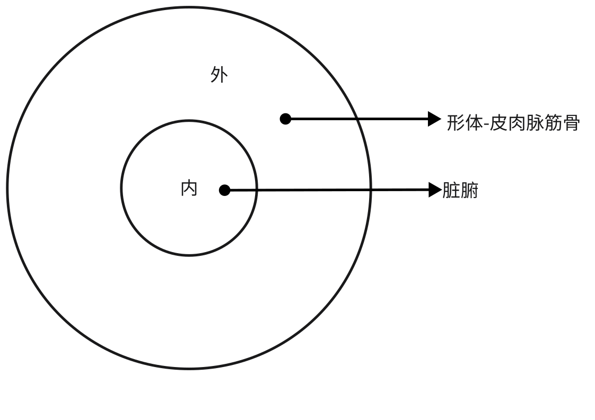
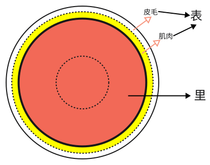
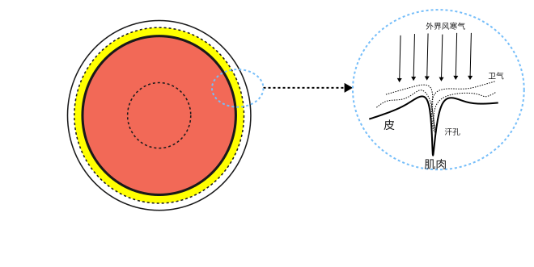
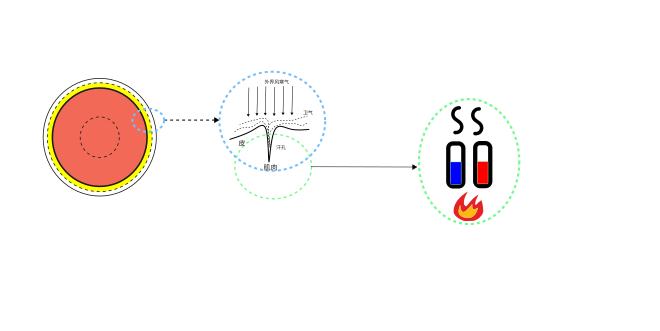
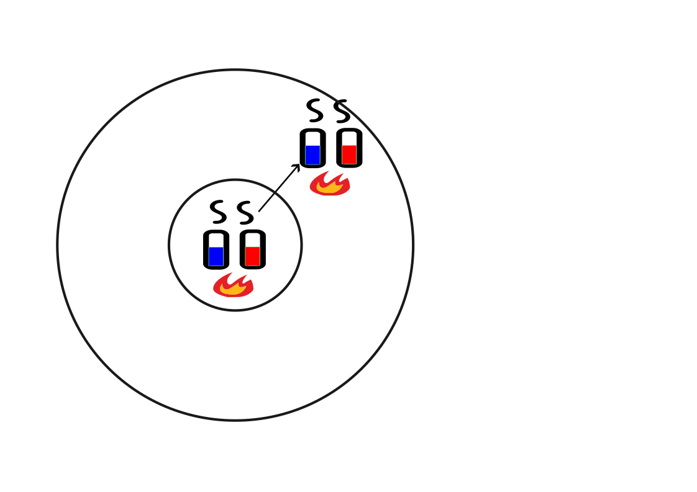

# 准备知识（草稿）

## 1、伤寒的整体思路

人体的整体机制为内在脏腑为外在形体提供气血支持。

形体中的肌表部位为与外部自然界的交接部位。

外界六淫之气时刻与肌表接触。肌表有一层卫气散布于表面，抵抗外界邪气的侵袭。

肌表能够抵御外邪，需要肌表的阴阳气血充足。

肌表的阴阳气血来自于内在脏腑。内在脏腑气血不足，则肌表气血必然不足，也必然抗邪无力。

另外，肌表的气血充足，还要求通道通畅。

### 3.2、整体失衡与差异失衡

如果气血出现了失衡，首先要观察一下是整体失衡还是差异失衡。

所谓整体失衡是指三部九侯各部位的失衡是一致的，比如整体有过大、过小、过数、过迟、过弦等失衡，这种偏性是整体性的，而非某处过大，某处过小。整体一致说明气血的流转没有阻碍，即便整体有偏，病因也还算单一。

差异失衡是指不同部位之间有明显的差异，比如芤脉是轻取明显，重按非常无力，如按葱管，表明里部气非常虚。而伏脉则相反，按至骨才有，说明表部气血非常少。再如结胸证的寸脉浮、关脉沉，100条的阳脉涩、阴脉弦，290条的阳微阴浮等等，都是不同部位有差异。不同部位的脉有明显差异，说明气血的流转未能均衡，原因复杂，需要结合具体情况分析。

### 3.3、不同部位之间的气血流动

气血可在内外部位以及上下部位之间流动。气血之中，气的流动更为敏感。当某个部位气过虚的时候，其它部位的气会流向该部位。中医称上焦为阳，下焦为阴，说明上下焦处在一个系统内，互相有所交互。这个道理类似一个房间有阴面和阳面，当阴面的气压低的时候，阳面的气就会流动到阴面，反之亦然。这是流动之物的特性，其本身会尽量趋向于平均。

> 脉有三部，阴阳相乘，**荣卫血气，在人体躬，呼吸出入，上下于中，因息遊布(1)，津液流通**。随时动作，效象形容(2)，

比如内部的气虚的时候，外部的气就会内陷。如果外部有邪气，则邪气也会随之进入内部。

> 趺阳脉迟而缓，胃气如经也。趺阳脉浮而数，浮则伤胃，数则动脾，此非本病，**医特下之所为**也。
>
> **荣卫内陷**，其数先微，脉反但浮，其人必大便鞕，气噫而除(1)。何以言之？本以数脉动脾，其数先微，故知脾气不治，大便鞕，气噫而除。今脉反浮，其数改微。邪气独留，心中则饥，邪热不杀谷(2)，潮热发渴，数脉当迟缓，脉因前后度数如法，病者则饥，数脉不时，则生恶疮也。
>
> 《伤寒论讲解-辨脉法-单元3》

在伤寒论中，这种情况往往是因为在不恰当的时机使用了下法或者吐法。肠胃实热造成大便干燥的情况往往需要使用下法，即使用承气汤类方剂。泻邪容易伤正，所以这种下法容易伤里部气血。如果该人本来有发热表证，里气被伤之后，邪热可能随之内陷而形成里部失衡。

> 若不宜下而便攻之，**内虚热入**，协热遂利，烦躁诸变，不可胜数，轻者困笃，重者必死矣⑸。
>
> 《伤寒论-伤寒例》

> **病发于阳，而反下之，热入因作结胸**⑴
>
> 《伤寒论讲解-131条》

> 太阳病，脉浮而动数，浮则为风，数则为热，动则为痛，数则为虚⑴，头痛发热，微盗汗出，而反恶寒者，表未解也⑵。医反下之，动数变迟⑶，膈内拒痛⑷，一云头痛即眩。胃中空虚，客气动膈，短气躁烦，心中懊憹⑸，**阳气内陷，心下因鞕，则为结胸**，大陷胸汤主之⑹。若不结胸，但头汗出，余处无汗，剂颈而还，小便不利，身必发黄⑺。[134]

> 太阳病，六七日表证仍在，脉微而沉，**反不结胸**，其人发狂者，以**热在下焦**，少腹当鞕满，小便自利者，下血乃愈。所以然者，以太阳随经，瘀热在里故也⑴，抵当汤主之⑵。[124]

同理，上下焦的气血也是一对阴阳。若上焦气血虚，此时下焦气可能进入上焦。因下焦偏寒，所以人可能会恶寒。反之，下焦气血虚，此时上焦气可能进入下焦，因上焦偏热，所以可能会发热。

> 问曰：病有洒淅恶寒，而复发热者何？答曰：阴脉不足，阳往从之，阳脉不足，阴往乘之。
>
> 曰：何谓阳不足？答曰：假令**寸口脉微，名曰阳不足，阴气上入阳中，则洒淅恶寒也**。
>
> 曰：何谓阴不足？答曰：**尺脉弱，名曰阴不足，阳气下陷入阴中，则发热也。**
>
> 《伤寒论讲解-辨脉法-单元1》

注意此处提到的发热、恶寒，和肌表受风寒之邪，气血波动于肌表抗邪，产生发热、恶寒症状的原因是不同的。彼情况的脉象为脉浮，此情况为寸脉或尺脉微弱。

理解了这个道理，就可以理解伤寒中里气外出，表气内陷，以及阳气下陷和阴气上冲的原理。

## 4、里气不虚原则

《概念入门》中，在病证轻重传变章节，谈到中医治病的核心原则就是：对五脏疾病存在严重正虚邪实的情况，以扶正祛邪的方法，恢复正气，减少邪气，使其向腑病转化，由吐或下的方式排出；或由里病向表病转化，以汗的形式排出。部位由里到外，程度由重向轻，即是常说的“阴证转阳证”，直至治愈。

这个原则的意思是脏腑，特别是五脏对人体最重要，当对外感病进行治疗的时候，要注意里病和肌表病的关系，时刻保证里气不虚为原则。

这个原则在伤寒论中主要指下面几个方面：

一、里部无病而有外感之人，其治法应遵循规矩，不要因为治法的错误伤了里气。

二、里部正气已虚之人同时有外感病。如果里部之虚较重，已经影响了五脏的正常功能，应优先治疗。这里的正虚包括阴虚、阳虚、气虚、血虚。这就是“虚人伤寒建其中”原则。

三、如果里部正气不虚而邪气实的人同时有外感病，则哪里紧急治哪里，但通常先解表后泄下。原因前面已述，如果里实不急的话，先祛里邪容易伤里部正气，进而导致表部邪气传入里部，产生其它复杂变化。这就是“实人伤寒发其汗”原则。

> **本发汗，而复下之，此为逆也。若先发汗，治不为逆⑴。本先下之，而反汗之，为逆。若先下之，治不为逆⑵。[90]**
>
> 表证兼里实，当先表后里，先汗后下，这是一般原则。后人归纳这一原则为“实人伤寒发其汗”。
>
> 但在表证轻而里实证重且急的特殊情况下，则当急者先治，先里后表，先下后汗。治法适宜，汗下有序，则邪去病愈；先后误施，汗下失序，则会导致变证丛生。
>
> 后世逐渐发展起来的一些解表攻里，表里双解的方法，在一定程度上对《伤寒论》有关这方面的治则作了补充，临证亦可酌情施用。
>
> 《伤寒论讲解-90条》

这三个方面本质都是一个，就是五脏不可虚。

《入门》中谈到最重的情况是五脏有严重的正虚邪实，最轻的情况是肌表有轻微的正虚邪实。伤寒论太阳三篇从肌表加太阳中风的桂枝汤证到心阴阳两虚的炙甘草汤证，非常好的展示了这种疾病由轻到重的发展进程。

### 里虚举例

29条，有表证也有心烦、小便频数、小腿抽筋的里证。心烦、小腿抽筋为里部阴血虚。小便频数为里部阳虚。此时先治表为错误，会导致更严重的里虚，导致厥（手脚寒凉），咽干，烦躁，甚至吐逆。补救方法为先用甘草干姜汤恢复里阳，这样手脚寒凉恢复正常。再用甘草芍药汤恢复里阴，小腿抽筋恢复正常。

> 伤寒，脉浮，自汗出，小便数，心烦，微恶寒，脚挛急，**反与桂枝欲攻其表，此误也**⑴。得之便厥，咽中干，烦躁、吐逆者，作甘草干姜汤与之，以复其阳⑵。若厥愈足温者，更作芍药甘草汤与之，其脚即伸⑶。若胃气不和，谵语者，少与调胃承气汤⑷。若重发汗，复加烧针者，四逆汤主之⑸。[29]

50条，有表证脉浮紧、身痛，如果有尺脉迟的里虚证，不能发汗，需要先补里虚，使之恢复正常后，才能发汗。

> **脉浮紧者，法当身疼痛，宜以汗解之。假令尺中迟者，不可发汗。何以知然？以荣气不足，血少故也。[50]**

91条的肌表伤寒证加里阳虚证，应该先治疗里阳虚，再治疗肌表证。下利不止，且泻下物中含有未消化的食物，即为清谷不止。这表明里部的阳气不足，无法消化水谷，应用四逆汤治疗。身体疼痛，代表肌表的邪气未解，需待里阳虚治好后，再用桂枝汤治疗身体疼痛的表证。

> 伤寒，医下之，续得下利，**清谷不止**，身疼痛者，**急当救里**，后身疼痛，清便自调者，**急当救表**。救里宜四逆汤，救表宜桂枝汤。[91]

> 脉浮而迟，表热里寒，下利清谷者，四逆汤主之。[225]

98、99、100条的少阳加里虚证，需要先治疗里虚然后再治疗少阳。

> 得病六七日，脉迟浮弱，恶风寒，手足温⑴。医二三下之，**不能食**而胁下满痛，面目及身黄，颈项强，小便难者，与柴胡汤，后必下重⑵。本渴**饮水而呕者**，柴胡汤不中与也，食谷者哕⑶。[98]
>
> 伤寒四五日，身热，恶风，颈项强，胁下满，手足温而渴者，小柴胡汤主之。[99]
>
> **伤寒，阳脉涩，阴脉弦，法当腹中急痛⑴。先与小建中汤**，不差者，小柴胡汤主之⑵。[100]

心阴阳俱虚，脉的跳动已经不均匀，时跳时停，心中动悸不安，此时即使有表邪也无暇顾及，需要先补里虚，用炙甘草汤。

> **伤寒，脉结代，心动悸⑴，炙甘草汤主之⑵[177]**
>
> 太阳病三篇，以风寒外袭太阳起病，到少阴心阴阳两虚之证收尾，也揭示了外感病由表及里，由阳入阴的发展趋势，从而提示了早期治疗的重要性。
>
> 《伤寒论讲解-177条》

还有很多条文是这种情况，不一一举例。

### 里实兼表证举例

164条，心下痞证，同时有表证。先解表，再攻痞。

> 伤寒大下后，复发汗，心下痞，恶寒者，表未解也。**不可攻痞，当先解表，**表解乃可攻痞。解表宜桂枝汤，攻痞宜大黄黄连泻心汤。[164]

106条，热结膀胱，其人如狂。若同时有表证，需先解表证，再攻下焦之血、热。

> 太阳病不解，热结膀胱，其人如狂，血自下，下者愈⑴。**其外不解者，尚未可攻，当先解其外；**外解已，但少腹急结者，乃可攻之⑵，宜桃核承气汤⑶。后云，解外宜桂枝汤。[106]

163条，里实兼表证，治法错误，表证未解而用下法，导致协热利。

> 太阳病，**外证未除而数下之**，遂协热而利⑴。利下不止，心下痞鞕⑵，表里不解者，桂枝人参汤主之⑶。[163]

阳明病不怕冷，有潮热代表里实，代表外证已解，可用下法。怕冷，无潮热，表证未解，不可下。手足濈然汗出，有潮热，不怕冷，可用大承气汤。无潮热，腹大满不通，用小承气汤，不能大下，免伤里气。

> 阳明病脉迟，虽汗出，不恶寒⑴者，其身必重，短气腹满而喘，有潮热者，**此外欲解，可攻里**也⑵。手足濈然汗出者，此大便已鞕也，大承气汤主之⑶。若汗多，微发热恶寒者，外未解也，其热不潮，未可与承气汤⑷。若腹大满不通者，可与小承气汤，微和胃气，勿令至大泄下⑸。[208]

脉沉为气血在里。发汗需要将气血驱动于体表

> **伤寒四五日，脉沉而喘满，沉为在里，而反发其汗，津液越出，大便为难，表虚里实，久则讝语。[218]**

## 5、

治阳则耗阴，阴足则转阳。

> 身半已上者，邪中之也(1)；身半已下者，湿中之也(2)。故曰：邪之中人也，无有常，中于阴则溜于腑，中于阳则溜于经(3)。...
>
> 所以邪入于阴经而脏气实，则邪气不能循经入脏，而外出于脏之表——腑。
>
> 如伤寒少阴三急下证，少阴病得之二、三日，出现阳明腑实之象，或少阴病六、七日，腹胀不大便者，即是邪中少阴，传之于阳明，成为阳明腑实证的典型例子。治当大承气汤急下之，腑实去而脏阴存，则病可愈。
>
> 若邪入于阳，正气未虚，邪气不能深入，可循所在部位的经脉传变。
>
> 邪传太阳，邪气从太阳之脉下项、挟脊抵腰中，证见项背痛，腰脊强，治当发散风寒、祛邪外出；
>
> 若邪传少阳，则邪气从少阳之脉循胸，过季胁，常见胸胁胀痛，治当枢转经气，和解少阳；
>
> 若邪传阳明，则邪气从阳明之脉循腹里，达肌肉，常见肌肉酸胀疼痛，或腹部疼痛之症，治当于表剂之中，配伍葛根、白芷之类的阳明经药，以专行阳明，而祛邪外出。方如柴葛解肌汤。

> 此三经皆受病，未入于府者，可汗而已⑶。...此三经皆受病，已入于府，可下而已⑸。
>
> 《伤寒论-伤寒例》

> 黄帝曰：其中于阴，奈何？岐伯答曰：中于阴者，常从臂胻始。夫臂与胻，其阴皮薄，其肉淖泽，故俱受于风，独伤其阴。
>
> 黄帝曰：此故伤其藏乎？岐伯答曰：身之中于风也，不必动藏。故**邪入于阴经，则其藏气实，邪气入而不能客，故还之于腑**。故中阳则溜于经，中阴则溜于府。

> 阳明三急下证，是阳明腑实证，病势急，发展快，恐有劫灼少阴真阴之虑，当用大承气汤急下以存少阴之真阴。
>
> 少阴三急下证，是少阴阴虚，邪从热化。复传阳明，燥热内盛，病势危重，大有阴亡水竭之势，亦必釜底抽薪以存阴液。
>
> 《伤寒论讲解-322条》

## 6、伤寒难懂名称解释

### 症状类

#### **哕**

发音(yuě)，即呃逆，俗称打呃。胃气上逆导致喉间发出连续的呃呃声、声短而频率高，自己控制不住。重病之人出现本现象，胃气衰败的征兆，不是好现象。在伤寒中，用这个词多出现在严重误治之后，代表胃气衰败，比较严重。

> 中气被伤，气逆则“**哕**”(yue)，即呃逆。
>
> **哕**即呃逆，重病见之，多是胃气衰败之兆

**嗌**（yì益）：即咽喉。

**厥**：在伤寒中，厥是指手足逆冷。

