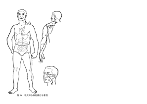

# 太阳病

### 基本表现

头项疼痛

> 尺寸俱浮者，太阳受病也，当一二日发。以其脉上连风府，故**头项痛**，腰脊强。

> 太阳之为病，脉浮，**头项强痛**而恶寒。[1]

腰脊强

> 尺寸俱浮者，太阳受病也，当一二日发。以其脉上连风府，故头项痛，**腰脊强**。
>
> 太阳病，**项背强几几**，反汗出恶风者，桂枝加葛根汤主之。[14]

## 病因

病因有多种，《伤寒论》主要谈的是风与寒，但也少少谈了热、湿、暑，以及津血虚造成的痉病。谈这几种情况是为了与伤寒相鉴别。

> 伤寒所致太阳病，痓⑴湿⑵暍⑶此三种宜应别论，以为**与伤寒相似**，故此见之。

### 太阳中风：

> 太阳病，发热，汗出，恶风，脉缓者，名为中风。[2]

> 太阳中风，阳浮而阴弱，阳浮者**，**热自发；阴弱者，汗自出⑴，啬啬恶寒，淅淅恶风，翕翕发热⑵，鼻鸣干呕⑶者，桂枝汤主之⑷。[12]

### 太阳伤寒：

> 太阳病，或已发热，或未发热，必恶寒，体痛，呕逆，脉阴阳俱紧者，名为伤寒。[3]

### 太阳中湿

> **太阳病，关节疼痛而烦，脉沉而细者，此名湿痹**...
>
> 湿为六淫之一，伤人亦由外入而起于太阳，故云“太阳病”。
>
> 《伤寒论讲解-辨痓湿暍脉证第四》

### 太阳中暑（**暍**）

> **太阳中热者，暍是也。其人汗出、恶寒、身热而渴也。**...
>
> “太阳中热”，即是太阳被暑热所伤，也就是暍病。暑热伤人，邪热蒸腾，故见身热；热迫津越，故见汗出；汗出肌疏，腠理开泄，热盛伤气，表气不固，不胜风袭，故见畏恶风寒。热灼津液，汗出液耗，津不足则引水自救，故而口渴。此为暑热伤人之主证，治当清热益气生津。《金匮要略》主以白虎加人参汤，甚是。
>
> 《伤寒论讲解-辨痓湿暍脉证第四》