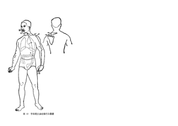
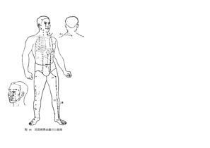

# 阳明病

## 阳明功能

阳明经部位涉及手足的前外侧。

阳明的腑器为胃与大肠，涉及人体的饮食、磨化、腐熟、糟粕排出体外

> 胃与脾同居中州。胃主燥，以降为和，脾主湿，以升为健，脾胃相关，阴阳相调，燥湿相济，升降相因，共同完成水谷的受纳、磨化、腐熟，以及营养物质的吸收、转输功能，故脾胃为水谷之海，而为后天之本。

阳明病的出现有可能为肌表之邪直接传入，也可能为它经传经而来，其中以太阳经或少阳经这两个相邻经络为主。当然也不排除从其有表里关系的太阴经传来。

## 阳明病的来路

### 如果是肌表之邪直接传来：

阳明病若为肌表之邪传来，其主要表现是身体发热，有汗，不怕冷而怕热。其中怕热是与太阳病怕冷症状的一个显著区别。这种怕热的原因是阳明多气血，阳气旺盛。阳明的阳气受邪气干扰而外泄，弥漫全身，所以出现里外皆热的特点。

虽然阳明病的主要表现为怕热，但是得病的第一天，邪气还没有入里，依然可以表现出表证的怕寒情况。但是这个情况出现的时间很短，一日之后，就会转变为阳明的主症怕热。

> **问曰：病有得之一日，不发热而恶寒者，何也⑴？答曰：虽得之一日，恶寒将自罢，即自汗出而恶热也⑵。[183]**
>
> **问曰：恶寒何故自罢？答曰：阳明居中，主土也，万物所归，无所复传⑴，始虽恶寒，二日自止，此为阳明病也⑵。[184]**

此时会出现脉象宽阔的洪大之像。

> **伤寒三日，阳明脉大。[186]**

### 如果是从太阳病传变而来

太阳病转阳明有三种情况：

1、发汗太过，伤了津液，导致表热入里，胃强脾弱，脾不能行津液，使大便燥结。

> **问曰：何缘得阳明病？答曰：太阳病若发汗，若下，若利小便，此亡津液，胃中干燥，因转属阳明⑴；不更衣、内实、大便难者，此名阳明也⑵。[181]**

> (1)太阳阳明者，……是也：太阳病汗不得法，或误用吐、下、利小便等法，徒伤津液，使表邪入里，化为燥热，约束脾阴，不能为胃行其津液，而反小便频数，大便秘结，则称为“脾约”之证，名曰太阳阳明。

此处应参照237条的脾约证治条文。

> **趺阳脉浮而涩，浮则胃气强，涩则小便数，浮涩相搏，大便则鞕，其脾为约⑴，麻子仁丸主之⑵。〔247**〕...
>
> 本条介绍了阳明病的又一种类型，即胃强脾弱之脾约证。其主要特点是大便硬而难出，但不见发热汗出及腹满硬痛等大实证，不宜承气汤类攻下，应以麻子仁丸润下。临床上多见于年老及亡血阴亏者。
>
> 《伤寒论讲解-247条》

2、发汗不彻，邪热入里化燥。

> **本太阳初得病时，发其汗，汗先出不彻，因转属阳明也⑴。**
>
> 《伤寒论-185条》

3、未经发汗或误治，阳郁化燥，内热转甚。

> **伤寒发热，无汗，呕不能食，而反汗出濈濈然者，是转属阳明也⑵。[185]**
>
> 《伤寒论-185条》

> **问曰：何缘得阳明病？答曰：太阳病若发汗，若下，若利小便，此亡津液，胃中干燥，因转属阳明⑴；不更衣、内实、大便难者，此名阳明也⑵。[181]**

> 综合第〔179〕条、第〔181〕条、第〔185〕条进行分析，可知太阳病转属阳明有以下三种情况：一是发汗太过，伤津耗液；二是发汗不彻，邪热入里化燥；三是未经发汗或误治。阳郁化燥，内热转甚。

### 如果是从少阳传变而来

少阳以和法治疗，不用汗法、下法。误用汗下，可能转阳明。

> **少阳阳明者，发汗利小便已，胃中燥烦实，大便难是也⑶。[179]**...
>
> 少阳病误用汗、吐、下等法，损伤津液，少阳邪气由热化燥入于阳明，形成胃中燥热实证，而见大便困难，名曰少阳阳明。

少阳病用小柴胡汤正治，也可能转阳明。

> **服柴胡汤已，渴者属阳明，以法治之 ⑷。[97]**
>
> 《伤寒论讲解-97条》

### 从表里之太阴转变而来

> 伤寒脉浮而缓，手足自温者，是为系在**太阴**⑴。太阴者，身当发黄；若小便自利者，不能发黄⑵，至七八日大便鞕者，为**阳明病**也⑶。[187]...
>
> 小便自利，则湿去热留，**太阴之热郁久，外出阳明，从阳化燥，大便则硬，又形成胃家实证，故曰“此为阳明病也**”。

## 阳明病的表现

阳明部位多气血，被邪气入侵容易出现燥为主的病证，但也有寒、热的病证。

### 阳明燥热伤阴证

> **伤寒若吐，若下后，不解，不大便五六日，上至十余日，日哺所发潮热，不恶寒，独语如见鬼状⑴。若剧者，发则不识人，循衣摸床，惕而不安，**一云顺衣妄撮，休惕不安。**微喘直视，脉弦者生，涩者死⑵。微者，但发热讝语者，大承气汤主之；若一服利，则止后服⑶。[212]**

> **阳明病，其人多汗，以津液外出，胃中燥，大便必鞕，鞕则讝语，小承气汤主之。若一服谵语止者，更莫复服。[213]**

阳明病的来路如果是其它经传入而来，基本都表现为燥证，成为燥性的便秘，而且不再传它经。

> 从病理而言，阳明以燥为本，诸经病证，无论表、里、寒、热，只要并入阳明，则必从燥化，因燥成实，故曰“万物所归”。一但邪从燥化成实，实则秘固，复得通畅则生，止于秘固则死，尚何复传？故曰“无所复传。”

身热

怕热

出汗，微汗且连绵不断。身热不随汗出而衰弱，此点区别于太阳病的汗出热退。

> 伤寒转系于阳明时，其人则濈然汗出，虽然初起汗出虽微，但连绵不断，汗出而热不衰，是为阳明内热炽盛，迫津外出所致。由于不断汗出，必致津伤化燥成实。

> **问曰：阳明病，外证云何？答曰：身热，汗自出，不恶寒，反恶热也。[182]**

脉大

> 三日则里热大盛，阳明又为多气多血之经，正盛邪实，阳热亢盛，鼓动气血，故脉应之而大

#### 阳明经证

腹满而喘

> “发热恶寒”为太阳伤寒证；**腹满而喘是阳明经证，经热亢盛，气机壅实**。此为三阳合病之证。

### 阳明虚寒

阳明中寒，

不能食，

食难用饱，

> 传经之邪一般多从阳化热，直接受邪则有中风、中寒之不同。今以能食与否来辨中风、中寒，从中可以会到辨证方法。一般说“外因通过内因而起作用”，因此无论中寒、中风，还要看阳明本身阳气旺盛与否，津液存亡与否。胃阳旺盛，津液亏乏，感受外邪，易为阳明中风，而能食；若胃中虚冷，水湿不化，感受外邪，多为阳明中寒而不能食。

> **阳明病脉迟⑴，食难用饱，饱则微烦⑵，头眩，必小便难，此欲作谷疸⑶。虽下之，腹满如故⑷。所以然者，脉迟故也⑸。[195]**

> **阳明病法多汗⑴，反无汗，其身如虫行皮中状者，此以久虚故也⑵。[196]**

### 阳明中风

> 阳明病，若**能食名中风**；不能食，名中寒。[190]

### 阳明病偏表证

> 病人烦热，汗出则解⑴。又如疟状，日晡所发热者，属阳明也⑵。脉实者，宜下之；**脉浮虚者，宜发汗。**下之与大承气汤，**发汗宜桂枝汤⑶**。[240]

> 