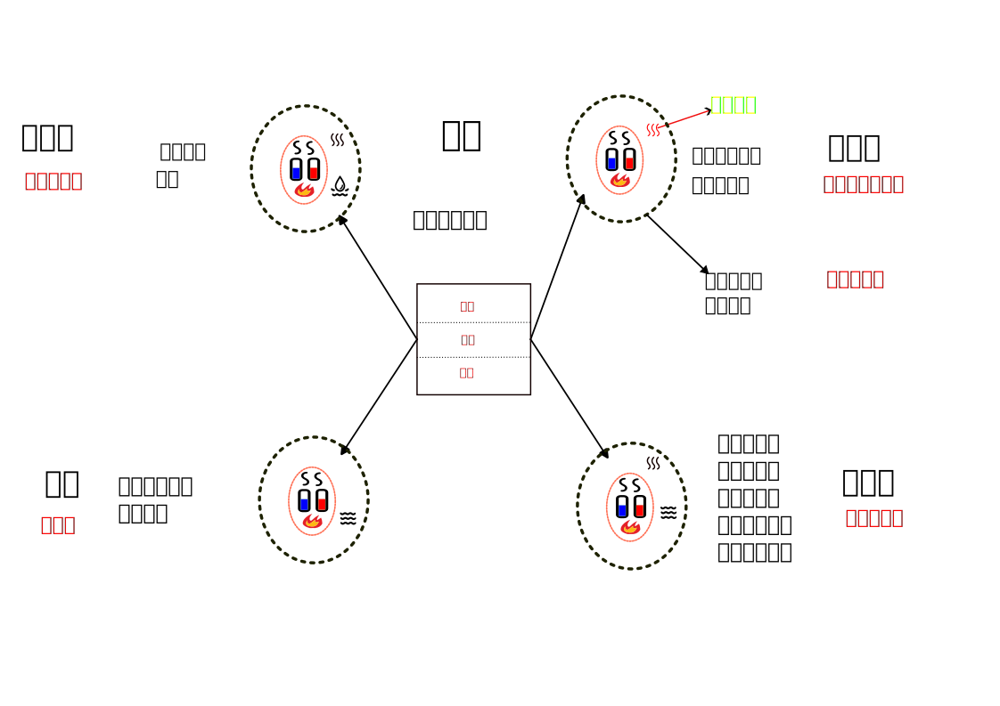

# 伤寒论起始标准

入门中讲了人体各个部位的划分，以及每个部位都可以有虚实病证。

这里以三阴三阳划分的太阳部位发病为例，谈谈辩证及治疗的方法。主要依据《伤寒论》的太阳三篇。

《伤寒论》的太阳篇，共178条，接近总数的一半。如果能读懂太阳篇，基本上就读懂了伤寒论的主要逻辑。

太阳篇以常人风寒外感侵袭肌表，为起始。到内伤五脏，以心阴、心阳俱伤为结束。论述了一段典型的疾病由外传内，由轻转重的变化过程。

治法方面：以桂枝汤治疗常人肌表受邪为开始，以炙甘草汤治疗心之阴阳两虚为结束。此过程中，随着病位深浅、病性虚实、程度轻重的变化，其表现各异，治法亦随之而变。

入太阳区域，脉浮缓、头项僵硬疼痛、恶寒、恶风、发热、有汗，桂枝汤治疗。

> 太阳病三篇，以风寒外袭太阳起病，到少阴心阴阳两虚之证收尾，也揭示了外感病由表及里，由阳入阴的发展趋势，从而提示了早期治疗的重要性。
>
> 《伤寒论讲解-177条》

正常人感受正常的风寒之邪，出现正常的表现，采用正常的治法，并进行正常的护理。

### 正常病因

### 1.1 正常表现

太阳病：脉浮、头项强痛、恶寒

> **太阳之为病，脉浮，头项强痛而恶寒。[1]**

此时只说是太阳经表部位有问题，未说是何种问题。其共性表现为脉浮、头项僵硬疼痛、怕冷。

### 1.2 病因风

#### 风邪问题

> **太阳病，发热，汗出，恶风，脉缓者，名为中风。[2]**

> **脉浮而数，浮为风，数为虚，风为热，虚为寒，风虚相搏，则洒淅恶寒也。**

### 治法原理

驱动气血走肌表。

### 1.3 正常方药

太阳病风寒，无论中风还是伤寒，有汗出，用桂枝汤

> 太阳病，头痛，发热，汗出，恶风，桂枝汤主之。[13]

> **太阳中风，阳浮而阴弱，阳浮者，热自发；阴弱者，汗自出⑴，啬啬恶寒，淅淅恶风，翕翕发热⑵，鼻鸣干呕⑶者，桂枝汤主之⑷。[12]**

> **太阳病，外证未解，脉浮弱者，当以汗解，宜桂枝汤。[42]**

> 太阳病，外证未解；不可下也，下之为逆。欲解外者，宜桂枝汤。[44]

> 太阳病，先发汗不解，而复下之，脉浮者不愈。浮为在外，而反下之，故令不愈。今脉浮，故在外，当须解外则愈，宜桂枝汤。[45]

药解：

大枣补气、补津液、助十二经。

桂枝补心阳，芍药补中下焦的阴气，肝阴。

生姜补阳气，走全身。

### 1.5 正常用法：

桂枝汤本为解肌，解肌即为将气血送至肌的层面，想要到表需要配热粥、温覆，方可出汗。

发汗以全身微汗为度，保持状态2小时左右。微汗是身体薄薄一层汗，如果过汗，汗像水流一样，属于过量。过汗伤阳，也伤阴，病可能也不会好。

> 服已须臾，歠热稀粥一升余，以助药力⑹。温覆令一时许，遍身絷絷微似有汗者益佳，不可令如水流离，病必不除⑺。若一服汗出病差，停后服，不必尽剂⑻；若不汗，更服依前法；又不汗，后服小促其间⑼，半日许令三服尽；若病重者，一日一夜服，周时⑽观之，服一剂尽，病证犹在者，更作服；若不汗出，乃服至二、三剂。禁生冷、粘滑、肉面、五辛、酒酪、臭恶等物⑾。

喝一碗能出汗，就不用再喝了。不出汗则再喝。虽然说一天喝三次，如果病情严重，半天喝完三碗也是可以的。

出汗后，如果病好了，就不必再喝。

如果当时好了，过了半天又犯。检查脉还是浮，这是没好撤店，可以再发一次汗。

> **伤寒发汗已解，半日许复烦，脉浮数者，可更发汗，宜桂枝汤。[57]**

吃完一剂药不出汗，则再来一剂，甚至三剂。如果确定是正常人外感风邪的话，三剂药应该会出汗。不出汗，一定是有其它原因，一直出不了汗，则为死病。

> 凡发汗，温暖汤药，其方虽言日三服，若病剧不解，当促其间，可半日中尽三服。若与病相阻，即便有所觉，病重者，一日一夜当晬时⑴观之。如服一剂，病证犹在，故当复作本汤服之。至有不肯汗出，服三剂乃解。若汗不出者，死病也⑵。...
>
> 若连用三剂发汗药而汗不出者，或是真阴涸竭，无液作汗；或是元阳衰微，不能蒸化；或是正气大衰，不能运药；或是邪气太甚，药不胜病，皆为预后不良的表现，所以说“死病也”。

### 正常结果

好转

### 总结

开始肌表受到风寒，此时里部未伤。正常发汗都是可以治好的。

> 凡伤寒之病，多从风寒得之，始表中风寒，入里则不消⑴矣。未有温复而当不消散者。
>
> 不在证治⑵，拟欲攻之，犹当先解表，乃可下之。若表已解而内不消，非大满，犹生寒热，则病不除⑶。若表已解而内不消，大满大实，坚有燥屎，自可除下之⑷，虽四五日，不能为祸也。
>
> 若不宜下而便攻之，内虚热入，协热遂利，烦躁诸变，不可胜数，轻者困笃，重者必死矣⑸。

### 注意事项：

#### 饮水

饮水与胃的热量相关。胃的热量不足，不能消化过多水，则不能过多饮水。

有大夫建议感冒病人多喝水，若是胃热不足之人，饮水过多未能消化吸收，会留于脾胃成为痰饮。

病人快好的时候，会想喝水，而不是多喝水病人就会好。这两者的因果关系要搞清楚。此时如果病人自己说能喝10份水，只给他5份。因病人身体刚好，胃的热量没有恢复，多喝水就可能出问题。

伤寒论说病人有点小小的渴，就要求其多喝水，造成更严重问题的情况非常多。

> 凡得时气病，至五六日，而渴欲饮水，饮不能多，不当与也。何者？以腹中热尚少，不能消之，便更与人作病也⑴。至七八日大渴欲饮水者，犹当依证而与之，与之常令不足，勿极意也⑵。言能饮一斗，与五升。若饮而腹满，小便不利，若喘、若哕，不可与之也⑶。忽然大汗出，是为自愈也⑷。

> **凡得病，反能饮水，此为欲愈之病。其不晓病者，但闻病饮水自愈，小渴者乃强与饮之，因成其祸，不可复数也。**

#### 身痒

伤寒中的身痒一般是该出汗而未能出。处于半出不出的状态。

> 脉浮而迟，面热赤而战惕(1)者，六七日当汗出而解，反发热者差迟(2)。**迟为无阳，不能作汗，其身必痒也**。

#### 战汗：

> **问曰：病有战而汗出，因得解者，何也？答曰：脉浮而紧，按之反芤，此为本虚，故当战而汗出也。其人本虚，是以发战，以脉浮，故当汗出而解也。若脉浮而数，按之不芤，此人本不虚，若欲自解，但汗出耳，不发战也。**
>
> 〔**讲解**〕本条论述战汗作解的脉法。自此以下数条，皆论病解之脉法，当注意鉴别比较。
>
> “此为本虚”，为自注句，指出芤脉主正气本虚。
>
> 脉浮而紧，乃是伤寒表实之脉，如果按之中空而芤，则主邪实而本虚。然其人脉浮，反映邪有外出之机，经过扶正驱邪等合理治疗，或由于时日推移，而使邪衰正复，则可突然出现“战汗”作解的情况。如果脉浮而数，按之不芤的，则为正气不虚，虽然也是汗出而解，但不会出现战慄耸动之象。

> **太阳病未解，脉阴阳俱停，**一作微。**必先振慄汗出而解⑴。但阳脉微者，先汗出而解，但阴脉微**一作尺脉实。**者，下之而解。若欲下之，宜调胃承气汤⑵。**一云用大柴胡汤。**[94]**...
>
> 在正气未胜邪气时，则必先战慄不止，一旦正胜邪却，正气得伸，则见发热，随之汗出而解。这种经过战慄、发热、汗出三个阶段而使邪气作解则叫“战汗作解”。因此，“脉阴阳俱停”，应是战汗发生前的一时性反映，也可以说是战汗的前兆，见此脉证，则可知战汗将要发生，战汗之后，脉即复常。

#### 鼻衄

> **太阳病，脉浮紧，无汗，发热，身疼痛，八九日不解，表证仍在，此当发其汗。服药已微除，其人发烦目瞑，剧者必衄，衄乃解。所以然者，阳气重故也。麻黄汤主之。[46]**
>
> 凡药后出现鼻衄，且衄血畅快者，大多很快即热退身凉，脉静而病愈。这叫“以衄代汗”之法。但若衄血不止，而身热不退，甚至出现舌绛苔燥，脉数等证，则多属表寒化热，内入营血之变证，治当另作别论，不可待其自愈，以免延误病情，更不可再投辛温之药。
>
> 《伤寒论讲解-46条》

### 结果不正常

### 1、发汗后，身痛，脉沉迟。

> **发汗后，身疼痛，脉沉迟⑴者，桂枝加芍药生姜各一两人参三两新加汤⑵主之。[62]**

## 未治

> 太阳之邪入里，可入少阳，可入阳明，亦可循经入本腑，实无定法可循，而当随证辨识。

### 七日自愈

太阳病不治，若人身体素质较好，则八、九日之内可能自愈。不呕，非少阳；大便正常，非阳明。

> **太阳病，得之八九日，如疟状，发热，恶寒，热多寒少。其人不呕，清便欲自可，一日二三度发⑴。脉微缓者，为欲愈也⑵。**

若人身体素质差，内部虚，可能转入少阴。则不能在用汗、吐、下的方法，因这些方法会伤正。

> **脉微而恶寒者，此阴阳俱虚，不可更发汗、更下、更吐也⑶。**

发热，面色潮红，身痒，这是未能出汗，邪气欲出未出，用麻黄桂枝各半汤。

> **面色反有热色者，未欲解也，以其不能得小汗出，身必痒⑷。宜桂枝麻黄各半汤⑸。[23]**

### 太阳阳明合病

> **太阳与阳明合病，喘而胸满者，不可下，宜麻黄汤。[36]**

### 转阳明

未治转阳明后，应用承气类清热泻下。如只泻下，不清热，则非正确治法。

> **伤寒十三日，过经，讝语者，以有热也，当以汤下之⑴。若小便利者，大便当鞕、而反下利，脉调和者，知医以丸药下之，非其治也⑵。若自下利者，脉当微厥⑶，今反和者，此为内实也，调胃承气汤主之⑷。[105]**

### 转少阳

伤寒的96条到109条，主要谈太阳证传少阳的相关情况。

> **本太阳病不解，转入少阳者，胁下鞕满，干呕不能食，往来寒热，尚未吐下，脉沉紧者，与小柴胡汤。[266]**

> **太阳病，十日已去，脉浮细而嗜卧者，外已解也⑴。**
>
> **设胸满胁痛者，与小柴胡汤⑵。**
>
> **脉但浮者，与麻黄汤⑶。[37]**

到5、6日

> **伤寒五六日中风，往来寒热，胸胁苦满，嘿嘿不欲饮食，心烦喜呕⑴。或胸中烦而不呕，或渴，或腹中痛，或胁下痞鞕，或心下悸、小便不利，或不渴、身有微热，或欬⑵者，小柴胡汤⑶主之。[96]**

太阳少阳并病

> **太阳与少阳并病，头项强痛，或眩冒，时如结胸，心下痞鞕⑴者，当刺大椎第一间、肺俞、肝俞，慎不可发汗⑵。发汗则讝语，脉弦，五日谵语不止，当刺期门⑶。[142]**

### 入膀胱腑血热互结

> **太阳病不解，热结膀胱，其人如狂，血自下，下者愈⑴。其外不解者，尚未可攻，当先解其外；外解已，但少腹急结者，乃可攻之⑵，宜桃核承气汤⑶。后云，解外宜桂枝汤。[106]**

> **太阳病，六七日表证仍在，脉微而沉，反不结胸，其人发狂者，以热在下焦，少腹当鞕满，小便自利者，下血乃愈。所以然者，以太阳随经，瘀热在里故也⑴，抵当汤主之⑵。[124]**

> **太阳病，身黄、脉沉结、少腹鞕⑴、小便不利者，为无血也；小便自利，其人如狂者，血证谛也⑵，抵当汤主之。[125]**

## 偏离标准

### 常人常病误治

里有热，表未解。常规应该先解表再下。

> **太阳病，下之微喘者，表未解故也⑴，桂枝加厚朴杏子汤主之⑵。[43]**

> **太阳病，外证未解；不可下也，下之为逆。欲解外者，宜桂枝汤。[44]**

#### 本该汗而用下：

> **太阳病，外证未解；不可下也，下之为逆。欲解外者，宜桂枝汤。[44]**

不应下而下，则造成内虚，肌表之热会随之入里，而造成各种变化。

> 凡伤寒之病，多从风寒得之，始表中风寒，入里则不消⑴矣。未有温复而当不消散者。不在证治⑵，拟欲攻之，犹当先解表，乃可下之。若表已解而内不消，非大满，犹生寒热，则病不除⑶。若表已解而内不消，大满大实，坚有燥屎，自可除下之⑷，虽四五日，不能为祸也。**若不宜下而便攻之，内虚热入，协热遂利，烦躁诸变，不可胜数，轻者困笃，重者必死矣⑸。

##### 协热利

> **太阳病，桂枝证，医反下之，利遂不止。脉促者，表未解也，喘而汗出者⑴，葛根黄芩黄连汤主之⑵。**促，一作纵。**[34]**

##### 轻症

> 太阳病，**下之**微喘者，表未解故也⑴，桂枝加厚朴杏子汤主之⑵。[43]

> **太阳病，下之后，其气上冲者，可与桂枝汤，方用前法。若不上冲者，不得与之。[15]**

> **太阳病，下之后，脉促、胸满⑴者，桂枝去芍药汤主之⑵。促，一作纵。[21]** 。**若微寒⑴者，桂枝去芍药加附子汤主之⑵。[22]**

##### 伤胃气

> 寸口脉浮大，而医反下之，此为大逆(1)。浮则无血，大则为寒，寒气相搏，则为肠鸣。医乃不知而反饮冷水，令汗大出，水得寒气，冷必相搏，其人则䭇(2)。

可导致胃虚而不能敷布水津，水饮结于中焦，浊气不降，因而作哕。

> **趺阳脉浮，浮则为虚，浮虚相搏，故令气䭇，言胃气虚竭也。脉滑则为哕(1)，此为医咎，责虚取实(2)，守空迫血(3)。脉浮鼻中燥者，必衄也。**

里有热，表未解。常规应该先解表再下。

##### 伤脾

脾伤不运水，水饮入少阳，出现少阳症状，但根本在脾虚水停。

> **得病六七日，脉迟浮弱，恶风寒，手足温⑴。医二三下之，不能食而胁下满痛，面目及身黄，颈项强，小便难者，与柴胡汤，后必下重⑵。本渴饮水而呕者，柴胡汤不中与也，食谷者哕⑶。[98]**

##### 邪热入上焦

> 发汗后，水药不得入口为逆。**若更发汗，必吐下不止⑴。发汗吐下后**，虚烦不得眠，若剧者，必反复颠倒。心中懊憹，栀子豉汤主之⑵。若少气者，栀子甘草豉汤主之⑶。若呕者，栀子生姜豉汤主之⑷。[76]

> 发汗，若下之，而烦热胸中窒者，栀子豉汤主之。[77]

> 伤寒五、六日，大下之后，身热不去，心中结痛者，未欲解也，栀子豉汤主之。[78]

> 伤寒，下后，心烦，腹满，卧起不安⑴者，栀子厚朴汤⑵主之。[79]。

> **伤寒，**医以丸药**⑴大下之，身热不去，微烦者，栀子干姜汤主之⑵。[80]**

> 凡无形之邪热蕴郁心胸，热扰心神而见虚烦不得眠，反复颠倒，心中懊憹，或兼见胸中窒，心中结痛者，皆用栀子豉汤清热泄烦。兼少气者，用栀子甘草豉汤；兼呕者，用栀子生姜豉汤；兼腹满者，用栀子厚朴汤；兼下利者，用栀子干姜汤。然栀子汤类，毕竟是寒凉之剂，凡脾肾虚寒者，皆当禁用。

##### 结胸、脏结

> **病发于阳，而反下之，热入因作结胸⑴，病发于阴，而反下之，**一作汗出。**因作痞也⑵。所以成结胸者，以下之太早故也⑶。结胸者，项亦强，如柔痓状⑷，下之则和，宜大陷胸丸⑸。[131]**

##### 邪入三阳：

**伤寒八九日，下之胸满烦惊，小便不利，讝语，一身尽重，不可转侧⑴者，柴胡加龙骨牡蛎汤主之⑵。[107]**

#### 大汗违反微汗原则

> **服桂枝汤，大汗出，脉洪大者，与桂枝汤如前法⑴。**
>
> **若形似疟，一日再发者，汗出必解，宜桂枝二麻黄一汤⑵。[25]**

> **服桂枝汤，大汗出后，大烦渴不解，脉洪大者，白虎加人参汤主之。[26]**

大汗重伤卫阳

> **太阳病，发汗，遂漏不止⑴，其人恶风，小便难，四肢微急，难以屈伸⑵者，桂枝加附子汤主之⑶。[20]**

大汗伤里阳

> **太阳病，发汗后，大汗出，胃中干，烦躁不得眠，欲得饮水者，少少与饮之，令胃气和则愈⑴；若脉浮，小便不利，微热，消渴⑵者，五苓散⑶主之。[71]**

#### 汗出不彻底

治后，因汗出不彻底而发展到阳明病

> 二阳并病，太阳初得病时，发其汗，汗先出不彻，因转属阳明，续自微汗出，不恶寒⑴。若太阳病证不罢者，不可下，下之为逆，如此可小发汗，设面色缘缘正赤者，阳气怫郁在表，当解之熏之⑵。若发汗不彻，不足言，阳气怫郁不得越，当汗不汗，其人躁烦，不知痛处，乍在腹中，乍在四肢，按之不可得，其人短气，但坐以汗出不彻故也，更发汗则愈。何以知汗出不彻？以脉涩故知也⑶。[48]

#### 用热法逼迫出汗

110到119条，皆为用热法逼迫汗出，有各种变证。

> **太阳病，二日反躁，凡熨其背而大汗出，大热入胃，一作二日内烧瓦熨背大汗出，火气入胃。胃中水竭，躁烦必发讝语⑴。十余日振慄自下利者，此为欲解也⑵。故其汗从腰以下不得汗，欲小便不得，反呕，欲失溲，足下恶风，大便鞕，小便当数，而反不数及不多。大便已头卓然而痛，其人足心必热，谷气下流故也⑶。[110]**

> **太阳病，中风，以火劫发汗⑴。邪风被火热，血气流溢。失其常度⑵。两阳相熏灼，其身发黄。阳盛则欲衄，阴虚小便难，阴阳俱虚竭，身体则枯燥，但头汗出，剂颈而还。腹满，微喘，口干，咽烂，或不大便，久则讝语，甚者至哕，手足躁扰，捻衣摸床⑶。小便利者，其人可治(4)。[111]**

> **伤寒脉浮，医以火迫劫之，亡阳，必惊狂，卧起不安⑴者，桂枝去芍药加蜀漆牡蛎龙骨救逆汤主之⑵。[112]**

#### 本该汗而用吐法

伤寒120-123条。

> **太阳病，当恶寒、发热，今自汗出，反不恶寒、发热，关上脉细数者，以医吐之过也⑴。一二日吐之者，腹中饥，口不能食⑵；三四日吐之者，不喜糜粥，欲食冷食，朝食暮吐⑶，以医吐之所致也，此为小逆⑷。[120]**

### 常人非常病

#### 寒邪问题

> **太阳病，或已发热，或未发热，必恶寒，体痛，呕逆，脉阴阳俱紧者，名为伤寒。[3]**

伤寒如果有汗而不愈，依然是桂枝汤。

无汗麻黄汤

> **太阳病，头痛、发热、身疼、腰痛、骨节疼痛、恶风，无汗而喘⑴者，麻黄汤主之⑵。[35]**

> 伤寒，脉浮紧，不发汗，因致衄者，麻黄汤主之。[55]

> 太阳病，脉浮紧，无汗，发热，身疼痛，八九日不解，表证仍在，此当发其汗。服药已微除，其人发烦目瞑，剧者必衄，衄乃解。所以然者，阳气重故也。麻黄汤主之。[46]

无汗能够流鼻血，或者用刺血疗法，也可以起到去除寒邪的作用。

> **太阳病，脉浮紧，发热，身无汗，自衄者愈。[47]**

#### 湿气

> **问曰：风湿相搏，一身尽疼，病法当汗出而解⑴。值天阴雨不止，医云此可发汗，汗之病不愈者，何也？答曰：发其汗，汗大出者，但风气去，湿气在，是故不愈也⑵。若治风湿者，发其汗，但微微似欲出汗者，风湿俱去也⑶。**

### 非常人

#### 表气郁

> **太阳病，发热恶寒，热多寒少。脉微弱者，此无阳也，不可发汗⑴。宜桂枝二越婢一汤⑵。[27]**

#### 误用桂枝法

这里的非常人，指的是人本身原来就有失衡情况，此时要视失衡情况决定是否使用标准治法。

首先，里虚之人不可用桂枝法。伤寒论第29条谈到人有小便频数、心烦、小腿肌肉痉挛

> **伤寒，脉浮，自汗出，小便数，心烦，微恶寒，脚挛急，反与桂枝欲攻其表，此误也⑴。得之便厥，咽中干，烦躁、吐逆者，作甘草干姜汤与之，以复其阳⑵。若厥愈足温者，更作芍药甘草汤与之，其脚即伸⑶。若胃气不和，谵语者，少与调胃承气汤⑷。若重发汗，复加烧针者，四逆汤主之⑸。[29]**

### 

素有喘证

> **喘家⑴，作桂枝汤，加厚朴、杏子佳⑵。[18]**

#### 里有实：

内有热毒

> **凡服桂枝汤吐者，其后必吐脓血也。[19]**

内有湿热

> **若酒客病，不可与桂枝汤⑴，得之则呕，以酒客不喜甘故也⑵。[17]**

内有热

> **伤寒脉浮缓，身不疼但重，乍有轻时，无少阴证者，大青龙汤发之。[39]**

素有水饮之邪在于心下

> **伤寒表不解，心下有水气，干呕，发热而欬⑴。 或渴，或利，或噎，或小便不利、少腹满，或喘者⑵，小青龙汤主之⑶。[40]**

#### 里有虚

##### 肾虚

尺脉迟，肾失衡。五脏失衡，则气血不足。

脉浮紧，麻黄汤。**这里暗含着其它部位脉象无问题**，也就是常人，正常人，只有肌表有寒邪，只有脉浮与紧两个异常，其它没有异常。此时才能用麻黄汤。因为麻黄汤类的发汗药，就会调动里部气血走表。如果里部有虚的失衡，无论血虚、阳虚、阴虚、气虚等等，皆不可调动气血走表，否则就会造成里部虚上加虚，犯虚虚之戒。

伤寒论50条说，假设尺脉迟，不可发汗。这只是一个假设，并非只有尺脉迟不不可发汗。其它虚的失衡也不可发汗。比如49条，说尺脉微弱，也是不可发汗。尺为肾脉，肾的功能虚弱，无论气虚还是阳虚，都是不可用汗法的。脉迟为寒，为什么说血少呢？这是因为五脏产生气血，其功能衰弱，产生气血就会不足。不是指肾的血不足。

许叔微是真懂伤寒！许叔微说如果不懂表里关系，虚人发汗，可能也能治好病，但是使五脏亏损，导致寿命减少，有什么可夸耀的呢？

> 脉浮数者，法当汗出而愈⑴。若下之、身重、心悸者，不可发汗，当自汗出乃解⑵。所以然者，**尺中脉微，此里虚。**须表里实，津液自和，便自汗出愈⑶。[49]

> 脉浮紧者，法当身疼痛，宜以汗解之。假令**尺中迟者，不可发汗**。何以知然？以**荣气不足，血少故**也。[50]...
>
> 许叔微《普济本事方》载一医案：“昔有乡人丘生者病伤寒，予为诊视，发热，头疼，烦渴，脉虽浮数而无力，尺以下迟弱。予曰，虽属麻黄证，而尺迟弱，仲景云，尺中迟者，营气不足，血气微少，未可发汗。予与建中汤加当归、黄芪令饮。翌日脉尚尔，其家煎迫，日夜督发汗药，言几不逊矣。予忍之，但只用建中调营而已。至五日，尺部方应，遂投麻黄汤，啜第二服，发狂，须臾稍定，略睡，已得汗矣。信知此事是难是难。仲景虽云不避晨夜，即宜便治，医者亦须顾其表里虚实，待其时日。**若不循次第，暂时得安，亏损五脏，以促寿限，何足贵也**！”

##### 脾虚有水：

**服桂枝汤，或下之，仍头项强痛，翕翕发热，无汗，心下满微痛，小便不利者⑴，桂枝去桂加茯苓白术汤主之⑵。[28]**

##### 胃虚

> **伤寒二三日，心中悸而烦⑴者，小建中汤主之⑵。[102]**

> 趺阳脉浮，浮则为虚，浮虚相搏，故令气䭇，言胃气虚竭也。脉滑则为哕(1)，此为医咎，责虚取实(2)，守空迫血(3)。脉浮鼻中燥者，必衄也。...
>
> “责虚取实”之误；又不晓浮是中空无血之理而认为表有邪反汗之，汗为血之液，发汗使营血枯竭，这实属“守空迫血”。

> ### 痞证
>
> > **若心下满而鞕痛者，此为结胸也，大陷胸汤主之⑵。但满而不痛者，此为痞，柴胡不中与之，宜半夏泻心汤⑶**
>
> 
>
> 