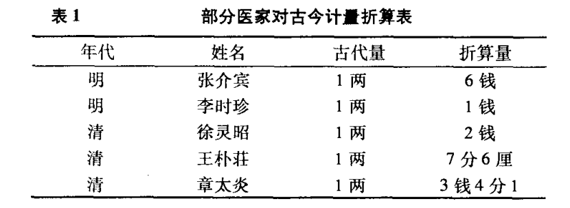
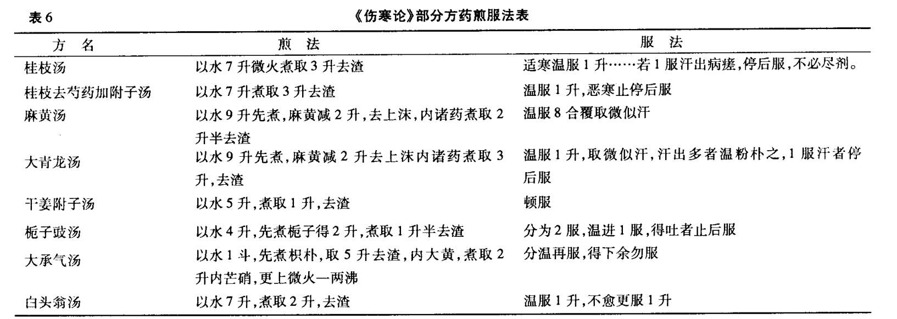

# 电子版附1

伤寒论的度量衡问题一直是中医有争议的话题。有中医按照一两3克换算，也有人按照1两15克进行换算。光明中医教材编写于80年代，当时的主流是1两3克。经过近30年的发展，关于《伤寒论》的剂量问题，有多位专家进行了考证。李可老中医根据临床实践及相关文献，认为伤寒1两约为15克。

这里引用剂量考证比较详实的一篇文章供学习者参考。

## 《伤寒论》实际用药剂量考证及分析

**曹生有 达志河 (甘肃省武威市凉州区中医医院 733000)**

**摘要** 《伤寒沦》所载方剂组方精简，每方平均用药4.75味。用药剂量大于现行教材《中药学》和《方剂学》所规定的剂量，这与《伤寒论》载方组方有法、煎服有度、一剂取效有关。

**关键词** 《伤寒论》 中药 剂量

张仲景所著《伤寒论》成书于东汉，总结了秦汉以前的医学成就，把古代理论医学与临床医学紧密结合起来，理法方药完整而内容明确系统，历代医家都推崇备至。如明代李濂《医师·张仲景补传》中说“华佗读而善之日：此真活人书也。”唐代孙思邈《千金翼方》中也有“江南诸师秘仲景要方不传”之叹，各家都宗奉《伤寒论》为“医门之规矩”，“治病之宗本”，“方书之祖”，无不对其高度评价而珍视。但《伤寒论》著述言词精简，义理深奥，又经历代医家仁者见仁、智者见智之注解，使我们对《伤寒论》所载方的应用难以掌握，多试不验，时有“经方难用”之说。究其原因可能与辨证不当、识症不准、调护不周、煎服失宜有关。据我们多年研习《伤寒论》，结合临床实践观察考证，其主要原因还在于用药剂量上，正所渭“中医不传之秘在量上”。《伤寒论》虽然在其方后每味药都有明确剂量，但因其成书至今已有两千余年的历史，由于时代的变迁、度量衡的更替，对其用量各家众说纷纭(如表1)。由表1可知同是明代医家之说相差6倍之多，同是清代学者也相差甚远，使我们有无所适从之感。现在《方剂学》教材(95年版)将汉代1两规定为现代3g。古今医家对《伤寒论》方剂药物剂量虽然作了很多考证与研究，但至今仍未作出结论，并且我们在临证处方时对原方用药剂量比例随意调整，不遵原方用药剂量之比，且将姜、枣、草任意理解为引使调和之品，致使经方原意不能体现，奇效不能发挥。经我们多方实践与考证后认为，对《伤寒论》用药剂量的重新认识和掌握对于临床大有裨益。在此不揣学识之通，对《伤寒论》实际用药剂量加以探究。

## 1《伤寒论》方中药物用量单位

据统计，《伤寒论》方中用药有用重量作单位的，有用容量作单位的，有用数量作单位的，不同种类的药物有容量、重量、数量单位的不同，同一种类药物也有容量、重量、数量单位的不同，如半夏有两、升、个的不同。

### 1.1关于重量单位的考究

在宋代《证类本草》曾引《名医别录》指出“古称唯有铢两，而无分名，今则10黍为1铢，6铢为1分，4分为1两，16两为1斤”。在《菅子，轻重》中言“黍者，谷之美者也”。《古代汉语常用字字典》中说“黍又叫·1243·黍子是粘黄米即现今黄米。经天平称量10粒黄米去皮者约0.12g，不去皮者约0.13g，一两黄米约3840粒，称量在2.9g至3.2g，李时珍之说古一两等于今一钱大概源于此说，现行《方剂学》教材将《伤寒论》方中药物剂量1两定为3g也是依据李时珍之说规定的。近年来由于考古研究的逐步深人，对度量衡的研究也日趋完善，各家研究逐步趋于统一，如表2。经我们对数量作单位药物的考证(见下述)，结合上述各家的研究成果，我们认为将《伤寒论》中药物剂量1两定为现在15g为妥。在《伤寒论》中多数药物为3两(今45g)，有些药物用量更大，如竹叶石膏汤中的石膏，甘草汤中的生地，赤石脂禹余粮汤中的赤石脂，禹余粮均用至1斤(今240g)，小柴胡汤中的柴胡、半夏、厚朴、甘草、生姜，人参汤中的厚朴、生姜用至半斤(120g)。这些都说明《伤寒论》所载方大于现行《方剂学》教材规定的量。

### 1.2关于容量单位的考究

用容量单位的药物历代所论也不一致。明李时珍在《本草纲目》中指出“古之1升即今之2合半，量之所起为圭，4圭为1撮，10撮为勺，10勺为合，10升为斗，5斗为斛，2斛为石”。《古汉语常用字字典》中解释圭、撮均为容量单位，6粟为1圭，10圭为1撮。粟为谷子，去皮者叫小米。依李时珍之说推算1升有2万4千粒谷子，依6粟为1圭之说，1升为6万粒谷子。经量标置量分别均为78ml和198ml。综合各家之说(见表3)，结合我们的考证，我们认为将《伤寒论》1升的容量定为现在的200ml为妥。在宋《重修政和经史证类备用本草》中记载：“凡云半夏1升者洗毕称5两为正，蜀椒1升者3两为正，吴茱萸1升者5两为正。”由于药物材质、比重等不同，所以同为1升的不同种的药物其重量自然不同。我们对《伤寒论》所载用容量作单位的药物进行了考证，详细资料见表4。吴茱萸在吴茱萸、当归四逆加吴茱萸生姜汤中分别用至1升(今84g)、2升(今168g)，与现在临床用量差距较大。半夏在《伤寒论》方中多用半升(42g)，也较现在临床用量大。从容量单位的考证也可印证我们对重量单位的考证定为15g是比较恰当的，如小柴胡汤中柴胡用至半斤(今120g)，其它方3两(今45g)，也与容量单位的考证基本相符。

### 1.3关于数量单位的考证

我们随机选择市售地道商品药物，将《伤寒论》所载以个数为单位的药物，对同一种药随机计数5次进行称量取其平均值，如表5。著名中医学家岳美中曾经作过考证，说“大附子1市斤有8至1O枚，附子1枚作现在市称30g计”，与我们考证基本相同。从数量作单位的考证上来看，也证明我们对容量和重量单位的考证是比较恰当的。上述药物杏仁、桃仁、水蛭、附子等的用量均较现在临床所用量大，更较现行教材折合换算量大，但汉至今已两千余年，其物种的变迁、进化衰变等因素可能使个体大小发生变异，这有待于进一步考证。从以上重量、容量、数量三方面的考证，我们可以看出《伤寒论》用药剂量比教材规定1两等于3g大5倍，但又小于《方剂学》古方药量考证规定的1两等于31.25g。约为其二分之一的量。

表5《伤寒论》部分药物个数与重量的换算表

## 2《伤寒论》方用药量大的原因

究其原因，虽然与当时仲景所处的社会漓乱、人民生活颠沛流离、所患之病重、所禀体质异有一定的关系，但深究《伤寒论》，与其组方之严谨、用药之精简、煎服之法度有更为重要的关系。我们认为《伤寒论》中用药量大的原因有以下几点：

### 2.1方简量大，味多量轻

《伤寒论》所载方中2—7味药组方的用量多大，1O味以上组方的比较轻，如只有2味药组方的甘草干姜汤、芍药甘草汤、桂枝甘草汤中，甘草、桂枝用至4两(今60g)，4味药组方的茯苓桂枝甘草大枣汤中的茯苓，7味药组方的小柴胡汤中的柴胡均用至8两(今120g)，而在有14味之多用药的麻黄升麻汤中均为6珠(今3.8g)。在《伤寒论》中药味少而单味用量大，药味多而单味用量小的组方屡见不鲜。这说明张仲景在药物剂量的轻重斟酌上，依据方药组成特点、主治病症轻重缓急上很有讲究，药少量大而功专力宏，药多量轻而配伍精当。

### 2.2君药量大，辅药量轻

《伤寒论》方在组成配伍上，君臣佐使，层次分明，君药量必大。如桂枝在《神农本草经》中说“上气咳逆结气，喉痹、吐吸、利关节”，在《伤寒论》中主要治气上冲而脉浮缓虚，以桂枝为君药的桂枝附子汤、桂枝人参汤中用至4两(今60g)，桂枝加桂汤中用至5两(今75g)，桂枝汤中用3两(今45g)，而在桃核承气汤、茯苓甘草汤、葛根汤中作为辅药只用2两(今30g)。再如麻黄在《神农本草经》中言“主治中风伤寒头痛、温症、皮表出汗去邪气，止咳逆上气，除寒热，破瘢坚积聚”，在《伤寒论》中主治无汗而肿，兼治喘、身痛、身黄，如在以其为主药的大青龙汤中用至6两(今90g)，麻杏甘石汤中用至4两(今60g)，而在其为辅药的桂枝越婢汤、桂枝麻黄汤中分别只用18铢(今11.25g)和16株(今9g)。另外如附子、半夏、生姜等均如此。仲景组方所选君药必用大量，取其力专效宏，直达病所。

### 2.3煎服有法，其量必大

综观《伤寒论》方所取煎服法(如表6)，所用方药多为1剂取效，现在临床少则3—5剂，多则上百剂，相比更显其药效显著。其煎法多久煎、慢煎，只用1煎取汁。服法为：顿服或分次服，中病即止，不必尽剂。从仲景煎服法可以看出，浓煎取汁，药力雄厚，有的放失，疗效必著，所以其用药剂量大是有道理的，这充分体现了仲景组方用药的精妙。

### 2.4针对主症，用药量大

在《伤寒论》方中生姜治“恶心呕吐”，吴茱萸汤主治“干呕、吐涎沫、头痛”，生姜用至6两(今90g)；在真武汤加减法中“若呕者”生姜加用至半斤(今120g)，栀子生姜豉汤、旋复代赫汤等方中均有恶心呕吐之症，生姜均用至5两(今75g)。再如半夏治“呕吐而不渴”，在葛根加半夏汤、黄苓加半夏生姜汤、竹叶石膏汤均取半夏之功治呕吐而不渴，用量达半升(取52g)。由此可见仲景对于症候中出现的主要症状，选择用药，其量必大，这说明对症候中出现的主要症状，取其大量，其效必然显著。

### 2.5组方精简，选取大量

《伤寒论》有113方，共用91味药，药物组成数(如表7)最简方为1味药，最繁方为14味，平均每方用药4.75味，组方用药多用2至7味药，共97方，占总方数的85.84%，9味药以上方剂只有6方占总方数的5.30%，从以上统计可以看出张仲景组方用药精简，配伍选药严谨，因为组方用药少，所以药物剂量就大。从《伤寒论》的组方用药、煎服方法、针对主症的选药、方剂药物君臣佐使的配伍的学习和研究可以看出，《伤寒论》方用药量大，有的放失，有理有据。

## 3《伤寒论》方用药剂量临证应用注意事项

### 3.1辨证务求准

应用《伤寒论》方时我们要认真学习和掌握其精髓，辨证务求准确，细心辨识所用方的适应症，有是证方用是方，有是症方用是药，不可随意揣度。药症不对，方证不符，不但不能收效，反致其变。笔者曾治一老年女性患者，因畏寒怕冷，汗出如水，身痛不休，四肢抽搐不适，舌质淡，苔薄白，脉虚浮，经静脉输注生脉液、黄芪液、参附液，口服玉屏风、牡蛎散等治疗15天无效，思之与桂枝加附子汤证同，疏方：桂枝、白芍、生姜各45g，甘草30g，大枣12枚，附子25g(先煎)，严格按原方煎服，只服1剂，2服即愈。

### 3.2用量遵比例

应用《伤寒论》方不但应辨证准确，选方要对，用药量要偏大，更应熟记原方药量及各药之间的比例，务求其用量与原方相适应。如曾治一中年男性患者，患频发窒性早搏伴心悸不适，经服中西药治疗1月余无效，笔者依“心悸动，脉结代”之论，选炙甘草汤，初始未按比例用药，且用药量偏小，生地用9g，炙甘草用9g，服6剂无效，后按原方给用药：炙甘草60g，桂枝、生姜各40g，党参、阿胶各30g，大枣30枚、麻子仁40g，麦门冬50g，生地240g，依原方煎服法煎服1剂症状消失，心律恢复正常。

### 3.3煎服用原法

《伤寒论》其治病多为“1服愈，不必尽剂”。1服即1剂药煎成后的三分之一，一般1剂即可治愈所对症之病，而不是后世所谓20剂，30剂甚至上百剂，如薛立斋用药的“服30剂，百剂效”，李土材的“备参5斤，期于3月奏效”。应细心学习方后的煎服调护方法并能切实应用。如曾治一黄疸性甲型肝炎患者，选用茵陈蒿汤治疗，茵陈用至90g，与其它药同煎5剂不效，后重新学习其后煎服法“以水1斗先煮茵陈减6升，内2味，煎取3升，去渣，分温3服”后认识到久煎茵陈，少煎栀子、大黄，依其法服2剂即效。

### 3.4毒药

应斟酌在《伤寒论》中对一些毒性明显、原方用量大的药物如附子、巴豆、大黄、甘遂、虻虫、芫花等应根据药材产地、品种、炮制方法等具体情况以及患者的体质强弱、年龄大小，性别差异等灵活掌握，并应注意观察病情变化，不应生搬硬套，以免酿成不良后果。

### 3.5重视姜枣草

现在临床将生姜、甘草、大枣多用作引使调和之品，在应用《伤寒论》方时也随俗而施。综观《伤寒论》方多将生姜、甘草、大枣以药应用，如甘草干姜汤、炙甘草汤、甘草泻心汤都以甘草为君药，在炙甘草汤、当归四逆汤中将大枣奉为主药，在生姜泻心汤、真武汤中治呕的加减、半夏生姜厚朴甘草人参汤中均以生姜为主药，且在有姜、枣、草出现的方剂中用量都较大。所以我们在应用《伤寒论》方时不要随意将上述三味药理解为调和引使之品，应掌握其原方用量用法，据临床观察，炙甘草汤的取效与否与大枣的应用是否得当有一定的关系。

综上所述，我们对《伤寒论》的深入学习和探索，不论从药的组成多少，方剂的繁简，君臣佐使的配伍，煎服的方法，针对主症的药物选择，以及临床中对《伤寒论》所用药物的实际考证，结合古今医家对《伤寒论》用药剂量的论述，同时借鉴考古成果，我们认为《伤寒论》方中普遍的药物剂量，不论从容量、重量和数量上，都较我们在临床习惯所用量大5倍，主次分明，层次井然。本文如有不妥，请同道斧正、指教。

中国医学理论与实践 2007年12月第 17卷第12期

THEORYANDPRACTI FCHINESEMEDICINEDecember2007,Vo1.17~No.12