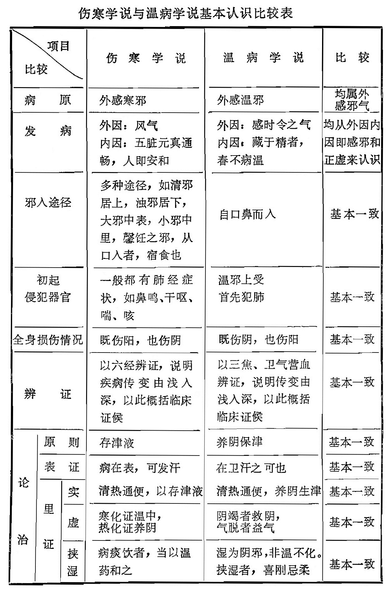

# 第二章　评伤寒与温病学派之争

中医学对于传染病认识很早，从历史看，金元以前历代医家基本上都是以《伤寒论》为基础来对各种传染病进行辨证论治。金元以后，特别是在清代温热学派兴起以后，不少温热学派学者，反对以伤寒法治疗温病，这就掀起了伤寒与温病之间的学派之争，至今尚未结束。因此，如何正确理解中医学对于传染病的一般认识，并在此基础上分析伤寒与温病学派之争，使伤寒与温病学派能在中医理论基础上取长补短统一起来，我们认为这是在当前发掘继承整理提高中医药学中的一个重大课题。

## 一、寒温之争源流概说

传染病一般均有发热，因此现代的所谓各种传染病，一般说来也都可以包括在中医学所称的热病之中。《素问》中的“热论”、“刺热论”、“评热病论”等篇，《灵枢》中的“寒热病”、“热病”等篇，均是讨论热病的篇章。《素问》中的“天元纪大论”，“五运行大论”、“六微旨大论”、“气交变大论”、“五常政大论”、“六元正纪大论”、“至真要大论”等七篇，更是十分系统地论述了热病的病因、病机及其诊断治疗的原则。由于《内经》在《素问•热论》中明确提出来“人之伤于寒也，则为热病”。“今夫热病者，皆伤寒之类也”，同时在《热论》中还提出了热病的六经传变及治疗原则。汉•张仲景继承内难，据此撰写了《伤寒杂病论》，创立了六经辨证论治体系，自此以后至宋以前，中医对于传染病的诊断疗治，基本上是以六经辨证为主，并没有什么大的争论。到了金代，刘完素根据《内经》热病之说，倡“热病只能作热治，不能作寒医”之论，其弟子如马宗素、镏洪、常德、葛雍等大阐其说，于是温病便逐渐从《伤寒论》中分离出来，元•王履（安道）继河间之学，进一步提出伤寒温病要严格区分，他说：“夫惟世以温病热病混称伤寒，故每执寒字以求浮紧之脉，以用温热之药，若此者，因名乱实而残之人生，名其可不正乎？又方书多言四时伤寒，故以春夏之热病与秋冬之伤寒一类视之而无所别，夫秋冬之伤寒，真伤寒也、春夏之伤寒，寒疫也，与温热病自是两途，岂可同治”（《医经溯洄集•伤寒温病热病说》）。明•吴又可著《瘟疫论》也强调伤寒与瘟疫必须严格区分。他说：“伤寒与时疫有霄壤之隔……夫伤寒必有感冒之因，或衣单风露，或冒雨入水，或临风脱衣，或当檐出浴，随觉肌肤寒慄，既而四肢拘急，恶风恶寒，然后头痛身痛，发热恶寒，脉浮而数，脉紧无汗为伤寒，脉缓有汗为伤风，时疫初起，原无感冒之因，忽觉凛凛，以后但热而不恶寒，然亦有触因而发者，或饥饱劳碌，或焦思气郁，皆能触动其邪，是促其发也。不因所触而发者居多，促而发者。十中之一二耳。且伤寒投剂，一汗而解；时疫发散，虽汗不解。伤寒不传染于人。时疫能传染于人。伤寒之邪，自毫窍而入，时疫之邪，自口鼻而入。伤寒感而即发，时疫感久而后发。伤寒汗解在前，时疫汗解在后。伤寒投剂可使立汗；时疫汗解，俟其内溃，汗出自然，不可以期，伤寒解以发汗，时疫解以战汗。伤寒发斑则病笃，时疫发斑为外解。伤寒感邪在经，以经传经，时疫以感邪在内，内溢于经，经不自传。伤寒感发甚暴，时疫多有淹缠二三日，或渐加重，或淹缠五六日，忽然加重。伤寒初起以发表为先；时疫初起以疏利为主。种种不同”（《瘟疫论•辨明伤寒时疫》）。到了清代，叶天士提出了新感温病的传入途径及传入后的变化，指出了：“温邪上受，首先犯肺，逆传心包”，并在诊断治疗上划分了卫气营血四个阶段。指出了“大凡看法，卫之后方言气，营之后方言血，在卫汗之可也，到气才可清气，入营犹可透热转气。”同时还补充了温病诊断治疗中查舌、验齿、辨斑疹、辨白㾦等新的内容。并明确指出：“辨营卫气血虽与伤寒同、若论治法则与伤寒大异”。（《温热论》）吴瑭继承叶氏，对叶氏医案加以整理并结合自己心得体会著《温病条辨》。他以三焦为纲分论温病，并把温病分为温热与湿温两大类从而确立了温病学说的理论体系。吴氏之说，风行大江南北：从而形成了温热学派。温热学派形成以后，受到了伤寒学派的坚决反对，因而就形成了伤寒与温热学派之争。

## 二、寒温之争的争论焦点

根据伤寒学说与温热学说的有关论述，伤寒与温热学派的争论焦点，主要是在伤寒可不可以包括温病和伤寒；伤寒论方可不可以治疗温病等两个方面。

伤寒学派承认温病是一个独立的疾病，但是认为它完全可以包涵在伤寒范围之中，也完全可以用张仲景伤寒论六经辨证论治体系来对温病进行治疗。伤寒论中的白虎汤、承气汤、黄连阿胶汤、竹叶石膏汤、麻杏石甘汤、葛根芩连汤等，都是治疗温病的方剂。在温热学派未形成以前，这种论点即已为多数医家所主张。例如杨上善谓：“夫伤寒者，人于冬时，温室温衣，热饮热食，腠理开发，快意受寒，腠理固闭……五脏六腑受热为病，名曰热病。斯之热病，本因受寒伤多，亦为寒气所伤。得此热病，以本为名，故称此热病，伤寒类也”（《黄帝内经太素》）。王冰谓：“寒者冬之气也，冬时严寒，万类深藏。君子固密，不伤于寒。触冒之者，乃名伤寒。……不即病者，寒毒藏于肌肤。至夏至前变为温病，夏至后变为热病，然其发者，皆为伤寒致之”（《黄帝内经素问•王注》）。张介宾谓：“伤寒者，中阴寒杀厉之气也，寒盛于冬，中而即病者。至春则名曰温病。至夏则名曰暑病。然有四时不正之气，随感随发者，亦曰伤寒”（《类经•疾病类》）。庞安时谓：“其即时成病者……名曰伤寒、其不即时成病，则寒毒藏于肌肤之间，至春夏阳气发生，则寒毒与阳气相搏于荣卫之间……名曰温病也。……其病本因冬时中寒，随时有变，病之形态耳。故大医通谓之伤寒焉”（《伤寒总病论•叙论》）。柯琴谓：“夫仲景之六经，是分六区地面。所该者广。虽以脉为经络而不专在经络上立说，凡风寒温热，内伤外感，自表及里，有寒有热，或虚或实，无乎不包，故以伤寒杂病合为一书而总名《伤寒杂病论》，所以六经提纲，各立一局，不为经络所拘，弗为风寒画定也”（《伤寒论翼·六经涵义》），“视仲景独于太阳篇别其名曰伤寒。曰中风、曰中暑、曰温病、曰湿痹。而他经不复分者，则一隅之举可以寻其一贯之理也。”（《伤寒论翼•全论大法》）。徐灵胎谓：“则此五者之病，古人皆谓之伤寒，与难经渊源一辙，后世俗学不明其故，遂至聚讼纷云，终无一是，是可慨也。其详往读热病论及伤寒论自知之”（《难经经释•五十八难注》）。温热学派形成以后，伤寒学派则更是以前人有关论述为依据。直斥叶吴三焦、卫气营血等为标新立异，对温热学派加以攻击。伤寒学派中，持此论点反对温热学派最力者，首推清•陆久芝。他说：“凡病之为风为寒为温为热为湿者，古皆谓之伤寒。乃人知风与寒为伤寒论中病。而于温与热谓不可用伤寒论中方，其意若同方既出于伤寒论。自是治寒方，必非治温法，岂有治温而用治寒方者。于是一遇温热病，无不力闢伤寒方，更无人知温热之病本隶于伤寒论中。而温热之方，并不在伤寒论外者”（《世补斋医书•卷二》）。“风寒湿温热皆在论中、论中之方可治风寒，亦治温热”（同上）。近人陆渊雷也持此论直斥温热学派之非。他说：“晋唐以前，凡流行发热之病，皆谓之伤寒，其范围至广，故内经言热病皆伤寒之类，难经言伤寒有五，有中风、伤寒、湿温、热病、温病。仲景自序，称伤寒卒病论集，卒病者，卒然而病，犹西医所谓急性病矣，故伤寒论所集。不限于脉紧无汗之麻黄证，亦不限于杆菌为厉之肠窒扶斯，论中阳明病即赅括温热，少阳病亦赅括疟疾，他若小青龙证赅括大叶肺炎及其类似之病，理中汤证赅括慢性及结核性肠炎，而急性传染病之前驱症亦即伤寒太阳病也。由是言之，凡哆口谈温热，欲与伤寒对峙者，皆谬妄弗可以”（《清代名医医案精华序》）。从上述可以看出，在伤寒与温病学派之争中，伤寒学派坚持伤寒可以包括温病，伤寒论方可以治疗温病，其理论根据就是《内经》中所提出的“人之伤于寒也则为病热”、“今夫热病者，皆伤寒之类也”，以及《难经》中所提出的“伤寒有五”。

温热学派认识则与伤寒学派完全相反，温热学派认为伤寒与温病完全不同，在病因方面，伤寒为寒邪，温病为热邪。在传入途径方面，伤寒由肌表入，为横传，所以伤寒分六经。温病由口鼻入，为竖传，所以温病分三焦。在治疗上伤寒用辛温，温病用辛凉、两者完全不同，绝对不能混称，并且认为伤寒论全部内容是为伤寒而立，不能治温病。温病学派的这种认识，在温病学派未形成以前，金刘完素即已提出：“余自制双解通圣辛凉之剂，不遵仲景法桂枝麻黄发表之药，非余自炫，理在其中矣，故此一时，彼一时，奈五运六气有所更，世态居民有所变。……故经所谓不知年之所加，气之盛衰，虚实之所起，不可以为工矣”（《素问病机气宜保命集•伤寒论第六》）。刘氏在此直接提出了寒温有别，不能用伤寒论方治今之热病。此外，刘氏还提出了：“病有暴热者，病在心肺。有积热者病在肝肾”（《素问病机气宜保命集•热论第十四》），“上焦热无他证者。桔梗汤……有实热能食而热者，胃实也。……有病久憔悴发热盗汗，谓五脏齐损……宜养血益阴”（同上），这是后世温热学派三焦辨证的起源。明以后的医家，认为温寒有别，伤寒论方不能治温热者更多。如：李士材请：“仲景方法为冬月即病之正伤寒设也。后世混将伤寒冬月之方。通治春温夏热之病。遗祸至今，未有能改”（《伤寒括要•伤寒总论》）。喻嘉言谓：“仲景书详于治伤寒，略于治温，以法度俱错出于治伤寒中耳、后人未解义例，故春温一证，漫无成法可师”（《尚论后篇·尚论春三月温证大意》）。吴又可谓：“仲景虽有伤寒论，然其法始自太阳，或传阳明，或传少阳，或三阳竟自传胃，盖为外感风寒而设，故其传法与温疫自是迥别。……崇祯辛巳疫气流行，山东浙省，南北两直，感者尤多、至五六月益甚。或至阖门传染，始发之际，时师强以伤寒法治之，未尝见其不殆也。或病家误听七日当自愈。不尔必十四日而瘥。因而失治，有不及期而死者，或有妄用峻剂，攻补失序而死者，或遇医家见解不到，心疑胆怯，以急病用缓药，虽不即受其害，然迁延而至死，比比皆是”（《瘟疫论•序》）。温热学派形成以后，温热学家更是据此大声疾呼。其明朗者，均据河间之论直认寒温有别，伤寒法不能治温病。如叶天士谓：“论治法则与伤寒大异”，“后贤刘河间创议迥出诸家，谓温热时邪当分三焦，投药与苦辛寒为主，若拘六经分证，仍是伤寒治法、致误多矣”（《温热论）吴瑭谓：“若真能识得温病，断不治以辛温治伤寒之法治温病”。……朱彬谓：“后汉张仲景著伤寒论……其书专为伤寒而设，丰尝遍及于六淫也，奈后世之医者，以治伤寒之法。应无穷之变，势必凿枘之不相入”（《温病条辨•朱序》）。柳宝诒谓：“冬月伤寒，邪由皮毛而入，从表入里。初见三阳经证……三阳不解，渐次传入三阴……初起悉系寒邪见象，迨发作之后。渐次化热内传，始有热象。故初起治法必以通阳祛寒为主，及化热之后，始有泄热之法，此伤寒病之大较也。若夫温病，乃冬时寒邪，伏于少阴，待春夏阳气内动，伏邪化而为热。由少阳外出……初起治法，则以清泄里热，导邪外达为主，与伤寒用药，一温一凉……此伤寒温病分证用药之大关键”（《温热逢源•论温病与伤寒病情不同治法各异》）。其含蓄者，一方面虽然也承认伤寒有五，温病可以包涵在伤寒之中。但另方面也认为伤寒论详寒略温，在治温方面，法有未备。实际上也是不同意完全以伤寒论方来治温病。如王孟英谓：“五气感人，古人皆谓之伤寒，故仲圣著论亦以伤寒统之，而条分中风、伤寒、温病、湿、暍五者之证治，与内经渊源一辙，法虽未尽，名已备焉”（《温热经纬·自序》）。程国彭：“仲景论伤寒而温热温疫之旨未畅”（《医学心悟》）。

从以上所述可以看出，伤寒与温病学派之争其焦点主要是在伤寒是否能包括温病在内和伤寒论方是否可以治疗温病等两个方面。伤寒学派认为伤寒可以包涵温病在内。伤寒论方完全可以用以治疗温病。而温热学派认识则与伤寒学派完全相反。

## 三、伤寒与温病学派之争剖析

“伤寒”、“温病”、“六经”、“三焦”、“营卫”、气血”等等，均源于《内经》。张仲景明确提出，其《伤寒杂病论》之作是撰用《素问九卷》、《八十一难》（《伤寒论•序》）。吴瑭在所著《温病条辨》中也首列《原病篇》，篇中列《内经》原文十九条以为立论依据。这就是说伤寒学派和温病学派的理论基础都是根据《内经》。既然伤寒学派和温病学派的理论基础都是《内经》，那么，为什么寒温之争又是如此尖锐，冰炭不相容呢？为此，有必要从《内经》对传染病的一般认识，伤寒与温热学派处理传染病的异同，以及当前中医对传染病治疗的实践经验等三个方面加以剖析：

### （一）《内经》对传染病的一般认识

1、关于病因病机：

（1）对于传染病的外因，《内经》认为主要是由于自然气候变化严重失常，人体感受此自然气候偏胜之气以及由此自然偏胜之气而产生的“毒气、即可发生疫病。对于传染病的内因，《内经》则认为主要与人体正气强弱密切相关，人体的抵抗力与传染病的发生有着密切不可分割的关系，并且在一定程度上把它放在了决定性的地位。从而作出了“正气存内、邪不可干”的精辟结论。伤寒学派完全继承了《内经》的病因学认识，强调了自然气候反常变化与疾病发生的关系。如所谓“夫人禀五常，因风气而生长，风气虽然能生万物，亦能害万物，如水能浮舟，亦能复舟……客气邪风，中人多死”（《金匮•脏腑经络先后并脉证第一》），同时也强调了人体正气在发病上的决定作用，如所谓“若五脏元真通畅，人即安和，……不遗形体有衰，病则无由入其腠理”（同上），“血弱气尽，腠理开，邪气因入”（《伤寒论•辨太阳病脉证并治》），这和《内经》的病因学认识基本一致。温病学派也是一样。他们继承了《内经》之说，认为气运偏胜是温病发生的外因，“不藏精”、“正气虚”是温病发生的内因。吴鞠通在所著《温病条辨》中，首列原病篇十九条，明确指出：“叙气运，原温病之始也”。温病者，精气先虚”。强调留得一分正气，便有一分生理”。这些认识应该说是完全正确的，而且是在前人认识的基础上的发展。可见伤寒学派与温病学派对传染病的病因学认识上是一致的，并无根本上的分歧。

（2）在病机认识方面，《内经》对于急性传染病的病机学方面的论述很多，其要者主要有病邪性质与传入途径以及病邪传入人体后传变规律等两个方面。在病邪性质与传入途径方面，《内经》认为外感邪气可以按风火湿燥寒加以分类，但总的来说可以按阴阳加以区分，即可以分为阴邪与阳邪两大类。其中属于气候季节而产生的致病因素称为阳邪，由饮食居住原因而产生的致病因素称为阴邪。由于季节气候原因致病者，《内经》称之为外感“六淫”，认为传染病以外感六淫而发病者居多。所以《内经》又特别指出；“夫百病之生也，皆生于风寒暑湿燥火”（《素问•至真要大论》）。由于饮食因素而致病者，中医学称之为“内伤饮食。”由于六淫之邪，首先作用于肺，临床上主要表现肺的症状。由于饮食之邪。首先作用在脾胃，临床上主要表现胃肠道症状，这也就是《内经》中所谓的“故犯贼风虚邪者，阳受之，食饮不节，起居不时者，阴受之。阳受之则入六腑，阴受之则入五脏，入六腑则身热不时卧，上为喘呼，入五脏则䐜满闭塞。下为飧泄，久为肠澼”（《素问•太阴阳明论》）。张仲景《伤寒杂病论》继承《内经》的认识，并将“邪气”作了进一步的区分。《金匮要略》谓：清邪居上，浊邪居下，大邪中表，小邪中里，馨饪之邪，“从口入者，宿食也”（“脏腑经络先后病脉证第一”）。张仲景已经认识到邪气有多种，分布很广泛，有的在上、有的在下（清邪、浊邪），毒力有大小（大邪、小邪），传入途径也有多种（居上、居下、从口而入）。传染病从呼吸道传入者固多，从口而入经过消化道而传入人体者亦不少。温热学派对病邪的性质与传入途径方面的认识和《内经》、《伤寒》、《金匮》基本一致。在病邪方面认为除六淫之邪而外，又提出“疠气”、“毒气”，并且认为“疠气”的流行又与四时不正之气有关，把“疠气”与“六淫”之邪密切结合起来。在传入途径方面明确提出从口鼻而入。吴又可谓：“疫者，感天地之疠气，在岁运有多寡，在方隅有厚薄，在四时有盛衰，此气之来，无论老少强弱，触之者即病，邪从口鼻而入”（《瘟疫论•原病》）。叶天士谓；“温邪上受，首先犯肺”（《外感温热篇》）。吴鞠通谓：“温病由口鼻而入”（《温病条辨•上焦篇》）。

综上所述，可以看出伤寒学派和温病学派方面的认识是：外邪基本上可以分为“四时不正之气”和“疫疠之气”两大类。这两类外邪互相影响，互为因果。其传入途径主要是从口鼻而入。其间吴又可虽然比较强调“杂气”，但他也认为，疠气“在岁运有多寡，在方隅有厚薄，在四时有盛衰”，说明他也承认四时不正之气与“疠气”在传染病中的综合作用。因此可以认为，在对外感邪气的性质及其传入途径方面的认识，从大的方面来看，伤寒与温病学派之间，认识上基本一致，并无根本的分歧。

在邪气侵入以后的传变及其与正气强弱之间的关系方面。《内经》认为传染病的发病以后在人体的传变过程与人体正气强弱密切相关，整个发病及传变过程，自始至终也都是一个正邪相争的过程，精胜则邪却、正气强盛能够抗御邪气则不会发病，即使发病，邪气进入人体也比较浅，临床表现也比较轻。反之就会发病，发病以后，邪气进入人体也比较深，临床表现也比较重，预后也较险恶。关于这一认识，《内经》谓：“邪之所凑，其气必虚”（《素问•评热病论》）。而《伤寒论》谓：“血弱气尽，腠理开，邪气因入”（“辨太阳病脉证并治”）。《瘟疫论》谓：“凡人口鼻之气，通夫天气，本气充满，邪不易人，本气适逢亏欠。呼吸之气，自亦不及，外邪因而乘之，昔有三人冒雾早行，空腹者死，饱酒者病，饱食者不病，疫邪所害，又何异耶”。凡此说明伤寒学派与温病学派在这方面的认识都是继承《内经》的认识，也是完全一致的。

至于传染病在人体的传变方面，《内经》从不同角度出发，提出了循五脏之序而传；循络经脏腑之序而传；循阴阳之序而传；循表里之序；循上下之序而传；循营卫气血之序而传等六个方面。后世各家在《内经》认识的基础之上，就其中某一传变形式加以突出，于是就形成了各种辨证。伤寒学派突出了《内经》中循阴阳之序而传的形式。于是就形成了伤寒学派的六经辨证论治体系。温病学派突出了《内经》中对三焦、营卫气血的认识。于是就形成了温病学派的三焦、卫营气血辨证论治体系。两派在提法上虽有不同，但对传染病在人体的传变过程，总的来看却又都是：由表入里、由浅入深、由阳入阴、由上到下。因此也就并无实质上的矛盾和原则性的分歧。

2、关于诊断治疗原则：

对于急性传染病的诊断和治疗方面，从辨病论治方面来说，《内经》总的认识是传染病属于急性热病范围，因此《内经》以热论等为篇。但是由于热病的发生主要由于外感六淫，所以《内经》在热论的总称下，又分别以风、火、湿、燥、寒命名各种热病。并且在《素问》七篇大论中，比较详细地列举了风、热、火、湿、燥、寒等各种急性热病的临床表现及其治疗原则。这就是说《内经》对于传染病，基本上是按风、热、火、湿、燥、寒分类。因此在论中既提出了伤寒，也提出了温病。从七篇大论中所记载的寒病和温病的临床表现来看也是有区别的。例如《素问•六元正纪大论》：“少阴所至为疡疹身热……少阳所至为嚏呕，为疮疡……太阳所至为屈伸不利……为寝汗痉”。这里的少阴少阳主火主热，太阳主寒，说明了《内经》承认寒温有别。

《伤寒论》根据《内经》：“今夫热病者，皆伤寒之类也”。以伤寒来统率各种热病。但是也承认温病、热病是一个独立的疾病，从论中所记述中有关临床表现来看也是有区别的，例如《伤寒论•辨太阳病脉证并治上》谓：“太阳病，发热而渴，不恶寒者，为温病”。又《金匮要略•痉湿病脉证治第二》谓：“太阳中热者，暍是也，汗出恶寒，身热而渴”。说明伤寒学派也是承认寒温有别的。于此可以看出《内经》、《伤寒论》都并没有把寒温混同，也都是主张寒温有别。因此对于传染病的辨病论治方面来说，伤寒学派与温病学派在认识上并无分歧。

对于传染病的辨证论治，《内经》十分强调：“谨守病机，各司其属”（《素问•至真要大论》），“谨察阴阳所在而调之，以平为期，正者正治，反者反治”（同上），“盛者泻之，虚者补之”（同上），“用凉远凉，用热远热，用寒远寒，用温远温”（《素问•六元正纪大论》），“无盛盛，无虚虚”（《素问•五常政大论》）。伤寒学派在对热病的辨证论治方面也明确提出：“夫诸病在脏、欲攻之，当随其所得而攻之”，“虚虚实实，补不足，损有余”（《金匮要略•脏腑经络先后病脉证第一》）。温热学派在对热病的辨证论治方面也明确指出：“天地运行之阴阳和平，人生之阴阳亦和平，安有所谓病也哉。天地与人之阴阳，一有所偏，即为病也。偏之浅者病浅，偏之深者病深，偏于火者病温病热，偏于水者病清病寒，此水火两大法门之辨，医者不可不知，烛其为水之病也，而温之热之，烛其为火之病也，而凉之寒之，各救其偏，以抵于平和而已，非如鉴之空，一尘不染，如衡之平，毫无倚着，不能暗含道妙，岂可各立门户，专主于寒热温凉一家之论而已哉”（《温病条辨•上焦篇•第二条注文》）。于此可以看出，《内经》、《伤寒论》、《温病条辨》对于急性热病的辨证论治方面认识也是完全一致，并无根本上的分歧。

综合以上所述，可以看出，伤寒和温病在对于传染病的一般认识上是基本一致的。虽然在临床的具体辨证论治中，伤寒学派是以六经辨证，温热学派是以三焦、卫气营血辨证，但这只是方法上的不同，从理论上来说，并无实质上的不同和根本上的分歧；兹就伤寒学派与温病学派中的一此基本论点，列表比较如下，以见伤寒与温病学派在理论基础上的一致性。

伤寒学说与温病学说基本认识比较表

|              |      |      | 伤寒学说                                                     | 温病学说                                                 | 比较                           |
| ------------ | ---- | ---- | ------------------------------------------------------------ | -------------------------------------------------------- | ------------------------------ |
| 病原         |      |      | 外感寒邪                                                     | 外感温邪                                                 | 均属外感邪气                   |
| 发病         |      |      | 外因：风气 内因：五脏元真通畅，人即安和                 | 外因：感时令之气 内因：藏于精者，春不病温           | 均从外因内因即感邪和正虚来认识 |
| 邪入途径     |      |      | 多种途径，如清邪居上，浊邪居下，大邪中表，小邪中里，馨饪之邪，从口入者，宿食也 | 自口鼻而入                                               | 基本一致                       |
| 初起侵犯器官 |      |      | 一般都有肺经症状，如鼻鸣、干呕、喘、咳                       | 温邪上受 首先犯肺                                   | 基本一致                       |
| 全身损伤情况 |      |      | 既伤阳，也伤阴                                               | 既伤阴，也伤阳                                           | 基本一致                       |
| 辨证         |      |      | 以六经辨证，说明疾病传变由浅入深，以此概括临床证候           | 以三焦、卫气营血辨证，说明传变由浅入深，以此概括临床证候 | 基本一致                       |
| 论治         | 原则 |      | 存津液                                                       | 养阴保津                                                 | 基本一致                       |
| 论治         | 表证 |      | 病在表，可发汗 清热通便，以存津液                       | 在卫汗之可也 清热通便，养阴生津                     | 基本一致                       |
| 论治         | 里证 | 实   | 寒化证温中，热化证养阴                                       | 阴竭者救阴，气脱者益气                                   | 基本一致                       |
| 论治         | 里证 | 虚   | 病痰饮者，当以温药和之                                       | 湿为阴邪，非温不化。 挟湿者，喜刚忌柔               | 基本一致                       |
| 论治         | 里证 | 挟湿 | 病痰饮者，当以温药和之                                       | 湿为阴邪，非温不化。 挟湿者，喜刚忌柔               | 基本一致                       |

从附表可以看出，伤寒学派与温病学派在基本认识上是一致的，并无根本的矛盾和原则上的分歧。于此可以看出伤寒与温病学派之争，并没有充足的理论依据，看来之所以出现争论的原因，不过只是一个谁统谁的问题；发展和反发展的问题；百花齐放还是一家独鸣的问题；从学术上来说，意义不大。

### （二）伤寒与温病学派处理传染病的异同

首先在对传染病的辨证方面，伤寒学派认为伤寒有五，有中风、有伤寒、有湿温、有温病、有热病。以伤寒为纲来统帅风、寒、湿、温、热诸病。温热学派认为温病有九：有风温、有温热、有温疫、有温毒、有暑温、有湿温、有秋燥、有冬温、有温疟，同时还在上焦、中焦、下焦辨证中附列寒湿，以温病为纲来统帅此九种温病及所附列的寒湿。就两派所述辨病的内容加以比较，其相同点是：两派在辨病上都是继承了《内经》的认识，即以风、热、火、湿、燥、寒六淫辨病为主，伤寒按风、寒、湿、温、热辨病，温病为九种温病加寒湿，从性质上看，有温、暑、湿、燥、寒（寒湿），基本上也是按风、火、湿、燥、寒辨病。其不同者是伤寒学派在辨病中缺乏燥病，而温病学派则明确提出了秋燥。关于燥病，《内经》中本来早就明确提出，认为凡属外感燥邪其主要临床表现是：咳嗽、咽干、皮肤干燥，或发为寒热，其作用部位主要在肺，这也就是《素问•天元纪大论》中所谓的“阳明所至为燥生”、“阳明所至为皴裂”、“燥胜则干”、“凡此阳明之政……民病嗌塞、寒热发、暴振慓”。《素问•五运行大论》中所谓的“在天为燥……在体为皮毛……在脏为肺……”。但是《伤寒论》中并没有谈到燥病。阳明篇中虽然有“脾约”之说及麻子仁丸之方，但同条明明是谈“胃实家”的阳明病，而且麻子仁丸也仍然是以泻下为主的方剂，因此可以说《伤寒论》中燥病缺如。温热学派明确提出了秋燥，《温病条辨》中并系统地论述了秋燥的三焦证治。尽管温热学派把《伤寒论》中燥病缺如的原因归之于《内经》，认为：“内经六气，脱误秋伤于燥一气，指长夏之湿为秋之燥。后人不敢更端其说，置此一气于不理”（《温病条辨•上焦篇•五十八条注文》）。认为刘河间首先提出了：“诸涩枯涸，干劲皴揭，皆属于燥”。喻嘉言首先创立了清燥救肺汤等论点，这些提法，并不完全符合实际，值得研究。但吴鞠通在《温病条辨》书中补写了《补秋燥胜气论》，指出了凉燥的辨证论治，因而温热学派秋燥之说，继承了《内经》，补充了伤寒学派在辨病上的不足，则是客观存在。于此说明了在对传染病的辨病方面，温热学派在伤寒学派的伤寒有五的基础上有所发展。

其次是在对传染病的证候性质、归类及处理上，伤寒学派和温病学派也有许多相同点和不同点。例如对于“厥证”，《伤寒论》和《温病条辨》中均有记述。在“厥证”的病机上，《伤寒论》认为：“凡厥者，阴阳气不相顺接便为厥”。《温病条辨》认为：“阴阳极造其偏”。在“厥证”的分类上，《伤寒论》分为寒厥与热厥两类，《温病条辨》也分为寒厥与热厥两类。对于“热厥”，《伤寒论》认为是：“厥深者，热亦深，厥微者，热亦微”。因热致厥。《温病条辨》认为是“火极似水，热极而厥。两派在厥证的证候性质认识上可以说完全相同。但是在临床表现描述上和证候归类上及临床处理上两派则又有其不同之处。对于“热厥”，《伤寒论》中只描述了“发热肢厥”及“厥热来复”两个主要临床表现，把它列入厥阴病中，而《温病条辨》则明确提出热厥可以分为三种情况，即邪入心包络而为舌蹇肢厥；邪搏阳明，神迷肢厥，甚则通体皆厥；温病后期，阴亏而厥。认为上中下三焦均可发生。对于热厥的治疗，《伤寒论》只提到了“厥应下之”，而《温病条辨》则提出了邪入心包而为舌蹇肢厥者用芳香开窍，邪搏阳明，神迷肢厥，甚至遍体皆厥者，当用下法；温病后期，阴亏而厥者，则又当用育阴潜阳法，种种不同。又如“热结旁流”一证，《伤寒论》谓：“少阴病，自利清水，色纯青，心下必痛，口干燥者，可下之，宜大承气汤”（“辨少阴病脉证并治”）。《温病条辨》谓：阳明温病，纯利稀水无粪者，谓之热结旁流。调胃承气汤主之”（“中焦篇”）。两派对于“热结旁流”的证候性质的认识及处理原则，可以说完全相同。但是在证候归类上，《伤寒论》把它列在少阴病中，而《温病条辨》则把它列在中焦篇阳明温病之内。六经辨证中少阴病属于虚证，虚证而用下法，这就比较难解，所以后人只能用“急下存阴”来解释。阳明温病属于胃家实，用下法就比较容易理解。伤寒学派与温病学派的论著中，有关这方面的例子很多，不胜枚举。但仅举上述两例来看，已可说明伤寒学派与温病学派在对于传染病的许多认识和具体处理方面有相同处，也有不同处。其不同处就是温热学派在许多方面，由于时代原因，较之《伤寒论》中的论述，更趋完善，有所发展。

再其次是从对传染病治疗方面的选方用药来看，伤寒学派和温病学派也有许多共同点及不同点。在选方用药上，温热学派选用了大量的经方。《伤寒论》中的各个代表方剂，几乎完全纳入了温热学派的三焦营卫气血辨证论治体系之中。以《温病条辨》为例，《伤寒论》和《金匮要略》中许多著名代表方剂，例如桂枝汤、一物瓜蒂汤、栀子豉汤、茵陈蒿汤、栀子柏皮汤、小陷胸汤、半夏泻心汤、白虎汤、白虎加人参汤、小半夏茯苓汤、白虎加桂枝汤、大承气汤、小承气汤、调胃承气汤、小陷胸汤、五苓散、四逆汤、理中汤、茵陈五苓散、泻心汤、小柴胡汤、黄连阿胶汤、白头翁汤、复脉汤、桃仁承气汤、抵当汤、桃花汤、猪肤汤、甘草汤、桔梗汤、苦酒汤、小建中汤、黄土汤、小青龙汤、麻杏石甘汤、葶苈大枣泻肺汤、鳖甲煎丸……等方，均被收入《温病条辨》之内。用法上也与伤寒学派基本相同。但是温热学派在广泛采用伤寒方的基础上，又增加了后世的大量方剂，在选方用药上有所发展。如在中焦阳明温病的治疗选方用药上，一方面如同伤寒学派一样，用白虎汤或白虎加人参汤、三承气汤等以清里攻下。但另一方面又作了较大的补充，如在清里方面减味竹叶石膏汤、清营汤、清宫汤、化斑汤、加减玉女煎等方的运用；在攻下方面新加黄龙汤、宣白承气汤、导赤承气汤、牛黄承气汤、增液承气汤、护胃承气汤……等方的运用等等，都是在伤寒学派的选方用药基础上进了一步，特别是养阴生津方药，芳香开窍方药的创制和运用，更是补伤寒之未备，大大的丰富了中医治疗传染病的范围。

### （三）当前中医对传染病治疗的实践经验

伤寒与温病学派之争始于刘河间，继于吴又可，盛于叶天士、吴瑭，持续于今日。说明了温病学说的兴起，温热学派的形成，是中医治疗传染病的需要，一九五四年，河北石家庄地区首次系统运用温病学的理论和方法治疗流行性乙型脑炎，取得了显著的临床疗效，此后各地也普遍地以温病学说指导来治疗流脑、麻疹、猩红热、肺炎、腮腺炎、白喉、菌痢、肠伤寒、钧端螺旋体病、出血热、布氏杆菌病等等急性传染病，也都取得了较好的疗效。近年来，我国不少单位又对温病的卫气营血进行了比较系统的研究。召开了全国中医内科急诊治疗学术交流会和全国“抗三衰”经验交流会。会议的内容基本上还是以温病学说在临床具体运用方面为中心进行经验交流。所有这些，说明了温病学说的提出和温热学派的兴起，都并不是偶然的，温病学说是有很大的生命力和实践意义的，它的出现是由于实践的需要，历史发展势所必然。

## 四、正确对待伤寒与温病学说

伤寒学说和温病学说都是我国古代医学家长期与疾病作斗争的经验总结、是祖先遗留给我们的一份宝贵遗产，是中国医药学这个伟大宝库中的一个极其重要组成部分，因此我们必须加以系统学习，全面掌握，整理提高，使它们都能为保证我国广大人民的健康更好地服务根据本文中所述有关内容，可以看出，学说，伤寒与温病学说，其理论基础均是《内经》，它们对于传染病的认识基本一致，并无根本分歧。伤寒学派根据《内经》所提出的三阴三阳学说，结合临床实践，发展成为了伤寒六经辨证论治体系，一直到今天，仍然有效地指导着临床。温热学派则根据《内经》的三焦、营卫气血学说，同时吸收了伤寒学派中的经验教训，从另一角度出发，提出了温病三焦、营卫气血辨证论治体系，使得中医学对于传染病的防治，在前人的经验基础上有所提高，应该说是一个重大的发展。因此，如何正确对待伤寒和温病学说，从中医基础理论上把它们统一起来，扬长避短，尽早地结束伤寒与温病学派之争。在当前具有实用价值和理论价值，也具有极其重要的现实意义和历史意义。