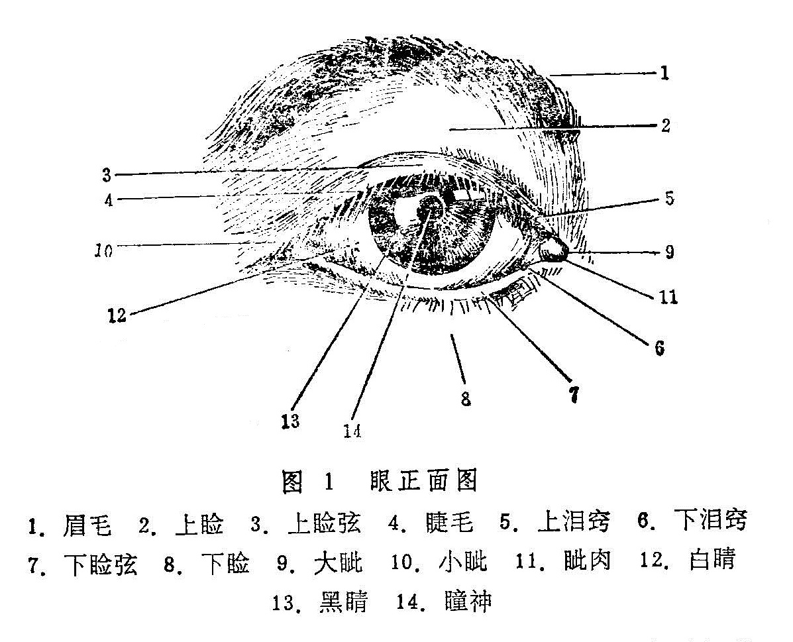
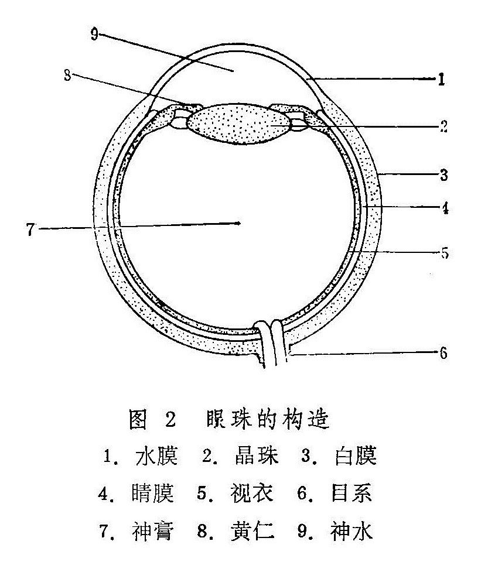
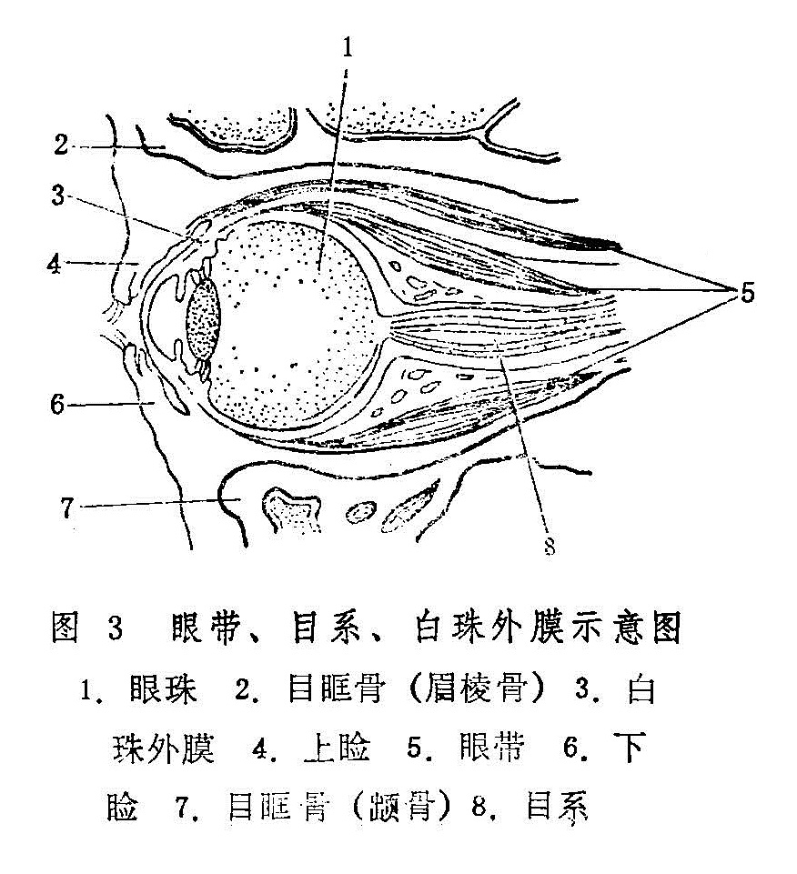

## 第一节　眼的构造

《灵枢•大惑论》指出：“五脏六腑之精气皆上注于目而为精。”《审视瑶函》亦指出：“夫目者，五脏六腑之精华。”说明眼是由五脏六腑之精气上注而成的。眼位于眼眶骨形成的骨眶之内，主要由眼珠、胞睑、眼带、目系等部分组成。

1.胞睑：即两目外上下卫护之胞，又名目睥、目裹、眼胞、眼睑等，《黄帝内经》称其为约束，俗名眼皮。胞睑分上下两部分，在上者称上睑，在下者称下睑，亦有“胞者上胞也，睑者下睑也”之说（《银海精微》），故习称上胞下睑。

胞睑的边缘称睑弦，又名目唇、睑唇或胞沿。睑弦上生有排列整齐的睫毛。胞睑可以反转，其内面称睑内或睥内，表面红黄相兼，光滑润泽，与眼珠表面紧贴而不相粘连。

上下睑弦的联合处称目眦，近鼻侧者大而圆，故称内眦或大眦；居颞侧者小而锐，故称外眦、小眦或锐眦。内、外二眦合称两眦，俗名眼角。大眦内有红肉一颗，名眦肉（见《银海指南》），为眼前部脉络汇聚之处，色红活而润泽。

靠近大眦的上下睑弦上，各有一针尖大小之孔窍，称泪窍，为泪液排出之通道。（图1）

胞睑开合自如，启闭敏捷，与睑弦上之睫毛共同起着保护眼珠的作用。

其一，通过眨目动作，可以敷布神水于眼表面而濡润之；其二，时刻防御风沙及其它异物触伤眼珠，亦有抵御六淫之邪外侵之作用；其三，上下睑微合，则睫毛覆于瞳神之前，形似竹帘，有屏蔽尘沙及遮障强光的作用。另外眼睑关闭则光线不能进入眼内，尚有保障睡眠的作用。

2.眼珠，又名目珠，以其形圆类丸，皎洁明净，状如宝珠而得名。

眼珠居于眼眶之内，前部的裸露部分，正中为黑睛，黑睛之周围为白睛（图1）。眼珠后面则有目系上通于脑。

黑睛又有黑眼、黑珠、乌睛、乌珠、青睛等名，位于眼珠前端中央，略呈椭圆形，分前后两部分。前方称水膜，清莹明润，无色透明，至清至脆，不可清触。水膜之后为黄仁，又名睛帘。黄仁呈圆盘状，菲薄娇嫩，纹理微密，呈棕褐色。黑睛之色，实即黄仁色泽透见于外而然。黄仁中央有一圆孔，大小似绿豆（直径约2.5〜4mm），名曰瞳神（图1）。

瞳神又称瞳仁（人）、瞳子、金井等，其色黑莹净彻，乃神光发生之所。瞳神之后，尚有晶珠、神水、神膏、视衣等组织。

《银海精微》云：“瞳人之大小，随黄仁之展缩。黄仁展则瞳人小，黄仁缩则瞳人大。”而黄仁之展缩，乃随光线的强弱而变化。光线强则黄仁展，瞳神变小，光线弱则黄仁缩，瞳神变大。

眼珠表面，黑睛之外的部分统称白睛。

白睛又称白眼、白仁、白珠、俗称眼白。白睛色白属金，所以《证治准绳》云：“金为五行之至坚，故白珠独坚于四轮。”白睛质地坚韧，与前端之水膜共同组成眼珠之外壳，包裹护卫着眼珠内所含物质。白睛裸露于外的部分覆盖着一层透明的外膜，此膜与白珠紧贴而不粘连，可滑动，有弹性，上有微细血络，外膜之名见于《张氏医通•金针开内障》：“针尖划损白珠外膜之络而见血。”故可称此膜为“白珠（睛）外膜。”（图2）白珠外膜亦可称白睛表层，其覆盖部位的白睛则称白睛里层。

眼珠的构造，早在唐代的《外台秘要》就有比较正确的记载。该书卷二十一云：《眼根寻无他物，直是水耳。轻膜裹水，圆满精微，皎洁明净，状如宝珠，故曰眼珠。”《证治准绳》则云：“大概目圆而长，外有坚壳数重，中有清脆。”说明眼珠的外壳是很薄的膜状组织，壳内包涵着液态内容物。

眼珠的外壳，《证治准绳》约言“数重”，《外治秘要》则明确地记载为“白睛重数有三，”“黑睛水膜止有一重。”除黑睛的水膜之外，白睛的三层《外台秘要》未予定名。根据《审视瑶函•枣花障症》“此症甚薄而白，起于风轮周匝，从白膜之内环布而来也……凡见白圈傍青轮际，从白膜内四围圈圆而来，即是此症”的记载，则白睛的外层可称“白膜。”至于中层和内层，锦章书局本《审视瑶函》卷首所附眼图分别称之为“视黑衣”和“视脑衣”，近代医者多称其为“睛膜”与“视衣”，亦可沿用。（图2）

眼珠包含之内容，《目经大成》卷一指出“膏中有珠，澄彻而软，状类水晶棋子，曰黄精。”此黄精亦名睛珠或晶珠，位于瞳神与黄仁之后，正常情况下透明而清脆，一旦混浊则称内障而遮障视力。睛珠之后，则为一函神膏，《疡医大全》卷十一则称神膏为护睛水，并指出：“白睛最坚属肺金，内藏护睛水，如鸡子清之稠浓。”可知神膏为胶状液态物质，与其前方之神水共同维持着眼珠的圆满状态及瞳神的正常功能（图2），《证治准绳》认为：“神膏乃由胆中渗润精汁积而成者。”《目经大成》论述八廓时则云：“坎为神膏，络通膀胱之腑，脏属于肾。”神水分布于水膜之后，黄仁和睛珠的周围，质地比较清稀，明净澄澈，不易察见，有养保水膜、黄仁、瞳神、神膏之功。其生成，《证治准绳》认为是“由三焦而发源，先天真一之气所化。”可知神水由肾中真水及三焦中运行之水液为基础，受命门真阳及三焦元气之蒸腾而上注于目。另外，眼外目珠上润泽之水亦称神水，正常情况下宜津津常润，神水不足则目珠失养而干枯生翳，神水过多流出目外则为泪液。

3.眼带：指眼珠外所附着的支配眼珠转动的带状组织。人的两目能灵活运转，与眼带之牵拉或舒展有关。若眼带受邪而功能异常，则目珠运转失灵而偏视。眼带之名，首见于《太平圣惠方•坠睛》，该篇谓：坠睛乃风寒之邪“攻于眼带”所致。《杂病源流犀烛》亦云：“若风寒直灌瞳神，攻于眼带，则瞳人牵拽向下。”这类眼病，在《证治准绳》、《审视瑶函》中往往认为是筋脉、筋络、脑筋牵拽所致，所以可以认为，后者所谓筋脉、筋络、脑筋亦即眼带。

《证治准绳》曾谓：“目形类丸，内有大络六，中络八，外有旁支细络莫知其数。”此所谓大络六，显指眼珠外的六条眼带，其分布于眼科的上、下、左、右四个方位，共奏牵动眼珠转动之功。（图3）

4.目系：又名眼系、目本（图3）《医宗金鉴•刺灸心法要诀》曰“目系者，目睛入脑之系也。”其形如线，且具血管，由眼珠之最后始，上通于脑，《灵枢•小惑论》且言其“后出于项中”。眼珠与脑，通过目系而密切相联。养目之精血津气，大部由脑部经目系下注于眼。两眼所见之景物，亦是经目系而上传于脑。正如《医林改错》所说：“两目系如线，长于脑，所见之物归于脑”。目系受邪则视物昏渺，甚至失明。

5.目眶：亦名眼眶骨。《医宗金鉴•刺灸心法要诀》指出：“目眶者，目窠四周之骨也，上曰眉棱骨，下即䪼骨，” 䪼骨之外即额骨。内则为鼻梁骨，（又名鼻颊骨）。目眶前端略呈四边形，前阔后狭，为眼珠有力的保护结构。前述胞睑、眼珠、眼带、目系均居于目眶之中。
