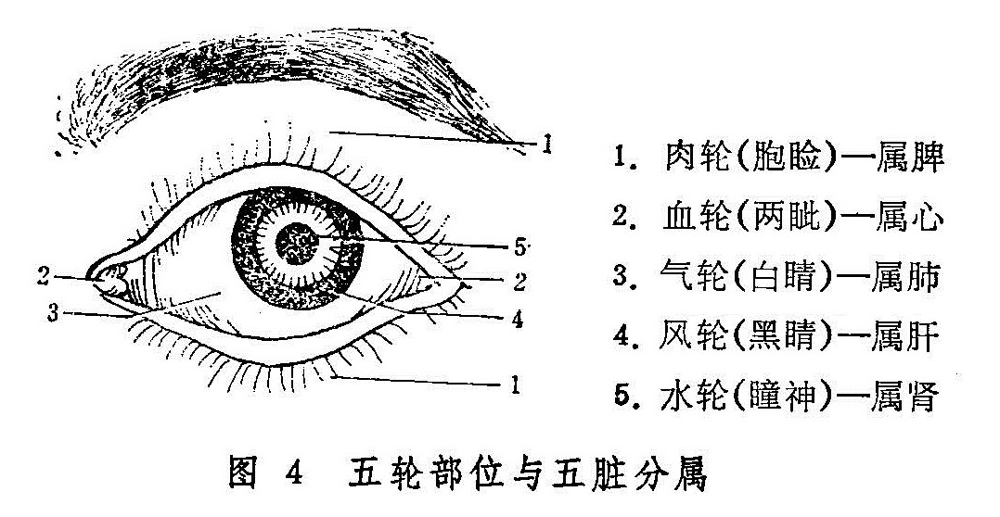

## 第一节　五轮概要

五轮学说，是基于眼与脏腑经络相关的原理，将眼由外向内划分为肉轮、血轮、气轮、风轮和水轮等五个部位，而分属于脾、心、肺、肝、肾等五脏，借以说明眼的部位、生理和病理等，用来指导临床诊治眼病的理论方法。所谓轮，是比喻眼珠圆转运动似车轮之意。

五轮学说源于《内经》中有关眼与脏腑关系的论述。正如《灵枢•大惑》所说：“**五脏六腑之精气，皆上注于目而为之精，精之窠为眼，骨之精为瞳子，筋之精为黑眼，血之精为络，其窠之精为白眼，肌肉之精为约束，裹撷筋骨血气之精而与脉并为系，上属于脑，后出于项中**”。五轮学说就是后世眼科医家在此论述的基础上发展起来的。

《医方类聚》收录的《龙树菩萨眼论》中已提到“水轮”、“血轮”之名，但未述及其他三轮。但据此可以证明，五轮之说唐代可能已经产生。现存医籍中，最早详细纪载五轮的名称，并将五轮与五脏、五行相配的，当属宋代的《太平圣惠方》。《秘传眼科龙木论》所载刘皓的“五轮歌”，与普通所谓五轮的分部不同，后人多不从之。五轮学说的内容及其作用如下：

（1）五轮内容。五轮即肉轮、血轮、气轮、风轮和水轮。肉轮部位在胞睑，内属于脾，脾主肌肉，故名；脾在五行属土，其色黄，主运化，故肉轮以色黄润泽、开合自如为顺。血轮部位在两眦，内属于心，心主血，故名；心在五行属火，其色赤，故血轮以红活润泽为顺。气轮部位在白睛，内属于肺，肺主气，故名；肺在五行属金，其色白，故气轮以白而光泽为顺。风轮部位在黑睛，内属于肝，肝主风，故名；肝在五行属木，其色青，故古人认为，风轮应以青莹明润为顺。其实，黑睛包括水膜与黄仁两部分，二者之间充以神水，水膜、神水均无色透明，其青莹之色系由瞳神与黄仁之色衬托而成。水轮部位在瞳神，瞳神内含神水、睛珠、神膏、视衣等，其内属于肾，肾主水，故名；肾在五行属水，其色黑，故水轮以黑莹净彻为顺。肾主藏精，内寓先天之真阴真阳，阴阳之精气上注瞳神，故可随天地阴阳之变化（光线之强弱）而展缩。（图4）

（2）轮脏标本关系。眼之有轮，各应于脏，脏有所病，每现于轮。脾有所病每现于肉轮，心有所病每现于血轮，肺有所病每现于气轮，肝有所病每现于风轮，肾有所病每现于水轮。如《儒门事亲》卷一云：“气轮变赤，火乘肺也；肉轮赤肿，火乘脾也；黑水神光被翳，火乘肝与肾也；赤脉贯睛，火自甚也。”

另外，由于脏与腑的表里关系。肉轮与胃、血轮与小肠、气轮与大肠、风轮与胆、水轮与膀胱亦有密切的关系、五轮出现的病变，亦常可责之于上述相应之腑。

还有，根据眼与五脏六腑相关的理论，神光的发生与五脏六腑均有密切的关系。因瞳神为神光发生之所，所以，瞳神疾患除可按五轮学说责之于肾与膀胱外，有时尚需与其他脏腑联系起来予以辨证治疗，始为全面。

（3）用五行学说中的生克乘侮的理论，阐述五轮的生理功能，病理变化及其相互关系。如《证治准绳•七窍门》云：“金为五行之至坚，故白珠独坚于四轮。……气若怫郁，则火胜而血滞，火盛而血滞则病变不测，火克金，金在木外，故气轮先赤，金克木而后病及风轮”。又如《目经大成》中“流金凌木”一症，乃火郁肺金，白睛有病，金气凌木，似膜非脂，以气轮而蚀风轮，黑睛亦伤。因此，即要了解轮脏的标本关系，又要熟悉五行生克乘侮的关系，才能通权达变。

五轮学说对临床实践有一定的指导意义，但亦有一定的局限性。因此在临床中，还必须灵活运用，切勿拘泥。
