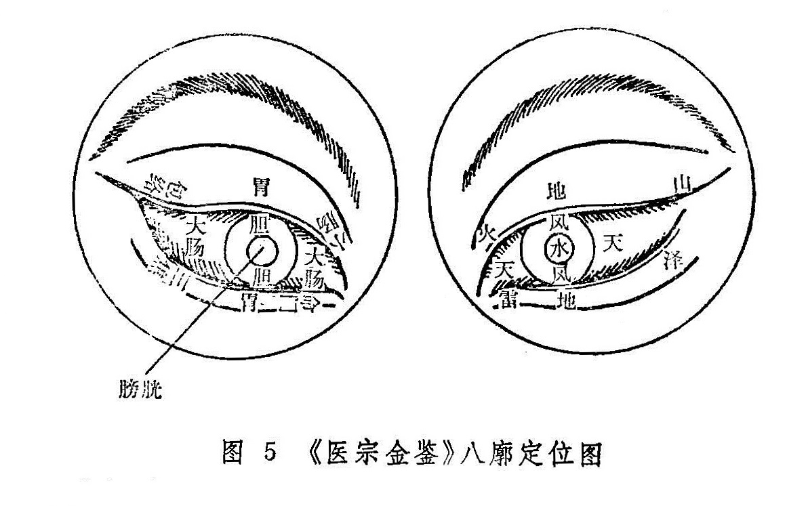

## 第二节　八廓概要

八廓学说，是基于眼与脏腑相关的理论，将眼分为八个部位，取其匡廓卫御之义，配以八卦之名，分别称作乾廓、坤廓、坎廓、离廓、巽廓、震廓、艮廓、兑廓，并与不同的脏腑相联属，借以说明眼的各个部位的生理、病理，从而指导辨证论治的一种眼科专科理论。因八卦的基本卦象分别是天、地、水、火、风、雷、山、泽，所以八廓又分别称作天廓、地廓、水廓、火廓、风廓、雷廓、山廓、泽廓。

八廓学说的肇源，明代医家徐春甫认为是龙木禅师所首创，但今传〈医方类聚》所录《龙树菩萨眼论》的内容，没见有八廓之词。宋代《严氏济生方》曾云：“方论有五轮八廓，内外障等之证，兹不复述。”说明严氏之前八廓学说已经形成。现存的《秘传眼科龙木论》书后所附《葆光道人龙木集》中有“八廓歌”，是将部分眼病归属于相应脏腑，分为八类，以“廓”名之，却无八廓的明确部位，实际意义不大。从《银海精微》开始，后世均将八廓与八卦联系起来，用八卦的卦象说明八廓的生理与病理。

古人关于八廓的定位比较混乱。细究之，可以认为历史上的八廓定位主要分两大派系。一为《银海精微》〜《医宗金鉴》系，可用《医宗金鉴》为代表，是将五轮更细致地分为八个部位，分别以八廓名之；一为《证治准绳》〜《眼科六经法要》系，可用《眼科六经法要》为代表。是按八卦的方位将眼分为八个部分，并以八廓名之。现分述于下：

《医宗金鉴》的八廓定位：（坎）水廓位于水轮——瞳神，（巽）风廓位于风轮——黑睛，（乾）天廓位于气轮——白睛，（坤）地廓位于肉轮——胞睑，（离）火廓位于血轮的内眦上方，（震）雷廓位于血轮的内眦下方，（艮）山廓位于血轮的外眦上方，（兑）泽廓位于血轮的外眦下方。（图5）

《眼科六经法要》的八廓定位：是根据八卦的方位而定廓位的。即震东、兑西、离南、坎北、艮东北、坤西南、乾西北、巽东南。但人体经络是左右相对的，故两眼之中，左眼为阳，按上例顺数，右眼为阴则须以上例逆数。（图6）

八廓所属脏腑，历史上的两个派系均较混乱，《医宗金鉴》则认为，古代论八廓，将其属脏又属腑，导致了八廓所属的混乱。所以主张，五轮即属五脏，八廓自应属腑，这样可使轮廓分明，便于临床应用。《眼科六经法要》同意这种观点，所以与《医宗金鉴》的八廓所属完全一致。即（乾）天廓属大肠、（坎）水廓属膀胱、（艮）山廓属包络、（震）雷廓属命门、（巽）风廓属胆、（离）火廓属小肠、（坤）地廓属胃、（兑）泽廓属三焦。（见表1）

历史上，各家均采用《葆光道人龙木集》之八廓名，为各廓另立一别名，分别称津液廓、传导廓、抱阳廓、清净廓、养化廓、水谷廓、关泉廓、会阴廓。由于各家对此八廓别名的意义解释不一，或从不同角度认识所属脏腑之功能，或从不同角度解释八卦之卦象，所以对各廓所定的别名多不一致，今将《医宗金鉴》《和眼科六经法要》之别名列表比较如下：

表1《医宗金鉴》、《中医眼料六经法要》八廓名称及脏腑分类比较

| 廓名  |          | （乾）天廓 | （坎）水廓 | （艮）山廓 | （震）雷廓 | （巽）风廓 | （离）火廓 | （坤）地廓 | （兑）泽廓 |
| :---: | :------: | :--------: | :--------: | :--------: | :--------: | :--------: | :--------: | :--------: | :--------: |
| 别 名 | 医宗金鉴 |   传导廓   |   津液廓   |   会阴廓   |   关泉廓   |   养化廓   |   抱阳廓   |   水谷廓   |   清净廓   |
|       | 六经法要 |   传导廓   |   津液廓   |   会阴廓   |   抱阳廓   |   清净廓   |   养化廓   |   水谷廓   |   关泉廓   |
|       | 所属之腑 |    大肠    |    膀胱    |    包络    |    命门    |     胆     |    小肠    |     胃     |    三焦    |

由上表可知，雷廓、风廓、火廓、泽廓的别名，两书不相一致。其中雷廓属命门，《医宗金鉴》解释说：“命门者龙雷之火，（龙雷之火生于水中），故名关泉”；《眼科六经法要》解释说，雷廓位于内眦侧，“是当震位，震为雷，为阴中之阳，二阴一阳，阴爻在外，阳爻在内（即☵），所以称为抱阳廓。”风廓属胆，前者曰：“胆为少阳，主长养化育，故又名（养化廓）焉”；后者曰：“巽风名清净廓，属胆者，系因胆腑素称清净也。”火廓属小肠，前者曰：“抱阳廓即火廓，火廓属心（指火廓之部位按五轮属心），心与小肠为表里，依附于阳，故又名焉”；后者曰：“离火名养化廓，属小肠，系以小肠者受盛之官，化物出焉故也”。泽廓属三焦，前者曰：“清净廓即泽廓，三焦者，阳相火也，蒸化水谷，为决渎之官，故名清净”；后者曰：“兑泽名关泉廓，属三焦者，以三焦为决渎之官，只有沼泽，方能关其泉水也。”

历史上，将八廓学说具体用于临床以诊疗疾病的医家不多，但并不能说八廓学说毫无实用价值。其实，上述两种八廓定位法各有道理，例如《医宗金鉴》的八廓学说可与五轮参合应用。即瞳神为水轮又为水廓，故其在脏属肾，在腑属膀胱，瞳神疾患则可根据临床表现或补肾精，或利膀胱；黑睛为风轮又为风廓，故其在脏属肝，在腑属胆，黑睛疾患，可根据临床表现治肝或治胆，或肝胆同治；白睛为气轮又为天廓，故其在脏属肺，在腑属大肠，白睛疾患可根据临床表现而治以理肺或泻大肠；胞睑为肉轮又为地廓，故其在脏属脾，在腑属胃，胞睑疾患的治疗可根据临床表现补中气或清脾泻胃；内眦为血轮又为火廓和雷廓，故其在脏属心，又属小肠和命门，内眦疾患可根据临床表现治心或小肠与命门；外眦为血轮，又为山廓与泽廓，故其在脏属心，又属包络和三焦，外眦疾患可根据临床表现治心或包络与三焦。以上小肠与心相表里，命门、包络、三焦均为相火，故四者均禀命于心君之火，皆附于血轮。由此可知，《医宗金鉴》的八廓与五轮基本是一致的，唯两眦部轮廓所属比较复杂，还需经临床研究以验证。

《眼科六经法要》的八廓分部，当依《审视瑶函》之说：“验廓之病，与轮不同，轮以通部形色为证，而廓唯以轮上血脉络丝为凭。或粗细连断，或乱直赤紫，起于何位，侵犯何部，以辨何脏何腑之受病，浅深轻重，血气虚实，衰旺邪正之不同，察其自病传病，经络之生克逆顺而调治之耳。”
