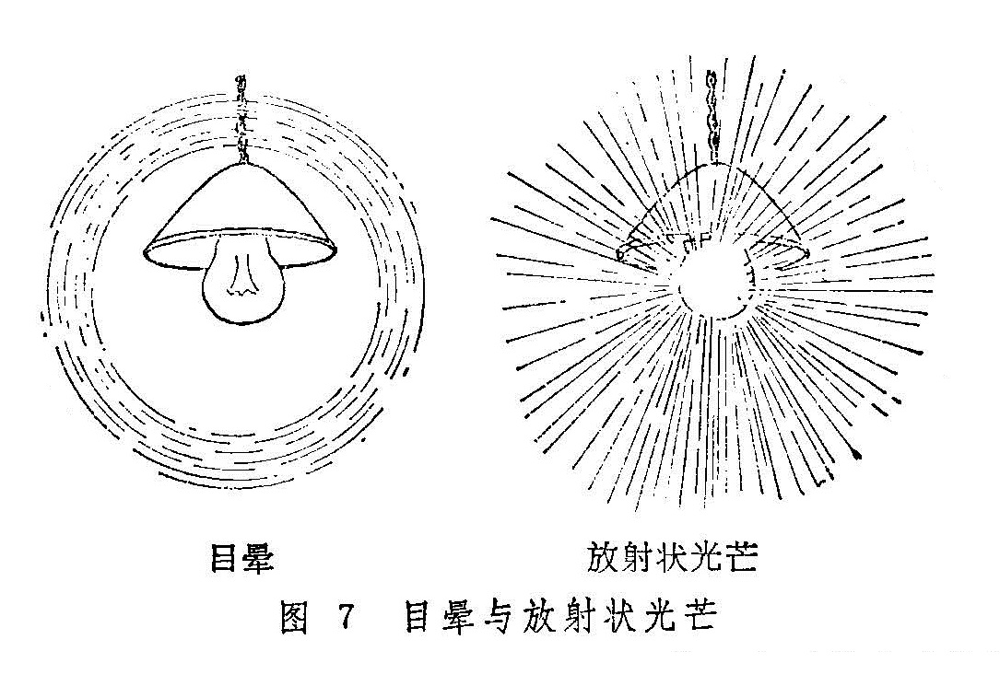

## 第一节　问诊

问诊对于眼病的诊断和辨证十分重要，尤其是内障眼病，外证多不明显，通过问诊，了解眼局部及全身症状，才能洞察病情，为辨证论治提供可靠的依据。

问诊时要心中有数，有目的、有次序、有重点。首先应围绕主诉进行有条理的询问，对病人眼局部的自觉症状，如视觉、痛痒、眵泪以及头身兼症、饮食、睡眠、二便等均应详细询问。因问诊的内容较多，为避免遗漏病情，根据张景岳的“十问歌”，结合眼科的具体情况，特编组“眼科十问歌”如下，临床问诊时可据此依次进行。

一问视觉二痒痛，三问脐泪四羞明。

五头六身七食味，八问二便九眠梦。

十问因史兼旧疾，小儿痘疹妇胎经。

阴阳表里详细辨，寒热虚实宜分明。

1.问一般情况：包括姓名、性别、年龄、婚姻、职业、籍贯、工作单位和家庭住址等。

2.问病史：

（1）首先要问清患者就诊时，自觉最痛苦的症状，并问清发病有多久，是否与季节有关，是单眼、双眼，是初发、复发，起病急骤或是逐渐而生，发病后病情变化快慢如何。

（2）疾病的诱发因素：发病是缘外感时邪，或因情志波动；是过食五辛酒浆，或是因持续用眼，劳倦过度。有无发热或眼部外伤史、手术史。亲属或邻里之间有无类似之眼疾。

（3）治疗经过：是否经过治疗，曾用过何种药物，剂量大小及其它特殊疗法，效果如何，目前是否继续使用。

（4）旧疾：询问此次患眼病之前的一般健康情况及何时何地患过何种疾病（包括眼病和全身疾病）、治疗情况，与现在证是否有关。

（5）个人生活史：如出生地、居留地，到过何地，居住环境、条件、生活及工作情况，饮食习惯及特殊嗜好（如烟酒），性情及精神状态，婚姻情况；男性有无遗精滑泄、阳萎早泄；妇女应询问其月经初潮、周期、经量、色质、结婚年龄、带下及孕、产、育情况；小儿患者应询问生产、生长、发育、喂养史及痘疹史。

（6）家族史：家庭成员或亲属的健康状况，曾患过何种眼病，有无严重宿疾或类似眼病，发病及现在情况如何，如亲属已死亡，应询问其死亡原因及年龄。

3.问眼部自觉症状：

（1）视觉：包括视力如何，视物有无变形、变色、变大、变小及其它异常视觉。对视力下降者，应问清视力是突然骤降或是逐渐昏矇；是视物昏渺或是盲而不见；是视近不清或是望远模糊，或是视远近皆昏矇，或是注视稍久则感不清；是白昼视力如常而入暮则目暗，抑或白昼觉昏而黑夜反稍感精明等。

其次问有无视一为二，视大为小，视小为大，视物颠倒、视直为曲，视正反斜，视定若动，视物易色，或不辨颜色等。

再问有无妄见，如眼前有无阴影，颜色如何，是点状、片状、环状或条索状，其随眼而动，或是如蚊蝇飞舞、旌旗飘荡，眼前有无萤星、闪光或火焰霞明。视灯火烛光，其周围有无红绿彩圈环绕，有者为目晕。但应注意，有些患者常诉视灯光四周有放射状光芒，与目晕不同，应予区别（图7）。

此外，亦应问单眼正视前方时，视物范围有无缩小或偏缺。

（2）眼痛：主要询问疼痛的时间、性质、牵连的部位及其兼证。

目痛的时间，应问是白昼痛甚或是夜痛难忍，是凌晨目痛或是上午、午后、日西、午夜作痛或加剧；是持续不止或是时作时止，或是过用目力后目痛。

目痛的性质，应问是刺痛、胀痛、灼痛、涩痛、隐痛、碜痛、剧痛。是隐隐胀痛还是胀痛如裂；还应问目痛时牵连的部位，是连及前额、眼眶、鼻颊或是颞额，或是巅顶、后项。

目痛的兼症亦应问及，如痛时有无发热或恶寒，是否伴有头痛、目眩、目赤、眉棱骨痛、口干及烦躁、恶心、呕吐。眼珠痛与头痛若同时存在，则需问清何者先发作。目珠转动时，疼痛是减轻或是加剧，痛时有无拒按或按之缓解，目痛时喜得热熨或是凉敷。

（3）眼痒：主要询问目痒的性质和程度。

目痒的发作是否与季节、处所、饮食物、药物等有关；是否迎风痒剧，无风则减，遇冷遇暖时，是加重或是减轻；是微痒不舒或是如虫爬行，难以忍受，揉拭不止；是初病时作痒或是病退时作痒；是痛痒兼作或是先痒后痛，先痛后痒；作痒部位是两眦，或是胞睑、睑弦，或是白睛；目痒时，是否伴有干涩、目赤或糜烂等。

（4）眼眵：有无眼眵，是骤起或是素有，量之多少，眵布满眼或仅限于眦角。其性质如脓或似浆，眵硬胶粘或清稀不结，或呈粘丝状。眵色是白或黄或淡绿。

（5）眼泪：重点询问性质和量之多少，是迎风泪出或无时泪下，是热泪如汤或冷泪长流，或睑内含泪不外流；泪水是清如水，或浊如浆，或泪眵夹杂，或泪血混合；流泪时是否兼有目赤、酸涩或干燥等证。

（6）羞明：主要问羞明与眼局部症状的关系。如是目赤多泪怕热而羞明，或是目昏干涩而羞明，或是遇光明痛如针刺而羞明。

4.问全身自觉症状：

（1）头痛：眼病与头痛常相兼作。问诊时应重点询问头痛的部位、时间与性质。是满头痛、偏头痛或双侧头痛，或疼痛的部位在额部、颞部、巅顶或枕后，是久痛或是暴痛，是阵发性疼痛或是持续不止，何时痛剧，是否与时辰有关。其疼痛的性质是如裹、如锥或似斧劈，是胀痛、隐痛或是掣痛。是否伴有恶心、呕吐、呃逆等。

（2）饮食：包括纳食、饮水与口味。纳食多少，有无不思饮食或食后痞胀，以及多食善饥，或偏食偏嗜。有无口渴，是大渴引饮或是渴不欲饮，是喜热饮或是凉饮，冷食后有无不舒感；口中味觉如何，是否有甘、淡、咸、苦、酸、臭之某种感觉。

（3）睡眠：是嗜睡或是失眠，是彻夜不寐或是睡中多梦易醒，醒后难寐。

（4）二便：大便是燥结或是稀溏，是秘结或是干稀不定，有无五更泄，便时有无肠鸣腹痛、里急后重，便中是否夹杂有不消化之食物，气味有无腥臭、酸腐，便色如何。

小便颜色是黄是赤是白，有无频急、失禁或遗溺，溲中是否有脓浊或带血。
