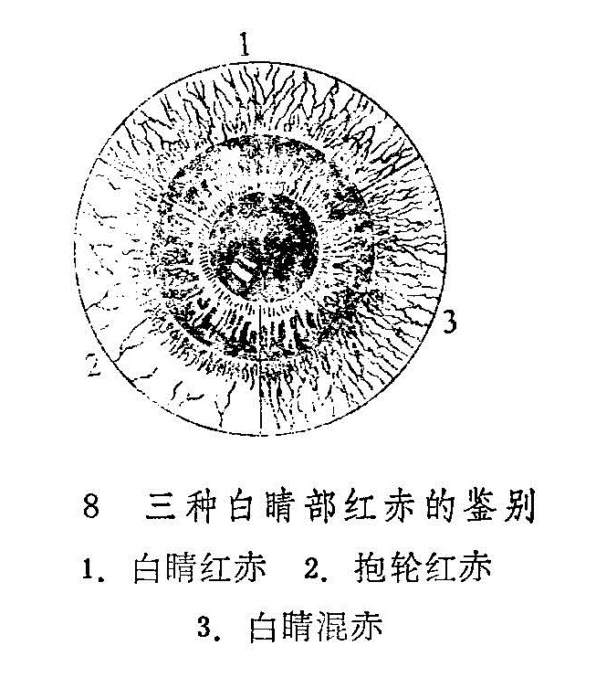

### 六、常见症状辨证

眼科疾病，常见特有的有红肿、痛痒、眵泪、翳膜以及视觉改变等方面的症状，它揭示了脏腑经络功能失调的病理变化。因此，结合八纲、脏腑、五轮、八廓、六经等辨证方法，辨析这些症状的发生机制和性质，对临床治疗具有重要的指导意义。

（一）辨视觉

1.视力下降：视物不清而眼部红赤，灼热刺痛，羞明流泪，黑睛生翳者，属外障病，多为外感风热或肝胆火炽所致。外观端好，视物不清，多属内障，其中视力突然下降而失明者为暴盲，多因头风痰火，血热妄行，或气不摄血，气血逆乱，神光被遮所致。若眼部外观轮廓如常，视物模糊不清者，为观瞻昏渺，视力逐渐下降，乃至视物不见者为青盲，均多为肝虚血损，或元阳不足，真阴亏耗而成。若视近尚清，望远模糊，多为阳气不足；视远较清，视近模糊者，多为阴津亏虚，精不上荣。入夜眼盲不见，若小儿体虚瘦弱者，多为肝虚血少。若视界狭小，多为肝肾亏损或脾肾阳虚。

2.视觉异常：凡眼外观端好，不痛不痒，而自视眼前出现片状带色阴影，遮隔神光者，称为视瞻有色，常属肝肾阴亏，元气大伤，或痰湿阻滞，或痰火湿热上攻所致。若视物变形，如视直为曲，视大为小、视小为大、视正反斜、视物颠倒等，多为风痰上扰清窍或阴虚血少，目窍失于濡养，或肝风内动，或血虚生风，或阴阳失调所致。临证遇之，当结合全身证候而辨析。

本无此物而自觉见之，称为妄见。如自觉眼前有金星飞扬，状如萤火飞伏缭乱，称为萤星满目，多属心肾不交；自觉眼前有蚊蝇飞荡或似云雾飘浮，称为云雾移睛，多属肝肾不足，或气血瘀滞，其中色呈黄褐者，又为脾胃湿热，或脾虚挟湿；若自视眼前有电光闪掣，时发时止，称为神光自现，多属真阴不足，虚阳上浮或气阴两虚；若眼观灯火，其周围有五色彩圈环绕，状如日晕或月晕。称为目晕，多出现于五风内障，常因肝郁化火而上炎或水衰不能制火，虚火浮越于上而成。

（二）辨红肿

红肿多见于外障眼病，其性质和程度轻重的差异，在辨证上的意义各不相同。

1.胞睑：胞睑微红微肿微痒，多为风邪初犯；眼睑红赤明显且有肿痛，多为脾胃蕴热；若红肿似桃且有灼痛，系热毒炽盛；若皮肤红赤糜烂，如涂朱色，多湿热蕴蒸；若兼有鳞屑如糠皮样，或起水泡，为湿热内蕴，复受风邪；若胞睑漫肿而色紫暗，多为气滞血瘀；肿胀虚浮，皮色光亮，不痛不痒者，多为脾虚湿阻，或脾肾阳虚，水气上泛。

2.白睛：若白睛暴赤，且兼痒感及多眵，系肺经风热；白睛红赤明显，色呈鲜红，多因肺经实火；白睛不赤而浮肿，状如鱼膘，为肺气不利：白晴血丝淡红，久久不消，兼见目涩或微痒，多为肺阴不足，津不上荣；血丝淡红迂曲，多为肺气不足，血行不必若抱轮红赤，多为肝肺实火或木火乘金；若抱轮红赤不甚，目痛较轻者，多为阴虚火旺；若见白睛混赤，多为火热炽盛，气血瘀滞（见图8）。

3.两眦：若两眦部红赤明显或赤脉传睛，多为心火炽盛；若兼眦角赤烂，疼痛，多为湿热互结，兼有血瘀；若赤脉细歧色淡，伴有涩痒者，为心经虚热，或肝血不足；若睛明穴处肿胀似枣，色鲜红或紫暗，多为心火旺盛，或肝脾热毒积滞而成；若肿胀不甚，但压之有脓液自泪窍溢出，多为风热毒邪内蕴。

（三）辨痛痒

目痛、目痒的性质、时间、轻重以及牵连的部位不同，可结合全身证候，作为阴阳、寒热、虚实的辨证依据。

1.目痛：疼痛为眼病最常见的症状之一，内外障皆可有之。外障引起的目痛为涩痛、碜痛、或痛如针刺、如鸣啄，多为阳证；内障引起的目痛多为酸痛、胀痛、掣痛，或眼珠深部作痛，多为阴证。一般暴痛多实，久痛多虚，日间痛者属阳，夜间疼者属阴。早晨目痛属阳，午后目痛属阴。久痛不止属实，时发时止属虚。痛重而肿者为实，痛轻而不肿者属虚。疼痛难忍，且兼红赤者为火邪实，隐隐作痛，红赤不著者为精气虚。赤痛而胞肿且多眵多泪者，为风热壅盛；痛而畏寒，时吐清涎者，属虚寒。痛而拒按且喜冷敷，属实属热；痛而喜按，热敷则舒，属虚属寒。痛而躁闷为肝气实，痛而恶寒为阳气虚。痛如针刺，持续不止，为火邪有余；隐痛时作，发无定时，为阴虚火动。目珠胀痛如暴，多为气火上逆；目珠坠痛似脱，多为肝胆火炽。痛连巅顶后项者，属太阳经受邪；连及两侧头痛者，属少阳经受邪；痛连前额鼻齿者，属阳明经受邪；痛连巅顶，兼有干呕吐涎者为肝胃虚寒。眼先痛而牵连头痛者，病情较轻；头痛而累发目痛者，多见于头风害目，病情较重。

2.目痒：目痒多属风邪为患，但也有虚实之辨。若迎风痒甚，且兼见目赤肿痛，为风热外袭，属实。若痒涩兼作，赤痛不著，时发时止，多为血虚生风，属虚。若目痛初发而痒者，为眼病加重之象；目病将愈而痒者，为血气渐复之征。眼无病而忽痒，多为眼病之先兆；若搔痒不已，兼睑弦赤烂，眵泪交加，多属湿热内蕴，兼受风邪；若目痒隐隐，或兼有干涩者，此乃虚火入络；痒若虫行，极难忍受，多为风胜所致，或为湿热生虫。

（四）辨眵泪

主要从量之多少，色泽和稀稠，并结合兼证进行辨证。

1.眼眵：眼眵多者属热，但有虚实之辨。若眵多而干结，为肺经实热；眵多而稀且不结者，为肺经虚热。眵多色黄似稠脓，多为肺胃热毒炽盛。若眵多胶粘，属脾肺湿热。

2.流泪：热泪如汤，多属内热炽盛；兼有赤肿疼痛，多为肝经实热或异物入目；泪热频频，兼有畏光，多为肝经血虚有热。迎风流泪，兼有目痒或胞肿，多因风邪外袭。冷泪长流，拭之不断多属气血不足，统摄无权；时流冷泪，兼见目昏，多为肝肾两亏。

（五）辨羞明

宜结合眼部及全身证候辨证。如兼见红赤肿痛，眵多泪热，属风火实证；若兼有遇光涩痛难睁，痛如针刺者，多为火邪炽盛；若兼干涩不适，但无赤痛，多为阴虚血少，不能配阳。

（六）辨翳膜

在古医籍里，把起于黑睛水膜及睛珠的混浊均称为翳，前者为外障，后者为内障。本处仅就水膜所生之翳与易于混淆的膜加以分辨。

1.翳：翳为发于黑睛水膜的混浊，根据病变形态、颜色、深浅程度不同，各有不同的命名。为便于临床运用，这里将其划分为活翳和宿翳两类。

活翳：指活动可变之翳。《草庐拙》谓：“活者，有红有泪有痛，能进能退，浮而活泼未定也”。所以，凡黑睛水膜发生混浊，色呈灰白，边界模糊，翳形浮嫩，表面粗糙，有可变趋势，伴有不同程度的目赤肿痛、畏光流泪症状者，统属活翳（既往的教科书称新翳）范畴。如聚星障、花翳白陷，凝脂翳等均属此类。活翳多为外感，且易传变。其中翳如秤星数枚，或聚或散，布于黑睛，称聚星障。一般说来，聚星障发病早期，稀疏色淡，浮于黑睛表层，抱轮微赤，多为风热外袭，证情较轻。若见星点云集，抱轮红赤明显，兼有畏光、流泪，疼痛较剧，多为肺热肝火。若星翳连缀成片，翳色黄白，多见溃陷，白睛混赤，疼痛羞明，为花翳白陷，多属肝胆火炽。若翳如凝脂，色呈鹅黄或黄绿，疼势剧烈，称凝脂翳，多为火热炽盛，若救治失时，极易黑睛溃破，黄仁绽出，甚者眼珠塌陷。活翳日久，不见进退，但表面仍粗糙浮肥，久不痊愈，为正虚邪衰之象，聚星障、花翳白陷均常出现此候。因此，临床对活翳必须辨别表里虚实，严密观察其发展变化，不可掉以轻心。

活翳的转归，轻者可消散而痊愈，重者则转为宿翳。

宿翳：凡黑睛混浊，表面光洁，边缘清晰，无发展趋势，亦无赤肿疼痛流泪等症状者，称为宿翳。如冰瑕翳、连珠外障、斑脂翳等均属此类。

宿翳为活翳或外伤之后遗留的瘢痕。因此，在活翳期间，即应抓紧治疗，力争使翳消退。宿翳将成未成之时，积极治疗，亦能使翳部分消退，甚至大部分去除。若日久气血已定，则药物多难奏效。至于对视力的影响程度如何，主要是看翳的具体部位，且与大小、厚薄也有关系。

活翳和宿翳有时可同时存在，临证须当细辨。

2.膜：自白睛或黑白际处起障一片，或赤或白，渐渐向黑睛中央蔓延者，称为膜。若膜上有赤丝密集者，称赤膜；赤丝稀疏色淡，红赤不显者，称白膜。凡膜色淡，尚未掩及瞳仁者为轻证；若膜厚色赤，掩及瞳神者较重；若膜厚阔而赤丝盘虬如积血堆肉，遮掩整个黑睛者，最为严重。

翳和膜鉴别要点是：翳发于风轮，膜来自气轮。翳薄而膜厚。翳多无赤丝伴绕，膜常有赤丝伴绕。

复习思考题：

1.眼科的问诊有哪些独特内容？试述之。

2.怎样进行眼的一般检查？

3.何谓白睛红赤、抱轮红赤，白睛混赤？

4.何谓目晕？简述其主要病机。

5.对眼部的红肿、疼痛、眵泪应如何进行辨证？

6.眼科有哪些独特的辨证方法？

7.怎样辨别翳与膜？