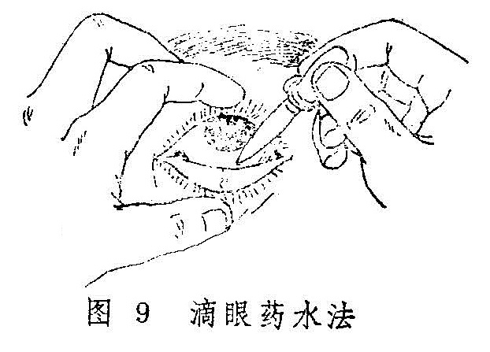
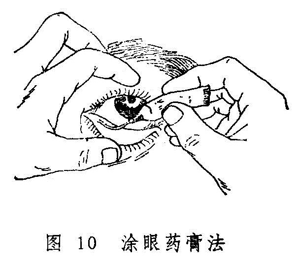

### 二、外治法

外治法是运用具有祛风、清热、除湿、活血通络、祛瘀散结及退翳明目等各种不同作用的药物和手术从外部直接施治的方法。临床应用甚为广泛。常与内治法密切配合，尤其是对外障眼病，更为适宜。

外治法种类很多，除药物点滴、熏洗、敷熨外，还有钩、割、烙、针等手术方治。现代中医眼科不仅继承了传统的外治法，而且积极改进，有所发展。

1.点眼药法：本法是将药物直接点入眼部，多用以消红眼、祛眵泪、止痛痒、除翳膜。适用于外障眼病及部分内障眼病。常用的有眼药水，眼药粉与眼药膏三种。

（1）滴眼药水：将药物配成水剂应用。用法如患者为坐位，令头部稍微仰起，先在其下眼睑下放置一棉球；如患者为卧位，则令其头微偏向患眼侧，先置一棉球于小眦外侧。令患者双目上视，医生用左手轻轻向下拉开下睑，右手持滴管或滴瓶，将药水滴入大眦角或白睛下方（图9）。然后轻轻将上眼睑提起，并同时放松下睑，使药液充分均匀地分布于眼内，轻轻闭目数分钟即可。一般每次1〜2滴，每日3〜4次。遇急重眼病，可增加。

注意滴药要细心查对眼药瓶上的药名标签与所滴的眼别，滴管头部慎勿触及胞睑的皮肤与睫毛，以免污染滴管与药液。如滴入毒性药物，则滴后须用手指压住睛明穴下方1〜2分钟，以防药液通过泪窍流入鼻腔，引起中毒。

（2）点眼药粉：将药物制成极为细腻的粉末后应用。用时以小玻璃棒头部沾湿生理盐水，再蘸药粉约半粒到一粒芝麻大小，医生用手指轻轻分开眼睑，一般将药物轻轻抹于大眦角处，令患者闭目，以有清凉感为度。点毕，患者以手按鱼尾穴数次，以助气血流行，闭目数分钟后，渐渐放开即可。每日三次。

注意一次用药不可太多。否则容易引起刺激而带来不适，甚至可致红肿刺痛等反应。同时注意玻璃棒头部要光滑，点时不能触及黑睛，尤其是黑睛生翳者，要慎重。

（3）涂眼药膏：将药物配成膏剂应用。现一般多用软管药膏，用时将药膏挤出少许，置于胞睑皮肤患处或眼内白睛下方（图10），轻轻提拉下睑后，令患者闭眼，用棉球轻轻按揉胞脸2〜3分钟即可。如用玻璃棒取药，则当患者闭目时，将玻璃棒横向徐徐自眦角方向抽出。每日三次或临睡前用一次。当抽出玻璃棒时，切勿于黑睛表面擦过，以防擦伤黑睛。

2.熏洗法：熏法是利用药液煮沸后的热气蒸腾上熏眼部；洗法是将煎剂滤清后淋洗患眼。一般多是先熏后洗，合称熏洗法。这种方法除由于药液的温热作用，使眼部气血流畅，能疏邪导滞外，尚可通过不同的药物，直接作用于眼部，达到疏通经络、退热消肿、收泪止痒等效果。它适用于胞睑红肿、羞明涩痛，眵泪较多的外障眼病。

临床上可根据不同病情选择适当的药物煎成药汁，也可将内服药渣再度煎水作成熏洗剂。使用前，在煎药锅或盛药液的器皿上作一盖板，盖上开一个洞，洞口大小与眼眶范围大小一样，熏双眼时可开两个相同的洞。药物煎成后，用盖板覆盖在药锅或盛药的器皿上，将患眼置于洞口熏之。如属胞睑疾患，闭目即可；如属眼珠上的疾患，则要频频眨目，使药力达于病所。

洗眼时，可用消毒纱布或棉球渍水，不断淋洗眼部，亦可用消毒眼杯盛药液半杯，先俯首，使眼杯与眼窝缘紧紧靠贴。然后仰首，并频频眨目，进行眼浴。每日二至三次，每次20分钟。

熏眼煎剂蒸气的温度不宜过高，以免烫伤，但也不宜过冷而失去治疗作用。洗剂必须过滤，以免药渣入眼。同时，一切器皿、纱布、棉球及手指必须消毒，尤其是黑睛有陷翳者，用洗法时更须慎重。

眼部有新鲜出血或患有恶疮者，忌用本法。

3.敷法：敷法分热敷、冷敷与药物敷三种。

（1）热敷：热敷能疏通经络、宣通气血、有散瘀消肿止痛之功。适用于外障眼病伴有目赤肿痛者，亦可用于眼外伤后的胞睑赤紫肿痛及陈旧的白睛溢血，血灌瞳神者。一般分湿热敷和干热敷两种。

湿热敷法先用凡士林或抗生素眼膏涂于眼睑皮肤上面，呈薄薄一层，然后用消毒毛巾或纱布数层，放于沸水内浸湿，取后拧干，等温度适中时，即置于胞睑上，时时保持温度，每次20分钟，每日三次。注意不可太热，以免烫伤皮肤。

干热敷法用热水袋或玻璃瓶装以热水，外裹毛巾，置于胞睑上即可。

脓成已局限的病灶和新出血的眼病，忌用此法。

（2）冷敷：冷敷具有散热凉血，止血定痛之功。适用于胞睑外伤后皮下出血肿胀，亦可用于眼部之焮赤肿痛甚者。一般用冷水毛巾或冰块橡皮袋敷之。

（3）药物敷法：药物敷法是选用具有清热凉血、舒筋活络、散瘀定痛、化痰软坚、收敛除湿、祛风止痒等作用的不同药物，直接敷于胞睑及其附近皮肤上的方法。适用于各种外障眼病。胞睑疾患与外伤用之较多。

敷药时先将药物研成细粉，根据需要，选用水或茶水、蜜、人乳、姜汁、醋、胆汁、麻油、鸡蛋清、蛋黄油等，将药粉调成糊状，敷于胞睑上，或敷于太阳穴、额部等处。如为新鲜带汁的药物，则洗净后捣烂，用纱布包后敷之，亦有用药物煎剂或盐水作湿热敷者。

如用干药粉调成糊状敷眼，则干了就再涂，以保持局部湿润为度。如为新鲜药物，则以做到清洁无变质、无刺激性、无毒性为要。药物敷眼还必须注意防止药物进入眼内，以免损伤眼珠。

4.冲洗法：

（1）结膜囊冲洗法：是用药水或药液直接冲洗眼部的方法。冲洗的目的是除去结膜囊内的眼眵、异物和化学性物质等，适用于眵泪较多的白睛疾患、结膜囊异物、手术前准备及眼化学伤的急救措施等。

方法：一般是利用盛以生理盐水或药液的洗眼壶或吊瓶的胶管来冲洗。冲洗时，如患者取坐位，头稍向后仰，将受水器紧贴颊部；如患者取卧位，则令头稍偏向患眼侧，将受水器紧贴耳前皮肤，然后轻轻拉开胞睑，冲洗液渐渐由下睑皮肤移到眼内，并令患者睁眼及转动眼珠，以扩大冲洗范围。眼眵较多或结膜囊异物多者，应翻上下胞睑，暴露上胞内面及上部屈曲之处，彻底冲洗之。冲洗毕，用消毒纱布揩干眼外部，然后除去受水器。

冲洗时应注意，如为卧位冲洗，受水器一定要紧贴耳前皮肤，以免水液流入耳内，或预先于耳内塞一个小棉球亦可。如一眼为传染性眼病，应先冲洗健眼，并注意防止污染之冲洗液溅入健眼。

（2）泪道冲洗法：是用水液冲洗泪道的方法。它多用来探测泪道是否通畅及清除泪囊中积存的分泌物，适用于冷泪症及漏睛症患者，或作为眼内手术前的常规准备。

方法：用0.5〜1%的卡因溶液点眼二次，或用蘸有的卡因溶液的短棉签，夹在大眦头上下泪点之间，约2〜3分钟后，令患者头向后仰冲洗者以左手食指将下睑往下拉，固定于眶缘部，暴露下泪点。若泪点过小，可先用泪点扩张器扩张之。继而右手持装有5〜10ml生理盐水的注射器，将磨成钝头并弯曲成近直角的4号针头垂直插入下泪点约1〜2mm深，然后内转90°，成水平位，沿泪小管缓慢向鼻侧推进，待进针3〜5mm时，缓缓注入冲洗液。若遇阻力，不可用力强行通过。

如泪道通畅者，冲洗液可以从泪道流入鼻内，水从同侧鼻孔流出；如泪管道狭窄，冲洗时有一定阻力，大部分冲洗液从上泪点返流，仅少量冲洗液通过，鼻孔流出水液呈滴状；如鼻泪管阻塞，则冲洗时阻力很大，鼻咽部无水，冲洗液主要从上泪点返流；若从泪小点返流出粘液脓性分泌物，则为漏睛症；如鼻咽部无水，冲洗液自原泪点或上泪点射出，或觉有坚韧的抵抗感，进水阻力很大，则可能为泪小管阻塞。
