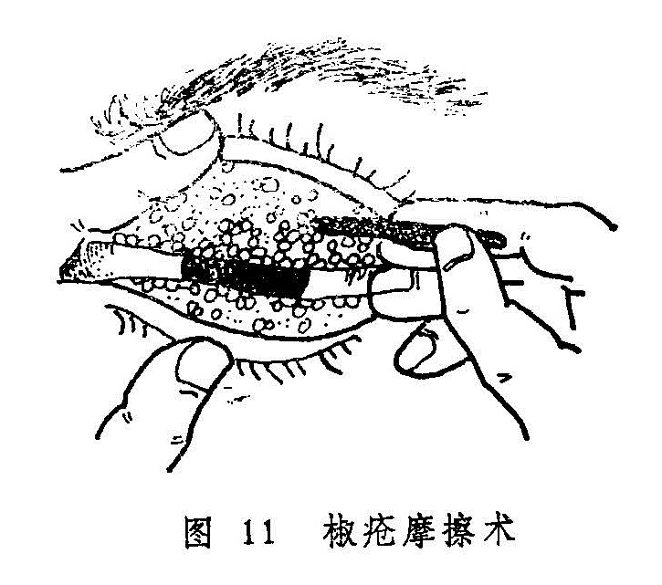

### 三、常用手术疗法

手术治疗是中医眼科外治法的内容之一。常用有钩割、劆洗、烙法、针法等。主要适用于药物治疗难以奏效的眼疾，如目疡成脓、倒睫拳毛、眼生赘疣、胬肉攀睛、圆翳内障等。现代中医眼科在继承整理古代手术治疗的基础上，吸收了现代医学的消毒、麻醉技术和一些眼科手术的长处，对某些传统手术进行了积极的改进，而且有所发展。现介绍如下：

1.椒疮摩擦术：本手术是古代劆洗术的发展。古代所谓劆洗，是以锋针在椒疮颗粒上逐个刺之三五度，或以粗糙之草茎轻擦患部以出瘀血后，再用水冲洗的治法，现代多已不用。今之椒疮摩擦术，应用器械为海螵蛸棒，海螵蛸棒可以自制。

操作方法：左手翻转上脸，右手拿起摩擦棒粗头（体部），把另一头（头部）向沙眼的滤泡与乳头用轻快的手法，从左到右反复轻轻的摩擦（图11）。摩擦时间与反复摩擦的次数需根据病情决定，主要是能充分的擦去椒疮颗粒为目的。摩擦后，用生理盐水冲洗。

2.胬肉钩割术：

本法是以特制的小钩挽起胬组织，用刀或铍针割除的治法。术前术眼常规消毒，用针麻或表面麻醉行局部麻醉。手术时，首先用锋利之钩针穿入肉中，将胬肉挽起，（现代多用镊子夹住胬肉颈部），后用锄刀逐步将胬肉与黑睛和白睛分离，动作要轻，分离要干净。分离至眦部后用刀割除，亦可用小剪剪除，割毕以烙器烙之，以防复发。术后涂消炎眼药膏，眼垫包封术眼，每日换药一次。伤面愈合后外点犀黄散〔241〕善后。

钩割时须避免损伤正常组织，尤其不能损伤黑睛。清晨空腹及过劳时不宜手术，以防晕倒。

3.金针拨障术：年老体弱人患圆翳内障，翳定障老时宜用此手术治疗。此为中医眼科治疗圆翳内障的重要手术方法（详见各论第五章、第六节）现代医家在它的基础上，吸收西医同类手术的优点，建立了中西医结合的白内障针拨套出来，临床亦可采用。
