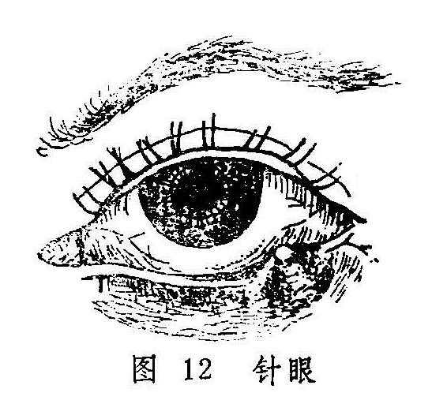

## 针眼　眼丹

针眼是指发生在睑弦上的局限性小疖，民间常以针刺破出脓或针挑背上红点而愈，故名。针眼之名首见于《诸病源候论•针眼候》，其云：“人有眼内眦头忽结成疤，三五日间，便生脓汁，世呼为偷针。”后世又称为土疳（《证治准绳》）、土疡（《目经大成》）等。

眼丹则是整个胞睑焮红漫肿，继而化脓的疮毒。《外科大成》对本病描述道：“眼丹生于眼胞，红热肿痛，由脾胃二经风热所致。若风盛则浮肿易散，热甚则坚肿难消……俟脓成则针之，贝叶膏贴之收口。”《医宗金鉴·外科心法》和《中国医学大辞典》亦有类似记载。针眼与眼丹均是发生于胞睑部位的化脓性病变，发病因素大致相同，只在病变范围上有所差异，故而合并讨论。至于《外科正宗》所载的“眼丹”，虽亦肿胀作脓，然明言“此乃睛明穴内空难敛，成漏者多。”类似于“漏睛疮”；《外科启玄》所载的“眼丹”，证候为“赤肿甚，不作脓”，类似于眼科医籍中所谓“胞肿如桃证”。两者均有专篇论述。

针眼和漏睛疮之毒邪蔓延，亦可引起胞睑的大部或全部红赤肿痛，此时须与眼丹鉴别。针眼导致的胞睑赤肿，可于睑弦部察及红色颗粒或局限性脓点；漏睛疮导致的胞睑赤肿每于大眦侧偏重，后则局限于睛明穴处，终可在该处溃脓而破口；眼丹发病则整个胞睑红肿无头，脓成后指压有波动感，溃口亦多不居于胞睑之边缘或大眦部；三者易于鉴别。

眼丹尚须与胞肿如桃相鉴别，后者胞睑赤肿而皮肤光亮，鲜有化脓者，两者是不同的。

〔病因病机〕

本病有因风热相搏，客于胞睑者；有因过食辛辣炙煿等物以致脾胃蕴积热毒，上攻于目者。二者均可致营卫失调，气血凝滞，津液被灼而变生疮疖。针眼反复发作者，常为发病后治疗不彻底，余邪未尽；或为素体虚弱，易感风热邪毒之故。

〔辨证论治〕

（一）辨证要领

针眼初起，在胞睑某部微红微肿，刺痒不舒，继而形成局限性硬结，形似麦粒，三五日后，便生脓液，于睑弦之睫毛根部出现黄白色脓点（图12）。轻者硬结细小，可自行消散，重则溃后排脓始愈。若热毒扩散，可致整个胞睑红肿，形似眼丹，亦可致胞睑周围及颜面漫肿，甚则头目剧痛，出现疔毒走黄之凶症。针眼有惯发性，多生于一目，但也有两目同时而发，或一目肿核消后，他目又起。

眼丹较针眼为重，整个胞睑漫肿，边界不清，触之肿硬，疼痛拒按。其肿软下垂者易消，焮红色紫而坚硬者难消，每易酿成脓液，溃透眼胞。眼丹及针眼之重证，均可于耳前或颌下触及臖核，光滑而有压痛。病人亦可伴有寒热头痛等全身症状。

两病在发病早期，均可见胞睑微肿，或见肿软下垂，或有颗粒发起，伴见恶寒发热头痛等症，此为风毒外束之证；若肿而坚硬，焮热赤紫，疼痛拒按，伴口渴喜饮，便秘溲赤者为脾胃蕴热，火毒上攻所致；针眼之顶部发白，中央部稍软，或眼丹变软局部按之有波动感者，即为脓已成熟，脓出即可痊愈。一般情况下，速溃者易敛，迟溃者难敛，或可成漏而经久不愈。久不敛口或肿核经久难消者，多为脾胃不健，气血虚弱所致。针眼每有此愈彼起，反复发作者，常为原患针眼而邪毒未消，脾胃蕴伏之热毒不时上攻胞睑所致；或为正气本弱，易于感受外邪而成，临床宜细致分辨，详察病机而施治。

（二）论治要点：

以上证候针眼和眼丹均常见风毒外束或热毒上攻之类型，针眼亦常见因脾胃伏热而反复发作者。对针眼和眼丹的治疗，原则上对未成脓者，应以清热消肿为主，促其消散，这是最理想的治法，也是此两病初期的治疗总纲。荆防败毒散、仙方活命饮、泻黄散和清胃散，均有消肿解毒之功，可根据具体证情而选用；若有大便干者可选内疏黄连汤〔34〕；发病中期，肿势已成，已无消散之望，但尚未溃破的，可选用透脓托毒之法，促其早日液化成脓，并外溃而泄毒，用仙方活命饮即可；已成脓者，当切开排浓，使其早愈。后期治疗宜彻底，切忌导致邪毒蕴伏而使针眼反复发作。针眼因余邪未清，或气血不足而邪气易客胞睑，导致病情反复发作，日久不愈者诚不鲜见。所以，清脾散和托里消毒散亦系针眼常用之方药。

须特别注意的是，此两病酿脓之后，切忌妄行压挤，以免脓毒扩散，导致疔毒走黄。

（三）常见证治

1.内治：

（1）风毒外束：

证候：针眼初起，局部微有红肿痒痛，或是眼丹肿软下垂，痒痛并作。或伴头痛、发热、恶寒、全身不适等，舌苔薄白，脉浮数。

治法：疏风、清热、解毒。

方例：荆防败毒散〔150〕或仙方活命饮〔74〕。前方适用于风寒外束者；后方适用于热毒较甚而外兼风热者。

（2）热毒上攻：

证候：疮形坚硬，焮热疼痛，红肿带紫，伴口渴喜饮，便秘溲赤，苔黄脉数。

治法：清热泻火解毒。

方例：泻黄散〔139〕合清胃散〔198〕。

（3）气血不足：

证候：胞睑肿硬，红肿不甚，微痒微痛，或脓汁不多，或经久难消，或针眼反复发作，此愈彼起，伴面色㿠白，胃纳欠佳，气短乏力，大便不实，舌质淡，脉细无力，

治法：健脾益气养血，托里排脓。

方例：托里消毒散〔88〕。

（4）脾胃伏热：

证候：原患针眼，余邪未清，脾胃蕴伏热毒，致针眼之硬结虽然缩小，但久不消散，或易反复发作，此伏彼起，或伴口燥唇干，口气热臭，渴欲凉饮，舌红少苔等证。

治法：清脾散热

方例：清脾散〔202〕。

2.外治：

（1）针眼未酿脓者，局部可用湿热敷以助消散。两病均可用茶清和蜜，调如意金黄散〔100〕敷患处，或用紫金锭〔237〕磨汁，频涂患处皮肤，以消肿止痛。

（2）已成脓者，当切开排脓。若脓头在眼睑外面者，切口应与睑弦平行；脓头位于睑内面者，切口应与睑弦垂直。

（3）针挑法：对针眼，可在肺俞或膏肓穴附近皮肤上，找出红点一个或数个，消毒后，用毫针挑破，挤出粘液或血水。

（4）针刺疗法：常用穴：攒竹、睛明、丝竹空、瞳子髎、阳白、鱼腰、四白、承泣、合谷、列缺、外关等。但须注意，眼部取穴应在红肿区以外，手法宜用泻法。亦可酌选太阳、合谷、上星等穴点刺出血。

（四）临证权变

针眼反复发作，此伏彼起，或眼丹溃后脓汁清稀，久不敛口者，亦常见气血不足与脾胃伏热相兼的证候，证见面白无华，神疲短气，口干舌燥，溲赤便干等，可用清脾散合四君子汤〔61〕或八珍汤〔13〕加减治之。

两病因于挤压而毒邪扩散，入于血分，或内攻脏腑，出现胞睑或头面漫肿，局部紫胀剧痛，或伴寒热头痛，胸闷烦躁，甚至恶心呕吐，壮热神昏等疔毒走黄逆证者，属于邪入血分，内攻脏腑的危险证候，严重的可危及生命，应急以犀角地黄汤〔240〕合五味消毒饮〔29〕、黄连解毒汤〔212〕加减以急救之。

针眼亦有久不溃破而遗留肿核者，可按眼胞痰核处理（详见下节）。

〔调护〕

平时勿用不洁之手或手帕擦眼，勿过食辛辣之物，以免脾胃积热，发生针眼与眼丹；既则更应忌食辛辣，以免证情加剧，或导致针眼反复发作。

〔应用例案〕

张XX，女，24岁。于1955年11月26日就诊。主诉：左眼红肿已七天，疼痛剧烈，口干，便燥。

检查：左眼上睑高度红肿，偏小眦部有化脓现象，并波及白睛红赤；小眦部呈蓄水状，如鱼胞隆起，舌苔黄厚，脉沉弦而慢。

诊断：重型土疳证。以清热解毒消肿汤（金银花15克、蒲公英15克、天花粉9克、黄芩9克、赤芍9克、生地9克、荆芥9克、防风9克、甘草3克）去生地，加桑白皮6克，枳壳6克，大黄6克。连服两剂，于11月28日复诊，红肿渐消，疼痛减轻。继服上方两剂，11月30日三诊，红肿全消而愈。（《中医眼科临床实践》）。

按：本例土疳证，因邪毒较盛，以致左眼整个上睑高度红肿，颇似眼丹。然小眦部有局限性脓点乃系诊断土疳证的关键。因患眼上睑高度红肿，兼口干便燥，故为脾胃热毒上攻而致。故用清热解毒消肿汤疏风清热，解毒消肿，加大黄、枳壳清泻脾胃热毒。此方与内疏黄连汤方义相近，但因肿势波及白睛，致小眦部白睛红赤，且如鱼胞状肿起，则属热毒侵肺。所以方中用桑白皮、荆芥、防风清散邪热，服之疗效颇捷。

〔简便验方〕

（1）生南星末9克、鲜生地黄15克，共捣烂为膏，贴太阳穴，针眼即消。（《审视瑶函》）

（2）蒲公英60克、菊花15克，水煎。头煎内服，二煎薰患眼，每次15〜20分钟，日两、三次。（《常见病简易疗法》）。

〔文献摘录〕

《证治准绳》：“土疳证，谓脾上生毒，俗呼偷针眼是也。有一目生又一目者，有止生一目者。有邪微不出脓血而愈者，有犯触辛热燥腻、风沙烟火，为漏、为吊败者，有窍未实，因风乘虚而入，头脑俱肿，目亦赤痛者。其病不一，当随宜治之。……世传眼眦初生小疱，视其背上即细红点如疮，以针刺破，眼时即瘥，故名偷针。实解太阳经结热也。”

《医宗金鉴•外科心法•眼丹》：“此证由脾胃湿热，受风而成，红肿疼痛。若肿软下垂，不能视物者，偏于风盛也，浮肿易消；若焮红色紫坚硬者，偏于热盛也，肿硬难消。……此证宜速溃，迟则溃深，穿透眼胞，成漏难敛。”