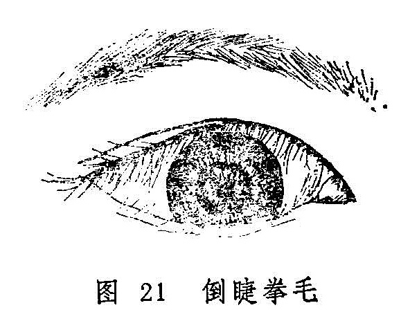

## 倒睫拳毛

睫毛向内倾倒，卷曲乱生，刺扫睛珠的病证，称倒睫拳毛（图21）。本病名见于《秘传眼科龙木论》，《圣济总录》又名倒睫拳挛，《银海精微》称为拳毛倒睫，《目经大成》简称倒睫，《原机启微》称为“内急外弛之病”。本病多为椒疮、睑弦赤烂之后遗症或并发症，因睫毛倒入，刺扫眼珠常致目赤生翳、羞明沙涩，或痛或痒，影响视力，甚至导致失明。

 

〔病因病机〕

1.风热毒邪侵袭于目，壅阻胞睑脉络。

2.恣食辛辣厚味，致湿热内生，上攻于目，阻遏胞睑脉络。

3.肺脾气虚，精微失运，皮毛筋脉失养，内急外弛而致。

4.椒疮经久不愈，或因睑弦赤烂，迎风流泪等病，频频揉擦，伤及睑弦毛根，而致拳曲倒入。

〔辨证论治〕

（一）辨证要领

本症初起胞睑痒痛，时轻时重，频频揉擦，以致脸睑皮宽弦紧，睫毛拳曲，触扫眼珠，则目赤涩痛，流泪、畏光、频频眨目，不愿久视。病久不解，刺损黑睛，可致黑睛混浊或溃烂，影响视力，重者视力丧失。

本病若见白睛红赤，修涩流泪，羞明刺痛者，多为风热所致，若见泪粘眵多，胞睑湿烂，碜涩难开，当属脾胃湿热上攻；若涩痒较轻，睑眦淡红，神倦乏力，少气懒言，则属脾肺气虚，筋脉失养。若为椒疮，睑弦赤烂，后期所致睫毛倒入，可见睑弦卷缩，睑内紫赤瘀滞，或有瘢痕形成，此为血热壅滞胞睑所致。

（二）论治要点

本病内治的重点，在于疏风、清热、燥湿、益气、散瘀，当分别证情而治之。但内服药只能减轻眼部赤肿、湿烂、眵泪、翳障之症状，根治倒睫却为不易。所以对本病应重视外治及手术，对倒入之睫毛予以拔除或施以矫正术之后，眼部诸证才能彻底治愈。

（三）常见治证

1.内治：

（1）风热壅阻：

证候：睫毛倒入。羞明热泪，刺碜难开，白睛红赤，黑睛或生翳障，全身证候可不明显，或兼舌边尖红，苔薄白或薄黄。

治法：疏风清热。

方例：石膏羌活汤〔50〕。

（2）脾胃湿热：

证候：胞睑微肿，睫毛倒入，目红涩痒，羞明刺痛，泪粘眵多，睑弦湿烂，舌红苔黄腻脉濡数。

治法：清热除湿。

方例：除风清脾饮〔171〕。

（3）脾肺气虚：

证候：成人及幼儿均可罹患，胞睑微痒，微有浮肿，时轻时重，睫毛一根或数根倒入，甚者皮宽弦紧，升举无力，大部倒入，刺痛难睁，睑眦淡红，体弱乏力，舌淡、苔白、脉细弱。

治法：益气升阳，佐以疏风清热。

方例：黄芪防风饮子〔215〕。

（4）血热瘀滞：

证候：睑弦卷缩变形，睫毛倒入量较多，扫刺睛珠，睑内紫暗瘀滞，或见椒疮并生，黑睛生翳，灼热刺痛。

治法：凉血散瘀。

方例：归芍红花散〔66〕。

2.外治：

（1）西瓜霜合剂〔87〕滴眼，每日4〜6次。

（2）犀黄散〔241〕点眼，清热去翳，可消椒疮。

3.手术：

（1）少量睫毛倒入可予拔除，或用电解倒睫术。

（2）睫毛倒入较多者，宜予手术矫正。

（四）临证权变：

风热之象明显者，宜选加祛风之荆芥穗、防风、羌活、蔓荆子、升麻、白蒺藜等；清热解毒可选加生石膏、黄芩、银花、连翘之属；若胞睑浮肿明显，致使睑弦壅肿，压迫睫毛而倒入者，还可选加苡米、白扁豆、车前子、茯苓等健脾渗湿药。若并发黑睛生翳，当参考有关章节辨证论治。

〔调护〕

注意个人卫生，勿食辛辣之品，若有原发病如椒疮，应积极治疗。勿用手揉擦患眼，以免加重病情。

〔应用例案〕

邢XX，男，72岁，1964年6月14日初诊：双目下胞睫毛倒入年余，刺痛流泪，羞明难睁，右目视物不真。检查：双目下胞皮宽弦紧，睫毛倒入，右重左轻，右目白睛红赤，青睛下方生翳，此为倒睫生翳。治宜起睫汤（白术、茯苓、甘草、当归、白芍、蔓荆子、防风）加黄芩、木贼各6克，服药6剂。6月20日复诊：皮宽稍轻，倒睫部分已起。右眼白睛有少量赤丝，云翳渐退，又服上方6剂。6月28日三诊：左目下睑稍有宽纵，还有数根倒睫没起；右目睫毛仍大部倒入，白睛稍赤，云翳甚微。以前方去黄芩、木贼又服24剂。1966年5月，因他事来本院，左目倒睫已愈，右目还有数根没起。嘱其用生姜三片，红糖1撮，浸水喝，每日1次（《张皆春眼科证治》）。

按：本例患者年高体弱，中气已虚，复因倒睫扫刺眼珠而生云翳，伴有白睛红赤，故证属虚中夹实。治以起睫汤培土生金，养血舒筋，加黄芩、木贼清热退云翳。其组方原则与黄芪防风饮相似。俟正气旺盛，热邪清解，则倒睫可除。

〔文献摘录〕

《银海精微》：“拳毛倒睫者，此脾与肺二经之得风热也。肺为五脏之华盖，主一身之皮毛，肺虚损则皮聚而毛落也。脾家多壅湿热，致令上胞常肿……上下胞睑皮渐长，眼渐紧，故睫毛番倒里面，刺眼碍涩瞳人，渐生翳膜。”

《银海指南•脾经主病》：“上睥宽纵，拳毛倒睫红痛，属肺气虚兼风，不红痛属中气下陷。”
