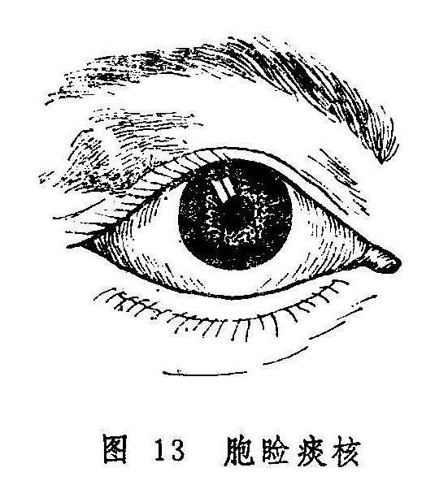
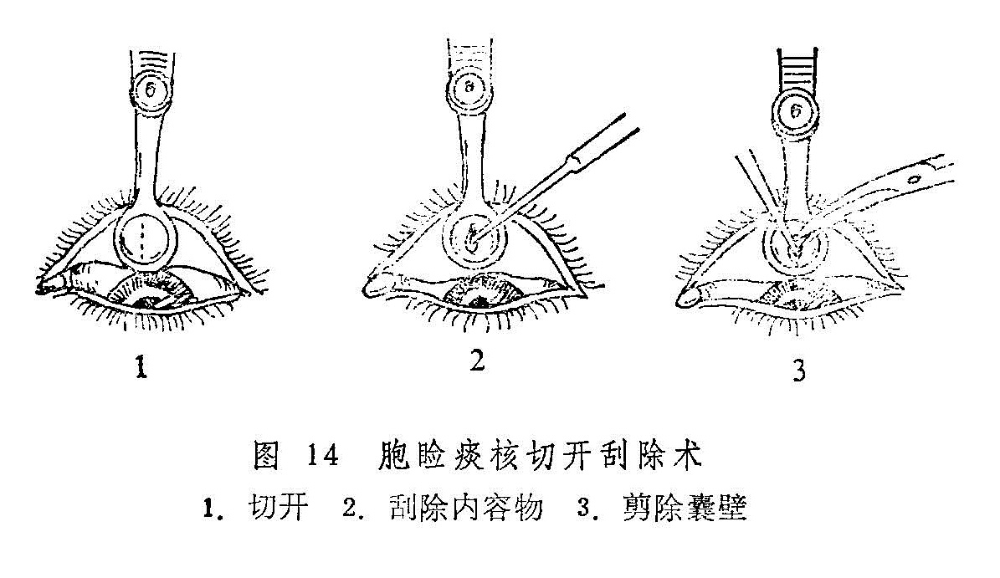

## 眼胞痰核

本病是指眼胞内生硬核如豆，不红不痛的病证，因其属于津液结聚而成，故称眼胞痰核。本病名见于《医宗金鉴•眼科心法要诀》，《原机启微》称为“血气不分混而遂结之病”，《证治准绳》，称为“睥生痰核”，《眼科易知》又称胞生痰核。本病发于上胞较多，亦有生于下睑者。

临床上，本病应与针眼相鉴别。针眼发生于睑弦，发病较急，局部红肿焮痛，肿核与皮肤粘连，压痛明显，溃破后脓出即愈。而本病则发于眼胞皮里，发病较缓，病程漫长，局部皮色如常，皮里硬结与皮肤不粘连，光滑而推之可移，无压痛。

〔病因病机〕

1.脾失健运，湿痰内凝，上壅于胞睑脉络，与气血混结所致。

2.多因恣食辛辣炙煿，脾胃蕴热，与痰湿混结，阻塞经络，聚于胞睑而成。

〔辨证论治〕

（一）辨证要领：

本病初起自觉症状不明显，常于体检时触及米粒或绿豆大的硬结，隐于胞睑皮里内外，皮色如常，按之不痛，推之可移，与皮肤不粘连。少数硬结小者，可自行消散。若日久不消，则硬结逐渐变大似黄豆，自觉胞睑有重坠感，开张不便（图13）。检查时可见患处胞睑皮肤隆起，胞睑内面呈局限性紫红色或灰蓝色改变。间有皮色渐红，硬结变软，自行溃破，排出白色稠脓样内容物而自愈者。

本病皮色如常者，属于痰湿壅阻脉络而成；皮肤微红或睑内红赤明显者，常属痰热混结。若痰核久患，突然红赤作脓，则属复感风热毒邪而致。

（二）论治要点：

本证的内治首先应分清痰湿和痰热，以便分型施治。治疗的要点是化痰散结，有热者再佐以清热药物。内治法主要适用于肿核较小或已溃破者，若肿核较大而无消散希望者，宜结合手术治疗。

（三）常见证治

1.内治：

（1）痰湿阻结：

证候：胞睑内生硬结，皮色不变，按之不痛，与胞睑皮肤不粘连。硬结大者，有重坠感。翻转胞睑，可见睥内有黄色圆形轻微隆起。

治法：化痰散结。

方例：化坚二陈丸〔40〕。

（2）痰热阻结：

证候：胞睑内生硬结，皮色微红，自觉有胀涩感。翻转胞睑，可见睑内面相应部位呈紫红或暗红色。

治法：清热散结。

方例：清胃汤〔197〕。

2.外治：初起硬结较小者，可用湿热敷促其消散。或用生南星磨醋，加冰片少许，调匀涂患处皮肤。若硬结较大，服药难消者，可用手术治疗。

3.手术：术眼按常规消毒，作表面麻醉及局部浸润麻醉后，用霰粒肿夹夹住囊肿，翻转眼睑，露出睑结膜后，取与眼睑垂直的方向，用尖刀在囊肿中央切开〔图14（1）〕，再用小刮匙将内容物刮净〔图14（2）〕，如囊壁较厚，则可剪除部分已软化的囊壁〔图14（3）〕，术毕除去霰粒肿夹，压迫止血后，涂消炎眼药膏，加眼垫包扎术眼，翌日换药即可除去眼垫。

（四）临证权变

上述两证型可以转化，治疗也应灵活。属痰湿阻滞者，尚可加大贝、昆布、海藻、苡仁、羌活、白疾藜以增化痰散结之力；热邪偏盛而欲作脓者，可加夏枯草、公英、丹皮、茺蔚子以清热凉血散结之力。

〔调护〕

饮食忌辛辣炙煿，酒浆肥甘，以免湿热生痰，渐成肿核或加重病情；平日勿用手反复磨擦痰核，以免促其增大。

〔应用例案〕

张XX，男，22岁。1977年5月23日初诊：右目红肿痒痛2天。右目上睑原有一豆大肿核，推之可动，不痛不痒。因前天外出，回家后即感右目上睑微痛而痒，次晨便觉胀痛。曾在当地医院就诊，给金霉素眼膏点之不效，今日更痛。检查患眼上睑红肿，按之中部坚硬，翻转眼胞，内面有高粱粒大黄白色脓点。此为胞生痰核外受风毒之邪，结于胞睑所致。给除风化痰汤（银花15克 天花粉9克 赤芍9克 胆南星、浙贝母、连翘、防风各6克 白芷3克）三剂。5月25日复诊：右目上睑已不红，微显肿胀，仍痒，眼睑内面有一小口，按之出脓。除尽所存脓液，涂以黄连素眼膏，包扎右眼；内服上方去胆南星，减银花6克，加黄芪9克，甘草3克，服2剂。半年后该患者来看他病，说眼病药后已愈，痰核亦消，未再复发。

按：胞生痰核较大者，内服中药疗效较差，当以外治或手术治疗为好。若痰核较小，或术后反复发作，不能根除，或外兼风毒之邪，红肿痛者，内服中药为宜，本例即是，先予祛痰散结、清热活血、疏风消肿之品，继而增黄芪、甘草益气补中，鼓舞正气，抗邪尽出，三剂见效，五剂收功，可谓应若桴鼓。

〔文献摘录〕

《审视瑶函》谓睥生痰核证：“此证乃睥外皮内，生颗如豆，坚而不痛。火重于痰者，其色红紫，乃痰因火滞而结。此生于上睥者多，屡有不治自愈。有恣辛辣热毒，酒色𣂪丧之人，久而变为瘿漏重疾者，治亦不同。若初起知劫治之法，则顷刻而平复矣。”
