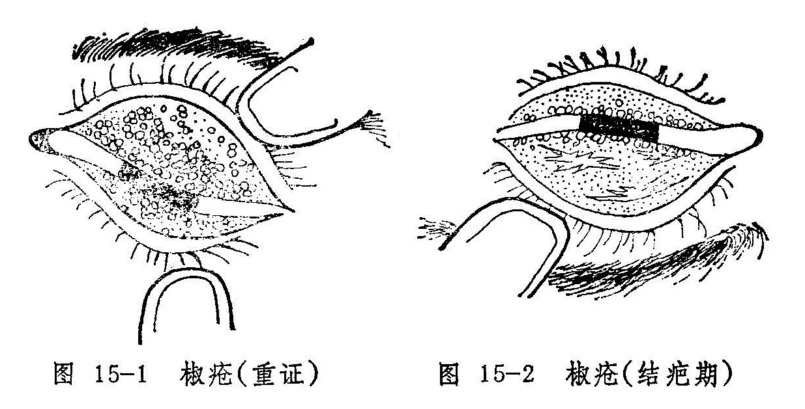

## 椒疮

本病是睑内发生颗粒的一种病变，其颗粒经久难散，色呈黄红或暗红，甚者如椒粒累累，故名椒疮。现代则因其睑内粗糙不平，状如砂砾，而称之为沙眼。病名首见于《证治准绳》，在《秘传眼科龙木论》和《银海精微》里均是将本病包括在“睑生风粟”之内。本病是一种比较常见的慢性传染性眼病，发病率甚高，且每易并发其它眼病而影响视力，甚或导致失明。

粟疮、粟子疾也是睑内发生颗粒的疾患，但形色均不相同，应注意鉴别。

〔病因病机〕

多因忽视眼部卫生，感受风热邪毒，内兼脾胃积热，内热与邪毒相结，壅阻胞睑脉络，气血失和而致。

〔辨证论治〕

（一）辨证要领

本病初起，往往无任何不适，或仅有轻微的痒涩不爽。翻转上睑，可见睑内近眦处红赤粗糙，患处的脉络轮廓模糊不清。仔细辨认，可见红赤的粗糙面上有无数针尖大小的颗粒，色红而排列密集。红赤的范围可逐渐扩大，甚至布满整个上睑内面。证情继续发展，可在前红赤部位发生椒粒大的颗粒。此颗粒实为泡性，颜色微现黄红或暗红，内灌混浊的浆液，大小不匀，形状不一，边界模糊，质地混浊，排列极不规则，甚或可相互融合成串，疙瘩不平。此时可自觉沙涩羞明，眵多流泪，胞睑重胀难睁。上睑内面广泛发生颗粒后，病变亦可发展到下睑内面（图15-1）。

因颗粒磨擦眼珠，可导致垂帘翳下侵黑睛。垂帘翳又名赤膜下垂，轻者极为稀薄，呈多数赤丝垂入黑睛上缘，重者呈肉红色赤膜一片，下覆黑睛中央。赤丝尽头处可发生细小星翳，甚至可相互融合而成云翳，严重影响视力。

椒疮的颗粒溃破之后，可在睑内形成疤痕，疤痕先呈条状或网状（图15-2），最后则全部结疤而使睑内变为灰白色的光滑面。此时多可伴发倒睫拳毛、黑睛生翳等并发症，严重者整个黑睛翳障满布，终则气血凝定，翳障光滑如瓷，黑睛混白如玉，瞳神被遮而失明。

本病初起阶段，睑内有针尖大小的颗粒密集而生，使病变部位呈现一片红赤，多为脾胃积热，兼以外受风毒，风热交聚于胞睑所致；其中又有偏于风热或脾胃热盛之分。脾胃热盛者可兼便干溲赤，或有眵多流泪，偏于风热者则无。椒粒状颗粒满布者，属血分壅热，脉络瘀阻而成；若兼胞睑浮壅、湿烂胶粘、眵粘多泪者，又为胃热兼湿，湿热上犯。

（二）论治要点：

以上证候类型，临床以脾胃热盛和血热壅滞者最为常见。椒疮初期，患者多因自觉症状轻微而从不就诊。对就诊者可用外点药为主治之，遇涩痒明显者，才配合内服药治疗。内治法的关键，在于分清风、热、湿、瘀的孰轻孰重，然后分别施以上述各法。对颗粒累累而伴有痒涩刺痛，眵多胶粘者，仅用内服药往往难获速效，当须配合手术迅速消除颗粒，以免磨擦眼珠而生赤膜下垂、黑睛生翳等严重并发症。

（三）常见证治

1.内治：

（1）风热客睑：

证候：初起睑内微红，或有针尖大小的细小颗粒，患眼无明显自觉症状，或仅有轻度痒涩不适。

治法：疏风清热。

方例：密蒙花散〔200〕。

（2）脾胃热盛.

证候：睑内红赤，颗粒大且多，眼涩痒痛，或伴眵多流泪，或兼便干溲赤。舌质红，苔黄，脉数。

治法：清脾胃，散风邪。

方例：除风清脾饮〔171〕。

（3）血热壅滞：

证候：胞睑肿硬，睑内颗粒累累，疙瘩不平，红赤显著，眼睑重坠难开，刺痛灼热，沙涩羞明。可伴赤膜下垂，生眵流泪。舌质红，脉数。

治法：凉血散瘀。

方例：归芍红花散〔66〕。

（4）湿热壅盛：

证候：睑内颗粒累累，颗粒或有溃破，胶烂湿粘，睑弦浸淫胶结，或伴倒睫拳毛、痒涩刺痛，羞明流泪，眵多稀粘，拭之又生。舌红，苔黄腻，脉滑或数。

治法：清热祛湿。

方例：清脾饮〔201〕。

2.外治：以清热、化瘀、祛毒为主，可滴用化铁丹眼药水〔41〕；或点用石燕丹〔51〕、犀黄散〔241〕等眼药。

3.手术：手术是治疗本病的重要措施，适用于颗粒累累，顽固难消者。可采用海螵蛸棒磨擦法（见总论第七章第二节），以消除睑内之颗粒。

（四）临证权变：

椒疮各证候类型之间并不存在截然的界限，并且可出现两型或多型相兼的情况，所以辨证论治务须灵活，必要时可将疏风，清热、凉血、祛湿、散瘀诸法灵活配合应用。如果患者的睑内红赤比较严重，乃为热邪偏重，可以上列方药为基础，选加生地、元参、赤芍、丹皮等清热凉血药；睑内若兼湿烂粘滞，则为湿邪偏盛，可选加地肤子、土茯苓、苦参等，以增加清热燥湿作用。睑内红赤而兼涩痒者，属风邪偏盛，可酌加荆芥穗、羌活、防风甚或川乌、乌梢蛇等驱风止痒。至于伴发倒睫拳毛，睑弦赤烂、流泪、黑睛生翳等证者，又当参考各有关章节辨证论治。

需要注意的是，椒疮患者也可在眼部病证之外，伴见面黄无华，食欲不振，口泛清涎，形寒肢冷，小溲清长，大便稀薄，舌淡苔白，脉沉迟或缓弱等证，此属虚寒，切不可判为热证而用寒凉之品克伐正气，导致正气更伤，病邪缠绵不去。可选用助阳活血汤〔120〕益气和血兼以疏风。

〔调护〕

1.本病患者饮食宜清淡，忌食辛辣炙煿，以免脾胃蕴积湿热。

2.改善生活环境，注意个人卫生。患者的洗脸用具与他人分开，尤其是服务行业，必须经严格消毒后方可使用，以免相互传染。

附：沙眼的分期：

为了便于开展沙眼的防治工作，临床检查可依中华医学会眼科学会1979年11月会议的标准，将沙眼分为三期，如表2。

表2 沙眼的临床分期

| 期别                    | 依据                                                         | 分级                              | 活动病变占上睑结膜总面积     |
| ----------------------- | ------------------------------------------------------------ | :-------------------------------- | ---------------------------- |
| I    (进行期）     | 上穹窿部和上睑结膜有活动病变（血管模糊，充血，乳头增生，滤泡形成）。 | 轻（+） 中（++） 重（+++）  | <1/3  1/3〜2/3  >2/3 |
| Ⅱ   （退行期）     | 有活动性病变，同时也出现瘢痕。                               | 轻（+） 中（++） 重（+++） | <1/3 1/3〜2/3   >2/3 |
| Ⅲ   （完全结瘢期） | 仅有瘢痕，而无活动性病变。                                   |                                   |                              |

〔应用例案〕

夏XX，男，19岁，学生。1975年7月26日初诊：两目不舒，微痒近一年之久。近两个月加重，自觉沙涩难睁，流泪羞明，曾滴氯霉素眼药水，服中药数剂均未见效。检查：两目上睑肿硬，睑内疙瘩成片，色赤而硬。诊为椒疮。给解毒活血汤（银花、连翘、赤芍、牡丹皮、酒黄芩、天花粉、荆芥、防风、枳壳）三剂。7月30日复诊：言服药效果不显，睑内椒粒同前。先用海螵蛸棒磨擦后，又给上方三剂，并嘱病人不要用凉水洗脸。8月2日三诊：两目羞明、流泪、磨擦感均有减轻，椒粒亦见稍平。后每隔6天磨擦一次，又行2次，服上药24剂，服药期间病人坚持用温水洗脸，病渐痊愈。8月30日来诊：眼睑内已无椒粒，仅留少量白线状疤痕，嘱其停药。（《张皆春眼科证治》）

按：本例椒疮患者，证见上睑肿硬，睑内疙瘩成片，色赤而硬，自觉沙涩难睁，流泪羞明，病因当为外受风热邪毒，内兼脾胃积热，气血瘀阻，故用解毒活血汤疏风清热，凉血散结。本方组方原则与归芍红花散相仿，更兼配合海螵蛸棒磨擦术，故收良效。嘱患者温水洗脸，可免寒而凝滞之虞，使外邪易于疏散，热邪因之而解，气血流行，病则易除。

〔文献摘录〕

《证治准绳》：“椒疮证，生于睥内，累累如疮，红而坚则是也。有则沙擦，开张不便，多泪而痛。”

《医宗金鉴•外科心法要诀》：“椒疮生于眼皮里，形如椒粒，色赤。”

《审视瑶函》：“血滞脾家火，胞上起热疮，泪多并赤肿，沙擦最难当，或疼兼又痒，甚不便开张……胞间红瘰瘰，风热是椒疮……轻者只宜善治，至于瘰瘰连片，疙瘩高低不平，及血瘀滞者，不得已而导之，中病即止，不可太过。过则血损，恐伤真水，难养神膏。”