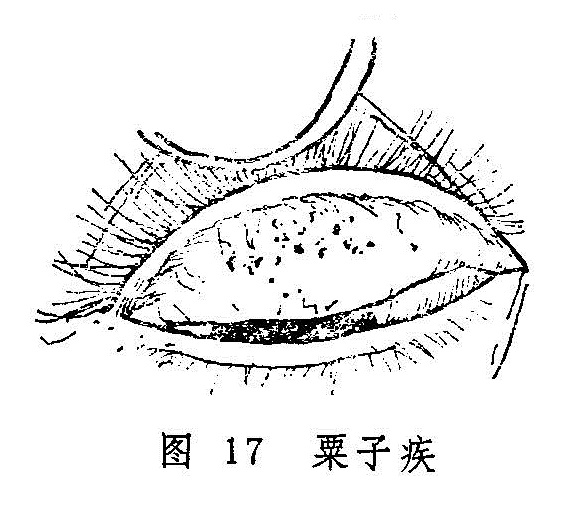

## 附：粟子疾

本病因胞睑内面发生有黄色或黄白色小颗粒，质地坚硬如石，状似粟子，故名粟子疾（图17）。本病名见于《龙树菩萨眼论》，多因脾胃虚弱，运化不力，湿浊上泛于胞睑，复受风热之邪，凝滞而成。轻者，一般无自觉症状，或仅感微涩微痒，待坚硬且碎小之粟子高突出睑内面时，则感沙涩不适；重者，磨擦目珠而致明显疼痛。临证时，不论上睑下睑，凡睑内面嵌有白点或黄点，少则单个，多则丛生，状如粟子碎米，形状不一，高低不等，或尖出于睑内之表面，即可诊为本病。粟子疾和粟疮均为细小颗粒，但形状不同，容易鉴别。粟疮为小泡，较软，半透明，累累成片，排列整齐；而粟子疾则是硬结，不透明，多少不一，大小不等，排列不整。

本病治疗以手术剔除为主。具体方法是在表面麻醉下，用消毒之三棱针或注射针头剔除，之后服凉血散瘀药如归芍红花散〔66〕，消除瘀血而杜其再发。

〔文献摘录〕

《龙树菩萨眼论》：“若眼忽单泪出者，涩痛者，亦如眯著者，名粟子疾，后上睑生白子如粟粒，极硬，沙㓨之然也。”
