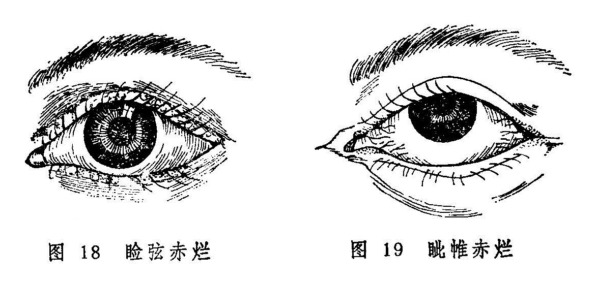

## 睑弦赤烂

本病以眼弦红赤，溃烂为特征，故名（图18）。病名见于《银海精微》，该书又称风弦赤烂，烂弦风。《证治准绳》称为风沿烂眼，并根据其症状分为风弦赤烂证，迎风赤烂证、眦赤烂证三种，既往的教科书习称睑弦赤烂。若赤烂仅限于眦部者，《审视瑶函》称为眦帷赤烂（图19）；若病发于初生婴儿，《秘传眼科龙木论》称为胎风赤烂。

风赤疮痍也是以红赤、溃烂为特征的病变，但其发生于胞睑皮肤，与本病发生于睑弦不同。

〔病因病机〕

1.脾胃湿热蕴积，复受风邪，风、湿、热三邪合攻于睑弦。

2.脾胃蕴热，复受风邪，风热合邪结于睑弦，伤津化燥。

3.心火内盛，外感风邪，风火上炎，灼伤睑眦。

此外，亦看其它眼病继发者，如椒疮、粟疮、风热赤眼、黑睛生翳等，眵泪浸渍，邪毒腐化睑弦，而致红赤糜烂。

〔辨证论治〕

（一）辨证要领

本病的发病特点是睑弦赤烂，灼热刺痒。因病多由风、湿、热三邪合而为患，风胜则痒，湿胜则烂，热胜则赤，故临床表现可因不同邪气偏胜而有异。病初起，眼弦微红，漫生透明的细小水泡，痛痒时作，频喜揉擦。若小泡溃破，则见眼弦糜烂胶粘，微肿羞明流泪。继则溃烂处生脓结痂，除去痂皮，可见睫毛根部溃陷且出血。亦有睑弦不溃烂而仅红赤，在睫毛根部变生糠麸样白屑附着者。日久可因睫毛脱落、稀疏或乱生，以致眼弦变形，甚至可因倒睫或胞睑闭合不全而并生星点云翳等证。

本证的辨证，眼睑红赤刺痒而起白屑者为风盛，湿烂甚或睑弦生脓者属湿热；红赤甚或仅发于两眦部位者为心火炽盛。

（二）论治要点

上述证型，临床以湿热偏盛者最为常见。其治疗，除内治外，还要配合外治，才能收到预期效果。内治法的要点，在于分清风、湿、火之轻重，然后分别施治。

（三）常见证治

1.内治：

（1）风热偏胜：

证候：眼弦红赤，睫毛根部有糠皮样脱屑，自觉患处灼热刺痒，干涩不舒，舌红苔薄白，脉浮数。

治法：疏风清热。

方例：加减四物汤〔81〕。

（2）湿热偏盛：

证候：眼弦赤烂，肿胀痒痛，眵泪胶粘，睫毛或成束或脱落或倒睫。口渴唇红，舌红苔黄。

治法：清热除湿，祛风散邪。

方例：除湿汤〔172〕。

（3）心火上攻：

证候：眦部眼弦红赤糜烂，灼热刺痒，甚者眦帷干裂出血而刺痛，小便短赤，舌尖红，苔黄，脉数。

治法：清心泻火。

方例：导赤散〔95〕合黄连解毒汤〔212〕。

2.外治：

（1）可用内服药渣煎水熏洗，或选野菊花、荆芥、升麻、 陈茶叶，明矾煎水熏洗。

（2）若为风邪偏胜，可用二圣散〔2〕；湿邪偏胜者，可用疏风散湿汤〔246〕；热邪偏胜者，可用万金膏〔21〕，煎水滤汁外洗。

（3）可用鸡蛋黄油膏〔127〕或铜绿膏〔226〕外搽。

（四）临证权变

本病各类型之间常相兼挟，如风盛者，可挟湿，或挟热，或兼火，故辨证论治亦需常中有变。如风热偏盛而睑弦刺痒较剧者，可加蝉蜕、蕤仁、乌蛸蛇，以增祛风止痒之力；如湿热重者可配以藿香、佩兰等芳香化湿之品；如心火旺者，可于上方中加莲子心，苦丁茶，栀子，清心除烦，利湿通络。若睑弦出现脓泡，或脓样分泌物布于赤烂的睑弦部，为湿热兼火毒，可用导赤散合黄连解毒汤，并加二花、连翘、升麻、土茯苓等治之。至于黑睛生翳等并发症，又当参考有关章节辨证论治。

〔调护〕

1.饮食宜清淡，勿食辛辣厚味等刺激物。

2.避免风邪和强光刺激，以免加重病情。

〔应用例案〕

赵XX，女，27岁。1964年12月2日初诊：双眼睑弦赤烂二年之久，时轻时重。多方求治不愈，今反加重，痛痒兼作，泪出羞明，右目视物不清。检查：双眼上下睑弦红赤糜烂，且有黄白色粘液附着，睫毛不整。右目睫毛倒入，扫擦青睛，风轮花翳遮瞳。此为睑弦湿烂所致倒睫花翳证。治以清热除湿汤（白茅根、酒黄芩、苡仁、蔓荆子、茯苓、荆芥、甘草）去荆芥、茯苓，加当归、车前子各9克，木贼6克，服药六剂。12月8日复诊：双目上下睑弦赤烂近除，右目青睛花翳将尽，但睫毛仍扫青睛，又进上方十二剂。12月21日三诊：睑弦已不赤烂，青睛花翳已除，睫毛仍内倒，停服中药，以单方茅根9克，红糖一撮，生姜三片，浸水常服，每日一次。半月后来诊，弦烂未发，但右眼睫毛仍然倒入，建议手术处理，（《张皆春眼科证治》）。

按：本例患者双眼上下睑弦红赤糜烂，且有黄白色粘液，说明是湿热偏胜，并伴有倒睫花翳证，故其治疗偏于清热除湿，佐以散风退翳。

〔简便验方〕

（1）大黑枣20个（去核），明矾末1.8克。混合后共捣成膏，用湿纸包裹，于火内煨半小时，取出去纸；用水两碗将枣膏煎汤，去渣，取汤洗眼（《奇难杂症古方选》）。

（2）一叶绿洗方：地肤叶60克，铜绿少许。上两味用纱布包好（药包要松），滚开水浸之，待温度适宜，以药液洗眼。每日一剂，共三次。（《张皆春眼科证治》）。

（3）洗烂弦风赤眼方：苦参12克，黄连、荆芥穗、防风、五倍子各9克，铜绿1.5克，研为细末，外以苏薄荷煎汤，丸如弹子大，临时用以熟水化开洗眼，每日三次。（《审视瑙函》）。

〔文献摘录〕

《诸病源候论》：“目赤烂眦候，此由冒触风日，风热之气伤于目，而眦睑皆赤烂，见风弥甚，世亦云风眼。”

《银海精微》：“因脾土蕴积湿热，脾土衰不能化湿，故湿热之气上攻，传发于胞睑之间，致使羞明泪出，含在胞睑之内，此泪热毒，以致眼弦赤烂。”

《医宗金鉴•眼科心法要诀》：“胎风赤烂之证，因在母腹，其母过食辛热，或生后乳母过食辛热，致令小儿双目尽赤，眵泪胶粘，四眦湿烂”。
