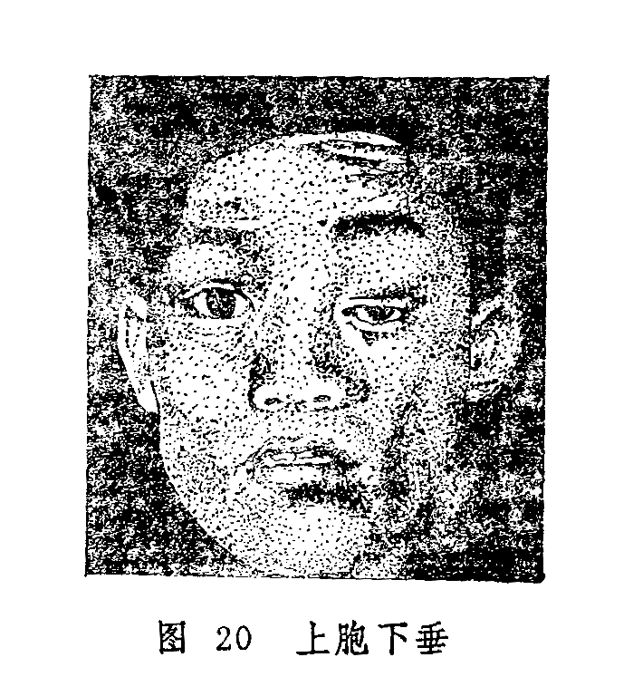

## 上胞下垂

本病是指上胞垂下，不能自行提起，遮掩部分或全部瞳神，从而影响视瞻的病变。本病在《诸病源候论》中称睢目，又名侵风，《圣济总录》称眼睑垂缓，《目经大成》称睑废，解放后的教科书始称上胞下垂。本病有先天与后天之分，可单眼发病，亦可双侧同患。若因老年胞睑皮肤松弛而眼皮下垂者，不属本病范围。

〔病因病机〕

1.脾气虚弱，阳气不升，胞睑约束无力。

2.脾失健运，聚湿成痰，外挟风邪，风痰阻塞经络。

3.先天禀赋不足，脾肾阳虚，温煦无能，肌肉失主。

〔辨证论治〕

（一）辨证要领

本病特征是上胞下垂，轻者半掩睛瞳，重者上胞麻木弛缓，无力上举，遮掩整个风轮。临床上一般分为先天与后天两种，先天患此者多为两眼同病，自幼而始，终日不能随意抬举，视物时需要仰首皱额，眉毛高耸（图20）。后天发生者，有单眼发病，也有双眼俱病，发作时有急性与慢性之分。发病急者，除见单眼上胞下垂外，每伴有眼珠偏斜，视一为二；发病缓慢者，常双眼发病，时轻时重，休息后减轻，劳累后加重，或者晨起轻，午后重，严重者亦可伴视一为二症。

 

（二）论证要点

各证型中，临床上脾虚气弱和风痰阻络两型较为多见。前者属慢性，初起证轻，病势亦缓，不易为病家所重视，常至半掩瞳神方才就诊。后者属实证，发病较急，不论证属虚实，均宜内服药物与针刺疗法相结合。虚证的内治大法，除扶正之外，尚应酌加活血通络、疏风或熄风之品；对风痰阻络者，主要应治以祛风、化痰、通络之法。本病疗程甚长，需久久服药方能奏效，所以医者与患者均需树立信心，坚持治疗。对于先天性上胞下垂，药物难以收效，可考虑手术治疗。

（三）常见证治

1.内治：

（1）脾虚气弱：

证候：双眼上胞下垂，起病较缓，晨起轻，午后重，逐渐加剧，或兼全身乏力，食欲不振，甚者吞咽困难。舌淡脉虚。

治法：益气升阳。

方例：补中益气汤〔103〕。

（2）风痰阻络：

证候：多为单眼，发病突然，睑肤麻木，并兼见眼珠偏斜，运动障碍，或瞳仁散大，自觉眩晕，恶心，舌苔白腻，脉弦滑。

治法：祛风除痰通络。

方例：正容汤〔52〕。

（3）命门火衰，脾阳不足：

证候：自幼双眼上胞下垂，抬举乏力，视物时仰头皱额，甚或用手拈起眼胞。全身或兼脾肾阳虚之证。

治法：温肾阳，益化源。

方例：右归饮〔56〕。

2.针刺疗法：太阳透瞳子髎，攒竹透睛明，鱼腰透丝竹空。并配足三里、三阴交、肝俞、肾俞、脾俞等穴，每日一次，10次为一疗程。

（四）临证权变

脾虚气弱导致的上胞下垂，可在补中益气汤扶正的基础上，选加丹参，鸡血藤、木瓜、丝瓜络、秦艽、白僵蚕等养血通络。若为气血两亏而兼受风邪，可改用八珍汤〔13〕、人参养荣汤〔11〕补益气血。风痰阻络导致的上胞下垂，寒邪偏盛者，宜于正容汤中加全虫、白芥子；热邪偏盛者，宜加地龙、黄芩、栀子、公英；湿邪偏盛者，宜选加土茯苓、萆薢，防己利湿解毒。至于因椒疮、外伤所致的胞垂，当针对原发疾病治疗，可参考各有关章节。

〔调护〕

勿在窗口、门旁或树荫下休息、工作，以免复受风邪，加重病情。

〔应用例案〕

汤XX，男，74岁，1971年12月诊治。主诉：右眼胞下垂10天。病史：患者平素头晕眼花，面色无华，精神倦怠，气短声低，四肢乏力，历久不愈。10天前突感右上睑睁闭乏力，继则逐日加重。检查：右眼正常，右眼睑外部无异，仅见上睑下垂，半掩瞳仁，脉虚沉微，舌质淡，苔薄。诊断：右上睑下垂。辨证施治：患者体质素弱，卫阳不固，风邪乘虚中络，使上睑偏废，睁闭艰难。治以益气养血，佐以祛风。药用：黄芪、党参、熟地、当归、白芍、茯苓、白术、桂心、陈皮、五味子、秦艽、天麻、白僵蚕、细辛、木瓜。三剂。二诊：药尽，稍有效验，渐觉睁闭有力，虽仍垂下，但能复原，仍用上方五剂。继后复诊三次，仍以上方加减，又服十五剂汤药后，右睑下垂基本复常。（李坤吉《实用中医眼科学》）。

〔文献摘录〕

《诸病源候论•目病诸候》谓：“若血气虚则肤腠开而受风，风客于睑肤之间，所以其皮缓纵，垂覆于目侧不能开，世呼为睢目，亦名侵风。”

《目经大成•睑废》：“两胞丝脉之间为邪所中，血气不相荣卫，麻木不仁而作此状。”
