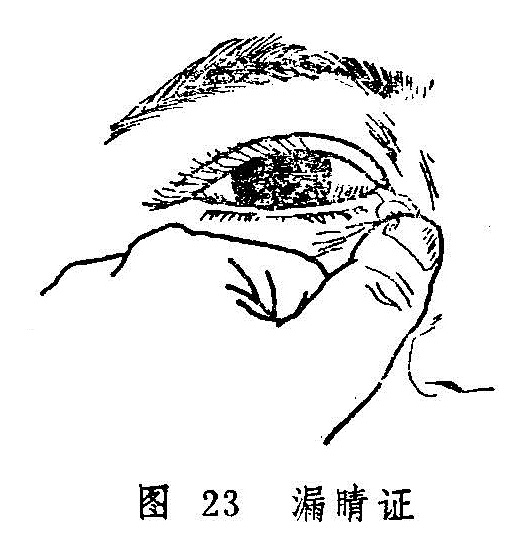

### 〔漏睛证〕

本证是以脓液或粘浊泪水时时自眦角流出为主要特征的眼病。本病名见于《太平圣惠方》，但《诸病源候论》所载的“目脓漏候”，当为本病的最早记载。之后，《秘传眼科龙木论》称为漏睛脓出，《目经大成》称睛漏，《证治准绳》中所载的“漏睛”泛指眼，的各个部位发生的漏证，包括大眦漏、小眦漏、阴漏证、阳漏证、正漏证、偏漏证、外漏证和窍漏证等，与前述漏睛的含义不尽相同。其中外漏、偏漏、正漏证分别是发生在胞睑、白睛和黑睛上病变，不属本节讨论之范围。大眦漏和小眦漏乃是以病位而分；窍漏实指脓液自泪窍流出的病证，故当为大眦漏的类型之一，临床最为常见（图23）。其它类型的大眦漏和小眦漏临床极为少见。阳漏和阴漏是以白昼和夜晚症情轻重的不同而划分，日间胀痛流水，其色黄赤、夜间稍轻者为阳漏证；从黄昏至天晓则胀痛流水，呈青黑色或腥秽不可闻，日间稍轻者为阴漏证。

本节所讨论的漏睛证是以窍漏为主，临证当与漏睛疮鉴别。后者是以睛明穴处突发赤肿，隆起似枣，疼痛拒按，继而肿核溃破流脓的病变，漏睛证则为邪热久积所致的一种比较顽固的慢性眼病。若复受外邪，可变生漏睛疮。

〔病因病机〕

1.风热之邪，侵袭泪窍，壅积日久，经脉瘀塞，泪液被灼。渐变稠浊，满溢而出。

2.心经伏火或脾经湿热内蕴，循经上攻眦部，邪留泪窍，积聚成脓，侵渍于大眦之间。

〔辨证论治〕

（一）辨证要领

本病为邪深久伏所致的顽固性眼病，辨证主要以局部症状为主，同时结合全身证候，若见泪窍溢出黄色脓液，眦部微红微肿者，为心火上炎；若见泪窍溢出白色脓液或浑浊泪水者，为风热内蕴；若见泪窍溢出粘液清稀如涎，粘附眦部，或伴视昏者，为正虚邪恋。总之，若见流出黄白色脓液者为顺证，易治；若见流出青黑腥秽脓水者为逆证，难疗。

（二）论治要点

本病的治疗当分虚实。实证局部微有红肿，脓液黄稠，治以清热排脓为主；虚证皮色如常，泪窍中常有粘液沁沁而出，治以托里排脓为主。同时，还应重视外治，如用点眼剂及泪道冲洗等。

（三）常见证治

1.内治：

（1）风热内蕴：

证候：患眼大眦处皮色似常，或见睛明穴处稍显隆起，自觉微痒，粘液不断自泪窍外流，舌淡红，苔薄黄，脉浮数。

治法：疏风清热。

方例：白薇丸〔73〕加味。

（2）心脾湿热：

证候：或眼眦角微红、微肿、微痒、微痛，轻度隆起，常肴脓液自泪窍溢出，浸渍眦部，拭之又生，伴有心烦口渴，小便黄赤，舌苔黄腻。

治法：清心利湿。

方例：竹叶泻经汤〔94〕。

（3）正虚邪恋：

证候：患眼眦部周围皮色不红不肿，按之不痛，脓液浊泪稀少、色淡而不断，缠绵不已。全身伴有少气乏力，面色无华或㿠白，舌淡苔白，脉沉而无力。

治法：扶正祛邪，托毒排脓。

方例：托里消毒散〔88〕。

2.外治：

（1）八宝眼药〔12〕或补漏生肌散〔108〕点患眼内眦处，一日三次。

（2）用黄连水冲洗泪道，解毒排脓，每日一次。

（四）临证权变

白薇丸〔73〕适用于风热滞留眦部而致的漏睛证，若局部压之不痛，且兼有头昏眼花，腰膝酸软，为素体肝肾不足，可加菊花、杞子、补骨脂以治之；对心脾湿热者，亦可选加天花粉、漏芦、乳香、没药，以加强清热排脓，祛瘀消滞的作用。虚证若兼形寒肢冷、喜热畏寒者，可改为阳和汤〔97〕，温阳散凝而排脓。若缘脓液长期浸渍，致生睑眩赤烂或凝脂翳者，又可参考有关章节辨证论治。

〔调护〕

忌食辛辣等刺激性食物，以免引发漏睛疮。

在点外用药之前，应将患处脓液压出，然后点药，并应长期坚持。

〔应用例案〕

例1、王某，女，38岁，于1970年5月18日就诊。主诉：左眼患慢性泪囊炎有一年之久，于昨天突然左眼大眦部下睛明穴处红肿硬痛，牵引左边头痛，羞明流泪，胃纳减少。检查：左眼大眦部下险红肿，按之剧痛，白睛淡红，风轮清晰，脉象弦细。

诊断：漏睛疮（左眼）。以清热解毒消肿汤（银花、公英、赤芍、黄芩、天花粉、生地、荆芥、防风、甘草）去生地、赤芍、黄芩加龙胆草10克，大黄15克，全虫12克、陈皮10克、川贝母6克。服二剂后于5月20日复诊，头目痛止，红肿全消而愈，转为慢性而停药。（庞赞襄《中医眼科临床实践》）。

例2、刘XX，男，43岁，干部。于1976年11月12日就诊。两年前患红眼，症见多泪，曾用点药、冲洗、探针等法治疗多次，效果不佳，继而左眼大眦经常流黄白色脓液，眦部胀痛，脓出则舒。伴口渴心烦，不寐，便干，瘦赤。检查：左目大眦肿胀微赤，轻按其下部有黄白色脓汁从泪窍沁沁而出。舌尖红、苔黄，脉数。

诊断：左眼眦漏症

辨证：风热毒邪外袭，蕴积于内，化火上攻，结于大眦，热痛成脓。

治则：清热解毒，排脓止痛，佐以养阴。

处方：败酱草30克、漏芦9克、栀子9克、竹叶6克、花粉6克、白芷9克、黄芩9克、黄连6克、黄柏9克、川羌活9克、瓜蒌9克、连翘30克、金银花30克、鱼腥草9克、木通9克、水煎服。服5剂，证状俱轻，肿消脓减，再加皂刺，穿山甲以消肿、排脓。又服5剂，余症皆除，一年后随访未见复发（《眼病》）。

〔文献摘录〕

《原机启微》热积必溃之病谓：“其病隐涩不自在，稍觉眊矂，视物微昏。内眦穴开窍如针目，按之则沁沁脓出，……竹叶泻经汤主之”。

《医宗金鉴•外科心法要诀》：“此证生于目大眦，由肝热风湿病，发于太阳膀胱经睛明穴……初起如豆如枣，红肿疼痛，疮势虽小，根源甚深。溃破出粘白脓者顺，出青黑脓或如膏者险。”

《普济方•眼目门》：“夫目脓漏者，缘血脉壅热，……则令人脸眦肿，久痒即成疾，脓汁时下，绵绵不绝，如器津漏，故谓之不漏，俗呼为漏睛是也。”

复习思考题

1.试述赤脉传睛的辨证论治。

2.简述泻心汤的药物组成及方义。

3.试述胬肉攀睛的辨证论洽。

4.栀子胜奇散、泻脾除热饮的药物组成及适应症有何不同？

5.胬肉攀睛一证在什么情况下必须手术？术后应注意什么？

6.试述漏睛疮的病因病机和临床表现，其治疗原则是什么？

7.试述漏睛证的病因病机、临床表现和治疗原则。它与漏睛疮有何不同？

8.简述竹叶泻经汤的药物组成及功能。
