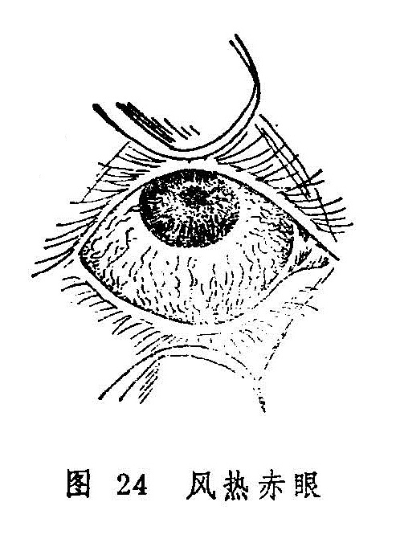

## 风热赤眼

附：暴风客热 赤丝虬脉

风热赤眼是指外感风热而突然发病，以白睛红赤热痛为特征的眼病（图24）。一年四季均可发生，以夏秋季节为多。若病情加重，每可导致黑睛生翳。本病名见于《圣惠方》。古医书中有“风火眼”、“风火赤眼”等名称。

天行赤眼虽系感受天行时气而发，且其邪气之性质亦属风热，但天行赤眼可致广泛流行，且有专篇论述，不属本节讨论的范围。

〔病因病机〕

多由风热邪毒外侵，客于内热阳盛之人，内外合邪，上犯白睛所致。

〔辨证论治〕

（一）辨证要领

本病多属骤然发病，证见白睛红赤，痛痒并作，多泪眵结，怕日羞明。风甚者多兼头痛鼻塞，恶风发热，苔白或微黄，脉浮数等，或兼胞睑浮肿而软、热甚者眼目红赤较重，胞睑红赤肿坚而热痛，畏光怕热，眵泪胶粘，或兼口渴心烦，溺黄便秘等证。若白睛红赤，痒痛并作，畏光流泪，眵多粘结，并兼发热头痛口渴便秘，苔黄脉数者属表里交攻，风热俱盛。

（二）论治要点

本病系外感风热为患，应分清风、热、毒邪的轻重，予以施治。但临床中证候类型往往难以截然分开，初起者，证轻一般可以外治为主，内治可用疏风之剂；重者可以清热、泻火、解毒为主。体质壮实，表里俱盛者，大胆施以表里双解之法，可获速效。

（三）常见证治

1.内治：

（1）风重于热

证候：白睛红赤，痒痛交作，羞明多眵，头痛鼻塞，恶风发热，或兼睑胞肿胀而软，苔微黄，脉浮数等。

治法：疏风解毒，兼以清热。

方例：羌活胜风汤〔109〕加减。

（2）热重于风：

证候：白睛赤痛较重，胞睑红肿而硬，眵泪粘稠，怕热畏光，兼见口渴、便秘、溲赤、苔黄脉数、心烦不宁等。

治法：清热泻火，兼以疏风。

方例：泻肺饮〔137〕加减。

（3）风热并重：

证候：白睛红赤，疼痛而痒，恶热畏光，眵多粘结，热泪如汤，头痛鼻塞，恶风发热，口渴多饮，便秘溲赤、苔黄、脉数有力。

治法：祛风清热，表里双解。

方例：菊花通圣散〔217〕加减。

2.外治：

（1）黄连西瓜霜眼药水〔211〕或10%〜50%千里光眼药水〔23〕点眼。

（2）胆汁二连膏〔163〕涂眼。

3.针刺疗法：可选合谷、曲池、攒竹、丝竹空、瞳子髎等穴针刺。也可用三棱针点刺眉弓、眉尖、耳尖、太阳等穴放血。

（四）临证权变

由于本病各证候类型之间界限常不明显，临证时立法选方宜灵活掌握。对一般患者，疏风药（如羌活、荆芥、防风、柴胡、薄荷等）和清热药（如黄芩、黄连、栀子、生石膏、生地等）属于必用之品，可依风、热之轻重灵活选用并加减用量。邪毒较甚者可伍用银花、连翘、公英、紫花地丁等解毒药，口渴心烦、大便秘结者则可加大黄、芒硝以釜底抽薪。

临证中应时刻注意观察风轮。一旦发现黑睛生翳，则当选加夏枯草、龙胆草，木贼草、蝉蜕等退翳之品。

〔调护〕

1.饮食宜清淡，忌食辛辣炙煿之品，以免增助内然，加重病情。

2.病人用过的手帕、面巾、脸盆等用具进行严格消毒，以免引起传染。

〔简便验方〕

蒲公英汤：鲜蒲公英120克（干品用60克），水煎两碗，滤净。一碗内服，一碗外洗患眼。（《医学衷中参西录》）

### 附一：暴风客热

暴风客热是风热赤眼的一种急重证型。乃因风热邪毒客于目窍而徒然起病，且具明显的红肿热痛，势如暴风骤起之状，故名。

《龙木论》对本证的记载是：“白睛胀起盖乌睛，睑肿还应痒痛生。”《审视瑶函》则描述曰：“暴风客热忽然猖，睥胀头痛泪似汤，寒热往来多鼻塞，目中沙涩痛难当。”可知暴风客热的临床表现为发病急暴，白珠外膜蠹红胀起，甚则高于风轮，胞睑红肿，沙涩难当，疼痛剧烈，热泪如汤，全身伴头痛鼻塞，恶寒发热。临床上，遇有上述特征之白睛疾患，即可诊为暴风客热，但有不少患者，其白睛虽赤，却未达到上述的严重程度，特别是不具备胞睑赤肿、白睛胀起之特征，不应诊为暴风客热，而可诊为风热赤眼。

暴风客热的治疗，可完全参照前述风热赤眼的处理方法。因病势急重，不应忽视针刺疗法，内治则重用前述方药即可。

### 附二：赤丝虬脉

赤丝虬脉，是指白睛上较长期地出现赤脉纵横，粗细不一，条缕分明，虬蟠旋曲的眼病。又称赤丝乱脉，或白睛乱脉。本病和风热赤眼不同：风热赤眼发病急骤，病程较短，白睛一片红赤，眵多泪热及涩磨等自觉症状明显；本病则发病较缓，病程较长，白珠外膜上赤丝或疏或密，但条缕分明，眵泪相对较少，疼痒及涩磨等自觉症状较轻。

本病多因某些热性眼病失治，火热之邪伤阴耗液，致使虚火上炎而成。或因久受风沙瘴气，或嗜食辛辣炙煿及烈酒等物，或因烟火久熏，致使热郁血脉而成。也有因长期从事微细工作，过劳目力，致使血络郁滞而成者。

本证的治疗，应抓注血滞之关键，以清热散瘀为主，重者证见虬脉粗赤，红赤粘涩紧痛，羞明流泪，应以清热逐瘀为主，可用退热散〔168〕或归芍红散〔66〕凉血散瘀。轻者丝脉细疏，紧涩不爽，微痒泪湿，治宜退赤散〔166〕清肺散结。外治可点犀黄散〔241〕。
