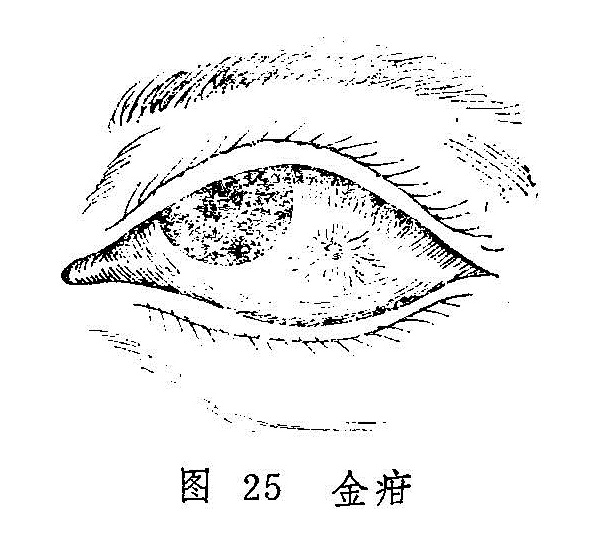

## 金疳

本病是指白睛表层发生的细小颗粒，因其形如玉粒而色白，故名金疳。病名首见于《证治准绳•七窍门》。因颗粒可发生溃陷，似白睛生疮疡，故又称金疡（《目经大成》）。

火疳亦是白睛发生颗粒的病证，但和本病的部位、形状、颜色均异，容易鉴别（见火疳）。

〔病因病机〕

1.肺经燥热，宣降失职，致使白睛气血郁滞而成。

2.肺阴不足，虚火上炎，白睛血络受阻，郁滞不行而成疳。

3.禀赋不足，脾胃失调，肺失所养，气化不利，气血郁滞。

〔辨证论治〕

（一）辨证要领

金疳初起，患者自觉眼部隐涩不适，微痛畏光，眵泪不多。白睛表层出现灰白色颗粒如粟，形似水泡，周围绕以赤脉（图25）。颗粒常为一个，重者可多至两个以上。部位不定，大小不一，压之不痛。颗粒可积久而变大，色白或淡黄，甚者溃破。数日之后，渐消而愈，不留痕迹，预后良好，但常易复发。

本病多属肺经燥热上攻白睛而成，其典型特征是颗粒高隆，周围血脉紫赤怒张，且兼鼻干口渴，便秘溲赤、舌红苔黄等肺与大肠实热壅盛之证。

若颗粒隆起不甚，周围血脉淡赤，自觉隐涩微痛，眵泪不洁，且病久难愈，或反复发作，则属虚证。若兼见五心潮热、干咳、便秘等全身症状，属于肺阴不足，虚火上炎所致；若兼见身疲乏力，便溏或便秘，食欲不振，腹胀不舒等，则又属脾肺两虚，气化不利而成。

（二）论治要点

本病位于气轮，病机每关乎肺，故治疗总以治肺为本。发病过程中虽有外邪夹杂，仍属于标。如病初期，肺中燥热居多，治宜泻肺利气散结，使气畅血行，瘀滞消而颗粒自除。若病势反复或缠绵不愈，则应润肺益气，复其宣发肃降之功。

（三）常见证治

1.内治：

（1）肺经燥热：

证候：患眼涩痛畏光，泪热眵结，白睛表层有颗粒隆起，周围丝脉红赤怒张。全身伴见鼻干、口渴、便秘，舌红苔黄、脉数有力等症。

治法：泻肺散结。

方例：泻肺汤〔138〕。

（2）肺阴不足：

证候：患眼隐涩微痛，眵泪不结，颗粒隆起不甚，周围血脉淡红，病势日久难愈，或反复发作，全身可见干咳、五心烦热、便秘等。

治法：滋阴润肺，兼以散结。

方例：养阴清肺汤〔154〕。

（3）脾肺两虚：

证候：白睛赤涩轻微，颗粒反复难愈，全身乏力，食欲不振，腹胀不适，便溏或便秘等。

治法：脾肺双补。

方例：六君子汤〔32〕。

2.外治：

（1）犀黄散〔241〕或石燕丹〔51〕点眼。

（2）黄连西瓜霜眼药水〔211〕或10%〜50%千里光眼药水〔23〕点眼。

（四）临证权变

金疳治疗总以治肺为主，但临证时尚须依主证和兼证的变化而灵活地予以处理。治疗除上述治法方药外，还应灵活变通，如初起兼有表证者，当于泻肺汤中酌加防风、连翘、赤芍以助散风清热、凉血退赤之功；对兼见大便秘结者，可加大黄不泻里热；若红赤甚者可加银花、连翘、黄芩、桑白皮以清热退赤；若因阴虚而目中津亏者，在养阴清肺汤中、选加石斛、花粉、玉竹以养阴生津，清热润燥。后期属脾肺双虚者，病势常反复难愈，可在六君子汤中加防风，桑白皮、赤芍以消积滞，缓目赤、止目痛，促使病愈。

〔调护〕

1.饮食宜清淡，忌食辛辣之品，以免辛热伤肺，加重肺经燥热。

2.注意锻炼身体，加强饮食调养，增强体质以抵御外邪。

〔应用例案〕

李XX，男，7岁，学生，1974年9月12日就诊。左眼红赤涩痛，羞明流泪，生眵7天，伴口渴心烦，小便赤涩。左眼外眦部白睛表层有一灰白色隆起，呈颗粒小泡，周围有红赤血脉环绕。舌尖红，脉数而有力。

辨证：心肺热盛，热邪郁结。

治法：清肺降火，退赤散结。

方药：桑皮12克，黄芩15克，知母12克，木通12克，生地15克，当归尾12克，赤芍12克，夏枯草12克，甘草3克。

服药3剂，诸证悉除，7年来未再复发。（《眼病》）
