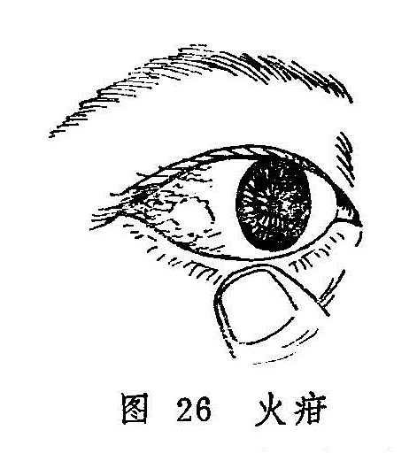

## 火疳

本病是指白睛里层向外隆起的局限性紫红色结节的疾病。此乃心肺两经实火之邪侵犯气轮，凝滞结聚于白睛里层而致，且状如赤豆而色红，故称火疳。本病名见于《证治准绳•七窍门》，《目经大成》又称火疡（图26）。

火疳是眼病诸疳中急重之证。一般病程较长，病势缠绵，且易反复发作，失治可波及黑睛与黄仁，甚至可造成失明，故当及时治疗。

本病与金疳均属白睛疾患，应注意鉴别。金疳发于白睛表层，其颗粒较小，呈灰白色，界限分明，推之可移，无明显压痛，周围血脉呈鲜红色，病程较短，颗粒可自行溃破，愈后不留痕迹。火疳发于白睛里层，其结节较大，呈圆形或椭圆形，色紫红或暗红，界限不明显，推之不移，压痛明显，其周围血脉呈深紫色，结节多不溃破，病程漫长易复发，可发展成白睛青蓝或并发瞳神干缺等症。

〔病因病机〕

1.肺热亢盛，气机不利，以致气滞血瘀，发为火疳。

2.心肺热毒内蕴，火郁无从宣泄，上攻白睛所致。

3.湿热内蕴，兼感风邪，阻滞经络，肺气失宣，郁久病发白睛。

4.肺经郁热，久则伤阴，阴虚火旺，上攻白睛。

5.肝经郁热，致女子行经之时，血热上逆壅阻郁滞于白睛。

〔辨证论治〕

（一）辨证要领

火疳多为单眼发病，也有双眼同时或先后发病者。本病初起，从白睛里层向外隆起结节，色呈紫红或暗红，形圆或椭圆，状如榴子。自觉患眼涩痛，羞明流泪。继之则隆起，渐渐增大，周围赤紫血脉丛生。结节很少破溃，但易反复，甚则危及黑睛、瞳神。

本病发于气轮而色赤，气轮属肺，赤属火，故初起多为火邪郁于肺经所致。肺失宣降，气机不利，因致气血瘀滞，阻于白睛，凝结成疳，而见节结隆起。单由肺热所致的火疳，证情较轻缓，结节较为低小，且可伴咳嗽、咽干、喉痛之证。肺热下移大肠，尚可兼见大便秘结。肺热若兼心经火毒，则发病迅急，疼痛剧烈，白睛节结高隆，脉络紫赤怒张，羞明流泪明显。

火疳缠绵不愈或反复发作者，非风湿内蕴而化热，即阴伤而虚火上炎。湿热之邪上攻白睛者，白睛结节色较鲜红，且常因湿热阻碍气机而目珠闷胀，视物不清，并可兼见骨节酸痛，肢节肿胀不适等症；属病久伤阴，虚火上炎者，白睛结节虽不高隆，痛不明显，但亦难消难愈，或反复发作，并可见口咽干燥，潮热便秘等证，火疳若遇女子经期则发，是由肝经郁热，血热上逆结聚于白睛而成。证见眼涩不适，隐隐作痛，白睛结节紫蓝。轻者数日可消，重者数周才愈，愈后不留瘀斑，常易复发。

（二）论治要点

本病以心肺热毒上攻白睛者最常见。因病变居于白睛里层，所以应以内治为主，兼以外治。结节系火邪结聚，气血瘀阻而成，故治疗当以清热散结为本，挟风者兼以祛风，挟湿者佐以祛湿，因邪热每多累及血分，故治疗亦应顾及血分，酌加活血散结之品。

（三）常见证治

1.内治：

（1）肺热亢盛：

证候：病势较缓，初起眼痛刺涩，白睛结节较小，形圆或椭圆，色红或暗，可伴咽干喉痛，咳嗽，便秘，舌红苔黄脉数。

治法：清热利气，凉血散结。

方例：泻白散〔132〕加减。

（2）心肺热毒：

证候：发病较急，眼痛难忍，热泪羞明，视物不清等症较重；白睛结节大而隆起，周围血脉紫赤怒张，压痛剧烈。全身可见口苦咽干，出气有热感，溲赤便秘，舌红苔黄，脉数有力。

治法：泻火解毒，凉血散结。

方例：还阴救苦汤〔117〕加减。

（3）风湿热邪攻目：

证候：白睛结节隆起色鲜红，周围赤丝牵绊，眼珠闷胀而痛，羞明流泪，视物不清。全身伴有骨节酸痛，肢节肿胀，胸闷纳减，舌苔白厚或腻，脉滑或濡，病多缠绵难愈。

治法：祛风化湿，清热散结。

方例：散风除湿活血汤〔234〕加减。

（4）久病伤阴，虚火上炎：

证候：眼涩酸痛，畏光流泪，白睛结节不甚高隆，血丝色偏紫暗，四周轻度肿胀，压痛不甚明显，全身可见口咽干燥，潮热颧红，便秘不爽，舌红少津，脉细数。

治法：养阴清肺，兼以散结。

方例：养阴清肺汤〔154〕加减。

（5）肝经郁热：

证候：眼涩不适，白睛红赤，结节隆起，隐隐作痛，色呈紫蓝，女子经期易发，轻则数日可消，重则数周才愈，不留瘀斑。

治法：清肝泻热。

方例：四顺清凉饮子〔65〕。

2.外治：

（1）犀黄散〔241〕每日早晚各点眼一次。

（2）龙脑煎〔59〕点眼。

3.针刺疗法：取列缺、尺泽、合谷、曲池、攒竹、丝竹空、太阳等穴。

（四）临证权变

本病初起，属于肺热亢盛，肺气不利，郁而成疳者，可用泻白散，泻肺利气，但需加牛蒡子、连翘、浙贝母清热散结，红花活血化瘀，散结消滞，并可加葶苈子、杏仁以增强泻肺之功。因于心肺热毒壅盛，白睛节结赤紫高隆，赤脉丛生，应用还阴救苦汤治疗时，可酌情减少温燥药味，并加石膏以增强清热泻火之功。由阴虚火旺而致者，用养阴清肺汤当去薄荷，加知母、石斛、地骨皮以增强滋阴降火之功，由于此类证型的结节缠绵难消，故还可将方中之白芍易赤芍，酌加丹参、郁金、瓦楞子、海浮石以清热消瘀散结。本病反复发作，导致白睛青蓝或瞳神紧小者，又当参考有关章节辨证论治。

〔调护〕

饮食宜清淡，忌食辛辣炙煿之品，以免加重内热。

〔应用例案〕

程XX，男，46岁，工人，1981年4月5日就诊。一年来左眼红肿疼痛，羞明流泪，视物不清。经治疗症状缓解，但不稳定，多次复发。伴口干咽痛，渴喜冷饮，小便短赤，大便干结。左眼白睛颞侧呈暗红色偏平结节，表面赤脉纵横，粗细不匀，有明显压痛，黑睛中央有条状白色混浊。舌红，苔黄干，脉洪大。

辨证：热毒蕴结，气滞血瘀。

治法：清热泻火，凉血散结，佐以祛风止痛。

处方：桑皮30克、蔓荆子12克、菊花15克、连翘30克、荆芥12克、防风6克、丹皮20克、夏枯草30克、羌活10克、细辛3克、桔梗12克、红花6克、当归尾12克、黄连10克、黄芩15克、黄柏10克、知母15克、生地20克、龙胆草8克、地龙15克。

上方服15剂，症状基本消失。（《眼病》）

按：本例为热毒炽盛，上犯白睛，滞结为疳。故选用清热、凉血、祛风、散结之法，用药与还阴救苦汤之方义基本相同。治法方药切合病机，故而收效甚著。

### 附：白睛青蓝

白睛青蓝是指白睛深层出现紫蓝或青灰色斑，或白睛变成青蓝色，故称白睛青蓝。本病名见于《证治准绳•七窍门》，《审视瑶函》称其为白珠俱青证。多由肝肺火热亢盛，火毒热邪郁滞白睛，煎熬阴血，气血瘀滞而成，或火疳经久不愈，反复发作，致使白睛变薄，失去光泽，逐变青蓝之色。

本病初起自觉眼珠胀痛，畏光流泪，常于黑睛四周的白睛深层形成紫红色隆起，压痛明显。继之证状消退，该处则呈现青蓝之色。病变此伏彼起，反复发作，终致白睛全轮青蓝，凸凹不平。此时病变常侵及黑睛和瞳神，形成黑睛边际的混浊及瞳神紧小等。可单眼或双眼同时发病。

本病可参考火疳进行辨证论治，但应考虑本病更易于侵犯黑睛和瞳神的特点，及正邪交错，虚实夹杂，病程缓慢，反复难愈等情况。例如，白睛青蓝伴有黑睛边际生翳，或伴瞳神紧小，并见抱轮红赤，口渴咽干，口苦耳鸣，烦躁易怒，便秘，苔黄，脉弦有力等症者，证属肝肺热盛，可用菊花决明散〔216〕泻肺散结，清肝退翳。证情较剧者，可酌加大黄、玄参、花粉等清泻实热，养阴散结。

至于邪气渐衰，病情趋于稳定，兼见全身气阴两虚或气血不足证候者，可在调理全身的基础上兼用散邪通络，活血化瘀之品。待病邪已退，正气渐复，则应改用益气滋阴，养肝退翳之法，以调理善后。如党参、茯苓、苡仁、龟板、枸杞、白芍、麦冬、杭菊花、桑寄生、潼蒺藜、密蒙花、谷精草等。

本病的外治法和针刺疗法，均可参照火疳处理，黑睛生翳或遗留宿翳者，可用涩化丹〔177〕点眼，每日三次。
