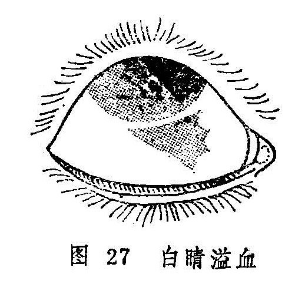

## 白睛溢血

白睛溢血是指白睛血络破损，血溢络外，积于白睛里层及外膜之间，使白睛表面呈现一片血色鲜红的眼病。又名色似胭脂（《证治准绳•七窍门》）。本病和一般外障眼不同，大抵旬日即能消退，预后良好。（图27）

〔病因病机〕

1.热客肺经，肺气不降，血热妄行，瘀滞眼络。

2.心阴耗损，肝肾阴虚，脉络失润，或虚火妄动，迫血妄行，血络损破，血溢络外。

3.剧烈呛咳，呕吐，致气逆上冲，或酗酒过度、湿热上熏，或女子逆经，或眼部外伤，均能引起血不循经，血络破损，血溢络外。

〔辨证论治〕

（一）辨证要领

本病无肿痛，无羞明流泪，自觉症状不明显，常为他人发现。白睛上下、左右，出现大小不等血斑，多呈点状或片状，边界清楚，初起颜色娇艳鲜红似胭脂，继则渐呈紫暗，一般一周左右消退，不留痕迹。

本病各型均以白睛溢血为主，或可兼有不同的全身症状。如由肺热引起者，症见咳嗽，痰稠而黄，口渴咽痛，便秘，苔黄脉数等；阴虚火炎者，症见头晕目弦，口干颧红，脉细等；女子逆经引起者多在月经之际；外伤者多见目眶青紫等等。

（二）论治要点

本病以肺热型最为常见。临床治疗，轻者很快自愈，可不用药。重者初起用清肺凉血之法，后期以通络散血为主，以助瘀血早日消散。

（三）常见证治

1.内治：

（1）肺热：

证候：白睛血斑鲜红，全身兼见咳嗽气短，痰稠色黄，口渴咽痛，便秘溺黄等。

治法：清肺泻热，活血通络。

方例：退赤散〔166〕加减。

（2）心阴耗损，肝肾阴虚：

证候：白睛溢血，其色暗紫，兼见头晕目眩，口干颧红，舌红少津，脉虚数等。

治法：养心血，补肝肾，佐以活血消瘀。

方例：归芍地黄汤〔67〕加减。

（3）外伤络损：

证候：白睛溢血鲜红，色似胭脂，或有胞睑青紫。

治法：活血化瘀。

方例：桃红四物汤〔185〕加减。

（4）女子逆经：用调经散〔180〕加减。

（5）咳呛、呕吐等震伤血络者：治应清热润肺，或以治疗呕吐、咳嗽为主，佐以活血化瘀。用药可根据不同病因而辨证施治。

2.外治：本病初起宜冷敷，三日后酌情改为热敷。

（四）临证权变

本病属心、肝、肾阴虚所致者，亦可无明显的诱因和全身症状，可先以活血化瘀之法散其血，再用归芍地黄汤以善其后，并可加枣仁、五味子以养心神。若女子逆经所致者，治以调经散〔180〕加白茅根、丹皮等凉血化瘀之品。若属咳嗽震伤眼络引起者，可用清燥救肺汤〔204〕加丹参、丹皮、桃仁、红花、赤芍等。外伤引起且兼明显目痛者，可在桃红四物汤中再加乳香、没药、三七之类以活血止痛。

〔调护〕

饮食宜清淡，忌食辛辣炙煿之品。特别是中老年人尤宜忌烟、酒、肥腻，以免湿热内生，或生燥热伤阴，虚火上炎。

〔应用例案〕

刘XX，7岁，1975年1月28日初诊。其母代述，患儿顿咳月余，近日加重，连连咳嗽，甚则呕吐，自前天双目白睛红赤，不痛不痒。检查，双眼白睛全赤，色鲜。且下睑青紫。此为白睛溢血。给利气活血汤（炙桑皮9克、桔梗6克、赤芍、丹皮、茜草各9克）加杏仁、川贝母各3克，葶苈子1.5克治之，服药3剂。2月1日复诊：下睑紫青消退，白睛赤色变为紫暗，上方已呈暗黄色，顿咳减轻，已不呕吐，又服原方6剂。2月7日三诊：白睛全轮暗黄，已无赤色，下胞已恢复正常，有时微咳，又给原方3剂。2月10日来诊，顿咳目疾皆愈即停服药。（《张皆春眼科证治》）

复习思考题

1.简述风热赤眼的临床表现；根据什么可以诊断为暴风客热？

2.试述风热赤眼的病因及辨证论治。

3.赤丝虬脉与风火赤眼的临床表现有何不同？

4.试述天行赤眼的临床表现和预防。

5.试述天行赤眼的辨证论治。

6.风热赤眼、天行赤眼、天行赤眼暴翳三病应怎样鉴别？

7.试述金疳的病因病机。

8.详述金疳的辨证论治。

9.简述金疳与火疳的鉴别要点。

10.试述火疳的辨证论治。

11.通过白涩证的学习，如何理解中医眼科的优越性？

12.试述白涩证的病因病机及治疗。

13.试述白睛溢血的病因与治疗。