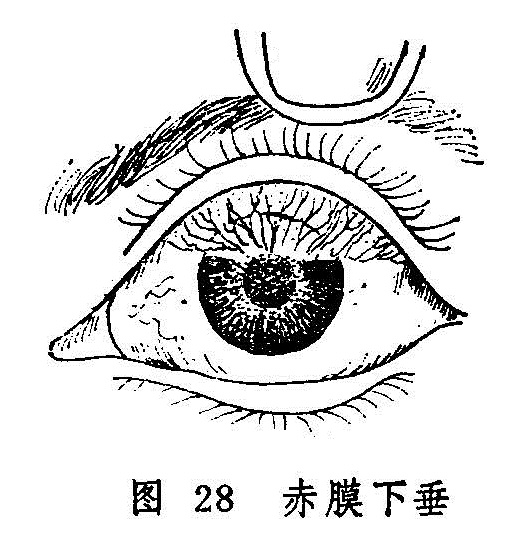

## 赤膜下垂　血翳包睛

赤膜下垂是指赤脉密布似膜，从白睛上方向下蔓延，渐蔽黑睛的疾患。病名见于《秘传眼科龙木论》。又名垂帘翳（《银海精微》）。若病情发展严重，赤膜从四周漫掩整个黑睛，则称为血翳包睛。见于《银海精微》。二者多为椒疮失治所致，后者多为前者发展而成，故而合并讨论。

赤膜下垂需与垂帘障相鉴别：《证治准绳•七窍门》载：“垂廉障证，生于风轮，从上边而下，不论厚薄，但在外色白者方是。若红赤乃变证，非本病也。”可见鉴别二证的要点在翳膜颜色的红与白，赤脉的多与寡。

〔病因病机〕

多因椒疮增剧并发而来，肝肺风热毒邪壅盛，或肝火上乘于目，而致赤膜下垂；或心火内炽，肝热亢盛，热极成瘀，阻滞血络，气血壅阻，则赤脉丛生，而成血翳包睛。

〔辨证论治〕

（一）辨证要领

赤膜下垂：本病初起，黑睛上缘出现一片菲薄翳膜，且有赤丝牵绊，下垂至黑睛，渐次变大增厚，披复瞳神，赤脉尽头常有细小星翳（图28）。并伴羞明流泪，灼热刺痛，视物欠清。若膜大脉粗而赤，睛疼头痛者，则病急而易变；若脉丝细小，色泽淡红，眼珠与头俱不疼痛者，则病轻而少变。本病因椒疮而起，故翻转胞睑，可见椒疮累累成片。

血翳包睛：自觉赤涩疼痛，羞明流泪，头痛视昏。赤膜渐次变大增厚，赤脉纵横，由气轮伸入，遮蔽风轮，形成血翳。如发展严重，则赤脉扩大，翳膜结厚，呈一片混浊模糊血障，遮满黑睛，难辨人物。

辨证应以局部症状为主。前者来势较缓，目红珠痛较轻，仅生赤膜一片自上垂下（图28），常为肝经风热或肝火炽盛而致；后者进行较急，整个风轮赤脉贯布，形成血翳，隐蔽黑睛，严重影响视力，甚至失明，其形成除肝经火盛外，且常兼心经火毒。一旦形成血翳包睛，往往不易迅速消退，故当耐心治疗，并应注意根除椒疮，始能制其复发。

（二）论治要点

外治法在本病治疗中占有十分重要的地位。初起局部症状轻微者，可单用点眼外治法治之；证情较重者，则须配合内服药物，并嘱病人耐心接受治疗。内治总以清热、疏风、凉血、化瘀为主，还需视其全身症状运用泄肺、凉肝、清心等法。还应根除椒疮，始能制其病情发展。

（三）常见证治

1.内治：

（1）肺肝风热：

证候：赤膜下垂，羞明流泪；刺痒涩痛，或头部疼痛，舌质红，苔黄，脉弦数。

治法：清热疏风，清肝泄肺。

方例：退红良方〔167〕。

（2）肝火炽盛：

证候：赤膜下垂，膜大脉粗而赤，头疼眼痛剧烈，赤膜尽头星翳丛生，热泪频频，怕热羞明，口苦咽干，脉弦数。

治法：平肝清火。

方例：羚羊饮〔205〕。

（3）心肝热炽：

证候：黑睛血翳满布，甚或堆积如肉，白睛赤紫，目珠刺痛，畏热羞明，或口苦咽干，舌质红苔黄，脉数或弦数。

治法：清心泻肝，凉血破瘀。

方例：破血红花散〔188〕。

2.外治：

（1）若翳膜红赤，可用黄连西瓜霜眼药水〔211〕1日3〜4次，或千里光眼药水〔23〕滴眼，1日4〜5次。星翳平复，可改用犀黄散〔241〕或涩化丹〔177〕、石燕丹〔51〕点眼，1日3次。以磨障退翳。

（2）睑内椒疮累累者，须用海螵蛸棒摩擦法（详见总论第七章第二节），消除颗粒以散血祛瘀。

（3）本证引起瞳神缩小者，可适当用扩瞳药。

（四）临证权变

赤膜下垂与血翳包睛虽有症状的轻重不同，但在病因病机方面却不易截然区分。临证时应视肺、肝、心何经热邪偏盛，而灵活论治。如肺肝风热用退红良方，可酌加凉血活血之品，如丹皮、红花等；亦可选用归芍红花散〔66〕加减。若兼见心中烦热，小便赤涩，脉左寸洪大，偏于心火旺盛者，当清心降火，可改用泻心汤〔131〕合导赤散〔95〕。若血翳包睛，兼眵多泪热，赤涩肿痛者，用破血红花散应酌加胆草、石决明、生石膏等。若膜大脉粗而赤，头疼珠痛，急当清泄肝火，以防逆传，可选用羚羊饮。若兼见口渴喜冷饮者，当酌选加石膏、石斛等。若兼见大便秘结者，宜加用大黄、芒硝、麻仁等。

〔调护〕

注意眼部卫生。饮食宜清淡，忌辛辣肥甘厚味。提倡一人一巾和流水洗脸。患者的洗脸用具应定时消毒，更不可与他人共用。患者应保持乐观情绪，积极配合治疗。视力严重下降者，还应在外出时注意安全。

〔应用例案〕

赵XX，女，48岁。1975年3月11日初诊：左目沙涩不适5、6个月之久，时轻时重，近十几天来症状忽然加重，目珠涩痛，流泪羞明，视物不清。检查，左眼上睑睑内椒粒密集，疙瘩不平，赤膜从白睛上方垂下，已近瞳神边缘，赤脉密布，此为赤膜下垂。治以加减退赤散（酒黄芩12克 秦皮3克 赤芍 丹皮 生地各9克 木通3克 炒栀子6克 青黛0.3克）加川黄连1.5克。外用海螵蛸棒擦法，治疗睑内椒粒，服药6剂，摩擦1次。3月18日复诊：脸内椒粒见疏，赤膜稍退，又行擦法一次，服上药6剂。3月25日三诊：睑内椒粒大部已平，留有少量疤痕，眦帷尚有少数椒粒，赤膜已去大半，已不羞明流泪，视物较前清晰，又服上方21剂。4月18日四诊：睑内仍有少量椒粒，赤膜已尽，青睛上部边缘留有菲薄云翳，其上已无赤脉贯穿，此症已愈，嘱其停药。（《张皆春眼科证治》）
