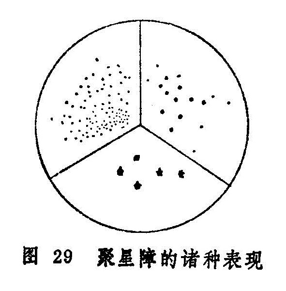

## 聚星障

本病是黑睛上聚生多个细小星翳的眼病（图29）。见于《证治准绳•七窍门》。多因外感风邪，或热病后，或慢性疾病导致正气虚衰，或月经不调等阴阳气血失调的情况下发病。可单眼为患，亦可双眼同时或先后发生。本病传变较速，贵在早治，若拖延日久，不仅病程较长，且易反复发作，甚则变生花翳白陷、凝脂翳等证。愈后遗留瘢痕翳障，影响视力。

本病需与凝脂翳初起相区别。凝脂翳初起，虽生翳如星，但形状较大，多单个存在，且迅速扩大加深，翳如凝脂，每兼黄液上冲，与本病是不同的。

〔病因病机〕

1.风热或风寒之邪外侵，上犯于目。

2.外邪入里化热，或肝热内蕴，复受风邪，风火上攻黑睛。

3.脾虚蕴积湿热，熏蒸黑睛。

4.素体肝肾阴虚，或热病后阴津亏损，虚火上炎。

〔辨证论治〕

（一）辨证要领

本病初起，自觉眼内沙涩疼痛，或畏光流泪。抱轮红赤或红赤不明显；黑睛猝起翳障，状如针尖，或如称星，颜色灰白或微黄，数颗或数十颗不等，或齐起，或先后渐次而生。其排列形式不一，可散漫排列如云雾状，可联缀成串，呈丝缕状，亦可纡曲融合呈地图状。若病情严重，可向深部发展。一般不作脓，但病程长，常反复发作。本病辨证需注意全身证候与局部症状综合分析。属风寒、风热者多兼表证；属肝火炽盛者每见口苦口干，舌红脉数，眼部症状较重；属湿热蕴蒸者多缠绵不愈，或反复发作，兼见头重胀，胸闷口粘，舌苔厚腻；阴虚火旺者病情亦多缠绵，但无湿热之象，却有阴精不足之证。

（二）论治要点

本病常因外感风邪所致。且肝经伏火、湿热熏灼、久病耗阴等因素所致者，又易兼挟风邪，所以治疗本病，应注意祛风药物的运用。更应审病因、别脏腑，随证情治之。病势急骤者以外受风邪或肝火炽盛者为多，病情缠绵或反复发作者，以湿热蕴蒸或阴虚火旺为多，或为正虚易受风邪而然，临床须辨虚实寒热，耐心调理，方可获效。外治以解毒疏风，退翳明目为主，内治以疏风、清热、散寒、化湿、滋阴诸法为治。

（三）常见证洽

1.内治：

（1）外感风热：

证候：黑睛星翳，翳色灰白，白睛红赤，羞明隐涩，恶风发热，或头痛鼻塞，眉骨痠痛，咽痛溲黄，舌苔薄黄，脉浮数。

治法：疏风散热。

方例：银翘散〔222〕，或羌活胜风汤〔109〕。

（2）外感风寒：

证候：黑睛星翳，白睛微红，羞明流泪，恶寒重发热轻，或头痛身痛，鼻塞流清涕，小便清长，舌质淡苔薄白，脉浮紧。

治法：发散风寒。

方例：荆防败毒散〔158〕或四味大发散〔62〕。

（3）肝火炽盛：

证候：星翳渐次加深扩大，眼睑红肿，白睛混赤，星翳色黄，团聚一片，羞明流泪，口苦口干，溲赤短少，或大便秘结，舌质红苔黄，脉弦数。

治法：清肝泻火。

方例：龙胆泻肝汤〔58〕，或石决明散〔48〕。

（4）湿热蕴蒸：

证候：黑睛星翳，睑肿目赤，翳色微黄滞，反复发作，缠绵难愈，可兼见头重且胀，胸闷不舒，口粘而腻，溲黄便溏，舌红苔黄而腻，脉濡或滑。

治法：清热化湿。

方例：三仁汤〔16〕。

（5）阴虚邪留：

证候：患病日久，或热病后期，迁延不愈，星翳疏散，抱轮微红，眼内干涩不适，头晕耳鸣，舌红乏津，脉细或细数。

治法：滋阴散邪。

方例：加减地黄丸〔82〕。

2.外治：

（1）局部滴用龙脑煎〔59〕，或用点眼秦皮煎〔169〕滴眼。

（2）瞳神缩小者，酌用扩瞳剂。

（3）用板蓝根，大青叶、野菊花、千里光、秦皮、银花等煎水，作湿热敷。

（4）后期遗留瘫痕翳障者，可点用犀黄散〔241〕。

3.针灸疗法：可选用睛明、四白、丝竹空、攒竹、合谷、足三里、光明等穴，每次取局部1〜2穴，远端1〜2穴，视病情用补泻手法。

（四）临证权变

本病因风邪外袭者，除视风热，风寒施治外，可酌加木贼、蝉蜕、密蒙花等以增强退翳之功。对火毒炽盛者，可选加板蓝根、大青叶、紫草等以增强解毒之作用。若大便秘结者，加用大黄、芒硝之类。若痰热上扰者，可酌加贝母、竹茹、前胡等。若患者久病气阴不足者，可加党参、麦冬益气生津。虚火甚者，可加知母、黄柏滋阴降火。此外，均可选用菊花、蝉蜕等以增加退翳明目之效。

〔调护〕

起居有常，锻炼身体，增强体质，预防外邪侵袭。勿过食炙煿五辛，肥甘厚味。久病者注意调养，增加营养，耐心治疗。注意眼部卫生。

〔应用例案〕

邱XX，男，41岁，初诊于1962年9月26日。双目发红将近一月，干涩昏花，多泪而痛，黑睛星点小如针锋，弥漫一片，瞳神披蔽，故而视物不明。舌淡红，脉浮数，症属风热上扰，治以驱风散热。羌活胜风汤四剂。

二诊：红退，星点依旧，咳而多痰，口苦咽干，舌苔微黄而腻，当以祛痰清热。温胆汤加象贝、花粉、黄芩、三剂（以后又服三剂）。

四诊：黑睛星点巳退，目视恢复，眼尚感干涩，盖椒粟为患，须轻轻开导。温胆汤加象贝、杏仁，五剂。（姚清和：《眼科证治经验》）

### 附：银星独见

本病是指黑睛生翳一、二颗，其色如银，形如星的一种病症，故称之谓“银星独见”。见于《证治准绳》。该书载：“大凡见珠上有星一、二颗，散而各自生，过一、二日看之不大者方是，……若连萃贯串相生及能大者，皆非星也。”《张氏医通》载：“乌珠上有星，独自生也。盖人之患星者，由火在阴分而生，故不能大，若能长大者，必是各障之初起也，……不出一、二日间，渐渐长大，因而触犯，遂之损目，若误认为星，则谬矣。”

本病多因肾阴不足，或虚火上炎，郁滞于风轮，结而为星；或风热犯目，气实壅滞于络所致。证见眼觉碜涩不适，羞明流泪，抱轮微红，黑睛生翳一、二颗，其色如银，形小如星，多不长大，病程较长，缠绵不愈，愈后可遗薄翳，视力多无损。

本病须与聚星障及凝脂翳初起之星相区别。聚星障见抱轮红赤，黑睛上骤起细小星翳数个，可连缀成片，或排列成行，且可相互融合，呈条状或树枝状。凝脂翳初起亦先为星，但能迅速长大而成片，与本病不同。

银星独见的治疗，初起属风热犯目者，全身可兼见鼻塞流涕，眼疼头痛，舌苔薄，脉浮或浮数。治宜祛风清热。方用菊花决明散〔216〕或桑菊饮〔193〕加蝉蜕、草决明等。病久多属肾阴不足，全身可兼见遗精梦泄，头昏腰痠，五心烦热，咽干舌燥，舌红少苔，脉细数。治宜滋补肾阴，兼以退翳。方用六味地黄丸〔33〕加谷精草、白蒺藜、车前子、蝉蜕等。虚火上炎甚者，可用知柏地黄丸〔148〕加白薇、花粉、寸冬等。

外治可选用三黄眼液〔18〕，或10%千里光眼液〔24〕滴眼，1日3〜4次。

〔文献摘录］

《证治准绳•七窍门》："聚星障证，乌珠上有细颗，或白色，或微黄。微黄者急而变重，或联缀，或团聚，或散漫，或一同生起，或先后逐渐一而二、二而三、三而四、四而六七八十数余。如此生起者，初起者易治，生定者退迟。能大者有变，团聚生大而作一块者，有凝脂之变；联缀四散，傍风轮白际而起，变大而接连者，花翳白陷也。”
