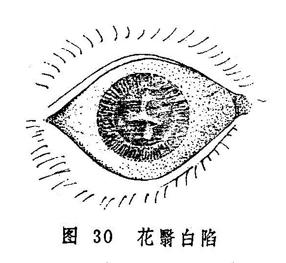

## 花翳白陷

花翳白陷是指黑睛生翳，四周高起，中间低陷，形如花瓣，善变速长为主要特征的病症（图30）多因风热毒邪引起，此痛发展迅速，若失治，易变生黄液上冲、蟹睛等恶候。本病愈后常留瘢痕，影响视力。

〔病因病机〕

多因外感风热毒邪，内有肺肝积热，壅实上冲，火灼络内，攻冲风轮所致。

〔辨证论治〕

（一）辨证要领

本病初起，患眼沙涩，似有异物，刺痛羞明，眵多流泪，前额疼痛，胞睑紧闭，抱轮红赤或白睛混赤，黑睛四周骤起翳障，其色灰白或微黄，渐渐厚阔，中间低陷，甚则深陷，状如花瓣或碎米、鱼鳞。未遮满瞳神者，瞳神尚且可见，证重者则出现瞳神紧小、黄液上冲等，若黑睛溃破，则变生蟹睛；亦有不从黑睛边际而生，而于风轮上起翳如凝脂，色灰白或微黄，初小如星，渐大并溃陷，或呈条状，或呈边缘不规则的片状；亦有黑睛上先发聚星障，细颗如星，连续窜生呈条状，后渐扩大，溃破后亦可牵连混合而成片。愈后遗留瘢痕，可严重影响视力。

本病病势急重，且以实证为多。发病之初，多系肝肺风热；病邪入里，则可见头目剧痛，发热口渴，溲黄便秘，舌红、苔黄脉数，则证属热炽腑实、病情迁延不愈者，亦有属于湿热壅盛及阴虚火旺者。

（二）论治要点

本病急重，且以实证为多，病初起，多系肺肝风热，治以疏风清热；热邪传里，热炽腑实者，急当通腑泻热。病势急重，热象明显者，即使无大便秘结之症，亦可使用泻下法清泻热毒，大便一畅，眼症常可顿减。外治以清热解毒，退翳明目为要，临证常结合使用扩瞳剂，以减轻症状，缩短病程，且可防止瞳种干缺。

（三）常见证治

1.内治：

（1）肺肝风热：

证候：黑睛骤起白翳，状如花瓣，或似鱼鳞，但未扩展串连，畏日羞明流泪，红赤疼痛，舌红苔薄黄，脉数或浮数。

治法：疏风清热，解毒散邪。

方例：加味修肝散〔79〕。轻者可用蝉花散〔247〕。

（2）热炽腑实：

证候：白睛混赤，花翳从四周蔓生，迅速扩大，蔓掩黑珠。可兼眼睑肿胀，眵泪俱多，头目剧痛，烦躁，口苦口渴，溲黄便秘，舌红苔黄，脉数。

治法：清肝泻热。

方例：泻肝散〔133〕。

2.外治：

（1）黑睛生翳，局部红赤较重时，宜清热解毒为主，可用朱砂煎〔96〕点眼，兼用桑菊祛风汤〔194〕洗眼。

（2）若红赤已退，黑睛低陷平复，障翳仍在，则以退翳明目为主，可用珍珠散〔157〕，或琥珀散〔235〕外点。

（3）病重者，滴用扩瞳剂，如1%阿托品液，以防瞳神干缺。

（四）临证权变

本病初起，多系肺肝风热，若肺火偏盛者，可加桑白皮、生石膏等以清泻肺火；肝热偏盛者，可加夏枯草、胆草以清泻肝热；白睛红赤暗滞，刺痛明显者，可选加苏木、红花之品以活血散瘀；若热炽腑实，目赤痛甚者，亦可酌加红花、赤芍、丹皮等以凉血化瘀止痛。

花翳白陷失治或误治，亦有缠绵不愈或反复发作者，治疗颇为棘手，可辨明证候，参照聚星障之“湿热蕴蒸”、"阴虚邪留”等予以施治；病至后期，红退痛止，遗留瘢痕翳障者，又可参照“宿翳”一节予以处理。

〔调护〕

注意眼部卫生，勿过食辛辣厚味食物，饮食宜清淡且富有营养。应忌烟酒，戒急躁，保持心情舒畅。素体虚弱者，应注意调护和治疗。

〔应用例案〕

郑XX，男，32岁。1964年10月10日初诊：右目发红20余天，两天前曾饱食羊肉，食后右目突然剧痛，羞明流泪，不能见物，检查，右眼胞睑红肿高胀，白睛红赤，下方赤丝尤密，风轮中央大片白翳，中间凹陷，边缘附以黄白色凝脂，青睛下方边缘始见黄液如线。大便不通、腹满、脉实、右关尤甚，舌质红，苔黄厚。此为花翳白陷合并黄液上冲，治以新加羚角饮（羚羊角0.3克，酒黄芩9克，柴胡6克，酒大黄9克，明粉3克、知母、元参各9克，银花30克，赤芍9克，酒茺蔚子6克）加炒山楂9克，枳壳6克，服药2剂。10月12日复诊：大便已通，腹满稍减，黄液已尽，风轮中央白陷稍有好转，脉仍有力，苔黄而厚，又服上方去大黄、元明粉2剂。10月14日三诊：腹已不满，脉转沉数而弦，苔薄黄，白睛赤丝减退，青睛花翳白陷渐平，目痛大减，又以上方去枳壳，山楂，加酒生地12克，服用9剂。10月24日四诊：白睛淡赤，白翳较前缩小，边缘平滑，已无凝脂附着，但中间仍有凹陷，症已转花翳低陷，给当归元参饮服之，又服21剂。11月18日五诊：曰睛已复如常，青睛云翳挡神，视物昏蒙。此翳难退，嘱其停药。（《张皆春眼科证治》）

〔文献摘录〕

《证治准绳•七窍门》：“花翳白陷证，因火烁络内，膏液蒸伤，凝脂从四围起而蔓神珠，故风轮皆白或微黄，视之与混障相似而嫩者。大法其病白轮之际，四围生漫而来，渐渐厚阔，中间尚青，未满者瞳神尚见，只是四围略高，中间略低，此乃金克木之祸也。或有就于脂内下边起一片黄膜，此二证夹攻尤急，……亦有不从沿际起，只自凝脂，翳色黄或不黄，初小后大，其细条如翳，或细颗如星，此边起一个，彼边起一个，四散生将起来，后才长大，牵连混合而害目，此木火祸也。”

《目经大成》：“此症初起双目便赤肿，狂痛，畏明，生眵。开视青睛沿际许多白点，俨若扭碎梅李花瓣，瓣色黄而浮大者尤险，一昼夜牵连混合，蔽蔓神珠，看之与混睛障相似，却善长速变，且四围翳起，中央自觉低陷，甚则翳蚀于内，故名花翳白陷。”
