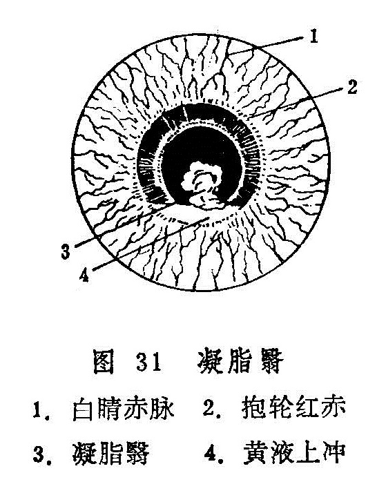

## 凝脂翳

本病为黑睛生翳，状如凝脂，其色或黄或白，善变而速长，或伴有黄液上冲的急重眼病。见于《证治准绳•七窍门》。若治不及时，每易迅速毁坏黑睛，甚至水膜溃破，黄仁绽出，变生蟹睛恶候，愈后视力受到严重障碍，甚至失明。

〔病因病机〕

1.多因黑睛表层损伤，风热邪毒乘隙侵入。若素有漏睛，邪毒巳有蕴伏，更易乘伤袭入而发病。

2.脏腑热盛，肝胆火炽，上攻于目，气血壅滞，蓄腐成脓，黑睛溃烂。

3.或因花翳白陷，聚星障等病情迁延，复加邪毒，恶化而成。

〔辨证论治〕

（一）辨证要领

本病初起自觉眼内沙涩，灼热刺痛，畏光流泪，白睛红赤，黑睛上有翳如星，其色白或微黄，表面污浊，边缘不清，中央有凹陷，其上如覆薄脂。此为凝脂早期，若治疗及时得当，病情多可控制，愈后遗留有宿翳。

若治不及时，正不胜邪，病情向纵深扩展，症见头目剧痛，胞睑肿胀难睁，热泪如汤，白睛混赤壅肿，星翳迅速扩大，翳上复有一片凝脂，色黄浮嫩，边缘肥厚不清，凹陷亦逐渐变大变深，甚则漫及整个黑睛。因神水受灼，而于黑睛内，黄仁前下方出现黄色脓液，是为黄液上冲（图31）。若诊治及时，病情尚可控制，但愈后常留厚翳。

若病情继续进展，水膜溃烂变薄，甚则黑睛溃破，黄仁绽出而成蟹睛恶候，结瘢后留有斑脂翳。若毒攻珠内，病势更为凶险，终为目珠塌陷而失明。

亦有发病来势迅猛，病情凶险者。初起眼眵及凝脂即为黄绿色，黄液上冲极为严重，可于一、二日内溃破黑睛，黄仁、神膏绽出，甚至迅速脓攻全珠，眼珠萎陷而失明。

（二）论治要点

本证起病急，来势猛，发展快，变化多，治疗当以清热解毒为主。初期挟风者，宜祛风清热解毒；里热火毒炽盛者，宜泻火解毒通便；少数属正虚邪恋者，宜扶正祛邪。

（三）常见证治

1.内治：

（1）风热壅盛：

证候：黑睛生翳如星，边缘不清，表面污浊，如覆薄脂，白睛红赤，羞明流泪，眼睑浮肿，珠痛头痛，视力下降。或兼恶寒发热，溲黄短少，舌质红苔薄黄，脉浮数。

治法：祛风清热。

方例：新制柴连汤〔244〕。

（2）火毒炽盛：

证候：凝脂大片，窟陷深大，黄液上冲，胞睑红肿，紧涩难开，热泪频流，眵多色黄或黄绿，白睛混赤壅肿，或发热口渴，溲赤便秘，舌红苔黄厚，脉数有力。

治法：清热解毒，泻火通便。

方例：四顺清凉饮子〔65〕。

（3）正虚邪留：

证候：年老体弱，或久病气血不足，凝脂溃陷，渐见减薄，日久不敛，白睛红赤不显，眼痛羞明较轻，舌淡脉弱。

治法：扶正祛邪。

方例：托里消毒散〔88〕。

病至后期，邪毒已清，遗留瘢痕翳障者，可参照宿翳处理。

2.外治：

（1）局部可用点眼秦皮煎〔160〕。或黄芩、黄连、千里光等清热解毒药制剂滴眼，可频频滴用，睡前涂穿心莲眼膏〔156〕。

（2）结合滴用扩瞳剂，以防瞳神干缺。

（3）以银花、连翘、蒲公英、鱼腥草、大青叶、荆芥、防风、千里光、野菊花等煎水，澄清过滤，洗患眼，作湿热敷。

3.针灸疗法：取睛明、承泣、丝竹空、攒竹、翳明、合谷、肝俞、阳白等，每次局部取1〜2穴，远端1〜2穴，交替使用，视虚实而施补泻手法。

（四）临证权变

风热壅盛、火毒炽盛者，在原方基础上可选加银花、千里光等以增强清热解毒之效；若大便不通者，还可酌加芒硝以增泻下之力；白睛瘀赤较甚者加犀角、丹皮、桃仁、红花等凉血化瘀之品；眵呈黄绿，邪毒炽盛者，再加银花、蒲公英、菊花、千里光等以清热解毒。

〔调护〕

本病来势猛，变化快、病情严重，应日夜监护。若病情有变化，须及时处理。对患者使用的洗脸用具、敷料、用品等应及时严格消毒。饮食宜清淡，忌辛辣腥发之物。

〔应用例案〕

朱XX，男，45岁，于1959年7月7日就诊，门诊号0394。主诉：左眼过去有云翳，7天前左眼发红生翳，羞明流泪，眼痛，口干，大便燥，小便黄。

检查：左眼白睛红赤，黑睛偏外下方有凝脂翳下陷，面积约3X4毫米，荧光素染色阳性。舌苔微黄稍腻，脉浮而有力。

诊断：凝脂翳。属于内热挟风型，用双解汤（金银花15克 蒲公英15克 天花粉9克 黄芩9克 枳壳4.5克 龙胆草9克 荆芥9克 防风9克 桑皮6克 甘草3克）加大黄4.5克，芒硝4.5克，服3剂，眼痛止，微流泪，大便已润，白睛红赤大减，黑睛凝脂翳下陷显著平复，面积较前缩小。舌苔轻薄，脉弦数。继以前方去大黄、芒硝，服7剂，7月14日复诊，白睛红赤全消，凝翳下陷平复，呈斑翳状，视力0.6，嘱其停药。（庞赞襄《中医眼科临床实践》）

〔文献摘录〕

《审视瑶函》：“此症为疾最急，昏瞽者十有七八。其病非一端，起在风轮上，有点，初生如星，色白，中有（米厭），如针剌伤，后渐渐长大，变为黄色，（米厭）亦渐大为窟者。有初起如星，色白无（米厭），后渐大而变，色黄始变出（米厭）者。有初起便带鹅黄色，或有（米厭）无（米厭），后渐渐变大者。或初起便成一片如障，大而厚，色白而嫩，或色淡黄，或有（米厭）无 （米厭）而变者。或有障，又于障内变出一块如黄脂者。或先有痕（米厭），后变出凝脂一片者，所变不一，为祸则同，治之不问星障，但见起时肥浮脆嫩，能大而色黄，善变而速长者，即此症也。”
