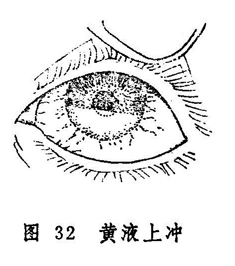

## 黄液上冲

黄液上冲是指黑睛内黄仁前积有脓液，色黄而向上漫增的病症（图32）。在《秘传眼科龙木论》中称为“黄膜上冲”。《目经大成》认为实“非膜而为液”，故改本名。多由凝脂翳或瞳神紧小等病变生。甚者，脓液可全掩瞳神或渗入瞳神后部，导致失明。

〔病因病机〕

多因过食辛热炙煿、膏粱厚味，酿成阳明积热，加之感受风热邪毒，内外合邪，致三焦火毒上燔，灼伤黄仁，煎熬神水，脓液内聚而成。

〔辨证论治〕

（一）辨证要领

其症初起，疼痛羞明流泪，抱轮红赤或白睛混赤，黑睛与黄仁之间脓液积聚色黄或微黄，一般多沉在下方，上界呈水平面，还可随头位改变而移动。其量或多或少，可稀可稠。量少者如指甲根之白岩，量多者可遮掩整个瞳神。若因凝脂翳等引起者，极易穿破黑睛，变生蟹睛等恶候；若有瞳神紧小，扱易适成瞳神干缺，以致变证丛生；若脓攻全珠，病情险恶，易致眼珠塌陷而失明。

本病一股均属阳明热毒炽盛，大抵以黄液色淡、量少，发展稍缓者属轻；黄液色深，发展迅速，量多而遮掩瞳神者属重；若二便不利，则更为严重。

（二）论治要点

本病无论其证之轻重，总宜泻火解毒为治疗大法，亦可参阅凝脂翳、瞳神紧小之治法。

（三）常见证治

1.内治：

阳明热毒炽盛。

证候：黄液上冲，抱轮红赤，瞳神紧小，羞明流泪，头目剧痛，口渴喜饮，大便秘结，舌苔黄，脉数。

治法：清热泻火解毒。

方例：通脾泻胃汤〔199〕、眼珠灌脓方〔220〕。

2.外治：

（1）局部用立胜煎〔44〕滴眼，以清热解毒止痛。

（2）滴用扩瞳剂，以防瞳神干缺。

（3）可选用荆芥、防风、羌活、川芎、黄芩、银花等祛风清热解毒药煎水，作湿热敷。

（4）参照凝脂翳、瞳神紧小证之外治法。

（四）临证权变

本证热毒甚者，可加银花、公英等以清热解毒；若血热甚者，可选加犀角、丹皮等以凉血清热。证属肝胆热毒者，宜清肝肾火解毒，可用龙胆泻肝汤〔58〕加银花、连翘、公英；个别患者属于脾胃虚损，寒湿内蕴化火，证见目珠痛轻，抱轮淡红，脓色淡红而较少，面色少华，舌淡苔白，脉细弱或迟，则宜温中健脾益胃，可用理中汤〔219〕加地丁、败酱草、黄芪等。

〔调护］

本证多由凝脂翳、瞳神紧小等病而发，故患有此类眼疾应及时正确的治疗。平素少食炙煿辛热、肥甘厚味之品，以防脾胃积热。患本病者，除内服药外，应结合外用药物的应用，以防变生他症。

〔应用例案〕

封XX，男，69岁。1970年6月17日初诊：左目红赤疼痛10余天，自昨日加重，头目剧痛，羞明难开，结眵流泪，视物不清，二便尚利。检查，左目白睛赤丝满布，下部尤重，风轮花翳深凹，边缘附以凝脂，底部嫩白，遮蔽瞳神上部边缘，风轮下部始见黄液，如指甲白岩之状。此为花翳白陷，兼黄液上冲，治以通脾泻胃汤加银花18克，元明粉3克，服药2剂。6月19日复诊：头痛、目痛减轻，白睛赤丝减少，青睛下部黄液已尽，花翳白陷如前，以上方去大黄、元明粉，加柴胡6克，青黛0.6克，酒生地9克，又服6剂。6月26日三诊：白睛淡赤，青睛呈现花翳低陷，给当归元参饮服之。服药15剂。7月12目四诊：低陷渐平，留有菲薄之翳，挡住瞳神上部，视物不真，嘱其常用桑椹子9克，蝉蜕3克，车前草6克，浸水饮之，每日一次连服半年。1971年2月5日五诊：视物较前清楚，云翳稍减，嘱其停药。（《张皆春眼科证治》）

按：本例患者年近70，虽属阳明邪盛，但其肝肾已亏，不宜过用苦寒泻下之剂，故仅用2剂通脾泻胃汤加减，即去大黄、元明粉，加酒生地以滋补肝肾之阴，加柴胡、青黛以清肝胆火邪。后则花翳白陷亦逐渐向愈。
