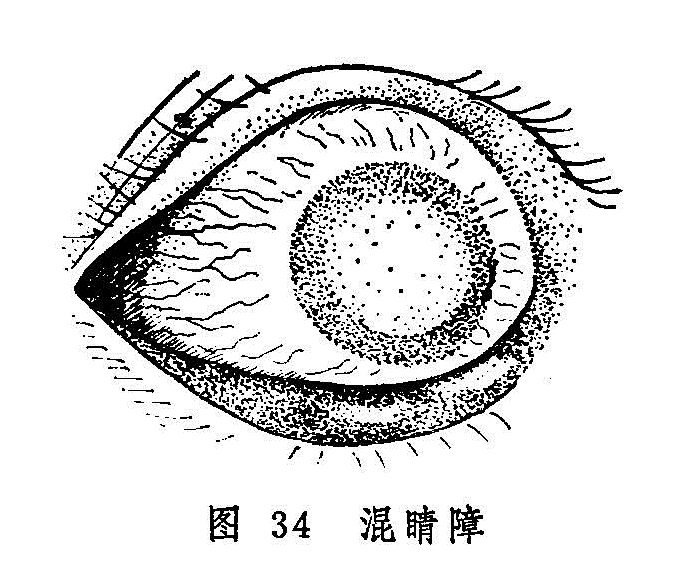

## 混睛障

混睛障是指黑睛水膜之深层漫生灰白或浑红色翳障，混浊不清，障碍视力的眼病（图34）。病名见于《审视瑶函》。《秘传眼科龙木论》称"混睛外障”。《证治准绳》又称"混障”。本病过程缓慢，往往进行数月治疗，方可逐渐减轻，但多数仍留瘢痕而影响视力。

〔病因病机〕

多因肝经风热上扰于目，损及黑睛，或肝胆热毒蕴蒸于目，热灼津液，瘀血凝滞引起；亦可因外受湿邪，或内蕴湿热，湿浊熏蒸，上犯黑睛；或邪毒久伏，耗损阴液，或素侬阴虚，劳瞻竭视，雕缕细作，致肝肾阴虚，虚火上炎所致。

〔辨证论治〕

（一）辨证要领

初起自觉碜涩畏热羞明，疼痛泪出，视力下降，抱轮暗红，或白睛混赤，视物昏蒙，黑睛从中央或边际深层发生灰白色翳障，逐渐漫掩全部黑睛，使风轮如浊烟笼罩，失却晶莹润泽之色，如镜面呵气之状，或如磨砂玻璃状（图34）。若从侧面视之，能隐见瞳神。细察之，隐隐可见黑睛深层有灰白色线条参杂，赤脉自黑睛边际蔓入中心，最后侵及整个黑睛，呈现一片赤白混杂的翳障，严重影响视力，甚至难辨人物。经数月，翳障可逐渐变薄，但不能全退，遗留厚薄不等的瘢痕，对视力影响不等。与此同时，易发生瞳神紧小或干缺，故须予以重视，以免处理不当，导致失明。本病不但病程较长，且易反复发作，年深日久，则黑睛全变白色。

发病初期，水膜混白，头眼俱痛，脉浮数者，多为肝经风热；水膜混赤，刺痛流泪，口苦苔黄，便秘溲赤，脉弦数者，多为肝胆热毒；病情缠绵不愈，头重困倦，舌苔黄腻，脉滑而数者，证属湿热上攻；反复难除，干涩隐痛，抱轮微红，口干咽燥，脉细而数者，证属阴虚火旺。

另外，混睛障呈白色者，最忌光滑如瓷；翳障浑赤者，最忌紫脉粗大爬紧，此二者均属难治之证。

（一）论治要点

本病之发生，多为热毒所致，所以清热解毒为本病治疗的要点。挟风者，宜疏风清热而解毒；肝胆热毒者，宜泻肝而解毒；挟湿者，宜除湿清热而解毒；阴虚火旺者，则宜滋阴而降火。

（三）常见证治

1.内治：

（1）肝经风热：

证候：头目俱痛，畏光流泪，白睛抱轮红赤，黑睛水膜之深层有灰白色翳障，舌红苔薄黄，脉数或浮数。

治法：祛风清热。

方例：羌活胜风汤〔109〕。

（2）肝胆热毒：

证候：黑睛混赤，赤脉贯布，抱轮暗赤，刺痛流泪，便秘溺赤，口苦苔黄，脉弦数。

治法：泻肝解毒。

方例：银花解毒汤〔221〕加减。

（3）湿热上攻：

证候：病程绵长难愈，白睛红赤，黑睛混浊，视物昏蒙，头重困倦，胸闷纳差，舌苔黄腻，脉滑数。

治法：清热祛湿。

方例：三仁汤〔16〕。

（4）虚火上炎：

证候：病情反复发作，眼干涩而疼痛不甚，抱轮微红，黑晴混浊如烟笼罩，口干咽燥，舌红少津，脉细而数。

治法：滋阴降火。

方例：兼咽燥干咳等症者为肺阴不足，用百合固金汤〔86〕；兼头晕耳鸣，腰膝痠软等症者为肾阴不足，用知柏地黄丸〔148〕。

2.外治：

（1）局部点用涩化丹〔177〕、犀黄散〔241〕或磨障灵光膏〔249〕以消退翳障。

（2）酌用扩瞳剂滴眼。

（四）临证权变

发病初期，属于肝经风热者，需在羌活胜风汤疏风清热的基础上，酌加银花、连翘、栀子等以助解毒；若系先天梅毒者，宜重加土茯苓驱梅解毒。若肝胆热毒炽盛者，银花解毒汤中的银花、公英宜重用，再加野菊花、土茯苓以清热解毒；兼有瘀滞甚者可选当当归、桃仁、红花、赤芍以活血化滞；若大便秘结者，可酌加玄明粉，以助大黄通腑泻下。湿浊上攻者，可在三仁汤的基础上加土茯苓、萆薢、银花、连翘等。病至后期，遗留宿翳者，可参照宿翳处理。

〔调护〕

本病缠绵，需耐心调治，病变初期每易诱发瞳神缩小干缺，应密切观察病情。患者应进食富有营养而少食肥甘厚味，同时注意针对全身症状及体质情况，悉心调治。

〔应用例案〕

左XX，男，13岁。于1953年6月18日初诊。其母代述：其父有梅毒史。于20天前，左眼发现羞明流泪，鼻流清涕，又10余天后，眼红、羞明加重，双眼失明。在XX眼科医院治疗，住院7天，不见好转，医生说此病系先天性梅毒引起，眼内云翳不可能退净，故出院来此就诊。检查：双眼视力均光感，黑睛混浊，漫珠一色，如磨砂玻璃状，并有赤脉贯入黑睛，白睛混赤。舌苔微黄，脉细数。诊断：混睛障。用银花解毒汤服5剂后，6月22日复诊，双眼红略退，黑睛混浊微减，视力半尺指数。继服10剂后，于7月1日三诊，白睛红显著消失，黑睛混浊及赤脉明显消退，羞明流泪已愈，舌苔已愈，双眼视力均0.07。继按上方减大黄、黄芩各3克，服至7月10日，双眼黑睛混浊大部分消退，赤脉完全消失，白睛已恢复正常，右视力0.6，左0.3。又按上方服10剂后，双眼黑睛混浊完全消失，两眼视力均1.2，嘱其停药。（《中医眼科临床实践》）

〔文献摘录〕

《审视瑶函》：“混障却分红白，有余不足之灾。红速白迟皆退。久而点服方开，红畏紫筋爬定，白嫌光滑如苔，带此两般症候，必然难退易来。”
